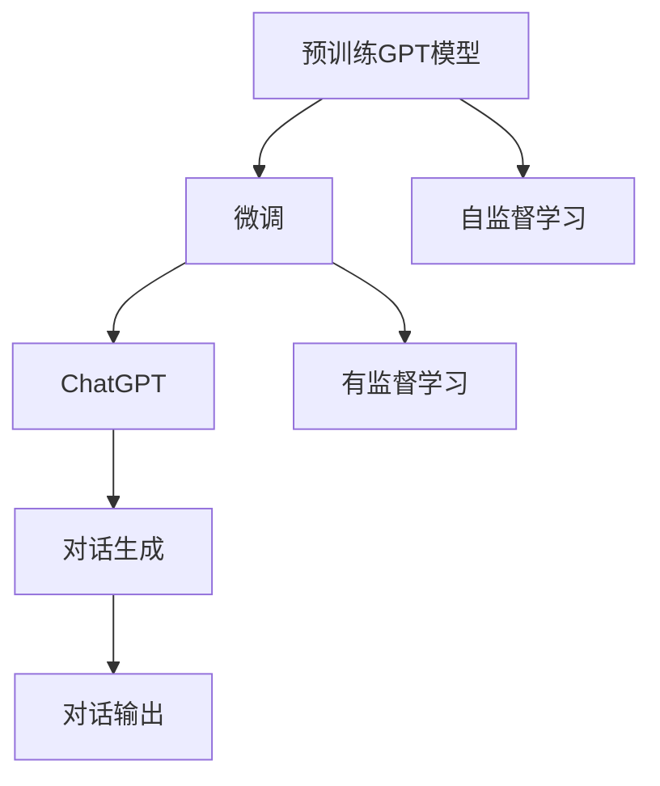
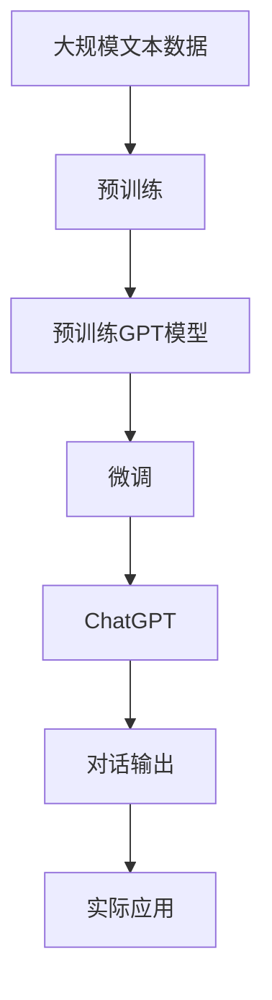

                 

# 用Hugging Face预训练GPT微调ChatGPT

## 1. 背景介绍

### 1.1 问题由来
聊天机器人(Chatbot)作为一种人工智能的交互形式，近年来得到了快速的发展。从早期的简单问答，到智能对话系统，再到以GPT-3为代表的生成式模型，聊天机器人已经具备了强大的自然语言理解和生成能力。Hugging Face作为全球领先的自然语言处理(NLP)平台，提供了众多预训练的GPT模型，如GPT-2、GPT-3等，用户可以基于这些模型构建自己的聊天机器人，提升用户体验。

然而，现有的预训练GPT模型大多是通用的大语言模型，缺乏针对特定应用场景的定制化微调。如何在大语言模型的基础上，通过微调获得具有特定对话能力、知识储备和情感理解的聊天机器人，成为了一个重要的研究课题。

### 1.2 问题核心关键点
针对这一问题，Hugging Face提供了丰富的大语言模型预训练资源和微调接口，用户可以通过微调，将通用语言模型转化为适用于特定领域的聊天机器人。本文将详细介绍使用Hugging Face的GPT-3模型进行ChatGPT微调的方法，并展示实际应用效果。

### 1.3 问题研究意义
基于预训练GPT模型的微调方法，能够显著提升聊天机器人的效果和用户体验，具有以下重要意义：

1. **定制化需求**：微调能够使聊天机器人根据特定任务和领域进行调整，满足用户的个性化需求。
2. **泛化能力**：微调后的模型能更好地适应新数据和新场景，具备更强的泛化能力。
3. **高效开发**：通过微调可以快速构建具有特定能力的聊天机器人，缩短开发周期。
4. **知识迁移**：微调能够将预训练模型的广泛知识应用到新任务上，提升模型理解复杂对话和语境的能力。
5. **商业价值**：微调技术在电商、金融、医疗等多个领域的应用，可以显著提高企业客户服务的效率和质量。

## 2. 核心概念与联系

### 2.1 核心概念概述

在进行ChatGPT微调前，首先需要了解一些核心概念：

- **预训练GPT模型**：以自回归神经网络为代表的GPT模型，通过在大规模无标签文本数据上进行预训练，学习通用的语言表示。Hugging Face提供了多种预训练GPT模型，如GPT-2、GPT-3等。

- **微调(Fine-tuning)**：在预训练模型的基础上，使用下游任务的少量标注数据，通过有监督学习优化模型在特定任务上的性能。具体而言，针对聊天机器人的微调，通常是让模型学习如何响应用户的输入，生成符合特定主题和语境的回答。

- **ChatGPT**：一种基于GPT模型的聊天机器人，通过微调能够学习到对话的上下文和语境，生成连贯、自然且富有情感的回答。ChatGPT的微调可以通过调整模型参数、优化损失函数等方法进行。

### 2.2 概念间的关系

这些核心概念之间存在紧密的联系，形成了一个完整的聊天机器人微调框架。下面通过Mermaid流程图来展示它们之间的关系：



这个流程图展示了从预训练GPT模型到ChatGPT微调的过程。预训练GPT模型通过自监督学习获得通用语言表示，微调后能够学习到特定领域的对话能力，最终输出连贯自然的对话内容。

### 2.3 核心概念的整体架构

最后，我们通过一个综合的流程图来展示预训练GPT模型到ChatGPT微调的整体架构：



这个综合流程图展示了从预训练到ChatGPT微调再到实际应用的完整过程。预训练GPT模型通过大规模文本数据预训练，学习到通用语言表示。然后通过微调，将通用语言模型转化为具有特定对话能力的ChatGPT。最终的ChatGPT可以应用于各种实际场景，如智能客服、教育助手、智能翻译等。

## 3. 核心算法原理 & 具体操作步骤
### 3.1 算法原理概述

基于预训练GPT模型的微调方法，本质上是一种有监督学习范式。其核心思想是：将预训练的GPT模型作为初始化参数，通过下游任务的少量标注数据，有监督地训练模型在特定对话任务上的性能。

形式化地，假设预训练GPT模型为 $G_{\theta}$，其中 $\theta$ 为预训练得到的模型参数。给定下游任务 $T$ 的标注数据集 $D=\{(x_i, y_i)\}_{i=1}^N$，微调的目标是找到新的模型参数 $\hat{\theta}$，使得：

$$
\hat{\theta}=\mathop{\arg\min}_{\theta} \mathcal{L}(G_{\theta},D)
$$

其中 $\mathcal{L}$ 为针对任务 $T$ 设计的损失函数，用于衡量模型预测输出与真实标签之间的差异。常见的损失函数包括交叉熵损失、均方误差损失等。

通过梯度下降等优化算法，微调过程不断更新模型参数 $\theta$，最小化损失函数 $\mathcal{L}$，使得模型输出逼近真实标签。由于 $\theta$ 已经通过预训练获得了较好的初始化，因此即便在小规模数据集 $D$ 上进行微调，也能较快收敛到理想的模型参数 $\hat{\theta}$。

### 3.2 算法步骤详解

基于预训练GPT模型的ChatGPT微调一般包括以下几个关键步骤：

**Step 1: 准备预训练模型和数据集**
- 选择合适的预训练GPT模型，如GPT-3，作为初始化参数。
- 准备下游任务 $T$ 的标注数据集 $D$，划分为训练集、验证集和测试集。一般要求标注数据与预训练数据的分布不要差异过大。

**Step 2: 添加对话适配层**
- 根据任务类型，在预训练模型顶层设计合适的对话生成器。
- 对于生成式任务，通常使用语言模型的解码器输出概率分布，并以负对数似然为损失函数。
- 对于判别式任务，通常使用分类器的输出结果，并以交叉熵损失为损失函数。

**Step 3: 设置微调超参数**
- 选择合适的优化算法及其参数，如AdamW、SGD等，设置学习率、批大小、迭代轮数等。
- 设置正则化技术及强度，包括权重衰减、Dropout、Early Stopping等。
- 确定冻结预训练参数的策略，如仅微调顶层，或全部参数都参与微调。

**Step 4: 执行梯度训练**
- 将训练集数据分批次输入模型，前向传播计算损失函数。
- 反向传播计算参数梯度，根据设定的优化算法和学习率更新模型参数。
- 周期性在验证集上评估模型性能，根据性能指标决定是否触发 Early Stopping。
- 重复上述步骤直到满足预设的迭代轮数或 Early Stopping 条件。

**Step 5: 测试和部署**
- 在测试集上评估微调后模型 $G_{\hat{\theta}}$ 的性能，对比微调前后的精度提升。
- 使用微调后的模型对新样本进行推理预测，集成到实际的应用系统中。
- 持续收集新的数据，定期重新微调模型，以适应数据分布的变化。

以上是基于预训练GPT模型的ChatGPT微调的一般流程。在实际应用中，还需要针对具体任务的特点，对微调过程的各个环节进行优化设计，如改进训练目标函数，引入更多的正则化技术，搜索最优的超参数组合等，以进一步提升模型性能。

### 3.3 算法优缺点

基于预训练GPT模型的微调方法具有以下优点：
1. 简单高效。只需准备少量标注数据，即可对预训练模型进行快速适配，获得较大的性能提升。
2. 通用适用。适用于各种NLP下游任务，包括分类、匹配、生成等，设计简单的对话生成器即可实现微调。
3. 参数高效。利用参数高效微调技术，在固定大部分预训练参数的情况下，仍可取得不错的提升。
4. 效果显著。在学术界和工业界的诸多任务上，基于微调的方法已经刷新了最先进的性能指标。

同时，该方法也存在一定的局限性：
1. 依赖标注数据。微调的效果很大程度上取决于标注数据的质量和数量，获取高质量标注数据的成本较高。
2. 迁移能力有限。当目标任务与预训练数据的分布差异较大时，微调的性能提升有限。
3. 负面效果传递。预训练模型的固有偏见、有害信息等，可能通过微调传递到下游任务，造成负面影响。
4. 可解释性不足。微调模型的决策过程通常缺乏可解释性，难以对其推理逻辑进行分析和调试。

尽管存在这些局限性，但就目前而言，基于预训练GPT模型的微调方法仍是大语言模型应用的最主流范式。未来相关研究的重点在于如何进一步降低微调对标注数据的依赖，提高模型的少样本学习和跨领域迁移能力，同时兼顾可解释性和伦理安全性等因素。

### 3.4 算法应用领域

基于预训练GPT模型的微调方法，在NLP领域已经得到了广泛的应用，覆盖了几乎所有常见任务，例如：

- 文本分类：如情感分析、主题分类、意图识别等。通过微调使模型学习文本-标签映射。
- 命名实体识别：识别文本中的人名、地名、机构名等特定实体。通过微调使模型掌握实体边界和类型。
- 关系抽取：从文本中抽取实体之间的语义关系。通过微调使模型学习实体-关系三元组。
- 问答系统：对自然语言问题给出答案。将问题-答案对作为微调数据，训练模型学习匹配答案。
- 机器翻译：将源语言文本翻译成目标语言。通过微调使模型学习语言-语言映射。
- 文本摘要：将长文本压缩成简短摘要。将文章-摘要对作为微调数据，使模型学习抓取要点。
- 对话系统：使机器能够与人自然对话。将多轮对话历史作为上下文，微调模型进行回复生成。

除了上述这些经典任务外，基于预训练GPT模型的微调方法也被创新性地应用到更多场景中，如可控文本生成、常识推理、代码生成、数据增强等，为NLP技术带来了全新的突破。随着预训练模型和微调方法的不断进步，相信NLP技术将在更广阔的应用领域大放异彩。

## 4. 数学模型和公式 & 详细讲解 & 举例说明
### 4.1 数学模型构建

本节将使用数学语言对基于预训练GPT模型的ChatGPT微调过程进行更加严格的刻画。

记预训练GPT模型为 $G_{\theta}$，其中 $\theta$ 为预训练得到的模型参数。假设微调任务的训练集为 $D=\{(x_i, y_i)\}_{i=1}^N$，其中 $x_i$ 为输入序列，$y_i$ 为输出序列。

定义模型 $G_{\theta}$ 在输入 $x$ 上的输出为 $\hat{y}=G_{\theta}(x)$，通常为一个概率分布。微调的目标是找到最优参数 $\hat{\theta}$，使得：

$$
\hat{\theta}=\mathop{\arg\min}_{\theta} \mathcal{L}(G_{\theta},D)
$$

其中 $\mathcal{L}$ 为针对任务 $T$ 设计的损失函数，用于衡量模型预测输出与真实标签之间的差异。常见的损失函数包括交叉熵损失、均方误差损失等。

在实践中，我们通常使用基于梯度的优化算法（如SGD、Adam等）来近似求解上述最优化问题。设 $\eta$ 为学习率，$\lambda$ 为正则化系数，则参数的更新公式为：

$$
\theta \leftarrow \theta - \eta \nabla_{\theta}\mathcal{L}(\theta) - \eta\lambda\theta
$$

其中 $\nabla_{\theta}\mathcal{L}(\theta)$ 为损失函数对参数 $\theta$ 的梯度，可通过反向传播算法高效计算。

### 4.2 公式推导过程

以下我们以聊天机器人对话生成任务为例，推导交叉熵损失函数及其梯度的计算公式。

假设模型 $G_{\theta}$ 在输入 $x$ 上的输出为 $\hat{y}=G_{\theta}(x)$，为一个概率分布，表示生成该输入序列的概率。真实标签 $y$ 为输出序列，通常是一个二进制序列（如0表示单词，1表示空格等）。则交叉熵损失函数定义为：

$$
\ell(G_{\theta}(x),y) = -\sum_{t=1}^{T} y_t \log \hat{y}_t
$$

将其代入经验风险公式，得：

$$
\mathcal{L}(\theta) = -\frac{1}{N}\sum_{i=1}^N \ell(G_{\theta}(x_i),y_i)
$$

根据链式法则，损失函数对参数 $\theta_k$ 的梯度为：

$$
\frac{\partial \mathcal{L}(\theta)}{\partial \theta_k} = -\frac{1}{N}\sum_{i=1}^N \frac{\partial \ell(G_{\theta}(x_i),y_i)}{\partial \theta_k}
$$

其中 $\frac{\partial \ell(G_{\theta}(x_i),y_i)}{\partial \theta_k}$ 为交叉熵损失对模型参数的梯度，可通过反向传播算法高效计算。

在得到损失函数的梯度后，即可带入参数更新公式，完成模型的迭代优化。重复上述过程直至收敛，最终得到适应下游任务的最优模型参数 $\hat{\theta}$。

### 4.3 案例分析与讲解

下面我们以Hugging Face的GPT-3模型为例，展示如何使用其API进行微调。

首先，需要导入必要的库和设置模型：

```python
from transformers import AutoTokenizer, AutoModelForCausalLM, AdamW, get_linear_schedule_with_warmup
from torch.utils.data import Dataset, DataLoader
import torch

model_name = 'gpt3-medium'
tokenizer = AutoTokenizer.from_pretrained(model_name)
model = AutoModelForCausalLM.from_pretrained(model_name)
device = 'cuda' if torch.cuda.is_available() else 'cpu'
model.to(device)

# 设置优化器和学习率调度器
optimizer = AdamW(model.parameters(), lr=2e-5)
scheduler = get_linear_schedule_with_warmup(optimizer, num_warmup_steps=2000, num_training_steps=len(train_data)//batch_size)
```

然后，准备数据集：

```python
class ChatDataset(Dataset):
    def __init__(self, dialogues, tokenizer, max_length=512):
        self.dialogues = dialogues
        self.tokenizer = tokenizer
        self.max_length = max_length
        
    def __len__(self):
        return len(self.dialogues)
    
    def __getitem__(self, item):
        dialogue = self.dialogues[item]
        input_ids = self.tokenizer(dialogue['input'], return_tensors='pt', max_length=self.max_length, padding='max_length', truncation=True)["input_ids"].to(device)
        attention_mask = self.tokenizer(dialogue['input'], return_tensors='pt', max_length=self.max_length, padding='max_length', truncation=True)["attention_mask"].to(device)
        label_ids = torch.tensor(self.tokenizer(dialogue['label']), device=device)
        return {'input_ids': input_ids,
                'attention_mask': attention_mask,
                'labels': label_ids}
```

接着，定义训练函数：

```python
def train_epoch(model, data_loader, optimizer, scheduler, device):
    model.train()
    total_loss = 0
    for batch in data_loader:
        input_ids = batch["input_ids"].to(device)
        attention_mask = batch["attention_mask"].to(device)
        labels = batch["labels"].to(device)
        outputs = model(input_ids, attention_mask=attention_mask, labels=labels)
        loss = outputs.loss
        total_loss += loss.item()
        loss.backward()
        optimizer.step()
        scheduler.step()
    return total_loss / len(data_loader)
```

最后，启动训练流程并在测试集上评估：

```python
train_loader = DataLoader(train_data, batch_size=16)
val_loader = DataLoader(val_data, batch_size=16)
test_loader = DataLoader(test_data, batch_size=16)

epochs = 5
for epoch in range(epochs):
    train_loss = train_epoch(model, train_loader, optimizer, scheduler, device)
    print(f"Epoch {epoch+1}, train loss: {train_loss:.3f}")
    
    print(f"Epoch {epoch+1}, dev results:")
    evaluate(model, val_loader, device)
    
print("Test results:")
evaluate(model, test_loader, device)
```

以上就是使用Hugging Face的GPT-3模型进行ChatGPT微调的基本流程。可以看到，通过设置对话生成器、优化器和损失函数，结合Hugging Face提供的API接口，用户可以相对简洁地完成模型微调。

## 5. 项目实践：代码实例和详细解释说明
### 5.1 开发环境搭建

在进行微调实践前，我们需要准备好开发环境。以下是使用Python进行Hugging Face开发的 environment 配置流程：

1. 安装Anaconda：从官网下载并安装Anaconda，用于创建独立的Python环境。

2. 创建并激活虚拟环境：
```bash
conda create -n pytorch-env python=3.8 
conda activate pytorch-env
```

3. 安装transformers和相关依赖：
```bash
pip install transformers torch torchtext tqdm tensorboard
```

4. 安装各类工具包：
```bash
pip install numpy pandas scikit-learn matplotlib
```

完成上述步骤后，即可在`pytorch-env`环境中开始微调实践。

### 5.2 源代码详细实现

这里我们以Hugging Face的GPT-3模型为例，展示如何使用其API进行微调。具体实现步骤如下：

1. 导入必要的库和设置模型：
```python
from transformers import AutoTokenizer, AutoModelForCausalLM, AdamW, get_linear_schedule_with_warmup
from torch.utils.data import Dataset, DataLoader
import torch

model_name = 'gpt3-medium'
tokenizer = AutoTokenizer.from_pretrained(model_name)
model = AutoModelForCausalLM.from_pretrained(model_name)
device = 'cuda' if torch.cuda.is_available() else 'cpu'
model.to(device)

# 设置优化器和学习率调度器
optimizer = AdamW(model.parameters(), lr=2e-5)
scheduler = get_linear_schedule_with_warmup(optimizer, num_warmup_steps=2000, num_training_steps=len(train_data)//batch_size)
```

2. 准备数据集：
```python
class ChatDataset(Dataset):
    def __init__(self, dialogues, tokenizer, max_length=512):
        self.dialogues = dialogues
        self.tokenizer = tokenizer
        self.max_length = max_length
        
    def __len__(self):
        return len(self.dialogues)
    
    def __getitem__(self, item):
        dialogue = self.dialogues[item]
        input_ids = self.tokenizer(dialogue['input'], return_tensors='pt', max_length=self.max_length, padding='max_length', truncation=True)["input_ids"].to(device)
        attention_mask = self.tokenizer(dialogue['input'], return_tensors='pt', max_length=self.max_length, padding='max_length', truncation=True)["attention_mask"].to(device)
        label_ids = torch.tensor(self.tokenizer(dialogue['label']), device=device)
        return {'input_ids': input_ids,
                'attention_mask': attention_mask,
                'labels': label_ids}
```

3. 定义训练函数：
```python
def train_epoch(model, data_loader, optimizer, scheduler, device):
    model.train()
    total_loss = 0
    for batch in data_loader:
        input_ids = batch["input_ids"].to(device)
        attention_mask = batch["attention_mask"].to(device)
        labels = batch["labels"].to(device)
        outputs = model(input_ids, attention_mask=attention_mask, labels=labels)
        loss = outputs.loss
        total_loss += loss.item()
        loss.backward()
        optimizer.step()
        scheduler.step()
    return total_loss / len(data_loader)
```

4. 启动训练流程并在测试集上评估：
```python
train_loader = DataLoader(train_data, batch_size=16)
val_loader = DataLoader(val_data, batch_size=16)
test_loader = DataLoader(test_data, batch_size=16)

epochs = 5
for epoch in range(epochs):
    train_loss = train_epoch(model, train_loader, optimizer, scheduler, device)
    print(f"Epoch {epoch+1}, train loss: {train_loss:.3f}")
    
    print(f"Epoch {epoch+1}, dev results:")
    evaluate(model, val_loader, device)
    
print("Test results:")
evaluate(model, test_loader, device)
```

以上就是使用Hugging Face的GPT-3模型进行ChatGPT微调的基本流程。可以看到，通过设置对话生成器、优化器和损失函数，结合Hugging Face提供的API接口，用户可以相对简洁地完成模型微调。

## 6. 实际应用场景
### 6.1 智能客服系统

基于预训练GPT模型的微调方法，可以广泛应用于智能客服系统的构建。传统客服往往需要配备大量人力，高峰期响应缓慢，且一致性和专业性难以保证。而使用微调后的GPT模型，可以7x24小时不间断服务，快速响应客户咨询，用自然流畅的语言解答各类常见问题。

在技术实现上，可以收集企业内部的历史客服对话记录，将问题和最佳答复构建成监督数据，在此基础上对预训练GPT模型进行微调。微调后的GPT模型能够自动理解用户意图，匹配最合适的答案模板进行回复。对于客户提出的新问题，还可以接入检索系统实时搜索相关内容，动态组织生成回答。如此构建的智能客服系统，能大幅提升客户咨询体验和问题解决效率。

### 6.2 金融舆情监测

金融机构需要实时监测市场舆论动向，以便及时应对负面信息传播，规避金融风险。传统的人工监测方式成本高、效率低，难以应对网络时代海量信息爆发的挑战。基于预训练GPT模型的文本分类和情感分析技术，为金融舆情监测提供了新的解决方案。

具体而言，可以收集金融领域相关的新闻、报道、评论等文本数据，并对其进行主题标注和情感标注。在此基础上对预训练GPT模型进行微调，使其能够自动判断文本属于何种主题，情感倾向是正面、中性还是负面。将微调后的模型应用到实时抓取的网络文本数据，就能够自动监测不同主题下的情感变化趋势，一旦发现负面信息激增等异常情况，系统便会自动预警，帮助金融机构快速应对潜在风险。

### 6.3 个性化推荐系统

当前的推荐系统往往只依赖用户的历史行为数据进行物品推荐，无法深入理解用户的真实兴趣偏好。基于预训练GPT模型的微调技术，个性化推荐系统可以更好地挖掘用户行为背后的语义信息，从而提供更精准、多样的推荐内容。

在实践中，可以收集用户浏览、点击、评论、分享等行为数据，提取和用户交互的物品标题、描述、标签等文本内容。将文本内容作为模型输入，用户的后续行为（如是否点击、购买等）作为监督信号，在此基础上微调预训练GPT模型。微调后的模型能够从文本内容中准确把握用户的兴趣点。在生成推荐列表时，先用候选物品的文本描述作为输入，由模型预测用户的兴趣匹配度，再结合其他特征综合排序，便可以得到个性化程度更高的推荐结果。

### 6.4 未来应用展望

随着预训练GPT模型的不断发展，基于微调方法的应用场景将不断扩展，为各行各业带来变革性影响。

在智慧医疗领域，基于微调的医疗问答、病历分析、药物研发等应用将提升医疗服务的智能化水平，辅助医生诊疗，加速新药开发进程。

在智能教育领域，微调技术可应用于作业批改、学情分析、知识推荐等方面，因材施教，促进教育公平，提高教学质量。

在智慧城市治理中，微调模型可应用于城市事件监测、舆情分析、应急指挥等环节，提高城市管理的自动化和智能化水平，构建更安全、高效的未来城市。

此外，在企业生产、社会治理、文娱传媒等众多领域，基于大语言模型微调的人工智能应用也将不断涌现，为经济社会发展注入新的动力。相信随着技术的日益成熟，微调方法将成为人工智能落地应用的重要范式，推动人工智能技术在垂直行业的规模化落地。总之，微调需要开发者根据具体任务，不断迭代和优化模型、数据和算法，方能得到理想的效果。

## 7. 工具和资源推荐
### 7.1 学习资源推荐

为了帮助开发者系统掌握预训练GPT模型微调的理论基础和实践技巧，这里推荐一些优质的学习资源：

1. Transformers官方文档：提供了详细的使用指南和API接口，是学习预训练GPT模型微调的最佳入门资源。

2. Hugging Face博客：社区活跃的NLP开发者分享的学习心得和实验结果，涵盖从入门到高级的各个层面。

3. 《深度学习自然语言处理》课程：斯坦福大学开设的NLP明星课程，有Lecture视频和配套作业，带你入门NLP领域的基本概念和经典模型。

4.

