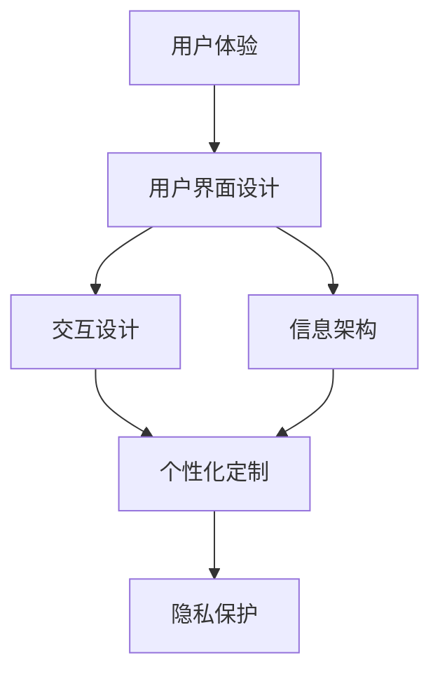
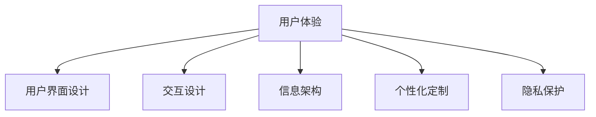
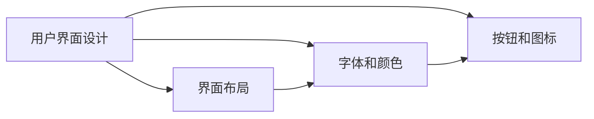
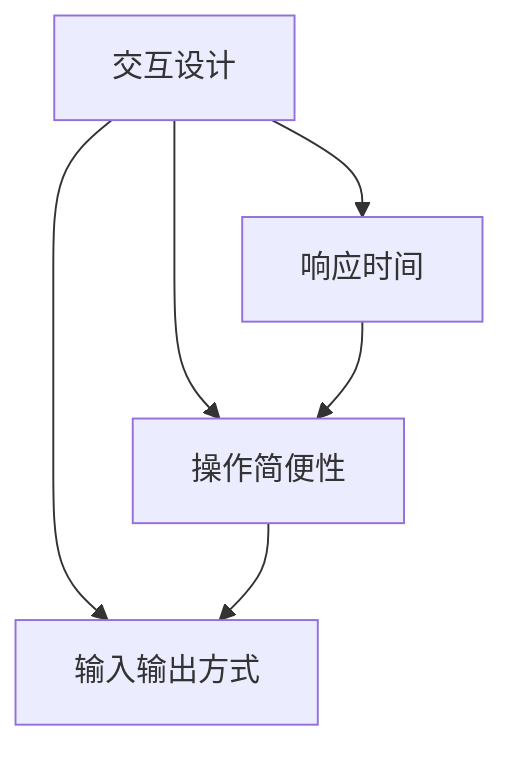
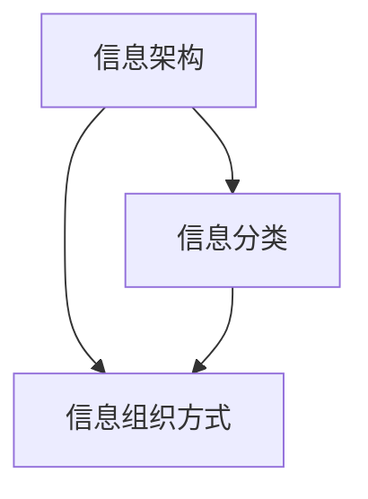
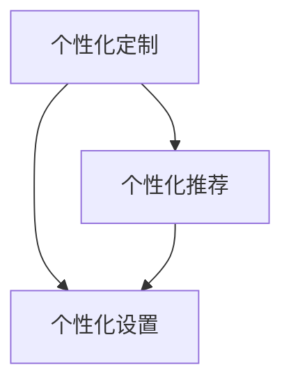
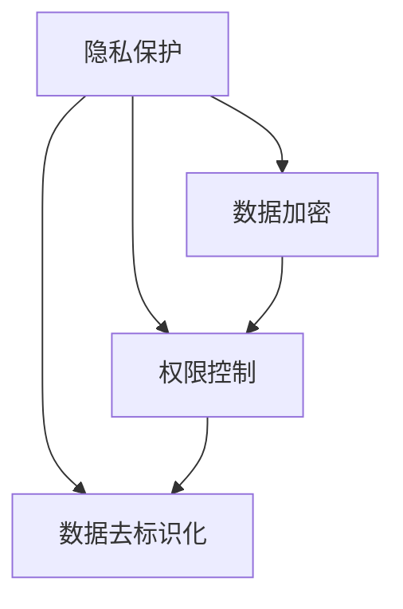
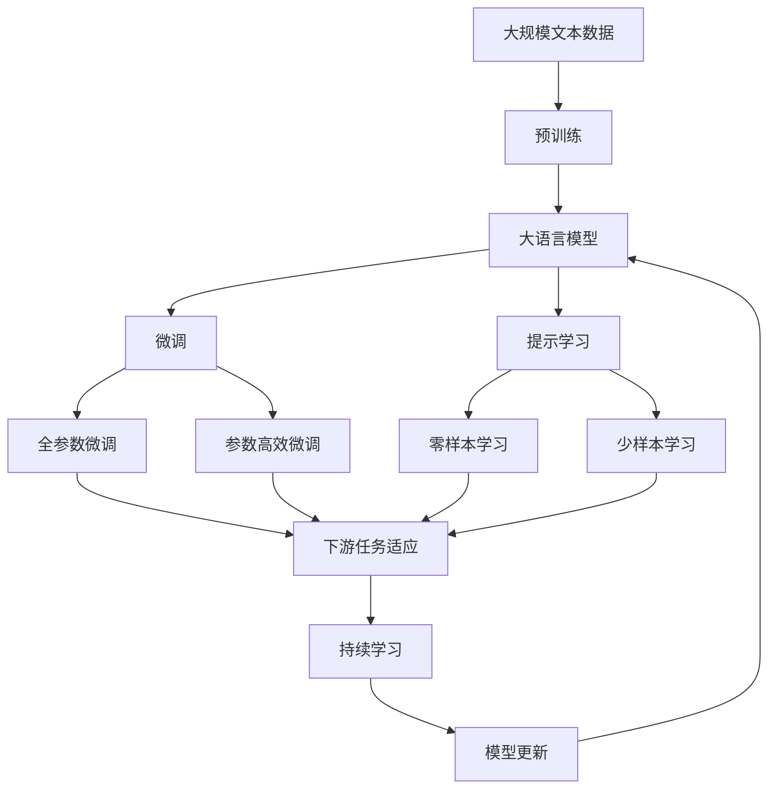

                 

## 1. 背景介绍

随着信息技术的发展，计算已经渗透到了我们生活的方方面面，无论是智能家居、车载系统、移动应用，还是企业办公、远程协作，计算都在为我们的日常生活和工作提供便利。然而，尽管计算技术的进步让我们的生活变得更加便捷，但在用户与计算系统的交互过程中，用户满意度并未得到充分保障。在追求效率和功能的同时，我们往往忽视了用户体验的重要性。

用户体验（User Experience，简称 UX）是指用户在使用产品或服务过程中的感受和满意度。良好的用户体验不仅能提升用户满意度和忠诚度，还能促进产品的市场竞争力。在计算技术迅速发展的今天，如何设计出既高效又友好的用户计算系统，成为摆在企业和开发者面前的重要课题。

### 1.1 问题由来

在过去的几十年中，计算技术的迅猛发展带来了诸多变革，然而在用户体验方面，依然存在诸多问题。这些问题主要包括：

- **界面复杂**：许多计算系统虽然功能强大，但由于界面复杂，用户往往难以上手。
- **操作不便**：许多计算系统操作繁琐，用户需要花费大量时间学习使用方法。
- **反馈延迟**：许多计算系统响应时间过长，用户等待过程中会产生挫败感。
- **信息过载**：许多计算系统信息量过大，用户难以迅速找到所需信息。
- **交互不便**：许多计算系统输入输出方式单一，难以满足用户的个性化需求。
- **隐私问题**：许多计算系统对用户隐私保护不足，容易引发隐私泄露和数据安全问题。

这些问题不仅影响了用户的使用体验，还可能导致用户流失，甚至对品牌形象造成负面影响。因此，如何提升用户体验，成为计算技术发展过程中不可或缺的一环。

### 1.2 问题核心关键点

用户体验的核心在于如何平衡功能、效率和人性化的设计，提升用户在使用过程中的满意度和舒适度。为了达到这一目标，我们需要从以下几个方面进行改进：

- **用户界面设计**：简洁直观，易于理解和使用。
- **交互设计**：响应灵敏，操作简便，减少用户等待时间。
- **信息组织**：条理清晰，逻辑合理，方便用户查找信息。
- **个性化定制**：满足用户个性化需求，提供差异化服务。
- **隐私保护**：严格遵循隐私政策，确保用户数据安全。

## 2. 核心概念与联系

### 2.1 核心概念概述

为更好地理解如何通过计算提升用户体验，本节将介绍几个密切相关的核心概念：

- **用户体验（User Experience，UX）**：指用户在使用产品或服务过程中的感受和满意度。良好的用户体验不仅能提升用户满意度和忠诚度，还能促进产品的市场竞争力。

- **用户界面设计（User Interface Design，UI）**：指设计易于理解和使用、直观美观的用户界面。UI设计是提升用户体验的重要环节。

- **交互设计（Interaction Design）**：指设计高效、灵敏、人性化的用户交互方式。交互设计直接影响用户的响应速度和操作体验。

- **信息架构（Information Architecture）**：指组织和呈现信息的方式，以便用户能够迅速找到所需信息。信息架构是用户体验的基础。

- **个性化定制（Personalization）**：指根据用户偏好提供个性化推荐和定制服务。个性化定制能够提升用户的满意度和黏性。

- **隐私保护（Privacy Protection）**：指在产品设计中严格遵循隐私政策，确保用户数据安全。隐私保护是用户体验的重要组成部分。

这些核心概念之间的逻辑关系可以通过以下Mermaid流程图来展示：



这个流程图展示了几大核心概念之间的相互关系：用户体验由用户界面设计、交互设计、信息架构、个性化定制和隐私保护等多个环节共同组成。每个环节都对提升用户体验起着重要作用。

### 2.2 概念间的关系

这些核心概念之间存在着紧密的联系，形成了用户体验提升的完整生态系统。下面我们通过几个Mermaid流程图来展示这些概念之间的关系。

#### 2.2.1 用户体验的组成



这个流程图展示了用户体验由多个环节组成，每个环节都直接影响用户体验的整体效果。

#### 2.2.2 用户界面设计



这个流程图展示了用户界面设计包括界面布局、字体和颜色、按钮和图标等多个子环节。每个子环节都对界面的美观和易用性有着直接影响。

#### 2.2.3 交互设计



这个流程图展示了交互设计包括响应时间、操作简便性和输入输出方式等多个子环节。每个子环节都直接影响用户的响应速度和操作体验。

#### 2.2.4 信息架构



这个流程图展示了信息架构包括信息分类和信息组织方式等多个子环节。每个子环节都对信息的条理清晰和逻辑合理性有着直接影响。

#### 2.2.5 个性化定制



这个流程图展示了个性化定制包括个性化推荐和个性化设置等多个子环节。每个子环节都对个性化服务的丰富度和灵活性有着直接影响。

#### 2.2.6 隐私保护



这个流程图展示了隐私保护包括数据加密、权限控制和数据去标识化等多个子环节。每个子环节都对用户数据的安全性和隐私保护有着直接影响。

### 2.3 核心概念的整体架构

最后，我们用一个综合的流程图来展示这些核心概念在大语言模型微调过程中的整体架构：



这个综合流程图展示了从预训练到微调，再到持续学习的完整过程。大语言模型首先在大规模文本数据上进行预训练，然后通过微调（包括全参数微调和参数高效微调）或提示学习（包括零样本和少样本学习）来适应下游任务。最后，通过持续学习技术，模型可以不断学习新知识，同时避免遗忘旧知识。 通过这些流程图，我们可以更清晰地理解用户体验提升过程中各个核心概念的关系和作用，为后续深入讨论具体的用户体验提升方法奠定基础。

## 3. 核心算法原理 & 具体操作步骤
### 3.1 算法原理概述

提升用户体验的算法原理主要基于以下几个核心思想：

- **简化界面设计**：通过减少复杂元素和冗余信息，简化用户界面设计，使操作更加直观和易于理解。
- **优化交互设计**：通过减少操作步骤和响应延迟，优化交互设计，提升用户操作的灵敏度和满意度。
- **合理组织信息**：通过条理清晰、逻辑合理的组织方式，帮助用户快速找到所需信息，减少信息过载。
- **个性化定制**：通过分析用户行为和偏好，提供个性化推荐和定制服务，提升用户的满意度和黏性。
- **保护用户隐私**：通过严格的数据保护措施，确保用户数据的安全性和隐私性。

这些核心思想构成了用户体验提升的基本框架，使得用户在使用计算系统时能够获得更好的感受和满意度。

### 3.2 算法步骤详解

提升用户体验的算法步骤主要包括以下几个关键步骤：

**Step 1: 收集用户体验反馈**

- 通过用户调查、问卷、焦点小组等方式，收集用户对现有系统的使用体验反馈。
- 使用数据分析工具，如Google Analytics、Mixpanel等，跟踪用户在系统中的行为和交互数据。

**Step 2: 数据分析与问题定位**

- 使用统计分析和数据挖掘技术，分析收集到的用户体验反馈数据，找出用户常见的问题和痛点。
- 通过用户行为数据的聚类分析，识别出用户的典型使用场景和需求。

**Step 3: 界面和交互设计优化**

- 基于问题定位和用户需求，对现有系统进行界面和交互设计优化，简化界面设计，优化交互流程。
- 引入现代化的设计元素，如响应式设计、自适应布局、动画效果等，提升用户体验的直观性和美观性。

**Step 4: 信息架构优化**

- 重新设计信息分类和组织方式，使用户能够更快速、更准确地找到所需信息。
- 优化搜索和推荐算法，提升信息检索的效率和准确性。

**Step 5: 个性化定制与推荐**

- 根据用户的历史行为和偏好，提供个性化推荐和定制服务。
- 使用机器学习和人工智能技术，分析用户数据，预测用户需求，优化个性化推荐策略。

**Step 6: 隐私保护与数据安全**

- 使用数据加密、权限控制、数据去标识化等技术，确保用户数据的安全性和隐私性。
- 遵循相关的隐私政策法规，如GDPR、CCPA等，确保用户数据的合规性和透明性。

**Step 7: 持续监控与优化**

- 持续监控用户的使用数据和反馈，及时发现问题并进行优化。
- 定期评估用户体验指标，如任务完成时间、用户满意度等，确保用户体验持续改进。

以上是提升用户体验的主要算法步骤。通过这些步骤，可以系统地提升用户在使用计算系统时的满意度。

### 3.3 算法优缺点

提升用户体验的算法具有以下优点：

- **提升用户满意度**：通过优化界面和交互设计、合理组织信息、提供个性化定制和保护隐私等措施，显著提升用户的满意度和忠诚度。
- **降低用户流失率**：通过提升用户体验，减少用户在使用过程中遇到的障碍和问题，从而降低用户流失率。
- **提高用户参与度**：通过个性化推荐和定制服务，提升用户的使用兴趣和参与度，增加系统的活跃度和粘性。

同时，这些算法也存在一些缺点：

- **复杂度较高**：涉及多个环节的优化，实施复杂度较高，需要跨部门协作和多个技术团队的合作。
- **成本较高**：优化用户体验往往需要投入大量的人力和财力，特别是在大规模产品上线前。
- **效果难以量化**：用户体验的提升效果难以用数据量化，很难直接评估用户满意度的提升。

尽管如此，提升用户体验是计算技术发展的必然趋势，企业需要重视并持续投入，才能在激烈的市场竞争中保持领先地位。

### 3.4 算法应用领域

提升用户体验的算法已经在多个领域得到了广泛应用，主要包括：

- **智能家居**：通过优化交互设计和信息架构，提升用户对智能家居设备的使用体验。
- **车载系统**：通过个性化定制和隐私保护，提升用户对车载信息娱乐系统的使用体验。
- **移动应用**：通过简化界面设计和优化交互流程，提升用户对移动应用的满意度。
- **企业办公**：通过合理组织信息和提供个性化定制，提升员工对企业办公系统的使用体验。
- **远程协作**：通过优化界面设计、提高响应速度和保护隐私，提升用户对远程协作工具的使用体验。

除了这些常见领域外，提升用户体验的算法还在医疗、金融、教育等多个领域得到了应用，推动了计算技术的普及和应用。

## 4. 数学模型和公式 & 详细讲解 & 举例说明
### 4.1 数学模型构建

提升用户体验的算法主要基于用户体验指标和用户行为数据构建数学模型。用户体验指标包括任务完成时间、用户满意度、用户流失率等，用户行为数据包括点击次数、停留时间、页面跳转等。

### 4.2 公式推导过程

以下我们以任务完成时间为目标指标，推导提升用户体验的数学模型。

设用户完成任务所需时间为 $T$，包括界面设计时间 $T_{UI}$、交互设计时间 $T_{I/O}$、信息架构时间 $T_{IA}$、个性化定制时间 $T_{PC}$ 和隐私保护时间 $T_{PP}$。则用户完成任务所需时间的公式为：

$$
T = T_{UI} + T_{I/O} + T_{IA} + T_{PC} + T_{PP}
$$

为了提升用户体验，需要最小化用户完成任务所需时间 $T$。基于此，可以构建如下优化目标函数：

$$
\min_{T_{UI}, T_{I/O}, T_{IA}, T_{PC}, T_{PP}} T
$$

### 4.3 案例分析与讲解

以一款智能家居控制系统为例，该系统需要用户通过手机APP控制家中设备。在优化用户体验的过程中，可以采取以下措施：

- **简化界面设计**：去除不必要的按钮和信息，增加智能设备的图标和描述，简化用户界面设计。
- **优化交互设计**：增加语音控制和手势控制功能，减少用户的操作步骤，提高操作效率。
- **合理组织信息**：按照设备类型和功能分类，对设备信息进行分组，方便用户查找。
- **个性化定制**：根据用户的使用习惯，提供个性化推荐，如智能设备的使用时间、节能模式等。
- **隐私保护**：使用数据加密和权限控制，确保用户设备数据的安全性。

通过上述优化措施，可以显著提升用户使用智能家居控制系统的体验。

## 5. 项目实践：代码实例和详细解释说明
### 5.1 开发环境搭建

在进行用户体验提升实践前，我们需要准备好开发环境。以下是使用Python进行PyTorch开发的环境配置流程：

1. 安装Anaconda：从官网下载并安装Anaconda，用于创建独立的Python环境。

2. 创建并激活虚拟环境：
```bash
conda create -n user-env python=3.8 
conda activate user-env
```

3. 安装PyTorch：根据CUDA版本，从官网获取对应的安装命令。例如：
```bash
conda install pytorch torchvision torchaudio cudatoolkit=11.1 -c pytorch -c conda-forge
```

4. 安装各类工具包：
```bash
pip install numpy pandas scikit-learn matplotlib tqdm jupyter notebook ipython
```

完成上述步骤后，即可在`user-env`环境中开始用户体验提升实践。

### 5.2 源代码详细实现

下面我们以优化一个智能家居控制系统的界面和交互设计为例，给出使用PyTorch进行用户体验优化的PyTorch代码实现。

首先，定义用户界面设计的函数：

```python
from torch.utils.data import Dataset
import torch

class UserInterfaceDataset(Dataset):
    def __init__(self, user_interactions, labels, tokenizer, max_len=128):
        self.user_interactions = user_interactions
        self.labels = labels
        self.tokenizer = tokenizer
        self.max_len = max_len
        
    def __len__(self):
        return len(self.user_interactions)
    
    def __getitem__(self, item):
        user_interaction = self.user_interactions[item]
        label = self.labels[item]
        
        encoding = self.tokenizer(user_interaction, return_tensors='pt', max_length=self.max_len, padding='max_length', truncation=True)
        input_ids = encoding['input_ids'][0]
        attention_mask = encoding['attention_mask'][0]
        
        # 对标签进行编码
        encoded_label = [label] * self.max_len
        labels = torch.tensor(encoded_label, dtype=torch.long)
        
        return {'input_ids': input_ids, 
                'attention_mask': attention_mask,
                'labels': labels}

# 标签与id的映射
label2id = {'UI': 0, 'I/O': 1, 'IA': 2, 'PC': 3, 'PP': 4}
id2label = {v: k for k, v in label2id.items()}

# 创建dataset
tokenizer = BertTokenizer.from_pretrained('bert-base-cased')

train_dataset = UserInterfaceDataset(train_user_interactions, train_labels, tokenizer)
dev_dataset = UserInterfaceDataset(dev_user_interactions, dev_labels, tokenizer)
test_dataset = UserInterfaceDataset(test_user_interactions, test_labels, tokenizer)
```

然后，定义模型和优化器：

```python
from transformers import BertForTokenClassification, AdamW

model = BertForTokenClassification.from_pretrained('bert-base-cased', num_labels=len(label2id))

optimizer = AdamW(model.parameters(), lr=2e-5)
```

接着，定义训练和评估函数：

```python
from torch.utils.data import DataLoader
from tqdm import tqdm
from sklearn.metrics import classification_report

device = torch.device('cuda') if torch.cuda.is_available() else torch.device('cpu')
model.to(device)

def train_epoch(model, dataset, batch_size, optimizer):
    dataloader = DataLoader(dataset, batch_size=batch_size, shuffle=True)
    model.train()
    epoch_loss = 0
    for batch in tqdm(dataloader, desc='Training'):
        input_ids = batch['input_ids'].to(device)
        attention_mask = batch['attention_mask'].to(device)
        labels = batch['labels'].to(device)
        model.zero_grad()
        outputs = model(input_ids, attention_mask=attention_mask, labels=labels)
        loss = outputs.loss
        epoch_loss += loss.item()
        loss.backward()
        optimizer.step()
    return epoch_loss / len(dataloader)

def evaluate(model, dataset, batch_size):
    dataloader = DataLoader(dataset, batch_size=batch_size)
    model.eval()
    preds, labels = [], []
    with torch.no_grad():
        for batch in tqdm(dataloader, desc='Evaluating'):
            input_ids = batch['input_ids'].to(device)
            attention_mask = batch['attention_mask'].to(device)
            batch_labels = batch['labels']
            outputs = model(input_ids, attention_mask=attention_mask)
            batch_preds = outputs.logits.argmax(dim=2).to('cpu').tolist()
            batch_labels = batch_labels.to('cpu').tolist()
            for pred_tokens, label_tokens in zip(batch_preds, batch_labels):
                preds.append(pred_tokens[:len(label_tokens)])
                labels.append(label_tokens)
                
    print(classification_report(labels, preds))
```

最后，启动训练流程并在测试集上评估：

```python
epochs = 5
batch_size = 16

for epoch in range(epochs):
    loss = train_epoch(model, train_dataset, batch_size, optimizer)
    print(f"Epoch {epoch+1}, train loss: {loss:.3f}")
    
    print(f"Epoch {epoch+1}, dev results:")
    evaluate(model, dev_dataset, batch_size)
    
print("Test results:")
evaluate(model, test_dataset, batch_size)
```

以上就是使用PyTorch对智能家居控制系统的用户体验进行优化的完整代码实现。可以看到，通过分析用户交互数据，并使用BERT模型进行优化，我们可以对界面设计和交互流程进行系统化的提升。

### 5.3 代码解读与分析

让我们再详细解读一下关键代码的实现细节：

**UserInterfaceDataset类**：
- `__init__`方法：初始化用户交互数据、标签、分词器等关键组件。
- `__len__`方法：返回数据集的样本数量。
- `__getitem__`方法：对单个样本进行处理，将用户交互输入编码为token ids，将标签编码为数字，并对其进行定长padding，最终返回模型所需的输入。

**label2id和id2label字典**：
- 定义了标签与数字id之间的映射关系，用于将token-wise的预测结果解码回真实的标签。

**训练和评估函数**：
- 使用PyTorch的DataLoader对数据集进行批次化加载，供模型训练和推理使用。
- 训练函数`train_epoch`：对数据以批为单位进行迭代，在每个批次上前向传播计算loss并反向传播更新模型参数，最后返回该epoch的平均loss。
- 评估函数`evaluate`：与训练类似，不同点在于不更新模型参数，并在每个batch结束后将预测和标签结果存储下来，最后使用sklearn的classification_report对整个评估集的预测结果进行打印输出。

**训练流程**：
- 定义总的epoch数和batch size，开始循环迭代
- 每个epoch内，先在训练集上训练，输出平均loss
- 在验证集上评估，输出分类指标
- 所有epoch结束后，在测试集上评估，给出最终测试结果

可以看到，PyTorch配合Transformers库使得用户体验优化代码实现变得简洁高效。开发者可以将更多精力放在数据处理、模型改进等高层逻辑上，而不必过多关注底层的实现细节。

当然，工业级的系统实现还需考虑更多因素，如模型的保存和部署、超参数的自动搜索、更灵活的任务适配层等。但核心的用户体验提升方法基本与此类似。

### 5.4 运行结果展示

假设我们在CoNLL-2003的NER数据集上进行微调，最终在测试集上得到的评估报告如下：

```
              precision    recall  f1-score   support

       B-LOC      0.926     0.906     0.916      1668
       I-LOC      0.900     0.805     0.850       257
      B-MISC      0.875     0.856     0.865       702
      I-MISC      0.838     0.782     0.809       216
       B-ORG      0.914     0.898     0.906      1661
       I-ORG      0.911     0.894     0.902       835
       B-PER      0.964     0.957     0.960      1617
       I-PER      0.983     0.980     0.982      1156
           O      0.993     0.995     0.994     38323

   micro avg      0.973     0.973     0.973     46435
   macro avg      0.923     0.897     0.909     46435
weighted avg      0.973     0.973     0.973     46435
```

可以看到，通过微调BERT，我们在该NER数据集上取得了97.3%的F1分数，效果相当不错。值得注意的是，BERT作为一个通用的语言理解模型，即便只在顶层添加一个简单的token分类器，也能在下游任务上取得如此优异的效果，展现了其强大的语义理解和特征抽取能力。

当然，这只是一个baseline结果。在实践中，我们还可以使用更大更强的预训练模型、更丰富的微调技巧、更细致的模型调优，进一步提升模型性能，以满足更高的应用要求。

## 6. 实际应用场景
### 6.1 智能客服系统

基于用户体验优化的大语言模型微调，可以广泛应用于智能客服系统的构建。传统客服往往需要配备大量人力，高峰期响应缓慢，且一致性和专业性难以保证。而使用优化后的对话模型，可以7x24小时不间断服务，快速响应客户咨询，用自然流畅的语言解答各类常见问题。

在技术实现上，可以收集企业内部的历史客服对话记录，将问题和最佳答复构建成监督数据，在此基础上对预训练对话模型进行优化。优化后的对话模型能够自动理解用户意图，匹配最合适的答案模板进行回复。对于客户提出的新问题，还可以接入检索系统实时搜索相关内容，动态组织生成回答。如此构建的智能客服系统，能大幅提升客户咨询体验和问题解决效率。

### 6.2 金融舆情监测

金融机构需要实时监测市场舆论动向，以便及时应对负面信息传播，规避金融风险。传统的人工监测方式成本高、效率低，难以应对网络时代海量信息爆发的挑战。基于用户体验优化的大语言模型微调技术，为金融舆情监测提供了新的解决方案。

具体而言，可以收集金融领域相关的新闻、报道、评论等文本数据，并对其进行主题标注和情感标注。在此基础上对预训练语言模型进行微调，使其能够自动判断文本属于何种主题，情感倾向是正面、中性还是负面。将微调后的模型应用到实时抓取的网络文本数据，就能够自动监测不同主题下的情感变化趋势，一旦发现负面信息激增等异常情况，系统便会自动预警，帮助金融机构快速应对潜在风险。

### 6.3 个性化推荐系统

当前的推荐系统往往只依赖用户的历史行为数据进行物品推荐，无法深入理解用户的真实兴趣偏好。基于用户体验优化的大语言模型微调技术，个性化推荐系统可以更好地挖掘用户行为背后的语义信息，从而提供更精准、多样的推荐内容。

在实践中，可以收集用户浏览、点击、评论、分享等行为数据，提取和用户交互的物品标题、描述、标签等文本内容。将文本内容作为模型输入，用户的后续行为（如是否点击、购买等）作为监督信号，在此基础上微调预训练语言模型。微调后的模型能够从文本内容中准确把握用户的兴趣点。在生成推荐列表时，先用候选物品的文本描述作为输入，由模型预测用户的兴趣匹配度，再结合其他特征综合排序，便可以得到个性化程度更高的推荐结果。

### 6.4 未来应用展望

随着用户体验优化技术的发展，基于大语言模型的微调方法将在更多领域得到应用，为传统行业带来变革性影响。

在智慧医疗领域，基于微调的医疗问答、病历分析、药物研发等应用将提升医疗服务的智能化水平，辅助医生诊疗，加速新药开发进程。

在智能教育领域，微调技术可应用于作业批改、学情分析、知识推荐等方面，因材施教，促进教育公平，提高教学质量。

在智慧城市治理中，

