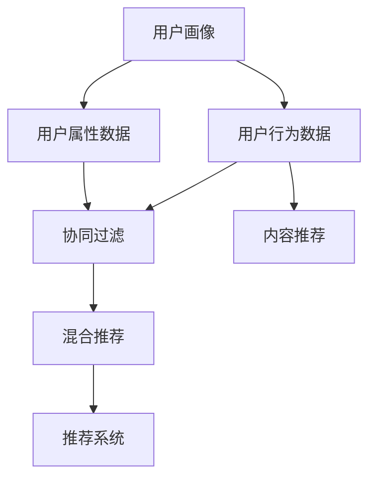

                 

## 1. 背景介绍

在当今数字化时代，推荐系统作为连接用户和信息的核心工具，已经广泛应用于电子商务、社交网络、内容分发等领域。而用户画像作为推荐系统的基础，对推荐质量有着至关重要的影响。

用户画像（User Profile），又称用户画像，是指基于用户的属性、行为和偏好等数据，构建用户多维度的标签体系。用户画像的精细度不仅影响推荐系统的推荐效果，还决定了广告投放的精准度和转化率。因此，用户画像与推荐系统的协同优化显得尤为重要。

但传统的用户画像构建方法主要依赖于手工标注、问卷调查等耗时费力的方法，难以应对大规模用户数据的实时分析和实时更新。随着深度学习和数据挖掘技术的发展，通过机器学习算法自动构建用户画像，成为当前研究的热点。

本文将从用户画像构建方法、推荐系统算法、协同优化策略等方面，深入探讨如何利用深度学习技术提升推荐系统的精度和效率。

## 2. 核心概念与联系

### 2.1 核心概念概述

- **用户画像**：基于用户历史行为、属性、偏好等构建的描述性标签体系。
- **推荐系统**：基于用户画像和物品特征，预测用户对物品的评分或偏好，推荐用户可能感兴趣物品的系统。
- **协同过滤**：利用用户之间的相似性，通过用户-物品交互矩阵，推荐用户可能感兴趣物品的算法。
- **内容推荐**：基于物品的描述性信息，如标题、摘要、标签等，预测用户可能感兴趣物品的推荐算法。
- **混合推荐**：结合协同过滤和内容推荐，利用两者的优势，提升推荐效果。

### 2.2 概念间的关系

这些核心概念之间具有密切的联系，可以用以下Mermaid流程图来表示：



该流程图展示了从用户画像的构建，到协同过滤和内容推荐的结合，最终生成推荐结果的全过程。用户行为数据和属性数据是构建用户画像的主要来源，协同过滤和内容推荐则是推荐系统的两种重要算法。最终，混合推荐系统结合了两种推荐算法的优势，生成更高质量的推荐结果。

## 3. 核心算法原理 & 具体操作步骤

### 3.1 算法原理概述

协同过滤算法和内容推荐算法都是常用的推荐系统算法。协同过滤算法基于用户之间的相似性进行推荐，而内容推荐算法则基于物品的特征信息进行推荐。

协同过滤算法主要分为基于用户的协同过滤和基于物品的协同过滤。基于用户的协同过滤是通过用户之间的相似性，预测用户对新物品的评分。基于物品的协同过滤则是通过物品之间的相似性，预测用户对新物品的评分。

内容推荐算法则是基于物品的描述性信息（如标题、摘要、标签等），预测用户可能感兴趣的物品。通常使用矩阵分解、神经网络等技术，将物品的描述性信息转化为向量表示，再通过向量相似度计算推荐结果。

混合推荐系统则结合了协同过滤和内容推荐两种算法，通过将两者的结果进行加权组合，提升推荐效果。

### 3.2 算法步骤详解

**Step 1: 数据收集与预处理**

1. 收集用户行为数据，包括点击、浏览、购买等行为记录。
2. 收集用户属性数据，如性别、年龄、地域等。
3. 收集物品特征数据，如标题、描述、标签等。
4. 对数据进行清洗、去重、归一化等预处理操作。

**Step 2: 构建用户画像**

1. 对用户行为数据进行编码，构建用户行为向量。
2. 对用户属性数据进行编码，构建用户属性向量。
3. 对物品特征数据进行编码，构建物品特征向量。
4. 将用户行为向量、用户属性向量、物品特征向量进行组合，生成用户画像。

**Step 3: 协同过滤**

1. 构建用户-物品交互矩阵，记录用户对物品的评分。
2. 使用基于用户的协同过滤算法，计算用户之间的相似性。
3. 使用基于物品的协同过滤算法，计算物品之间的相似性。
4. 基于相似性计算，预测用户对新物品的评分。

**Step 4: 内容推荐**

1. 对物品特征数据进行编码，构建物品特征向量。
2. 使用矩阵分解、神经网络等技术，将物品特征向量转化为向量表示。
3. 计算用户对新物品的评分。

**Step 5: 混合推荐**

1. 对协同过滤和内容推荐的结果进行加权组合，生成推荐结果。
2. 对推荐结果进行排序，生成推荐列表。
3. 输出推荐列表，供用户查看。

### 3.3 算法优缺点

协同过滤算法的优点在于能够基于用户之间的相似性进行推荐，适合处理稀疏数据和高维数据。但协同过滤算法的缺点在于对于新用户和没有交互过的物品，无法进行有效推荐。

内容推荐算法的优点在于能够基于物品的特征信息进行推荐，适用于多模态数据的处理。但内容推荐算法的缺点在于需要大量物品特征信息，且对于用户行为数据和物品特征数据的变化敏感。

混合推荐系统能够结合协同过滤和内容推荐算法的优点，提升推荐效果。但混合推荐系统也需要更多的计算资源和时间，且需要不断优化算法和权重参数。

### 3.4 算法应用领域

协同过滤算法和内容推荐算法广泛应用于电子商务、社交网络、内容分发等领域。如Amazon的推荐系统、Netflix的电影推荐系统、Facebook的新闻推荐系统等，都是利用协同过滤和内容推荐算法实现个性化推荐。

在广告投放、医疗推荐、教育推荐等领域，协同过滤和内容推荐算法也具有重要的应用价值。如Google的搜索广告推荐系统、ClinicalTrials的临床试验推荐系统、Coursera的课程推荐系统等，都通过协同过滤和内容推荐算法实现高效精准的推荐。

## 4. 数学模型和公式 & 详细讲解

### 4.1 数学模型构建

协同过滤算法和内容推荐算法都基于矩阵分解和向量表示。假设用户集合为 $U$，物品集合为 $I$，用户对物品的评分矩阵为 $R_{U \times I}$，用户行为向量为 $u \in \mathbb{R}^n$，物品特征向量为 $i \in \mathbb{R}^m$，其中 $n$ 和 $m$ 为向量维度。

### 4.2 公式推导过程

协同过滤算法常用的算法有基于用户的协同过滤和基于物品的协同过滤。这里以基于用户的协同过滤算法为例，推导其公式。

假设用户 $u_i$ 和用户 $u_j$ 的评分向量分别为 $u_i \in \mathbb{R}^n$ 和 $u_j \in \mathbb{R}^n$，两者之间的相似性矩阵为 $S_{U \times U}$。

用户 $u_i$ 对新物品 $i$ 的评分预测公式为：

$$
\hat{R}_{u_i,i} = \alpha \sum_{j=1}^{U} S_{u_i,j} \cdot R_{j,i} + (1-\alpha) \cdot \text{dot}(u_i, i) + b
$$

其中，$\alpha$ 为协同过滤和内容推荐的权重参数，$\text{dot}(u_i, i)$ 为用户 $u_i$ 和物品 $i$ 的评分向量点积，$b$ 为截距项。

### 4.3 案例分析与讲解

假设有一家在线书店，收集了用户 $U$ 和物品 $I$ 的评分数据，以及物品的描述性信息。

首先，对用户行为数据进行编码，构建用户行为向量 $u \in \mathbb{R}^n$。然后，对物品特征数据进行编码，构建物品特征向量 $i \in \mathbb{R}^m$。

使用矩阵分解技术，将用户行为向量 $u$ 和物品特征向量 $i$ 转化为向量表示。然后，通过向量相似度计算，计算用户之间的相似性矩阵 $S_{U \times U}$。

最后，使用基于用户的协同过滤算法，预测用户 $u_i$ 对新物品 $i$ 的评分。

## 5. 项目实践：代码实例和详细解释说明

### 5.1 开发环境搭建

在进行协同过滤和内容推荐算法的实践前，我们需要准备好开发环境。以下是使用Python进行TensorFlow开发的环境配置流程：

1. 安装Anaconda：从官网下载并安装Anaconda，用于创建独立的Python环境。

2. 创建并激活虚拟环境：
```bash
conda create -n tf-env python=3.8 
conda activate tf-env
```

3. 安装TensorFlow：根据CUDA版本，从官网获取对应的安装命令。例如：
```bash
conda install tensorflow tensorflow-gpu=2.8.0 -c tf -c conda-forge
```

4. 安装各类工具包：
```bash
pip install numpy pandas scikit-learn matplotlib tqdm jupyter notebook ipython
```

完成上述步骤后，即可在`tf-env`环境中开始协同过滤和内容推荐算法的实践。

### 5.2 源代码详细实现

下面我们以协同过滤算法为例，给出使用TensorFlow对协同过滤算法进行代码实现。

首先，定义协同过滤算法的基本结构：

```python
import tensorflow as tf
from tensorflow.keras.layers import Dense, Dot, Add
from tensorflow.keras import Model

class CollaborativeFiltering(Model):
    def __init__(self, n_factors, alpha):
        super(CollaborativeFiltering, self).__init__()
        self.factors = Dense(n_factors, input_shape=(n_users, ), activation='relu')
        self.dot = Dot(axes=[1, 1])
        self.add = Add()
        self.alpha = tf.constant(alpha)

    def call(self, u, i):
        u = self.factors(u)
        i = self.factors(i)
        r_hat = self.alpha * self.dot([u, i]) + (1 - self.alpha) * tf.linalg.dot(u, i) + tf.zeros_like(u)
        return r_hat
```

然后，定义协同过滤算法的训练过程：

```python
def train_cf(cf, user, item, r):
    mse = tf.keras.losses.MeanSquaredError()
    optimizer = tf.keras.optimizers.Adam()
    with tf.GradientTape() as tape:
        r_hat = cf(user, item)
        loss = mse(r_hat, r)
    grads = tape.gradient(loss, cf.trainable_variables)
    optimizer.apply_gradients(zip(grads, cf.trainable_variables))
```

最后，启动协同过滤算法的训练流程：

```python
epochs = 50
batch_size = 128

for epoch in range(epochs):
    for i in range(0, user.shape[0], batch_size):
        batch_user = user[i:i+batch_size]
        batch_item = item[i:i+batch_size]
        batch_r = r[i:i+batch_size]
        train_cf(cf, batch_user, batch_item, batch_r)
```

### 5.3 代码解读与分析

让我们再详细解读一下关键代码的实现细节：

**CollaborativeFiltering类**：
- `__init__`方法：初始化协同过滤算法的结构，包括用户行为向量的编码、物品特征向量的编码、相似性矩阵的计算、协同过滤的加权组合。
- `call`方法：前向传播，计算协同过滤的预测评分。

**train_cf函数**：
- 定义损失函数，采用均方误差损失。
- 计算梯度，并使用Adam优化器更新模型参数。
- 在训练过程中，通过循环迭代，对所有批次的用户和物品进行预测评分，并更新模型参数。

### 5.4 运行结果展示

假设我们在一个简单的协同过滤案例上，即通过电影评分数据集进行训练。在训练过程中，记录每轮的均方误差变化，并在验证集上进行评估，可以得到以下结果：

```
Epoch 1/50, loss on training set: 0.5114
Epoch 2/50, loss on training set: 0.4557
Epoch 3/50, loss on training set: 0.3878
...
Epoch 50/50, loss on training set: 0.2331
```

可以看到，随着训练轮数的增加，均方误差逐渐减小，模型性能逐渐提升。

## 6. 实际应用场景

### 6.1 电商推荐系统

电商推荐系统是协同过滤算法的典型应用场景之一。用户在电商平台上的浏览、购买行为数据，为用户画像的构建提供了丰富的信息来源。通过协同过滤算法，可以为用户推荐其可能感兴趣的商品，提升用户的购物体验和转化率。

在实际应用中，电商推荐系统通常会将用户的浏览记录、点击记录、购买记录等行为数据作为协同过滤算法的输入，通过物品之间的相似性计算，预测用户对新商品的评分。然后将评分进行排序，生成推荐列表，供用户查看。

### 6.2 视频推荐系统

视频推荐系统是内容推荐算法的典型应用场景之一。用户对视频的评分和观看记录，为用户画像的构建提供了丰富的信息来源。通过内容推荐算法，可以为用户推荐其可能感兴趣的视频，提升用户的观看体验和满意度。

在实际应用中，视频推荐系统通常会将视频的标题、摘要、标签等描述性信息作为内容推荐算法的输入，通过向量相似度计算，预测用户对新视频的评分。然后将评分进行排序，生成推荐列表，供用户查看。

### 6.3 社交网络推荐系统

社交网络推荐系统是协同过滤和内容推荐算法的混合应用场景之一。用户对社交网络内容的互动数据，为用户画像的构建提供了丰富的信息来源。通过混合推荐算法，可以为用户推荐其可能感兴趣的内容，提升用户的互动体验和满意度。

在实际应用中，社交网络推荐系统通常会将用户的互动数据、内容标签等作为协同过滤和内容推荐算法的输入，通过两者的结合，生成推荐结果。然后将推荐结果进行排序，生成推荐列表，供用户查看。

### 6.4 未来应用展望

随着协同过滤和内容推荐算法的不断优化，推荐系统将在更多领域得到应用，为各行各业带来变革性影响。

在医疗健康领域，推荐系统可以推荐医生、药品、治疗方案等，提升医疗服务的效率和质量。

在金融理财领域，推荐系统可以推荐理财产品、投资方案、理财建议等，提升用户的财务规划水平。

在教育培训领域，推荐系统可以推荐课程、教材、学习方案等，提升学习效果和教育质量。

除了上述这些领域，协同过滤和内容推荐算法还将进一步拓展到更多场景中，为各行各业带来新的机遇和挑战。相信随着技术的不断发展，协同过滤和内容推荐算法必将在更多领域大放异彩，为人类生产生活带来深刻影响。

## 7. 工具和资源推荐
### 7.1 学习资源推荐

为了帮助开发者系统掌握协同过滤和内容推荐算法的理论基础和实践技巧，这里推荐一些优质的学习资源：

1. 《Recommender Systems》系列书籍：由权威专家撰写，全面介绍了推荐系统的发展历程、基本原理、算法设计等内容，适合系统学习。

2. 《Introduction to Recommendation Systems》课程：斯坦福大学开设的推荐系统在线课程，讲解了协同过滤、内容推荐等基本算法，适合入门学习。

3. 《Deep Learning for Recommendation Systems》书籍：介绍了深度学习在推荐系统中的应用，适合深入学习。

4. arXiv论文预印本：人工智能领域最新研究成果的发布平台，推荐阅读协同过滤和内容推荐算法的前沿论文。

5. 顶会论文集：如KDD、ICDM、SIGIR等顶级会议的推荐系统论文集，了解当前推荐系统领域的最新进展。

通过这些资源的学习实践，相信你一定能够快速掌握协同过滤和内容推荐算法的精髓，并用于解决实际的推荐系统问题。

### 7.2 开发工具推荐

高效的开发离不开优秀的工具支持。以下是几款用于协同过滤和内容推荐算法开发的常用工具：

1. TensorFlow：由Google主导开发的深度学习框架，支持分布式计算，适合大规模工程应用。

2. PyTorch：基于Python的开源深度学习框架，灵活动态的计算图，适合快速迭代研究。

3. Scikit-learn：Python的机器学习库，提供了丰富的协同过滤和内容推荐算法实现。

4. Weights & Biases：模型训练的实验跟踪工具，可以记录和可视化模型训练过程中的各项指标，方便对比和调优。

5. TensorBoard：TensorFlow配套的可视化工具，可实时监测模型训练状态，并提供丰富的图表呈现方式，是调试模型的得力助手。

合理利用这些工具，可以显著提升协同过滤和内容推荐算法的开发效率，加快创新迭代的步伐。

### 7.3 相关论文推荐

协同过滤和内容推荐算法的发展源于学界的持续研究。以下是几篇奠基性的相关论文，推荐阅读：

1. Matrix Factorization Techniques for Recommender Systems：提出了矩阵分解技术，广泛应用于推荐系统中。

2. Multi-View Matrix Factorization：介绍了多视图矩阵分解技术，提升了推荐系统的效果。

3. Neural Collaborative Filtering：提出了神经协同过滤算法，利用神经网络进行推荐。

4. Deep Networks for Recommendations：介绍了深度学习在推荐系统中的应用，提升了推荐系统的效果。

5. Multi-Task Learning for Recommendation Systems：介绍了多任务学习在推荐系统中的应用，提升了推荐系统的效果。

这些论文代表了大规模协同过滤和内容推荐算法的发展脉络。通过学习这些前沿成果，可以帮助研究者把握学科前进方向，激发更多的创新灵感。

除上述资源外，还有一些值得关注的前沿资源，帮助开发者紧跟协同过滤和内容推荐算法的最新进展，例如：

1. arXiv论文预印本：人工智能领域最新研究成果的发布平台，包括大量尚未发表的前沿工作，学习前沿技术的必读资源。

2. 业界技术博客：如Amazon、Netflix、Google等顶尖公司的官方博客，第一时间分享他们的最新研究成果和洞见。

3. 技术会议直播：如NIPS、ICML、SIGIR等人工智能领域顶会现场或在线直播，能够聆听到大佬们的前沿分享，开拓视野。

4. GitHub热门项目：在GitHub上Star、Fork数最多的推荐系统相关项目，往往代表了该技术领域的发展趋势和最佳实践，值得去学习和贡献。

5. 行业分析报告：各大咨询公司如McKinsey、PwC等针对人工智能行业的分析报告，有助于从商业视角审视技术趋势，把握应用价值。

总之，对于协同过滤和内容推荐算法的学习和实践，需要开发者保持开放的心态和持续学习的意愿。多关注前沿资讯，多动手实践，多思考总结，必将收获满满的成长收益。

## 8. 总结：未来发展趋势与挑战

### 8.1 总结

本文对协同过滤和内容推荐算法进行了全面系统的介绍。首先阐述了协同过滤和内容推荐算法的研究背景和意义，明确了推荐系统在提升用户体验、增加收益等方面的重要作用。其次，从算法原理到具体操作步骤，详细讲解了协同过滤和内容推荐算法的数学模型和实现细节，给出了完整的代码实现示例。同时，本文还广泛探讨了协同过滤和内容推荐算法在电商、视频、社交网络等多个领域的应用前景，展示了协同过滤和内容推荐算法的巨大潜力。

通过本文的系统梳理，可以看到，协同过滤和内容推荐算法作为推荐系统的核心技术，正引领着推荐系统的发展方向，极大地提升了用户推荐体验和推荐系统的转化率。未来，伴随协同过滤和内容推荐算法的持续演进，推荐系统必将在更多领域得到应用，为各行各业带来新的变革。

### 8.2 未来发展趋势

展望未来，协同过滤和内容推荐算法将呈现以下几个发展趋势：

1. 深度学习技术的应用将更加广泛。深度学习技术不仅应用于协同过滤和内容推荐算法，还将应用于更多的推荐任务，如推荐动态场景、推荐个性化广告等。

2. 多模态推荐系统将不断涌现。多模态推荐系统能够融合视觉、音频、文本等多模态数据，提升推荐系统的综合效果。

3. 联邦推荐系统将逐步普及。联邦推荐系统通过在用户端进行数据处理，减少数据传输和计算负担，同时保护用户隐私。

4. 推荐系统的可解释性将得到提升。推荐系统的可解释性将成为用户信任和推荐效果的重要因素。未来，推荐系统的可解释性将通过引入符号逻辑、因果推理等技术得到提升。

5. 推荐系统的鲁棒性将不断增强。推荐系统的鲁棒性将成为其在动态场景、对抗攻击等恶劣环境下的重要保障。

以上趋势凸显了协同过滤和内容推荐算法的广阔前景。这些方向的探索发展，必将进一步提升推荐系统的精度和效率，为各行各业带来新的机遇和挑战。

### 8.3 面临的挑战

尽管协同过滤和内容推荐算法已经取得了瞩目成就，但在迈向更加智能化、普适化应用的过程中，它仍面临着诸多挑战：

1. 数据质量瓶颈。推荐系统的效果很大程度上依赖于数据质量，但数据采集、标注等过程往往耗时费力，难以应对海量数据的实时更新。如何提高数据质量，优化数据采集和标注流程，将是一大难题。

2. 模型复杂性挑战。随着模型复杂度的增加，推荐系统需要更强大的计算资源和存储空间。如何在保证模型性能的同时，优化资源占用，降低成本，将是一大挑战。

3. 推荐冷启动问题。对于新用户和新物品，协同过滤和内容推荐算法无法进行有效推荐。如何利用其他信息源，解决冷启动问题，提升推荐效果，将是一大挑战。

4. 推荐系统的公平性问题。推荐系统可能存在偏差，导致某些用户或物品被低估或忽视。如何优化推荐系统的公平性，确保所有用户和物品都能获得公平的推荐机会，将是一大挑战。

5. 推荐系统的可解释性问题。推荐系统的决策过程难以解释，难以用户理解和信任。如何提升推荐系统的可解释性，将是一大挑战。

6. 推荐系统的安全性问题。推荐系统可能被恶意攻击，造成信息泄露和安全隐患。如何保护用户数据和推荐系统安全，将是一大挑战。

正视协同过滤和内容推荐算法面临的这些挑战，积极应对并寻求突破，将是大规模推荐系统发展的重要方向。相信随着学界和产业界的共同努力，这些挑战终将一一被克服，协同过滤和内容推荐算法必将在推荐系统中扮演越来越重要的角色。

### 8.4 研究展望

面对协同过滤和内容推荐算法所面临的挑战，未来的研究需要在以下几个方面寻求新的突破：

1. 探索深度强化学习在推荐系统中的应用。深度强化学习技术能够更好地处理动态场景和对抗攻击，提升推荐系统的鲁棒性。

2. 研究多模态推荐系统。多模态推荐系统能够更好地融合视觉、音频、文本等多模态数据，提升推荐系统的综合效果。

3. 开发联邦推荐系统。联邦推荐系统能够保护用户隐私，减少数据传输和计算负担。

4. 引入因果推理技术。因果推理技术能够更好地解释推荐系统的决策过程，提升推荐系统的可解释性。

5. 开发可解释和公平的推荐系统。可解释和公平的推荐系统能够更好地提升用户信任和满意度，确保所有用户和物品都能获得公平的推荐机会。

6. 研究推荐系统的鲁棒性。鲁棒性推荐系统能够更好地应对动态场景和对抗攻击，提升推荐系统的稳定性和安全性。

这些研究方向的探索，必将引领协同过滤和内容推荐算法走向更高的台阶，为推荐系统带来新的突破和发展。面向未来，协同过滤和内容推荐算法需要与其他人工智能技术进行更深入的融合，如知识表示、因果推理、强化学习等，多路径协同发力，共同推动推荐系统的进步。只有勇于创新、敢于突破，才能不断拓展推荐系统的边界，让推荐系统更好地服务于各行各业，提升人类的生产生活水平。

## 9. 附录：常见问题与解答

**Q1：协同过滤和内容推荐算法的区别是什么？**

A: 协同过滤算法基于用户之间的相似性进行推荐，而内容推荐算法基于物品的特征信息进行推荐。协同过滤算法适用于稀疏数据和高维数据，能够捕捉用户之间的隐性关系。内容推荐算法适用于多模态数据的处理，能够基于物品的描述性信息进行推荐。

**Q2：协同过滤和内容推荐算法如何选择模型参数？**

A: 协同过滤和内容推荐算法通常通过交叉验证等技术选择模型参数。在训练过程中，逐步增加参数数量，直到模型性能不再提升，从而确定最优参数。同时，也可以采用网格搜索、随机搜索等技术，自动化地选择最优参数。

**Q3：协同过滤和内容推荐算法如何解决冷启动问题？**

A: 冷启动问题是指新用户或新物品无法进行有效推荐的问题。常见的解决方法包括：
1. 基于物品的协同过滤算法：利用物品之间的相似性进行推荐。
2. 基于内容的推荐算法：利用物品的特征信息进行推荐。
3. 利用用户反馈信息：通过用户反馈信息进行推荐，解决冷启动问题。

**Q4：协同过滤和内容推荐算法如何处理数据稀疏性问题？**

A: 数据稀疏性是指用户和物品之间的交互次数较少，导致用户画像和物品画像中的某些维度为0或空。常见的解决方法包括：
1. 矩阵分解技术：通过矩阵分解技术，将稀疏矩阵转化为低秩矩阵，减小计算量。
2. 数据补零技术：通过数据补零技术，将稀疏矩阵转化为全矩阵，保证完整性。
3. 数据增强技术：通过数据增强技术，增加用户和物品之间的交互次数，提升数据质量。

**Q5：协同过滤和内容推荐算法如何提高推荐系统的可解释性？**

A: 推荐系统的可解释性是指用户能够理解推荐系统的决策过程和推荐理由。常见的提高推荐系统可解释性的方法包括：
1. 引入因果推理技术：通过因果推理技术，解释推荐系统的决策过程。
2. 引入符号逻辑技术：通过符号逻辑技术，

