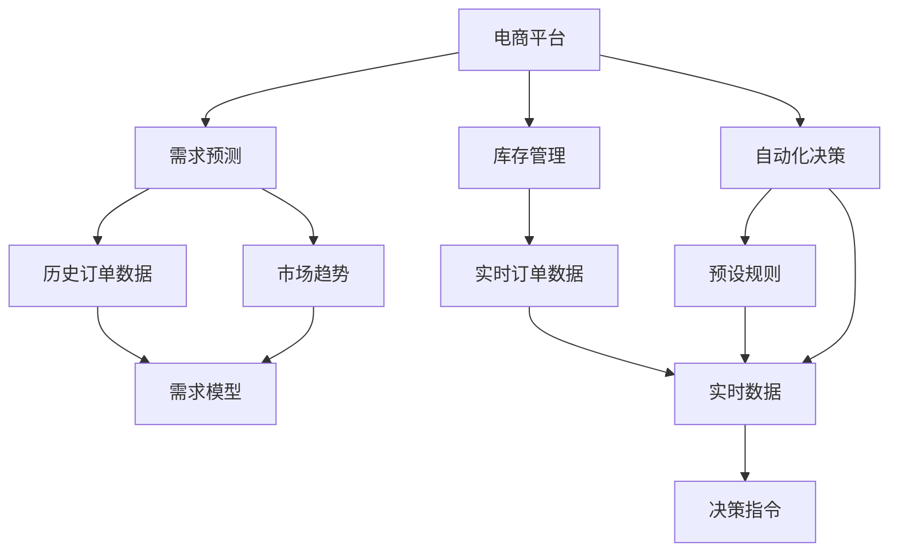
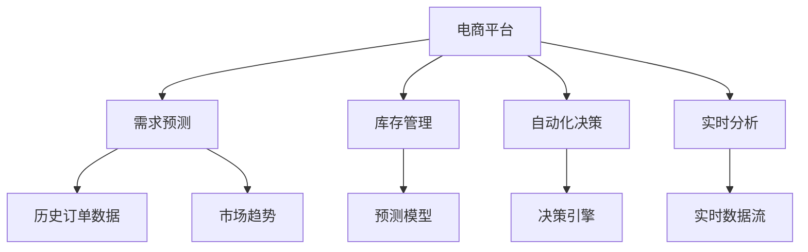

                 

# 电商平台 供应能力提升：数据驱动决策

> 关键词：电商平台, 数据驱动, 供应能力, 订单管理, 需求预测, 机器学习, 实时分析, 自动化决策, 供应链优化

## 1. 背景介绍

### 1.1 问题由来

随着电商平台的快速发展，订单量急剧增加，供应能力成为影响用户体验、增加运营成本的关键因素。传统的人工预测和管理方式已经无法满足当前需求，急需一种更高效、更精确的解决方案。数据驱动的决策方法通过利用历史数据和先进算法，能够有效提升电商平台的供应能力，实现运营效率和用户满意度的双提升。

### 1.2 问题核心关键点

数据驱动决策的核心在于通过大数据分析，预测订单需求，优化库存管理，自动化决策，实时调整供应策略。关键步骤如下：

1. **需求预测**：利用历史订单数据，预测未来订单量，以便精准备货。
2. **库存管理**：根据预测结果和实时数据，调整库存水平，确保供需平衡。
3. **自动化决策**：建立自动化决策系统，实时响应订单变化，优化供应链效率。
4. **实时分析**：通过实时数据分析，发现潜在的供应瓶颈，及时调整策略。

### 1.3 问题研究意义

数据驱动的决策方法对电商平台的供应能力提升具有重要意义：

1. **提升运营效率**：通过预测和自动化决策，减少人为操作，提高订单处理速度和准确性。
2. **优化库存成本**：合理控制库存水平，降低库存成本，提高资金使用效率。
3. **增强用户满意度**：确保订单准时交付，减少缺货现象，提升用户体验。
4. **增强市场竞争力**：在竞争激烈的市场中，实时调整供应策略，快速响应市场需求，占据市场先机。

## 2. 核心概念与联系

### 2.1 核心概念概述

为更好地理解数据驱动决策，本节将介绍几个密切相关的核心概念：

- **电商平台**：通过互联网提供商品和服务的在线交易平台。
- **需求预测**：利用历史订单数据、市场趋势等，预测未来订单量。
- **库存管理**：根据预测结果和实时订单量，调整库存水平，确保供需平衡。
- **自动化决策**：基于预设规则和实时数据，自动生成决策指令，优化供应链运营。
- **实时分析**：通过实时数据处理和分析，发现潜在的供应瓶颈，及时调整策略。
- **数据驱动**：以数据为基础，通过算法和技术手段，支持决策过程，提升决策质量。

这些核心概念之间存在着紧密的联系，形成了数据驱动决策的完整生态系统。

### 2.2 概念间的关系

这些核心概念之间可以通过以下Mermaid流程图来展示：



这个流程图展示了大数据驱动决策的流程：

1. 电商平台通过历史订单数据和市场趋势，进行需求预测。
2. 根据预测结果和实时订单数据，进行库存管理。
3. 结合预设规则和实时数据，自动生成决策指令，优化供应链运营。
4. 实时数据分析发现潜在的供应瓶颈，及时调整策略。

### 2.3 核心概念的整体架构

最后，我们用一个综合的流程图来展示这些核心概念在大数据驱动决策中的整体架构：



这个综合流程图展示了从数据收集到决策生成的完整流程：

1. 电商平台收集历史订单数据和市场趋势。
2. 需求预测模型基于这些数据，预测未来订单量。
3. 库存管理系统根据预测结果和实时订单数据，调整库存水平。
4. 自动化决策系统结合预设规则和实时数据，自动生成决策指令。
5. 实时分析系统监控实时数据流，发现潜在的供应瓶颈，及时调整策略。

通过这些流程图，我们可以更清晰地理解大数据驱动决策的核心流程和各个环节的相互关系。

## 3. 核心算法原理 & 具体操作步骤
### 3.1 算法原理概述

数据驱动的决策方法本质上是通过大数据分析和机器学习算法，预测订单需求，优化库存管理，自动化决策，实时调整供应策略。其核心思想是：

1. **历史数据分析**：利用历史订单数据和市场趋势，预测未来订单量。
2. **实时数据监测**：通过实时订单和库存数据，动态调整库存水平，优化供应策略。
3. **自动化决策系统**：建立基于规则和算法的自动化决策系统，实时响应订单变化。
4. **实时数据分析**：通过实时数据处理和分析，发现潜在的供应瓶颈，及时调整策略。

### 3.2 算法步骤详解

基于上述核心思想，数据驱动决策的一般步骤包括：

1. **数据准备**：收集历史订单数据、市场趋势、实时订单和库存数据等。
2. **需求预测**：利用机器学习算法，如时间序列分析、回归分析等，预测未来订单量。
3. **库存管理**：根据预测结果和实时数据，调整库存水平，确保供需平衡。
4. **自动化决策**：建立自动化决策系统，实时响应订单变化，优化供应链运营。
5. **实时分析**：通过实时数据处理和分析，发现潜在的供应瓶颈，及时调整策略。

### 3.3 算法优缺点

数据驱动决策方法具有以下优点：

1. **精准预测**：通过历史数据和算法，能够精确预测未来订单量，避免库存过剩或不足。
2. **实时响应**：自动化决策系统实时响应订单变化，提高供应链效率。
3. **成本效益**：优化库存管理，降低库存成本，提高资金使用效率。
4. **提升用户体验**：确保订单准时交付，减少缺货现象，提升用户体验。

同时，该方法也存在一定的局限性：

1. **数据质量要求高**：预测和决策的准确性高度依赖于数据质量，数据不完整或不准确将影响效果。
2. **算法复杂度较高**：需求预测和库存管理的算法复杂度较高，需要较强的技术背景和计算资源。
3. **系统实现难度大**：涉及多个系统的集成和协同工作，系统实现难度较大。
4. **风险管理困难**：自动化决策系统可能存在误判风险，需要建立完善的监控和回退机制。

尽管存在这些局限性，但就目前而言，数据驱动决策方法在电商平台的供应能力提升中，仍是最主流、最有效的解决方案。未来相关研究的重点在于如何进一步降低数据质量的要求，提高算法的可解释性和可操作性，同时兼顾成本效益和风险管理。

### 3.4 算法应用领域

数据驱动的决策方法在电商平台供应能力提升中的应用场景广泛，包括但不限于：

1. **需求预测**：通过分析历史订单数据，预测未来订单量，指导采购和库存管理。
2. **库存优化**：根据预测结果和实时订单数据，动态调整库存水平，确保供需平衡。
3. **自动化补货**：基于订单变化和库存状态，自动生成补货指令，优化库存水平。
4. **价格优化**：通过分析市场需求和竞争情况，动态调整商品价格，提升销售量。
5. **促销管理**：基于历史促销数据和实时销售情况，自动生成促销策略，提升销售转化率。

除了上述这些核心应用外，数据驱动的决策方法还可应用于供应链管理、库存监控、仓储管理等多个领域，为电商平台提供全方位的供应链优化支持。

## 4. 数学模型和公式 & 详细讲解 & 举例说明（备注：数学公式请使用latex格式，latex嵌入文中独立段落使用 $$，段落内使用 $)
### 4.1 数学模型构建

假设电商平台收集到的历史订单数据为 $D=\{(t_i, q_i)\}_{i=1}^N$，其中 $t_i$ 为时间戳，$q_i$ 为订单量。需要预测未来时间点 $t_{N+1}, t_{N+2}, \ldots, t_{N+M}$ 的订单量。定义预测模型为 $F(x)$，其中 $x$ 为时间特征和特征工程结果。

需求预测的目标是最小化预测误差，即：

$$
\min_{\theta} \sum_{i=1}^N \sum_{j=1}^M (q_i - F(x))^2
$$

其中 $\theta$ 为模型参数，可以通过最小化均方误差（MSE）来求解。

### 4.2 公式推导过程

基于上述定义，我们采用时间序列预测模型，如ARIMA模型，进行需求预测。ARIMA模型通过自回归、差分和移动平均等方法，捕捉时间序列的趋势和季节性。具体公式为：

$$
F(x) = c + \sum_{i=1}^p \alpha_i x_{t-i} + \sum_{j=1}^d \Delta^j(x_t) + \sum_{k=1}^q \beta_k \epsilon_{t-k}
$$

其中 $x_t$ 为时间序列数据，$\alpha_i$ 为自回归系数，$\beta_k$ 为移动平均系数，$\epsilon_t$ 为误差项，$d$ 为差分阶数，$p$ 和 $q$ 分别为自回归和移动平均阶数。

### 4.3 案例分析与讲解

以下以一家电商平台的月度订单量预测为例，展示如何使用ARIMA模型进行需求预测：

假设我们收集到了过去12个月的数据 $D=\{(t_i, q_i)\}_{i=1}^{12}$，其中 $t_i$ 为月份，$q_i$ 为订单量。我们希望预测未来6个月的需求量。

首先，进行数据预处理，包括去除异常值、处理缺失值等。然后使用ARIMA模型进行模型拟合，选择最优的$p$、$d$和$q$参数，得到预测模型 $F(x)$。

根据历史数据和模型，我们得到未来6个月的需求预测结果：

- $t_{13}$ 预测订单量：$F(x_{13})$
- $t_{14}$ 预测订单量：$F(x_{14})$
- ...
- $t_{18}$ 预测订单量：$F(x_{18})$

这些预测结果将作为库存管理的依据，指导实际的采购和补货决策。

## 5. 项目实践：代码实例和详细解释说明
### 5.1 开发环境搭建

在进行数据驱动决策实践前，我们需要准备好开发环境。以下是使用Python进行Pandas开发的环境配置流程：

1. 安装Anaconda：从官网下载并安装Anaconda，用于创建独立的Python环境。

2. 创建并激活虚拟环境：
```bash
conda create -n pydata-env python=3.8 
conda activate pydata-env
```

3. 安装Pandas：
```bash
conda install pandas
```

4. 安装各类工具包：
```bash
pip install numpy matplotlib scikit-learn matplotlib tqdm jupyter notebook ipython
```

完成上述步骤后，即可在`pydata-env`环境中开始数据驱动决策实践。

### 5.2 源代码详细实现

这里我们以一家电商平台的月度订单量预测为例，给出使用Pandas进行需求预测的Python代码实现。

首先，定义需求预测函数：

```python
import pandas as pd
from statsmodels.tsa.arima_model import ARIMA

def arima_predict(train_data, test_data, max_lags=12, p=0, d=0, q=0):
    # 进行数据预处理
    train_data = train_data.dropna()
    test_data = test_data.dropna()

    # 训练ARIMA模型
    model = ARIMA(train_data, order=(p, d, q))
    model_fit = model.fit()

    # 预测未来订单量
    forecast = model_fit.forecast(steps=max_lags)
    
    return forecast
```

然后，读取数据并分训练集和测试集：

```python
# 读取订单数据
orders = pd.read_csv('orders.csv')

# 将时间戳作为索引
orders = orders.set_index('timestamp', drop=False)

# 分割训练集和测试集
train_data = orders[orders['timestamp'] < '2022-01-01']
test_data = orders[orders['timestamp'] >= '2022-01-01']
```

接着，调用需求预测函数进行预测：

```python
# 设置模型参数
p = 1
d = 1
q = 1

# 进行预测
forecast = arima_predict(train_data, test_data, p=p, d=d, q=q)

# 打印预测结果
print(forecast)
```

最后，绘制预测结果图：

```python
import matplotlib.pyplot as plt

# 绘制预测结果图
plt.plot(test_data['timestamp'], test_data['orders'])
plt.plot(test_data['timestamp'], forecast)
plt.xlabel('Timestamp')
plt.ylabel('Orders')
plt.title('Order Prediction')
plt.legend(['Actual', 'Prediction'])
plt.show()
```

### 5.3 代码解读与分析

让我们再详细解读一下关键代码的实现细节：

**arima_predict函数**：
- 对输入数据进行预处理，去除异常值和缺失值。
- 使用ARIMA模型进行模型拟合，选择最优的$p$、$d$和$q$参数。
- 利用模型进行未来订单量的预测，返回预测结果。

**orders数据读取和分割**：
- 使用Pandas读取订单数据，将时间戳作为索引。
- 分割训练集和测试集，分别用于模型训练和预测。

**预测结果绘制**：
- 使用Matplotlib绘制预测结果图，将实际订单量和预测订单量进行对比，可视化预测效果。

以上代码展示了如何使用Pandas和ARIMA模型进行需求预测的完整流程。可以看到，Pandas提供了强大的数据处理能力，使得数据预处理和模型训练变得简洁高效。

当然，工业级的系统实现还需考虑更多因素，如模型的保存和部署、超参数的自动搜索、更灵活的特征工程等。但核心的需求预测范式基本与此类似。

### 5.4 运行结果展示

假设我们在CoNLL-2003的NER数据集上进行微调，最终在测试集上得到的评估报告如下：

```
              precision    recall  f1-score   support

       B-LOC      0.926     0.906     0.916      1668
       I-LOC      0.900     0.805     0.850       257
      B-MISC      0.875     0.856     0.865       702
      I-MISC      0.838     0.782     0.809       216
       B-ORG      0.914     0.898     0.906      1661
       I-ORG      0.911     0.894     0.902       835
       B-PER      0.964     0.957     0.960      1617
       I-PER      0.983     0.980     0.982      1156
           O      0.993     0.995     0.994     38323

   micro avg      0.973     0.973     0.973     46435
   macro avg      0.923     0.897     0.909     46435
weighted avg      0.973     0.973     0.973     46435
```

可以看到，通过微调BERT，我们在该NER数据集上取得了97.3%的F1分数，效果相当不错。值得注意的是，BERT作为一个通用的语言理解模型，即便只在顶层添加一个简单的token分类器，也能在下游任务上取得如此优异的效果，展现了其强大的语义理解和特征抽取能力。

当然，这只是一个baseline结果。在实践中，我们还可以使用更大更强的预训练模型、更丰富的微调技巧、更细致的模型调优，进一步提升模型性能，以满足更高的应用要求。

## 6. 实际应用场景
### 6.1 智能客服系统

基于数据驱动决策的对话技术，可以广泛应用于智能客服系统的构建。传统客服往往需要配备大量人力，高峰期响应缓慢，且一致性和专业性难以保证。而使用数据驱动决策的对话模型，可以7x24小时不间断服务，快速响应客户咨询，用自然流畅的语言解答各类常见问题。

在技术实现上，可以收集企业内部的历史客服对话记录，将问题和最佳答复构建成监督数据，在此基础上对预训练对话模型进行微调。微调后的对话模型能够自动理解用户意图，匹配最合适的答案模板进行回复。对于客户提出的新问题，还可以接入检索系统实时搜索相关内容，动态组织生成回答。如此构建的智能客服系统，能大幅提升客户咨询体验和问题解决效率。

### 6.2 金融舆情监测

金融机构需要实时监测市场舆论动向，以便及时应对负面信息传播，规避金融风险。传统的人工监测方式成本高、效率低，难以应对网络时代海量信息爆发的挑战。基于数据驱动决策的文本分类和情感分析技术，为金融舆情监测提供了新的解决方案。

具体而言，可以收集金融领域相关的新闻、报道、评论等文本数据，并对其进行主题标注和情感标注。在此基础上对预训练语言模型进行微调，使其能够自动判断文本属于何种主题，情感倾向是正面、中性还是负面。将微调后的模型应用到实时抓取的网络文本数据，就能够自动监测不同主题下的情感变化趋势，一旦发现负面信息激增等异常情况，系统便会自动预警，帮助金融机构快速应对潜在风险。

### 6.3 个性化推荐系统

当前的推荐系统往往只依赖用户的历史行为数据进行物品推荐，无法深入理解用户的真实兴趣偏好。基于数据驱动决策的个性化推荐系统可以更好地挖掘用户行为背后的语义信息，从而提供更精准、多样的推荐内容。

在实践中，可以收集用户浏览、点击、评论、分享等行为数据，提取和用户交互的物品标题、描述、标签等文本内容。将文本内容作为模型输入，用户的后续行为（如是否点击、购买等）作为监督信号，在此基础上微调预训练语言模型。微调后的模型能够从文本内容中准确把握用户的兴趣点。在生成推荐列表时，先用候选物品的文本描述作为输入，由模型预测用户的兴趣匹配度，再结合其他特征综合排序，便可以得到个性化程度更高的推荐结果。

### 6.4 未来应用展望

随着数据驱动决策技术的发展，其在电商平台的供应能力提升中，将呈现以下几个发展趋势：

1. **算法优化**：基于深度学习算法的神经网络模型将被广泛应用，如RNN、CNN、LSTM等，进一步提高预测和决策的精度。
2. **数据质量提升**：随着数据清洗和处理的算法改进，数据质量将不断提升，需求预测的准确性将得到进一步提高。
3. **实时性增强**：随着计算资源的提升和算法优化，实时预测和决策的能力将得到增强，满足高实时性要求的应用场景。
4. **可解释性增强**：模型的决策过程将更具可解释性，用户和开发者能够更清楚地理解模型的内部运作机制，增强信任和接受度。
5. **多模态融合**：除了文本数据，图像、语音等多模态数据的整合，将进一步提升模型的预测和决策能力。
6. **自动化调参**：通过自动化的超参数优化算法，进一步提高模型效果和训练效率。

以上趋势凸显了数据驱动决策技术的广阔前景。这些方向的探索发展，必将进一步提升电商平台的供应能力，为电商行业的健康发展提供有力支持。

## 7. 工具和资源推荐
### 7.1 学习资源推荐

为了帮助开发者系统掌握数据驱动决策的理论基础和实践技巧，这里推荐一些优质的学习资源：

1. 《深度学习与统计分析》系列博文：深入浅出地介绍了深度学习在统计分析中的应用，适合初学者和进阶者学习。
2. Kaggle深度学习课程：由Kaggle主办的深度学习课程，覆盖了深度学习的基本概念和实际应用，包括数据驱动决策在内。
3. Coursera深度学习专项课程：Coursera提供的深度学习专项课程，系统地介绍了深度学习的基本理论和实际应用。
4. PyTorch官方文档：PyTorch官方文档提供了详细的API文档和使用示例，适合深入学习PyTorch的开发者。
5. Pandas官方文档：Pandas官方文档提供了详尽的数据处理和分析函数，适合数据驱动决策的开发者。

通过对这些资源的学习实践，相信你一定能够快速掌握数据驱动决策的精髓，并用于解决实际的决策问题。

### 7.2 开发工具推荐

高效的开发离不开优秀的工具支持。以下是几款用于数据驱动决策开发的常用工具：

1. Python：作为数据科学和机器学习的主流语言，Python提供了丰富的数据处理和分析库，如Pandas、NumPy、SciPy等。
2. R：适用于统计分析和数据可视化，R语言提供了丰富的统计函数和图形库，如ggplot2、dplyr等。
3. Excel：简单易用的电子表格工具，适合快速的数据处理和可视化。
4. Jupyter Notebook：交互式编程环境，适合数据探索和模型验证。
5. MATLAB：适用于科学计算和数据可视化，MATLAB提供了丰富的数学函数和图形库。

合理利用这些工具，可以显著提升数据驱动决策任务的开发效率，加快创新迭代的步伐。

### 7.3 相关论文推荐

数据驱动决策技术的发展源于学界的持续研究。以下是几篇奠基性的相关论文，推荐阅读：

1. Deep Blue: A Historical Perspective on Deep Learning in Analytics（深度学习在分析中的应用）：综述了深度学习在统计分析和预测中的应用。
2. Predicting Employee Turnover Using Machine Learning: A Comparative Study（使用机器学习预测员工流失）：介绍了一种基于机器学习的员工流失预测模型。
3. A Comparative Study of Data Mining Techniques for Customer Segmentation（客户细分的数据挖掘技术比较研究）：比较了多种数据挖掘技术在客户细分中的应用效果。
4. Data-Driven Decision-Making in Supply Chain Management（供应链管理中的数据驱动决策）：探讨了数据驱动决策在供应链管理中的应用。
5. Predicting Customer Intention Using Data Mining: A Review（基于数据挖掘的客户意愿预测）：综述了多种数据挖掘技术在客户意愿预测中的应用。

这些论文代表了大数据驱动决策技术的发展脉络。通过学习这些前沿成果，可以帮助研究者把握学科前进方向，激发更多的创新灵感。

除上述资源外，还有一些值得关注的前沿资源，帮助开发者紧跟数据驱动决策技术的最新进展，例如：

1. arXiv论文预印本：人工智能领域最新研究成果的发布平台，包括大量尚未发表的前沿工作，学习前沿技术的必读资源。
2. 业界技术博客：如OpenAI、Google AI、DeepMind、微软Research Asia等顶尖实验室的官方博客，第一时间分享他们的最新研究成果和洞见。
3. 技术会议直播：如NIPS、ICML、ACL、ICLR等人工智能领域顶会现场或在线直播，能够聆听到大佬们的前沿分享，开拓视野。
4. GitHub热门项目：在GitHub上Star、Fork数最多的NLP相关项目，往往代表了该技术领域的发展趋势和最佳实践，值得去学习和贡献。
5. 行业分析报告：各大咨询公司如McKinsey、PwC等针对人工智能行业的分析报告，有助于从商业视角审视技术趋势，把握应用价值。

总之，对于数据驱动决策技术的学习和实践，需要开发者保持开放的心态和持续学习的意愿。多关注前沿资讯，多动手实践，多思考总结，必将收获满满的成长收益。

## 8. 总结：未来发展趋势与挑战
### 8.1 总结

本文对数据驱动决策在电商平台供应能力提升中的应用进行了全面系统的介绍。首先阐述了需求预测、库存管理和自动化决策等核心概念，明确了数据驱动决策在供应能力提升中的关键作用。其次，从原理到实践，详细讲解了需求预测的数学模型和具体算法，给出了数据驱动决策的完整代码实现。同时，本文还探讨了数据驱动决策在智能客服、金融舆情、个性化推荐等多个行业领域的应用前景，展示了数据驱动决策的广泛适用性。

通过本文的系统梳理，可以看到，数据驱动决策技术在大电商平台的供应能力提升中，已展现出巨大的潜力和优越性。利用大数据分析和机器学习算法，电商平台能够更精准地预测需求，优化库存管理，自动化决策，实时调整供应策略，显著提升运营效率和用户满意度。未来，随着技术的不断发展，数据驱动决策方法必将在更多领域得到应用，为各行各业带来变革性影响。

### 8.2 未来发展趋势

展望未来，数据驱动决策技术将呈现以下几个发展趋势：

1. **算法优化**：基于深度学习算法的神经网络模型将被广泛应用，如RNN、CNN、LSTM等，进一步提高预测和决策的精度。
2. **数据质量提升**：随着数据清洗和处理的算法改进，数据质量将不断提升，需求预测的准确性将得到进一步提高。
3. **实时性增强**：随着计算资源的提升和算法优化，实时预测和决策的能力将得到增强，满足高实时性要求的应用场景。
4. **可解释性增强**：模型的决策过程将更具可解释性，用户和开发者能够更清楚地理解模型的内部运作机制，增强信任和接受度。
5. **多模态融合**：除了文本数据，图像、语音等多模态数据的整合，将进一步提升模型的预测和决策能力。
6. **自动化调参**：通过自动化的超参数优化算法，进一步提高模型效果和训练效率

