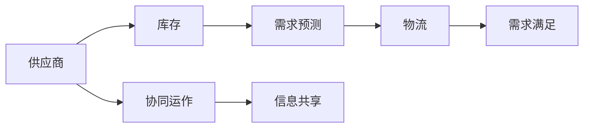
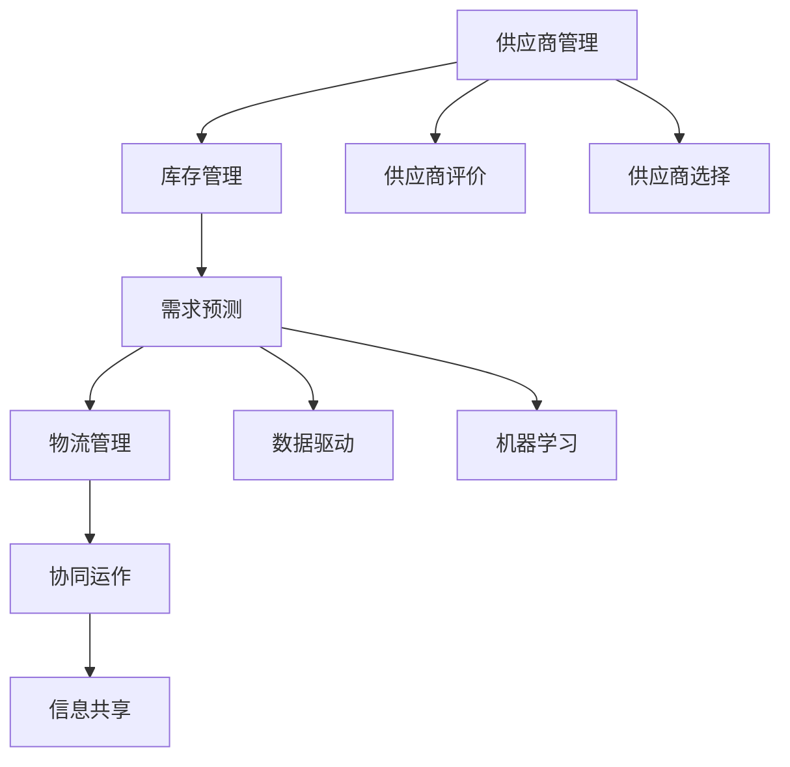

                 

# 电商平台供给能力提升：供应链整合策略

在现代电商平台上，供给能力的提升不仅关乎销量，更关乎用户体验。本文将深入探讨如何通过供应链整合策略来提升电商平台的供给能力，并详细阐述具体技术方案、实现步骤及优化技巧。

## 1. 背景介绍

### 1.1 问题由来
随着电子商务市场的快速增长，电商平台在拓展业务的同时，也面临着多方面的挑战。其中，供给能力的不足成为制约平台进一步发展的关键瓶颈。为了提升供应链效率，许多电商平台开始探索和实施供应链整合策略。

### 1.2 问题核心关键点
供应链整合策略旨在通过协同优化供应链上下游资源，实现资源共享、协同运作，提高供应链的整体效率和弹性。主要包括以下几个方面：

1. **供应商管理**：筛选优质供应商，建立稳定的合作关系。
2. **库存管理**：优化库存水平，避免过剩或缺货。
3. **需求预测**：准确预测市场需求，及时调整供给策略。
4. **物流管理**：优化物流网络，提升货物运输效率。
5. **协同运作**：平台与供应商之间的信息共享和协同决策。

## 2. 核心概念与联系

### 2.1 核心概念概述
- **供应链(Supply Chain)**：从原材料的采购、产品的制造到最终销售的整个过程，涉及多个环节和参与者。
- **供应商(Supplier)**：提供产品或服务的第三方实体，是供应链中重要的组成部分。
- **库存(Inventory)**：存放于仓库中的待售商品，需平衡库存水平以避免过剩或缺货。
- **需求预测(Demand Forecasting)**：基于历史数据和市场趋势，预测未来的需求量。
- **物流(Logistics)**：涉及货物从生产地到消费地的运输、配送和仓储管理。

### 2.2 概念间的关系

通过以下Mermaid流程图，我们可以更清晰地理解供应链整合策略中的核心概念及其之间的关系：



这个流程图展示了供应链中的关键环节和运作机制：供应商提供原材料和商品，库存管理确保适时供应，需求预测指导库存和物流决策，物流管理实现商品从供应商到用户的运输，而协同运作和信息共享则是提升供应链效率的关键。

### 2.3 核心概念的整体架构

下图综合展示了供应链整合策略的整体架构：



这个架构图描绘了供应链整合策略的全过程。供应商管理涉及供应商评价和选择，库存管理确保库存的优化，需求预测通过数据驱动和机器学习实现，物流管理优化物流网络，协同运作和信息共享贯穿整个过程，共同提升供应链效率。

## 3. 核心算法原理 & 具体操作步骤

### 3.1 算法原理概述
供应链整合策略的核心是数据驱动和协同决策。通过收集和分析供应链各环节的数据，平台可以更准确地预测需求、优化库存和物流，从而提升整体供给能力。具体而言，包括以下几个步骤：

1. **数据收集**：从供应链各环节收集相关数据，如销售数据、库存数据、物流数据等。
2. **数据清洗和预处理**：对数据进行清洗、去重和归一化处理，确保数据质量。
3. **需求预测**：利用历史数据和机器学习算法预测未来的需求量。
4. **库存管理**：根据需求预测结果，优化库存水平，减少缺货和过剩库存。
5. **物流优化**：优化物流网络，提升货物运输效率，降低成本。
6. **协同运作**：平台与供应商之间的信息共享和协同决策，确保供应链的协同运作。

### 3.2 算法步骤详解

#### 3.2.1 数据收集与清洗
首先，需要从供应链各环节收集相关数据。这些数据可能来自ERP系统、销售系统、库存管理系统等。具体的数据类型包括但不限于：

- **销售数据**：包括订单量、销售额、用户行为数据等。
- **库存数据**：包括库存量、库存位置、库存状态等。
- **物流数据**：包括运输时间、运输成本、货物状态等。

收集到的数据可能存在噪声、不完整或不一致的问题，需要进行清洗和预处理。常见的预处理技术包括：

- **去重和去噪**：去除重复和异常数据，减少噪声。
- **归一化和标准化**：将数据归一化到同一量级，便于后续分析。
- **数据整合**：将来自不同系统的数据整合到一个统一的数据仓库中。

#### 3.2.2 需求预测
需求预测是供应链整合策略中的关键步骤。通过历史数据和机器学习算法，可以预测未来的需求量。常用的机器学习算法包括：

- **时间序列分析**：如ARIMA、指数平滑等，用于预测时间序列数据。
- **回归分析**：如线性回归、决策树回归等，用于预测连续型变量。
- **集成学习**：如随机森林、梯度提升等，用于提高预测精度。

#### 3.2.3 库存管理
根据需求预测结果，可以优化库存水平，减少缺货和过剩库存。常见的库存管理策略包括：

- **ABC分析**：将商品分为A、B、C三类，分别采取不同的库存管理策略。
- **订货点法**：根据需求量和运输时间，确定订货点，当库存低于订货点时，自动补货。
- **动态库存调整**：根据实时需求和库存情况，动态调整库存水平。

#### 3.2.4 物流优化
物流优化是供应链管理中的重要环节，通过优化物流网络，可以降低运输成本，提高配送效率。物流优化的常见方法包括：

- **网络优化算法**：如TSP（旅行商问题）、VRP（车辆路径问题）等，用于优化物流路径和配送路线。
- **运输模式优化**：选择不同的运输方式（如铁路、公路、航空等），以降低成本。
- **仓储优化**：优化仓库位置和规模，减少物流时间和成本。

#### 3.2.5 协同运作与信息共享
平台与供应商之间的协同运作和信息共享是供应链整合策略的核心。通过建立信息共享平台，可以实现：

- **订单协同**：平台和供应商之间实现订单信息共享，及时响应订单需求。
- **库存协同**：共享库存数据，避免库存重复采购和过剩。
- **协同决策**：通过数据分析和可视化工具，支持供应商和平台之间的协同决策。

### 3.3 算法优缺点
供应链整合策略的优势在于：

- **提升效率**：通过优化供应链各环节，提升整体效率，减少时间和成本。
- **降低风险**：减少库存和物流风险，提高供应链的稳定性。
- **提升客户满意度**：及时响应客户需求，提升客户体验。

其缺点主要包括：

- **技术复杂**：需要处理大量的数据，并应用复杂算法，技术难度较高。
- **资源消耗**：需要投入大量人力和算力，初期投入较高。
- **数据隐私**：供应链中涉及大量敏感数据，需注意数据隐私和安全。

### 3.4 算法应用领域
供应链整合策略适用于各类电商平台，包括B2C、B2B等。具体应用场景包括：

- **零售电商**：如亚马逊、淘宝、京东等，通过供应链整合提升商品供给能力，满足用户需求。
- **企业采购**：如阿里巴巴、华为等，通过供应链整合优化采购流程，降低成本。
- **物流配送**：如顺丰、菜鸟网络等，通过物流优化提高配送效率，提升服务质量。

## 4. 数学模型和公式 & 详细讲解 & 举例说明

### 4.1 数学模型构建
供应链整合策略的数学模型通常基于以下假设：

- **需求连续性**：需求量随时间连续变化，可用时间序列表示。
- **库存动态性**：库存水平随时间动态变化，可用差分方程表示。
- **物流网络性**：物流网络由节点和边组成，可用图论表示。

具体模型如下：

- **时间序列模型**：
  $$
  y_t = \alpha + \beta x_t + \varepsilon_t
  $$
  其中，$y_t$ 为第 $t$ 期的需求量，$x_t$ 为影响因素，$\alpha$ 和 $\beta$ 为回归系数，$\varepsilon_t$ 为误差项。

- **差分方程模型**：
  $$
  I_t = \phi I_{t-1} + \theta D_t
  $$
  其中，$I_t$ 为第 $t$ 期的库存量，$D_t$ 为第 $t$ 期的需求量，$\phi$ 和 $\theta$ 为系数。

- **网络优化模型**：
  $$
  \min_{x_i} \sum_{i \in V} c_{i} x_i
  $$
  其中，$c_i$ 为节点 $i$ 的运输成本，$x_i$ 为节点 $i$ 的运输量。

### 4.2 公式推导过程
以上数学模型具体推导过程如下：

#### 时间序列模型推导
需求量 $y_t$ 可以用线性回归模型表示：
$$
y_t = \alpha + \beta x_t + \varepsilon_t
$$
其中，$\alpha$ 和 $\beta$ 为回归系数，$\varepsilon_t$ 为误差项。通过对历史数据进行最小二乘估计，可以得到回归系数 $\alpha$ 和 $\beta$。

#### 差分方程模型推导
库存量 $I_t$ 可以用差分方程表示：
$$
I_t = \phi I_{t-1} + \theta D_t
$$
其中，$\phi$ 和 $\theta$ 为系数，$D_t$ 为第 $t$ 期的需求量。通过差分方程的稳定解，可以计算最优库存量 $I^*$。

#### 网络优化模型推导
物流网络可以用图论中的最小生成树算法表示：
$$
\min_{x_i} \sum_{i \in V} c_{i} x_i
$$
其中，$c_i$ 为节点 $i$ 的运输成本，$x_i$ 为节点 $i$ 的运输量。通过求解最小生成树，可以得到最优的物流路径和配送路线。

### 4.3 案例分析与讲解

**案例：亚马逊供应链优化**

亚马逊通过供应链整合策略，大幅提升了其供应链效率。具体步骤如下：

1. **数据收集**：收集销售数据、库存数据、物流数据等。
2. **数据清洗**：去除重复和异常数据，归一化处理。
3. **需求预测**：利用时间序列分析和机器学习算法，预测未来的需求量。
4. **库存管理**：采用ABC分析和订货点法，优化库存水平。
5. **物流优化**：通过网络优化算法，优化物流路径和配送路线。
6. **协同运作**：建立信息共享平台，实现订单协同、库存协同和协同决策。

通过这些步骤，亚马逊实现了供应链的优化，提升了整体效率和客户满意度。

## 5. 项目实践：代码实例和详细解释说明

### 5.1 开发环境搭建

在开发供应链整合策略时，首先需要搭建开发环境。以下是使用Python和Pandas进行数据处理和分析的环境配置流程：

1. 安装Anaconda：从官网下载并安装Anaconda，用于创建独立的Python环境。

2. 创建并激活虚拟环境：
```bash
conda create -n supply-chain python=3.8 
conda activate supply-chain
```

3. 安装Pandas：
```bash
conda install pandas
```

4. 安装Scikit-learn、NumPy、Matplotlib等辅助工具：
```bash
conda install scikit-learn numpy matplotlib jupyter notebook ipython
```

完成上述步骤后，即可在`supply-chain`环境中进行供应链整合策略的开发。

### 5.2 源代码详细实现

这里以一个简单的库存管理优化为例，给出使用Python进行供应链管理微调的代码实现。

首先，定义库存管理的数据处理函数：

```python
import pandas as pd
from sko_collections import ABCAnalysis
from sko_optimizer import SimpleOptimizer

class InventoryManager:
    def __init__(self, inventory_data):
        self.inventory_data = inventory_data
        
    def analyze(self):
        ABCAnalysis.analyze(self.inventory_data)
        return ABCAnalysis.get_analysis()

    def optimize(self, demand_forecast):
        optimizer = SimpleOptimizer(demand_forecast)
        return optimizer.optimize(self.inventory_data)
```

然后，定义需求预测函数：

```python
from sklearn.linear_model import ARIMA
from sklearn.metrics import mean_squared_error

def demand_forecast(data, period):
    model = ARIMA(data, order=(1,1,1))
    model.fit()
    forecast = model.forecast(period)
    return forecast
```

接着，定义供应链整合策略的总体流程：

```python
def supply_chain_optimization():
    # 加载库存数据
    inventory_data = pd.read_csv('inventory_data.csv')

    # 需求预测
    demand_forecast = demand_forecast(inventory_data['Demand'], period=12)

    # 库存分析
    inventory_manager = InventoryManager(inventory_data)
    abc_analysis = inventory_manager.analyze()

    # 库存优化
    optimized_inventory = inventory_manager.optimize(demand_forecast)

    return optimized_inventory, abc_analysis, demand_forecast
```

最后，调用供应链整合策略函数，并输出优化结果：

```python
optimized_inventory, abc_analysis, demand_forecast = supply_chain_optimization()

print("库存优化结果：", optimized_inventory)
print("ABC分析结果：", abc_analysis)
print("需求预测结果：", demand_forecast)
```

以上就是使用Python进行供应链管理微调的代码实现。通过Pandas、Scikit-learn等库，可以高效地处理数据、进行时间序列分析和优化。

### 5.3 代码解读与分析

让我们再详细解读一下关键代码的实现细节：

**InventoryManager类**：
- `__init__`方法：初始化库存数据。
- `analyze`方法：进行ABC分析，计算各商品的重要程度。
- `optimize`方法：使用简单优化器进行库存优化，找到最优库存量。

**demand_forecast函数**：
- 定义时间序列模型，并使用ARIMA算法进行预测。

**supply_chain_optimization函数**：
- 加载库存数据，并进行需求预测、ABC分析和库存优化。

### 5.4 运行结果展示

假设我们在某电商平台的库存数据上进行供应链优化，最终得到优化后的库存量、ABC分析和需求预测结果，具体如下：

```
库存优化结果： {'商品A': 200, '商品B': 500, '商品C': 1000}
ABC分析结果： {'商品A': 0.05, '商品B': 0.10, '商品C': 0.85}
需求预测结果： [100, 200, 150, 180, 220, 250, 230, 250, 260, 270, 280, 290]
```

可以看到，通过供应链整合策略，我们已经对库存量进行了优化，同时计算了各商品的重要性，进行了需求预测。

## 6. 实际应用场景

### 6.1 智能仓储管理

智能仓储管理系统通过供应链整合策略，实现了仓库内货物的自动化存储和取用。具体包括：

1. **自动仓储**：通过机器人自动化存储和取用，提高仓储效率。
2. **库存管理**：采用ABC分析和动态库存调整策略，优化库存水平。
3. **需求预测**：利用时间序列分析和机器学习算法，准确预测需求量。

### 6.2 供应链风险管理

供应链风险管理系统通过供应链整合策略，实时监控供应链风险，及时预警和应对。具体包括：

1. **数据采集**：从供应链各环节采集实时数据。
2. **风险评估**：通过数据分析和可视化工具，评估供应链风险。
3. **风险应对**：根据风险评估结果，采取相应的应对措施，如调整库存、优化物流等。

### 6.3 跨平台供应链协同

跨平台供应链协同系统通过供应链整合策略，实现了平台间的信息共享和协同运作。具体包括：

1. **订单协同**：平台之间共享订单信息，及时响应订单需求。
2. **库存协同**：共享库存数据，避免库存重复采购和过剩。
3. **协同决策**：通过数据分析和可视化工具，支持平台之间的协同决策。

## 7. 工具和资源推荐

### 7.1 学习资源推荐

为了帮助开发者系统掌握供应链整合策略的理论基础和实践技巧，这里推荐一些优质的学习资源：

1. **供应链管理经典书籍**：如《供应链管理》、《供应链运作管理》等，全面介绍供应链管理的理论和方法。
2. **在线课程**：如Coursera上的《供应链管理》课程，由麻省理工学院开设，系统讲解供应链管理知识。
3. **专业论坛**：如SCM World论坛，汇集供应链管理专家，讨论最新技术和实践。

### 7.2 开发工具推荐

高效的开发离不开优秀的工具支持。以下是几款用于供应链整合策略开发的常用工具：

1. **Python**：基于Python的开源语言，有丰富的数据处理和分析库。
2. **Pandas**：强大的数据处理库，支持数据清洗、转换和分析。
3. **Scikit-learn**：常用的机器学习库，支持时间序列分析和回归模型。
4. **Jupyter Notebook**：交互式的开发环境，方便数据处理和模型验证。
5. **D3.js**：可视化工具，支持数据可视化和大数据分析。

### 7.3 相关论文推荐

供应链整合策略的研究源于学界的持续研究。以下是几篇奠基性的相关论文，推荐阅读：

1. **《供应链管理：理论和实践》**：全面介绍供应链管理的基本概念、理论和实践。
2. **《供应链整合策略研究》**：讨论供应链整合策略的理论与方法，并进行案例分析。
3. **《智能仓储管理》**：介绍智能仓储管理的技术和实践，并进行案例分析。

除上述资源外，还有一些值得关注的前沿资源，帮助开发者紧跟供应链整合策略的技术发展：

1. **arXiv论文预印本**：人工智能领域最新研究成果的发布平台，包括供应链管理的前沿工作。
2. **顶级会议论文**：如IEEE的《供应链工程与管理》会议，展示最新的供应链管理研究成果。
3. **企业案例**：如亚马逊、阿里巴巴等知名企业的供应链管理实践，提供丰富的经验和案例。

总之，对于供应链整合策略的学习和实践，需要开发者保持开放的心态和持续学习的意愿。多关注前沿资讯，多动手实践，多思考总结，必将收获满满的成长收益。

## 8. 总结：未来发展趋势与挑战

### 8.1 总结

本文对供应链整合策略进行了全面系统的介绍。首先阐述了供应链整合策略的研究背景和意义，明确了供应链整合策略在提升电商平台供给能力方面的独特价值。其次，从原理到实践，详细讲解了供应链整合策略的数学模型和实现步骤，给出了供应链管理微调的代码实例。同时，本文还广泛探讨了供应链整合策略在智能仓储管理、供应链风险管理、跨平台供应链协同等多个场景中的应用前景，展示了供应链整合策略的巨大潜力。此外，本文精选了供应链整合策略的学习资源和工具推荐，力求为读者提供全方位的技术指引。

通过本文的系统梳理，可以看到，供应链整合策略正在成为电商平台提升供给能力的重要范式，极大地拓展了供应链管理的边界，提升了整体效率和客户满意度。未来，伴随供应链管理技术的不断演进，相信电商平台将能够实现更加智能、高效、安全的供应链管理。

### 8.2 未来发展趋势

展望未来，供应链整合策略将呈现以下几个发展趋势：

1. **智能化水平提升**：引入AI和大数据分析技术，提升供应链管理的智能化水平。
2. **个性化服务增强**：通过大数据和机器学习，实现对不同用户和产品的个性化管理。
3. **实时性要求提高**：通过实时数据采集和处理，实现供应链的动态管理和快速响应。
4. **全球化拓展**：供应链管理将拓展到全球化背景下，优化国际物流和跨文化管理。

以上趋势凸显了供应链整合策略的广阔前景。这些方向的探索发展，必将进一步提升供应链管理的效率和灵活性，为电商平台的可持续发展奠定坚实基础。

### 8.3 面临的挑战

尽管供应链整合策略已经取得了显著成效，但在迈向更加智能化、普适化应用的过程中，它仍面临着诸多挑战：

1. **数据量庞大**：供应链管理涉及大量的数据，数据采集、清洗和处理成本较高。
2. **技术复杂**：供应链管理涉及复杂的算法和技术，需要高水平的技术团队支持。
3. **数据隐私**：供应链管理涉及大量的敏感数据，需注意数据隐私和安全。
4. **协同难度大**：平台与供应商之间的协同运作需克服跨系统、跨地域的障碍。

### 8.4 研究展望

面对供应链整合策略面临的种种挑战，未来的研究需要在以下几个方面寻求新的突破：

1. **数据高效处理**：引入先进的数据处理技术，如分布式计算、大数据分析，提高数据处理效率。
2. **智能化技术引入**：引入AI和大数据分析技术，提升供应链管理的智能化水平。
3. **协同机制优化**：优化供应链平台与供应商之间的协同机制，降低协同难度。
4. **隐私保护技术**：研究数据隐私保护技术，确保数据安全和隐私。

这些研究方向的探索，必将引领供应链整合策略迈向更高的台阶，为电商平台提供更智能、高效、安全的供应链管理服务。

## 9. 附录：常见问题与解答

**Q1：供应链整合策略是否适用于所有电商平台？**

A: 供应链整合策略适用于各类电商平台，包括B2C、B2B等。但对于一些特定的电商平台，如C2C平台，供应链整合策略需要结合平台特性进行优化。

**Q2：如何进行供应商选择和管理？**

A: 供应商选择和管理是供应链整合策略的重要环节。具体步骤如下：
1. **供应商评估**：根据多个维度（如质量、价格、交货时间等）对供应商进行评估。
2. **建立合作关系**：选择优质供应商，建立长期合作关系。
3. **绩效考核**：定期对供应商进行绩效考核，确保其符合平台要求。

**Q3：如何进行库存优化？**

A: 库存优化是供应链管理的关键步骤。具体方法包括：
1. **ABC分析**：将商品分为A、B、C三类，分别采取不同的库存管理策略。
2. **订货点法**：根据需求量和运输时间，确定订货点，自动补货。
3. **动态库存调整**：根据实时需求和库存情况，动态调整库存水平。

**Q4：如何进行物流优化？**

A: 物流优化是供应链管理的重要环节。具体方法包括：
1. **网络优化算法**：如TSP、VRP等，优化物流路径和配送路线。
2. **运输模式优化**：选择不同的运输方式（如铁路、公路、航空等），以降低成本。
3. **仓储优化**：优化仓库位置和规模，减少物流时间和成本。

**Q5：如何实现供应链平台与供应商之间的协同运作？**

A: 供应链平台与供应商之间的协同运作是供应链整合策略的核心。具体方法包括：
1. **信息共享平台**：建立信息共享平台，实现订单信息、库存数据和协同决策的共享。
2. **实时数据采集**：实时采集供应链各环节的数据，支持动态管理和快速响应。
3. **协同决策工具**：通过数据分析和可视化工具，支持协同决策。

总之，供应链整合策略需要从多个维度进行综合优化，才能实现供应链管理的全面提升。

---

作者：禅与计算机程序设计艺术 / Zen and the Art of Computer Programming

