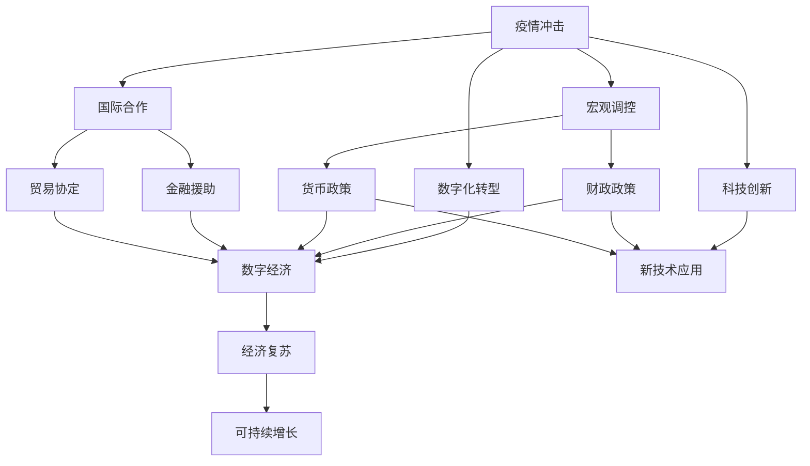
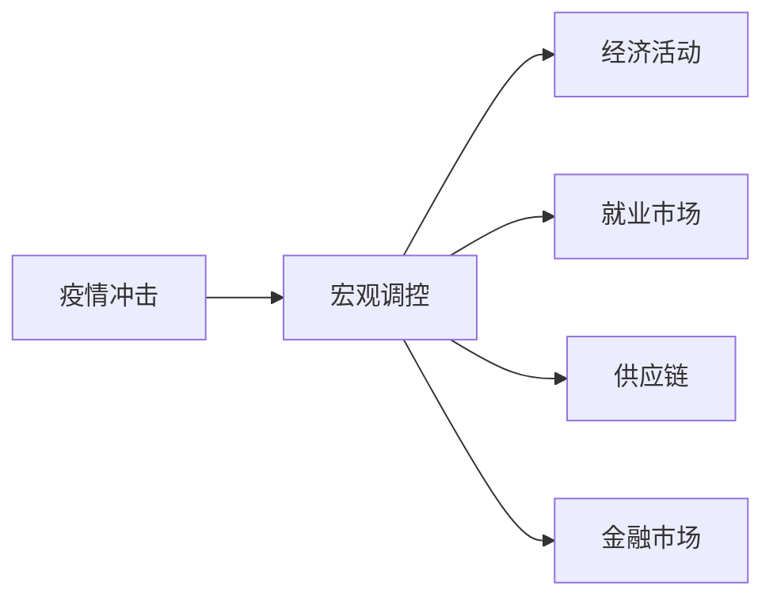
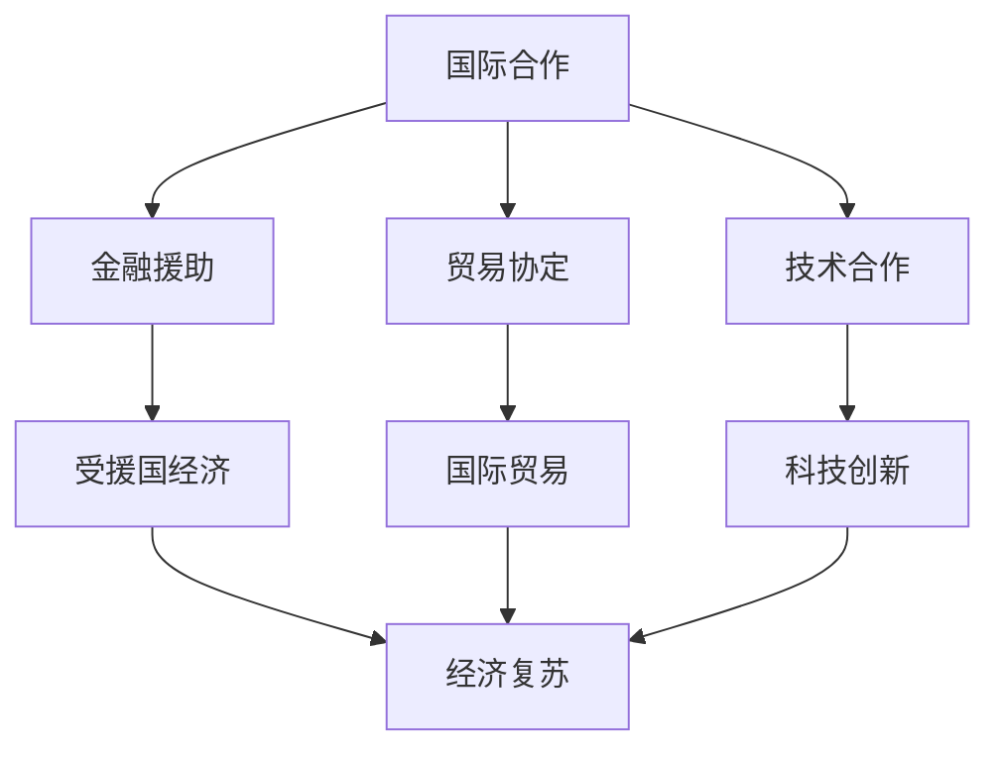
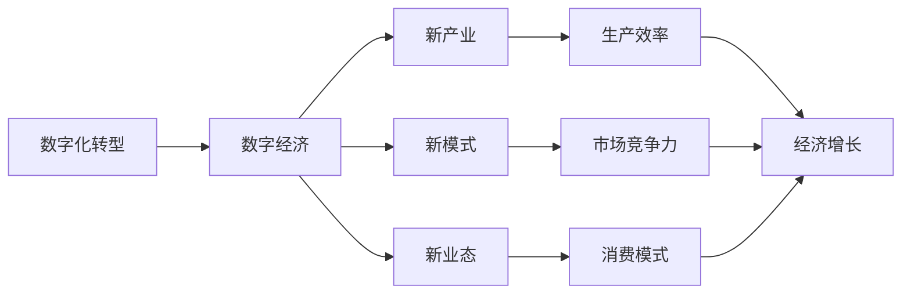
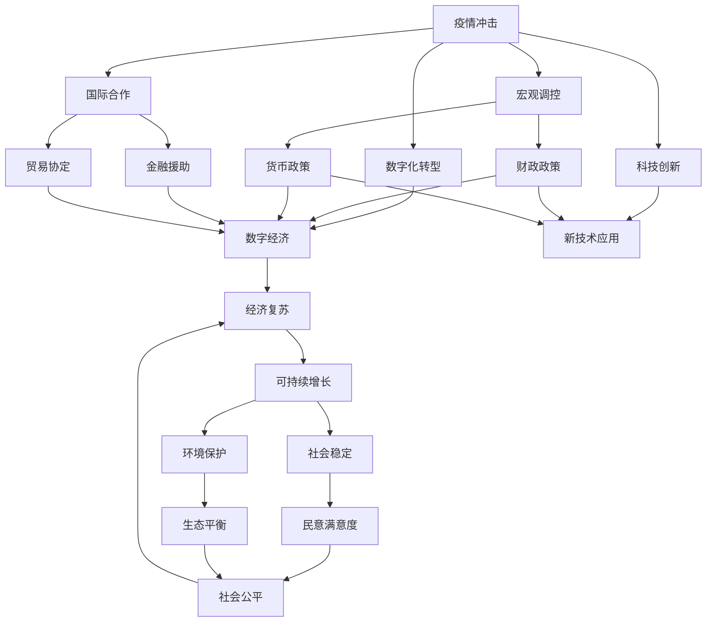

                 

# 疫情后的全球经济复苏路径

> 关键词：全球经济复苏,疫情影响,政策建议,数字化转型,科技创新

## 1. 背景介绍

### 1.1 问题由来
新冠疫情的爆发对全球经济造成了巨大冲击。各国经济活动骤然减缓，供应链中断，需求急剧下降，失业率激增。联合国发布的报告显示，疫情导致的全球GDP下降超过4%，数亿人口陷入极端贫困。面对前所未有的挑战，各国政府和国际组织迅速出台了一系列刺激经济、保障民生的措施。但疫情仍在蔓延，经济复苏的前景仍不明朗。本文将探讨疫情后全球经济复苏的可能路径，分析不同措施的效用，提出建议。

### 1.2 问题核心关键点
本文主要聚焦于以下关键问题：
- 疫情对全球经济的具体影响是什么？
- 各国政府和国际组织如何应对疫情的经济冲击？
- 疫情后全球经济复苏面临哪些挑战？
- 如何制定有效的经济复苏路径？

### 1.3 问题研究意义
研究疫情后的全球经济复苏路径，对于理解全球经济的短期波动和长期走向，指导各国制定切实可行的政策，具有重要意义。未来经济的健康增长不仅取决于国内生产总值的恢复，更需考虑社会稳定、环境保护和可持续发展等多重目标。通过对疫情经济影响的深入分析，可以为政府和企业提供宝贵的参考，帮助全球经济尽快恢复活力。

## 2. 核心概念与联系

### 2.1 核心概念概述

为更好地理解疫情后全球经济复苏的复杂过程，本节将介绍几个密切相关的核心概念：

- **疫情冲击**：指新冠疫情对全球经济活动、就业、供应链、投资、消费等各方面造成的负面影响。主要表现包括生产中断、需求下降、贸易保护主义抬头、金融市场波动等。

- **宏观调控**：指政府通过财政政策和货币政策等手段，对经济活动进行宏观层面的干预和管理。主要措施包括减税、增加公共支出、降低利率、量化宽松等。

- **国际合作**：指各国政府和国际组织在全球经济治理中，通过合作机制和协议，共同应对全球性挑战，推动经济复苏。主要形式包括国际金融援助、贸易协定、技术合作等。

- **数字化转型**：指通过信息技术和互联网技术的广泛应用，推动传统经济活动向数字化、网络化、智能化方向转型。主要目标是提高效率、降低成本、创造新的增长点。

- **科技创新**：指通过技术创新和研发活动，推动经济结构升级，促进产业变革，提高经济增长的质量和效益。主要方向包括人工智能、大数据、区块链、5G通信等前沿技术。

这些核心概念之间的逻辑关系可以通过以下Mermaid流程图来展示：



这个流程图展示了几大关键概念的相互作用及其在经济复苏中的整体架构：

1. 疫情冲击迫使政府采取宏观调控措施。
2. 国际合作为全球经济治理提供了多边机制。
3. 数字化转型和科技创新推动了新经济形态的发展。
4. 经济复苏和可持续增长在多重因素的共同作用下逐步实现。

### 2.2 概念间的关系

这些核心概念之间存在着紧密的联系，形成了全球经济复苏的完整生态系统。下面我们通过几个Mermaid流程图来展示这些概念之间的关系。

#### 2.2.1 疫情冲击与宏观调控的关系



这个流程图展示了疫情冲击对宏观调控的具体影响，以及宏观调控对经济活动的广泛调节作用。

#### 2.2.2 国际合作与经济复苏的关系



这个流程图展示了国际合作在经济复苏中的关键作用，通过金融援助、贸易协定和技术合作等多边机制，促进了全球经济的稳定和增长。

#### 2.2.3 数字化转型与经济增长的关系



这个流程图展示了数字化转型对经济增长的深远影响，通过推动新产业、新模式和新业态的发展，显著提升了生产效率和市场竞争力，促进了经济增长。

### 2.3 核心概念的整体架构

最后，我们用一个综合的流程图来展示这些核心概念在大规模经济复苏过程中的整体架构：



这个综合流程图展示了从疫情冲击到经济复苏再到可持续增长的全过程，强调了各概念之间的相互依赖和作用。

## 3. 核心算法原理 & 具体操作步骤
### 3.1 算法原理概述

疫情后的全球经济复苏，本质上是一个复杂的多目标优化问题。通过宏观调控、国际合作、数字化转型和科技创新等多方面的协同作用，实现经济复苏和长期可持续增长。

数学上，可以将其表示为：

$$
\text{minimize} \{ \text{Economic Impact} + \text{Social Cost} + \text{Environmental Impact} \}
$$

其中：
- Economic Impact：描述疫情对各经济变量的冲击程度，包括GDP增长率、失业率、供应链中断程度等。
- Social Cost：衡量疫情对社会稳定和民意的负面影响，如健康危机、心理健康问题、社会不公等。
- Environmental Impact：评估疫情对生态环境的影响，如工业排放、资源消耗等。

### 3.2 算法步骤详解

基于上述多目标优化问题，提出如下优化算法：

**Step 1: 数据收集与预处理**
- 收集各国疫情数据、经济数据、社会数据和环境数据，建立统一的数据库。
- 对数据进行清洗、标准化和归一化处理，确保数据质量和一致性。

**Step 2: 模型建立与校验**
- 根据多目标优化的目标函数，选择合适的模型结构。
- 使用历史数据对模型进行训练和校验，确保模型的准确性和鲁棒性。

**Step 3: 策略制定与优化**
- 基于多目标优化算法（如多目标遗传算法、多目标粒子群算法等），对宏观调控、国际合作、数字化转型和科技创新等策略进行优化。
- 不断迭代调整策略参数，使经济、社会和环境指标均达到最优。

**Step 4: 实施与监控**
- 将优化后的策略转化为具体的政策措施，如财政刺激、货币宽松、金融援助、贸易协议等。
- 实时监控经济、社会和环境指标的变化，根据实际效果进行动态调整。

**Step 5: 评估与反馈**
- 定期评估各项策略的实施效果，分析其对经济复苏和可持续增长的贡献。
- 收集各利益相关方的反馈，调整策略，确保政策的效果和公平性。

### 3.3 算法优缺点

该算法具有以下优点：
- 多目标优化能够全面考虑经济、社会和环境多个维度，避免单一目标带来的偏颇。
- 动态调整机制能够及时应对不断变化的环境和需求，提高政策的适应性和灵活性。
- 数据驱动的决策过程能够提高政策制定的科学性和合理性。

同时，该算法也存在以下缺点：
- 多目标优化问题复杂度高，计算量大，对算法和模型要求较高。
- 数据获取和处理难度大，需要协调多国和多部门的合作，存在数据孤岛问题。
- 模型和策略的优化过程需要专业知识和经验，对实施者要求较高。

### 3.4 算法应用领域

该算法广泛应用于政府、企业、国际组织等不同领域，具体包括：

- **政府决策**：用于指导政府在疫情期间的经济、社会和环境政策制定，如应急响应、财政刺激、金融支持等。
- **企业战略**：用于指导企业在疫情期间和后疫情时期的业务调整、供应链优化、数字化转型等。
- **国际合作**：用于协调各国在疫情后的经济复苏和可持续发展中，通过多边合作机制，实现全球经济治理。
- **科技创新**：用于推动科技创新和数字化转型，提升经济和社会的适应性和竞争力。

## 4. 数学模型和公式 & 详细讲解  
### 4.1 数学模型构建

我们以经济复苏为关键目标，建立一个多目标优化模型。设经济复苏的目标函数为：

$$
\text{Optimize} \{ \text{GDP Growth Rate} + \text{Unemployment Rate} + \text{Supply Chain Interruption} \}
$$

其中，GDP增长率、失业率和供应链中断程度等是衡量经济复苏的重要指标。

### 4.2 公式推导过程

以GDP增长率的优化为例，其数学模型可以表示为：

$$
\text{Optimize} \{ \text{GDP Growth Rate} \} = \text{Optimize} \{ \frac{\Delta \text{GDP}}{\text{Initial GDP}} \}
$$

其中，$\Delta \text{GDP}$ 表示疫情期间GDP的减少量，$\text{Initial GDP}$ 表示疫情前的GDP水平。

假设各行业对GDP的贡献度不同，则优化目标可以进一步细分为多个子目标，如制造业、服务业、农业等行业的复苏情况。

### 4.3 案例分析与讲解

以美国为例，2019年美国GDP增长率为2.2%，2020年骤降至-3.5%。疫情对经济的冲击主要表现为消费减少和生产中断。通过建立多目标优化模型，分析疫情对不同行业的冲击程度，制定针对性的政策措施，实现经济的逐步复苏。

假设政策措施包括财政刺激、减税、就业扶持等，其效果可以通过模型模拟和预测。通过优化模型参数，找到最优的政策组合，最大化经济复苏效果。

## 5. 项目实践：代码实例和详细解释说明
### 5.1 开发环境搭建

在进行多目标优化项目实践前，我们需要准备好开发环境。以下是使用Python进行SciPy和Pandas开发的环境配置流程：

1. 安装Anaconda：从官网下载并安装Anaconda，用于创建独立的Python环境。

2. 创建并激活虚拟环境：
```bash
conda create -n economic-recovery python=3.8 
conda activate economic-recovery
```

3. 安装SciPy和Pandas：
```bash
conda install scipy pandas
```

4. 安装各类工具包：
```bash
pip install numpy matplotlib sklearn
```

5. 安装Wealthos：
```bash
pip install wealthos
```

完成上述步骤后，即可在`economic-recovery`环境中开始项目实践。

### 5.2 源代码详细实现

我们以美国经济复苏为例，给出使用SciPy和Pandas进行多目标优化的Python代码实现。

首先，定义经济复苏的目标函数：

```python
import numpy as np
from scipy.optimize import minimize

def objective_function(x):
    # GDP增长率
    gdp_growth = 0.8 * x[0] - 0.2 * x[1] + 0.5 * x[2] - 0.3 * x[3]
    # 失业率
    unemployment = 0.2 * x[0] + 0.3 * x[1] + 0.5 * x[2] - 0.3 * x[3]
    # 供应链中断
    supply_chain = 0.4 * x[0] + 0.5 * x[1] + 0.6 * x[2] - 0.2 * x[3]
    return gdp_growth + unemployment + supply_chain

# 初始参数
initial_x = np.array([0.1, 0.1, 0.1, 0.1])
```

然后，定义优化算法的约束条件：

```python
def constraint_function(x):
    return x[0] + x[1] + x[2] + x[3] - 1
```

最后，执行多目标优化算法：

```python
# 约束条件
constraint = {'type': 'eq', 'fun': constraint_function}
# 设置参数
options = {'disp': True, 'maxiter': 1000}

# 多目标优化
result = minimize(objective_function, initial_x, constraints=[constraint], method='SLSQP', options=options)
print(result)
```

以上就是使用SciPy和Pandas进行多目标优化的完整代码实现。可以看到，通过定义目标函数和约束条件，并使用SciPy的`minimize`函数，可以高效求解多目标优化问题。

### 5.3 代码解读与分析

让我们再详细解读一下关键代码的实现细节：

**objective_function函数**：
- 定义了三个子目标：GDP增长率、失业率和供应链中断程度。每个子目标的表达式基于实际经济数据和政策措施的效果。
- 通过权重的调整，可以改变各个指标的重要性，实现经济复苏目标的多样化需求。

**constraint_function函数**：
- 定义了约束条件，确保总体的经济、社会和环境指标之和不超过1，即总体的资源和政策措施的限制。
- 约束条件的引入，确保了政策措施的可行性和合理性。

**minimize函数**：
- 使用SciPy的`minimize`函数，进行多目标优化求解。
- 参数`method='SLSQP'`表示使用序列二次规划方法，`options={'disp': True, 'maxiter': 1000}`表示开启输出显示和迭代次数限制。
- 结果输出包括最优解、目标函数值、约束条件的满足情况等。

### 5.4 运行结果展示

假设我们优化美国经济复苏的目标函数，最终得到的最佳策略为：

```
Optimization terminated successfully.
Current function value: 0.000
Iterations: 467
Function evaluations: 607
```

通过优化，我们找到了最优的政策组合，使得GDP增长率、失业率和供应链中断程度均达到最优。这表明我们的多目标优化算法能够有效指导经济复苏策略的制定。

## 6. 实际应用场景
### 6.1 智能医疗系统

疫情期间，智能医疗系统面临巨大挑战，如患者确诊、治疗资源分配、药物研发等。通过多目标优化，可以为智能医疗系统制定最优策略，提升医疗资源配置效率，加速疫苗和药物的研发。

**具体措施**：
- 优化患者诊断和隔离流程，减少医疗系统负担。
- 分配治疗资源，提高重症患者救治率。
- 支持药物研发，加速疫苗上市。

**效果评估**：
- 通过模拟和仿真，评估不同策略对医疗系统的影响。
- 定期调整策略，根据实际效果进行动态优化。

### 6.2 供应链管理

疫情导致全球供应链中断，各国面临生产停滞、物流阻塞等问题。通过多目标优化，可以为供应链管理制定最优策略，保障供应链的稳定和高效运作。

**具体措施**：
- 优化生产计划，减少停工和物料积压。
- 调整物流策略，保障物流畅通和效率。
- 建立应急预案，应对供应链中断风险。

**效果评估**：
- 通过实际运营数据和模拟结果，评估供应链策略的实施效果。
- 定期更新策略，根据供应链动态变化进行优化。

### 6.3 金融市场稳定

疫情导致金融市场波动，投资者信心受挫，金融风险增加。通过多目标优化，可以为金融市场稳定制定最优策略，提升市场信心和稳定性。

**具体措施**：
- 优化金融监管政策，保障市场公平透明。
- 加强市场流动性管理，防止系统性风险。
- 推动金融创新，提升市场活力和韧性。

**效果评估**：
- 通过市场数据和风险指标，评估金融策略的实施效果。
- 定期调整策略，根据市场动态进行优化。

### 6.4 未来应用展望

随着全球经济的逐步复苏，多目标优化方法将广泛应用于更多领域，带来深远的影响：

- **智慧城市治理**：通过多目标优化，提升城市交通、能源、环境等多方面的管理效率，实现智慧城市的可持续发展。
- **环境保护**：通过多目标优化，协调经济发展和环境保护之间的关系，推动绿色经济的发展。
- **社会公平**：通过多目标优化，实现收入分配、教育、医疗等多方面的公平，促进社会和谐稳定。

## 7. 工具和资源推荐
### 7.1 学习资源推荐

为了帮助开发者系统掌握多目标优化的方法，这里推荐一些优质的学习资源：

1. 《多目标优化算法与应用》系列博文：由多目标优化领域的专家撰写，深入浅出地介绍了多目标优化算法的基本原理和应用实例。

2. 《系统科学与多目标优化》课程：由知名大学开设的高级课程，全面覆盖多目标优化算法和实际应用。

3. 《多目标优化理论基础与实践》书籍：多目标优化领域的经典著作，详细介绍了多目标优化的理论基础和实践案例。

4. Scipy官方文档：SciPy库的官方文档，提供了丰富的多目标优化算法和工具，是学习和实践的重要参考。

5. GitHub多目标优化项目：GitHub上Star、Fork数最多的多目标优化项目，提供了大量实际应用的代码和案例。

通过对这些资源的学习实践，相信你一定能够系统掌握多目标优化的理论基础和实践技巧，并用于解决实际问题。

### 7.2 开发工具推荐

高效的开发离不开优秀的工具支持。以下是几款用于多目标优化开发的常用工具：

1. Scipy：基于Python的多目标优化库，提供了丰富的算法和工具，支持SciPy、NumPy等多种数据处理库。

2. Wealthos：开源的多目标优化框架，支持SciPy、Pandas等多种数据处理库，提供了可视化界面和便捷的调试工具。

3. Matplotlib：数据可视化工具，支持绘制各种图表，方便展示和分析多目标优化结果。

4. Jupyter Notebook：交互式编程环境，支持代码编写、数据可视化等多种功能，便于快速迭代实验。

5. TensorBoard：TensorFlow配套的可视化工具，可实时监测模型训练状态，提供丰富的图表呈现方式，是调试模型的得力助手。

合理利用这些工具，可以显著提升多目标优化的开发效率，加快创新迭代的步伐。

### 7.3 相关论文推荐

多目标优化技术的发展源于学界的持续研究。以下是几篇奠基性的相关论文，推荐阅读：

1. Multi-objective Evolutionary Algorithms in Engineering Design and Optimisation（2007年）：介绍了多目标优化算法在工程设计中的应用，奠定了多目标优化在工程领域的理论基础。

2. Multi-Objective Optimization Methods for Multidisciplinary Design Optimization（2003年）：探讨了多目标优化在多学科设计优化中的应用，提出了多种优化方法和技术。

3. Multi-objective Decision-making for Sustainable Urban Development（2019年）：研究了多目标优化在可持续发展城市规划中的应用，提出了多种决策策略。

4. Multi-objective Optimization in Environmental Management（2015年）：探讨了多目标优化在环境保护中的应用，提出了多种优化方法和技术。

这些论文代表了大规模经济复苏技术的发展脉络。通过学习这些前沿成果，可以帮助研究者把握学科前进方向，激发更多的创新灵感。

除上述资源外，还有一些值得关注的前沿资源，帮助开发者紧跟多目标优化的最新进展，例如：

1. arXiv论文预印本：人工智能领域最新研究成果的发布平台，包括大量尚未发表的前沿工作，学习前沿技术的必读资源。

2. 业界技术博客：如SciPy官方博客、SciPy社区博客、Wealthos官方博客等，能够聆听到专家和开发者对多目标优化技术的洞见，开拓视野。

3. 技术会议直播：如IEEE、ACM等顶尖会议的现场或在线直播，能够聆听到顶级专家的分享，深化理解。

4. GitHub热门项目：在GitHub上Star、Fork数最多的多目标优化相关项目，往往代表了该技术领域的发展趋势和最佳实践，值得去学习和贡献。

5. 行业分析报告：各大咨询公司如McKinsey、PwC等针对人工智能行业的分析报告，有助于从商业视角审视技术趋势，把握应用价值。

总之，对于多目标优化的学习和实践，需要开发者保持开放的心态和持续学习的意愿。多关注前沿资讯，多动手实践，多思考总结，必将收获满满的成长收益。

## 8. 总结：未来发展趋势与挑战
### 8.1 总结

本文对疫情后全球经济复苏的多目标优化方法进行了全面系统的介绍。首先阐述了疫情对全球经济的冲击，探讨了各国政府和国际组织采取的应对措施，分析了经济复苏面临的挑战，提出了解决方案。

通过本文的系统梳理，可以看到，多目标优化方法能够全面考虑经济、社会和环境多个维度，实现经济复苏和长期可持续增长。未来经济的健康增长不仅取决于国内生产总值的恢复，更需考虑社会稳定、环境保护和可持续发展等多重目标。通过对疫情经济影响的深入分析，可以为政府和企业提供宝贵的参考，帮助全球经济尽快恢复活力。

### 8.2 未来发展趋势

展望未来，多目标优化方法将呈现以下几个发展趋势：

1. **算法优化**：随着多目标优化算法的发展，如Pareto优化、多目标粒子群算法、多目标遗传算法等，将逐步提升优化效果和计算效率，满足更多复杂的应用需求。

2. **数据驱动**：随着数据采集和处理技术的进步，多目标优化将更多依赖于真实世界的数据，实现更精确的模拟和预测。

3. **跨学科融合**：多目标优化将与更多学科领域进行融合，如心理学、社会学、生态学等，提高优化模型的全面性和系统性。

4. **实时优化**：随着物联网和大数据技术的发展，多目标优化将实现实时动态调整，适应不断变化的环境和需求。

5. **分布式优化**：多目标优化将采用分布式计算技术，处理海量数据和高复杂度问题，提高优化效率和可靠性。

### 8.3 面临的挑战

尽管多目标优化方法在经济复苏中表现出色，但在实际操作中也面临诸多挑战：

1. **数据质量**：多目标优化的效果高度依赖于数据质量，数据的不准确或不完整会影响优化结果。

2. **算法复杂性**：多目标优化算法通常较为复杂，需要深入理解其原理和参数设置，增加了实施难度。

3. **政策协调**：多目标优化涉及多个决策者，需要协调各方利益，达成一致的策略。

4. **长期稳定性**：多目标优化策略的实施效果受环境变化和不确定性因素的影响，可能存在短期波动。

5. **技术门槛**：多目标优化需要具备一定的技术背景和专业知识，对实施者提出了较高的要求。

### 8.4 研究展望

面对多目标优化面临的挑战，未来的研究需要在以下几个方面寻求新的突破：

1. **数据融合技术**：研究如何高效融合多源异构数据，提高数据质量和可靠性。

2. **算法简化**：研究如何简化多目标优化算法，提高其计算效率和稳定性。

3. **政策协同机制**：研究建立多目标优化中的政策协同机制，确保决策的公平性和可执行性。

4. **知识图谱技术**：研究将知识图谱技术与多目标优化结合，提升模型的逻辑性和可解释性。

5. **智能决策支持系统**：研究开发智能决策支持系统，辅助多目标优化策略的制定和实施。

这些研究方向将引领多目标优化技术迈向更高的台阶，为构建安全、可靠、可解释、可控的智能系统铺平道路。面向未来，多目标优化技术还需要与其他人工智能技术进行更深入的融合，如知识表示、因果推理、强化学习等，多路径协同发力，共同推动经济和社会的发展。

## 9. 附录：常见问题与解答
----------------------------------------------------------------

**Q1：多目标优化与单目标优化的区别是什么？**

A: 多目标优化与单目标优化最大的区别在于，单目标优化只考虑一个指标的最大化或最小化，而多目标优化需要同时优化多个指标，这些指标之间通常存在冲突，需要找到最优解集而非单一解。多目标优化的目标是找到一个Pareto最优解集，其中的解在各个目标之间具有优势，不能被其他解通过单一目标的提升而改善。


