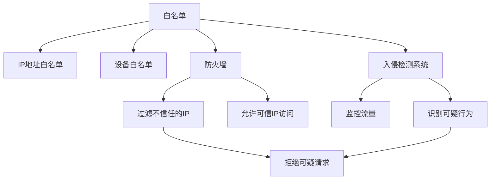

                 

# 白名单：防止未经授权的访问

> 关键词：白名单, 访问控制, 身份认证, 安全策略, 防火墙, 入侵检测

## 1. 背景介绍

在当今数字化日益深入的互联网时代，网络安全成为人们关注的焦点。身份认证和权限控制是网络安全的基石，但随着技术的发展和应用场景的复杂化，传统基于IP地址和用户名的身份认证方式已经无法满足高安全要求，白名单（Whitelist）成为一种更为安全和灵活的访问控制手段。

白名单指的是仅允许特定IP地址或设备访问服务或资源的访问控制列表。通过预先定义的规则集，白名单可以提供比传统身份认证更严格、更细致的控制，确保只有经过授权的用户和设备才能访问系统。本文将详细介绍白名单的核心概念、算法原理、具体操作步骤以及实际应用场景，帮助读者深入理解白名单技术，并在实际工作中加以应用。

## 2. 核心概念与联系

### 2.1 核心概念概述

白名单（Whitelist）是一种访问控制策略，它只允许预先定义的IP地址或设备访问网络资源。与传统的黑名单（Blacklist）相反，白名单不限制不信任的访问，而是仅授权受信任的访问。

- **白名单（Whitelist）**：预先定义的允许访问的IP地址或设备列表。
- **黑名单（Blacklist）**：预先定义的不允许访问的IP地址或设备列表。
- **IP地址白名单**：仅允许特定IP地址访问服务。
- **设备白名单**：仅允许特定设备访问服务。
- **防火墙（Firewall）**：网络安全的边界控制设备，用于过滤不信任的访问请求。
- **入侵检测系统（IDS）**：监控网络流量，识别和响应可疑行为，提供额外的安全层。
- **认证与授权（Authentication and Authorization）**：验证用户身份并确定其访问权限的过程。

这些核心概念之间的联系通过以下Mermaid流程图展示：



## 3. 核心算法原理 & 具体操作步骤

### 3.1 算法原理概述

白名单的原理基于IP地址或设备的预设规则。当网络请求到达防火墙时，防火墙根据白名单规则判断请求的来源是否在白名单中。如果是，则允许访问；如果不是，则拒绝访问。白名单规则一般包括：

- **IP地址白名单**：只允许特定IP地址访问服务。
- **设备白名单**：只允许特定设备的MAC地址访问服务。
- **时间白名单**：在特定时间段内允许访问。

### 3.2 算法步骤详解

白名单的实现主要涉及以下几个步骤：

**Step 1: 定义白名单规则**
- 确定允许访问的白名单IP地址或设备。
- 如果需要，设定时间窗口。

**Step 2: 配置防火墙**
- 将白名单IP地址或设备添加到防火墙规则中。
- 配置防火墙以允许来自白名单IP地址或设备的流量。

**Step 3: 配置入侵检测系统**
- 配置IDS以监控白名单外的流量。
- 设定IDS的警报规则，及时响应可疑行为。

**Step 4: 监控和维护**
- 定期检查白名单IP地址或设备的变化。
- 对白名单进行动态更新，适应业务需求的变化。

**Step 5: 审计日志**
- 记录和分析白名单的使用情况。
- 对异常访问事件进行审计和报告。

### 3.3 算法优缺点

**优点：**
- 更安全：仅授权可信访问，避免了黑名单中的复杂性。
- 灵活性高：可以根据业务需求动态更新白名单。
- 易于管理：规则简单直观，易于维护。

**缺点：**
- 依赖规则：白名单的规则需要人工维护，容易出现疏漏。
- 扩展性差：当白名单的规则数量增加时，管理成本会上升。
- 限制性强：可能限制一些合法但未在白名单中的访问。

### 3.4 算法应用领域

白名单广泛应用于网络安全、企业内部网络管理、云服务、移动应用等场景中，用于保护敏感数据和关键资源。

- **网络安全**：保护企业内部网络和重要系统的安全。
- **企业内部网络**：限制员工访问外部不安全的网站。
- **云服务**：限制特定IP访问云服务。
- **移动应用**：仅允许特定的设备访问移动应用。

## 4. 数学模型和公式 & 详细讲解 & 举例说明

### 4.1 数学模型构建

白名单的数学模型可以简化为一个布尔逻辑表达式，表示白名单规则的组合。假设白名单包含 $N$ 个IP地址或设备，$T$ 个时间窗口，则白名单的数学模型可以表示为：

$$
W(x, t) = \bigwedge_{i=1}^{N}(x_i \in \text{IP Whitelist}) \wedge \bigwedge_{j=1}^{T}(t_j \in \text{Time Whitelist})
$$

其中 $x$ 表示当前访问的IP地址或设备，$t$ 表示当前访问的时间，$\text{IP Whitelist}$ 表示IP地址白名单，$\text{Time Whitelist}$ 表示时间白名单。

### 4.2 公式推导过程

对于单一IP地址白名单，假设白名单包含 $N$ 个IP地址，当前访问的IP地址为 $x$，则访问是否被授权的布尔表达式可以表示为：

$$
W(x) = \bigvee_{i=1}^{N}(x_i = x)
$$

其中 $x_i$ 表示白名单中的第 $i$ 个IP地址。

对于时间白名单，假设白名单包含 $T$ 个时间窗口，当前访问的时间为 $t$，则访问是否被授权的布尔表达式可以表示为：

$$
W(t) = \bigvee_{j=1}^{T}(t_j = t)
$$

其中 $t_j$ 表示白名单中的第 $j$ 个时间窗口。

### 4.3 案例分析与讲解

假设一个企业内部网络的白名单包含两个IP地址（192.168.1.1和192.168.1.2），并且仅在上午8点至下午6点之间允许访问。当前访问的IP地址为192.168.1.3，访问时间为下午3点。根据白名单规则，访问被拒绝。白名单规则可以表示为：

$$
W(192.168.1.3, 15:00) = (192.168.1.1 = 192.168.1.3) \wedge (192.168.1.2 = 192.168.1.3) \wedge (08:00 \leq t < 18:00)
$$

由于访问IP地址192.168.1.3不在白名单中，并且访问时间不在白名单定义的时间窗口内，因此访问被拒绝。

## 5. 项目实践：代码实例和详细解释说明

### 5.1 开发环境搭建

为了演示白名单的实现，需要搭建一个基本的开发环境。以下是基于Python和Flask框架的示例环境配置：

1. 安装Python和Flask：
```bash
sudo apt-get install python3 python3-pip
sudo pip3 install flask
```

2. 创建Python文件：
```bash
mkdir whitelist_example
cd whitelist_example
```

3. 编写代码：
```python
from flask import Flask, request, jsonify

app = Flask(__name__)

# 定义白名单IP地址
ip_whitelist = ['192.168.1.1', '192.168.1.2']

# 定义时间白名单
time_whitelist = ['08:00-18:00']

def is_whitelisted(ip, time):
    if ip in ip_whitelist and time in time_whitelist:
        return True
    return False

@app.route('/check_whitelist', methods=['GET'])
def check_whitelist():
    ip = request.args.get('ip')
    time = request.args.get('time')
    if is_whitelisted(ip, time):
        return jsonify({'status': 'allowed'})
    else:
        return jsonify({'status': 'denied'})

if __name__ == '__main__':
    app.run(debug=True, host='0.0.0.0', port=5000)
```

### 5.2 源代码详细实现

在上述代码中，我们使用Flask框架搭建了一个简单的Web服务，接收客户端请求，检查访问IP和时间是否在白名单中。如果白名单检查通过，则返回“allowed”，否则返回“denied”。

**关键代码解释：**
- `ip_whitelist`和`time_whitelist`：定义白名单IP地址和时间窗口。
- `is_whitelisted(ip, time)`：根据访问IP和时间检查是否在白名单中。
- `/check_whitelist`：接收访问IP和时间参数，返回白名单检查结果。

### 5.3 代码解读与分析

**代码结构：**
- 使用Flask框架搭建Web服务，方便在客户端发送HTTP请求进行测试。
- 定义白名单IP地址和时间窗口，用于白名单规则的判断。
- `is_whitelisted(ip, time)`函数：接收访问IP和时间，根据白名单规则判断是否允许访问。
- `/check_whitelist`路由：接收访问IP和时间参数，返回白名单检查结果。

**代码实现细节：**
- 使用Python列表存储白名单IP地址和时间窗口，实现简单直观。
- 在`is_whitelisted`函数中使用布尔表达式判断访问IP和时间是否在白名单中。
- 在Web服务中使用Flask的`request.args`方法获取请求参数，使用`jsonify`方法返回JSON格式的响应结果。

**代码测试：**
- 可以使用curl命令或浏览器发送GET请求，例如：
```
curl -X GET http://localhost:5000/check_whitelist?ip=192.168.1.3&time=15:00
```

### 5.4 运行结果展示

假设白名单中包含IP地址192.168.1.1和192.168.1.2，时间窗口为08:00-18:00。当访问IP为192.168.1.3，访问时间为15:00时，访问被拒绝。返回的JSON结果如下：

```json
{"status": "denied"}
```

## 6. 实际应用场景

白名单技术在实际应用中广泛使用，以下是几个典型的应用场景：

### 6.1 企业内部网络

企业内部网络需要保护关键资源和敏感数据，白名单技术可以有效防止外部恶意访问。企业可以通过白名单限制员工访问不安全的网站，只允许特定的IP地址和设备访问内部资源，确保网络安全。

### 6.2 云服务

云服务提供商可以通过白名单限制特定IP地址访问云资源，防止未经授权的访问和数据泄露。例如，AWS和Azure等云平台提供了白名单功能，用户可以设置访问规则，控制对云资源的访问。

### 6.3 移动应用

移动应用需要保护用户隐私和数据安全，白名单技术可以限制特定设备的访问，防止恶意设备攻击和数据泄漏。例如，移动应用可以通过白名单限制用户设备的访问，确保只有授权设备才能访问应用。

### 6.4 金融系统

金融系统需要处理大量敏感数据，白名单技术可以限制特定IP地址和时间窗口访问金融系统，防止未经授权的访问和攻击。例如，银行和证券公司可以使用白名单控制访问金融交易系统和客户数据。

## 7. 工具和资源推荐

### 7.1 学习资源推荐

为了深入了解白名单技术，以下是一些推荐的资源：

- 《网络安全基础》：一本介绍网络安全的入门书籍，包含白名单技术的基本概念和实现方法。
- 《Flask Web开发》：一本介绍Flask框架的入门书籍，帮助读者搭建和部署白名单系统。
- 《Python网络编程》：一本介绍Python网络编程的书籍，包含白名单实现的代码示例。

### 7.2 开发工具推荐

为了实现白名单技术，以下是一些推荐的开发工具：

- Python：一种高效易学的编程语言，适合开发白名单系统。
- Flask：一个轻量级的Web框架，方便搭建和部署白名单系统。
- nginx：一个高性能的反向代理和负载均衡器，用于实现白名单过滤。

### 7.3 相关论文推荐

以下是几篇关于白名单技术的经典论文，推荐阅读：

- "Security Whitelists in Network Security"：介绍了白名单技术的基本原理和实现方法。
- "Effective Whitelisting Strategies for Network Security"：介绍了一些有效的白名单策略和实现方法。
- "Network Security with Whitelisting and Blacklisting"：介绍了白名单和黑名单技术的结合使用。

## 8. 总结：未来发展趋势与挑战

### 8.1 总结

本文详细介绍了白名单技术的基本概念、算法原理、具体操作步骤以及实际应用场景。白名单技术作为一种访问控制策略，可以有效防止未经授权的访问，保护网络资源和敏感数据。通过本文的系统梳理，读者可以深入理解白名单技术的原理和实现方法，并在实际工作中加以应用。

### 8.2 未来发展趋势

展望未来，白名单技术将继续发展和演进，可能出现以下趋势：

- **自动化管理**：通过自动化工具和系统，动态管理白名单IP地址和时间窗口，降低人工维护成本。
- **跨域扩展**：白名单技术将扩展到跨域场景，如云平台、移动应用等，提供更灵活的访问控制策略。
- **人工智能结合**：结合机器学习和人工智能技术，实现动态白名单管理，提高白名单的安全性和准确性。

### 8.3 面临的挑战

尽管白名单技术在实际应用中广泛使用，但仍面临一些挑战：

- **管理复杂性**：白名单的规则需要人工维护，容易出现疏漏和错误。
- **扩展性差**：当白名单的规则数量增加时，管理成本会上升。
- **误报率高**：白名单规则过于严格可能导致误报率高，影响用户体验。

### 8.4 研究展望

未来的研究需要在以下几个方面寻求新的突破：

- **自动化管理**：开发自动化工具和系统，动态管理白名单规则，降低人工维护成本。
- **跨域扩展**：扩展白名单技术到跨域场景，如云平台、移动应用等，提供更灵活的访问控制策略。
- **人工智能结合**：结合机器学习和人工智能技术，实现动态白名单管理，提高白名单的安全性和准确性。

## 9. 附录：常见问题与解答

**Q1：白名单是否适用于所有场景？**

A: 白名单适用于需要对访问进行严格控制的场景，如企业内部网络、云服务、金融系统等。但在某些场景下，如社交网络和论坛等，白名单的规则难以灵活管理，可能导致用户体验下降。

**Q2：白名单如何处理误报和漏报？**

A: 白名单的误报和漏报可以通过以下方式处理：
- **误报处理**：调整白名单规则，避免过于严格，减少误报。
- **漏报处理**：增加白名单规则，扩大覆盖范围，减少漏报。

**Q3：白名单如何与入侵检测系统结合？**

A: 白名单可以与入侵检测系统结合，增强网络安全。入侵检测系统可以监控白名单外的流量，及时发现和响应可疑行为，提供额外的安全层。

**Q4：白名单是否适用于公有云环境？**

A: 白名单适用于公有云环境，但需要结合云平台提供的安全策略，如IP列表、访问控制列表等，进行综合配置。云平台通常提供了灵活的访问控制策略，可以与白名单结合使用。

**Q5：白名单如何处理多设备并发访问？**

A: 白名单可以通过限制并发访问数量，确保每个设备访问的稳定性和可靠性。例如，可以设置每个设备的并发访问数量限制，防止设备访问过载。

---

作者：禅与计算机程序设计艺术 / Zen and the Art of Computer Programming

