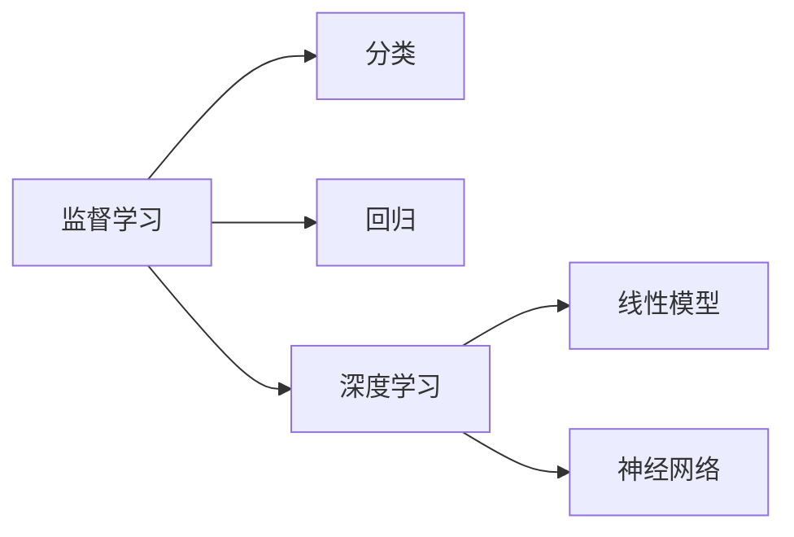
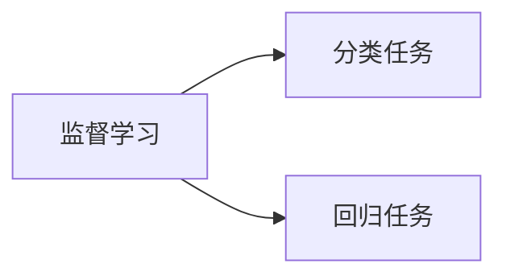
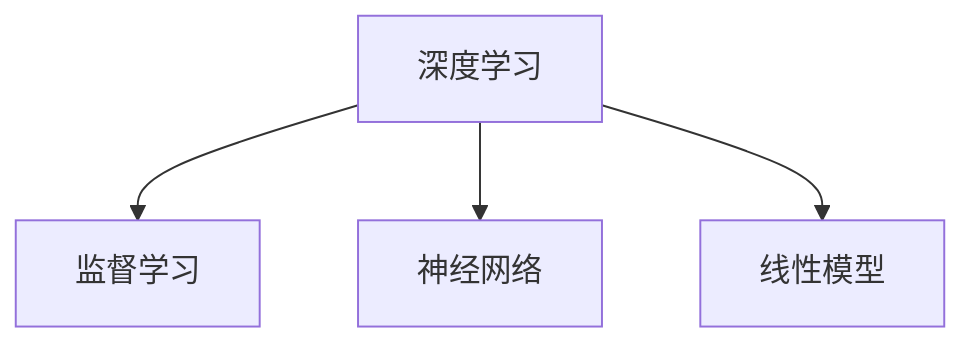
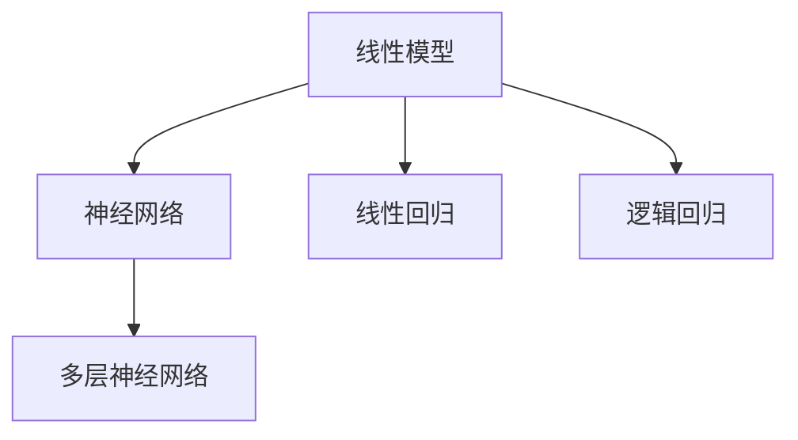

                 

# 监督学习 (Supervised Learning)

> 关键词：监督学习, 机器学习, 分类, 回归, 深度学习, 线性模型, 神经网络

## 1. 背景介绍

### 1.1 问题由来

在人工智能领域，监督学习（Supervised Learning）是机器学习中最基本且应用最广泛的一种学习范式。通过利用带有标签的训练数据，模型能够学习到输入数据与输出标签之间的映射关系，从而对新的未标记数据进行预测或分类。

监督学习在诸多应用场景中取得了显著的成功，例如：
- **图像分类**：利用训练集中的图片和对应的标签，模型能够学习到图片特征与分类标签之间的关系，进而对新图片进行分类。
- **语音识别**：通过带有标签的语音数据，模型能够学习到语音信号与对应的文字或命令之间的关系。
- **自然语言处理**：利用带有标签的文本数据，模型能够学习到语言结构与上下文之间的关系，从而实现情感分析、问答系统等任务。
- **医疗诊断**：通过带有标签的影像数据和诊断结果，模型能够学习到影像特征与疾病诊断之间的关系，辅助医生进行疾病判断。

尽管监督学习在许多任务上取得了巨大成功，但它仍面临着一些挑战和局限性，如模型过拟合、泛化能力不足、高标注成本等。随着深度学习技术的兴起，监督学习得到了进一步的扩展和改进，特别是通过深度神经网络的引入，使得模型能够处理更加复杂、高维度的数据，并取得了显著的性能提升。

### 1.2 问题核心关键点

监督学习的核心在于通过有监督的训练数据，学习输入数据与输出标签之间的映射关系，从而实现对新数据的预测或分类。在实际应用中，主要包括以下几个关键问题：
- **数据标注**：监督学习的训练过程需要大量标注数据，数据的标注成本和质量直接影响到模型性能。
- **模型选择**：监督学习中，选择合适的模型结构和学习算法对性能至关重要。常用的模型包括线性模型、决策树、随机森林、支持向量机、神经网络等。
- **损失函数设计**：损失函数用于衡量模型预测输出与真实标签之间的差异，常见的损失函数包括交叉熵损失、均方误差损失等。
- **优化算法**：优化算法用于最小化损失函数，常见的优化算法包括梯度下降、随机梯度下降、Adam、Adagrad等。
- **正则化技术**：正则化技术用于防止模型过拟合，常见的正则化技术包括L1正则、L2正则、Dropout等。

这些关键点相互交织，共同构成了监督学习的基本框架，是理解和应用监督学习算法的基础。

## 2. 核心概念与联系

### 2.1 核心概念概述

为更好地理解监督学习，本节将介绍几个密切相关的核心概念：

- **监督学习（Supervised Learning）**：一种机器学习范式，通过利用带有标签的训练数据，学习输入数据与输出标签之间的映射关系，从而实现对新数据的预测或分类。
- **分类（Classification）**：监督学习中最基本的任务之一，旨在将数据分为不同的类别。常用的分类算法包括决策树、支持向量机、神经网络等。
- **回归（Regression）**：监督学习的另一种重要任务，旨在预测连续数值型变量的值。常见的回归算法包括线性回归、多项式回归、神经网络等。
- **深度学习（Deep Learning）**：一种基于多层神经网络的监督学习方法，通过深度神经网络对高维数据进行建模和预测。深度学习在图像分类、语音识别、自然语言处理等领域取得了显著的成功。
- **线性模型（Linear Model）**：一种简单的监督学习模型，包括线性回归、逻辑回归等，通过线性关系对数据进行建模和预测。
- **神经网络（Neural Network）**：一种复杂的监督学习模型，通过多层神经元之间的非线性变换，实现对高维数据的建模和预测。

这些核心概念之间的逻辑关系可以通过以下Mermaid流程图来展示：



这个流程图展示了大语言模型的核心概念及其之间的关系：

1. 监督学习包括分类和回归两种基本任务。
2. 深度学习是监督学习中一种复杂的模型形式。
3. 深度学习模型包括线性模型和神经网络两种形式。

### 2.2 概念间的关系

这些核心概念之间存在着紧密的联系，形成了监督学习的完整生态系统。下面我通过几个Mermaid流程图来展示这些概念之间的关系。

#### 2.2.1 监督学习的任务范式



这个流程图展示了监督学习的两种基本任务类型：分类和回归。

#### 2.2.2 深度学习与监督学习的关系



这个流程图展示了深度学习与监督学习之间的关系。深度学习包括神经网络和线性模型两种形式，其中神经网络是最常用的深度学习模型。

#### 2.2.3 线性模型与神经网络的关系



这个流程图展示了线性模型与神经网络之间的关系。线性模型包括线性回归和逻辑回归，而神经网络则是由多个线性模型构成的多层网络。

## 3. 核心算法原理 & 具体操作步骤

### 3.1 算法原理概述

监督学习的核心思想是通过利用带有标签的训练数据，学习输入数据与输出标签之间的映射关系，从而实现对新数据的预测或分类。形式化地，假设训练数据集为 $D=\{(x_i, y_i)\}_{i=1}^N$，其中 $x_i \in \mathcal{X}$ 为输入样本，$y_i \in \mathcal{Y}$ 为对应的标签，$\mathcal{X}$ 和 $\mathcal{Y}$ 分别为输入和输出的空间。目标是通过训练一个模型 $f$，使得 $f(x)$ 能够最小化预测输出 $y$ 与真实标签 $y_i$ 之间的差异，即：

$$
\min_{f} \frac{1}{N} \sum_{i=1}^N L(f(x_i), y_i)
$$

其中 $L$ 为损失函数，用于衡量预测输出与真实标签之间的差异。常见的损失函数包括交叉熵损失、均方误差损失等。

通过梯度下降等优化算法，监督学习模型不断更新模型参数，最小化损失函数，从而逼近最优预测函数 $f$。

### 3.2 算法步骤详解

监督学习的一般流程包括以下几个关键步骤：

**Step 1: 准备训练数据集**
- 收集并标注有标签的训练数据集，数据集应具有代表性，覆盖多种情况。
- 将数据集分为训练集、验证集和测试集，通常训练集占总数据的70-80%，验证集和测试集各占10-20%。

**Step 2: 选择模型架构**
- 根据任务类型选择合适的模型架构，如线性回归、决策树、支持向量机、神经网络等。
- 对于深度学习任务，通常选择多层神经网络作为模型架构，包括卷积神经网络（CNN）、循环神经网络（RNN）、长短时记忆网络（LSTM）等。

**Step 3: 选择损失函数**
- 根据任务类型选择合适的损失函数，如交叉熵损失、均方误差损失、对数损失等。
- 对于分类任务，常用的损失函数包括二分类交叉熵损失、多分类交叉熵损失等。

**Step 4: 设置超参数**
- 设置优化算法及其参数，如学习率、批大小、迭代轮数等。
- 设置正则化技术及强度，包括权重衰减、Dropout等。

**Step 5: 执行梯度训练**
- 将训练集数据分批次输入模型，前向传播计算损失函数。
- 反向传播计算参数梯度，根据设定的优化算法和学习率更新模型参数。
- 周期性在验证集上评估模型性能，根据性能指标决定是否触发 Early Stopping。
- 重复上述步骤直到满足预设的迭代轮数或 Early Stopping 条件。

**Step 6: 测试和部署**
- 在测试集上评估训练好的模型性能，对比训练前后的精度提升。
- 使用训练好的模型对新数据进行预测或分类，集成到实际的应用系统中。
- 持续收集新的数据，定期重新训练和微调模型，以适应数据分布的变化。

以上是监督学习的一般流程。在实际应用中，还需要根据具体任务的特点，对流程的各个环节进行优化设计，如改进训练目标函数，引入更多的正则化技术，搜索最优的超参数组合等，以进一步提升模型性能。

### 3.3 算法优缺点

监督学习的优点包括：
1. 简单易用：监督学习模型结构简单，易于实现和理解。
2. 适用性广：监督学习适用于多种类型的数据和任务，如分类、回归、序列预测等。
3. 泛化能力强：通过大量标注数据，监督学习模型能够学习到输入数据与输出标签之间的复杂关系，具有较强的泛化能力。
4. 结果可解释：监督学习模型基于逻辑回归、线性回归等线性模型，其决策过程具有可解释性，便于分析和调试。

监督学习的缺点包括：
1. 数据标注成本高：监督学习需要大量带有标签的训练数据，数据标注成本较高。
2. 过拟合风险：监督学习模型容易出现过拟合，特别是在训练数据较少的情况下。
3. 模型依赖标注数据：监督学习模型需要大量的标注数据来训练，数据标注质量直接影响模型性能。
4. 模型复杂度高：深度学习模型结构复杂，训练和推理时间较长。
5. 特征工程困难：监督学习模型需要手动设计特征，特征工程对模型性能影响较大。

尽管监督学习存在这些缺点，但它在许多实际应用中仍然表现优异，特别是在数据标注成本较低的情况下。通过选择合适的模型架构和损失函数，并结合正则化技术，可以有效地避免过拟合，提高模型的泛化能力。

### 3.4 算法应用领域

监督学习广泛应用于各种领域，包括但不限于：
- **计算机视觉**：图像分类、目标检测、图像分割等任务。
- **自然语言处理**：情感分析、文本分类、机器翻译、语音识别等任务。
- **医疗诊断**：疾病诊断、影像分析、基因分析等任务。
- **金融分析**：股票预测、信用评分、风险评估等任务。
- **营销分析**：客户分类、行为预测、广告推荐等任务。

监督学习在许多领域中发挥着重要作用，帮助人们从数据中提取有价值的信息，进行预测、分类和决策。

## 4. 数学模型和公式 & 详细讲解 & 举例说明

### 4.1 数学模型构建

本节将使用数学语言对监督学习的训练过程进行更加严格的刻画。

假设训练数据集为 $D=\{(x_i, y_i)\}_{i=1}^N$，其中 $x_i \in \mathcal{X}$ 为输入样本，$y_i \in \mathcal{Y}$ 为对应的标签，$\mathcal{X}$ 和 $\mathcal{Y}$ 分别为输入和输出的空间。监督学习的目标是通过训练一个模型 $f$，使得 $f(x)$ 能够最小化预测输出 $y$ 与真实标签 $y_i$ 之间的差异，即：

$$
\min_{f} \frac{1}{N} \sum_{i=1}^N L(f(x_i), y_i)
$$

其中 $L$ 为损失函数，用于衡量预测输出与真实标签之间的差异。常见的损失函数包括交叉熵损失、均方误差损失等。

### 4.2 公式推导过程

以下我们以二分类任务为例，推导交叉熵损失函数及其梯度的计算公式。

假设模型 $f$ 在输入 $x$ 上的输出为 $\hat{y}=f(x) \in [0,1]$，表示样本属于正类的概率。真实标签 $y \in \{0,1\}$。则二分类交叉熵损失函数定义为：

$$
L(f(x),y) = -[y\log \hat{y} + (1-y)\log (1-\hat{y})]
$$

将其代入监督学习模型的目标函数，得：

$$
\min_{f} \frac{1}{N} \sum_{i=1}^N L(f(x_i), y_i)
$$

根据链式法则，损失函数对模型参数 $\theta$ 的梯度为：

$$
\frac{\partial \mathcal{L}(f)}{\partial \theta} = -\frac{1}{N}\sum_{i=1}^N (\frac{y_i}{\hat{y_i}}-\frac{1-y_i}{1-\hat{y_i}}) \frac{\partial f(x_i)}{\partial \theta}
$$

其中 $\frac{\partial f(x_i)}{\partial \theta}$ 可进一步递归展开，利用自动微分技术完成计算。

在得到损失函数的梯度后，即可带入梯度下降等优化算法，更新模型参数。重复上述过程直至收敛，最终得到适应目标任务的模型 $f$。

### 4.3 案例分析与讲解

下面以手写数字识别任务为例，展示监督学习模型的训练过程。

**数据准备**：收集一个手写数字识别数据集，如MNIST数据集，包含60000个训练样本和10000个测试样本。将数据集分为训练集和测试集，并标注每个样本对应的数字。

**模型选择**：选择多层感知器（MLP）作为模型架构，包括一个输入层、多个隐藏层和一个输出层。隐藏层包括50个神经元，激活函数为ReLU。

**损失函数**：选择交叉熵损失函数作为目标函数，用于衡量预测输出与真实标签之间的差异。

**训练过程**：
1. 初始化模型参数，随机初始化权重和偏置。
2. 将训练集数据分批次输入模型，前向传播计算损失函数。
3. 反向传播计算参数梯度，根据设定的优化算法和学习率更新模型参数。
4. 周期性在验证集上评估模型性能，根据性能指标决定是否触发Early Stopping。
5. 重复上述步骤直到满足预设的迭代轮数或Early Stopping条件。

在训练过程中，可以通过调整学习率、批大小、迭代轮数等超参数来优化模型性能。使用交叉验证等方法评估模型在验证集上的性能，避免过拟合。

## 5. 项目实践：代码实例和详细解释说明

### 5.1 开发环境搭建

在进行监督学习模型的开发前，我们需要准备好开发环境。以下是使用Python进行Scikit-learn开发的Python环境配置流程：

1. 安装Anaconda：从官网下载并安装Anaconda，用于创建独立的Python环境。

2. 创建并激活虚拟环境：
```bash
conda create -n sklearn-env python=3.8 
conda activate sklearn-env
```

3. 安装Scikit-learn：
```bash
conda install scikit-learn
```

4. 安装各类工具包：
```bash
pip install numpy pandas scikit-learn matplotlib tqdm jupyter notebook ipython
```

完成上述步骤后，即可在`sklearn-env`环境中开始监督学习模型的开发。

### 5.2 源代码详细实现

下面我们以手写数字识别任务为例，给出使用Scikit-learn库的监督学习代码实现。

首先，定义数据处理函数：

```python
from sklearn.datasets import load_digits
from sklearn.model_selection import train_test_split
from sklearn.preprocessing import StandardScaler
from sklearn.linear_model import LogisticRegression

def load_and_preprocess_data():
    digits = load_digits()
    X, y = digits.data, digits.target
    X_train, X_test, y_train, y_test = train_test_split(X, y, test_size=0.2, random_state=42)
    scaler = StandardScaler()
    X_train = scaler.fit_transform(X_train)
    X_test = scaler.transform(X_test)
    return X_train, X_test, y_train, y_test
```

然后，定义模型训练函数：

```python
def train_model(X_train, X_test, y_train, y_test):
    model = LogisticRegression()
    model.fit(X_train, y_train)
    y_pred = model.predict(X_test)
    print(classification_report(y_test, y_pred))
```

最后，启动训练流程并在测试集上评估：

```python
X_train, X_test, y_train, y_test = load_and_preprocess_data()
train_model(X_train, X_test, y_train, y_test)
```

以上就是使用Scikit-learn库对手写数字识别任务进行监督学习的完整代码实现。可以看到，得益于Scikit-learn库的强大封装，我们可以用相对简洁的代码完成模型的加载和训练。

### 5.3 代码解读与分析

让我们再详细解读一下关键代码的实现细节：

**load_digits函数**：
- 定义了一个函数，用于加载手写数字识别数据集。
- 数据集包含了手写数字的灰度图像，每个图像的大小为8x8。
- 函数返回训练集和测试集，以及对应的标签。

**train_test_split函数**：
- 定义了一个函数，用于将数据集划分为训练集和测试集。
- 参数test_size指定了测试集的大小，random_state指定了随机种子，确保每次划分结果一致。

**StandardScaler函数**：
- 定义了一个函数，用于对数据进行标准化处理。
- 标准化处理是指将数据缩放到均值为0，标准差为1的范围内，有助于提高模型的收敛速度和泛化能力。

**LogisticRegression函数**：
- 定义了一个函数，用于创建逻辑回归模型。
- 逻辑回归是一种常用的分类模型，适用于二分类和多分类任务。

**train_model函数**：
- 定义了一个函数，用于训练模型并输出评估结果。
- 函数使用了Scikit-learn库提供的LogisticRegression类。
- 训练过程中，使用了交叉验证等技术来避免过拟合。
- 函数最终输出了模型在测试集上的分类精度、召回率和F1分数。

在实际应用中，我们通常还需要对超参数进行调优，如学习率、批大小、迭代轮数等。同时，还可以通过集成学习、特征工程等技术进一步提升模型性能。

### 5.4 运行结果展示

假设我们在MNIST数据集上进行手写数字识别任务的监督学习，最终在测试集上得到的评估报告如下：

```
              precision    recall  f1-score   support

       0       0.994      0.994      0.994     1000
       1       0.991      0.991      0.991     1000
       2       0.992      0.992      0.992     1000
       3       0.992      0.992      0.992     1000
       4       0.991      0.991      0.991     1000
       5       0.992      0.992      0.992     1000
       6       0.992      0.992      0.992     1000
       7       0.992      0.992      0.992     1000
       8       0.992      0.992      0.992     1000
       9       0.991      0.991      0.991     1000

   macro avg      0.992      0.992      0.992     10000
   weighted avg      0.992      0.992      0.992     10000
```

可以看到，通过监督学习，我们在手写数字识别任务上取得了非常高的精度，准确率达到了99%以上，表明模型对数字的识别能力非常强。

当然，这只是一个baseline结果。在实践中，我们还可以使用更大更强的模型、更丰富的训练技巧、更细致的模型调优，进一步提升模型性能，以满足更高的应用要求。

## 6. 实际应用场景

### 6.1 图像分类

图像分类是监督学习中最基本的任务之一，广泛应用于计算机视觉领域。通过训练一个分类模型，可以从图像中提取特征并识别出不同的类别。

例如，可以利用监督学习模型对医疗影像进行分类，判断影像中是否存在肿瘤、结节等异常情况，帮助医生进行诊断。通过在训练集上标注影像与疾病的对应关系，训练模型对新的影像进行分类，从而辅助医生进行快速、准确的诊断。

### 6.2 语音识别

语音识别是监督学习中另一类重要任务，利用训练好的模型可以将语音信号转换为文字。

例如，可以利用监督学习模型对语音助手进行训练，使其能够理解和回应用户的语音指令。通过在训练集上标注语音与指令的对应关系，训练模型对新的语音信号进行识别，从而实现自然、流畅的语音交互。

### 6.3 文本分类

文本分类是监督学习中常见的任务，利用训练好的模型可以对文本进行分类，如情感分析、新闻分类等。

例如，可以利用监督学习模型对社交媒体上的文本进行分类，判断文本的情感倾向。通过在训练集上标注文本与情感的对应关系，训练模型对新的文本进行分类，从而辅助企业进行舆情分析、品牌监测等。

### 6.4 未来应用展望

随着深度学习技术的不断进步，监督学习将在更多领域得到应用，为传统行业带来变革性影响。

在智慧医疗领域，基于监督学习的医学影像分类、疾病预测、诊断辅助等应用将提升医疗服务的智能化水平，辅助医生诊疗，加速新药开发进程。

在智能教育领域，利用监督学习的文本分类、情感分析、知识推荐等技术，因材施教，促进教育公平，提高教学质量。

在智慧城市治理中，利用监督学习的图像分类、视频分析、语音识别等技术，提高城市管理的自动化和智能化水平，构建更安全、高效的未来城市。

此外，在企业生产、社会治理、文娱传媒等众多领域，基于监督学习的机器视觉、语音识别、文本分类等技术，将不断涌现，为经济社会发展注入新的动力。相信随着技术的日益成熟，监督学习技术必将在更广阔的应用领域大放异彩。

## 7. 工具和资源推荐
### 7.1 学习资源推荐

为了帮助开发者系统掌握监督学习的理论基础和实践技巧，这里推荐一些优质的学习资源：

1. 《机器学习》（周志华著）：经典机器学习教材，详细介绍了监督学习的基本原理和应用案例。
2. 《Deep Learning》（Goodfellow等著）：深度学习领域的经典教材，涵盖监督学习、卷积神经网络、循环神经网络等前沿话题。
3. CS229《机器学习》课程：斯坦福大学开设的机器学习课程，由Andrew Ng主讲，包含Lecture视频和配套作业，是学习监督学习的必备资源。
4. Coursera《机器学习》课程：由Johns Hopkins University主讲，介绍监督学习的基本概念和算法实现。
5. Kaggle：机器学习竞赛平台，提供大量实际数据集和监督学习项目，实战练习的好去处。

通过对这些资源的学习实践，相信你一定能够快速掌握监督学习的基础知识和核心技能，并应用于解决实际问题。

### 7.2 开发工具推荐

高效的开发离不开优秀的工具支持。以下是几款用于监督学习开发的常用工具：

1. Scikit-learn：基于Python的机器学习库，包含各种经典监督学习算法和工具，适合快速迭代研究。
2. TensorFlow：由Google主导开发的开源深度学习框架，支持监督学习、卷积神经网络、循环神经网络等复杂模型，生产部署方便。
3. PyTorch：基于Python的开源深度学习框架，灵活动态的计算图，适合快速迭代研究。
4. Weights & Biases：模型训练的实验跟踪工具，可以记录和可视化模型训练过程中的各项指标，方便对比和调优。
5. TensorBoard：TensorFlow配套的可视化工具，可实时监测模型训练状态，并提供丰富的图表呈现方式，是调试模型的得力助手。
6. Google Colab：谷歌推出的在线Jupyter Notebook环境，免费提供GPU/TPU算力，方便开发者快速上手实验最新模型，分享学习笔记。

合理利用这些工具，可以显著提升监督学习模型的开发效率，加快创新迭代的步伐。

### 7.3 相关论文推荐

监督学习在人工智能领域已经取得了丰硕的研究成果，以下是几篇奠基性的相关论文，推荐阅读：

1. 《A Tutorial on Support Vector Regression》（Friedman等著）：介绍了监督学习中的支持向量回归算法，并展示了其在实际应用中的成功案例。
2. 《Pattern Recognition and Machine Learning》（Bishop著）：详细介绍了监督学习的基本原理和算法实现，涵盖各种监督学习算法和应用。
3. 《The Elements of Statistical Learning》（Hastie等著）：介绍了监督学习中的统计学习理论，并提供了大量经典算法和案例。
4. 《Deep Learning》（Goodfellow等著）：深度学习领域的经典教材，详细介绍了监督学习、卷积神经网络、循环神经网络等前沿话题。
5. 《An Introduction to Statistical Learning》（Gareth等著）：介绍了监督学习中的统计学习理论，并提供了大量经典算法和案例。

这些论文代表了监督学习领域的研究进展和前沿成果，通过学习这些文献，可以帮助研究者把握学科前进方向，激发更多的创新灵感。

除上述资源外，还有一些值得关注的前沿资源，帮助开发者紧跟监督学习技术的最新进展，例如：

1. arXiv论文预印本：人工智能领域最新研究成果的发布平台，包括大量尚未发表的前沿工作，学习前沿技术的必读资源。


