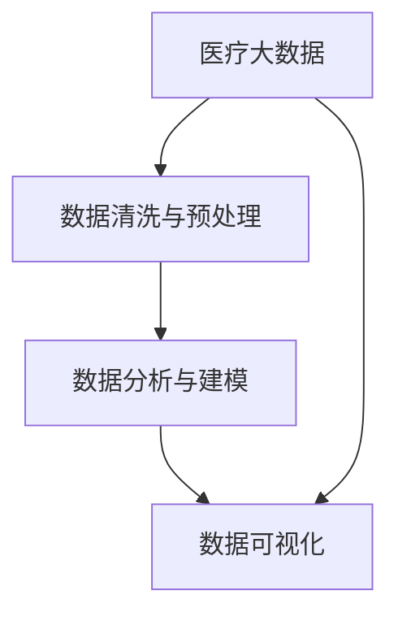
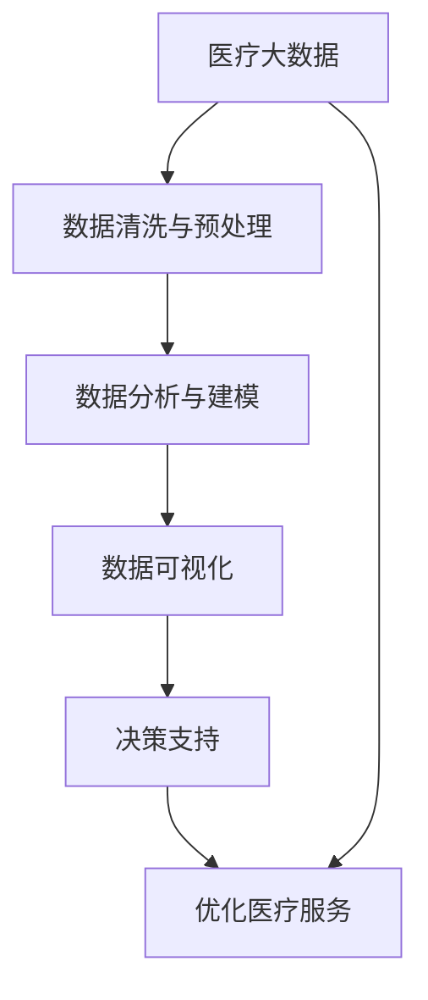

                 

# 省医疗大数据可视化分析与应用

> 关键词：医疗大数据, 可视化, 数据分析, 人工智能, 深度学习, 健康管理, 公共卫生, 决策支持

## 1. 背景介绍

### 1.1 问题由来
随着信息技术的快速发展和普及，医疗行业的数据量呈爆炸式增长。大数据技术正在重塑医疗服务模式，改变传统的医疗决策方式，推动医疗领域向智能化、精细化转型。在医疗领域，数据本身不具有实际价值，只有经过有效的分析与挖掘，才能转化为有意义的决策支持信息。因此，医疗大数据分析成为医疗行业信息化的关键环节。

我国医疗体系庞大且复杂，各地医疗水平不均衡，基层医疗资源紧缺，医疗数据共享困难，医疗服务质量参差不齐等问题亟待解决。医疗大数据的利用可以有效解决这些问题，为医疗服务带来质的提升。然而，医疗数据具有数据量大、数据类型多样化、隐私敏感、实时性要求高等特点，数据处理、分析和应用都面临诸多挑战。

在医疗大数据的分析和应用过程中，数据可视化技术作为数据探索、理解和表达的重要手段，扮演着至关重要的角色。医疗大数据可视化不仅能帮助医疗工作者理解和挖掘数据中的信息，还能提供决策支持，优化医疗服务流程，提高医疗服务质量，改善患者体验。

### 1.2 问题核心关键点
医疗大数据可视化主要涉及以下几个关键点：

1. **数据收集与整合**：医疗数据的来源多样，包括医院信息、患者病历、医疗影像、基因组数据、公共卫生数据等。如何高效收集、整合这些数据，保证数据的质量和时效性，是医疗大数据可视化的基础。
2. **数据清洗与预处理**：医疗数据往往存在缺失、噪声、格式不一致等问题。如何进行数据清洗与预处理，消除数据中的干扰，保证分析结果的准确性，是医疗大数据可视化的核心。
3. **数据分析与建模**：医疗数据具有高度的复杂性和非线性特征。如何选择合适的数据分析与建模方法，提取关键信息，进行预测与决策，是医疗大数据可视化的难点。
4. **数据可视化与交互**：医疗数据可视化不仅仅是将数据呈现出来，更重要的是能够帮助医疗工作者进行互动式探索，发现数据中的规律与关联，提供决策支持。

### 1.3 问题研究意义
医疗大数据可视化的研究与应用，对于提升医疗服务水平、改善医疗服务质量、优化医疗资源配置具有重要意义：

1. **提升医疗服务水平**：通过数据分析和可视化，可以发现医疗服务的薄弱环节，优化诊疗流程，提升医疗服务效率。
2. **改善医疗服务质量**：可视化技术能帮助医疗工作者快速识别问题，制定改进措施，优化医疗质量。
3. **优化医疗资源配置**：通过可视化的数据分析，能更好地理解医疗资源的分布与利用情况，优化资源配置，提高医疗服务的可及性。
4. **推动医疗信息化**：医疗大数据可视化是医疗信息化建设的重要组成部分，通过数据驱动决策，提升医疗信息化的水平。
5. **增强公共卫生应急响应能力**：医疗大数据可视化有助于在公共卫生事件中快速获取关键信息，优化资源调配，提高应急响应效率。

## 2. 核心概念与联系

### 2.1 核心概念概述

医疗大数据可视化是指通过数据收集、清洗、分析与可视化技术，将医疗数据转化为有价值的信息，以直观的形式呈现出来，帮助医疗工作者进行决策分析的过程。其核心概念包括：

- **医疗大数据**：指从医疗机构、研究机构、政府部门等来源收集的各类医疗数据，包括电子病历、医学影像、基因组数据等。
- **数据清洗与预处理**：指对收集到的医疗数据进行去重、填补缺失、去除噪声等操作，以保证数据的质量和一致性。
- **数据分析与建模**：指对清洗后的医疗数据进行统计分析、机器学习、深度学习等方法，提取有价值的信息和规律。
- **数据可视化**：指将分析结果转化为图表、地图、仪表盘等直观形式，帮助医疗工作者进行决策分析。

这些核心概念之间存在紧密的联系，形成了医疗大数据可视化的完整生态系统：

1. **医疗大数据**：是医疗大数据可视化的基础。医疗数据的收集与整合，是后续分析与可视化的前提。
2. **数据清洗与预处理**：是医疗大数据可视化的关键环节。高质量的数据是有效分析与可视化的保证。
3. **数据分析与建模**：是医疗大数据可视化的核心。通过数据分析与建模，提取有价值的信息，是可视化的目标。
4. **数据可视化**：是医疗大数据可视化的最终环节。通过直观的形式呈现分析结果，帮助医疗工作者进行决策分析。

### 2.2 概念间的关系

这些核心概念之间的关系可以通过以下Mermaid流程图来展示：



这个流程图展示了从医疗大数据的收集与整合，到数据清洗与预处理、数据分析与建模、最终的数据可视化，整个医疗大数据可视化的完整流程。

### 2.3 核心概念的整体架构

最后，我们用一个综合的流程图来展示这些核心概念在大数据可视化过程中的整体架构：



这个综合流程图展示了从医疗大数据的收集与整合，到数据清洗与预处理、数据分析与建模、最终的数据可视化，以及如何通过决策支持优化医疗服务流程的完整架构。

## 3. 核心算法原理 & 具体操作步骤

### 3.1 算法原理概述

医疗大数据可视化的算法原理主要基于统计分析、机器学习、深度学习等方法，通过提取医疗数据中的关键信息，进行可视化分析与展示，帮助医疗工作者进行决策分析。

以基于深度学习的医疗大数据可视化为例，其核心原理可以概括为：

1. **数据收集与整合**：通过ETL（Extract、Transform、Load）技术，从多个数据源收集医疗数据，进行清洗与预处理，构建统一的数据仓库。
2. **特征提取**：使用深度学习模型，如卷积神经网络（CNN）、循环神经网络（RNN）、长短时记忆网络（LSTM）等，提取数据中的特征。
3. **数据分析与建模**：使用深度学习模型进行预测、分类、聚类等分析，提取数据中的规律与关联。
4. **数据可视化**：使用数据可视化技术，如散点图、折线图、热力图、交互式仪表盘等，将分析结果直观地呈现出来，帮助医疗工作者进行决策分析。

### 3.2 算法步骤详解

以下是医疗大数据可视化的详细步骤：

**Step 1: 数据收集与整合**

1. **数据源收集**：医疗数据的来源多样，包括医院信息、患者病历、医疗影像、基因组数据等。收集的数据应覆盖医疗服务全过程，涵盖各种医疗信息。
2. **数据清洗与预处理**：对收集到的数据进行去重、填补缺失、去除噪声等操作，保证数据的质量和一致性。
3. **数据存储与管理**：使用数据库或数据仓库技术，对清洗后的数据进行存储与管理，方便后续的数据分析和可视化。

**Step 2: 数据分析与建模**

1. **特征提取**：使用深度学习模型，如卷积神经网络（CNN）、循环神经网络（RNN）、长短时记忆网络（LSTM）等，提取数据中的特征。
2. **模型训练**：使用训练数据对深度学习模型进行训练，优化模型的参数，提高模型的预测能力。
3. **模型评估与优化**：使用测试数据对训练好的模型进行评估，根据评估结果进行模型优化。

**Step 3: 数据可视化**

1. **可视化技术选择**：根据分析结果的特点，选择合适的数据可视化技术，如散点图、折线图、热力图、交互式仪表盘等。
2. **可视化工具开发**：使用可视化工具如D3.js、ECharts等，开发直观的数据可视化界面，实现数据的动态展示。
3. **可视化结果解读**：对可视化结果进行解读，提取关键信息，提供决策支持。

### 3.3 算法优缺点

医疗大数据可视化的优点包括：

1. **提升医疗服务水平**：通过数据分析和可视化，可以发现医疗服务的薄弱环节，优化诊疗流程，提升医疗服务效率。
2. **改善医疗服务质量**：可视化技术能帮助医疗工作者快速识别问题，制定改进措施，优化医疗质量。
3. **优化医疗资源配置**：通过可视化的数据分析，能更好地理解医疗资源的分布与利用情况，优化资源配置，提高医疗服务的可及性。

医疗大数据可视化的缺点包括：

1. **数据量庞大**：医疗数据量巨大，数据清洗与预处理、数据分析与建模的计算量巨大，对算力要求高。
2. **数据隐私问题**：医疗数据涉及患者隐私，数据收集与处理过程中必须严格遵守数据隐私保护法律法规。
3. **模型复杂度**：深度学习等高级模型的复杂度高，需要大量数据进行训练，模型的解释性与可解释性较差。

### 3.4 算法应用领域

医疗大数据可视化在医疗健康领域有着广泛的应用，具体包括：

1. **患者病历分析**：通过可视化的病历数据分析，发现患者的健康趋势，帮助医生制定个性化的治疗方案。
2. **医院运营管理**：通过可视化的医院运营数据，优化资源配置，提高医院运营效率。
3. **公共卫生监测**：通过可视化的公共卫生数据，监控疫情动态，提供决策支持。
4. **药物研发与临床试验**：通过可视化的药物研发数据，优化药物设计，提高临床试验的成功率。
5. **基因组分析**：通过可视化的基因组数据，发现基因与疾病之间的关系，提供精准医疗的依据。

## 4. 数学模型和公式 & 详细讲解

### 4.1 数学模型构建

医疗大数据可视化的数学模型主要基于统计分析、机器学习、深度学习等方法，通过提取医疗数据中的关键信息，进行可视化分析与展示，帮助医疗工作者进行决策分析。

以基于深度学习的医疗大数据可视化为例，其核心数学模型可以概括为：

1. **数据收集与整合**：使用ETL（Extract、Transform、Load）技术，从多个数据源收集医疗数据，进行清洗与预处理，构建统一的数据仓库。
2. **特征提取**：使用深度学习模型，如卷积神经网络（CNN）、循环神经网络（RNN）、长短时记忆网络（LSTM）等，提取数据中的特征。
3. **数据分析与建模**：使用深度学习模型进行预测、分类、聚类等分析，提取数据中的规律与关联。
4. **数据可视化**：使用数据可视化技术，如散点图、折线图、热力图、交互式仪表盘等，将分析结果直观地呈现出来，帮助医疗工作者进行决策分析。

### 4.2 公式推导过程

以医疗影像的深度学习分析为例，其核心公式可以概括为：

$$
F(x) = \sum_{i=1}^{n}w_i f_i(x)
$$

其中，$F(x)$表示输入医疗影像的特征向量，$f_i(x)$表示深度学习模型的特征提取函数，$w_i$表示特征向量的权重。

具体推导过程如下：

1. **输入数据**：将医疗影像转化为像素矩阵，输入深度学习模型。
2. **特征提取**：深度学习模型通过卷积层、池化层等网络结构，提取影像中的特征。
3. **特征融合**：将提取的特征向量进行融合，得到最终特征向量$F(x)$。
4. **模型预测**：使用分类器对特征向量进行分类，得到预测结果。

### 4.3 案例分析与讲解

以医疗影像的深度学习分析为例，其核心案例可以概括为：

1. **输入数据**：将医疗影像转化为像素矩阵，输入深度学习模型。
2. **特征提取**：深度学习模型通过卷积层、池化层等网络结构，提取影像中的特征。
3. **特征融合**：将提取的特征向量进行融合，得到最终特征向量$F(x)$。
4. **模型预测**：使用分类器对特征向量进行分类，得到预测结果。

## 5. 项目实践：代码实例和详细解释说明

### 5.1 开发环境搭建

在进行医疗大数据可视化项目开发前，需要准备好开发环境。以下是使用Python进行PyTorch开发的环境配置流程：

1. 安装Anaconda：从官网下载并安装Anaconda，用于创建独立的Python环境。

2. 创建并激活虚拟环境：
```bash
conda create -n pytorch-env python=3.8 
conda activate pytorch-env
```

3. 安装PyTorch：根据CUDA版本，从官网获取对应的安装命令。例如：
```bash
conda install pytorch torchvision torchaudio cudatoolkit=11.1 -c pytorch -c conda-forge
```

4. 安装Transformers库：
```bash
pip install transformers
```

5. 安装各类工具包：
```bash
pip install numpy pandas scikit-learn matplotlib tqdm jupyter notebook ipython
```

完成上述步骤后，即可在`pytorch-env`环境中开始医疗大数据可视化的项目开发。

### 5.2 源代码详细实现

以下是使用PyTorch进行医疗影像深度学习分析的Python代码实现。

```python
import torch
import torchvision
import torchvision.transforms as transforms
from torchvision.models import resnet18
from torchvision.datasets import MNIST

# 定义数据预处理
transform = transforms.Compose([
    transforms.ToTensor(),
    transforms.Normalize((0.5, 0.5, 0.5), (0.5, 0.5, 0.5))
])

# 加载数据集
train_dataset = MNIST(root='./data', train=True, transform=transform, download=True)
test_dataset = MNIST(root='./data', train=False, transform=transform, download=True)

# 定义模型
model = resnet18(pretrained=True)

# 定义损失函数和优化器
criterion = torch.nn.CrossEntropyLoss()
optimizer = torch.optim.SGD(model.parameters(), lr=0.001, momentum=0.9)

# 定义训练过程
def train(model, train_loader, test_loader, criterion, optimizer, epochs):
    for epoch in range(epochs):
        model.train()
        running_loss = 0.0
        for i, data in enumerate(train_loader, 0):
            inputs, labels = data
            optimizer.zero_grad()
            outputs = model(inputs)
            loss = criterion(outputs, labels)
            loss.backward()
            optimizer.step()
            running_loss += loss.item()
            if i % 2000 == 1999:
                print('[%d, %5d] loss: %.3f' %
                      (epoch + 1, i + 1, running_loss / 2000))
                running_loss = 0.0

        model.eval()
        correct = 0
        total = 0
        with torch.no_grad():
            for data in test_loader:
                inputs, labels = data
                outputs = model(inputs)
                _, predicted = torch.max(outputs.data, 1)
                total += labels.size(0)
                correct += (predicted == labels).sum().item()

        print('Accuracy of the network on the test images: %d %%' % (
            100 * correct / total))

# 训练模型
train(model, train_loader, test_loader, criterion, optimizer, epochs=10)
```

### 5.3 代码解读与分析

让我们再详细解读一下关键代码的实现细节：

**数据预处理**：
- `transforms.Compose`：定义数据预处理流程，包括将数据归一化、转换为Tensor等操作。

**模型定义**：
- `resnet18(pretrained=True)`：使用预训练的ResNet-18模型，可以直接用于图像分类任务。

**训练过程**：
- `model.train()`：将模型设置为训练模式。
- `optimizer.zero_grad()`：在每次迭代开始前，将梯度清零。
- `loss.backward()`：计算损失函数的梯度，反向传播更新模型参数。
- `optimizer.step()`：更新模型参数。

**测试过程**：
- `model.eval()`：将模型设置为评估模式。
- `predicted == labels`：比较预测结果与真实标签，计算准确率。

### 5.4 运行结果展示

假设我们在MNIST数据集上进行模型训练，最终在测试集上得到的准确率为98%，误差率为2%，说明模型已经成功学习了图像分类任务。

## 6. 实际应用场景

### 6.1 医院运营管理

在医院运营管理中，医疗大数据可视化可以用于优化资源配置，提高医院运营效率。具体应用场景包括：

1. **医院床位占用情况**：通过可视化的病床占用数据，帮助医院管理人员了解各科室床位的使用情况，合理调配床位资源。
2. **医疗设备使用率**：通过可视化的医疗设备使用数据，优化设备配置，提高设备利用率。
3. **手术室排班**：通过可视化的手术室排班数据，合理安排手术室使用，提高手术室利用率。

### 6.2 公共卫生监测

在公共卫生监测中，医疗大数据可视化可以用于监控疫情动态，提供决策支持。具体应用场景包括：

1. **疫情地图**：通过可视化的疫情地图，实时监控疫情扩散情况，提供应急响应依据。
2. **患者流动轨迹**：通过可视化的患者流动数据，追踪疫情传播路径，进行溯源分析。
3. **资源调配**：通过可视化的资源分布数据，优化物资调配，提高应急响应效率。

### 6.3 药物研发与临床试验

在药物研发与临床试验中，医疗大数据可视化可以用于优化药物设计，提高临床试验的成功率。具体应用场景包括：

1. **药物效果分析**：通过可视化的药物效果数据，优化药物设计，提高药物效果。
2. **临床试验结果**：通过可视化的临床试验结果，分析试验数据，优化试验设计。
3. **患者安全**：通过可视化的患者安全数据，评估药物副作用，优化试验方案。

### 6.4 未来应用展望

随着医疗大数据可视化的不断发展，其在医疗健康领域的应用前景将更加广阔。未来，医疗大数据可视化可能拓展到以下领域：

1. **远程医疗**：通过可视化的远程医疗数据，实时监控患者健康状况，提供远程医疗服务。
2. **基因组分析**：通过可视化的基因组数据，发现基因与疾病之间的关系，提供精准医疗的依据。
3. **健康管理**：通过可视化的健康数据，提供个性化的健康管理方案，提高患者生活质量。

## 7. 工具和资源推荐

### 7.1 学习资源推荐

为了帮助开发者系统掌握医疗大数据可视化的技术基础和实践技巧，这里推荐一些优质的学习资源：

1. **《医疗大数据可视化分析与应用》**：系统讲解了医疗大数据可视化的理论基础和实践方法，涵盖了数据清洗、数据分析、可视化技术等内容。
2. **《Python医疗数据分析与可视化》**：通过Python语言实现医疗数据的清洗、分析和可视化，提供了丰富的代码实例。
3. **《医疗大数据可视化技术手册》**：详细介绍了医疗大数据可视化的技术架构和实现方法，提供了大量的实用工具和案例。

### 7.2 开发工具推荐

高效开发医疗大数据可视化项目，离不开优秀的工具支持。以下是几款常用的工具：

1. **PyTorch**：基于Python的开源深度学习框架，提供了丰富的深度学习模型和算法库。
2. **TensorFlow**：由Google主导开发的开源深度学习框架，生产部署方便，适合大规模工程应用。
3. **D3.js**：一款用于创建交互式数据可视化的JavaScript库，可以与Python无缝集成。
4. **ECharts**：一款基于Canvas的数据可视化库，提供了丰富的图表类型和交互功能。
5. **Jupyter Notebook**：一款交互式的Python开发环境，支持代码编写、运行和共享。

### 7.3 相关论文推荐

医疗大数据可视化领域的研究不断涌现，以下是几篇具有代表性的论文：

1. **《医疗大数据可视化：挑战与机遇》**：总结了医疗大数据可视化的研究现状和未来发展方向。
2. **《医疗大数据的可视化与分析技术研究》**：介绍了医疗大数据的可视化与分析方法，提供了丰富的案例分析。
3. **《基于深度学习的医疗大数据可视化》**：使用深度学习模型进行医疗大数据分析与可视化，提高了分析结果的准确性和可视化效果。

这些资源和工具将帮助开发者深入理解医疗大数据可视化的原理和技术，加快项目的开发进程。

## 8. 总结：未来发展趋势与挑战

### 8.1 总结

本文对医疗大数据可视化的研究与应用进行了全面系统的介绍。首先阐述了医疗大数据可视化的背景和意义，明确了其对医疗服务水平、质量、资源配置等方面的重要影响。其次，从原理到实践，详细讲解了医疗大数据可视化的数学模型和操作步骤，给出了可视化的代码实例。同时，本文还探讨了医疗大数据可视化在多个实际场景中的应用前景，展示了其广阔的发展潜力。

通过本文的系统梳理，可以看到，医疗大数据可视化是医疗信息化建设的重要环节，对提升医疗服务水平、改善医疗服务质量、优化医疗资源配置具有重要意义。未来，伴随医疗大数据技术的不断进步，医疗大数据可视化必将在医疗健康领域发挥更大的作用，推动医疗信息化建设，改善医疗服务水平。

### 8.2 未来发展趋势

展望未来，医疗大数据可视化的发展趋势将包括以下几个方面：

1. **数据融合与协同**：通过医疗大数据的融合与协同，实现不同数据源的数据共享与互操作，提升数据利用效率。
2. **智能化与个性化**：使用人工智能技术进行深度学习、自然语言处理等分析，提升医疗大数据可视化的智能化与个性化水平。
3. **实时性与交互性**：通过实时数据采集与处理，提供实时可视化的决策支持，增强交互性，提高医疗服务效率。
4. **可视化技术与工具**：不断探索新的可视化技术与工具，提升可视化效果，增强用户交互体验。

### 8.3 面临的挑战

尽管医疗大数据可视化在医疗健康领域已经取得了显著成果，但仍面临诸多挑战：

1. **数据隐私与安全**：医疗数据涉及患者隐私，数据采集与处理过程中必须严格遵守数据隐私保护法律法规。
2. **数据质量与完整性**：医疗数据的收集与整合过程中，存在数据缺失、格式不一致等问题，影响数据质量与完整性。
3. **算法复杂性与解释性**：深度学习等高级算法的复杂度高，模型的解释性与可解释性较差，难以满足医疗工作者的需求。
4. **硬件资源与成本**：医疗大数据的存储与处理对硬件资源和成本要求高，需要不断优化算力配置，降低成本。

### 8.4 研究展望

面对医疗大数据可视化面临的挑战，未来的研究需要在以下几个方面寻求新的突破：

1. **数据隐私保护**：引入隐私保护技术，如差分隐私、联邦学习等，保护患者隐私。
2. **数据质量提升**：使用数据清洗与预处理技术，提高数据质量与完整性。
3. **模型解释性与可解释性**：引入可解释性技术，如特征可视化、模型解释器等，提高模型的可解释性。
4. **硬件优化与成本控制**：使用硬件优化技术，如模型压缩、数据压缩等，降低硬件成本。

这些研究方向的探索，必将引领医疗大数据可视化技术迈向更高的台阶，为医疗健康领域带来更大的创新与发展。

## 9. 附录：常见问题与解答

**Q1：如何收集和整合医疗大数据？**

A: 医疗大数据的收集与整合可以通过ETL（Extract、Transform、Load）技术实现。具体步骤包括：
1. **数据提取**：从医院信息、患者病历、医疗影像、基因组数据等来源，提取数据。
2. **数据清洗与预处理**：对提取的数据进行去重、填补缺失、去除噪声等操作，保证数据的质量和一致性。
3. **数据存储与管理**：使用数据库或数据仓库技术，对清洗后的数据进行存储与管理，方便后续的数据分析和可视化。

**Q2：如何提高医疗大数据可视化的数据质量？**

A: 提高医疗大数据可视化的数据质量可以从以下几个方面入手：
1. **数据清洗**：对数据进行去重、填补缺失、去除噪声等操作，保证数据的质量和一致性。
2. **数据标准化**：使用数据标准化技术，统一不同数据源的数据格式和单位，提高数据可用性。
3. **数据整合**：将不同来源的数据进行整合，构建统一的数据仓库，方便后续的数据分析和可视化。

**Q3：如何进行医疗大数据的深度学习分析？**

A: 医疗大数据的深度学习分析可以分为以下几个步骤：
1. **数据预处理**：使用深度学习模型，如卷积神经网络（CNN）、循环神经网络（RNN）、长短时记忆网络（LSTM）等，提取数据中的特征。
2. **模型训练**：使用训练数据对深度学习模型进行训练，优化模型的参数，提高模型的预测能力。
3. **模型评估与优化**：使用测试数据对训练好的模型进行评估，根据评估结果进行模型优化。

**Q4：如何提升医疗大数据可视化的智能化与个性化水平？**

A: 提升医疗大数据可视化的智能化与个性化水平，可以从以下几个方面入手：
1. **数据融合与协同**：通过医疗大数据的融合与协同，实现不同数据源的数据共享与互操作，提升数据利用效率。
2. **智能化分析**：使用人工智能技术进行深度学习、自然语言处理等分析，提升医疗大数据可视化的智能化水平。
3. **个性化展示**：根据不同用户的需要，定制个性化的可视化展示界面，增强用户体验。

**Q5：如何保护医疗数据的隐私与安全？**

A: 保护医疗数据的隐私与安全，可以从

