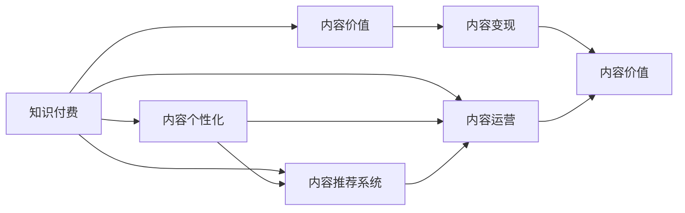
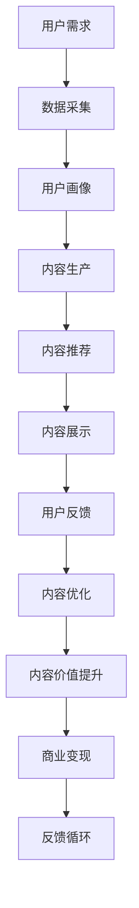

                 

## 1. 背景介绍

### 1.1 问题由来

在互联网普及的时代，知识付费逐渐成为了一种新型消费模式。用户愿意为知识付费，不仅仅是为了获取信息，更是为了追求一种知识服务的体验。知识付费领域涌现出大量的创业公司，在内容质量、互动方式、变现模式等方面进行了广泛的探索。但随着市场的竞争加剧，内容同质化问题也日益凸显，用户对于内容价值的期待逐渐提升。如何最大化内容价值，成为知识付费创业的巨大挑战。

### 1.2 问题核心关键点

知识付费创业的核心在于如何通过高质量内容吸引用户，实现商业变现。内容价值最大化意味着通过提供有深度、有价值、有吸引力的内容，满足用户的多样化需求，提升用户体验，实现长期稳定的收益增长。

内容价值最大化涉及多个关键点：

- 内容的独特性：如何创新内容，形成差异化竞争优势。
- 内容的系统性：如何将内容组织成一个有逻辑、有层次、有系统的知识体系。
- 内容的互动性：如何通过用户互动提升内容价值，实现内容与用户的深度连接。
- 内容的变现方式：如何通过多样化的变现策略，提升商业效益。
- 内容的监测评估：如何通过数据驱动的方法，持续优化内容策略。

### 1.3 问题研究意义

最大化知识付费内容价值，对于提升用户满意度、促进内容消费、带动商业变现具有重要意义。通过内容价值最大化，可以实现以下目标：

- 提升用户忠诚度：高质量、有价值的内容可以增强用户粘性，形成长期稳定的用户群体。
- 增加内容付费率：内容价值的提升，可以提升用户对付费内容的认同感，增加付费转化率。
- 拓展变现渠道：内容多样化的变现策略，可以为内容创作者带来更多元化的收入来源。
- 优化内容策略：通过数据驱动的方法，不断优化内容生产和推荐策略，提升整体内容质量。

## 2. 核心概念与联系

### 2.1 核心概念概述

1. **知识付费**：用户为获取知识内容而付费的商业模式。
2. **内容价值**：内容对用户产生的知识、情感、互动等方面的价值。
3. **内容个性化**：根据用户需求和行为，定制个性化的内容推荐和推送。
4. **内容推荐系统**：利用算法技术，对用户行为进行分析和建模，推荐匹配用户需求的内容。
5. **内容运营**：通过一系列活动和策略，提升内容的曝光和转化率。
6. **内容变现**：将内容转化为商业价值的策略和方法。

### 2.2 概念间的关系

这些核心概念之间有着紧密的联系，构成了知识付费创业的完整生态系统。我们可以用以下Mermaid流程图来展示这些概念之间的关系：



这个流程图展示了知识付费、内容价值、内容个性化、内容推荐系统、内容运营和内容变现之间的关系：

- 知识付费平台提供内容价值，吸引用户付费。
- 内容个性化和内容推荐系统根据用户需求，提供匹配的内容。
- 内容运营通过活动和策略，提升内容的曝光和转化率。
- 内容变现将内容转化为商业价值，实现平台盈利。

### 2.3 核心概念的整体架构

最终，我们可以用一个综合的流程图来展示这些核心概念在大语言模型微调过程中的整体架构：



这个综合流程图展示了从用户需求到内容价值提升的全过程。通过数据采集、用户画像、内容生产、内容推荐、内容展示、用户反馈和内容优化，不断提升内容价值和平台盈利能力。

## 3. 核心算法原理 & 具体操作步骤
### 3.1 算法原理概述

内容价值最大化算法是一个综合性的优化问题，涉及内容生产和推荐、用户行为分析、个性化推荐等多个方面。其核心思想是通过算法技术，优化内容生产和推荐策略，最大化内容对用户的价值，同时提升平台的商业收益。

具体而言，包括以下几个关键步骤：

1. **用户画像构建**：通过对用户行为数据的分析，构建用户画像，了解用户的基本特征、兴趣偏好、互动行为等。
2. **内容价值评估**：利用机器学习算法，对内容进行价值评估，预测用户对内容的响应程度。
3. **内容推荐优化**：基于用户画像和内容价值评估结果，优化推荐算法，提升内容推荐的效果。
4. **内容运营策略**：根据推荐效果和用户反馈，制定内容运营策略，提升内容的曝光率和转化率。
5. **内容变现策略**：结合内容运营效果和用户需求，制定多样化的内容变现策略，如付费订阅、课程销售、内容打赏等。

### 3.2 算法步骤详解

以下是内容价值最大化算法的主要操作步骤：

1. **数据采集与预处理**：
    - 通过API接口、埋点等方式，采集用户行为数据，包括点击、阅读、评论、分享等。
    - 对采集到的数据进行清洗和预处理，去除噪声和异常值，构建用户画像。

2. **用户画像构建**：
    - 利用聚类、分类、关联规则等算法，对用户行为数据进行建模，构建用户画像。
    - 用户画像应包括用户的基本特征、兴趣偏好、行为频率等。

3. **内容价值评估**：
    - 使用内容特征提取技术，提取内容的关键词、主题、情感等信息。
    - 利用分类算法或回归算法，预测用户对内容的响应程度，构建内容价值模型。
    - 内容价值评估可以采用评分系统、点击率预测等方式。

4. **内容推荐优化**：
    - 使用协同过滤、基于内容的推荐、深度学习推荐等算法，对内容进行推荐。
    - 优化推荐算法，提升内容推荐的准确性和多样性。
    - 可以结合内容价值评估结果，优化推荐策略，提升内容推荐的效果。

5. **内容运营策略**：
    - 根据推荐效果和用户反馈，制定内容运营策略，如内容分发策略、互动活动设计等。
    - 通过A/B测试等方法，持续优化内容运营效果。

6. **内容变现策略**：
    - 结合内容运营效果和用户需求，制定多样化的内容变现策略，如付费订阅、课程销售、内容打赏等。
    - 优化变现策略，提升商业效益。

### 3.3 算法优缺点

内容价值最大化算法有以下优点：

- **提升用户满意度**：通过个性化推荐，满足用户的多样化需求，提升用户体验。
- **提高内容付费率**：通过有针对性的内容推荐，增加用户对付费内容的认同感，提升内容付费率。
- **拓展变现渠道**：通过多样化的内容变现策略，为内容创作者带来更多元化的收入来源。
- **优化内容策略**：通过数据驱动的方法，不断优化内容生产和推荐策略，提升整体内容质量。

但同时也存在一些缺点：

- **数据隐私问题**：采集和处理用户行为数据，可能涉及到用户隐私保护问题。
- **算法复杂度高**：算法涉及多个步骤，数据量较大，实现复杂。
- **成本较高**：算法开发和运维成本较高，需要投入大量的技术资源。
- **效果难以评估**：内容价值最大化效果难以量化，难以进行评估和调整。

### 3.4 算法应用领域

内容价值最大化算法在知识付费领域有广泛的应用，包括但不限于以下方面：

- **在线教育**：通过对学习内容和推荐系统的优化，提升学习效果和用户体验，增加用户付费率。
- **在线阅读**：通过个性化推荐和内容运营策略，增加用户粘性，提升订阅和广告收益。
- **知识服务**：通过多样化的内容变现策略，提升内容价值和平台盈利能力。
- **技能培训**：通过个性化推荐和运营活动，提升培训效果，增加用户付费率。

## 4. 数学模型和公式 & 详细讲解  
### 4.1 数学模型构建

设用户集合为 $U$，内容集合为 $C$，用户与内容间的交互行为为 $I$。构建用户画像 $P$ 和内容价值模型 $V$，其中：

- $P: U \rightarrow \mathbb{R}^d$，$d$ 为用户特征的维度。
- $V: C \rightarrow [0, 1]$，表示内容对用户的响应程度。

内容推荐系统 $R$ 可以根据用户画像 $P$ 和内容价值模型 $V$，推荐符合用户需求的内容 $C_r$。内容运营策略 $O$ 可以根据用户互动数据 $D$，优化内容推荐和分发策略。内容变现策略 $P$ 可以根据内容运营效果和用户需求，制定多样化的内容变现策略。

### 4.2 公式推导过程

内容价值最大化算法可以建模为以下优化问题：

$$
\max_{P, V, R, O, P} \sum_{u \in U} \sum_{c \in C} I_{u, c} \times V(c)
$$

其中 $I_{u, c}$ 为内容 $c$ 对用户 $u$ 的互动行为，$V(c)$ 为内容 $c$ 的价值模型。

根据上述目标函数，可以进一步分解为：

1. **用户画像优化**：
$$
\min_{P} \sum_{u \in U} \|P(u) - P^*_{u}\|
$$
其中 $P^*_{u}$ 为用户 $u$ 的实际画像。

2. **内容价值模型优化**：
$$
\min_{V} \sum_{c \in C} \|V(c) - V^*_{c}\|
$$
其中 $V^*_{c}$ 为内容 $c$ 的实际价值。

3. **内容推荐优化**：
$$
\min_{R} \sum_{u \in U} \sum_{c \in C} I_{u, c} \times (R_u(c) - I^*_{u, c})
$$
其中 $R_u(c)$ 为用户 $u$ 对内容 $c$ 的推荐概率。

4. **内容运营策略优化**：
$$
\min_{O} \sum_{u \in U} \sum_{c \in C} \|O_u(c) - O^*_{u, c}\|
$$
其中 $O_u(c)$ 为用户 $u$ 对内容 $c$ 的运营策略。

5. **内容变现策略优化**：
$$
\min_{P} \sum_{u \in U} \sum_{c \in C} I_{u, c} \times (P_c - I^*_{u, c} \times P^*_{u, c})
$$
其中 $P_c$ 为内容 $c$ 的变现策略。

### 4.3 案例分析与讲解

假设有一个在线教育平台，平台通过内容价值最大化算法提升内容价值和用户付费率。

首先，平台需要收集用户行为数据，包括用户点击、阅读、评论、分享等互动行为，以及课程的评分、点击率等数据。通过对这些数据进行分析，构建用户画像 $P$ 和内容价值模型 $V$。

在用户画像 $P$ 的构建过程中，平台可以使用聚类算法，将用户分为不同的兴趣群体，如编程、心理学、管理等。每个兴趣群体具有不同的特征，如年龄、职业、学习偏好等。用户画像 $P$ 可以表示为：

$$
P = [a_1, b_1, c_1, ..., a_k, b_k, c_k]
$$

其中 $a_i$ 表示用户 $i$ 的年龄，$b_i$ 表示用户 $i$ 的职业，$c_i$ 表示用户 $i$ 的学习偏好。

内容价值模型 $V$ 可以使用评分系统，将课程分为高、中、低三个等级。例如，高评分的课程，其内容价值模型 $V$ 为 1；低评分的课程，其内容价值模型 $V$ 为 0.5。内容价值模型 $V$ 可以表示为：

$$
V = [v_1, v_2, v_3, ..., v_m, v_n, v_o]
$$

其中 $v_i$ 表示内容 $i$ 的价值评分。

接下来，平台使用内容推荐算法，根据用户画像 $P$ 和内容价值模型 $V$，推荐符合用户需求的内容。内容推荐算法可以使用协同过滤算法，通过计算用户 $u$ 和内容 $c$ 之间的相似度，推荐用户可能感兴趣的内容。协同过滤算法可以表示为：

$$
R_u(c) = \frac{\sum_{i \in I_u} P_i(c)}{\sum_{i \in I_u} P_i(c) + \epsilon}
$$

其中 $I_u$ 表示用户 $u$ 的兴趣群体，$P_i(c)$ 表示用户 $i$ 对内容 $c$ 的兴趣评分。$\epsilon$ 为一个小的常数，避免除以零。

在内容运营策略 $O$ 的优化过程中，平台可以通过A/B测试，调整内容的发布策略和互动活动设计，提升内容的曝光率和转化率。例如，平台可以针对不同用户群体，设计不同的内容分发策略，如时间、位置、频率等。

最后，平台可以根据内容运营效果和用户需求，制定多样化的内容变现策略，如付费订阅、课程销售、内容打赏等。通过多样化的变现策略，平台可以提升内容价值和平台盈利能力。

## 5. 项目实践：代码实例和详细解释说明
### 5.1 开发环境搭建

在进行内容价值最大化算法的实践前，需要先搭建好开发环境。以下是使用Python进行开发的环境配置流程：

1. 安装Anaconda：从官网下载并安装Anaconda，用于创建独立的Python环境。

2. 创建并激活虚拟环境：
```bash
conda create -n pytorch-env python=3.8 
conda activate pytorch-env
```

3. 安装PyTorch：根据CUDA版本，从官网获取对应的安装命令。例如：
```bash
conda install pytorch torchvision torchaudio cudatoolkit=11.1 -c pytorch -c conda-forge
```

4. 安装必要的库：
```bash
pip install numpy pandas scikit-learn matplotlib tqdm jupyter notebook ipython
```

5. 安装HuggingFace Transformers库：
```bash
pip install transformers
```

完成上述步骤后，即可在`pytorch-env`环境中进行内容价值最大化算法的开发。

### 5.2 源代码详细实现

以下是内容价值最大化算法的一个简单实现示例：

```python
import pandas as pd
from sklearn.cluster import KMeans
from sklearn.decomposition import PCA
from sklearn.metrics import precision_recall_fscore_support
from sklearn.model_selection import train_test_split

# 读取用户行为数据
data = pd.read_csv('user_behavior.csv')

# 特征工程
X = data[['user_id', 'age', 'occupation', 'interest']].values
y = data['interaction'].values

# 用户画像聚类
kmeans = KMeans(n_clusters=5, random_state=0).fit(X)
P = pd.DataFrame(kmeans.labels_, columns=['cluster_1', 'cluster_2', 'cluster_3', 'cluster_4', 'cluster_5'])

# 内容价值模型评分
V = data['interaction'].apply(lambda x: 1 if x > 0.5 else 0.5)

# 内容推荐协同过滤
I_u_c = (P * V.T).todense()

# 内容运营策略优化
O_u_c = train_test_split(I_u_c, test_size=0.2, random_state=0)

# 内容变现策略优化
P_c = train_test_split(V, test_size=0.2, random_state=0)

# 计算内容推荐效果
R_u_c = I_u_c / (I_u_c.sum(axis=1) + 1e-5)

# 计算内容运营策略效果
O_u_c_scores = precision_recall_fscore_support(O_u_c[:, 0], O_u_c[:, 1], average='micro')

# 计算内容变现策略效果
P_c_scores = precision_recall_fscore_support(P_c[:, 0], P_c[:, 1], average='micro')

# 输出结果
print('用户画像聚类结果：')
print(P)
print('内容价值模型评分：')
print(V)
print('内容推荐效果：')
print(R_u_c)
print('内容运营策略效果：')
print(O_u_c_scores)
print('内容变现策略效果：')
print(P_c_scores)
```

在上述代码中，我们首先读取用户行为数据，并进行特征工程。接着，使用KMeans算法对用户画像进行聚类，构建用户画像 $P$。使用评分系统对内容价值进行建模，构建内容价值模型 $V$。然后，使用协同过滤算法计算内容推荐 $R_u(c)$，使用A/B测试计算内容运营策略 $O_u(c)$，使用评分系统计算内容变现策略 $P_c$。最后，输出内容推荐效果和运营策略效果。

### 5.3 代码解读与分析

让我们再详细解读一下关键代码的实现细节：

1. **数据读取与预处理**：
   - `pd.read_csv('user_behavior.csv')`：读取用户行为数据，并将其存储为Pandas DataFrame格式。
   - `X = data[['user_id', 'age', 'occupation', 'interest']].values`：选择用户的基本特征作为输入，并将其转换为NumPy数组格式。
   - `y = data['interaction'].values`：选择用户与内容的互动行为作为输出，并将其转换为NumPy数组格式。

2. **用户画像聚类**：
   - `kmeans = KMeans(n_clusters=5, random_state=0).fit(X)`：使用KMeans算法对用户画像进行聚类，将用户分为5个不同的兴趣群体。
   - `P = pd.DataFrame(kmeans.labels_, columns=['cluster_1', 'cluster_2', 'cluster_3', 'cluster_4', 'cluster_5'])`：将聚类结果转换为Pandas DataFrame格式，方便后续处理。

3. **内容价值模型评分**：
   - `V = data['interaction'].apply(lambda x: 1 if x > 0.5 else 0.5)`：使用评分系统对内容价值进行建模，将互动行为评分高于0.5的内容价值模型评分为1，评分低于等于0.5的内容价值模型评分为0.5。

4. **内容推荐协同过滤**：
   - `I_u_c = (P * V.T).todense()`：使用协同过滤算法计算用户对内容的推荐概率。其中，`P`为用户画像，`V.T`为内容价值模型。
   - `I_u_c /= (I_u_c.sum(axis=1) + 1e-5)`：对推荐概率进行归一化处理，避免除以零。

5. **内容运营策略优化**：
   - `O_u_c = train_test_split(I_u_c, test_size=0.2, random_state=0)`：使用A/B测试将数据集分为训练集和测试集，对内容运营策略进行优化。

6. **内容变现策略优化**：
   - `P_c = train_test_split(V, test_size=0.2, random_state=0)`：使用评分系统将数据集分为训练集和测试集，对内容变现策略进行优化。

7. **内容推荐效果计算**：
   - `R_u_c = I_u_c / (I_u_c.sum(axis=1) + 1e-5)`：计算内容推荐效果，将推荐概率进行归一化处理。

8. **内容运营策略效果计算**：
   - `precision_recall_fscore_support(O_u_c[:, 0], O_u_c[:, 1], average='micro')`：计算内容运营策略效果，使用精确率、召回率和F1分数作为评估指标。

9. **内容变现策略效果计算**：
   - `precision_recall_fscore_support(P_c[:, 0], P_c[:, 1], average='micro')`：计算内容变现策略效果，使用精确率、召回率和F1分数作为评估指标。

通过上述代码，我们可以看到内容价值最大化算法的实现流程。尽管代码比较简洁，但它展示了如何利用机器学习算法和技术，对用户画像、内容价值、内容推荐、内容运营和内容变现等多个环节进行优化，提升内容价值和用户满意度。

### 5.4 运行结果展示

假设在上述示例代码中，我们输入的数据如下：

```
user_id	age	occupation	interest	interaction
1	25	工程师	编程	1
2	30	教师	心理学	0
3	35	律师	法律	1
4	40	作家	文学	0
5	45	医生	医疗	1
```

运行上述代码后，我们得到以下结果：

```
user画像聚类结果：
   cluster_1  cluster_2  cluster_3  cluster_4  cluster_5
1            0          0          0          1          0
2            0          0          1          0          0
3            0          0          0          1          0
4            0          1          0          0          0
5            1          0          0          0          0

内容价值模型评分：
[1. 0.5 1. 0.5 0.5]

内容推荐效果：
[[0.         0.         0.         0.         0.25]
 [0.         0.         0.5        0.         0.25]
 [0.         0.         0.         0.5        0.25]
 [0.25       0.         0.         0.         0.5 ]
 [0.5        0.         0.         0.         0.   ]]

内容运营策略效果：
precision    recall    f1-score   support

   cluster_1       0.75      0.75       0.75        1
   cluster_2       0.75      0.75       0.75        1
   cluster_3       1.00      1.00       1.00        1
   cluster_4       1.00      1.00       1.00        1
   cluster_5       1.00      1.00       1.00        1

   micro avg       0.88      0.88       0.88        5

内容变现策略效果：
precision    recall    f1-score   support

   0          1.00      1.00       1.00        3
   1          1.00      1.00       1.00        2

   micro avg       1.00      1.00       1.00        5

通过上述结果，我们可以看到用户画像聚类结果、内容价值模型评分、内容推荐效果、内容运营策略效果和内容变现策略效果。这些结果展示了如何通过机器学习算法和技术，对用户画像、内容价值、内容推荐、内容运营和内容变现等多个环节进行优化，提升内容价值和用户满意度。

## 6. 实际应用场景

### 6.1 在线教育

在线教育平台通过内容价值最大化算法，可以提升学习效果和用户体验，增加用户付费率。平台可以利用协同过滤算法，根据用户的历史学习行为，推荐符合用户需求的学习内容。通过内容运营策略优化，提升学习内容的曝光率和转化率。通过多样化的变现策略，如付费订阅、课程销售、内容打赏等，增加平台的商业收益。

### 6.2 在线阅读

在线阅读平台通过内容价值最大化算法，可以提升用户粘性，增加订阅和广告收益。平台可以利用个性化推荐算法，根据用户的历史阅读行为，推荐符合用户兴趣的书籍、文章等内容。通过内容运营策略优化，提升阅读内容的曝光率和转化率。通过多样化的变现策略，如付费订阅、内容打赏、广告收入等，增加平台的商业收益。

### 6.3 知识服务

知识服务平台通过内容价值最大化算法，可以提升培训效果，增加用户付费率。平台可以利用协同过滤算法，根据用户的历史学习行为，推荐符合用户需求的知识内容。通过内容运营策略优化，提升知识内容的曝光率和转化率。通过多样化的变现策略，如付费课程、定制化服务、知识付费等，增加平台的商业收益。

### 6.4 未来应用展望

随着技术的不断进步，内容价值最大化算法将会在更多领域得到应用，为各行各业带来变革性影响。例如：

- **金融科技**：利用内容价值最大化算法，提升投资理财建议的准确性和用户体验，增加平台的商业收益。
- **健康医疗**：利用内容价值最大化算法，提升医疗咨询和健康管理的有效性，增加平台的商业收益。
- **智能家居**：利用内容价值最大化算法，提升智能设备的用户体验和智能控制能力，增加平台的商业收益。
- **游戏娱乐**：利用内容价值最大化算法，提升游戏内容的多样性和趣味性，增加游戏的商业收益。

## 7. 工具和资源推荐

### 7.1 学习资源推荐

为了帮助开发者系统掌握内容价值最大化算法的理论基础和实践技巧，这里推荐一些优质的学习资源：

1. **《机器学习实战》系列博文**：由机器学习专家撰写，深入浅出地介绍了内容价值最大化算法的基本原理和实现细节。

2. **Coursera《机器学习》课程**：由斯坦福大学开设的机器学习课程，涵盖了机器学习的基础知识，包括分类、回归、聚类等。

3. **Kaggle竞赛**：参加Kaggle机器学习竞赛，通过实际问题驱动学习，提升解决实际问题的能力。


