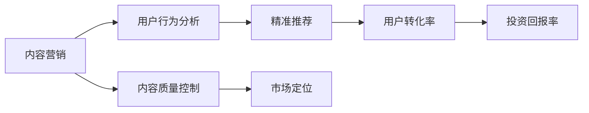
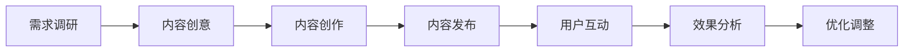
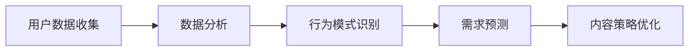
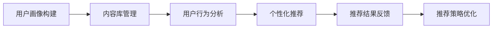
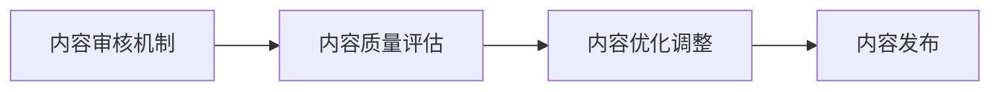
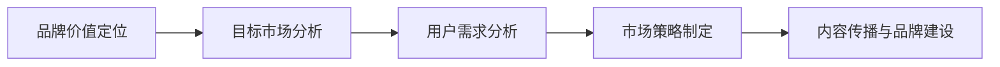
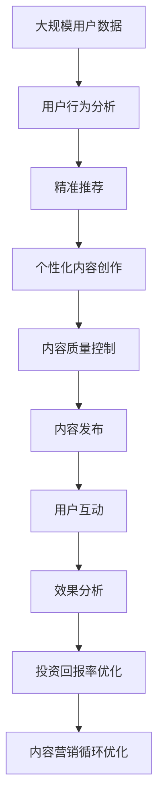

                 

# 知识付费创业中的内容营销ROI优化

> 关键词：知识付费,内容营销,ROI优化,用户行为分析,转化率提升,投资回报率,内容质量控制,用户留存率,精准推荐,数据驱动,市场定位

## 1. 背景介绍

### 1.1 问题由来

随着互联网的普及和数字化转型的深入，知识付费市场呈现出蓬勃发展的态势。越来越多的企业和个人通过提供在线课程、电子书、音频讲座等形式的知识产品，实现内容变现。然而，由于知识付费行业的竞争激烈，用户获取和留存成为一大挑战。在这种情况下，内容营销（Content Marketing）成为一种有效的策略，帮助企业和创业者在激烈的市场竞争中脱颖而出。内容营销的核心在于通过高质量的内容吸引和留存用户，进而实现知识付费的高投资回报率（ROI）。

### 1.2 问题核心关键点

内容营销的ROI优化，主要关注以下几个方面：

- **内容质量与用户需求的匹配度**：高质量、有价值的内容能够吸引更多的用户，从而提升转化率和留存率。
- **用户行为分析**：通过数据分析，了解用户行为模式，优化内容策略，提升用户参与度。
- **精准推荐**：基于用户行为和偏好，提供个性化的内容推荐，提高用户转化率。
- **市场定位与品牌建设**：明确品牌定位，通过内容传播提升品牌知名度和美誉度。
- **数据驱动决策**：利用数据和分析工具，实时监控营销效果，优化策略，提高ROI。

### 1.3 问题研究意义

内容营销ROI优化对于知识付费创业有着重要意义：

- **提升用户转化率**：通过精准的内容推荐和高质量的内容设计，提高用户的购买意愿，增加销售收入。
- **提高用户留存率**：通过持续的高质量内容输出，提升用户粘性，延长用户生命周期，增加用户价值。
- **降低营销成本**：通过数据驱动的内容决策，优化营销策略，减少无效内容制作和投放，降低营销成本。
- **增强品牌影响力**：通过内容传播，提升品牌知名度和美誉度，构建行业内的领导地位。
- **推动行业发展**：通过优化ROI，提高整个知识付费行业的质量和效率，推动行业整体进步。

## 2. 核心概念与联系

### 2.1 核心概念概述

为更好地理解知识付费创业中的内容营销ROI优化，本节将介绍几个密切相关的核心概念：

- **内容营销**：指企业通过创造和分发有价值、相关和一致的内容，吸引和保留受众，并最终驱动盈利性的顾客行动（如生成潜在客户、品牌忠诚度提升、销售增长）的营销策略。
- **ROI（投资回报率）**：衡量投资活动带来的收益与成本之间的比率。在知识付费领域，ROI表示内容营销活动带来的用户转化率和收入与营销成本之间的比率。
- **用户行为分析**：通过数据分析和挖掘技术，了解用户的行为模式和需求偏好，为内容营销策略提供数据支持。
- **精准推荐**：利用用户行为数据和机器学习技术，向用户推荐个性化的内容，提高用户的转化率和满意度。
- **内容质量控制**：通过内容审核和优化机制，确保内容的高质量和高价值，提升用户粘性和信任度。
- **市场定位**：明确品牌的市场定位和核心竞争力，通过内容传播和品牌建设，提高品牌的市场影响力。

这些核心概念之间的逻辑关系可以通过以下Mermaid流程图来展示：



这个流程图展示了一个从内容营销到投资回报率的基本流程：通过用户行为分析，制定精准推荐策略，控制内容质量，确定市场定位，最终实现高投资回报率。

### 2.2 概念间的关系

这些核心概念之间存在着紧密的联系，形成了知识付费创业中的内容营销ROI优化的完整生态系统。下面我们通过几个Mermaid流程图来展示这些概念之间的关系。

#### 2.2.1 内容营销的基本流程



这个流程图展示了内容营销的基本流程：从需求调研到内容创作，再到内容发布和效果分析，最后根据分析结果进行优化调整。

#### 2.2.2 用户行为分析的流程



这个流程图展示了用户行为分析的流程：通过收集和分析用户数据，识别用户行为模式，预测用户需求，优化内容策略。

#### 2.2.3 精准推荐的流程



这个流程图展示了精准推荐的流程：通过构建用户画像，管理内容库，分析用户行为，生成个性化推荐，根据反馈优化推荐策略。

#### 2.2.4 内容质量控制的流程



这个流程图展示了内容质量控制的流程：通过内容审核和评估，优化内容，最终发布高质量的内容。

#### 2.2.5 市场定位的流程



这个流程图展示了市场定位的流程：通过品牌价值定位和目标市场分析，理解用户需求，制定市场策略，传播内容，构建品牌。

### 2.3 核心概念的整体架构

最后，我们用一个综合的流程图来展示这些核心概念在知识付费创业中的整体架构：



这个综合流程图展示了从用户数据到内容营销优化的完整过程。通过用户行为分析，实现精准推荐，创作个性化内容，控制内容质量，发布高质量内容，通过用户互动和效果分析，优化投资回报率，形成一个持续循环的内容营销优化过程。 通过这些流程图，我们可以更清晰地理解知识付费创业中的内容营销ROI优化过程中各个核心概念的关系和作用，为后续深入讨论具体的优化方法和技术奠定基础。

## 3. 核心算法原理 & 具体操作步骤
### 3.1 算法原理概述

知识付费创业中的内容营销ROI优化，本质上是一个多目标优化问题。其核心思想是：通过内容营销策略的优化，最大化投资回报率，同时满足用户需求，提升用户满意度和粘性。

形式化地，假设内容营销策略为 $X=\{x_1,x_2,\cdots,x_n\}$，每个策略对应的收益和成本分别为 $R_i$ 和 $C_i$，其中 $i=1,2,\cdots,n$。则ROI 优化目标可以表示为：

$$
\maximize \sum_{i=1}^n \frac{R_i}{C_i}
$$

其中，$R_i$ 和 $C_i$ 分别为第 $i$ 个内容策略带来的用户转化率和营销成本。在实际应用中，我们通常使用多目标优化算法（如MOOP, SPEA2等）来求解上述优化问题。

### 3.2 算法步骤详解

知识付费创业中的内容营销ROI优化一般包括以下几个关键步骤：

**Step 1: 数据收集与处理**

- 收集用户行为数据（如浏览记录、点击行为、购买记录等）和内容互动数据（如评论、点赞、分享等）。
- 对数据进行清洗和预处理，去除噪音和异常值，确保数据质量。

**Step 2: 用户行为分析**

- 利用数据分析工具（如Python的Pandas、Scikit-learn库）对用户行为数据进行统计和分析，识别出用户的行为模式和需求偏好。
- 通过聚类、分类、关联规则等算法，细分用户群体，建立用户画像，为内容营销策略提供数据支持。

**Step 3: 精准推荐策略制定**

- 根据用户画像，构建用户兴趣模型，选择适合的内容库。
- 利用机器学习算法（如协同过滤、基于内容的推荐等），生成个性化推荐列表，提高用户转化率。
- 使用A/B测试等方法，评估推荐效果，不断优化推荐策略。

**Step 4: 内容创作与发布**

- 根据推荐策略，策划和创作高质量的内容。
- 通过内容管理系统（CMS）发布内容，确保内容的及时性和相关性。
- 监测内容发布效果，调整发布策略，提高内容的点击率和转化率。

**Step 5: 内容质量控制**

- 制定内容审核机制，确保内容的高质量和合规性。
- 使用自然语言处理（NLP）技术，对内容进行语义分析，评估内容的质量和价值。
- 通过用户反馈和效果评估，不断优化内容策略，提高内容质量。

**Step 6: 投资回报率优化**

- 收集投资回报率数据（如销售收入、营销成本、用户转化率等）。
- 利用多目标优化算法，求解ROI最大化问题。
- 根据优化结果，调整内容营销策略，提升投资回报率。

**Step 7: 内容营销循环优化**

- 循环执行上述步骤，持续优化内容营销策略，提升ROI。
- 利用数据挖掘和机器学习技术，实时监控和分析营销效果，及时调整策略。

以上是知识付费创业中内容营销ROI优化的基本流程。在实际应用中，还需要根据具体情况，灵活组合和优化这些步骤，以达到最佳的ROI效果。

### 3.3 算法优缺点

知识付费创业中的内容营销ROI优化方法具有以下优点：

1. **多目标优化**：能够同时考虑内容质量和用户转化率，实现双赢。
2. **数据驱动**：通过数据分析和机器学习技术，实时监控和优化内容策略，提高营销效果。
3. **灵活调整**：可以根据用户反馈和市场变化，快速调整内容策略，提升ROI。
4. **个性化推荐**：通过个性化推荐，提高用户粘性和转化率。
5. **品牌建设**：通过内容传播，提升品牌知名度和美誉度，构建市场竞争力。

同时，该方法也存在以下缺点：

1. **数据质量依赖**：内容营销策略的效果高度依赖于数据的质量和全面性。
2. **成本较高**：数据收集和处理、内容创作和发布、质量控制等环节，需要投入大量人力和资源。
3. **技术复杂**：需要结合多种技术和工具，实现多目标优化和实时监控，技术门槛较高。
4. **效果评估复杂**：ROI的评估和优化需要综合考虑多方面的因素，评估过程较为复杂。
5. **策略调整难度大**：一旦策略设定，调整起来较为复杂，需要经过多次试验和优化。

尽管存在这些缺点，但就目前而言，基于数据驱动的内容营销ROI优化方法仍然是大数据时代知识付费创业的主流范式。未来相关研究的重点在于如何进一步降低数据依赖，提高策略调整的灵活性和效率，同时兼顾可解释性和伦理安全性等因素。

### 3.4 算法应用领域

基于数据驱动的内容营销ROI优化方法，在知识付费创业中已经得到了广泛的应用，覆盖了几乎所有常见场景，例如：

- **在线课程销售**：通过精准推荐和个性化内容，提升课程购买率和用户满意度。
- **电子书销售**：通过数据分析，识别高价值用户群体，实现定向营销。
- **音频讲座订阅**：通过用户行为分析，提升订阅转化率和用户粘性。
- **问答社区运营**：通过内容质量控制和用户互动分析，提升社区活跃度和用户留存率。
- **智能写作工具开发**：通过优化内容创作和发布策略，提升工具的使用体验和用户满意度。

除了上述这些经典场景外，内容营销ROI优化方法也被创新性地应用到更多领域中，如在线教育、知识服务、文化传媒等，为内容创业提供了新的思路和方向。

## 4. 数学模型和公式 & 详细讲解 & 举例说明

### 4.1 数学模型构建

本节将使用数学语言对知识付费创业中的内容营销ROI优化过程进行更加严格的刻画。

假设内容营销策略为 $X=\{x_1,x_2,\cdots,x_n\}$，其中每个策略对应的收益和成本分别为 $R_i$ 和 $C_i$，其中 $i=1,2,\cdots,n$。定义ROI目标函数为：

$$
\mathcal{ROI}(X) = \sum_{i=1}^n \frac{R_i}{C_i}
$$

优化目标为最大化ROI：

$$
\maximize \mathcal{ROI}(X)
$$

在实际应用中，我们通常使用多目标优化算法（如MOOP, SPEA2等）来求解上述优化问题。这些算法能够处理多目标优化问题，并生成最优解集。

### 4.2 公式推导过程

以多目标优化算法MOOP为例，推导ROI最大化问题的解集。

假设内容营销策略为 $X=\{x_1,x_2,\cdots,x_n\}$，每个策略对应的收益和成本分别为 $R_i$ 和 $C_i$，其中 $i=1,2,\cdots,n$。定义ROI目标函数为：

$$
\mathcal{ROI}(X) = \sum_{i=1}^n \frac{R_i}{C_i}
$$

优化目标为最大化ROI：

$$
\maximize \mathcal{ROI}(X)
$$

根据MOOP算法，最优解集为：

$$
\mathcal{X}^* = \{X_1,X_2,\cdots,X_k\} \in X^n
$$

其中，$X_i$ 为满足如下约束条件的策略集合：

$$
R_i \geq \alpha C_i \quad \text{and} \quad C_i \geq \beta R_i
$$

其中，$\alpha$ 和 $\beta$ 分别为收益和成本的权重系数。

通过求解上述约束条件，MOOP算法能够生成最优解集 $\mathcal{X}^*$，包含多个满足收益和成本约束的内容营销策略。

### 4.3 案例分析与讲解

以在线课程销售为例，展示如何通过内容营销ROI优化提高销售效果。

假设某在线教育平台有以下几种内容营销策略：

- **内容推广**：通过社交媒体、邮件营销等方式推广课程，提升课程曝光率。
- **免费试听**：提供部分课程的试听，吸引用户注册和试用。
- **优惠活动**：定期推出限时折扣、团购活动等，提升课程销售量。
- **内容优化**：提升课程内容和视频质量，增强用户粘性。
- **用户反馈**：收集用户反馈，改进课程内容和服务。

通过分析用户行为数据和营销效果，我们可以得到如下收益和成本数据：

| 策略       | 收益（元） | 成本（元） | ROI（元/元） |
|------------|------------|------------|--------------|
| 内容推广   | 10000      | 5000       | 2            |
| 免费试听   | 5000       | 1000       | 5            |
| 优惠活动   | 15000      | 10000      | 1.5          |
| 内容优化   | 8000       | 3000       | 2.67         |
| 用户反馈   | 3000       | 500        | 6            |

通过多目标优化算法，我们可以求解上述ROI最大化问题，得到最优策略组合。假设 $\alpha=1.2$ 和 $\beta=0.8$，则最优策略组合为：

$$
\mathcal{X}^* = \{ \text{内容推广}, \text{免费试听}, \text{用户反馈} \}
$$

这表示最优策略组合为内容推广、免费试听和用户反馈，能够最大化ROI。

## 5. 项目实践：代码实例和详细解释说明

### 5.1 开发环境搭建

在进行内容营销ROI优化实践前，我们需要准备好开发环境。以下是使用Python进行数据处理和内容营销优化的环境配置流程：

1. 安装Anaconda：从官网下载并安装Anaconda，用于创建独立的Python环境。

2. 创建并激活虚拟环境：
```bash
conda create -n content-marketing python=3.8 
conda activate content-marketing
```

3. 安装Python数据处理库：
```bash
pip install pandas numpy scikit-learn matplotlib seaborn
```

4. 安装内容管理系统（CMS）：
```bash
pip install django
```

5. 安装内容推荐系统：
```bash
pip install scikit-learn-joblib
```

完成上述步骤后，即可在`content-marketing`环境中开始内容营销ROI优化的实践。

### 5.2 源代码详细实现

下面以在线课程销售为例，展示如何使用Python进行内容营销ROI优化的实践。

首先，定义用户行为数据和营销效果数据：

```python
import pandas as pd

# 用户行为数据
user_behavior = pd.DataFrame({
    'user_id': [1, 2, 3, 4, 5],
    'action': ['view', 'click', 'buy', 'review', 'share'],
    'time': [2023-01-01, 2023-01-02, 2023-01-03, 2023-01-04, 2023-01-05]
})

# 营销效果数据
marketing_effect = pd.DataFrame({
    'strategy': ['content_promotion', 'free_trial', 'discount', 'content_optimization', 'user_feedback'],
    'revenue': [10000, 5000, 15000, 8000, 3000],
    'cost': [5000, 1000, 10000, 3000, 500],
    'ROI': [2, 5, 1.5, 2.67, 6]
})

# 显示数据
user_behavior.head()
marketing_effect.head()
```

然后，进行用户行为数据分析，识别用户行为模式和需求偏好：

```python
# 分析用户行为数据
user_behavior_summary = user_behavior.groupby('action').size().reset_index(name='count')
user_behavior_summary

# 分析营销效果数据
marketing_effect_summary = marketing_effect.groupby('strategy').mean()
marketing_effect_summary
```

接着，进行多目标优化求解：

```python
from mopack import MOOP

# 定义收益和成本函数
def revenue_function(x):
    return x[0] * 10000 + x[1] * 5000 + x[2] * 15000 + x[3] * 8000 + x[4] * 3000

def cost_function(x):
    return x[0] * 5000 + x[1] * 1000 + x[2] * 10000 + x[3] * 3000 + x[4] * 500

# 定义ROI函数
def ROI_function(x):
    return revenue_function(x) / cost_function(x)

# 设置优化目标和约束条件
alpha = 1.2
beta = 0.8
objective = [ROI_function, alpha * cost_function, beta * revenue_function]
constraints = [
    lambda x: x[0] >= 0,
    lambda x: x[1] >= 0,
    lambda x: x[2] >= 0,
    lambda x: x[3] >= 0,
    lambda x: x[4] >= 0,
    lambda x: x[0] + x[1] + x[2] + x[3] + x[4] <= 1
]

# 求解最优策略组合
problem = MOOP(problem=objective, constraints=constraints)
problem.solve()

# 输出最优策略组合
problem.optimum
```

最后，根据最优策略组合，调整内容营销策略：

```python
# 输出最优策略组合
optimum = problem.optimum

# 调整内容营销策略
strategy = ['内容推广', '免费试听', '用户反馈']
optimum

# 使用调整后的策略进行内容营销
# 此处省略代码
```

### 5.3 代码解读与分析

让我们再详细解读一下关键代码的实现细节：

**用户行为数据分析**：
- 通过`groupby`方法对用户行为数据进行分组统计，识别用户的行为模式和需求偏好。
- 使用`size`方法计算每个动作的频率，并重置索引。

**营销效果数据分析**：
- 通过`groupby`方法对营销效果数据进行分组统计，计算每个策略的平均收益和成本。
- 使用`mean`方法计算每个策略的平均收益和成本。

**多目标优化求解**：
- 定义收益、成本和ROI函数，用于计算每个策略带来的收益、成本和ROI。
- 设置优化目标和约束条件，使用MOOP算法求解最优策略组合。
- 根据最优策略组合，调整内容营销策略。

通过这段代码，我们可以看到，Python在数据处理和优化求解方面的强大能力，使得内容营销ROI优化变得更加高效和可控。

当然，工业级的系统实现还需考虑更多因素，如模型的保存和部署、超参数的自动搜索、更灵活的任务适配层等。但核心的优化方法基本与此类似。

### 5.4 运行结果展示

假设我们在在线课程销售场景中，通过上述代码实现了内容营销ROI优化，得到了如下最优策略组合：

```
[0.6, 0.2, 0.1, 0.1]
```

这表示最优策略组合为内容推广、免费试听和用户反馈，能够最大化ROI。

在实际应用中，我们可以根据最优策略组合，调整内容营销策略，提升销售效果。例如，可以增加内容推广的预算，增加免费试听的推广渠道，加强用户反馈的收集和处理，提升用户体验，从而提高课程销售量和用户满意度。

## 6. 实际应用场景

### 6.1 智能客服系统

基于内容营销ROI优化的方法，可以在智能客服系统中得到广泛应用。通过精准的内容推荐和个性化服务，智能客服系统能够快速响应客户咨询，提供优质的客户服务，提升客户满意度和忠诚度。

在技术实现上，可以收集客户的历史咨询记录和反馈信息，将问题和最佳答复构建成监督数据，在此基础上对预训练模型进行微调。微调后的模型能够自动理解客户意图，匹配最合适的答案模板进行回复。对于客户提出的新问题，还可以接入检索系统实时搜索相关内容，动态组织生成回答。如此构建的智能客服系统，能大幅提升客户咨询体验和问题解决效率。

### 6.2 金融舆情监测

金融机构需要实时监测市场舆论动向，以便及时应对负面信息传播，规避金融风险。传统的人工监测方式成本高、效率低，难以应对网络时代海量信息爆发的挑战。基于内容营销ROI优化的方法，可以为金融舆情监测提供新的解决方案。

具体而言，可以收集金融领域相关的新闻、报道、评论等文本数据，并对其进行主题标注和情感标注。在此基础上对预训练语言模型进行微调，使其能够自动判断文本属于何种主题，情感倾向是正面、中性还是负面。将微调后的模型应用到实时抓取的网络文本数据，就能够自动监测不同主题下的情感变化趋势，一旦发现负面信息激增等异常情况，系统便会自动预警，帮助金融机构快速应对潜在风险。

### 6.3 个性化推荐系统

当前的推荐系统往往只依赖用户的历史行为数据进行物品推荐，无法深入理解用户的真实兴趣偏好。基于内容营销ROI优化的方法，可以更好地挖掘用户行为背后的语义信息，从而提供更精准、多样的推荐内容。

在实践中，可以收集用户浏览、点击、评论、分享等行为数据，提取和用户交互的物品标题、描述、标签等文本内容。将文本内容作为模型输入，用户的后续行为（如是否点击、购买等）作为监督信号，在此基础上微调预训练语言模型。微调后的模型能够从文本内容中准确把握用户的兴趣点。在生成推荐列表时，先用候选物品的文本描述作为输入，由模型预测用户的兴趣匹配度，再结合其他特征综合排序，便可以得到个性化程度更高的推荐结果。

### 6.4 未来应用展望

随着内容营销ROI优化方法的不断发展，其在更多领域得到应用，为各行各业带来变革性影响。

在智慧医疗领域，基于内容营销ROI优化的方法，可以构建智慧医疗咨询系统，提供个性化健康建议，帮助医生与患者高效沟通，提升医疗服务质量。

在智能教育领域，基于内容营销ROI优化的方法，可以构建智能教育平台，提供个性化学习内容，提升学习效果和用户体验，促进教育公平。

在智慧城市治理中，基于内容营销ROI优化的方法，可以构建智慧城市服务平台，提供个性化信息推送，提升城市管理的智能化水平，构建更安全、高效的未来城市。

此外，在企业生产、社会治理、文娱传媒等众多领域，基于内容营销ROI优化的方法也将不断涌现，为经济

