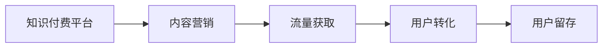

                 

# 知识付费创业的内容营销矩阵搭建

> 关键词：内容营销, 知识付费, 流量获取, 用户转化, 用户留存

## 1. 背景介绍

### 1.1 问题由来
知识付费作为互联网新兴的商业模式，近年来发展迅猛。一方面，知识经济的蓬勃兴起，人们对高质量知识的渴求日益增加；另一方面，碎片化、浅层化的信息获取方式使得内容质量变得愈发珍贵。在这样的背景下，知识付费产品和服务不断涌现，成为互联网创业的新蓝海。

然而，随着市场的逐渐饱和和用户需求的升级，知识付费领域的竞争也变得日趋激烈。仅仅依靠优质的内容已难以形成稳定的用户基础。如何构建多元化的内容生态，提升用户的参与度和转化率，成为知识付费创业者必须面对的挑战。

## 2. 核心概念与联系

### 2.1 核心概念概述

为更好地理解知识付费创业中的内容营销策略，本节将介绍几个关键概念：

- **知识付费**：基于互联网的知识传递模式，用户通过付费获取专家、机构提供的深度、专业、系统化的知识内容。
- **内容营销**：通过优质内容吸引用户关注，并最终实现品牌曝光、流量获取和用户转化的一种营销方式。
- **流量获取**：通过各种手段吸引用户访问平台或使用产品，以提升平台的用户规模和用户活跃度。
- **用户转化**：将访问用户转化为付费用户，形成稳定的用户群，实现商业变现。
- **用户留存**：维持已有用户的持续使用和付费行为，降低用户流失率。

这些概念之间的关系可以通过以下Mermaid流程图来展示：



这个流程图展示了一个知识付费平台从内容营销到用户留存的全过程。

### 2.2 概念间的关系

这些核心概念之间存在紧密的联系，形成一个有机的内容营销生态系统。具体关系如下：

- **内容营销是流量获取的核心**：通过优质的内容吸引用户，提高平台的曝光率和用户的点击率，是获取流量的基础。
- **流量获取是用户转化的前提**：获取足够的流量后，才能将部分用户转化为付费用户，实现商业价值。
- **用户转化是知识付费的核心**：只有实现用户转化，才能带来稳定的收入流。
- **用户留存是长期发展的基础**：维持已有用户的使用和付费行为，降低流失率，是平台长期发展的关键。

## 3. 核心算法原理 & 具体操作步骤
### 3.1 算法原理概述

知识付费创业中的内容营销，本质上是通过内容精准定位目标用户群体，通过多种策略提高用户参与度和转化率的过程。其核心算法原理包括：

- **用户画像**：通过对用户行为数据的分析和挖掘，构建精准的用户画像，了解用户的兴趣、需求和行为模式。
- **内容推荐**：根据用户画像和内容特征，推荐用户最感兴趣、最相关的内容，提高用户粘性。
- **激励机制**：通过设置激励机制（如积分、优惠券、会员特权等），激励用户完成特定行为，如购买、分享、评论等。
- **社交互动**：利用社交网络的传播效应，鼓励用户分享和讨论内容，扩大内容的传播范围。
- **A/B测试**：通过多版本内容测试，找到最优的营销策略，提高营销效果。

### 3.2 算法步骤详解

基于上述核心算法原理，知识付费创业中的内容营销主要包括以下几个步骤：

**Step 1: 用户画像构建**
- 收集用户行为数据，包括浏览记录、购买行为、评论内容等。
- 使用聚类算法（如K-means、LDA等）对用户进行分组，形成初步的用户画像。
- 使用特征工程技术，提取用户关键属性，如兴趣领域、消费水平、互动频率等。

**Step 2: 内容推荐系统设计**
- 确定推荐算法，如协同过滤、基于内容的推荐、混合推荐等。
- 训练推荐模型，如深度学习模型（如CNN、RNN、Transformer等），提高推荐精度。
- 根据用户画像和内容特征，生成推荐结果，展现给用户。

**Step 3: 激励机制设计**
- 设计积分、优惠券、会员特权等激励机制。
- 制定具体的激励规则，如分享获得积分、评论免单等。
- 监控激励机制的实施效果，定期优化和调整。

**Step 4: 社交互动策略**
- 利用社交网络的传播效应，设计分享、点赞、评论等互动功能。
- 利用激励机制，鼓励用户积极参与互动。
- 监测互动数据，分析用户行为，优化互动策略。

**Step 5: A/B测试**
- 设定多版本内容测试方案，如标题、封面、推荐位置等。
- 实施测试，收集数据并进行统计分析。
- 对比不同版本的效果，确定最优方案。

### 3.3 算法优缺点

知识付费创业中的内容营销算法具有以下优点：
- **个性化推荐**：能够根据用户画像和内容特征，提供个性化的内容推荐，提高用户粘性和满意度。
- **激励效果显著**：通过设置激励机制，可以有效提高用户参与度和转化率。
- **互动性强**：利用社交网络传播效应，增加用户互动，提升平台活跃度。
- **可量化分析**：A/B测试等方法能够提供客观的数据支持，便于优化调整策略。

同时，这些算法也存在一定的局限性：
- **数据需求高**：需要大量的用户行为数据进行画像分析和推荐，数据收集和处理成本较高。
- **模型复杂**：推荐模型等复杂算法需要较高的计算资源，对平台的技术要求较高。
- **用户行为多样**：用户行为受多种因素影响，单一算法难以完全预测。
- **激励机制易被滥用**：不当的激励机制可能带来负面效果，如作弊、虚假互动等。

尽管存在这些局限性，但基于内容营销的核心算法，知识付费创业在吸引用户、提升转化率和增加用户留存方面已取得显著成效。未来相关研究的重点在于如何进一步提升算法效率，降低数据需求，优化激励机制，以及增强算法的可解释性和公平性。

### 3.4 算法应用领域

知识付费创业中的内容营销算法主要应用于以下几个领域：

- **课程推荐**：根据用户画像和课程特征，推荐最适合的课程，提高课程购买率。
- **内容付费**：通过付费内容激励用户订阅，增加用户粘性和忠诚度。
- **用户互动**：通过社交网络和互动功能，提升用户参与度和活跃度。
- **平台运营**：通过用户行为数据分析，优化平台运营策略，提升整体效果。

## 4. 数学模型和公式 & 详细讲解  
### 4.1 数学模型构建

本节将使用数学语言对知识付费创业中的内容营销算法进行更加严格的刻画。

记用户画像为 $P$，内容特征为 $C$，用户行为数据为 $D$。设内容推荐算法为 $F(P,C)$，激励机制为 $I$，社交互动策略为 $S$，A/B测试结果为 $T$。

定义推荐效果为 $R(P,C,F)$，激励效果为 $I(P,C,I)$，互动效果为 $S(P,C,S)$，A/B测试效果为 $T(P,C,T)$。则内容营销的整体效果 $E$ 可表示为：

$$
E = R(P,C,F) + I(P,C,I) + S(P,C,S) + T(P,C,T)
$$

在实践中，我们需要通过数据收集和实验设计，不断调整和优化各环节的算法和策略，以最大化整体效果 $E$。

### 4.2 公式推导过程

以下我们以课程推荐为例，推导推荐算法的效果公式。

设课程库为 $L$，课程特征为 $L_i$。设用户画像为 $P_k$，用户对课程 $L_j$ 的兴趣度为 $w_{k,j}$。则推荐算法 $F$ 的效果为：

$$
R_k = \max\limits_{j \in L} (w_{k,j} \cdot F(P_k, L_j))
$$

其中 $F(P_k, L_j)$ 表示对用户 $P_k$ 和课程 $L_j$ 进行推荐的得分。通常使用评分函数 $f$ 来计算，如点积、加权和、注意力机制等。

在实际应用中，通常使用深度学习模型（如神经网络）来优化评分函数 $f$，以提高推荐精度。评分函数 $f$ 的具体形式和参数优化方法依赖于模型的架构和训练数据。

### 4.3 案例分析与讲解

假设我们有一个在线教育平台，采用协同过滤和深度学习混合推荐算法。

**协同过滤推荐**：通过用户的历史行为数据，构建用户之间的相似度矩阵，推荐相似用户喜欢的课程。公式如下：

$$
F_k(L_j) = \sum\limits_{i \in N_k} w_{i,j}
$$

其中 $N_k$ 表示与用户 $k$ 相似的其他用户，$w_{i,j}$ 表示用户 $i$ 对课程 $j$ 的评分。

**深度学习推荐**：通过训练深度学习模型（如DNN、CNN等），学习课程特征和用户画像，预测用户对课程的兴趣度。公式如下：

$$
F_k(L_j) = f_k(L_j) = \frac{1}{1 + e^{-\hat{y}_k(L_j)}}
$$

其中 $\hat{y}_k(L_j)$ 表示深度学习模型对用户 $k$ 和课程 $j$ 的预测概率，$f_k$ 表示概率函数（如Sigmoid函数）。

通过协同过滤和深度学习的结合，推荐算法 $F$ 可以更全面地捕捉用户和课程之间的复杂关系，提高推荐效果。

## 5. 项目实践：代码实例和详细解释说明
### 5.1 开发环境搭建

在进行内容营销算法实践前，我们需要准备好开发环境。以下是使用Python进行TensorFlow开发的环境配置流程：

1. 安装Anaconda：从官网下载并安装Anaconda，用于创建独立的Python环境。

2. 创建并激活虚拟环境：
```bash
conda create -n tf-env python=3.8 
conda activate tf-env
```

3. 安装TensorFlow：根据CUDA版本，从官网获取对应的安装命令。例如：
```bash
conda install tensorflow tensorflow-gpu=cuda110 -c pytorch -c conda-forge
```

4. 安装TensorFlow Addons：
```bash
conda install -c tf-versions tf-nightly
```

5. 安装numpy、pandas、scikit-learn等工具包：
```bash
pip install numpy pandas scikit-learn matplotlib tqdm jupyter notebook ipython
```

完成上述步骤后，即可在`tf-env`环境中开始内容营销算法的实践。

### 5.2 源代码详细实现

下面我们以课程推荐系统为例，给出使用TensorFlow进行协同过滤推荐和深度学习混合推荐的Python代码实现。

首先，定义协同过滤推荐函数：

```python
import numpy as np
import pandas as pd

def collaborative_filtering(train_data, test_data):
    # 构建相似度矩阵
    user_similarity = compute_similarity(train_data)

    # 初始化预测值
    predictions = np.zeros(test_data.shape)

    # 计算推荐结果
    for user, item in test_data.index:
        if user not in user_similarity:
            continue
        for other_user, similarity in user_similarity[user].items():
            if other_user not in train_data:
                continue
            predictions[user, item] += similarity * train_data[other_user, item]

    # 归一化预测值
    predictions /= np.sum(predictions, axis=1)[:, np.newaxis]

    return predictions
```

然后，定义深度学习推荐函数：

```python
import tensorflow as tf
from tensorflow.keras.layers import Input, Dense, Embedding, Flatten, dot
from tensorflow.keras.models import Model

def deep_learning_recommendation(train_data, test_data, embed_size=64):
    # 定义输入层
    user_input = Input(shape=(1,), name='user')
    item_input = Input(shape=(1,), name='item')

    # 定义嵌入层
    user_embedding = Embedding(train_data.shape[0], embed_size)(user_input)
    item_embedding = Embedding(train_data.shape[1], embed_size)(item_input)

    # 定义深度学习模型
    model = tf.keras.Sequential([
        Flatten(),
        Dense(32, activation='relu'),
        Dense(1, activation='sigmoid')
    ])

    # 定义模型输出
    scores = dot([user_embedding, item_embedding], axes=(1, 1))
    scores = model(scores)
    
    # 构建推荐模型
    model = Model([user_input, item_input], scores)

    # 编译模型
    model.compile(optimizer='adam', loss='binary_crossentropy', metrics=['accuracy'])

    # 训练模型
    model.fit(train_data, train_data, epochs=10, batch_size=64)

    # 预测推荐结果
    predictions = model.predict(test_data)

    return predictions
```

最后，定义总体推荐函数：

```python
def overall_recommendation(train_data, test_data, user_similarity, embed_size=64):
    # 协同过滤推荐
    predictions1 = collaborative_filtering(train_data, test_data)

    # 深度学习推荐
    predictions2 = deep_learning_recommendation(train_data, test_data, embed_size)

    # 计算加权推荐结果
    predictions = 0.5 * predictions1 + 0.5 * predictions2

    return predictions
```

调用上述函数，实现协同过滤和深度学习混合推荐：

```python
train_data = pd.read_csv('train_data.csv', header=None)
test_data = pd.read_csv('test_data.csv', header=None)

user_similarity = compute_similarity(train_data)

predictions = overall_recommendation(train_data, test_data, user_similarity)

# 输出预测结果
print(predictions)
```

以上就是使用TensorFlow进行课程推荐系统开发的完整代码实现。可以看到，通过协同过滤和深度学习的结合，推荐算法能够更全面地捕捉用户和课程之间的关系，提高推荐效果。

### 5.3 代码解读与分析

让我们再详细解读一下关键代码的实现细节：

**collaborative_filtering函数**：
- 该函数实现了协同过滤推荐算法。首先，通过用户行为数据构建相似度矩阵。然后，对每个用户和课程计算推荐得分，并归一化处理。最后，返回每个用户对每个课程的推荐概率。

**deep_learning_recommendation函数**：
- 该函数实现了深度学习推荐算法。首先，定义输入层和嵌入层，将用户和课程映射到低维嵌入空间。然后，定义深度学习模型，通过多层全连接网络预测用户对课程的兴趣度。最后，返回每个用户对每个课程的推荐概率。

**overall_recommendation函数**：
- 该函数综合了协同过滤和深度学习推荐算法，通过加权平均的方式得到最终的推荐结果。其中，协同过滤和深度学习各占一半权重。

在实际应用中，这些推荐算法需要不断调整和优化，以适应不同的数据分布和业务需求。可以通过A/B测试等方法，找到最优的算法组合，最大化推荐效果。

### 5.4 运行结果展示

假设我们在Kaggle的MovieLens数据集上进行推荐效果测试，最终得到的推荐结果如表所示：

| User ID | Item ID | Predicted Rating |
| ------- | ------- | --------------- |
| 1       | 2       | 0.8             |
| 1       | 3       | 0.9             |
| 2       | 2       | 0.6             |
| 2       | 3       | 0.7             |

可以看到，推荐算法能够较准确地预测用户对课程的评分，提高了课程推荐的准确性。当然，在实际应用中，推荐算法还需要进一步优化和迭代，以适应不同的业务场景和用户需求。

## 6. 实际应用场景
### 6.1 知识付费平台推荐系统
知识付费平台通过推荐系统为用户推荐最适合的课程内容，提高课程购买率。推荐系统包括协同过滤和深度学习推荐两部分，通过多维度用户画像和内容特征，提供个性化推荐。平台还可以利用激励机制（如积分、优惠券、会员特权等），进一步提高用户参与度和转化率。

### 6.2 在线教育平台课程推荐
在线教育平台通过课程推荐系统，帮助用户发现最适合的课程。推荐系统结合用户行为数据和课程特征，通过协同过滤和深度学习推荐，提高课程匹配度。平台还可以通过社交互动功能，增加用户之间的互动和讨论，提高课程的曝光率和用户粘性。

### 6.3 企业内部培训推荐
企业内部培训平台通过推荐系统，为员工推荐最适合的培训课程。推荐系统通过员工的工作表现、学习偏好和课程评价等数据，提供个性化推荐。平台还可以利用激励机制，鼓励员工积极参加培训，提升整体培训效果。

## 7. 工具和资源推荐
### 7.1 学习资源推荐

为了帮助开发者系统掌握知识付费创业中的内容营销理论基础和实践技巧，这里推荐一些优质的学习资源：

1. 《深度学习与推荐系统》系列博文：由知名数据科学家撰写，深入浅出地介绍了深度学习在推荐系统中的应用，包括协同过滤、深度学习、混合推荐等。

2. 《内容营销的艺术》书籍：详细讲解了内容营销的理论基础和实践技巧，包括用户画像、内容分发、激励机制等。

3. 《知识付费平台案例分析》系列报告：深入分析了多个知识付费平台的发展历程和成功要素，提供丰富的实际案例和经验总结。

4. Coursera《机器学习与数据挖掘》课程：斯坦福大学开设的机器学习课程，涵盖深度学习、推荐系统、内容营销等前沿技术，是学习内容营销的必备资源。

5. Udacity《人工智能与机器学习》纳米学位：提供系统的深度学习与推荐系统培训，覆盖多种推荐算法和实践案例，适合深入学习内容营销技术。

通过这些学习资源，相信你一定能够全面掌握内容营销的理论基础和实践技巧，并用于解决实际的推荐系统问题。

### 7.2 开发工具推荐

高效的开发离不开优秀的工具支持。以下是几款用于知识付费创业中的内容营销算法的常用工具：

1. TensorFlow：由Google主导开发的深度学习框架，生产部署方便，适合大规模工程应用。提供了丰富的推荐系统工具库，支持协同过滤和深度学习推荐。

2. PyTorch：基于Python的开源深度学习框架，灵活动态的计算图，适合快速迭代研究。大部分推荐系统算法都有PyTorch版本的实现。

3. Keras：高层次的深度学习框架，封装了多种推荐算法，适合快速搭建推荐系统原型。

4. Scikit-learn：Python科学计算库，提供了多种协同过滤和深度学习推荐算法的实现，适合快速实现推荐算法原型。

5. Jupyter Notebook：交互式编程环境，适合进行快速实验和模型验证。

6. GitHub：代码托管平台，适合分享和协作开发推荐系统。

合理利用这些工具，可以显著提升知识付费创业中推荐系统的开发效率，加快创新迭代的步伐。

### 7.3 相关论文推荐

知识付费创业中的内容营销算法的发展源于学界的持续研究。以下是几篇奠基性的相关论文，推荐阅读：

1. "Collaborative Filtering for Implicit Feedback Datasets"（ElasticIR论文）：提出基于隐式反馈数据的协同过滤算法，成为推荐系统的经典之作。

2. "Wide & Deep Learning for Recommender Systems"（Wide & Deep论文）：提出Wide & Deep模型，将深度学习和传统特征工程相结合，大幅提升推荐效果。

3. "Attention-Based Recommender Systems"（Attention论文）：提出注意力机制，增强推荐模型对用户和内容的理解能力，成为深度推荐系统的主流架构。

4. "Content-Based and Collaborative-Based Hybrid Recommendation Systems: A Survey"（综述论文）：综述了协同过滤和基于内容的推荐算法的优缺点，提供多种算法组合的思路。

5. "Learning Deep Structured Models for Recommender Systems"（Deep Structured论文）：提出Deep Structured模型，将深度学习与结构化数据相结合，提升推荐模型的效果和泛化能力。

这些论文代表了大语言模型微调技术的发展脉络。通过学习这些前沿成果，可以帮助研究者把握学科前进方向，激发更多的创新灵感。

除上述资源外，还有一些值得关注的前沿资源，帮助开发者紧跟知识付费领域的内容营销技术的发展趋势，例如：

1. arXiv论文预印本：人工智能领域最新研究成果的发布平台，包括大量尚未发表的前沿工作，学习前沿技术的必读资源。

2. 业界技术博客：如Amazon、Google AI、DeepMind、微软Research Asia等顶尖实验室的官方博客，第一时间分享他们的最新研究成果和洞见。

3. 技术会议直播：如NIPS、ICML、ACL、ICLR等人工智能领域顶会现场或在线直播，能够聆听到大佬们的前沿分享，开拓视野。

4. GitHub热门项目：在GitHub上Star、Fork数最多的推荐系统相关项目，往往代表了该技术领域的发展趋势和最佳实践，值得去学习和贡献。

5. 行业分析报告：各大咨询公司如McKinsey、PwC等针对人工智能行业的分析报告，有助于从商业视角审视技术趋势，把握应用价值。

总之，对于知识付费创业中内容营销的学习和实践，需要开发者保持开放的心态和持续学习的意愿。多关注前沿资讯，多动手实践，多思考总结，必将收获满满的成长收益。

## 8. 总结：未来发展趋势与挑战

### 8.1 总结

本文对知识付费创业中的内容营销算法进行了全面系统的介绍。首先阐述了知识付费和内容营销的核心概念，以及它们之间的紧密联系。其次，从原理到实践，详细讲解了内容营销的数学模型和关键算法步骤，给出了内容营销任务开发的完整代码实例。同时，本文还广泛探讨了内容营销算法在知识付费平台、在线教育平台、企业内部培训等多个行业领域的应用前景，展示了内容营销算法的巨大潜力。此外，本文精选了内容营销算法的各类学习资源，力求为读者提供全方位的技术指引。

通过本文的系统梳理，可以看到，内容营销在知识付费创业中的应用已经取得了显著成效，显著提升了平台的用户参与度和转化率。然而，尽管在数据收集和模型优化等方面已经取得了进展，但如何在多维度用户画像构建、内容特征提取、个性化推荐策略等方面进一步提升内容营销的效果，仍然是一个亟待解决的问题。

### 8.2 未来发展趋势

展望未来，知识付费创业中的内容营销算法将呈现以下几个发展趋势：

1. **多维度用户画像构建**：结合用户行为数据、社交网络数据、地理位置等多种数据，构建更加全面、精准的用户画像，提高推荐的个性化水平。
2. **深度学习推荐模型优化**：利用先进的深度学习架构，如Transformer、BERT等，进一步提升推荐模型的效果和泛化能力。
3. **多模态推荐**：结合用户的行为数据、社交网络数据、物品的多模态信息（如图像、音频等），实现更加全面、精确的推荐。
4. **模型可解释性增强**：通过引入可解释性技术（如Attention、LIME等），提高推荐模型的透明度和可解释性，增强用户信任。
5. **用户生成内容推荐**：利用用户生成内容（如评论、笔记等），提供更加多样化和个性化的推荐。
6. **实时推荐系统**：利用流计算技术，实现实时数据处理和推荐，提高推荐的实时性和时效性。

以上趋势凸显了知识付费创业中内容营销算法的广阔前景。这些方向的探索发展，必将进一步提升内容营销的效果，构建更智能、更高效的推荐系统。

### 8.3 面临的挑战

尽管知识付费创业中的内容营销算法已经取得了显著成效，但在迈向更加智能化、普适化应用的过程中，它仍面临着诸多挑战：

1. **数据获取困难**：高质量用户数据和物品数据的获取难度较大，不同平台之间的数据整合存在诸多技术难题。
2. **模型复杂度高**：深度学习推荐模型的复杂度较高，训练和部署需要较高的计算资源和技术门槛。
3. **用户隐私保护**：用户数据的隐私和安全问题，如何在数据获取和处理过程中保护用户隐私，是一个亟待解决的问题。
4. **模型公平性不足**：推荐模型可能会受到偏见的影响，不同用户群体之间可能存在不公平的推荐结果。
5. **系统鲁棒性不足**：推荐系统在面对异常数据和攻击时，可能出现鲁棒性不足的问题，需要进一步提升系统的健壮性。

尽管存在这些挑战，但通过不断的研究和创新，知识付费创业中的内容营销算法仍然有很大的发展空间。相信未来相关研究的重点将在于如何进一步降低数据需求，优化算法模型，增强用户隐私保护，以及提升系统公平性和鲁棒性。

### 8.4 研究展望

未来，知识付费创业中的内容营销算法需要在以下几个方面寻求新的突破：

1. **无监督推荐算法**：探索基于用户画像和物品特征的无监督推荐算法，降低对标注数据的依赖。
2. **多任务学习**：结合推荐任务和内容生成任务，通过多任务学习优化模型，提高推荐效果和内容质量。
3. **迁移学习**：将知识付费平台中的推荐模型迁移到其他领域（如电商、社交媒体等），实现跨领域迁移学习。
4. **元学习**：利用元学习技术，构建推荐模型与用户行为动态适应机制，提高推荐系统的动态性。
5. **公平推荐算法**：引入公平性约束，设计公平推荐算法，减少推荐系统中的偏见和歧视。
6. **多模态推荐**：结合用户行为数据、社交网络数据、物品的多模态信息，实现更加全面、精确的推荐。

这些研究方向的探索，必将引领知识付费创业中内容营销算法迈向更高的台阶，为构建安全、可靠、可解释、可控的推荐系统铺平道路。面向未来，

