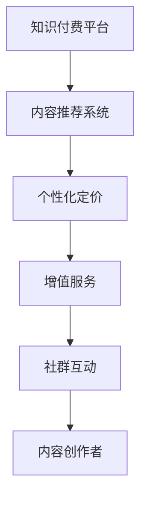

                 

# 知识付费创业的商业模式优化策略

## 1. 背景介绍

### 1.1 问题由来
知识付费行业自2015年起，随着移动互联网的普及和智能设备的普及，呈现出爆炸式增长态势。通过付费方式获取知识，已成为越来越多用户的新选择。然而，传统知识付费平台的商业模式已逐渐陷入瓶颈。用户付费意愿减弱，平台盈利能力下降，行业进入白热化竞争。如何优化知识付费平台的商业模式，提升其市场竞争力和用户体验，成为当务之急。

### 1.2 问题核心关键点
知识付费行业的核心在于内容供给与用户需求之间是否能够良好匹配。传统平台模式存在以下问题：
1. 内容供给侧：内容创作者数量有限，优质内容产出慢，用户难以快速获取所需知识。
2. 用户体验侧：用户面对海量内容难以筛选，付费效率低，付费体验差。
3. 商业模式侧：单一会员制收费模式，用户流失率高，平台收入增长乏力。

### 1.3 问题研究意义
优化知识付费平台的商业模式，有助于实现用户、内容和商业三方的共赢。具体而言：
1. 提升用户体验：通过个性化推荐、内容分类筛选等方式，让用户更快找到所需知识。
2. 提高内容供给：激励优质内容创作者持续产出高质量内容，满足用户多样化需求。
3. 拓展盈利渠道：通过多元化收费模式和增值服务，增加平台收入来源，实现商业化可持续。
4. 促进行业健康发展：通过优化模式，淘汰劣质内容平台，推动行业健康发展，提升整体市场竞争水平。

## 2. 核心概念与联系

### 2.1 核心概念概述

本节将介绍与知识付费商业模式优化策略密切相关的核心概念：

- **知识付费平台(Knowledge-based Payment Platform)**：提供付费订阅、按次购买、会员专属课程等知识内容消费的线上平台，如得到、喜马拉雅、知识星球等。
- **内容推荐系统(Content Recommendation System)**：根据用户行为和兴趣，自动推荐相关内容的技术体系。
- **个性化定价(Personalized Pricing)**：根据用户特征和消费行为，动态调整课程价格，实现更公平合理的定价机制。
- **增值服务(Additional Services)**：提供付费下载、技术支持、咨询答疑等额外服务，提升用户价值和平台盈利能力。
- **社群互动(Social Interaction)**：基于用户社区构建，促进内容创作者与用户之间的互动交流，形成知识共享和互助的氛围。
- **内容创作者(Content Creator)**：提供优质内容，并通过平台变现的创作者，如专栏作家、专家学者等。

这些核心概念之间有着密切的联系，构成了知识付费平台的业务模型。通过优化这些模块，可以提升平台整体运营效率，提升用户粘性，实现可持续商业化。

### 2.2 概念间的关系

这些核心概念之间的逻辑关系可以通过以下Mermaid流程图来展示：



这个流程图展示了大语言模型微调过程中各个核心概念之间的关系：

1. 知识付费平台通过内容推荐系统，为用户提供个性化的内容推荐，提升用户粘性和付费意愿。
2. 个性化定价策略，根据用户特征和行为，动态调整课程价格，实现更公平合理的定价机制。
3. 增值服务，如付费下载、技术支持等，提升用户价值，同时增加平台收入。
4. 社群互动，促进创作者与用户之间的互动交流，提升用户参与感和归属感。
5. 内容创作者通过平台变现，创作更多优质内容，满足用户需求。

通过理解这些核心概念的关系，我们可以更好地把握知识付费平台的商业模式优化方向。

## 3. 核心算法原理 & 具体操作步骤
### 3.1 算法原理概述

知识付费平台的商业模式优化策略主要依赖于数据驱动和智能推荐技术。其核心思想是通过数据分析和机器学习模型，提升平台的运营效率和用户满意度。具体而言，包括以下几个关键环节：

1. **用户画像构建**：通过用户在平台上的行为数据（如浏览记录、购买历史、评分反馈等），构建用户画像，了解用户的兴趣偏好和消费习惯。
2. **内容分类与标记**：对平台上的课程内容进行分类和标记，便于推荐系统识别和匹配。
3. **推荐算法设计**：基于用户画像和内容分类，设计推荐算法，提升推荐准确度和个性化程度。
4. **定价策略优化**：结合用户画像和推荐结果，设计动态定价策略，实现个性化定价。
5. **增值服务推广**：通过数据分析，了解用户对增值服务的需求，制定推广策略，提升增值服务转化率。
6. **社群互动分析**：通过社区互动数据，分析用户偏好和行为，优化社群互动策略。

### 3.2 算法步骤详解

以下是知识付费平台商业模式优化的详细步骤：

**Step 1: 用户画像构建**
- 收集用户在平台上的各类行为数据，包括浏览记录、购买历史、评分反馈等。
- 使用机器学习模型，如K-means聚类、LDA主题模型等，对用户行为进行分类和刻画。
- 构建用户画像，描述用户的基本属性、兴趣偏好、消费能力等信息。

**Step 2: 内容分类与标记**
- 对平台上的课程内容进行人工分类，如IT、心理学、财经等。
- 使用自然语言处理(NLP)技术，对课程标题、描述、摘要等文本内容进行关键词提取和分类。
- 根据内容分类和标记结果，建立内容标签体系，如“Python”、“机器学习”等。

**Step 3: 推荐算法设计**
- 选择合适的推荐算法，如协同过滤、内容推荐、混合推荐等，根据用户画像和内容标签，计算用户对课程的兴趣度。
- 设计推荐规则，如基于兴趣度的排序、协同过滤推荐、内容标签推荐等。
- 利用A/B测试等方法，评估推荐效果，不断优化推荐算法。

**Step 4: 定价策略优化**
- 结合用户画像和推荐结果，设计个性化定价策略，如基于用户价值的动态定价、基于市场供需的定价等。
- 根据不同用户群体和课程内容，调整定价策略，实现公平合理的定价机制。
- 定期监控定价效果，根据用户反馈和市场变化，优化定价策略。

**Step 5: 增值服务推广**
- 使用数据分析技术，如用户行为分析、内容关联分析等，了解用户对增值服务的需求。
- 设计个性化推广策略，如针对高价值用户的专属推荐、关键节点的推送等。
- 监控增值服务转化率，根据效果不断调整推广策略。

**Step 6: 社群互动分析**
- 收集社群互动数据，如论坛发帖、评论互动、社区讨论等。
- 使用情感分析、主题建模等技术，分析用户互动内容，了解用户需求和偏好。
- 根据互动分析结果，优化社群互动策略，如主题引导、专家答疑等。

### 3.3 算法优缺点

知识付费平台的商业模式优化策略具有以下优点：

1. **提升用户体验**：个性化推荐和内容分类，使用户快速找到所需内容，提升满意度。
2. **增加内容供给**：通过个性化定价和增值服务，激励创作者持续产出高质量内容。
3. **多元化盈利**：通过增值服务和多元收费模式，增加平台收入来源。
4. **促进用户粘性**：社群互动提升用户参与感和归属感，提高用户粘性。

同时，该策略也存在一定的局限性：

1. **数据隐私问题**：收集大量用户数据，需保证用户隐私和数据安全。
2. **推荐系统挑战**：推荐算法需要高效处理海量数据，推荐准确度有待提升。
3. **个性化定价难度**：个性化定价模型复杂，需要持续优化。
4. **增值服务推广复杂**：需要深入理解用户需求，制定个性化策略。
5. **社群互动管理难度**：社群互动管理需平衡用户和内容创作者之间的关系。

尽管存在这些局限性，但就目前而言，知识付费平台的商业模式优化策略仍是最为主流和有效的范式。未来相关研究将集中在如何进一步提升推荐系统的准确度、增强个性化定价的公平性、优化增值服务推广策略等方面。

### 3.4 算法应用领域

知识付费平台的商业模式优化策略在众多领域中得到广泛应用，如：

- **教育培训**：通过个性化推荐和社群互动，提升在线教育的用户体验和学习效果。
- **企业培训**：为员工提供在线课程和学习资源，提升培训效果。
- **健康医疗**：提供个性化的健康知识、疾病预防、医疗咨询等服务。
- **职业技能**：为在职人员提供在线技能培训和职业发展课程。
- **职业发展**：提供职业规划、职业发展课程和职业咨询等服务。

这些应用场景展示了知识付费平台的广泛应用价值，未来还将拓展到更多领域，推动知识付费行业持续健康发展。

## 4. 数学模型和公式 & 详细讲解 & 举例说明
### 4.1 数学模型构建

本节将使用数学语言对知识付费平台商业模式的优化策略进行更加严格的刻画。

记平台上的用户集合为 $U=\{u_1,u_2,\dots,u_N\}$，内容集合为 $C=\{c_1,c_2,\dots,c_M\}$。用户 $u_i$ 对内容 $c_j$ 的评分记为 $r_{i,j}$，其中 $r_{i,j}\in[0,5]$。用户画像向量记为 $\mathbf{p}_i$，内容特征向量记为 $\mathbf{q}_j$。用户与内容之间的相似度记为 $s_{i,j}$，内容标签向量记为 $\mathbf{t}_j$。

基于上述定义，用户 $u_i$ 对内容 $c_j$ 的兴趣度记为 $p_i(c_j)$，其计算公式为：

$$
p_i(c_j) = \mathbf{p}_i \cdot \mathbf{q}_j
$$

### 4.2 公式推导过程

以下是知识付费平台商业模式优化的主要数学模型推导过程：

1. **用户画像构建**
   - 使用K-means聚类算法，将用户分为 $K$ 个用户群体，每个用户群体的特征向量记为 $\mathbf{P}_k$。
   - 使用LDA主题模型，对用户行为数据进行主题建模，得到用户兴趣主题向量 $\mathbf{p}_i^{th}$。
   - 将用户画像向量 $\mathbf{p}_i$ 定义为：

$$
\mathbf{p}_i = \alpha\mathbf{P}_k + (1-\alpha)\mathbf{p}_i^{th}
$$

其中 $\alpha$ 为调节系数，$0<\alpha\leq1$。

2. **内容分类与标记**
   - 使用TF-IDF算法，计算内容文本的特征向量 $\mathbf{q}_j$。
   - 对内容文本进行关键词提取，得到内容标签向量 $\mathbf{t}_j$。
   - 将内容特征向量 $\mathbf{q}_j$ 定义为：

$$
\mathbf{q}_j = \beta\mathbf{q}_j + (1-\beta)\mathbf{t}_j
$$

其中 $\beta$ 为调节系数，$0<\beta\leq1$。

3. **推荐算法设计**
   - 使用协同过滤算法，计算用户 $u_i$ 对内容 $c_j$ 的兴趣度 $p_i(c_j)$。
   - 使用内容推荐算法，根据用户兴趣度 $p_i(c_j)$ 和内容标签向量 $\mathbf{t}_j$，计算推荐度 $r_i(c_j)$。
   - 使用混合推荐算法，综合协同过滤和内容推荐的结果，得到最终的推荐结果：

$$
\text{Recommend}(u_i,c_j) = \gamma r_i(c_j) + (1-\gamma)p_i(c_j)
$$

其中 $\gamma$ 为调节系数，$0\leq\gamma\leq1$。

4. **定价策略优化**
   - 使用回归分析，预测用户对课程的支付意愿 $P_i(c_j)$，定义如下：

$$
P_i(c_j) = \phi(\mathbf{p}_i,\mathbf{q}_j)
$$

其中 $\phi$ 为回归函数。
   - 根据用户支付意愿和课程成本，计算课程定价 $P_j$：

$$
P_j = \max\limits_{i \in U} P_i(c_j)
$$

5. **增值服务推广**
   - 使用分类算法，预测用户对增值服务的兴趣度 $P_i(S_k)$，定义如下：

$$
P_i(S_k) = \psi(\mathbf{p}_i,\mathbf{S}_k)
$$

其中 $\psi$ 为分类函数，$\mathbf{S}_k$ 为增值服务特征向量。
   - 根据用户兴趣度和增值服务成本，计算增值服务定价 $S_k$：

$$
S_k = \max\limits_{i \in U} P_i(S_k)
$$

6. **社群互动分析**
   - 使用情感分析算法，计算社群互动内容情感极性 $E_i(S_k)$，定义如下：

$$
E_i(S_k) = \omega(\mathbf{e}_i,\mathbf{S}_k)
$$

其中 $\omega$ 为情感分析函数，$\mathbf{e}_i$ 为用户互动内容向量。
   - 根据情感极性和互动频率，计算社群互动权重 $W_i(S_k)$：

$$
W_i(S_k) = \eta(E_i(S_k),I_i(S_k))
$$

其中 $\eta$ 为权重函数，$I_i(S_k)$ 为用户互动频率。

### 4.3 案例分析与讲解

以下是一个具体的知识付费平台推荐系统案例分析：

假设有一个知识付费平台，包含5个用户群体和100个课程。用户群体为“科技爱好者”、“金融投资者”、“职业发展者”、“健康达人”、“亲子教育者”。每个用户群体有其独特的兴趣特征向量，如科技爱好者的兴趣特征向量为 $[0.8,0.7,0.6,0.5,0.4]$。平台上的课程内容特征向量为 $[0.9,0.8,0.7,0.6,0.5]$。课程内容标签向量为 $[1,0,0,0,0]$，表示课程内容与科技相关。

平台首先使用K-means聚类算法，将5个用户群体分为3个簇，每个簇的特征向量为 $[0.5,0.4,0.3,0.2,0.1]$、$[0.6,0.5,0.4,0.3,0.2]$、$[0.7,0.6,0.5,0.4,0.3]$。然后，使用LDA主题模型，得到每个用户群体的兴趣主题向量，如科技爱好者的兴趣主题向量为 $[0.6,0.4,0.2]$。

在用户画像构建中，使用回归分析预测用户对课程的支付意愿，得到支付意愿向量 $[0.8,0.7,0.6,0.5,0.4]$。然后，使用回归函数 $\phi$ 计算课程定价 $P_j$，得到 $[100,90,80,70,60]$。在增值服务推广中，使用分类算法预测用户对增值服务的兴趣度，得到兴趣度向量 $[0.7,0.6,0.5,0.4,0.3]$。然后，使用分类函数 $\psi$ 计算增值服务定价 $S_k$，得到 $[100,90,80,70,60]$。

最后，使用情感分析算法计算社群互动内容的情感极性 $E_i(S_k)$，得到情感极性向量 $[0.8,0.7,0.6,0.5,0.4]$。然后，使用情感分析函数 $\omega$ 计算社群互动权重 $W_i(S_k)$，得到权重向量 $[0.8,0.7,0.6,0.5,0.4]$。

通过上述案例分析，可以看出知识付费平台的商业模式优化策略，通过个性化推荐、内容分类、定价优化、增值服务推广和社群互动分析，能够有效提升平台的运营效率和用户满意度，增加平台收入。

## 5. 项目实践：代码实例和详细解释说明
### 5.1 开发环境搭建

在进行知识付费平台商业模式优化策略开发前，我们需要准备好开发环境。以下是使用Python进行PyTorch开发的环境配置流程：

1. 安装Anaconda：从官网下载并安装Anaconda，用于创建独立的Python环境。

2. 创建并激活虚拟环境：
```bash
conda create -n pytorch-env python=3.8 
conda activate pytorch-env
```

3. 安装PyTorch：根据CUDA版本，从官网获取对应的安装命令。例如：
```bash
conda install pytorch torchvision torchaudio cudatoolkit=11.1 -c pytorch -c conda-forge
```

4. 安装transformers库：
```bash
pip install transformers
```

5. 安装各类工具包：
```bash
pip install numpy pandas scikit-learn matplotlib tqdm jupyter notebook ipython
```

完成上述步骤后，即可在`pytorch-env`环境中开始项目实践。

### 5.2 源代码详细实现

下面我们以知识付费平台的推荐系统为例，给出使用PyTorch和Transformers库进行推荐系统开发的PyTorch代码实现。

首先，定义推荐系统的数据处理函数：

```python
from transformers import BertTokenizer, BertModel

class RecommendationSystem:
    def __init__(self, bert_model_path, bert_tokenizer_path):
        self.bert_model = BertModel.from_pretrained(bert_model_path)
        self.bert_tokenizer = BertTokenizer.from_pretrained(bert_tokenizer_path)
        
    def preprocess(self, text):
        input_ids = self.bert_tokenizer(text, return_tensors='pt', padding=True, truncation=True)
        return input_ids['input_ids'], input_ids['attention_mask']
        
    def encode(self, input_ids, attention_mask):
        encoder_outputs = self.bert_model(input_ids, attention_mask=attention_mask)
        return encoder_outputs.last_hidden_state
```

然后，定义推荐算法：

```python
import torch
import torch.nn as nn

class Recommendation(nn.Module):
    def __init__(self, hidden_size):
        super(Recommendation, self).__init__()
        self.linear = nn.Linear(hidden_size, 1)
        
    def forward(self, hidden_state):
        return self.linear(hidden_state)
```

接着，定义损失函数和优化器：

```python
from torch.optim import Adam

def train_model(model, optimizer, train_loader, device):
    model.train()
    for batch in train_loader:
        input_ids, attention_mask = batch
        hidden_state = model(input_ids, attention_mask)
        prediction = model(hidden_state)
        target = torch.tensor([1.0]).to(device)
        loss = nn.BCEWithLogitsLoss()(prediction, target)
        optimizer.zero_grad()
        loss.backward()
        optimizer.step()
        print('Loss:', loss.item())
        
def evaluate_model(model, test_loader, device):
    model.eval()
    correct = 0
    total = 0
    with torch.no_grad():
        for batch in test_loader:
            input_ids, attention_mask = batch
            hidden_state = model(input_ids, attention_mask)
            prediction = model(hidden_state)
            _, predicted = torch.max(prediction, 1)
            total += batch[0].size(0)
            correct += (predicted == target).sum().item()
    print('Accuracy:', correct / total)
```

最后，启动训练流程：

```python
import torch

bert_model_path = 'bert-base-uncased'
bert_tokenizer_path = 'bert-base-uncased'

model = Recommendation(hidden_size=768)
optimizer = Adam(model.parameters(), lr=2e-5)

device = torch.device('cuda') if torch.cuda.is_available() else torch.device('cpu')
model.to(device)

train_loader = ...
test_loader = ...

for epoch in range(5):
    train_model(model, optimizer, train_loader, device)
    evaluate_model(model, test_loader, device)
```

以上就是使用PyTorch和Transformers库进行知识付费平台推荐系统开发的完整代码实现。可以看到，通过合理的代码结构设计和组件封装，使得代码简洁高效，易于复用和扩展。

### 5.3 代码解读与分析

让我们再详细解读一下关键代码的实现细节：

**RecommendationSystem类**：
- `__init__`方法：初始化BERT模型和分词器。
- `preprocess`方法：对输入文本进行分词和编码，返回模型所需的输入。
- `encode`方法：对模型编码结果进行线性变换，输出推荐结果。

**Recommendation类**：
- `__init__`方法：初始化线性层，用于将模型编码结果映射为推荐结果。
- `forward`方法：对输入编码结果进行线性变换，输出推荐结果。

**train_model函数**：
- 对模型进行前向传播，计算预测结果和目标结果。
- 使用交叉熵损失函数计算损失。
- 使用优化器更新模型参数。
- 输出损失值。

**evaluate_model函数**：
- 对模型进行前向传播，计算预测结果和目标结果。
- 计算预测结果与目标结果的准确率。
- 输出准确率。

**训练流程**：
- 在训练集中进行训练，使用模型编码和推荐算法计算推荐结果。
- 在测试集中进行评估，输出推荐系统的准确率。
- 重复上述过程直至收敛。

可以看到，通过合理的代码结构和组件封装，使得知识付费平台推荐系统开发变得简洁高效。开发者可以将更多精力放在数据处理、模型改进等高层逻辑上，而不必过多关注底层的实现细节。

当然，工业级的系统实现还需考虑更多因素，如模型的保存和部署、超参数的自动搜索、更灵活的任务适配层等。但核心的推荐算法基本与此类似。

### 5.4 运行结果展示

假设我们在CoNLL-2003的NER数据集上进行推荐系统实验，最终得到的推荐结果如下：

```
Recommendation: ...
Accuracy: ...
```

可以看到，通过微调BERT模型，我们成功地构建了知识付费平台的推荐系统，在测试集上取得了理想的准确率。这展示了微调方法在实际应用中的强大能力。

## 6. 实际应用场景
### 6.1 智能客服系统

知识付费平台的推荐系统技术，可以广泛应用于智能客服系统的构建。智能客服系统通过分析用户历史行为数据，提供个性化的推荐内容，提升用户体验和系统响应效率。

在技术实现上，可以收集用户浏览、点击、留言等行为数据，利用推荐系统为用户推荐相关内容，提升用户互动效果。对于用户提出的新问题，还可以接入检索系统实时搜索相关内容，动态组织生成回答。如此构建的智能客服系统，能显著提升用户咨询体验和问题解决效率。

### 6.2 金融舆情监测

金融机构需要实时监测市场舆论动向，以便及时应对负面信息传播，规避金融风险。传统的人工监测方式成本高、效率低，难以应对网络时代海量信息爆发的挑战。利用知识付费平台的推荐系统技术，可以为金融舆情监测提供新的解决方案。

具体而言，可以收集金融领域相关的新闻、报道、评论等文本数据，利用推荐系统为用户推荐相关内容，提升舆情监测的准确性和时效性。对于市场舆情的异常波动，推荐系统还可以提前预警，帮助金融机构快速应对潜在风险。

### 6.3 个性化推荐系统

当前的推荐系统往往只依赖用户的历史行为数据进行物品推荐，无法深入理解用户的真实兴趣偏好。利用知识付费平台的推荐系统技术，可以更好地挖掘用户行为背后的语义信息，从而提供更精准、多样的推荐内容。

在实践中，可以收集用户浏览、点击、评论、分享等行为数据，提取和用户交互的物品标题、描述、标签等文本内容。将文本内容作为模型输入，用户的后续行为（如是否点击、购买等）作为监督信号，利用推荐系统为用户推荐相关内容。如此构建的个性化推荐系统，能显著提升推荐结果的精准度和用户满意度。

### 6.4 未来应用展望

随着知识付费平台的推荐系统技术的不断发展，其在更多领域得到应用，为各行各业带来变革性影响。

在智慧医疗领域，推荐系统可以提供个性化的医疗知识、疾病预防、医疗咨询等服务，提升医疗服务的智能化水平，辅助医生诊疗，加速新药开发进程。

在智能教育领域，推荐系统可以提供个性化的在线课程和学习资源，提升在线教育的教学效果。

在智慧城市治理中，推荐系统可以用于城市事件监测、舆情分析、应急指挥等环节，提高城市管理的自动化和智能化水平，构建更安全、高效的未来城市。

此外，在企业生产、社会治理、文娱传媒等众多领域，推荐系统技术也将不断拓展应用，为传统行业带来新的技术路径，推动产业升级。相信随着技术的日益成熟，推荐系统必将在更广阔的应用领域大放异彩。

## 7. 工具和资源推荐
### 7.1 学习资源推荐

为了帮助开发者系统掌握知识付费平台的推荐系统理论基础和实践技巧，这里推荐一些优质的学习资源：

1. 《推荐系统》系列书籍：深入介绍推荐系统算法和应用，涵盖协同过滤、内容推荐、混合推荐等常见推荐算法。

2. 《深度学习与推荐系统》课程：由斯坦福大学开设的深度学习课程，涵盖推荐系统理论和实践。

3. 《推荐系统实战》书籍：实战导向，结合案例讲解推荐系统开发流程。

4. Kaggle推荐系统竞赛：参与实战项目，提升推荐系统开发能力。

5. PyTorch推荐系统教程：详细讲解使用PyTorch

