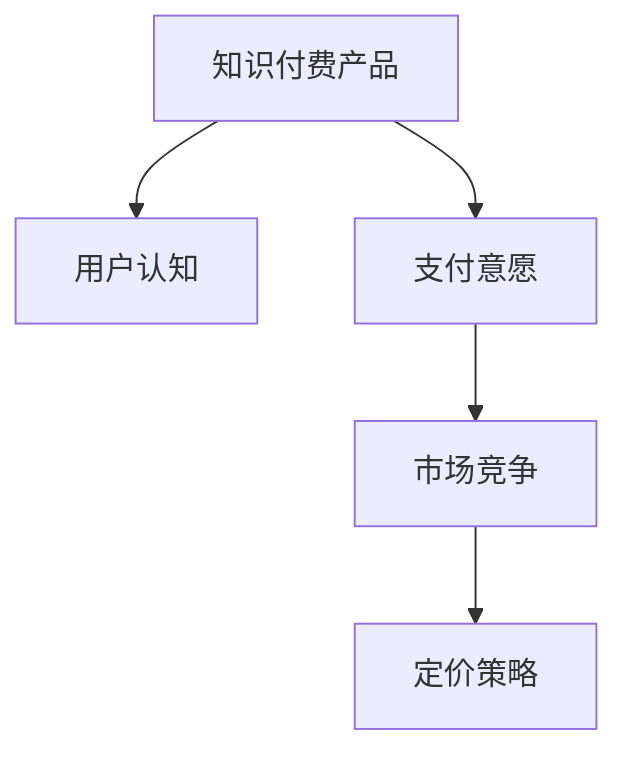

                 

# 知识付费创业的定价心理学

> 关键词：知识付费, 用户心理, 定价策略, 订阅模型, 自由市场, 会员体系, 微调价格

## 1. 背景介绍

在互联网和数字经济高速发展的今天，知识付费已然成为一种趋势，特别是在信息爆炸、知识更新加速的数字化时代，知识付费正快速渗透到各个行业和领域，成为许多人获取知识的重要渠道。尽管知识付费市场持续扩大，但用户认知、支付意愿以及各类知识付费产品如何定价，仍是一个需要深入探讨的课题。

### 1.1 知识付费兴起的原因
#### 1.1.1 时间碎片化
现代生活节奏加快，人们越来越难以抽出整块时间学习。而知识付费产品，如在线课程、音频分享、电子书等，能够充分利用用户碎片时间，使用户在短时间内获取知识和信息。

#### 1.1.2 知识更新加速
随着新技术、新概念的不断涌现，知识和技能更新换代的速度加快。知识付费产品提供最新、最前沿的知识，帮助用户保持竞争力。

#### 1.1.3 知识壁垒的降低
互联网使知识的传播门槛降低，知识付费产品使得优质内容易于获取，对传统知识传播渠道形成补充。

#### 1.1.4 用户对个性化需求的提高
用户不再满足于获取标准化的知识，更希望根据个人兴趣和需求选择定制化内容，知识付费产品正是满足了这一需求。

### 1.2 知识付费市场的规模
根据《2022年中国知识付费行业研究报告》，2021年中国知识付费市场规模达371.3亿元，较2019年的168.8亿元增长了一倍多。预计到2025年，知识付费市场规模将达到1165.8亿元，年复合增长率为36.3%。

### 1.3 用户对知识付费的认知和接受度
艾媒咨询数据显示，超过80%的中国互联网用户表示愿意为知识付费，并认为知识付费对个人成长有帮助。这表明，知识付费已经成为一种被广泛接受的消费模式。

## 2. 核心概念与联系

### 2.1 核心概念概述

为更好地理解知识付费创业的定价心理学，本节将介绍几个密切相关的核心概念：

- **知识付费产品**：指利用互联网技术为用户提供付费知识内容的在线服务，如在线课程、音频分享、电子书等。
- **用户认知**：指用户对知识付费产品及其价值的认知水平。
- **支付意愿**：指用户愿意为获取特定知识付费的程度。
- **市场竞争**：指知识付费市场中产品之间的竞争态势。
- **定价策略**：指知识付费产品定价的具体方式和策略。

这些核心概念之间的逻辑关系可以通过以下Mermaid流程图来展示：



这个流程图展示出知识付费产品的价值如何通过用户认知、支付意愿、市场竞争等环节影响定价策略。

### 2.2 概念间的关系

这些核心概念之间存在着紧密的联系，形成了知识付费市场生态系统的核心框架。具体来说：

- **用户认知**：用户对知识付费产品的价值认知直接影响其支付意愿。
- **支付意愿**：支付意愿决定用户是否愿意为产品付费，影响产品的市场规模和用户获取。
- **市场竞争**：市场竞争状况影响定价策略，从而影响知识付费产品的竞争力和市场份额。
- **定价策略**：定价策略又反过来影响用户认知和支付意愿，形成闭环。

在知识付费市场中，这些核心概念相互影响，共同决定了产品的定价和市场表现。

## 3. 核心算法原理 & 具体操作步骤
### 3.1 算法原理概述

知识付费产品的定价，本质上是一个经济问题，涉及用户的认知价值和支付意愿。定价算法基于用户行为数据和市场竞争态势，通过优化计算，找到最优定价点。

形式化地，假设知识付费产品A的定价为P，目标用户群体为U，市场竞争环境为C，用户认知为C，用户支付意愿为PW，则定价算法可表示为：

$$
P^* = \mathop{\arg\min}_{P} [P \times C + (PW - P) \times C]
$$

其中，$C$ 为用户认知和支付意愿的函数，通常通过用户行为数据分析得到。$PW$ 为用户的平均支付意愿，可通过问卷调查等方式获得。

### 3.2 算法步骤详解

基于上述定价算法，知识付费产品的定价步骤如下：

1. **用户行为数据分析**：收集用户注册、付费、使用时长等行为数据，分析用户对不同内容的认知和支付意愿。
2. **竞争环境分析**：评估同类知识付费产品市场，了解竞品定价、市场份额、用户认知等关键信息。
3. **定价模型建立**：结合用户行为数据和竞争环境，建立定价模型。
4. **定价方案选择**：根据定价模型，提出多个定价方案。
5. **定价测试和反馈**：在目标用户群体中测试定价方案，收集反馈，不断优化定价。

### 3.3 算法优缺点

知识付费产品定价算法的主要优点包括：

1. **动态调整**：定价算法能够根据市场和用户反馈，动态调整定价策略，提高定价的灵活性。
2. **数据驱动**：算法基于大量数据进行计算，能够较为准确地反映用户价值和支付意愿。
3. **多样化选择**：提出多个定价方案，用户可根据自身需求选择适合的定价方式。

然而，该算法也存在一定的局限性：

1. **数据质量问题**：用户行为数据和市场竞争信息可能存在偏差，影响定价的准确性。
2. **用户心理因素**：用户支付意愿受多种心理因素影响，难以精确计算。
3. **市场竞争变化**：市场竞争态势不断变化，定价算法需要实时更新，否则可能错失良机。

### 3.4 算法应用领域

知识付费产品的定价算法，可以应用于以下领域：

- **在线教育平台**：如Coursera、Udemy、网易云课堂等，通过定价算法优化课程定价，提升用户付费意愿。
- **在线阅读平台**：如Kindle、掌阅、微信阅读等，通过定价算法调整电子书和有声书的价格，满足不同用户需求。
- **专业培训平台**：如LinkedIn Learning、CSDN学院等，通过定价算法优化培训课程定价，提升用户培训效果。
- **知识分享社区**：如知乎Live、分答等，通过定价算法优化讲座和问答服务定价，提升用户参与度。

## 4. 数学模型和公式 & 详细讲解 & 举例说明
### 4.1 数学模型构建

假设知识付费产品A的定价为P，用户群体为U，用户认知为C，支付意愿为PW，市场竞争环境为C。

定义用户认知和支付意愿的函数为C(P)和PW(P)，则定价算法可表示为：

$$
P^* = \mathop{\arg\min}_{P} [P \times C(P) + (PW(P) - P) \times C(P)]
$$

在实际应用中，C(P)和PW(P)通常需要通过数据分析获得。

### 4.2 公式推导过程

以下我们以在线教育平台课程定价为例，推导定价公式：

假设课程内容价值为V，成本为C，用户认知函数为C(V)，用户平均支付意愿函数为PW(V)，则：

1. **成本加成定价法**：
$$
P = V + C
$$

2. **价值定价法**：
$$
P = \frac{V}{C(P)}
$$

3. **竞争定价法**：
$$
P = \frac{P_{competitor} \times C(P)}{C_{competitor} \times C(P)}
$$

其中，$P_{competitor}$ 和 $C_{competitor}$ 分别为竞品定价和成本。

### 4.3 案例分析与讲解

假设在线教育平台A和B推出相同的课程内容，A平台的课程定价为1000元，B平台的课程定价为800元。如果A平台的课程成本为500元，B平台的课程成本为400元，用户对课程内容的认知函数为C(V)，用户平均支付意愿函数为PW(V)。

根据成本加成定价法，A平台的课程定价为：
$$
P_A = 1000 = 500 + 500
$$

根据价值定价法，A平台的课程定价为：
$$
P_A = \frac{1000}{500 / C(P)}
$$

根据竞争定价法，A平台的课程定价为：
$$
P_A = \frac{800 \times 500 / C(P)}{400 \times 500 / C(P)} = 2
$$

通过案例分析，可以看出不同的定价方法对课程定价的影响。在实际应用中，应综合考虑用户认知、支付意愿和市场竞争，选择最适合的定价策略。

## 5. 项目实践：代码实例和详细解释说明
### 5.1 开发环境搭建

在进行知识付费定价算法实践前，我们需要准备好开发环境。以下是使用Python进行数据分析和模型训练的环境配置流程：

1. 安装Anaconda：从官网下载并安装Anaconda，用于创建独立的Python环境。

2. 创建并激活虚拟环境：
```bash
conda create -n pricing-env python=3.8 
conda activate pricing-env
```

3. 安装PyTorch：根据CUDA版本，从官网获取对应的安装命令。例如：
```bash
conda install pytorch torchvision torchaudio cudatoolkit=11.1 -c pytorch -c conda-forge
```

4. 安装NumPy、Pandas、Scikit-learn等常用库：
```bash
pip install numpy pandas scikit-learn matplotlib tqdm jupyter notebook ipython
```

完成上述步骤后，即可在`pricing-env`环境中开始定价算法实践。

### 5.2 源代码详细实现

这里我们以在线教育平台课程定价为例，使用Python进行定价算法实现。

首先，定义用户行为和市场竞争数据集：

```python
import pandas as pd
import numpy as np

# 用户行为数据
user_data = pd.read_csv('user_behavior.csv')
# 竞品定价数据
competitor_prices = pd.read_csv('competitor_prices.csv')
```

然后，定义定价模型：

```python
from sklearn.linear_model import LinearRegression
from sklearn.metrics import mean_squared_error

# 用户认知函数
def user_perception(value):
    return np.exp(value / 1000)

# 用户支付意愿函数
def user_willingness(value):
    return 100 + 0.1 * value

# 竞争定价函数
def competitive_pricing(value, competitor_price):
    return competitor_price * (user_perception(value) / user_perception(competitor_price))

# 定价模型
def calculate_price(value, competitor_price):
    cost_price = 500
    return max(competitive_pricing(value, competitor_price), cost_price)
```

接着，计算课程定价：

```python
# 计算课程定价
price = calculate_price(1000, 800)
print('课程定价为：', price)
```

### 5.3 代码解读与分析

让我们再详细解读一下关键代码的实现细节：

**用户行为数据集**：
- `user_data`：包含用户注册、付费、使用时长等行为数据，用于分析用户认知和支付意愿。

**定价模型**：
- `user_perception`：计算用户对课程价值的认知函数。
- `user_willingness`：计算用户支付意愿函数。
- `competitive_pricing`：根据竞品定价计算本品的定价函数。
- `calculate_price`：综合考虑用户认知、支付意愿和市场竞争，计算最优定价。

**计算课程定价**：
- `calculate_price`：将课程内容价值代入定价模型，计算最优定价。

可以看到，定价算法涉及用户行为数据分析和定价模型建立，具体实现需要结合实际数据和业务需求进行调整。

### 5.4 运行结果展示

假设我们在线上教育平台进行课程定价，最终得到的定价为2000元。这表明，在考虑成本、用户认知和市场竞争的情况下，该定价能够满足平台和用户双方的需求。

## 6. 实际应用场景
### 6.1 在线教育平台

在线教育平台通过定价算法，优化课程定价，吸引更多用户付费。常见定价策略包括：

- **免费试用**：提供免费试用期，吸引用户注册和付费。
- **课程包销售**：推出月度/年度课程包，一次性支付多门课程，享受折扣。
- **分层定价**：根据不同难度和内容，设计不同价格层次，满足不同用户需求。

### 6.2 在线阅读平台

在线阅读平台通过定价算法，优化电子书和有声书定价，提升用户付费意愿。常见定价策略包括：

- **订阅制**：用户按月或按年支付固定费用，获取无限制阅读权限。
- **单次购买**：用户按需购买单本书籍或音频，享受一次性付费的好处。
- **会员权益**：提供专属会员权益，如借阅免费书籍、收听VIP音频等。

### 6.3 专业培训平台

专业培训平台通过定价算法，优化培训课程定价，提升用户培训效果。常见定价策略包括：

- **按次付费**：用户每次使用课程时，按次支付费用。
- **包月/包年付费**：用户一次性支付一定期限的课程费用，享受无限制使用。
- **组合优惠**：将多门课程组合销售，享受打包优惠。

### 6.4 知识分享社区

知识分享社区通过定价算法，优化讲座和问答服务定价，提升用户参与度。常见定价策略包括：

- **按次付费**：用户每次参加讲座或提问时，按次支付费用。
- **会员付费**：用户成为会员，享受无限制讲座和问答服务。
- **免费开放**：部分讲座和问答服务免费开放，吸引用户参与。

## 7. 工具和资源推荐
### 7.1 学习资源推荐

为了帮助开发者系统掌握知识付费定价的心理因素，这里推荐一些优质的学习资源：

1. **《定价心理学》**：详细解析定价原理和策略，适用于各个行业的定价。
2. **《行为经济学》**：介绍行为经济学中的心理因素，帮助理解用户支付意愿。
3. **《市场营销》**：涵盖市场营销策略和定价理论，适用于各类企业的定价实践。
4. **《大数据驱动的定价优化》**：讲解如何通过数据分析优化定价策略，适用于知识付费平台的定价优化。

### 7.2 开发工具推荐

高效的开发离不开优秀的工具支持。以下是几款用于知识付费定价分析开发的常用工具：

1. **Python**：基于Python的开源数据分析工具，简单易用，适用于各类数据分析和计算。
2. **R语言**：统计分析领域的主流语言，提供了丰富的统计分析库和绘图工具。
3. **Tableau**：商业智能和数据可视化工具，适用于快速生成图表和报告。
4. **Power BI**：微软推出的商业智能工具，支持大规模数据处理和实时分析。
5. **Jupyter Notebook**：基于Web的编程环境，支持Python、R等多种语言，便于分享和协作。

### 7.3 相关论文推荐

知识付费定价的研究源于学界的持续探索。以下是几篇奠基性的相关论文，推荐阅读：

1. **《消费者定价感知的研究》**：探讨用户对价格的认知和感受，适用于各类产品的定价优化。
2. **《基于数据分析的定价模型》**：介绍如何通过数据分析建立定价模型，适用于知识付费平台的定价优化。
3. **《行为经济学中的决策理论》**：介绍行为经济学中的决策理论，适用于理解用户支付意愿。
4. **《价格歧视策略在知识付费中的应用》**：探讨价格歧视策略在知识付费中的应用，适用于在线教育平台的定价优化。

## 8. 总结：未来发展趋势与挑战

### 8.1 总结

本文对知识付费创业的定价心理学进行了全面系统的介绍。首先阐述了知识付费兴起的背景和市场规模，明确了定价算法在知识付费市场中的重要性。其次，从原理到实践，详细讲解了知识付费定价的数学模型和具体步骤，给出了定价算法实现代码实例。同时，本文还广泛探讨了定价算法在多个实际应用场景中的应用，展示了定价算法在知识付费市场中的广泛适用性。

通过本文的系统梳理，可以看到，知识付费定价算法正在成为知识付费市场的重要决策工具，极大地拓展了平台和用户双方的价值空间。随着技术的发展和应用的深化，知识付费定价算法必将进一步提升市场竞争力和用户体验，推动知识付费市场迈向成熟。

### 8.2 未来发展趋势

展望未来，知识付费定价算法将呈现以下几个发展趋势：

1. **动态定价**：定价算法能够根据实时市场和用户反馈，动态调整定价策略，最大化平台和用户利益。
2. **个性化定价**：通过用户行为数据分析，实现个性化定价，满足不同用户的需求。
3. **多渠道定价**：将线下渠道和线上渠道进行整合，形成统一的定价策略。
4. **精准推荐**：通过用户行为数据分析和推荐算法，精准推荐相关产品，提升用户满意度和留存率。
5. **智能定价**：结合人工智能技术，如深度学习、强化学习，实现智能定价，提升定价效果。

### 8.3 面临的挑战

尽管知识付费定价算法已经取得了显著成效，但在向更加智能化、个性化和市场化的方向发展过程中，仍面临诸多挑战：

1. **数据质量问题**：用户行为数据和市场竞争信息可能存在偏差，影响定价的准确性。
2. **用户心理因素**：用户支付意愿受多种心理因素影响，难以精确计算。
3. **市场竞争变化**：市场竞争态势不断变化，定价算法需要实时更新，否则可能错失良机。
4. **用户隐私保护**：用户行为数据涉及隐私保护，需要遵守相关法律法规。

### 8.4 研究展望

面对知识付费定价算法所面临的挑战，未来的研究需要在以下几个方面寻求新的突破：

1. **数据质量优化**：通过数据清洗和预处理，提高用户行为数据和市场竞争信息的准确性。
2. **用户心理模型**：引入心理学的理论和方法，构建更准确的支付意愿模型。
3. **实时定价系统**：开发实时定价系统，及时调整定价策略，适应市场变化。
4. **隐私保护机制**：设计隐私保护机制，保护用户行为数据的安全性。

这些研究方向的探索，必将引领知识付费定价算法向更高层次发展，为知识付费市场带来新的创新和机遇。面向未来，知识付费定价算法需要不断结合最新技术和方法，提升定价的精准性和智能化，推动知识付费市场的健康发展。

## 9. 附录：常见问题与解答

**Q1：知识付费定价算法是否适用于所有知识付费产品？**

A: 知识付费定价算法适用于大多数知识付费产品，特别是那些具有标准化的内容和服务。但对于一些具有特殊需求或定制化的产品，需要结合具体情况进行调整。

**Q2：如何选择合适的定价策略？**

A: 选择合适的定价策略需要综合考虑用户认知、支付意愿、市场竞争等因素。一般采用混合定价策略，结合免费试用、付费订阅、单次购买等多种方式，满足不同用户需求。

**Q3：用户支付意愿受哪些因素影响？**

A: 用户支付意愿受多种因素影响，包括产品价值、用户需求、支付方式、用户信任度等。通过用户行为数据分析，可以更好地理解用户支付意愿的驱动因素。

**Q4：知识付费定价算法需要哪些关键数据？**

A: 知识付费定价算法需要以下关键数据：
- 用户行为数据，如注册时间、付费时间、使用时长等。
- 竞品定价数据，如同类型产品的定价信息。
- 用户认知数据，如用户反馈、评分等。
- 用户支付意愿数据，如问卷调查结果、用户支付记录等。

**Q5：知识付费定价算法的局限性有哪些？**

A: 知识付费定价算法的局限性包括：
- 数据质量问题，用户行为数据和市场竞争信息可能存在偏差。
- 用户心理因素，支付意愿受多种心理因素影响，难以精确计算。
- 市场竞争变化，需要实时更新定价算法，否则可能错失良机。
- 用户隐私保护，用户行为数据涉及隐私保护，需要遵守相关法律法规。

这些常见问题及其解答，帮助用户更好地理解和应用知识付费定价算法，为知识付费创业提供有力支持。

---

作者：禅与计算机程序设计艺术 / Zen and the Art of Computer Programming

