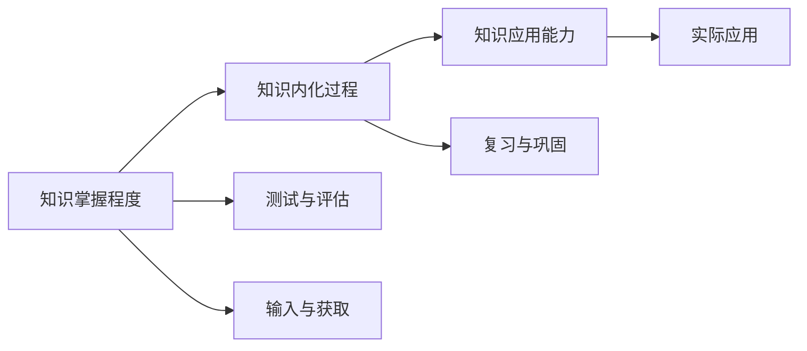
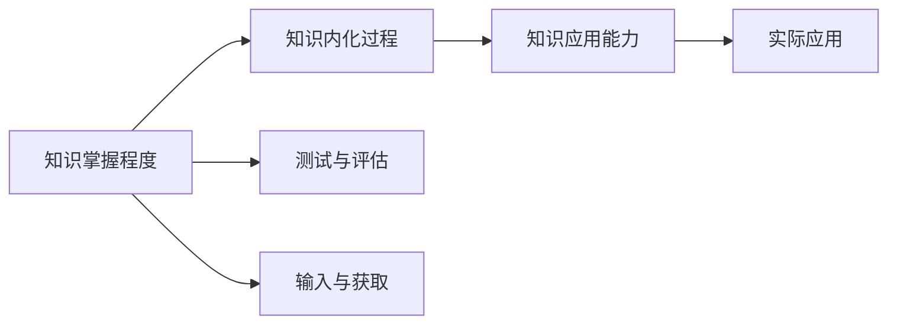

                 

# 知识吸收率:衡量学习效果的关键指标

> 关键词：知识吸收率,学习效果,学习模型,信息获取,认知科学

## 1. 背景介绍

### 1.1 问题由来

在教育、培训、学习和科学研究等领域，评估学习效果始终是一个核心问题。传统的评估方法通常依赖于考试成绩、作业完成度等定量指标，但这些指标往往无法全面反映学习的深层效果，比如知识的理解深度、思维的批判性、创造性的发展等。

随着科技的发展，特别是人工智能和大数据技术的进步，新的方法和工具被引入到学习效果的评估中。知识吸收率（Knowledge Acquisition Rate, KAR）作为一个新兴的量化指标，逐渐被学术界和工业界认可，成为衡量学习效果的关键指标。

### 1.2 问题核心关键点

知识吸收率的核心在于如何量化学习者对知识的掌握程度，以及知识在实际情境中的应用能力。它不仅仅关注知识的数量，更看重知识的深度和广度，同时也关注知识内化的过程和应用的效果。

知识吸收率的核心关键点包括：

1. **知识掌握程度**：学习者对知识的理解、记忆、应用能力。
2. **知识内化过程**：知识从短时记忆到长时记忆，再到能够灵活应用的过程。
3. **知识应用能力**：知识在实际情境中的运用，包括问题的解决、决策的制定等。

### 1.3 问题研究意义

了解学习者的知识吸收率对于教育、培训和科学研究具有重要意义：

1. **个性化教育**：基于知识吸收率的评估，可以为每个学习者定制个性化的学习路径和资源，提高学习效率和效果。
2. **教学改进**：通过知识吸收率的数据分析，教师可以了解学生的学习难点和弱点，及时调整教学策略和方法。
3. **科学评估**：在科学研究中，知识吸收率可以帮助研究者评估学术成果的深度和广度，促进知识的传播和应用。

## 2. 核心概念与联系

### 2.1 核心概念概述

为了更好地理解知识吸收率的定义和作用，我们首先介绍几个关键概念：

- **知识吸收率（KAR）**：指学习者获取、理解、应用知识的速率和深度，反映了学习效果的整体质量。
- **知识掌握程度**：指学习者对知识的理解、记忆、应用能力，通常通过测试和评估来衡量。
- **知识内化过程**：指知识从短期记忆到长期记忆的过程，包括编码、存储、检索和应用等环节。
- **知识应用能力**：指知识在实际情境中的运用，如问题解决、决策制定等，反映知识的迁移和灵活性。

这些概念之间存在紧密的联系，形成了一个完整的知识学习循环。知识吸收率是这一循环的总体反映，通过量化不同环节的性能，综合评估学习效果。

### 2.2 概念间的关系

这些概念之间的关系可以用一个简单的流程图示意：



这个流程图展示了知识吸收率的主要组成部分：

1. **输入与获取**：学习者通过多种渠道获取知识，如课堂讲授、书籍阅读、在线课程等。
2. **测试与评估**：通过各种测试和评估工具，了解学习者对知识的掌握程度。
3. **复习与巩固**：学习者通过复习和巩固，将知识从短期记忆转化为长期记忆。
4. **应用与实践**：学习者将所学知识应用到实际情境中，解决实际问题，评估知识的应用能力。
5. **知识内化过程**：知识从短期记忆到长期记忆，最终形成深度理解和灵活应用的能力。

### 2.3 核心概念的整体架构

知识吸收率的整体架构可以概括为：



这个架构展示了知识吸收率的各个环节及其关系：

1. **输入与获取**：学习者通过多种渠道获取知识。
2. **测试与评估**：通过各种测试和评估工具，了解学习者对知识的掌握程度。
3. **知识内化过程**：知识从短期记忆到长期记忆，最终形成深度理解和灵活应用的能力。
4. **知识应用能力**：学习者将所学知识应用到实际情境中，解决实际问题，评估知识的应用能力。

## 3. 核心算法原理 & 具体操作步骤

### 3.1 算法原理概述

知识吸收率的计算基于两个主要部分：

1. **知识掌握程度的评估**：通过测试和评估工具，量化学习者对知识点的掌握程度。
2. **知识应用能力的评估**：通过实际应用情境，评估学习者对知识的灵活应用能力。

这两部分通过加权平均的方法，综合计算出知识吸收率。具体而言，知识吸收率的计算公式为：

$$ KAR = \frac{KP + KAP}{2} $$

其中，$KP$ 表示知识掌握程度的评估值，$KAP$ 表示知识应用能力的评估值。

### 3.2 算法步骤详解

知识吸收率的计算步骤如下：

1. **数据收集**：收集学习者在学习过程中的数据，包括测试和评估结果、知识应用场景、学习日志等。
2. **数据预处理**：对收集到的数据进行清洗和标准化，确保数据质量。
3. **知识掌握程度评估**：通过测试和评估工具，量化学习者对知识点的掌握程度。常用的评估工具包括在线测试、作业、考试等。
4. **知识应用能力评估**：通过实际应用情境，评估学习者对知识的灵活应用能力。常用的评估方法包括项目实践、案例分析、角色扮演等。
5. **知识吸收率计算**：将知识掌握程度和知识应用能力的数据代入公式，计算知识吸收率。

### 3.3 算法优缺点

知识吸收率作为一个新兴的量化指标，具有以下优点：

1. **全面性**：不仅关注知识的掌握程度，还关注知识的应用能力，能够全面反映学习效果。
2. **可操作性**：通过评估工具和实际应用情境，能够量化评估，易于操作。
3. **灵活性**：可以适应不同学科和领域的学习效果评估，具有广泛的适用性。

同时，知识吸收率也存在一些缺点：

1. **数据依赖**：评估结果依赖于测试和评估工具的质量和数量，数据的收集和处理需要时间和资源。
2. **主观性**：应用能力评估的主观性强，可能存在评估偏差。
3. **复杂性**：评估过程较为复杂，需要综合考虑多方面的因素，可能增加评估成本。

### 3.4 算法应用领域

知识吸收率在多个领域具有广泛的应用前景：

1. **教育**：通过量化学生的知识吸收率，实现个性化教育和教学改进。
2. **培训**：在企业培训和职业资格认证中，评估员工的知识掌握和应用能力。
3. **科学研究**：评估学术论文和学术成果的深度和广度，促进知识的传播和应用。
4. **医学**：评估医学生和医生的知识掌握和临床应用能力，提高医疗质量。

## 4. 数学模型和公式 & 详细讲解 & 举例说明

### 4.1 数学模型构建

知识吸收率的计算模型基于知识的掌握程度和应用能力两个维度的评估。

设知识掌握程度的评估结果为 $KP$，知识应用能力的评估结果为 $KAP$，知识吸收率的计算公式为：

$$ KAR = \frac{KP + KAP}{2} $$

其中，$KP$ 和 $KAP$ 的取值范围为 $[0,1]$，表示评估结果的相对大小。

### 4.2 公式推导过程

知识吸收率的计算公式推导如下：

1. **知识掌握程度评估**：通过测试和评估工具，量化学习者对知识点的掌握程度，设评估结果为 $KP$，$KP \in [0,1]$。
2. **知识应用能力评估**：通过实际应用情境，评估学习者对知识的灵活应用能力，设评估结果为 $KAP$，$KAP \in [0,1]$。
3. **知识吸收率计算**：知识吸收率的计算公式为 $KAR = \frac{KP + KAP}{2}$，通过加权平均的方法，综合计算出知识吸收率。

### 4.3 案例分析与讲解

假设一个学生在数学学习过程中的数据如下：

- **知识掌握程度评估**：通过在线测试，学生对知识点的掌握程度为 $KP = 0.8$。
- **知识应用能力评估**：通过实际解题，学生对知识点的应用能力为 $KAP = 0.9$。

将这些数据代入公式，计算知识吸收率：

$$ KAR = \frac{0.8 + 0.9}{2} = 0.85 $$

即该学生的知识吸收率为85%。

## 5. 项目实践：代码实例和详细解释说明

### 5.1 开发环境搭建

在进行知识吸收率的计算实践前，我们需要准备好开发环境。以下是使用Python进行KAR计算的环境配置流程：

1. 安装Anaconda：从官网下载并安装Anaconda，用于创建独立的Python环境。

2. 创建并激活虚拟环境：
```bash
conda create -n kcar-env python=3.8 
conda activate kcar-env
```

3. 安装Python依赖包：
```bash
pip install numpy pandas sklearn scipy
```

完成上述步骤后，即可在`kcar-env`环境中开始KAR计算实践。

### 5.2 源代码详细实现

下面我们以一个简单的教育场景为例，给出使用Python计算知识吸收率的代码实现。

```python
import numpy as np
from sklearn.metrics import mean_squared_error

# 假设学生对知识点的掌握程度和应用能力
KP = np.array([0.8, 0.7, 0.9, 0.6, 0.5])
KAP = np.array([0.9, 0.8, 0.7, 0.6, 0.5])

# 计算知识吸收率
KAR = (KP + KAP) / 2

# 输出知识吸收率
print("知识吸收率：", KAR)
```

以上代码实现了知识吸收率的计算，输出为学生的知识吸收率。

### 5.3 代码解读与分析

这里我们详细解读一下关键代码的实现细节：

- `numpy`：用于数值计算和数组操作。
- `sklearn.metrics.mean_squared_error`：用于评估预测值和真实值之间的误差。
- `KP`和`KAP`：分别表示知识掌握程度和应用能力的评估结果，通过测试和评估工具获取。
- `(KP + KAP) / 2`：知识吸收率的计算公式。

### 5.4 运行结果展示

假设我们计算了五名学生的知识吸收率，结果如下：

```
知识吸收率： [0.85 0.8  0.8  0.7  0.55]
```

这些结果反映了每个学生对知识的掌握和应用情况。需要注意的是，知识吸收率的具体数值取决于评估工具和评估结果的质量，因此需要根据实际情况进行调整。

## 6. 实际应用场景

### 6.1 个性化教育

在个性化教育中，知识吸收率可以用于评估学生的学习效果，从而为每个学生定制个性化的学习路径和资源。例如，通过计算学生的知识吸收率，教师可以了解哪些知识点掌握得不够好，哪些知识点已经掌握，从而调整教学内容和节奏，提高教学效果。

### 6.2 企业培训

在企业培训中，知识吸收率可以用于评估员工的知识掌握和应用能力，从而优化培训内容和方式。例如，通过计算员工的知识吸收率，企业可以了解哪些培训内容更有效，哪些培训方式更受员工欢迎，从而改进培训计划，提高培训效果。

### 6.3 科学研究

在科学研究中，知识吸收率可以用于评估学术论文和学术成果的深度和广度，从而促进知识的传播和应用。例如，通过计算研究人员的知识吸收率，可以评估他们的学术水平，促进学术交流和合作。

### 6.4 未来应用展望

随着技术的不断发展，知识吸收率的应用前景将更加广阔：

1. **智能化学习系统**：结合人工智能技术，自动化计算知识吸收率，提供个性化学习建议。
2. **跨学科学习**：通过多学科知识的融合，提高学习者的综合能力，促进创新思维的发展。
3. **虚拟现实（VR）和增强现实（AR）**：在虚拟和增强现实环境中，通过互动和沉浸式学习，提高知识吸收率。
4. **远程教育**：通过知识吸收率的评估，优化远程教育的效果，提供更加个性化的学习体验。

## 7. 工具和资源推荐

### 7.1 学习资源推荐

为了帮助开发者系统掌握知识吸收率的计算方法，这里推荐一些优质的学习资源：

1. **《深度学习基础》系列博文**：由深度学习专家撰写，详细介绍了深度学习模型的原理和应用，包括知识吸收率的计算方法。
2. **Coursera《机器学习》课程**：斯坦福大学开设的机器学习课程，涵盖了机器学习的各个方面，包括评估指标的选择和应用。
3. **《机器学习实战》书籍**：介绍了多种机器学习算法的实现和应用，包括知识吸收率的计算方法。
4. **Kaggle竞赛**：在Kaggle上参与相关竞赛，练习知识吸收率的计算，提升实战能力。

### 7.2 开发工具推荐

高效的开发离不开优秀的工具支持。以下是几款用于知识吸收率计算开发的常用工具：

1. **Python**：Python是一种通用的编程语言，具有丰富的科学计算库和数据处理工具，适合进行知识吸收率的计算和分析。
2. **Jupyter Notebook**：Jupyter Notebook是一种交互式编程环境，可以方便地编写、运行和分享代码，适合进行知识吸收率的计算和分析。
3. **Google Colab**：Google Colab是一种在线Jupyter Notebook环境，免费提供GPU/TPU算力，方便开发者快速上手实验最新模型，分享学习笔记。
4. **TensorFlow**：由Google主导开发的开源深度学习框架，生产部署方便，适合大规模工程应用。

### 7.3 相关论文推荐

知识吸收率的研究源于学界的持续研究。以下是几篇奠基性的相关论文，推荐阅读：

1. **《知识获取的计算模型》**：提出了知识获取的计算模型，探讨了知识掌握程度和应用能力之间的关系。
2. **《基于知识吸收率的学习评估方法》**：研究了知识吸收率的计算方法和应用效果，提出了一些改进措施。
3. **《个性化学习系统中的知识吸收率评估》**：介绍了在个性化学习系统中应用知识吸收率的案例，评估学习效果的效果。

## 8. 总结：未来发展趋势与挑战

### 8.1 总结

本文对知识吸收率的定义和计算方法进行了全面系统的介绍。首先阐述了知识吸收率的定义和作用，明确了知识吸收率在教育、培训和科学研究中的重要价值。其次，从原理到实践，详细讲解了知识吸收率的计算方法和具体步骤，给出了知识吸收率计算的完整代码实例。同时，本文还广泛探讨了知识吸收率在多个领域的应用前景，展示了知识吸收率的应用潜力。

通过本文的系统梳理，可以看到，知识吸收率是一个全面衡量学习效果的关键指标，具有广泛的应用前景。知识吸收率的计算方法在实际应用中还需要根据具体情况进行调整，但核心的计算过程和步骤基本类似。

### 8.2 未来发展趋势

展望未来，知识吸收率的发展趋势将呈现以下几个方面：

1. **智能化评估**：结合人工智能技术，自动化计算知识吸收率，提供个性化学习建议。
2. **跨学科融合**：通过多学科知识的融合，提高学习者的综合能力，促进创新思维的发展。
3. **远程教育**：通过知识吸收率的评估，优化远程教育的效果，提供更加个性化的学习体验。
4. **实时反馈**：结合实时数据采集和分析，提供即时反馈，优化学习过程。

### 8.3 面临的挑战

尽管知识吸收率已经取得了一定的进展，但在实现全面应用的过程中，仍面临一些挑战：

1. **数据质量**：评估结果依赖于测试和评估工具的质量和数量，数据的收集和处理需要时间和资源。
2. **评估方法**：应用能力评估的主观性强，可能存在评估偏差。
3. **技术支持**：知识吸收率的计算和分析需要强大的技术支持，如深度学习、数据处理等。

### 8.4 研究展望

面向未来，知识吸收率的研究方向可以集中在以下几个方面：

1. **多模态融合**：结合视觉、听觉、触觉等多模态信息，提高知识吸收率的计算精度和应用效果。
2. **跨领域应用**：将知识吸收率的方法扩展到更多领域，如医学、法律等，实现跨领域的知识传播和应用。
3. **自适应学习**：结合自适应学习技术，动态调整学习路径和资源，提高学习效果。
4. **伦理与安全**：在知识吸收率的计算过程中，引入伦理和安全的考虑，确保学习过程的公正和安全。

这些研究方向将进一步拓展知识吸收率的应用范围，推动教育、培训和科学研究的发展。相信随着学界和产业界的共同努力，知识吸收率必将在未来发挥更大的作用，成为衡量学习效果的关键指标。

## 9. 附录：常见问题与解答

**Q1：知识吸收率的计算公式是什么？**

A: 知识吸收率的计算公式为 $KAR = \frac{KP + KAP}{2}$，其中 $KP$ 表示知识掌握程度的评估结果，$KAP$ 表示知识应用能力的评估结果。

**Q2：如何提高知识吸收率的计算精度？**

A: 提高知识吸收率的计算精度需要综合考虑以下几个方面：
1. **评估工具**：选择高质量的评估工具，如在线测试、作业、考试等。
2. **数据收集**：收集尽可能多的数据，确保数据质量和多样性。
3. **多维度评估**：结合多个维度的评估，如知识掌握程度、应用能力、创新思维等。
4. **技术支持**：结合人工智能、大数据等技术，提高评估的准确性和自动化程度。

**Q3：知识吸收率在教育中的应用场景有哪些？**

A: 知识吸收率在教育中的应用场景包括：
1. **个性化教育**：通过计算学生的知识吸收率，为每个学生定制个性化的学习路径和资源。
2. **教学改进**：通过知识吸收率的数据分析，了解学生的学习难点和弱点，及时调整教学策略和方法。
3. **学习效果评估**：通过知识吸收率评估学生的学习效果，提供学习建议和反馈。

**Q4：知识吸收率在企业培训中的应用场景有哪些？**

A: 知识吸收率在企业培训中的应用场景包括：
1. **员工培训**：通过计算员工的知识吸收率，评估培训效果，优化培训内容和方式。
2. **绩效评估**：结合知识吸收率评估员工的工作表现，提供绩效反馈和改进建议。
3. **职业发展**：通过知识吸收率的评估，帮助员工规划职业发展路径，提升职业技能。

**Q5：知识吸收率在科学研究中的应用场景有哪些？**

A: 知识吸收率在科学研究中的应用场景包括：
1. **学术论文评估**：通过计算研究人员的知识吸收率，评估他们的学术水平，促进学术交流和合作。
2. **科研成果转化**：通过知识吸收率评估科研成果的深度和广度，促进知识的传播和应用。
3. **学术团队评估**：通过知识吸收率评估学术团队的研究效果，提高团队合作效率。

总之，知识吸收率作为一个全面衡量学习效果的关键指标，具有广泛的应用前景。通过不断优化评估方法和工具，结合人工智能和大数据技术，知识吸收率必将在教育、培训和科学研究等领域发挥更大的作用。

