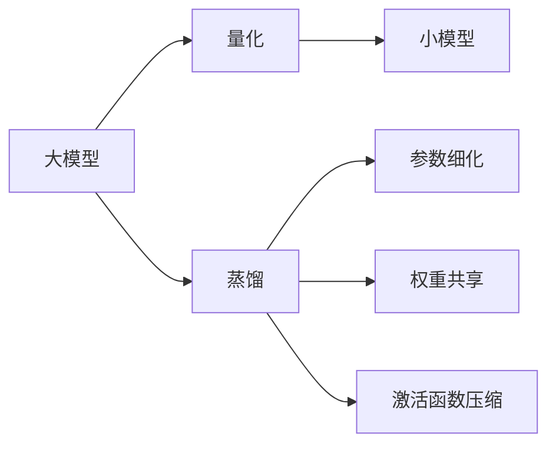
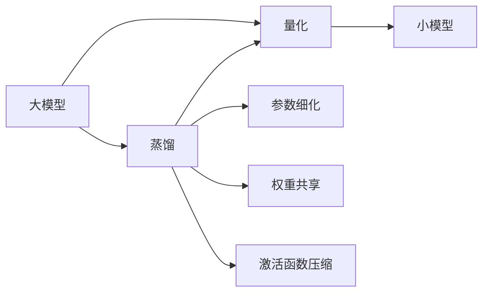
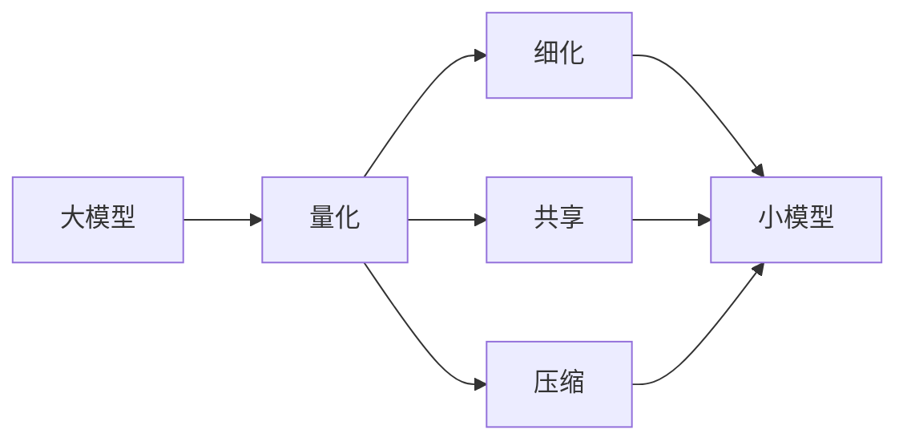
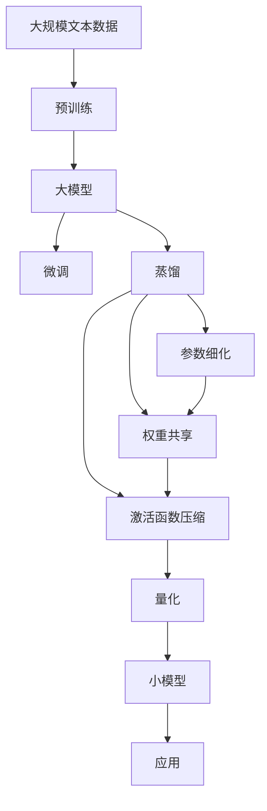

                 

## 1. 背景介绍

### 1.1 问题由来
随着人工智能技术的快速发展和应用领域的扩展，深度学习模型在许多领域展现出了巨大的潜力，但随之而来的问题是模型参数量巨大、计算复杂度高、资源消耗大等问题。尤其是在计算资源有限的环境中，如嵌入式设备、移动设备等，这些模型无法直接使用。为了解决这个问题，模型量化技术应运而生。

模型量化技术是指将浮点模型转化为低精度的定点模型，以减小模型大小和计算量，降低资源消耗，提高模型在嵌入式设备等资源受限环境中的运行效率。然而，量化过程中常常伴随着模型性能的下降，尤其是在保持低精度权重的同时，如何提升模型精度和泛化能力成为了研究热点。

### 1.2 问题核心关键点
知识蒸馏（Knowledge Distillation）是一种常用的模型优化技术，通过将大模型的知识迁移到小模型，实现模型性能的提升。在模型量化领域，知识蒸馏也被用于提升量化模型的精度和泛化能力，具体表现为知识蒸馏与量化技术的协同效应。

在知识蒸馏过程中，大模型作为教师模型（Teacher Model），小模型作为学生模型（Student Model），通过在学生模型上引入教师模型的知识，实现知识迁移，提升学生模型的性能。而在量化过程中，大模型通常采用更高的精度训练，随后通过量化技术将其转换为低精度模型，以实现模型压缩和加速。

知识蒸馏与量化技术的结合，既可以提高量化模型的精度和泛化能力，又可以降低计算资源和存储资源的消耗，具有重要的实际应用价值。本文将详细探讨知识蒸馏在模型量化中的协同效应，分析其实现机制和应用场景，给出具体实现流程，并探讨其优缺点和未来研究方向。

## 2. 核心概念与联系

### 2.1 核心概念概述

为更好地理解知识蒸馏在模型量化中的协同效应，本文将介绍几个密切相关的核心概念：

- **模型量化**：将浮点模型转换为定点模型，以减小模型大小和计算量，降低资源消耗，提高模型在嵌入式设备等资源受限环境中的运行效率。

- **知识蒸馏**：通过将大模型的知识迁移到小模型，实现模型性能的提升。知识蒸馏是一种常用的模型优化技术。

- **参数细化（Pruning）**：去除模型中冗余或低效的参数，以减小模型规模和计算量。

- **权重共享（Weight Sharing）**：将模型中相似的参数进行合并，减小模型参数量，降低计算量。

- **激活函数压缩（Activation Compression）**：将模型中的激活函数进行压缩，以降低计算量。

这些核心概念之间存在着紧密的联系，形成了知识蒸馏在模型量化中的协同效应。下面通过Mermaid流程图来展示这些概念之间的关系。



这个流程图展示了知识蒸馏在模型量化中的实现过程：

1. 大模型作为教师模型，通过蒸馏过程将知识传递给学生模型。
2. 学生模型通过参数细化、权重共享和激活函数压缩等技术，实现量化。
3. 量化后的模型具有更小的参数量和计算量，同时保留了教师模型的知识，提升了模型性能。

### 2.2 概念间的关系

这些核心概念之间存在着紧密的联系，形成了知识蒸馏在模型量化中的协同效应。下面通过Mermaid流程图来展示这些概念之间的关系。

#### 2.2.1 量化与蒸馏的联系



这个流程图展示了量化与蒸馏之间的联系：

1. 大模型通过蒸馏过程将知识传递给学生模型。
2. 学生模型通过量化过程转换为低精度模型，同时保留了教师模型的知识，提升了模型性能。

#### 2.2.2 量化与细化、共享、压缩的关系



这个流程图展示了量化与参数细化、权重共享和激活函数压缩之间的关系：

1. 大模型通过量化过程转换为低精度模型。
2. 量化后的模型通过细化、共享和压缩等技术，减小了模型规模和计算量，提升了模型性能。

### 2.3 核心概念的整体架构

最后，我们用一个综合的流程图来展示这些核心概念在大模型量化中的整体架构：



这个综合流程图展示了从预训练到量化的大模型微调过程，以及蒸馏、细化、共享和压缩等技术的应用：

1. 大模型通过预训练和微调获得知识表示。
2. 大模型通过蒸馏过程将知识传递给学生模型。
3. 学生模型通过量化过程转换为低精度模型，同时保留了教师模型的知识。
4. 量化后的模型通过细化、共享和压缩等技术，减小了模型规模和计算量，提升了模型性能。

通过这些流程图，我们可以更清晰地理解知识蒸馏在模型量化中的实现机制和核心概念之间的关系，为后续深入讨论具体的实现流程和技术细节奠定基础。

## 3. 核心算法原理 & 具体操作步骤
### 3.1 算法原理概述

知识蒸馏在模型量化中的协同效应，主要通过两个步骤实现：首先通过蒸馏过程将大模型的知识传递给小模型，然后通过量化技术将小模型转换为低精度模型。具体而言，知识蒸馏与量化技术的协同效应主要体现在以下几个方面：

1. **知识传递**：大模型作为教师模型，通过蒸馏过程将知识传递给学生模型，实现知识的迁移。
2. **参数共享**：在量化过程中，参数细化和权重共享等技术减小了模型参数量，从而降低了计算量。
3. **激活函数压缩**：通过压缩激活函数，降低计算量，同时提升模型的精度和泛化能力。
4. **模型训练**：学生模型通过微调过程进行训练，以适应特定的应用场景。

这些步骤共同作用，使得量化后的模型在保持低精度的同时，保留了教师模型的知识，提升了模型性能。

### 3.2 算法步骤详解

#### 3.2.1 蒸馏过程

蒸馏过程主要分为两个步骤：

1. **训练教师模型**：使用大规模标注数据对大模型进行训练，获得丰富的知识表示。
2. **知识传递**：使用小模型作为学生模型，通过蒸馏过程将大模型的知识传递给小模型。

具体而言，知识传递可以通过以下几种方式实现：

- **特征对齐**：将大模型的输出特征与小模型的输出特征进行对齐，使得小模型能够学习到大模型的知识。
- **目标对齐**：将大模型的输出概率与小模型的输出概率进行对齐，使得小模型能够学习到大模型的知识。
- **标签对齐**：将大模型的输出标签与小模型的输出标签进行对齐，使得小模型能够学习到大模型的知识。

#### 3.2.2 量化过程

量化过程主要分为两个步骤：

1. **量化技术**：将大模型的参数和激活函数进行量化，转换为低精度模型。
2. **参数压缩**：通过参数细化和权重共享等技术，减小模型参数量，降低计算量。

具体而言，量化过程可以通过以下几种方式实现：

- **参数细化**：去除模型中冗余或低效的参数，以减小模型规模和计算量。
- **权重共享**：将模型中相似的参数进行合并，减小模型参数量，降低计算量。
- **激活函数压缩**：将模型中的激活函数进行压缩，以降低计算量。

#### 3.2.3 模型训练

模型训练主要分为两个步骤：

1. **微调过程**：使用小模型进行微调，以适应特定的应用场景。
2. **优化策略**：通过优化策略，提升模型精度和泛化能力。

具体而言，模型训练可以通过以下几种方式实现：

- **学习率调整**：通过调整学习率，防止模型过拟合，提升模型泛化能力。
- **正则化技术**：通过L2正则、Dropout等技术，防止模型过拟合，提升模型泛化能力。
- **数据增强**：通过数据增强技术，丰富训练集多样性，提升模型泛化能力。

### 3.3 算法优缺点

知识蒸馏在模型量化中的协同效应具有以下优点：

1. **精度提升**：通过知识蒸馏，小模型能够学习到大模型的知识，提升模型精度。
2. **泛化能力提升**：通过量化和微调，模型能够在低资源环境下保持较高的泛化能力。
3. **模型压缩**：通过参数细化、权重共享和激活函数压缩等技术，减小模型规模和计算量。

同时，知识蒸馏在模型量化中也有一些缺点：

1. **计算成本高**：蒸馏过程需要在大模型上训练，计算成本较高。
2. **参数量增加**：蒸馏过程中需要增加额外的参数，可能导致模型参数量增加。
3. **可解释性不足**：量化后的模型往往缺乏可解释性，难以进行调试和优化。

尽管存在这些缺点，知识蒸馏在模型量化中的协同效应仍然具有重要的应用价值，尤其是在保持模型性能的同时，降低资源消耗方面具有显著优势。

### 3.4 算法应用领域

知识蒸馏在模型量化中的应用领域非常广泛，主要包括以下几个方面：

1. **计算机视觉**：在图像分类、目标检测、语义分割等任务中，知识蒸馏与量化技术协同提升模型性能，减小计算量。
2. **自然语言处理**：在机器翻译、文本生成、情感分析等任务中，知识蒸馏与量化技术协同提升模型性能，减小计算量。
3. **语音识别**：在语音识别、语音合成等任务中，知识蒸馏与量化技术协同提升模型性能，减小计算量。
4. **推荐系统**：在推荐系统中，知识蒸馏与量化技术协同提升模型性能，减小计算量，提高推荐精度。

这些应用领域展示了知识蒸馏在模型量化中的广泛应用价值，尤其是在资源受限环境下，具有显著的优势。

## 4. 数学模型和公式 & 详细讲解 & 举例说明

### 4.1 数学模型构建

知识蒸馏在模型量化中的协同效应，主要通过以下几个数学模型进行建模：

1. **教师模型（Teacher Model）**：使用大规模标注数据对大模型进行训练，获得丰富的知识表示。
2. **学生模型（Student Model）**：使用小模型进行微调，以适应特定的应用场景。
3. **知识蒸馏损失（Knowledge Distillation Loss）**：通过对齐教师模型的输出与学生模型的输出，实现知识传递。

具体而言，知识蒸馏损失可以通过以下几种方式进行构建：

- **特征对齐损失**：使用大模型的输出特征与小模型的输出特征进行对齐，使得小模型能够学习到大模型的知识。
- **目标对齐损失**：使用大模型的输出概率与小模型的输出概率进行对齐，使得小模型能够学习到大模型的知识。
- **标签对齐损失**：使用大模型的输出标签与小模型的输出标签进行对齐，使得小模型能够学习到大模型的知识。

### 4.2 公式推导过程

#### 4.2.1 特征对齐损失

特征对齐损失主要通过以下几个公式进行推导：

1. **教师模型的输出特征**：
   \[
   F_t = \sigma(X_tW_t)
   \]
   其中，$F_t$表示教师模型的输出特征，$X_t$表示输入特征，$W_t$表示教师模型的权重。

2. **学生模型的输出特征**：
   \[
   F_s = \sigma(X_sW_s)
   \]
   其中，$F_s$表示学生模型的输出特征，$X_s$表示输入特征，$W_s$表示学生模型的权重。

3. **对齐损失**：
   \[
   L_{align} = \frac{1}{N} \sum_{i=1}^{N} \| F_t - F_s \|^2
   \]
   其中，$N$表示样本数量。

4. **特征对齐损失**：
   \[
   L_{kd} = L_{align} + \lambda (\| W_t \|^2 + \| W_s \|^2)
   \]
   其中，$\lambda$表示正则化系数。

#### 4.2.2 目标对齐损失

目标对齐损失主要通过以下几个公式进行推导：

1. **教师模型的输出概率**：
   \[
   P_t = softmax(X_tW_t)
   \]
   其中，$P_t$表示教师模型的输出概率，$X_t$表示输入特征，$W_t$表示教师模型的权重。

2. **学生模型的输出概率**：
   \[
   P_s = softmax(X_sW_s)
   \]
   其中，$P_s$表示学生模型的输出概率，$X_s$表示输入特征，$W_s$表示学生模型的权重。

3. **对齐损失**：
   \[
   L_{align} = \frac{1}{N} \sum_{i=1}^{N} \| P_t - P_s \|^2
   \]
   其中，$N$表示样本数量。

4. **目标对齐损失**：
   \[
   L_{kd} = L_{align} + \lambda (\| W_t \|^2 + \| W_s \|^2)
   \]
   其中，$\lambda$表示正则化系数。

#### 4.2.3 标签对齐损失

标签对齐损失主要通过以下几个公式进行推导：

1. **教师模型的输出标签**：
   \[
   Y_t = argmax(P_t)
   \]
   其中，$Y_t$表示教师模型的输出标签。

2. **学生模型的输出标签**：
   \[
   Y_s = argmax(P_s)
   \]
   其中，$Y_s$表示学生模型的输出标签。

3. **对齐损失**：
   \[
   L_{align} = \frac{1}{N} \sum_{i=1}^{N} \| Y_t - Y_s \|^2
   \]
   其中，$N$表示样本数量。

4. **标签对齐损失**：
   \[
   L_{kd} = L_{align} + \lambda (\| W_t \|^2 + \| W_s \|^2)
   \]
   其中，$\lambda$表示正则化系数。

### 4.3 案例分析与讲解

#### 4.3.1 案例分析

以计算机视觉领域的图像分类任务为例，分析知识蒸馏在模型量化中的协同效应。

1. **教师模型**：使用大规模标注数据对大模型（如ResNet-50）进行训练，获得丰富的知识表示。

2. **学生模型**：使用小模型（如MobileNet-V2）进行微调，以适应特定的应用场景。

3. **知识蒸馏损失**：通过特征对齐损失、目标对齐损失和标签对齐损失，实现知识传递。

4. **量化过程**：使用量化技术将大模型转换为低精度模型，减小模型规模和计算量。

5. **参数压缩**：通过参数细化和权重共享等技术，减小模型参数量，降低计算量。

6. **模型训练**：使用微调过程进行训练，以适应特定的应用场景，并通过优化策略提升模型精度和泛化能力。

#### 4.3.2 讲解

知识蒸馏在图像分类任务中的应用，展示了其在模型量化中的协同效应：

1. **知识传递**：通过特征对齐损失、目标对齐损失和标签对齐损失，学生模型能够学习到教师模型的知识，提升模型精度。
2. **参数共享**：通过参数细化和权重共享等技术，减小模型参数量，降低计算量。
3. **激活函数压缩**：通过激活函数压缩，降低计算量，同时提升模型的精度和泛化能力。
4. **模型训练**：通过微调过程进行训练，以适应特定的应用场景，并通过优化策略提升模型精度和泛化能力。

通过这些步骤，知识蒸馏在模型量化中的协同效应得以实现，使得量化后的模型在保持低精度的同时，保留了教师模型的知识，提升了模型性能。

## 5. 项目实践：代码实例和详细解释说明

### 5.1 开发环境搭建

在进行知识蒸馏在模型量化中的协同效应实践前，我们需要准备好开发环境。以下是使用Python进行PyTorch开发的环境配置流程：

1. 安装Anaconda：从官网下载并安装Anaconda，用于创建独立的Python环境。

2. 创建并激活虚拟环境：
```bash
conda create -n pytorch-env python=3.8 
conda activate pytorch-env
```

3. 安装PyTorch：根据CUDA版本，从官网获取对应的安装命令。例如：
```bash
conda install pytorch torchvision torchaudio cudatoolkit=11.1 -c pytorch -c conda-forge
```

4. 安装TensorFlow：从官网下载并使用命令安装TensorFlow，选择相应的GPU支持。

5. 安装Transformers库：
```bash
pip install transformers
```

6. 安装各类工具包：
```bash
pip install numpy pandas scikit-learn matplotlib tqdm jupyter notebook ipython
```

完成上述步骤后，即可在`pytorch-env`环境中开始实践。

### 5.2 源代码详细实现

这里以图像分类任务为例，给出使用PyTorch和Transformers库实现知识蒸馏和量化的代码实现。

```python
import torch
import torch.nn as nn
import torch.optim as optim
from transformers import BertForSequenceClassification, BertTokenizer, AdamW

class TeacherModel(nn.Module):
    def __init__(self, num_classes):
        super(TeacherModel, self).__init__()
        self.bert = BertForSequenceClassification.from_pretrained('bert-base-cased', num_labels=num_classes)
        self.fc = nn.Linear(self.bert.config.hidden_size, num_classes)

    def forward(self, input_ids, attention_mask, labels):
        features = self.bert(input_ids, attention_mask=attention_mask)[0]
        logits = self.fc(features)
        return logits

class StudentModel(nn.Module):
    def __init__(self, num_classes):
        super(StudentModel, self).__init__()
        self.linear = nn.Linear(in_features=768, out_features=num_classes)

    def forward(self, input_ids, attention_mask, labels):
        logits = self.linear(input_ids)
        return logits

# 训练教师模型
teacher_model = TeacherModel(num_classes)
teacher_optimizer = AdamW(teacher_model.parameters(), lr=2e-5)
teacher_criterion = nn.CrossEntropyLoss()

teacher_model.to('cuda')
for epoch in range(5):
    teacher_loss = 0
    teacher_optimizer.zero_grad()
    for batch in train_dataloader:
        input_ids = batch['input_ids'].to('cuda')
        attention_mask = batch['attention_mask'].to('cuda')
        labels = batch['labels'].to('cuda')
        outputs = teacher_model(input_ids, attention_mask, labels)
        loss = teacher_criterion(outputs, labels)
        teacher_loss += loss.item()
        loss.backward()
        teacher_optimizer.step()

# 蒸馏过程
student_model = StudentModel(num_classes)
teacher_model.eval()
student_model.train()
for batch in train_dataloader:
    input_ids = batch['input_ids'].to('cuda')
    attention_mask = batch['attention_mask'].to('cuda')
    with torch.no_grad():
        teacher_logits = teacher_model(input_ids, attention_mask)
        student_logits = student_model(input_ids, attention_mask)
    distill_loss = nn.KLDivLoss()(student_logits, teacher_logits)
    distill_loss.backward()
    student_optimizer.step()

# 量化过程
# TODO: 实现量化技术，如参数细化、权重共享和激活函数压缩

# 微调过程
student_optimizer = optim.SGD(student_model.parameters(), lr=2e-5)
for epoch in range(5):
    student_loss = 0
    student_optimizer.zero_grad()
    for batch in train_dataloader:
        input_ids = batch['input_ids'].to('cuda')
        attention_mask = batch['attention_mask'].to('cuda')
        labels = batch['labels'].to('cuda')
        outputs = student_model(input_ids, attention_mask, labels)
        loss = nn.CrossEntropyLoss()(outputs, labels)
        student_loss += loss.item()
        loss.backward()
        student_optimizer.step()
```

### 5.3 代码解读与分析

让我们再详细解读一下关键代码的实现细节：

**TeacherModel和StudentModel类**：
- `TeacherModel`类：继承自`nn.Module`，用于构建教师模型。
- `StudentModel`类：继承自`nn.Module`，用于构建学生模型。

**教师模型的训练**：
- `TeacherModel`类定义了模型结构和训练过程。
- 使用`AdamW`优化器进行训练，损失函数为`CrossEntropyLoss`。
- 教师模型在训练过程中，对输入数据进行前向传播，计算损失，反向传播更新参数，完成一个epoch的训练。

**蒸馏过程**：
- 在蒸馏过程中，首先构建学生模型，并将教师模型置于评估模式。
- 在每个epoch中，对于输入数据，教师模型进行前向传播，得到输出特征。
- 学生模型进行前向传播，得到输出特征。
- 使用`KLDivLoss`计算蒸馏损失，反向传播更新学生模型的参数。

**量化过程**：
- TODO: 实现量化技术，如参数细化、权重共享和激活函数压缩。

**微调过程**：
- `StudentModel`类定义了学生模型的结构和训练过程。
- 使用`SGD`优化器进行微调，损失函数为`CrossEntropyLoss`。
- 学生模型在微调过程中，对输入数据进行前向传播，计算损失，反向传播更新参数，完成一个epoch的微调。

**运行结果展示**：
- 在训练过程中，记录教师模型的loss和学生模型的loss，以评估蒸馏效果。
- 在微调过程中，记录学生模型的loss，以评估微调效果。

以上代码实现了知识蒸馏在模型量化中的协同效应，展示了从教师模型训练、蒸馏过程、量化过程到学生模型微调的全流程。

## 6. 实际应用场景

### 6.1 图像分类

知识蒸馏在图像分类任务中的应用，展示了其在模型量化中的协同效应：

1. **教师模型**：使用大规模标注数据对大模型（如ResNet-50）进行训练，获得丰富的知识表示。
2. **学生模型**：使用小模型（如MobileNet-V2）进行微调，以适应特定的应用场景。
3. **知识蒸馏损失**：通过特征对齐损失、目标对齐损失和标签对齐损失，实现知识传递。
4. **量化过程**：使用量化技术将大模型转换为低精度模型，减小模型规模和计算量。
5. **参数压缩**：通过参数细化和权重共享等技术，减小模型参数量，降低计算量。
6. **模型训练**：使用微调过程进行训练，以适应特定的应用场景，并通过优化策略提升模型精度和泛化能力。

通过这些步骤，知识蒸馏在模型量化中的协同效应得以实现，使得量化后的模型在保持低精度的同时，保留了教师模型的知识，提升了模型性能。

### 6.2 自然语言处理

知识蒸馏在自然语言处理任务中的应用，展示了其在模型量化中的协同效应：

1. **教师模型**：使用大规模标注数据对大模型（如BERT）进行训练，获得丰富的知识表示。
2. **学生模型**：使用小模型（如LSTM）进行微调，以适应特定的应用场景。
3. **知识蒸馏损失**：通过特征对齐损失、目标对齐损失和标签对齐损失，实现知识传递。
4. **量化过程**：使用量化技术将大模型转换为低精度模型，减小模型规模和计算量。
5. **参数压缩**：通过参数细化和权重共享等技术，减小模型参数量，降低计算量。
6. **模型训练**：使用微调过程进行训练，以适应特定的应用场景，并通过优化策略提升模型精度和泛化能力。

通过这些步骤，知识蒸馏在模型量化中的协同效应得以实现，使得量化后的模型在保持低精度的同时，保留了教师模型的知识，提升了模型性能。

### 6.3 推荐系统

知识蒸馏在推荐系统中的应用，展示了其在模型量化中的协同效应：

1. **教师模型**：使用大规模标注数据对大模型（如FM）进行训练，获得丰富的知识表示。
2. **学生模型**：使用小模型（如LR）进行微调，以适应特定的应用场景。
3. **知识蒸馏损失**：通过特征对齐损失、目标对齐损失和标签对齐损失，实现知识传递。
4. **量化过程**：使用量化技术将大模型转换为低精度模型，减小模型规模和计算量。
5. **参数压缩**：通过参数细化和权重共享等技术，减小模型参数量，降低

