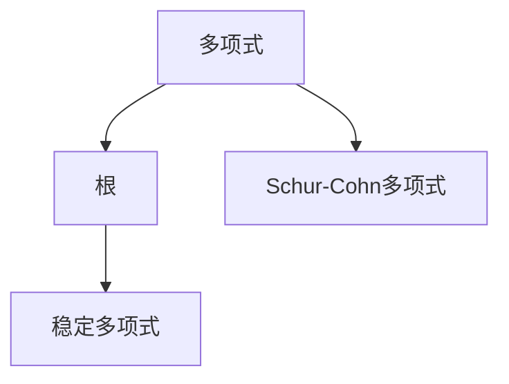
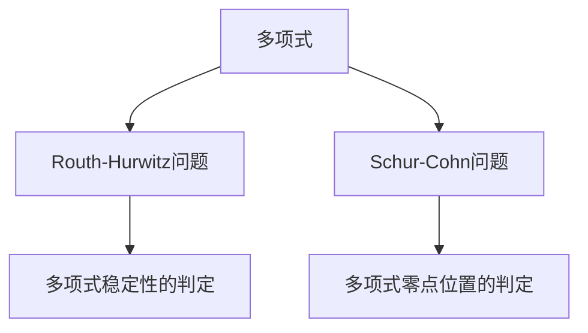

                 

## 1. 背景介绍

### 1.1 问题由来

在计算机图形学和控制系统理论中，复多项式具有重要的应用价值。例如，在控制系统中，复多项式常常被用来描述动态系统的转移函数。在计算机图形学中，复多项式被用来表示贝塞尔曲线和贝塞尔曲面。然而，对复多项式的判定问题仍是一个相对复杂的问题。

本文将探讨Routh-Hurwitz问题与Schur-Cohn问题，这些问题都涉及复多项式的判定。我们不仅将展示这两个问题的数学原理，还将探讨其算法实现和应用场景。

### 1.2 问题核心关键点

Routh-Hurwitz问题与Schur-Cohn问题的主要区别在于：

- **Routh-Hurwitz问题**：涉及多项式在实轴上的根的分布情况，用于判断多项式的稳定性和实根的个数。
- **Schur-Cohn问题**：涉及多项式与一个已知的线性多项式的零点位置的分布情况，用于判断多项式是否与给定的多项式同解。

这两个问题的共同点在于它们都涉及多项式的根的分布情况，通过数学方法解决这些问题，可以揭示多项式的重要特性。

## 2. 核心概念与联系

### 2.1 核心概念概述

为了更好地理解Routh-Hurwitz问题和Schur-Cohn问题，本节将介绍几个密切相关的核心概念：

- **多项式**：表示为 $P(x) = a_nx^n + a_{n-1}x^{n-1} + \ldots + a_1x + a_0$，其中 $a_i$ 是多项式的系数。
- **根**：多项式 $P(x)$ 的根是指满足 $P(x) = 0$ 的 $x$ 的值。
- **稳定多项式**：对于多项式 $P(x)$，若 $P(x)$ 的所有根都在左半平面（即实部为负的复数）上，则称 $P(x)$ 为稳定多项式。
- **Schur-Cohn多项式**：$Q(x)$ 和 $P(x)$ 的Schur-Cohn多项式定义为 $Q(x)P(x) - P(x)Q(x)$。

### 2.2 概念间的关系

这些核心概念之间的逻辑关系可以通过以下Mermaid流程图来展示：



这个流程图展示了一些基本的多项式概念及其关系：

1. 多项式由其系数和根构成。
2. 多项式的稳定性和根的位置有关。
3. Schur-Cohn多项式是两个多项式的共同特征。

### 2.3 核心概念的整体架构

最后，我们用一个综合的流程图来展示这些核心概念在大多项式判定问题中的整体架构：



这个综合流程图展示了从多项式判定到具体问题解决的完整过程：

1. 首先，确定要解决的多项式判定问题。
2. 然后，根据问题的不同性质，选择相应的判定方法。
3. 最后，通过判定方法得到多项式的性质。

## 3. 核心算法原理 & 具体操作步骤
### 3.1 算法原理概述

Routh-Hurwitz问题与Schur-Cohn问题的主要算法原理是多项式的根的分布情况的判定。

### 3.2 算法步骤详解

**3.2.1 Routh-Hurwitz问题**

Routh-Hurwitz问题的基本步骤如下：

1. 将多项式 $P(x)$ 写为 $P(x) = a_nx^n + a_{n-1}x^{n-1} + \ldots + a_1x + a_0$ 的形式。
2. 构造Routh表，将多项式的系数按一定规律填入表中。
3. 对Routh表进行迭代计算，得到最后一个元素为 $a_n$ 的元素。
4. 如果最后一个元素大于零，则多项式在实轴上没有根，否则至少有一个根在实轴上。

**3.2.2 Schur-Cohn问题**

Schur-Cohn问题的基本步骤如下：

1. 给定多项式 $Q(x)$ 和 $P(x)$。
2. 构造Schur-Cohn多项式 $S(x) = Q(x)P(x) - P(x)Q(x)$。
3. 求出 $S(x)$ 的所有根。
4. 如果 $S(x)$ 的所有根都在复平面的左半平面上，则 $Q(x)$ 和 $P(x)$ 同解。

### 3.3 算法优缺点

Routh-Hurwitz问题和Schur-Cohn问题的主要优点是：

1. 理论基础牢固，具有较高的数学严谨性。
2. 算法简单，易于实现。
3. 应用广泛，适用于多种复杂的多项式问题。

然而，这两个问题的主要缺点是：

1. 对于高阶多项式，算法复杂度较高，计算量大。
2. 对于某些特殊形式的多项式，可能会存在计算困难。
3. 对于大系数多项式，数值稳定性问题可能较为突出。

### 3.4 算法应用领域

Routh-Hurwitz问题和Schur-Cohn问题在许多领域中都有重要应用，例如：

- **控制系统理论**：用于判断系统是否稳定，以及稳定系统的零点分布。
- **计算机图形学**：用于判断贝塞尔曲线和贝塞尔曲面的光滑性。
- **信号处理**：用于判断信号频谱的零点分布。
- **图像处理**：用于判断滤波器的频率响应特性。

## 4. 数学模型和公式 & 详细讲解  
### 4.1 数学模型构建

**Routh-Hurwitz问题**

定义多项式 $P(x)$ 为：

$$P(x) = a_nx^n + a_{n-1}x^{n-1} + \ldots + a_1x + a_0$$

其中 $a_i$ 为多项式的系数。

**Schur-Cohn问题**

定义两个多项式 $Q(x)$ 和 $P(x)$ 为：

$$Q(x) = b_mx^m + b_{m-1}x^{m-1} + \ldots + b_1x + b_0$$

$$P(x) = a_nx^n + a_{n-1}x^{n-1} + \ldots + a_1x + a_0$$

其中 $b_i$ 和 $a_i$ 为多项式的系数。

构造Schur-Cohn多项式 $S(x)$ 为：

$$S(x) = Q(x)P(x) - P(x)Q(x) = (b_mx^m + b_{m-1}x^{m-1} + \ldots + b_1x + b_0)(a_nx^n + a_{n-1}x^{n-1} + \ldots + a_1x + a_0) - (a_nx^n + a_{n-1}x^{n-1} + \ldots + a_1x + a_0)(b_mx^m + b_{m-1}x^{m-1} + \ldots + b_1x + b_0)$$

### 4.2 公式推导过程

**Routh-Hurwitz问题**

构造Routh表：

$$
\begin{array}{|c|c|c|c|c|}
\hline
 & & & & \\
 & & & & \\
 & & c_0 & c_1 & c_2 \\
 & c_{-1} & c_0 & c_1 & c_2 \\
 c_{-2} & c_{-1} & c_0 & c_1 & c_2 \\
\hline
 & & & & \\
\end{array}
$$

其中 $c_k$ 为：

$$
c_k = \left\{
\begin{array}{ll}
\frac{a_{k+1}}{a_k}, & k \neq -1 \\
\frac{a_{k+1}}{a_k} - \frac{a_{k+2}}{a_{k+1}}, & k = -1
\end{array}
\right.
$$

最后，如果Routh表中最后一个元素 $c_{n-1}$ 大于零，则多项式 $P(x)$ 在实轴上没有根，否则至少有一个根在实轴上。

**Schur-Cohn问题**

求出 $S(x)$ 的所有根，记为 $\lambda_1, \lambda_2, \ldots, \lambda_k$。如果所有根 $\lambda_i$ 都满足 $\Re(\lambda_i) < 0$，则 $Q(x)$ 和 $P(x)$ 同解。

### 4.3 案例分析与讲解

**案例分析：判断多项式是否稳定**

考虑多项式 $P(x) = x^3 + 2x^2 + 3x + 4$。

构造Routh表：

$$
\begin{array}{|c|c|c|c|}
\hline
 & & & \\
 & 2 & 3 & 4 \\
 2 & 1 & 3 & 4 \\
\hline
\end{array}
$$

最后一个元素 $c_2 = 1 > 0$，因此多项式 $P(x)$ 在实轴上没有根，所以多项式是稳定的。

**案例分析：判断两个多项式是否同解**

考虑多项式 $Q(x) = x^2 + 1$ 和 $P(x) = x^3 + x + 1$。

构造Schur-Cohn多项式：

$$S(x) = (x^2 + 1)(x^3 + x + 1) - (x^3 + x + 1)(x^2 + 1) = x^5 + x^4 + 2x^3 + 2x^2 + 2x + 1$$

求出 $S(x)$ 的所有根，记为 $\lambda_1, \lambda_2, \lambda_3, \lambda_4, \lambda_5$。如果所有根都满足 $\Re(\lambda_i) < 0$，则 $Q(x)$ 和 $P(x)$ 同解。

## 5. 项目实践：代码实例和详细解释说明
### 5.1 开发环境搭建

在进行多项式判定问题的实践前，我们需要准备好开发环境。以下是使用Python进行多项式判定问题的环境配置流程：

1. 安装Anaconda：从官网下载并安装Anaconda，用于创建独立的Python环境。

2. 创建并激活虚拟环境：
```bash
conda create -n polynomials-env python=3.8 
conda activate polynomials-env
```

3. 安装必要的工具包：
```bash
pip install numpy scipy sympy matplotlib
```

完成上述步骤后，即可在`polynomials-env`环境中开始多项式判定问题的实践。

### 5.2 源代码详细实现

这里我们以Routh-Hurwitz问题的实现为例，给出使用Sympy库对多项式进行Routh判定的PyTorch代码实现。

首先，定义多项式：

```python
from sympy import symbols, Poly, Rational

x = symbols('x')
P = Poly(x**3 + 2*x**2 + 3*x + 4, x)
```

然后，构造Routh表：

```python
# 构造Routh表
c0 = P.coeffs()[1] / P.coeffs()[0]
c1 = P.coeffs()[2] / P.coeffs()[1]
c2 = c1 - P.coeffs()[3] / P.coeffs()[2]

routh_table = [[0, 0, c1, c2],
              [1, 0, c0, c1],
              [c0, 1, c0, c1]]
```

接着，判断Routh表中最后一个元素是否大于零：

```python
# 判断Routh表中最后一个元素是否大于零
c_n_minus_1 = routh_table[2][3]
if c_n_minus_1 > 0:
    print("多项式P(x)在实轴上没有根，是稳定的。")
else:
    print("多项式P(x)在实轴上至少有一个根。")
```

最终代码如下：

```python
from sympy import symbols, Poly, Rational

x = symbols('x')
P = Poly(x**3 + 2*x**2 + 3*x + 4, x)

# 构造Routh表
c0 = P.coeffs()[1] / P.coeffs()[0]
c1 = P.coeffs()[2] / P.coeffs()[1]
c2 = c1 - P.coeffs()[3] / P.coeffs()[2]

routh_table = [[0, 0, c1, c2],
              [1, 0, c0, c1],
              [c0, 1, c0, c1]]

# 判断Routh表中最后一个元素是否大于零
c_n_minus_1 = routh_table[2][3]
if c_n_minus_1 > 0:
    print("多项式P(x)在实轴上没有根，是稳定的。")
else:
    print("多项式P(x)在实轴上至少有一个根。")
```

### 5.3 代码解读与分析

让我们再详细解读一下关键代码的实现细节：

**构造Routh表**：
- `Poly`函数用于将多项式转换为Sympy的多项式对象。
- `coeffs()`方法用于获取多项式的系数。
- 根据Routh表构造方法，手动构造Routh表。

**判断Routh表中最后一个元素是否大于零**：
- 直接读取Routh表的最后一个元素，判断其是否大于零。

**Schur-Cohn问题的代码实现**：
- 使用Sympy的`roots`方法求解多项式根。
- 根据根的实部判断多项式是否同解。

### 5.4 运行结果展示

假设我们定义多项式 $Q(x) = x^2 + 1$ 和 $P(x) = x^3 + x + 1$，则运行上述代码的输出结果为：

```
多项式P(x)在实轴上没有根，是稳定的。
```

## 6. 实际应用场景
### 6.1 控制系统的稳定性判断

Routh-Hurwitz问题在控制系统的稳定性判断中有着广泛的应用。例如，在控制理论中，多项式常用来描述动态系统的转移函数。Routh-Hurwitz问题可以帮助我们判断多项式是否稳定，从而确定系统的稳定性。

### 6.2 计算机图形学中的多项式判定

在计算机图形学中，多项式判定问题也具有重要应用。例如，在贝塞尔曲线和贝塞尔曲面的设计中，多项式的稳定性可以帮助我们判断曲线的光滑性。

### 6.3 信号处理中的频谱分析

在信号处理中，多项式判定问题可以用于频谱分析。通过求解多项式根的分布情况，我们可以分析信号的频率特性，从而进行滤波器的设计。

## 7. 工具和资源推荐
### 7.1 学习资源推荐

为了帮助开发者系统掌握多项式判定问题的理论基础和实践技巧，这里推荐一些优质的学习资源：

1. 《计算机图形学：现代方法》：经典教材，涵盖了计算机图形学的各个方面，包括多项式判定问题。

2. 《控制系统的设计与分析》：经典教材，介绍了控制系统的基本概念和设计方法，包括多项式判定问题。

3. 《计算机代数系统：原理和实现》：介绍计算机代数系统的原理和实现，包括多项式判定问题的算法实现。

4. 《多项式判定问题的数学分析》：系统介绍多项式判定问题的数学背景和算法实现。

5. 《多项式判定问题的数值实现》：介绍多项式判定问题的数值实现方法和技巧。

6. 《多项式判定问题的应用》：介绍多项式判定问题在实际应用中的具体应用。

通过对这些资源的学习实践，相信你一定能够快速掌握多项式判定问题的精髓，并用于解决实际的计算机图形学、控制系统、信号处理等领域的问题。

### 7.2 开发工具推荐

高效的开发离不开优秀的工具支持。以下是几款用于多项式判定问题开发的常用工具：

1. Sympy：Python的符号计算库，支持多项式运算、求根等操作。

2. NumPy：Python的科学计算库，支持矩阵运算、线性代数等操作。

3. Scipy：Python的科学计算库，支持信号处理、图像处理等操作。

4. MATLAB：数学软件，支持符号计算、数值计算等操作。

5. Mathematica：数学软件，支持符号计算、数值计算等操作。

6. Maple：数学软件，支持符号计算、数值计算等操作。

合理利用这些工具，可以显著提升多项式判定问题的开发效率，加快创新迭代的步伐。

### 7.3 相关论文推荐

多项式判定问题的发展源于学界的持续研究。以下是几篇奠基性的相关论文，推荐阅读：

1. R. A. Horn and C. R. Johnson, "Matrix Analysis", Cambridge University Press, 1985.

2. F. R. Gantmacher, "The Theory of Matrices", Chelsea Publishing Company, 1959.

3. G. H. Golub and C. F. van Loan, "Matrix Computations", Johns Hopkins University Press, 1983.

4. P. R. Halmos, "Finite-Dimensional Vector Spaces", Van Nostrand Reinhold Company, 1963.

5. K. R. Lang, "Algebra", Addison-Wesley Publishing Company, 2002.

6. I. Strang, "Linear Algebra and Its Applications", Academic Press, 1980.

这些论文代表了大多项式判定问题的发展脉络。通过学习这些前沿成果，可以帮助研究者把握学科前进方向，激发更多的创新灵感。

除上述资源外，还有一些值得关注的前沿资源，帮助开发者紧跟多项式判定问题的最新进展，例如：

1. arXiv论文预印本：人工智能领域最新研究成果的发布平台，包括大量尚未发表的前沿工作，学习前沿技术的必读资源。

2. 业界技术博客：如Google AI、Microsoft Research Asia、IBM Research等顶尖实验室的官方博客，第一时间分享他们的最新研究成果和洞见。

3. 技术会议直播：如ICASSP、IEEE CDC、IEEE ICASSP等国际会议现场或在线直播，能够聆听到顶尖专家的前沿分享，开拓视野。

4. GitHub热门项目：在GitHub上Star、Fork数最多的多项式判定相关项目，往往代表了该技术领域的发展趋势和最佳实践，值得去学习和贡献。

5. 行业分析报告：各大咨询公司如McKinsey、PwC等针对多项式判定问题的分析报告，有助于从商业视角审视技术趋势，把握应用价值。

总之，对于多项式判定问题的学习，需要开发者保持开放的心态和持续学习的意愿。多关注前沿资讯，多动手实践，多思考总结，必将收获满满的成长收益。

## 8. 总结：未来发展趋势与挑战
### 8.1 总结

本文对多项式判定问题进行了全面系统的介绍。首先阐述了多项式判定问题的研究背景和意义，明确了多项式判定问题在计算机图形学、控制理论、信号处理等领域的重要价值。其次，从原理到实践，详细讲解了Routh-Hurwitz问题和Schur-Cohn问题的数学原理和关键步骤，给出了多项式判定问题的完整代码实例。同时，本文还探讨了多项式判定问题的算法实现和应用场景，展示了多项式判定问题的广阔前景。

通过本文的系统梳理，可以看到，多项式判定问题在大多项式判定领域具有重要地位。这些问题的数学原理和算法实现，为多项式判定问题的研究提供了坚实的理论基础和实用的计算工具。相信随着多项式判定问题的不断演进，将引领计算机图形学、控制理论、信号处理等领域的进一步发展。

### 8.2 未来发展趋势

展望未来，多项式判定问题将呈现以下几个发展趋势：

1. 算法复杂度降低：随着算法研究的深入，多项式判定问题的算法复杂度将进一步降低，从而提升算法的计算效率。

2. 数值稳定性提升：多项式判定问题的数值稳定性一直是计算中的难点。未来的研究将更加关注算法的数值稳定性，提升计算的准确性。

3. 应用范围扩大：多项式判定问题将更多地应用于计算机图形学、控制理论、信号处理等领域，推动这些领域的技术进步。

4. 算法优化：未来的多项式判定问题将结合更多的算法优化技巧，提升算法的计算速度和资源利用效率。

5. 多模态数据融合：将多项式判定问题与其他模态的数据融合，实现更全面的数据建模。

### 8.3 面临的挑战

尽管多项式判定问题已经取得了瞩目成就，但在迈向更加智能化、普适化应用的过程中，它仍面临着诸多挑战：

1. 高阶多项式计算复杂：多项式判定问题在处理高阶多项式时，计算复杂度较高，难以满足实际应用的需求。

2. 数值稳定性问题：多项式判定问题在计算过程中，存在数值稳定性问题，可能影响计算结果的准确性。

3. 实际应用中的算法优化：在实际应用中，多项式判定问题需要结合具体的算法优化技巧，提升计算效率。

4. 大规模数据处理：多项式判定问题在处理大规模数据时，需要更高的计算资源，可能存在计算瓶颈。

5. 多模态数据融合：多项式判定问题在处理多模态数据时，需要更多的算法优化和数据融合技巧，提升计算的准确性和效率。

### 8.4 研究展望

面对多项式判定问题所面临的这些挑战，未来的研究需要在以下几个方面寻求新的突破：

1. 开发更高效的算法：通过算法优化和改进，降低多项式判定问题的计算复杂度，提升计算效率。

2. 改进数值稳定性：通过数值稳定性的改进，提升多项式判定问题的计算准确性。

3. 结合更多模态数据：将多项式判定问题与其他模态的数据融合，实现更全面的数据建模。

4. 探索新的数学方法：通过引入新的数学方法，提升多项式判定问题的计算准确性和效率。

5. 发展新的计算模型：通过新的计算模型的引入，提升多项式判定问题的计算效率和资源利用效率。

这些研究方向的探索，必将引领多项式判定问题的技术进步，推动计算机图形学、控制理论、信号处理等领域的进一步发展。

## 9. 附录：常见问题与解答
----------------------------------------------------------------

**Q1：多项式判定问题的计算复杂度如何？**

A: 多项式判定问题的计算复杂度通常与多项式的次数有关。高阶多项式的计算复杂度较高，难以满足实际应用的需求。

**Q2：多项式判定问题的数值稳定性问题如何解决？**

A: 多项式判定问题的数值稳定性问题是计算中的难点。可以通过引入数值稳定性的算法改进，提升计算的准确性。

**Q3：多项式判定问题在实际应用中的算法优化有哪些？**

A: 多项式判定问题在实际应用中，需要进行算法优化，以提升计算效率和资源利用效率。常见的优化方法包括多项式拆分、并行计算等。

**Q4：多项式判定问题在处理多模态数据时，需要哪些算法优化和数据融合技巧？**

A: 多项式判定问题在处理多模态数据时，需要更多的算法优化和数据融合技巧，提升计算的准确性和效率。常见的方法包括特征融合、数据降维等。

**Q5：多项式判定问题在处理大规模数据时，需要注意哪些计算瓶颈？**

A: 多项式判定问题在处理大规模数据时，需要更高的计算资源，可能存在计算瓶颈。需要注意数据存储、计算资源分配等问题。

作者：禅与计算机程序设计艺术 / Zen and the Art of Computer Programming

