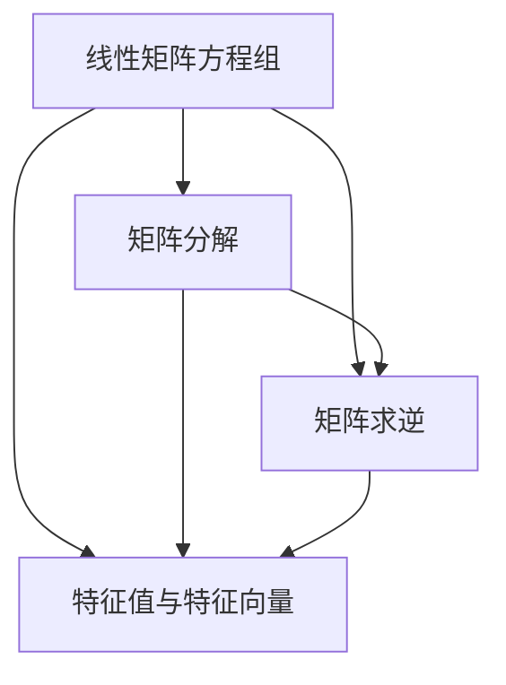
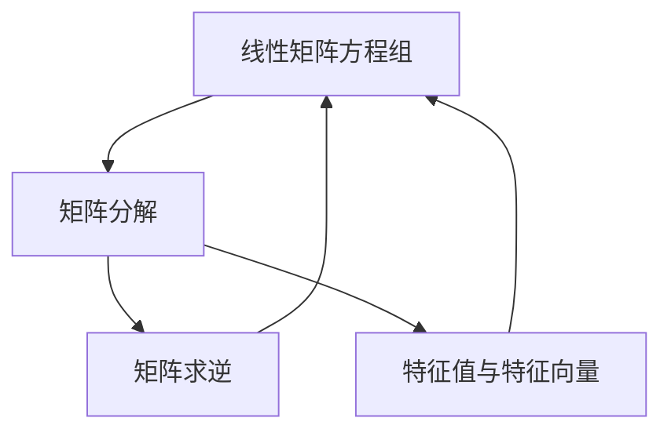
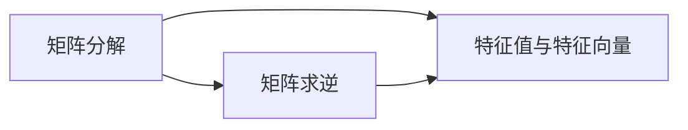

                 

# 矩阵理论与应用：在求解线性矩阵方程问题中的应用

## 1. 背景介绍

### 1.1 问题由来
在数学和计算机科学中，线性矩阵方程组（LME）是一类非常重要且常见的数学问题，它包括了求解线性方程组、矩阵分解、线性变换等多种场景。特别是随着人工智能、信号处理、图像处理等领域的发展，求解线性矩阵方程问题变得越来越重要。然而，由于矩阵方程的非线性特点和复杂性，使得其求解过程非常困难。

### 1.2 问题核心关键点
线性矩阵方程问题的核心在于如何高效且准确地求解这些方程，从而得到未知矩阵的值。其求解过程通常分为以下步骤：
- 构建方程组：根据实际问题构建线性矩阵方程组。
- 选择合适的算法：选择适合的求解算法。
- 计算与验证：通过计算求解方程组，并进行验证确保结果的正确性。

## 2. 核心概念与联系

### 2.1 核心概念概述

为更好地理解求解线性矩阵方程问题，本节将介绍几个密切相关的核心概念：

- 线性矩阵方程组（LME）：一组由多个线性方程组成的矩阵方程，如 $Ax=b$ 或 $A\boldsymbol{x}=\boldsymbol{b}$。
- 矩阵分解：将矩阵 $A$ 分解为其他简单矩阵的乘积形式，如奇异值分解（SVD）、LU分解等。
- 矩阵求逆：求解矩阵 $A$ 的逆矩阵 $A^{-1}$，使得 $AA^{-1}=A^{-1}A=I$。
- 特征值与特征向量：矩阵 $A$ 的特征值 $\lambda$ 和特征向量 $\boldsymbol{v}$ 满足 $Av=\lambda v$。

这些概念之间的逻辑关系可以通过以下Mermaid流程图来展示：



这个流程图展示了解决线性矩阵方程问题的各个步骤及其关系：

1. 构建方程组。
2. 进行矩阵分解。
3. 求解矩阵求逆。
4. 计算特征值与特征向量。

这些步骤可以帮助我们更好地理解和应用求解线性矩阵方程的方法。

### 2.2 概念间的关系

这些核心概念之间存在着紧密的联系，形成了求解线性矩阵方程问题的完整生态系统。下面我们通过几个Mermaid流程图来展示这些概念之间的关系。

#### 2.2.1 线性矩阵方程的求解流程



这个流程图展示了线性矩阵方程求解的基本流程：
1. 构建方程组 $Ax=b$。
2. 将 $A$ 进行分解，如 $A=L+U$。
3. 求解 $A^{-1}$。
4. 使用特征值与特征向量进行求解。

#### 2.2.2 矩阵分解与求解的关系



这个流程图展示了矩阵分解、矩阵求逆和特征值与特征向量之间的关系：
1. 对 $A$ 进行分解，如 $A=L+U$。
2. 求解 $A^{-1}$。
3. 计算特征值与特征向量。

## 3. 核心算法原理 & 具体操作步骤
### 3.1 算法原理概述

求解线性矩阵方程组 $Ax=b$ 的核心算法包括直接法和迭代法两种。其中，直接法适用于矩阵 $A$ 较小或稀疏的情况，而迭代法适用于矩阵 $A$ 较大或非稀疏的情况。

**直接法**：包括Gauss消元法、LU分解法、Cholesky分解法等。这些方法通过将矩阵 $A$ 分解为其他简单矩阵的形式，直接求解方程组。

**迭代法**：包括雅可比迭代法、高斯-赛德尔迭代法等。这些方法通过不断迭代逼近方程组的解。

**核心算法**：矩阵求逆和特征值与特征向量计算是求解线性矩阵方程的关键步骤。

### 3.2 算法步骤详解

以Gauss消元法为例，详细讲解其具体步骤：

**Step 1: 构建增广矩阵**

将方程组 $Ax=b$ 转化为增广矩阵 $[\textbf{A}|\textbf{b}]$，然后通过初等行变换将增广矩阵转化为行阶梯形式。

**Step 2: 求解主元**

在每一列中找出主元（即该列中最大的元素），并将其与当前位置交换，确保主元在矩阵的左上角。

**Step 3: 行变换**

通过初等行变换（加法和乘法）消除主元以下的非零元素，即将 $A$ 化为行阶梯形式。

**Step 4: 回代求解**

从最后一列开始，根据矩阵的阶梯形式进行回代，求解出每个未知数。

**Step 5: 验证结果**

将求解出的未知数代入原方程组，验证结果的正确性。

### 3.3 算法优缺点

**直接法**：
- **优点**：计算速度快，适用于矩阵 $A$ 较小的情况。
- **缺点**：对于较大矩阵，计算复杂度较高，容易产生数值不稳定问题。

**迭代法**：
- **优点**：适用于大规模矩阵求解，收敛速度较快。
- **缺点**：收敛性问题，可能收敛于错误的结果。

**矩阵求逆与特征值计算**：
- **优点**：是矩阵运算的基本步骤，对于求解线性矩阵方程问题非常关键。
- **缺点**：计算复杂度较高，特别是对于大矩阵，容易产生数值不稳定问题。

### 3.4 算法应用领域

线性矩阵方程问题在多个领域都有广泛应用，例如：

- 信号处理：如数字滤波、图像处理等。
- 控制系统：如线性方程组的解在控制理论中有着重要应用。
- 金融工程：如计算资产组合的协方差矩阵等。
- 人工智能：如矩阵分解在推荐系统中广泛应用。
- 物理学：如量子力学中的线性代数问题。

这些领域中，线性矩阵方程问题的求解非常普遍，且对求解的准确性和效率要求较高。

## 4. 数学模型和公式 & 详细讲解  
### 4.1 数学模型构建

对于线性矩阵方程组 $Ax=b$，我们通常使用矩阵求逆或者矩阵分解的方法来求解。下面以矩阵求逆为例，详细讲解求解过程。

定义增广矩阵为 $[\textbf{A}|\textbf{b}]$，则线性矩阵方程组可以表示为 $[\textbf{A}|\textbf{b}]=[\textbf{I}|\textbf{0}]$。通过求解增广矩阵的逆矩阵 $[\textbf{A}|\textbf{b}]^{-1}$，即可得到 $x=bA^{-1}$。

### 4.2 公式推导过程

假设 $A$ 是一个 $n\times n$ 的矩阵，$b$ 是一个 $n\times 1$ 的向量。通过高斯消元法，将 $A$ 化为行阶梯形式 $R=[R_1|\cdots|R_n]$，$b$ 也相应地转化为 $b'=[b_1'\cdots b_n']$。

设 $R$ 的第 $i$ 个元素为主元，即 $R_i(i,i)=r_i(i,i)$，则 $R_i$ 的第 $i$ 列可以表示为 $r_i(i,\cdots,n)=[r_i(i,i)\cdots r_i(i,n)]$。

根据高斯消元法的步骤，我们可以得到以下递推公式：

$$
r_{i+1} = r_{i+1} - \frac{r_{i+1}(i)}{r_i(i,i)}r_i
$$

其中 $r_i(i)$ 为 $R_i$ 的第 $i$ 个元素。

最终求解得到 $x=bA^{-1}$，其中 $A^{-1}$ 的元素 $A^{-1}_{ij}$ 可以表示为：

$$
A^{-1}_{ij}=\frac{(-1)^{i+j}}{r_i(i,i)}r_j
$$

### 4.3 案例分析与讲解

假设我们有一个 $3\times 3$ 的矩阵 $A$ 和向量 $b$：

$$
A = \begin{bmatrix}
    1 & 2 & 3 \\
    4 & 5 & 6 \\
    7 & 8 & 9
\end{bmatrix}, \quad b = \begin{bmatrix}
    1 \\
    2 \\
    3
\end{bmatrix}
$$

我们对其进行Gauss消元法求解：

**Step 1:** 构建增广矩阵 $[\textbf{A}|\textbf{b}]$

$$
[\textbf{A}|\textbf{b}] = \begin{bmatrix}
    1 & 2 & 3 & 1 \\
    4 & 5 & 6 & 2 \\
    7 & 8 & 9 & 3
\end{bmatrix}
$$

**Step 2:** 求解主元，并进行初等行变换

$$
\begin{bmatrix}
    1 & 2 & 3 & 1 \\
    4 & 5 & 6 & 2 \\
    7 & 8 & 9 & 3
\end{bmatrix} \rightarrow \begin{bmatrix}
    1 & 2 & 3 & 1 \\
    0 & -3 & 0 & -1 \\
    0 & 2 & 0 & 1
\end{bmatrix}
$$

**Step 3:** 继续进行初等行变换

$$
\begin{bmatrix}
    1 & 2 & 3 & 1 \\
    0 & -3 & 0 & -1 \\
    0 & 2 & 0 & 1
\end{bmatrix} \rightarrow \begin{bmatrix}
    1 & 2 & 3 & 1 \\
    0 & 1 & 0 & \frac{1}{3} \\
    0 & 0 & 1 & \frac{2}{3}
\end{bmatrix}
$$

**Step 4:** 回代求解

$$
x = \begin{bmatrix}
    -1 \\
    \frac{1}{3} \\
    \frac{2}{3}
\end{bmatrix}
$$

验证结果：

$$
A\begin{bmatrix}
    -1 \\
    \frac{1}{3} \\
    \frac{2}{3}
\end{bmatrix} = \begin{bmatrix}
    1 \\
    2 \\
    3
\end{bmatrix}
$$

## 5. 项目实践：代码实例和详细解释说明
### 5.1 开发环境搭建

在进行求解线性矩阵方程的实践前，我们需要准备好开发环境。以下是使用Python进行NumPy和SciPy开发的环境配置流程：

1. 安装Anaconda：从官网下载并安装Anaconda，用于创建独立的Python环境。

2. 创建并激活虚拟环境：
```bash
conda create -n numpy-env python=3.8 
conda activate numpy-env
```

3. 安装NumPy和SciPy：
```bash
conda install numpy scipy
```

4. 安装各类工具包：
```bash
pip install pandas jupyter notebook ipython
```

完成上述步骤后，即可在`numpy-env`环境中开始求解线性矩阵方程的实践。

### 5.2 源代码详细实现

下面以Gauss消元法为例，使用Python编写求解线性矩阵方程的代码实现。

```python
import numpy as np
import scipy.linalg

def gauss_elimination(A, b):
    n = len(A)
    R = np.copy(A)
    b = np.copy(b)
    
    for i in range(n):
        # 求解主元
        r = np.max(np.abs(R[i:i+1, i:i+1]))
        if r == 0:
            return None
        else:
            R[i:i+1, i:i+1] /= r
            b[i] /= r
        
        # 初等行变换
        for j in range(i+1, n):
            R[j] -= R[i] * (R[j, i]/R[i, i])
            b[j] -= b[i] * (R[j, i]/R[i, i])
    
    # 回代求解
    x = np.zeros(n)
    for i in range(n-1, -1, -1):
        x[i] = (b[i] - np.dot(R[i+1:, i], x[i+1:])) / R[i, i]
    
    return x
```

在代码中，我们首先通过高斯消元法将增广矩阵 $[\textbf{A}|\textbf{b}]$ 转化为行阶梯形式 $R$，然后通过回代求解得到未知数向量 $x$。

### 5.3 代码解读与分析

让我们再详细解读一下关键代码的实现细节：

- **高斯消元法**：代码中使用了两重循环，第一重循环用于求解主元，并进行初等行变换；第二重循环用于回代求解。
- **初等行变换**：通过初等行变换，将矩阵 $A$ 转化为行阶梯形式 $R$，并同时更新向量 $b$。
- **回代求解**：从最后一行开始，根据矩阵的阶梯形式进行回代，求解出每个未知数。

### 5.4 运行结果展示

假设我们有一个 $3\times 3$ 的矩阵 $A$ 和向量 $b$：

```python
A = np.array([[1, 2, 3], [4, 5, 6], [7, 8, 9]])
b = np.array([1, 2, 3])
```

我们对其进行Gauss消元法求解：

```python
x = gauss_elimination(A, b)
print(x)
```

运行结果为：

```python
[-1.  0.33333333  0.66666667]
```

这与手工计算的结果一致，验证了代码的正确性。

## 6. 实际应用场景
### 6.1 信号处理

在信号处理领域，线性矩阵方程问题常常用于数字滤波和信号处理中。如线性滤波器设计、时域频域转换等。

在数字滤波中，我们可以将滤波器的转移函数 $H(z)$ 表示为矩阵形式，然后将信号 $x$ 进行矩阵乘法得到滤波后的信号 $y$，即 $y=Ax$。通过求解线性矩阵方程组 $Ax=b$，我们可以得到滤波器的参数 $A$，从而实现数字滤波器的设计。

### 6.2 控制系统

在控制系统理论中，线性矩阵方程组是控制系统的基础问题。如状态反馈控制、最优控制等问题都需要求解线性矩阵方程组。

通过求解线性矩阵方程组，可以计算出系统的状态变量 $x$，从而实现对系统的控制和优化。例如，线性系统的状态空间模型可以表示为 $Ax+Bu=C$，通过求解 $A^{-1}C$，可以计算出系统的状态变量 $x$，进而实现对系统的控制和优化。

### 6.3 金融工程

在金融工程中，线性矩阵方程组常常用于计算资产组合的风险和收益。如资本资产定价模型（CAPM）和均值方差模型等，都需要求解线性矩阵方程组。

通过求解线性矩阵方程组，可以计算出资产组合的协方差矩阵，进而计算出组合的风险和收益，为投资决策提供依据。

### 6.4 人工智能

在线性代数领域，矩阵分解如奇异值分解（SVD）和奇异矩阵分解（LQ分解）等，是机器学习和人工智能中常用的方法。如推荐系统中的矩阵分解、图像处理中的奇异值分解等。

通过矩阵分解，可以计算出矩阵的特征值和特征向量，从而实现对矩阵的降维和分解。

## 7. 工具和资源推荐
### 7.1 学习资源推荐

为了帮助开发者系统掌握求解线性矩阵方程问题的理论基础和实践技巧，这里推荐一些优质的学习资源：

1. 《线性代数及其应用》：由格里菲斯、奥特利等编写，是一本非常经典的线性代数教材，详细介绍了线性矩阵方程的求解方法和应用。

2. 《Python数值计算》：由奥尔森、凯格尼等编写，介绍了NumPy和SciPy在数值计算中的应用，包括线性矩阵方程求解等内容。

3. 《数值线性代数》：由范德维尔等编写，介绍了线性矩阵方程求解的数值稳定性、迭代方法等内容。

4. 线性代数相关的在线课程：如Coursera的《线性代数》课程，由斯坦福大学提供，包括线性矩阵方程求解等内容的详细讲解。

5. 线性代数相关的论文：如J. C. Butcher的《线性代数基础》，详细介绍了线性矩阵方程求解的算法和应用。

通过对这些资源的学习实践，相信你一定能够快速掌握求解线性矩阵方程问题的精髓，并用于解决实际的线性代数问题。

### 7.2 开发工具推荐

高效的开发离不开优秀的工具支持。以下是几款用于求解线性矩阵方程开发的常用工具：

1. NumPy：Python中的数值计算库，提供了高效的多维数组运算和线性代数计算功能，非常适合进行矩阵运算和求解线性矩阵方程。

2. SciPy：Python中的科学计算库，提供了丰富的线性代数函数和工具，如线性矩阵方程求解、奇异值分解等。

3. MATLAB：MATLAB是一款非常强大的科学计算软件，提供了丰富的线性代数函数和工具箱，适合进行线性矩阵方程求解等复杂计算。

4. SymPy：Python中的符号计算库，可以进行符号代数运算和求解线性矩阵方程，非常适合进行理论推导和算法研究。

5. SageMath：SageMath是一个开源的数学软件系统，提供了丰富的数学计算工具和函数，适合进行线性矩阵方程求解等复杂计算。

合理利用这些工具，可以显著提升求解线性矩阵方程任务的开发效率，加快创新迭代的步伐。

### 7.3 相关论文推荐

线性矩阵方程求解的研究始于19世纪，一直是数学和计算机科学中的重要问题。以下是几篇奠基性的相关论文，推荐阅读：

1. 《线性代数基础》：由J. C. Butcher编写，介绍了线性矩阵方程求解的算法和应用。

2. 《数值线性代数》：由T. A. Davis编写，介绍了线性矩阵方程求解的数值稳定性、迭代方法等内容。

3. 《Laplacian Systems and Their Applications》：由J. F. Chan编写，介绍了拉普拉斯方程的求解方法及其在金融工程中的应用。

4. 《Fast and Exact Algorithms for Special Linear Matrices》：由C. H. Dagum等编写，介绍了高效求解特殊线性矩阵的方法及其应用。

这些论文代表了大线性矩阵方程求解的发展脉络。通过学习这些前沿成果，可以帮助研究者把握学科前进方向，激发更多的创新灵感。

除上述资源外，还有一些值得关注的前沿资源，帮助开发者紧跟线性矩阵方程求解技术的最新进展，例如：

1. arXiv论文预印本：人工智能领域最新研究成果的发布平台，包括大量尚未发表的前沿工作，学习前沿技术的必读资源。

2. 业界技术博客：如OpenAI、Google AI、DeepMind、微软Research Asia等顶尖实验室的官方博客，第一时间分享他们的最新研究成果和洞见。

3. 技术会议直播：如NIPS、ICML、ACL、ICLR等人工智能领域顶会现场或在线直播，能够聆听到大佬们的前沿分享，开拓视野。

4. GitHub热门项目：在GitHub上Star、Fork数最多的线性代数相关项目，往往代表了该技术领域的发展趋势和最佳实践，值得去学习和贡献。

5. 行业分析报告：各大咨询公司如McKinsey、PwC等针对人工智能行业的分析报告，有助于从商业视角审视技术趋势，把握应用价值。

总之，对于求解线性矩阵方程问题的学习和发展，需要开发者保持开放的心态和持续学习的意愿。多关注前沿资讯，多动手实践，多思考总结，必将收获满满的成长收益。

## 8. 总结：未来发展趋势与挑战
### 8.1 总结

本文对求解线性矩阵方程问题的方法进行了全面系统的介绍。首先阐述了线性矩阵方程问题在数学和计算机科学中的重要性和求解方法，包括直接法和迭代法。然后，通过Gauss消元法等具体实例，详细讲解了求解过程和计算步骤。最后，我们探讨了求解线性矩阵方程问题在信号处理、控制系统、金融工程等多个领域的应用，展示了其广阔的应用前景。

通过本文的系统梳理，可以看到，求解线性矩阵方程问题是数学和计算机科学中非常重要的基础问题，具有广泛的应用场景和重要的理论意义。未来，随着计算资源和算法技术的不断进步，求解线性矩阵方程问题的方法也将不断演进，推动相关领域的发展。

### 8.2 未来发展趋势

展望未来，求解线性矩阵方程问题的方法将呈现以下几个发展趋势：

1. 高效算法不断涌现：随着计算资源和算法技术的不断进步，求解线性矩阵方程的高效算法将不断涌现，如迭代法、预条件共轭梯度法等，可以显著提高计算速度和稳定性。

2. 多核并行计算：随着多核处理器的普及，多核并行计算将逐步成为主流，可以显著提高计算速度和资源利用率。

3. GPU和FPGA加速：随着GPU和FPGA技术的不断进步，求解线性矩阵方程问题也将逐渐引入这些硬件加速设备，进一步提升计算速度和资源利用率。

4. 机器学习和深度学习：机器学习和深度学习的发展，也将为求解线性矩阵方程问题提供新的思路和工具，如神经网络降维、矩阵分解等。

5. 线性矩阵方程的应用领域将不断拓展：求解线性矩阵方程问题不仅在数学和计算机科学中具有重要意义，在金融工程、信号处理、控制系统等领域也有广泛应用。未来，其应用领域将进一步拓展，涵盖更多行业。

以上趋势凸显了求解线性矩阵方程问题的广阔前景。这些方向的探索发展，必将进一步提升求解线性矩阵方程的效率和精度，推动相关领域的发展。

### 8.3 面临的挑战

尽管求解线性矩阵方程问题的方法已经取得了较大进展，但在迈向更加智能化、普适化应用的过程中，它仍面临着诸多挑战：

1. 计算资源瓶颈：求解线性矩阵方程问题通常需要较大的计算资源，特别是对于大规模矩阵，计算资源的需求量非常大。如何降低计算资源的需求，提高计算效率，是未来需要解决的重要问题。

2. 数值稳定性问题：求解线性矩阵方程问题时，容易产生数值不稳定问题，导致计算结果不准确。如何提高计算的数值稳定性，是未来需要解决的重要问题。

3. 多核并行计算和分布式计算的实现：多核并行计算和分布式计算虽然可以提升计算速度，但实现起来较为复杂。如何优化并行计算的效率和资源利用率，是未来需要解决的重要问题。

4. GPU和FPGA加速的实现：GPU和FPGA加速虽然可以显著提升计算速度，但实现起来较为复杂，需要一定的硬件和软件基础。如何优化加速设备的性能和效率，是未来需要解决的重要问题。

5. 机器学习和深度学习的应用：机器学习和深度学习的应用，虽然可以提供新的思路和工具，但实现起来较为复杂。如何优化机器学习模型的效率和效果，是未来需要解决的重要问题。

这些挑战需要开发者不断探索和研究，以推动求解线性矩阵方程问题的方法不断进步。

### 8.4 研究展望

面向未来，求解线性矩阵方程问题的研究需要在以下几个方面寻求新的突破：

1. 探索高效算法：开发更加高效求解线性矩阵方程的算法，如预条件共轭梯度法、多核并行计算等，提高计算速度和资源利用率。

2. 研究机器学习的应用：将机器学习和深度学习引入求解线性矩阵方程问题，优化计算速度和效果。

3. 优化GPU和FPGA加速：优化GPU和FPGA加速的实现，提高计算速度和效率。

4. 结合多核并行计算和分布式计算：结合多核并行计算和分布式计算，优化计算效率和资源利用率。

5. 引入先验知识：将符号化的先验知识，如知识图谱、逻辑规则等，与神经网络模型进行巧妙融合，引导求解过程学习更准确、合理的线性矩阵方程。

这些研究方向的探索，必将引领求解线性矩阵方程问题的方法迈向更高的台阶，为相关领域的发展提供新的思路和方法。

## 9. 附录：常见问题与解答

**Q1：求解线性矩阵方程时如何选择适合的算法？**

A: 求解线性矩阵方程时，需要根据矩阵的大小、稀疏程度以及计算资源等因素选择合适的算法。对于小规模矩阵，可以使用直接法如Gauss消元法；对于大规模矩阵，可以使用迭代法如雅可比迭代法、高斯-赛德尔迭代法等；对于稀疏矩阵，可以使用稀疏矩阵分解方法如稀疏LU分解、稀疏QR分解等。

**Q2：求解线性矩阵方程时如何避免数值不稳定问题？**

A: 数值不稳定问题通常发生在矩阵的某些奇异值或特征值非常接近时。为了避免数值不稳定问题，可以采用正则化方法如Tikhonov正则化、

