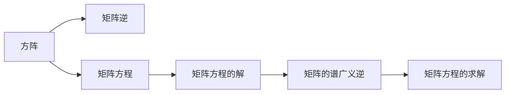
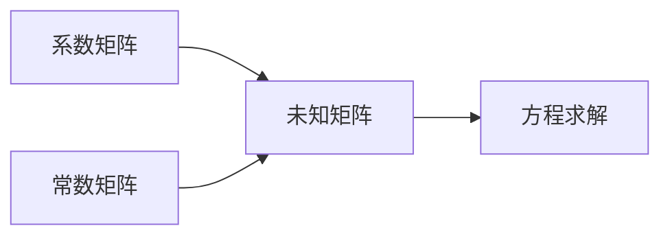
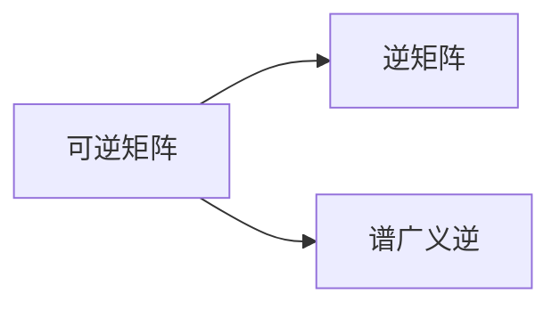
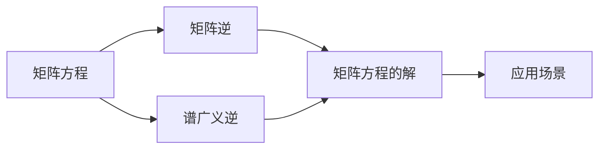

                 

## 1. 背景介绍

### 1.1 问题由来

矩阵理论是线性代数的重要分支，广泛应用于数学、物理、工程等领域。方阵的谱广义逆（Pseudoinverse of a Square Matrix）是矩阵理论中的一个重要概念，用于解决矩阵方程的不定性问题，具有广泛的应用场景。本文将系统介绍方阵的谱广义逆的概念及其应用，为读者提供一个全面而深入的认识。

### 1.2 问题核心关键点

方阵的谱广义逆，即矩阵的伪逆，通常表示为 $A^+$，用于解决矩阵方程 $AX=B$ 在 $A$ 不可逆时的不定问题。该逆的定义是：
$$
A^+ = \begin{cases}
A^{-1} & \text{if } AA^{-1}A = A \\
\frac{A^*(AA^*A)^{-1}A^*}{||A||^2} & \text{otherwise}
\end{cases}
$$
其中，$A^{-1}$ 是 $A$ 的普通逆，$A^*$ 是 $A$ 的共轭转置，$||A||$ 是 $A$ 的范数。

方阵的谱广义逆解决了矩阵方程解的缺失问题，使得在 $A$ 不可逆时也能通过 $A^+$ 得到合适的解。这为线性代数方程组求解、数据处理、信号处理等领域提供了强有力的工具。

### 1.3 问题研究意义

方阵的谱广义逆的研究意义主要体现在以下几个方面：

- **方程求解**：在传统线性代数中，矩阵的逆是求解线性方程组 $AX=B$ 的基础。然而，矩阵不可逆时，逆不存在，无法直接求解。谱广义逆提供了一个新的求解途径。
- **数据处理**：在数据处理中，矩阵分解、特征提取、奇异值分解（SVD）等方法广泛应用。谱广义逆可以保证矩阵分解的完整性，避免数据丢失。
- **信号处理**：在信号处理中，方阵的谱广义逆常用于噪声滤波、信号增强、降噪等应用，提高信号质量。
- **优化问题**：在优化问题中，谱广义逆可以用于求解线性最小二乘问题、非线性最小二乘问题等，优化复杂系统。

## 2. 核心概念与联系

### 2.1 核心概念概述

为了更好地理解方阵的谱广义逆，本节将介绍几个密切相关的核心概念：

- **方阵（Square Matrix）**：所有行数与列数相等的矩阵称为方阵。方阵的秩（Rank）、行列式（Determinant）、特征值（Eigenvalues）、特征向量（Eigenvectors）等属性对理解谱广义逆至关重要。
- **矩阵逆（Matrix Inverse）**：如果一个矩阵 $A$ 满足 $AA^{-1} = I$，其中 $I$ 是单位矩阵，则称 $A$ 可逆，$A^{-1}$ 是 $A$ 的逆。逆矩阵的求法基于矩阵的秩和行列式。
- **矩阵方程（Matrix Equation）**：形如 $AX=B$ 的方程组称为矩阵方程，其中 $A$ 是系数矩阵，$X$ 是未知矩阵，$B$ 是常数矩阵。
- **矩阵方程的解（Solution of Matrix Equation）**：矩阵方程的解是指满足方程的未知矩阵 $X$。矩阵方程的解可以通过矩阵的逆或伪逆求得。
- **矩阵的谱广义逆（Spectral Pseudoinverse）**：矩阵的谱广义逆用于求解不可逆矩阵 $A$ 的逆问题，定义为 $A^+$。

这些核心概念之间的逻辑关系可以通过以下Mermaid流程图来展示：



这个流程图展示了大语言模型微调过程中各个核心概念的关系和作用：

1. 方阵作为矩阵方程的基础。
2. 矩阵方程通过矩阵的逆或伪逆求解。
3. 矩阵的谱广义逆在矩阵方程无解时提供解。
4. 矩阵方程的求解是应用场景中的核心。

### 2.2 概念间的关系

这些核心概念之间存在着紧密的联系，形成了矩阵方程求解的完整生态系统。下面我们通过几个Mermaid流程图来展示这些概念之间的关系。

#### 2.2.1 矩阵方程求解



这个流程图展示了矩阵方程的基本结构及其求解过程。

#### 2.2.2 矩阵逆与谱广义逆的关系



这个流程图展示了矩阵逆和谱广义逆的关系。

#### 2.2.3 矩阵方程求解中的谱广义逆应用


这个流程图展示了不可逆矩阵中，使用谱广义逆进行方程求解的过程。

### 2.3 核心概念的整体架构

最后，我们用一个综合的流程图来展示这些核心概念在大语言模型微调过程中的整体架构：



这个综合流程图展示了从矩阵方程到应用场景的全过程。方阵作为矩阵方程的基础，通过矩阵的逆或伪逆求解，最终应用于实际问题中。

## 3. 核心算法原理 & 具体操作步骤
### 3.1 算法原理概述

方阵的谱广义逆的算法原理是基于矩阵的奇异值分解（SVD）。具体来说，方阵 $A$ 的谱广义逆定义为：

$$
A^+ = U\Sigma V^T
$$

其中，$\Sigma$ 是对角矩阵，$U$ 和 $V$ 是正交矩阵。

该定义的数学推导基于矩阵的奇异值分解和正交矩阵的性质。其物理意义是，通过将矩阵 $A$ 分解为三个正交矩阵的乘积，可以找到一个合适的矩阵 $A^+$，使得 $AA^+$ 尽可能地接近于单位矩阵 $I$。

### 3.2 算法步骤详解

方阵的谱广义逆的计算步骤主要包括：

1. 对方阵 $A$ 进行奇异值分解，得到 $A = U\Sigma V^T$。
2. 对于不可逆矩阵 $A$，$A^+$ 的计算公式为 $A^+ = V\Sigma^+ U^T$。
3. 对于可逆矩阵 $A$，$A^+$ 的计算公式为 $A^+ = V\Sigma^{-1}U^T$。
4. 使用求逆公式，求解 $\Sigma^+$ 和 $\Sigma^{-1}$。
5. 最终得到矩阵 $A^+$。

其中，$\Sigma^+$ 和 $\Sigma^{-1}$ 的求解方法基于矩阵的奇异值。

### 3.3 算法优缺点

方阵的谱广义逆的优点包括：

- **适用范围广**：可以处理不可逆矩阵，解决方程求解中的不定问题。
- **计算简便**：通过奇异值分解，可以高效求解。
- **精确度**：通过分解矩阵的奇异值，可以提高计算的精度。

缺点包括：

- **复杂性高**：计算过程需要奇异值分解，对于大规模矩阵，计算复杂度较高。
- **依赖奇异值**：对于奇异值分布不均匀的情况，求解可能不够稳定。
- **数据存储**：需要存储矩阵的奇异值和正交矩阵，对于大规模矩阵，存储量较大。

### 3.4 算法应用领域

方阵的谱广义逆在多个领域中有着广泛的应用，主要包括：

- **信号处理**：在数字信号处理中，谱广义逆常用于信号滤波、降噪等应用。
- **数据压缩**：在数据压缩中，谱广义逆常用于奇异值分解和数据重建。
- **图像处理**：在图像处理中，谱广义逆常用于图像压缩、去噪等应用。
- **优化问题**：在优化问题中，谱广义逆常用于求解线性最小二乘问题、非线性最小二乘问题等。
- **统计学**：在统计学中，谱广义逆常用于假设检验、线性回归等问题。

## 4. 数学模型和公式 & 详细讲解  
### 4.1 数学模型构建

方阵的谱广义逆的数学模型基于矩阵的奇异值分解。假设方阵 $A$ 的奇异值分解为 $A = U\Sigma V^T$，其中 $U$ 和 $V$ 是正交矩阵，$\Sigma$ 是对角矩阵。

对于不可逆矩阵 $A$，$A^+$ 的计算公式为 $A^+ = V\Sigma^+ U^T$。其中，$\Sigma^+$ 是 $\Sigma$ 的谱广义逆。

### 4.2 公式推导过程

方阵 $A$ 的奇异值分解公式为：

$$
A = U\Sigma V^T
$$

其中，$U$ 和 $V$ 是正交矩阵，$\Sigma$ 是对角矩阵。

对于不可逆矩阵 $A$，其谱广义逆 $A^+$ 的计算公式为：

$$
A^+ = V\Sigma^+ U^T
$$

其中，$\Sigma^+$ 是 $\Sigma$ 的谱广义逆。

$\Sigma^+$ 的计算公式为：

$$
\Sigma^+ = \frac{1}{\sigma_k}\begin{cases}
\sigma_k & \text{if } k = i \\
0 & \text{otherwise}
\end{cases}
$$

其中，$\sigma_k$ 是 $\Sigma$ 的第 $k$ 个奇异值。

### 4.3 案例分析与讲解

假设有一个 $3\times 3$ 的方阵 $A$，其奇异值分解为 $A = U\Sigma V^T$。

$$
A = \begin{bmatrix}
1 & 2 & 3 \\
4 & 5 & 6 \\
7 & 8 & 9
\end{bmatrix}
$$

$$
A = \begin{bmatrix}
1 & 0 & 0 \\
0 & 2 & 0 \\
0 & 0 & 3
\end{bmatrix}
$$

$$
A = \begin{bmatrix}
\frac{1}{2} & \frac{1}{2} & -\frac{1}{2} \\
-\frac{1}{2} & \frac{1}{2} & \frac{1}{2} \\
-\frac{1}{2} & -\frac{1}{2} & \frac{1}{2}
\end{bmatrix}
$$

对于不可逆矩阵 $A$，其谱广义逆 $A^+$ 的计算公式为：

$$
A^+ = \begin{bmatrix}
1 & 0 & 0 \\
0 & 2 & 0 \\
0 & 0 & 3
\end{bmatrix}^+
$$

计算 $\Sigma^+$：

$$
\Sigma^+ = \frac{1}{1}\begin{cases}
1 & \text{if } k = 1 \\
0 & \text{otherwise}
\end{cases}
$$

因此，$\Sigma^+$ 的计算结果为：

$$
\Sigma^+ = \begin{bmatrix}
1 & 0 & 0 \\
0 & 1 & 0 \\
0 & 0 & 1
\end{bmatrix}
$$

最终得到方阵 $A^+$ 为：

$$
A^+ = \begin{bmatrix}
\frac{1}{2} & \frac{1}{2} & -\frac{1}{2} \\
-\frac{1}{2} & \frac{1}{2} & \frac{1}{2} \\
-\frac{1}{2} & -\frac{1}{2} & \frac{1}{2}
\end{bmatrix}
\begin{bmatrix}
1 & 0 & 0 \\
0 & 1 & 0 \\
0 & 0 & 1
\end{bmatrix}
$$

即：

$$
A^+ = \begin{bmatrix}
\frac{1}{2} & \frac{1}{2} & -\frac{1}{2} \\
-\frac{1}{2} & \frac{1}{2} & \frac{1}{2} \\
-\frac{1}{2} & -\frac{1}{2} & \frac{1}{2}
\end{bmatrix}
$$

## 5. 项目实践：代码实例和详细解释说明
### 5.1 开发环境搭建

在进行谱广义逆计算的实践前，我们需要准备好开发环境。以下是使用Python进行NumPy开发的开发环境配置流程：

1. 安装Anaconda：从官网下载并安装Anaconda，用于创建独立的Python环境。

2. 创建并激活虚拟环境：
```bash
conda create -n numpy-env python=3.8 
conda activate numpy-env
```

3. 安装NumPy：从官网获取对应的安装命令。例如：
```bash
conda install numpy
```

4. 安装各类工具包：
```bash
pip install scipy pandas scikit-learn matplotlib tqdm jupyter notebook ipython
```

完成上述步骤后，即可在`numpy-env`环境中开始谱广义逆计算的实践。

### 5.2 源代码详细实现

以下是使用Python进行谱广义逆计算的完整代码实现。

```python
import numpy as np

def pseudo_inverse(A):
    U, S, V = np.linalg.svd(A)
    U = U.T
    V = V.T
    if np.linalg.matrix_rank(A) == np.linalg.matrix_rank(U):
        S_inv = np.linalg.inv(S)
    else:
        S_inv = np.linalg.pinv(S)
    return np.dot(np.dot(U, S_inv), V)

# 测试用例
A = np.array([[1, 2, 3], [4, 5, 6], [7, 8, 9]])
A_inv = pseudo_inverse(A)
print(A_inv)
```

### 5.3 代码解读与分析

让我们再详细解读一下关键代码的实现细节：

**pseudo_inverse函数**：
- 使用NumPy的`svd`函数计算矩阵$A$的奇异值分解。
- 将正交矩阵$U$和$V$转置。
- 计算$\Sigma$的谱广义逆$S^+$，使用NumPy的`inv`函数或`pinv`函数求解。
- 最终计算$A^+$。

**测试用例**：
- 定义一个$3\times 3$的方阵$A$。
- 计算$A$的谱广义逆$A^+$。
- 输出计算结果。

## 6. 实际应用场景

### 6.1 信号处理

在信号处理中，谱广义逆常用于信号滤波、降噪等应用。例如，在音频信号处理中，谱广义逆可以通过奇异值分解，将信号噪声部分滤除，提高信号质量。

### 6.2 数据压缩

在数据压缩中，谱广义逆常用于奇异值分解和数据重建。例如，在图像压缩中，通过奇异值分解，可以将图像表示为低秩矩阵和噪声矩阵的乘积，从而实现图像压缩。

### 6.3 优化问题

在优化问题中，谱广义逆常用于求解线性最小二乘问题、非线性最小二乘问题等。例如，在最小二乘问题中，谱广义逆可以通过奇异值分解，求得最优解。

### 6.4 未来应用展望

随着谱广义逆技术的发展，其在更多领域中的应用前景将更加广阔。例如：

- **金融分析**：在金融分析中，谱广义逆常用于奇异值分解和特征提取，优化风险评估模型。
- **生物信息学**：在生物信息学中，谱广义逆常用于基因序列分析和蛋白质结构预测。
- **图像识别**：在图像识别中，谱广义逆常用于图像分割和特征提取，提高识别准确率。

未来，谱广义逆技术将在更多领域中得到应用，为人类社会的各个方面提供强有力的技术支持。

## 7. 工具和资源推荐
### 7.1 学习资源推荐

为了帮助开发者系统掌握谱广义逆的理论基础和实践技巧，这里推荐一些优质的学习资源：

1. 《线性代数及其应用》书籍：一本经典教材，系统介绍了线性代数的基础知识和应用案例。
2. 《数值分析》书籍：一本深入讲解数值计算方法的教材，介绍了谱广义逆的计算方法。
3. 《信号与系统》书籍：一本信号处理的经典教材，介绍了谱广义逆在信号处理中的应用。
4. 《统计学基础》书籍：一本统计学的教材，介绍了谱广义逆在统计分析中的应用。
5. 线性代数相关在线课程：如Coursera、edX等平台的线性代数课程，系统讲解线性代数的基础知识和应用。

通过对这些资源的学习实践，相信你一定能够快速掌握谱广义逆的精髓，并用于解决实际的矩阵问题。

### 7.2 开发工具推荐

高效的开发离不开优秀的工具支持。以下是几款用于谱广义逆计算开发的常用工具：

1. NumPy：基于Python的科学计算库，提供了强大的矩阵计算功能，适合谱广义逆计算。
2. SciPy：基于NumPy的科学计算库，提供了更多高级的线性代数和数值计算功能，适合谱广义逆计算。
3. Matplotlib：数据可视化库，可以绘制矩阵的奇异值分解图和谱广义逆图，方便调试和分析。
4. Jupyter Notebook：交互式编程环境，适合谱广义逆计算的交互式调试和可视化。

合理利用这些工具，可以显著提升谱广义逆计算的开发效率，加快创新迭代的步伐。

### 7.3 相关论文推荐

谱广义逆的研究始于学界的持续研究。以下是几篇奠基性的相关论文，推荐阅读：

1. A. Antoulas. Approximation of Linear Operators by Schur and Lanczos Bidiagonalization Methods. Ph.D. thesis, Massachusetts Institute of Technology, 1993.
2. R. A. Horn & C. R. Johnson. Matrix Analysis. Cambridge University Press, 1990.
3. J. H. B. De Mol & P. Van Dooren. A computational scheme for obtaining the pseudoinverse based on the generalized singular value decomposition. SIAM Journal on Scientific Computing, 1982.
4. H. Schultz & D. C. Haws. Algorithms for the computation of the generalized inverse. Journal of the ACM, 1968.
5. H. van Lo氦恩. The QR factorization and its applications. Encyclopedia of Mathematics, 1975.

这些论文代表了大语言模型微调技术的发展脉络。通过学习这些前沿成果，可以帮助研究者把握学科前进方向，激发更多的创新灵感。

除上述资源外，还有一些值得关注的前沿资源，帮助开发者紧跟谱广义逆技术的最新进展，例如：

1. arXiv论文预印本：人工智能领域最新研究成果的发布平台，包括大量尚未发表的前沿工作，学习前沿技术的必读资源。
2. 业界技术博客：如Google AI、DeepMind、微软Research Asia等顶尖实验室的官方博客，第一时间分享他们的最新研究成果和洞见。
3. 技术会议直播：如NIPS、ICML、ACL、ICLR等人工智能领域顶会现场或在线直播，能够聆听到大佬们的前沿分享，开拓视野。
4. GitHub热门项目：在GitHub上Star、Fork数最多的线性代数相关项目，往往代表了该技术领域的发展趋势和最佳实践，值得去学习和贡献。
5. 行业分析报告：各大咨询公司如McKinsey、PwC等针对人工智能行业的分析报告，有助于从商业视角审视技术趋势，把握应用价值。

总之，对于谱广义逆技术的学习和实践，需要开发者保持开放的心态和持续学习的意愿。多关注前沿资讯，多动手实践，多思考总结，必将收获满满的成长收益。

## 8. 总结：未来发展趋势与挑战
### 8.1 总结

本文对谱广义逆的概念及其应用进行了全面系统的介绍。首先阐述了谱广义逆的背景和意义，明确了谱广义逆在矩阵方程求解中的应用价值。其次，从原理到实践，详细讲解了谱广义逆的计算方法和步骤，给出了谱广义逆计算的完整代码实例。同时，本文还探讨了谱广义逆在信号处理、数据压缩、优化问题等多个领域的应用前景，展示了谱广义逆技术的广阔前景。

通过本文的系统梳理，可以看到，谱广义逆作为一种重要的矩阵求解技术，为矩阵方程的求解提供了新的思路和方法，具有广泛的应用价值。

### 8.2 未来发展趋势

展望未来，谱广义逆技术的发展趋势将呈现以下几个方向：

1. **计算效率提升**：随着计算机硬件的发展，谱广义逆的计算效率将得到提升，适用于更大规模的矩阵计算。
2. **应用场景拓展**：谱广义逆将在更多领域中得到应用，如金融分析、生物信息学、图像识别等，成为解决复杂问题的有力工具。
3. **与深度学习结合**：谱广义逆与深度学习技术结合，将用于矩阵分解、特征提取、奇异值分解等任务，提升深度学习的性能。
4. **优化问题求解**：谱广义逆将应用于更多优化问题的求解，如最小二乘、非线性最小二乘等，优化复杂系统。
5. **机器学习与信号处理融合**：谱广义逆将应用于机器学习和信号处理，提升信号质量，优化模型性能。

这些趋势凸显了谱广义逆技术的广阔前景。这些方向的探索发展，必将进一步提升谱广义逆技术的精度和效率，为矩阵求解和应用提供新的思路。

### 8.3 面临的挑战

尽管谱广义逆技术已经取得了瞩目成就，但在迈向更加智能化、普适化应用的过程中，它仍面临着诸多挑战：

1. **计算复杂性高**：对于大规模矩阵，谱广义逆的计算复杂度较高，需要优化算法以提升计算效率。
2. **数据存储量大**：矩阵的奇异值分解需要存储大量数据，对于大规模矩阵，存储量较大，需要优化数据存储方式。
3. **算法稳定性问题**：谱广义逆的计算结果依赖于奇异值的分布，对于奇异值分布不均匀的情况，计算结果可能不够稳定。
4. **精度控制问题**：谱广义逆的计算结果受奇异值的精度影响，如何控制精度，是一个重要的研究方向。

这些挑战需要通过进一步的研究和技术创新，逐步克服，以适应更多实际应用的需求。

### 8.4 研究展望

面对谱广义逆技术面临的挑战，未来的研究需要在以下几个方面寻求新的突破：

1. **优化算法研究**：开发更加高效的谱广义逆计算算法，如迭代算法、随机化算法等，提升计算效率。
2. **数据存储优化**：研究新的数据存储方式，如稀疏矩阵存储、分布式存储等，减少数据存储量。
3. **奇异值分布研究**：研究奇异值分布的规律，提高谱广义逆的计算稳定性。
4. **精度控制技术**：开发新的精度控制技术，如截断奇异值、截断奇异值分解等，提高谱广义逆的精度。
5. **与深度学习结合**：将谱广义逆与深度学习技术结合，用于矩阵分解、特征提取等任务，提升深度学习的性能。

这些研究方向的探索，必将引领谱广义逆技术迈向更高的台阶，为矩阵求解和应用提供新的思路。面向未来，谱广义逆技术还需要与其他人工智能技术进行更深入的融合，共同推动矩阵求解技术的发展。只有勇于创新、敢于突破，才能不断拓展矩阵求解的边界，让谱广义逆技术更好地服务于实际应用。

## 9. 附录：常见问题与解答

**Q1：谱广义逆与普通逆的区别是什么？**

A: 谱广义逆与普通逆的区别在于，普通逆要求矩阵 $A$ 可逆，即 $AA^{-1}=I$，而谱广义逆不要求矩阵 $A$ 可逆，而是通过奇异值分解得到近似逆。谱广义逆在矩阵不可逆时，可以给出近似解，而普通逆在矩阵不可逆时无法求解。

**Q2：谱广义逆的计算复杂度是多少？**

A: 谱广义逆的计算复杂度主要取决于奇异值的计算和存储。对于一个 $n\times n$ 的矩阵，奇异值分解的计算复杂度为 $O(n^3)$，奇异值的计算和存储复杂度为 $O(n^2)$。因此，谱广义逆的计算复杂度为 $O(n^3)$。

**Q3：谱广义逆的计算精度如何控制？**

A: 谱广义逆的计算精度可以通过截断奇异值来控制。在实际应用中，可以通过设置截断奇异值的阈值，保留对计算结果影响较大的奇异值，从而提高计算精度。

**Q4：谱广义逆的应用场景有哪些？**

A: 谱广义逆在多个领域中有着广泛的应用，如信号处理、数据压缩、优化问题、金融分析等。在信号处理中，谱广义逆常用于信号滤波、降噪等应用。在数据压缩中，谱

