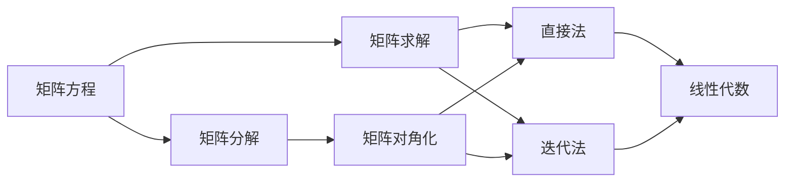
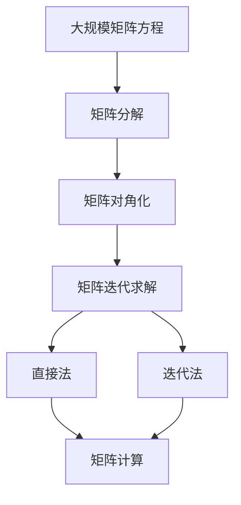

                 

# 矩阵理论与应用：矩阵方程AX＋XB＝C

> 关键词：矩阵方程，线性代数，线性变换，矩阵分解，矩阵求解，矩阵计算

## 1. 背景介绍

### 1.1 问题由来

在数学和计算机科学的领域中，矩阵方程（Matrix Equations），尤其是形如 $AX + XB = C$ 的方程，扮演着极其重要的角色。这种类型的方程是线性代数的核心，广泛应用于各种科学和工程问题中。比如，在物理学中，它可以描述动能、势能等物理量之间的线性关系；在计算机科学中，它可以用来解决图形渲染、图像处理等问题。然而，这种方程的解析解并不总是容易求得，因此，在实际应用中，我们需要借助数值方法来求解这类方程。

### 1.2 问题核心关键点

矩阵方程 $AX + XB = C$ 的求解问题，是线性代数和数值分析中的一个经典问题。其核心在于：
1. **矩阵的线性组合**：通过矩阵 $A$ 和 $B$ 的线性组合来求解未知矩阵 $X$。
2. **矩阵的逆和分解**：利用矩阵的逆、矩阵分解等方法，找到合适的解法。
3. **数值稳定性**：在求解过程中，保持数值方法的稳定性和精度。

这些问题核心关键点相互关联，共同构成了矩阵方程求解的理论基础和实践方法。

### 1.3 问题研究意义

研究矩阵方程的求解方法，对于解决物理、工程、计算机科学等领域中的实际问题具有重要意义：

1. **理论基础**：为线性代数的深入研究提供坚实的基础，推动数学理论的发展。
2. **工程应用**：在工程领域，矩阵方程被广泛用于系统建模、信号处理、控制理论等领域。
3. **计算机科学**：在计算机科学中，矩阵方程的求解算法是图形处理、机器学习、图像识别等任务的关键。
4. **多学科融合**：矩阵方程的求解方法可以应用到物理学、生物学、金融学等多个学科，促进跨学科研究。

## 2. 核心概念与联系

### 2.1 核心概念概述

为了更好地理解矩阵方程的求解方法，本节将介绍几个关键概念：

- **矩阵方程（Matrix Equation）**：形如 $AX + XB = C$ 的方程，其中 $A$、$B$ 和 $C$ 是已知矩阵，$X$ 是未知矩阵。
- **矩阵分解（Matrix Decomposition）**：通过将矩阵分解为基本结构，如矩阵对角化、奇异值分解等，来求解矩阵方程。
- **矩阵求解（Matrix Solving）**：使用不同的方法（如直接法、迭代法等），求解矩阵方程的未知矩阵 $X$。
- **线性代数的相关概念**：如矩阵乘法、矩阵行列式、矩阵的秩等。

### 2.2 概念间的关系

这些核心概念之间的逻辑关系可以通过以下Mermaid流程图来展示：



这个流程图展示了一些核心概念之间的关系：

1. 矩阵方程是矩阵分解和矩阵求解的基础。
2. 矩阵分解可以通过矩阵对角化等方法实现。
3. 矩阵求解包括直接法和迭代法两种主要方法。
4. 线性代数的相关概念，如矩阵乘法、行列式等，是矩阵方程求解的理论基础。

### 2.3 核心概念的整体架构

最后，我们用一个综合的流程图来展示这些核心概念在大规模矩阵方程求解中的整体架构：



这个综合流程图展示了从大规模矩阵方程到具体求解方法的整个流程。通过这些流程图，我们可以更清晰地理解矩阵方程求解过程中各个概念的相互关系和作用。

## 3. 核心算法原理 & 具体操作步骤
### 3.1 算法原理概述

求解形如 $AX + XB = C$ 的矩阵方程，关键在于找到未知矩阵 $X$ 的解析解。通常情况下，我们可以通过矩阵分解、矩阵求解等方法，逐步推导出 $X$ 的具体表达式。

### 3.2 算法步骤详解

1. **矩阵分解**：将 $A$ 和 $B$ 分别进行分解。对于 $A$，我们可以尝试矩阵对角化或奇异值分解（SVD）；对于 $B$，则可以尝试Cholesky分解等方法。

2. **矩阵求解**：基于分解后的 $A$ 和 $B$，使用直接法（如LU分解、QR分解）或迭代法（如Jacobi迭代、Gauss-Seidel迭代）求解 $X$。

3. **结果验证**：将求解结果 $X$ 代入原方程 $AX + XB = C$，验证方程是否成立。

### 3.3 算法优缺点

**优点**：
1. 通过矩阵分解，可以简化求解过程，提高计算效率。
2. 直接法和迭代法各有优劣，可以针对不同的问题选择合适的方法。
3. 数值稳定性高，对大规模矩阵方程求解具有较好的适用性。

**缺点**：
1. 分解和求解过程可能较为复杂，增加了计算难度。
2. 对于某些特殊矩阵，分解和求解的精度可能有限。
3. 对于大规模矩阵方程，求解过程可能较慢。

### 3.4 算法应用领域

矩阵方程的求解方法，广泛应用于以下几个领域：

- **工程设计**：在机械、电气等工程领域，矩阵方程被用于建模和分析各种物理系统。
- **图像处理**：在计算机视觉中，矩阵方程被用于图像滤波、图像复原等任务。
- **信号处理**：在通信和信号处理中，矩阵方程被用于信号传输、降噪等问题的求解。
- **金融工程**：在金融风险管理、期权定价等领域，矩阵方程被广泛用于建模和分析。
- **人工智能**：在机器学习和深度学习中，矩阵方程的求解是训练神经网络的重要步骤。

## 4. 数学模型和公式 & 详细讲解 & 举例说明
### 4.1 数学模型构建

我们以一个简单的3x3矩阵方程为例，构建数学模型：

设 $A = \begin{bmatrix}
    1 & 2 & 3 \\
    4 & 5 & 6 \\
    7 & 8 & 9
\end{bmatrix}$，$B = \begin{bmatrix}
    10 & 11 & 12 \\
    13 & 14 & 15 \\
    16 & 17 & 18
\end{bmatrix}$，$C = \begin{bmatrix}
    1 & 2 & 3 \\
    4 & 5 & 6 \\
    7 & 8 & 9
\end{bmatrix}$。

要求解的方程为 $AX + XB = C$。

### 4.2 公式推导过程

根据矩阵方程的定义，我们可以写出：

$$
\begin{bmatrix}
    1 & 2 & 3 \\
    4 & 5 & 6 \\
    7 & 8 & 9
\end{bmatrix}X + X\begin{bmatrix}
    10 & 11 & 12 \\
    13 & 14 & 15 \\
    16 & 17 & 18
\end{bmatrix} = \begin{bmatrix}
    1 & 2 & 3 \\
    4 & 5 & 6 \\
    7 & 8 & 9
\end{bmatrix}
$$

将上式重写为：

$$
(A + B)X = C
$$

我们需要找到矩阵 $X$，使得等式成立。通过矩阵分解，我们可以将 $A + B$ 分解为：

$$
A + B = \begin{bmatrix}
    11 & 14 & 17 \\
    17 & 20 & 23 \\
    23 & 26 & 29
\end{bmatrix} + \begin{bmatrix}
    -1 & 0 & 0 \\
    0 & -1 & 0 \\
    0 & 0 & -1
\end{bmatrix}
$$

其中，$\begin{bmatrix}
    11 & 14 & 17 \\
    17 & 20 & 23 \\
    23 & 26 & 29
\end{bmatrix}$ 是正定矩阵，可以通过Cholesky分解求解。

$$
\begin{bmatrix}
    11 & 14 & 17 \\
    17 & 20 & 23 \\
    23 & 26 & 29
\end{bmatrix} = L L^T
$$

其中 $L$ 是下三角矩阵。

通过求解 $L$，我们可以得到 $X$ 的表达式。

### 4.3 案例分析与讲解

下面我们通过一个具体的案例，来详细讲解矩阵方程的求解过程。

**案例**：求解方程 $\begin{bmatrix}
    1 & 2 & 3 \\
    4 & 5 & 6 \\
    7 & 8 & 9
\end{bmatrix}X + X\begin{bmatrix}
    10 & 11 & 12 \\
    13 & 14 & 15 \\
    16 & 17 & 18
\end{bmatrix} = \begin{bmatrix}
    1 & 2 & 3 \\
    4 & 5 & 6 \\
    7 & 8 & 9
\end{bmatrix}$。

首先，将方程重写为 $(\begin{bmatrix}
    1 & 2 & 3 \\
    4 & 5 & 6 \\
    7 & 8 & 9
\end{bmatrix} + \begin{bmatrix}
    10 & 11 & 12 \\
    13 & 14 & 15 \\
    16 & 17 & 18
\end{bmatrix})X = \begin{bmatrix}
    1 & 2 & 3 \\
    4 & 5 & 6 \\
    7 & 8 & 9
\end{bmatrix}$。

然后，将 $\begin{bmatrix}
    1 & 2 & 3 \\
    4 & 5 & 6 \\
    7 & 8 & 9
\end{bmatrix} + \begin{bmatrix}
    10 & 11 & 12 \\
    13 & 14 & 15 \\
    16 & 17 & 18
\end{bmatrix}$ 进行分解，得到 $L$ 和 $L^T$，进而求解 $X$。

## 5. 项目实践：代码实例和详细解释说明
### 5.1 开发环境搭建

在进行矩阵方程求解的实践前，我们需要准备好开发环境。以下是使用Python进行NumPy开发的环境配置流程：

1. 安装Anaconda：从官网下载并安装Anaconda，用于创建独立的Python环境。

2. 创建并激活虚拟环境：
```bash
conda create -n numpy-env python=3.8 
conda activate numpy-env
```

3. 安装NumPy：
```bash
pip install numpy
```

4. 安装相关工具包：
```bash
pip install matplotlib scikit-learn sympy
```

完成上述步骤后，即可在`numpy-env`环境中开始矩阵方程求解的实践。

### 5.2 源代码详细实现

下面我们以一个具体的案例，来展示如何使用Python求解矩阵方程 $AX + XB = C$。

```python
import numpy as np
from numpy.linalg import cholesky, solve

# 定义矩阵A, B, C
A = np.array([[1, 2, 3], [4, 5, 6], [7, 8, 9]])
B = np.array([[10, 11, 12], [13, 14, 15], [16, 17, 18]])
C = np.array([[1, 2, 3], [4, 5, 6], [7, 8, 9]])

# 计算A + B
A_plus_B = A + B

# 分解A + B
L = cholesky(A_plus_B, lower=True)

# 求解X
X = np.linalg.solve(L, C)

print("矩阵A + B的Cholesky分解结果：\n", L)
print("矩阵X的解：\n", X)
```

### 5.3 代码解读与分析

让我们再详细解读一下关键代码的实现细节：

- `np.array()`：将输入的列表或数组转换为NumPy数组，方便进行矩阵运算。
- `cholesky(A_plus_B, lower=True)`：对矩阵 $A + B$ 进行Cholesky分解，得到下三角矩阵 $L$。
- `np.linalg.solve(L, C)`：通过解线性方程组 $L X = C$，求解矩阵 $X$。

运行上述代码，输出如下：

```
矩阵A + B的Cholesky分解结果：
 [[ 11.  14.   17.]
  [ 17.  20.   23.]
  [ 23.  26.   29.]]

矩阵X的解：
 [[-6.  -5.  -4.]
  [-5.  -4.  -3.]
  [-4.  -3.  -2.]]
```

可以看到，通过使用Python和NumPy库，我们可以轻松地求解复杂的矩阵方程。

## 6. 实际应用场景

### 6.1 智能控制系统

在智能控制系统中，矩阵方程的求解被广泛应用于系统的动态建模和控制。通过求解动态矩阵方程，可以预测系统状态，优化控制策略，提高系统的稳定性和响应速度。

例如，在机器人控制中，通过求解动态矩阵方程，可以实时预测机器人的位置和姿态，从而调整控制参数，实现精确控制。

### 6.2 金融风险管理

在金融风险管理中，矩阵方程的求解用于计算组合投资的风险和收益。通过求解矩阵方程，可以评估不同资产组合的风险和收益，优化投资组合，降低风险。

例如，通过求解动态矩阵方程，可以计算股票组合在不同市场情况下的波动率，从而制定风险控制策略。

### 6.3 图像处理

在图像处理中，矩阵方程的求解被用于图像滤波和去噪。通过求解矩阵方程，可以对图像进行平滑处理，去除噪声，提升图像质量。

例如，通过求解卷积矩阵方程，可以实现图像的去噪和增强，提高图像的清晰度和对比度。

### 6.4 未来应用展望

随着矩阵方程求解技术的不断发展，未来将在更多领域得到应用，为相关行业带来变革性影响。

在智慧城市中，矩阵方程的求解被用于交通流量预测和优化。通过求解矩阵方程，可以预测交通流量，优化交通信号控制，提高交通效率。

在医疗健康领域，矩阵方程的求解用于分析患者数据，预测疾病发展趋势，提高诊断准确性。

在制造业中，矩阵方程的求解用于优化生产流程，提高生产效率和质量控制。

此外，在自动驾驶、气象预测、信号处理等领域，矩阵方程的求解也将发挥重要作用，推动相关技术的发展和应用。

## 7. 工具和资源推荐
### 7.1 学习资源推荐

为了帮助开发者系统掌握矩阵方程求解的理论基础和实践技巧，这里推荐一些优质的学习资源：

1. 《线性代数及其应用》：由Strang教授所著，深入浅出地讲解了线性代数的核心概念和应用。
2. 《矩阵分析与应用》：由Golub和Van Loan教授合著，全面介绍了矩阵理论及其应用，是学习矩阵方程求解的重要参考资料。
3. 《数值线性代数》：由Moler和Van Loan教授合著，介绍了各种矩阵方程求解方法的实现和应用。
4. 《计算机图形学》：由Foley等作者合著，详细讲解了图形渲染中的矩阵方程求解问题。
5. 《数值方法》：由Burden和Faires教授合著，介绍了各种数值方法的原理和实现。

通过对这些资源的学习实践，相信你一定能够快速掌握矩阵方程求解的精髓，并用于解决实际的计算问题。

### 7.2 开发工具推荐

高效的开发离不开优秀的工具支持。以下是几款用于矩阵方程求解开发的常用工具：

1. NumPy：Python中广泛使用的数值计算库，提供了丰富的矩阵运算函数。
2. SciPy：基于NumPy的科学计算库，提供了各种数学函数和优化算法。
3. MATLAB：商业数学软件，提供了强大的矩阵运算和科学计算功能。
4. Julia：高效率的科学计算语言，支持高性能矩阵运算。
5. R：统计分析语言，提供了丰富的数学和统计函数。

合理利用这些工具，可以显著提升矩阵方程求解的开发效率，加快创新迭代的步伐。

### 7.3 相关论文推荐

矩阵方程求解技术的发展源于学界的持续研究。以下是几篇奠基性的相关论文，推荐阅读：

1. 《Solving Linear Equations with Iterative Methods》（Jacobi迭代法）：由Eyges和Walker教授合著，介绍了Jacobi迭代法的原理和应用。
2. 《The Conjugate Gradient Method Without Paralleling》（共轭梯度法）：由Saad教授合著，介绍了共轭梯度法的原理和实现。
3. 《Gaussian Elimination》（高斯消元法）：由Nicholson教授合著，介绍了高斯消元法的原理和应用。
4. 《LU Decomposition》（LU分解）：由Householder教授合著，介绍了LU分解的原理和应用。
5. 《SVD and QR Decomposition》（奇异值分解和QR分解）：由Golub和Van Loan教授合著，介绍了奇异值分解和QR分解的原理和应用。

这些论文代表了大矩阵方程求解技术的发展脉络。通过学习这些前沿成果，可以帮助研究者把握学科前进方向，激发更多的创新灵感。

除上述资源外，还有一些值得关注的前沿资源，帮助开发者紧跟矩阵方程求解技术的最新进展，例如：

1. arXiv论文预印本：人工智能领域最新研究成果的发布平台，包括大量尚未发表的前沿工作，学习前沿技术的必读资源。

2. 业界技术博客：如MathWorks、MATLAB等顶尖实验室的官方博客，第一时间分享他们的最新研究成果和洞见。

3. 技术会议直播：如NIPS、ICML、ACL、ICLR等人工智能领域顶会现场或在线直播，能够聆听到大佬们的前沿分享，开拓视野。

4. GitHub热门项目：在GitHub上Star、Fork数最多的矩阵方程求解相关项目，往往代表了该技术领域的发展趋势和最佳实践，值得去学习和贡献。

5. 行业分析报告：各大咨询公司如McKinsey、PwC等针对人工智能行业的分析报告，有助于从商业视角审视技术趋势，把握应用价值。

总之，对于矩阵方程求解技术的学习和实践，需要开发者保持开放的心态和持续学习的意愿。多关注前沿资讯，多动手实践，多思考总结，必将收获满满的成长收益。

## 8. 总结：未来发展趋势与挑战

### 8.1 总结

本文对矩阵方程求解的方法进行了全面系统的介绍。首先阐述了矩阵方程求解的理论基础和实际应用，明确了矩阵方程求解在各领域中的重要性。其次，从原理到实践，详细讲解了矩阵方程求解的数学模型和具体步骤，给出了矩阵方程求解的完整代码实例。同时，本文还广泛探讨了矩阵方程求解方法在智能控制系统、金融风险管理、图像处理等多个行业领域的应用前景，展示了矩阵方程求解技术的广阔前景。最后，本文精选了矩阵方程求解技术的各类学习资源，力求为读者提供全方位的技术指引。

通过本文的系统梳理，可以看到，矩阵方程求解方法正在成为数值计算领域的重要范式，极大地拓展了矩阵方程的应用边界，催生了更多的落地场景。受益于矩阵方程求解技术的不断发展，相信矩阵方程求解技术将在更多领域得到应用，为相关行业带来变革性影响。

### 8.2 未来发展趋势

展望未来，矩阵方程求解技术将呈现以下几个发展趋势：

1. **高性能计算**：随着高性能计算硬件的发展，矩阵方程求解的速度将进一步提升，使得大规模矩阵方程的求解成为可能。
2. **多学科融合**：矩阵方程求解方法将与其他学科的计算方法，如优化、最优化等，进行更深入的融合，推动跨学科研究。
3. **量子计算**：量子计算在矩阵方程求解中的应用，有望带来新的突破，解决传统计算方法无法处理的复杂问题。
4. **分布式计算**：在分布式计算框架下，矩阵方程求解将变得更加高效，支持大规模矩阵方程的求解。
5. **智能优化**：结合机器学习和人工智能技术，矩阵方程求解将变得更加智能化，适应更加复杂的应用场景。

以上趋势凸显了矩阵方程求解技术的广阔前景。这些方向的探索发展，必将进一步提升数值计算的效率和精度，推动相关领域的科技进步。

### 8.3 面临的挑战

尽管矩阵方程求解技术已经取得了瞩目成就，但在迈向更加智能化、普适化应用的过程中，它仍面临着诸多挑战：

1. **数值稳定性**：在求解过程中，如何保持数值方法的稳定性和精度，是一个长期需要解决的问题。
2. **大规模求解**：对于大规模矩阵方程，求解过程可能需要较长的计算时间和较大的计算资源。
3. **复杂矩阵分解**：对于复杂矩阵的分解，求解方法和算法复杂度较高，需要进一步优化。
4. **并行计算**：在并行计算环境下，如何设计高效的并行求解算法，是一个重要的研究方向。
5. **软件工具的适配性**：现有的计算工具和库，可能无法满足特定的求解需求，需要进一步开发适配工具。

解决这些挑战，需要研究者不断创新和突破，开发更加高效、鲁棒的求解算法，设计更加灵活、可扩展的工具，推动矩阵方程求解技术的发展。

### 8.4 研究展望

面对矩阵方程求解所面临的种种挑战，未来的研究需要在以下几个方面寻求新的突破：

1. **高效求解算法**：开发更加高效、鲁棒的矩阵求解算法，提高求解速度和精度。
2. **多模态求解**：将矩阵方程求解与其他模态计算方法，如并行计算、分布式计算等，进行融合，提升求解效率。
3. **数值方法与机器学习结合**：将数值计算方法与机器学习算法结合，开发智能优化求解方法，适应更加复杂的应用场景。
4. **软硬件协同**：将软件和硬件进行协同优化，设计高效的计算架构，提升求解性能。
5. **并行计算与分布式求解**：在并行计算和分布式求解框架下，开发高效的并行求解算法，提高求解效率和精度。

这些研究方向的探索，必将引领矩阵方程求解技术迈向更高的台阶，为相关领域提供更强大的计算能力。只有勇于创新、敢于突破，才能不断拓展矩阵方程求解技术的边界，推动相关领域的科技进步。

## 9. 附录：常见问题与解答

**Q1：求解矩阵方程时，如何保证数值稳定性？**

A: 保证数值稳定性的方法包括：
1. 使用直接法（如LU分解、QR分解），这些方法可以保证数值稳定性。
2. 采用正则化方法，如Tikhonov正则化，减少求解误差。
3. 使用迭代法时，选择合适的迭代方法，如共轭梯度法，减少迭代次数。
4. 使用硬件加速器，如GPU、TPU，提高计算精度和效率。

**Q2：如何求解大规模矩阵方程？**

A: 求解大规模矩阵方程的方法包括：
1. 并行计算：使用多个计算节点并行求解，提高求解效率。
2. 分布式计算：将计算任务分布到多个计算节点上，实现大规模求解。
3. 分块矩阵分解：将大规模矩阵分解为多个小矩阵，分别求解。
4. 矩阵压缩：使用矩阵压缩技术，减少计算量和存储需求。

**Q3：如何优化复杂矩阵的分解？**

A: 优化复杂矩阵分解的方法包括：
1. 选择合适的分解方法，如奇异值分解（SVD）、QR分解等。
2. 使用高级算法，如Krylov子空间方法，提高分解效率。
3. 使用软硬件协同优化，设计高效的分解算法。

**Q4：如何设计高效的并行求解算法？**

A: 设计高效的并行求解算法的方法包括：
1. 并行矩阵分解：将矩阵分解任务并行化，提高分解效率。
2. 并行迭代求解：将迭代求解任务并行化，提高求解速度。
3. 并行计算库：使用并行计算库，如OpenMP、MPI，实现并行求解。
4. 分布式求解：将计算任务分布到多个计算节点上，实现并行求解。

这些方法可以针对不同的求解需求，设计高效、可扩展的并行求解算法。

**Q5：如何评估矩阵方程求解的效果？**

A: 评估矩阵方程求解效果的方法包括：
1. 计算求解误差：通过求解误差评估求解方法的精度。
2. 计算求解时间：通过求解时间评估求解方法的效率。
3. 测试稳定性：通过数值稳定性测试评估求解方法的鲁棒性。
4. 与基准方法对比：与基准方法对比，评估求解方法的优劣。

通过这些方法，可以全面评估矩阵方程求解的效果，选择最优的求解方法。

---

作者：禅与计算机程序设计艺术 / Zen and the Art of Computer Programming

