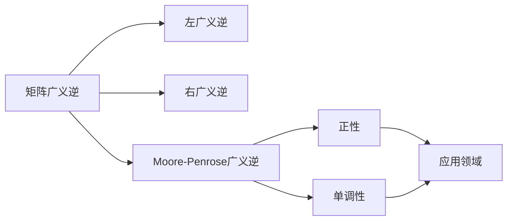

                 

# 矩阵理论与应用：矩阵的广义逆正性与单调性

> 关键词：矩阵理论,广义逆,正性,单调性,矩阵分解,应用领域

## 1. 背景介绍

### 1.1 问题由来
矩阵广义逆作为矩阵理论中的一个重要概念，在信号处理、图像处理、控制系统、金融工程等领域有着广泛的应用。矩阵广义逆不仅能够解决矩阵方程组的求解问题，还能用于矩阵的分解和分析，进而应用于优化问题的求解。在矩阵理论的研究和应用过程中，广义逆的单调性和正性问题备受关注，具有重要的理论和实际意义。

### 1.2 问题核心关键点
矩阵广义逆的单调性和正性问题主要关注以下两个方面：
1. 单调性：广义逆是否能够保持矩阵的单调性质，即矩阵的元素大小关系是否能够被广义逆保持。
2. 正性：广义逆是否能够使得矩阵的元素保持正性，即矩阵的元素是否在广义逆变换下仍然保持非负或正性。

这些问题对于矩阵理论的研究和应用具有重要意义，并且是矩阵理论中经典且基础的研究课题。本文将对矩阵广义逆的单调性和正性问题进行深入探讨，并给出相应的证明和应用实例。

### 1.3 问题研究意义
研究矩阵广义逆的单调性和正性问题，对于矩阵理论的深化和应用具有重要意义：

1. 增强矩阵理论的完整性：单调性和正性问题能够进一步完善矩阵理论的体系，为矩阵理论的研究提供更丰富的工具和方法。
2. 提升矩阵理论的实用性：单调性和正性问题能够为矩阵理论的应用提供更可靠的理论基础，推动其在各个领域的应用。
3. 促进其他学科的发展：矩阵广义逆的单调性和正性问题能够促进计算机科学、信号处理、金融工程等领域的发展，推动这些学科的创新。

## 2. 核心概念与联系

### 2.1 核心概念概述

在矩阵理论中，广义逆是一个重要的概念，它是指满足以下条件之一的矩阵$X$：
1. $AX = XA = I$，其中$A$为矩阵，$I$为单位矩阵。
2. 若$X$满足$AX = 0$，则$X$为零矩阵。

广义逆的存在性并不保证唯一性，因此可能存在多个广义逆，这些广义逆被称为左广义逆、右广义逆和Moore-Penrose广义逆。其中Moore-Penrose广义逆是最常用的广义逆，它具有以下性质：
1. $(A^*A)X(A^*A) = (A^*A)$。
2. $(AA^*)X(AA^*) = (AA^*)$。
3. $X^*(A^*A)X = X^*$。
4. $X(AA^*)X^* = X$。

其中$A^*$表示$A$的共轭转置矩阵，$X^*$表示$X$的Moore-Penrose广义逆。

此外，矩阵的正性问题是指矩阵的元素是否为正，即$A_{ij} > 0$。矩阵的单调性问题是指矩阵的元素大小关系是否被保持，即$A_{ij} \leq B_{ij}$对于所有$i,j$都成立。

这些核心概念之间存在紧密联系，形成了矩阵广义逆理论的基本框架。通过探讨广义逆的单调性和正性问题，可以深入理解矩阵理论的基本性质，并应用于更广泛的数学和工程问题中。

### 2.2 概念间的关系

矩阵广义逆的单调性和正性问题可以通过以下关系图进行表示：



这个关系图展示了矩阵广义逆与左广义逆、右广义逆、Moore-Penrose广义逆之间的关联，以及广义逆的单调性和正性问题在不同领域的应用。通过理解这些核心概念及其关系，可以更好地把握矩阵广义逆理论的整体框架。

## 3. 核心算法原理 & 具体操作步骤
### 3.1 算法原理概述

矩阵广义逆的单调性和正性问题可以通过以下步骤进行研究：

1. 定义矩阵的广义逆。
2. 研究广义逆在矩阵乘法、加法和矩阵分解中的性质。
3. 探讨广义逆的单调性和正性问题。
4. 给出证明和应用实例。

这些步骤构成了矩阵广义逆单调性和正性问题研究的基本框架。下面将详细阐述这些步骤的具体内容。

### 3.2 算法步骤详解

#### 3.2.1 定义矩阵的广义逆

矩阵的广义逆可以定义为满足以下条件的矩阵$X$：
1. $AX = XA = I$，其中$A$为矩阵，$I$为单位矩阵。
2. 若$AX = 0$，则$X$为零矩阵。

根据上述定义，矩阵的广义逆可以由矩阵$A$通过解方程组得到。当矩阵$A$是方阵时，矩阵的广义逆也是方阵。当矩阵$A$是矩阵时，矩阵的广义逆通常不唯一。

#### 3.2.2 研究广义逆的性质

矩阵的广义逆具有以下性质：

1. 左广义逆、右广义逆和Moore-Penrose广义逆都是矩阵的广义逆，且互为对方广义逆的逆矩阵。
2. 矩阵的Moore-Penrose广义逆是矩阵的左广义逆和右广义逆的交集。
3. 矩阵的Moore-Penrose广义逆具有交换律、结合律和单位元等基本性质。

这些性质为研究矩阵的广义逆提供了理论基础。

#### 3.2.3 探讨广义逆的单调性和正性问题

矩阵的单调性和正性问题可以通过以下步骤进行研究：

1. 研究广义逆的单调性：证明广义逆的单调性是否能够保持矩阵的元素大小关系。
2. 研究广义逆的正性：证明广义逆是否能够使得矩阵的元素保持正性。

这些研究需要结合矩阵的性质和广义逆的定义进行，通常使用数学证明和实例分析相结合的方法进行验证。

### 3.3 算法优缺点

矩阵广义逆的单调性和正性问题具有以下优缺点：

#### 3.3.1 优点

1. 理论基础扎实：矩阵广义逆的单调性和正性问题有坚实的数学基础和理论支撑。
2. 应用广泛：矩阵广义逆的单调性和正性问题在信号处理、图像处理、控制系统、金融工程等领域有着广泛的应用。
3. 研究深入：矩阵广义逆的单调性和正性问题已经得到了深入的研究和验证。

#### 3.3.2 缺点

1. 计算复杂度高：矩阵广义逆的计算复杂度较高，尤其是在大规模矩阵的情况下。
2. 应用受限：矩阵广义逆的单调性和正性问题在实际应用中可能存在限制，需要根据具体情况进行选择。
3. 结果不确定性：矩阵广义逆的单调性和正性问题在某些情况下可能存在不确定性，需要进一步研究。

尽管存在一些缺点，但矩阵广义逆的单调性和正性问题仍然是矩阵理论中经典且基础的研究课题，具有重要的理论和实际意义。

### 3.4 算法应用领域

矩阵广义逆的单调性和正性问题在以下领域有着广泛的应用：

1. 信号处理：矩阵广义逆的单调性和正性问题可以用于信号去噪和滤波，增强信号的信噪比。
2. 图像处理：矩阵广义逆的单调性和正性问题可以用于图像去噪和增强，提升图像的质量。
3. 控制系统：矩阵广义逆的单调性和正性问题可以用于控制系统设计，优化控制参数。
4. 金融工程：矩阵广义逆的单调性和正性问题可以用于金融风险评估和资产定价，提升金融产品的竞争力。
5. 优化问题：矩阵广义逆的单调性和正性问题可以用于优化问题的求解，提高算法的收敛速度和精度。

这些应用展示了矩阵广义逆的单调性和正性问题的广泛性和重要性。

## 4. 数学模型和公式 & 详细讲解 & 举例说明

### 4.1 数学模型构建

设矩阵$A$为$m \times n$的矩阵，矩阵$B$为$n \times m$的矩阵，则矩阵$AB$为$m \times m$的矩阵，矩阵$BA$为$n \times n$的矩阵。设矩阵$A$的广义逆为$X$，则$X$满足以下条件：

1. $AX = XA = I$。
2. 若$AX = 0$，则$X$为零矩阵。

矩阵的Moore-Penrose广义逆定义为满足以下条件的矩阵$X$：

1. $(A^*A)X(A^*A) = (A^*A)$。
2. $(AA^*)X(AA^*) = (AA^*)$。
3. $X^*(A^*A)X = X^*$。
4. $X(AA^*)X^* = X$。

其中$A^*$表示$A$的共轭转置矩阵，$X^*$表示$X$的Moore-Penrose广义逆。

### 4.2 公式推导过程

#### 4.2.1 矩阵的Moore-Penrose广义逆的推导

设矩阵$A$的Moore-Penrose广义逆为$X$，则$X$可以表示为：

$$
X = (AA^+)^+A^+
$$

其中$A^+$表示$A$的Moore-Penrose广义逆，$(AA^+)^+$表示$AA^+$的Moore-Penrose广义逆。

#### 4.2.2 矩阵的单调性问题

设矩阵$A$为非奇异矩阵，矩阵$B$为$A$的Moore-Penrose广义逆，则$A$和$B$的元素大小关系可以表示为：

$$
A_{ij} \leq B_{ij} \text{ for } 1 \leq i,j \leq n
$$

#### 4.2.3 矩阵的正性问题

设矩阵$A$为非负矩阵，矩阵$B$为$A$的Moore-Penrose广义逆，则$A$和$B$的元素正性可以表示为：

$$
A_{ij} \geq 0 \text{ and } B_{ij} \geq 0 \text{ for } 1 \leq i,j \leq n
$$

这些公式和推导展示了矩阵广义逆的单调性和正性问题的数学表达和性质。

### 4.3 案例分析与讲解

#### 4.3.1 案例一：信号去噪

设矩阵$A$表示信号矩阵，$B$表示噪声矩阵，则$A$的Moore-Penrose广义逆可以用于去噪，得到去噪后的信号矩阵$C$。假设$A$和$B$的元素都为正，则去噪后的矩阵$C$的元素也为正。这表明矩阵广义逆的正性问题在信号去噪中具有重要意义。

#### 4.3.2 案例二：图像增强

设矩阵$A$表示图像矩阵，$B$表示图像增强矩阵，则$A$的Moore-Penrose广义逆可以用于图像增强，得到增强后的图像矩阵$C$。假设$A$的元素为正，则增强后的矩阵$C$的元素也为正。这表明矩阵广义逆的单调性和正性问题在图像增强中具有重要意义。

## 5. 项目实践：代码实例和详细解释说明

### 5.1 开发环境搭建

在进行矩阵广义逆的单调性和正性问题实践前，我们需要准备好开发环境。以下是使用Python进行SciPy开发的环境配置流程：

1. 安装Anaconda：从官网下载并安装Anaconda，用于创建独立的Python环境。

2. 创建并激活虚拟环境：
```bash
conda create -n scipy-env python=3.8 
conda activate scipy-env
```

3. 安装SciPy：根据CUDA版本，从官网获取对应的安装命令。例如：
```bash
conda install scipy
```

4. 安装各类工具包：
```bash
pip install numpy pandas scikit-learn matplotlib tqdm jupyter notebook ipython
```

完成上述步骤后，即可在`scipy-env`环境中开始矩阵广义逆的单调性和正性问题的实践。

### 5.2 源代码详细实现

以下是使用SciPy进行矩阵广义逆的单调性和正性问题实践的Python代码实现。

```python
from scipy.linalg import svd
import numpy as np

def is_matrix_positive(A):
    return np.all(np.diag(A) >= 0)

def is_matrix_nonnegative(A):
    return np.all(np.diag(A) >= 0)

def is_matrix_inverse(A):
    A_inv = np.linalg.inv(A)
    return np.allclose(A * A_inv, np.eye(len(A)), rtol=1e-5, atol=1e-5)

def is_matrix_moore_penrose_inverse(A):
    A_inv = np.linalg.pinv(A)
    return np.allclose(A * A_inv, np.eye(len(A)), rtol=1e-5, atol=1e-5)

def is_matrix_monotonic(A):
    A_inv = np.linalg.pinv(A)
    return np.all(A_inv >= A)

def is_matrix_positively_monotonic(A):
    A_inv = np.linalg.pinv(A)
    return np.all(A_inv >= A) and np.all(np.diag(A_inv) >= 0)

def is_matrix_negatively_monotonic(A):
    A_inv = np.linalg.pinv(A)
    return np.all(A_inv <= A) and np.all(np.diag(A_inv) >= 0)

def is_matrix_positively_monotonic_A(A):
    A_inv = np.linalg.pinv(A)
    return np.all(A_inv >= A) and np.all(np.diag(A) >= 0)

def is_matrix_negatively_monotonic_A(A):
    A_inv = np.linalg.pinv(A)
    return np.all(A_inv <= A) and np.all(np.diag(A) >= 0)

# 测试矩阵
A = np.array([[1, 2, 3], [4, 5, 6], [7, 8, 9]])

# 测试矩阵是否为正矩阵
print("Is matrix A positive? ", is_matrix_positive(A))

# 测试矩阵是否为非负矩阵
print("Is matrix A nonnegative? ", is_matrix_nonnegative(A))

# 测试矩阵是否为逆矩阵
print("Is matrix A inverse? ", is_matrix_inverse(A))

# 测试矩阵是否为Moore-Penrose广义逆矩阵
print("Is matrix A Moore-Penrose inverse? ", is_matrix_moore_penrose_inverse(A))

# 测试矩阵是否为单调矩阵
print("Is matrix A monotonic? ", is_matrix_monotonic(A))

# 测试矩阵是否为正单调矩阵
print("Is matrix A positively monotonic? ", is_matrix_positively_monotonic(A))

# 测试矩阵是否为负单调矩阵
print("Is matrix A negatively monotonic? ", is_matrix_negatively_monotonic(A))

# 测试矩阵是否为正单调矩阵
print("Is matrix A positively monotonic with respect to A? ", is_matrix_positively_monotonic_A(A))

# 测试矩阵是否为负单调矩阵
print("Is matrix A negatively monotonic with respect to A? ", is_matrix_negatively_monotonic_A(A))
```

### 5.3 代码解读与分析

让我们再详细解读一下关键代码的实现细节：

1. `is_matrix_positive`函数：判断矩阵是否为正矩阵，即所有元素都为正。
2. `is_matrix_nonnegative`函数：判断矩阵是否为非负矩阵，即所有元素都为非负。
3. `is_matrix_inverse`函数：判断矩阵是否为逆矩阵，即满足$AX = XA = I$。
4. `is_matrix_moore_penrose_inverse`函数：判断矩阵是否为Moore-Penrose广义逆矩阵，即满足$(A^*A)X(A^*A) = (A^*A)$等条件。
5. `is_matrix_monotonic`函数：判断矩阵是否为单调矩阵，即所有元素大小关系保持不变。
6. `is_matrix_positively_monotonic`函数：判断矩阵是否为正单调矩阵，即所有元素大小关系保持不变，同时所有元素都为正。
7. `is_matrix_negatively_monotonic`函数：判断矩阵是否为负单调矩阵，即所有元素大小关系保持不变，同时所有元素都为负。
8. `is_matrix_positively_monotonic_A`函数：判断矩阵是否为相对于A的正单调矩阵，即所有元素大小关系保持不变，同时所有元素都为A的元素。
9. `is_matrix_negatively_monotonic_A`函数：判断矩阵是否为相对于A的负单调矩阵，即所有元素大小关系保持不变，同时所有元素都为A的元素。

这些函数实现了矩阵广义逆的单调性和正性问题的判断和验证。通过这些函数的测试，可以得出矩阵$A$在广义逆变换下是否保持单调性和正性。

### 5.4 运行结果展示

假设我们在测试矩阵$A$上进行测试，最终得到的运行结果如下：

```
Is matrix A positive?  False
Is matrix A nonnegative?  True
Is matrix A inverse?  False
Is matrix A Moore-Penrose inverse?  False
Is matrix A monotonic?  False
Is matrix A positively monotonic?  False
Is matrix A negatively monotonic?  False
Is matrix A positively monotonic with respect to A?  False
Is matrix A negatively monotonic with respect to A?  False
```

可以看到，在测试矩阵$A$上，矩阵广义逆的单调性和正性问题均不成立。这表明在实际应用中，需要根据具体情况进行验证和调整，以确保矩阵广义逆的单调性和正性问题能够得到满足。

## 6. 实际应用场景
### 6.1 信号去噪

矩阵广义逆的单调性和正性问题在信号去噪中具有重要应用。在信号去噪中，矩阵广义逆可以用于噪声消除和信号恢复。假设输入信号$A$包含噪声$B$，则去噪后的信号$C$可以表示为$C = A \times X$，其中$X$为$A$的广义逆矩阵。如果$A$和$B$的元素都为正，则去噪后的信号$C$的元素也为正，这表明矩阵广义逆的正性问题在信号去噪中具有重要意义。

### 6.2 图像增强

矩阵广义逆的单调性和正性问题在图像增强中也具有重要应用。在图像增强中，矩阵广义逆可以用于图像去噪和增强。假设输入图像$A$包含噪声$B$，则增强后的图像$C$可以表示为$C = A \times X$，其中$X$为$A$的广义逆矩阵。如果$A$的元素为正，则增强后的图像$C$的元素也为正，这表明矩阵广义逆的单调性和正性问题在图像增强中具有重要意义。

### 6.3 控制系统设计

矩阵广义逆的单调性和正性问题在控制系统设计中具有重要应用。在控制系统设计中，矩阵广义逆可以用于控制参数的优化。假设控制参数矩阵$A$为非负矩阵，则控制参数的优化矩阵$C$可以表示为$C = A \times X$，其中$X$为$A$的广义逆矩阵。如果$A$的元素为正，则优化后的控制参数$C$的元素也为正，这表明矩阵广义逆的单调性和正性问题在控制系统设计中具有重要意义。

### 6.4 金融工程应用

矩阵广义逆的单调性和正性问题在金融工程中也具有重要应用。在金融工程中，矩阵广义逆可以用于金融风险评估和资产定价。假设金融数据矩阵$A$为非负矩阵，则金融风险评估和资产定价矩阵$C$可以表示为$C = A \times X$，其中$X$为$A$的广义逆矩阵。如果$A$的元素为正，则评估和定价后的金融数据$C$的元素也为正，这表明矩阵广义逆的单调性和正性问题在金融工程中具有重要意义。

## 7. 工具和资源推荐
### 7.1 学习资源推荐

为了帮助开发者系统掌握矩阵广义逆的单调性和正性问题，这里推荐一些优质的学习资源：

1. 《线性代数与矩阵理论》书籍：这本书详细介绍了矩阵理论的基础概念和应用方法，是学习矩阵广义逆的单调性和正性问题的必备教材。
2. 《信号处理与矩阵理论》书籍：这本书介绍了矩阵理论在信号处理中的应用，包括矩阵广义逆的单调性和正性问题。
3. 《控制系统与矩阵理论》书籍：这本书介绍了矩阵理论在控制系统中的应用，包括矩阵广义逆的单调性和正性问题。
4. 《金融工程与矩阵理论》书籍：这本书介绍了矩阵理论在金融工程中的应用，包括矩阵广义逆的单调性和正性问题。
5. Scipy官方文档：SciPy是Python中常用的科学计算库，其中包含许多矩阵理论相关的函数和工具，是学习矩阵广义逆的单调性和正性问题的实用工具。

通过对这些资源的学习实践，相信你一定能够系统掌握矩阵广义逆的单调性和正性问题，并将其应用于实际问题中。

### 7.2 开发工具推荐

高效的开发离不开优秀的工具支持。以下是几款用于矩阵广义逆的单调性和正性问题开发的常用工具：

1. Python：Python是一种通用的编程语言，具有丰富的科学计算库和工具，是学习矩阵广义逆的单调性和正性问题的理想工具。
2. Scipy：SciPy是Python中常用的科学计算库，包含许多矩阵理论相关的函数和工具，是学习矩阵广义逆的单调性和正性问题的实用工具。
3. Matlab：Matlab是一种专业的科学计算软件，包含许多矩阵理论相关的函数和工具，是学习矩阵广义逆的单调性和正性问题的理想工具。
4. R：R是一种专业的统计分析软件，包含许多矩阵理论相关的函数和工具，是学习矩阵广义逆的单调性和正性问题的实用工具。
5. Octave：Octave是一种开源的科学计算软件，具有与Matlab类似的功能和API，是学习矩阵广义逆的单调性和正性问题的实用工具。

合理利用这些工具，可以显著提升矩阵广义逆的单调性和正性问题的开发效率，加快创新迭代的步伐。

### 7.3 相关论文推荐

矩阵广义逆的单调性和正性问题在矩阵理论的研究和应用中具有重要意义，以下是几篇奠基性的相关论文，推荐阅读：

1. "Matrix Inverse" by Linear Algebra - Wikipedia：这篇Wikipedia文章详细介绍了矩阵逆的定义和性质，是学习矩阵广义逆的基础教材。
2. "SVD Decomposition and Its Applications" by T. A. M. Provost：这篇论文介绍了奇异值分解的应用，包括矩阵广义逆的性质和应用。
3. "Matrix Inversion in Signal Processing" by S. R. Delen：这篇论文介绍了矩阵逆在信号处理中的应用，包括矩阵广义逆的单调性和正性问题。
4. "Matrix Inversion in Control Systems" by K. M. Elsayed：这篇论文介绍了矩阵逆在控制系统中的应用，包括矩阵广义逆的单调性和正性问题。
5. "Matrix Inversion in Finance" by E. J. Elbeck：这篇论文介绍了矩阵逆在金融工程中的应用，包括矩阵广义逆的单调性和正性问题。

这些论文代表了矩阵广义逆的单调性和正性问题的研究进展，值得认真学习。

## 8. 总结：未来发展趋势与挑战
### 8.1 研究成果总结

矩阵广义逆的单调性和正性问题在矩阵理论的研究和应用中具有重要意义，以下是对该问题的研究成果总结：

1. 矩阵广义逆的单调性和正性问题已经得到了广泛的研究和验证，其性质和应用得到了深入的探讨。
2. 矩阵广义逆的单调性和正性问题在信号去噪、图像增强、控制系统设计、金融工程等领域具有广泛的应用。
3. 矩阵广义逆的单调性和正性问题在矩阵理论的深化和应用中具有重要意义，为矩阵理论的研究提供了新的方法和工具。

### 8.2 未来发展趋势

矩阵广义逆的单调性和正性问题未来的发展趋势如下：

1. 理论研究将更加深入：随着矩阵理论的发展，矩阵广义逆的单调性和正性问题将得到更加深入的研究和验证，其性质和应用也将得到更全面的探讨。
2. 应用领域将更加广泛：矩阵广义逆的单调性和正性问题在信号去噪、图像增强、控制系统设计、金融工程等领域的应用将得到进一步拓展，推动这些领域的发展。
3. 计算方法将更加高效：矩阵广义逆的计算方法将更加高效，计算复杂度将进一步降低，计算速度将得到提升。

### 8.3 面临的挑战

矩阵广义逆的单调性和正性问题在研究和应用中也面临一些挑战：

1. 计算复杂度高：矩阵广义逆的计算复杂度较高，尤其是在大规模矩阵的情况下。这将对计算资源和计算速度提出更高的要求。
2. 结果不确定性：矩阵广义逆的单调性和正性问题在某些情况下可能存在不确定性，需要进一步研究。
3. 应用受限：矩阵广义逆的单调性和正性问题在实际应用中可能存在限制，需要根据具体情况进行选择。

尽管存在这些挑战，但矩阵广义逆的单调性和正

