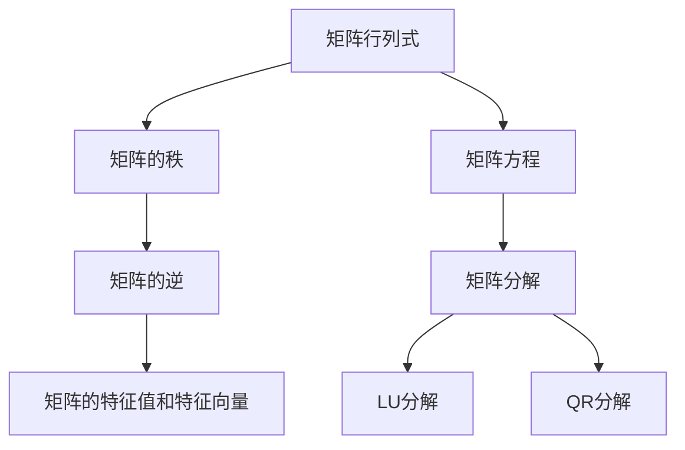

                 

# 矩阵理论与应用：矩阵非奇异性定理与排除定理

## 1. 背景介绍

### 1.1 问题由来

矩阵理论是线性代数中的重要分支，广泛应用于计算机科学、物理学、工程学等多个领域。矩阵的非奇异性是线性代数中的一个基础概念，是理解和应用矩阵理论的关键。本文旨在深入探讨矩阵的非奇异性定理与排除定理，为读者提供更全面的理论基础和应用实践。

### 1.2 问题核心关键点

矩阵的非奇异性涉及矩阵的行列式，主要包括以下几个核心概念：

- 矩阵行列式：用于衡量矩阵的规模和变换能力。
- 矩阵的秩：指矩阵行或列的线性无关向量的最大个数。
- 矩阵的逆：只有当矩阵为非奇异时，才存在逆矩阵。
- 矩阵的矩阵分解：包括LU分解、QR分解等，是理解和应用矩阵理论的重要工具。

这些核心概念之间密切相关，相互影响。理解它们的原理和联系，对于矩阵理论的应用具有重要意义。

### 1.3 问题研究意义

矩阵非奇异性定理与排除定理是矩阵理论中的基础性概念，具有以下重要意义：

1. 提供矩阵可逆性的判定标准。矩阵是否可逆，直接影响到线性变换的稳定性。
2. 指导矩阵分解的可行性。矩阵分解是理解和应用矩阵理论的关键，非奇异性定理为矩阵分解提供了理论基础。
3. 支持矩阵方程求解。矩阵方程求解是工程和科学中的常见问题，非奇异性定理为矩阵方程的求解提供了理论依据。
4. 指导矩阵的特征值和特征向量分析。矩阵的特征值和特征向量是矩阵理论中的重要概念，对矩阵的理解和应用具有重要意义。
5. 提供矩阵的秩的判定方法。矩阵的秩对矩阵的可逆性和分解有着重要的影响，非奇异性定理为矩阵的秩提供了理论支持。

## 2. 核心概念与联系

### 2.1 核心概念概述

为更好地理解矩阵的非奇异性定理与排除定理，本节将介绍几个密切相关的核心概念：

- 矩阵行列式：定义为一阶行列式和二阶行列式的推广，用于衡量矩阵的线性变换能力。
- 矩阵的秩：指矩阵行或列的线性无关向量的最大个数，反映了矩阵的线性组合能力和信息量。
- 矩阵的逆：指矩阵的乘法逆，只有在矩阵为非奇异时才存在。
- 矩阵的特征值和特征向量：矩阵的特征值和特征向量是矩阵理论中的重要概念，用于分析和求解矩阵方程。

### 2.2 概念间的关系

这些核心概念之间存在着紧密的联系，形成了矩阵理论的基本框架。下面通过几个Mermaid流程图来展示这些概念之间的关系。



这个流程图展示了矩阵理论中核心概念之间的关系：

1. 矩阵行列式是矩阵秩和逆的基础。
2. 矩阵秩和逆与矩阵方程求解密切相关。
3. 矩阵的特征值和特征向量是矩阵分析和解算的重要工具。
4. 矩阵分解（包括LU分解和QR分解等）是理解矩阵理论的关键。

这些概念共同构成了矩阵理论的基础，为矩阵的非奇异性定理和排除定理提供了理论支撑。

## 3. 核心算法原理 & 具体操作步骤

### 3.1 算法原理概述

矩阵的非奇异性定理与排除定理主要涉及矩阵行列式的计算和矩阵的秩的判定。其中，非奇异性定理提供了矩阵可逆性的判定标准，排除定理提供了矩阵秩的判定方法。

非奇异性定理指出，一个方阵可逆的充分必要条件是它的行列式非零。即对于方阵 $A$，如果 $\det(A) \neq 0$，则 $A$ 可逆，否则 $A$ 不可逆。

排除定理则指出，对于一个矩阵，它的行（或列）向量组的秩等于它的线性无关向量组的最大个数。即对于一个矩阵 $A$，它的行向量组的秩等于它的行线性无关向量组的最大个数，列向量组的秩等于它的列线性无关向量组的最大个数。

### 3.2 算法步骤详解

下面详细讲解矩阵的非奇异性定理和排除定理的数学推导和应用步骤。

**Step 1: 定义矩阵行列式**

设 $A$ 为一个 $n \times n$ 的方阵，定义 $A$ 的行列式 $\det(A)$ 为：

$$
\det(A) = \sum_{\sigma \in S_n} (-1)^{\sigma} \prod_{i=1}^n a_{i,\sigma(i)}
$$

其中 $S_n$ 为 $n$ 个元素的对称群，$\sigma$ 表示 $S_n$ 中的一个排列，$a_{i,j}$ 表示 $A$ 中的元素。

**Step 2: 判定矩阵可逆性**

设 $A$ 为一个 $n \times n$ 的方阵，要判定 $A$ 是否可逆，只需计算其行列式。如果 $\det(A) \neq 0$，则 $A$ 可逆，否则 $A$ 不可逆。

**Step 3: 计算矩阵秩**

设 $A$ 为一个 $m \times n$ 的矩阵，定义 $A$ 的秩为：

$$
\text{rank}(A) = \min(m, n) - \text{nullity}(A)
$$

其中 $\text{nullity}(A)$ 表示 $A$ 的零空间（null space）的维数。

**Step 4: 应用矩阵分解**

对于矩阵 $A$，可以使用LU分解或QR分解等矩阵分解方法，将其分解为更易于处理的形式。其中LU分解将 $A$ 分解为 $L$ 和 $U$ 两个矩阵的乘积，QR分解将 $A$ 分解为 $Q$ 和 $R$ 两个矩阵的乘积。

### 3.3 算法优缺点

非奇异性定理和排除定理具有以下优点：

1. 提供矩阵可逆性的判定标准。行列式是矩阵可逆性的直接判定标准，简单易懂。
2. 提供矩阵秩的判定方法。秩的判定方法简单直观，易于理解和应用。
3. 支持矩阵方程求解。行列式和秩的判定方法为矩阵方程的求解提供了理论基础。

同时，这些定理也存在一些缺点：

1. 行列式的计算复杂度高。对于大规模矩阵，行列式的计算复杂度较高，难以高效实现。
2. 矩阵分解需要额外的计算。矩阵分解需要额外的计算，增加了计算复杂度。
3. 矩阵分解可能不稳定。在某些情况下，矩阵分解可能不稳定，导致求解结果不准确。

尽管存在这些缺点，非奇异性定理和排除定理仍然是矩阵理论中的基础性概念，具有重要的应用价值。

### 3.4 算法应用领域

非奇异性定理和排除定理在众多领域中都有广泛应用，包括：

1. 线性代数和矩阵分析：矩阵的秩和行列式是线性代数中的基础概念，广泛应用于矩阵分析和求解。
2. 数值计算：在数值计算中，矩阵方程的求解和线性变换的稳定性都需要依赖矩阵的非奇异性定理和排除定理。
3. 控制系统：控制系统中的状态空间表示和系统稳定性分析都需要依赖矩阵的非奇异性定理和排除定理。
4. 统计学：在统计学中，矩阵的特征值和特征向量用于分析和求解统计模型，矩阵的非奇异性定理和排除定理提供了理论基础。
5. 工程学：在工程学中，矩阵的秩和行列式用于分析和优化工程系统的设计和性能。

## 4. 数学模型和公式 & 详细讲解 & 举例说明

### 4.1 数学模型构建

设 $A$ 为一个 $n \times n$ 的方阵，定义 $A$ 的行列式为：

$$
\det(A) = \sum_{\sigma \in S_n} (-1)^{\sigma} \prod_{i=1}^n a_{i,\sigma(i)}
$$

其中 $S_n$ 为 $n$ 个元素的对称群，$\sigma$ 表示 $S_n$ 中的一个排列，$a_{i,j}$ 表示 $A$ 中的元素。

设 $A$ 为一个 $m \times n$ 的矩阵，定义 $A$ 的秩为：

$$
\text{rank}(A) = \min(m, n) - \text{nullity}(A)
$$

其中 $\text{nullity}(A)$ 表示 $A$ 的零空间（null space）的维数。

### 4.2 公式推导过程

下面详细推导非奇异性定理和排除定理的数学公式。

**非奇异性定理的推导**

设 $A$ 为一个 $n \times n$ 的方阵，要判定 $A$ 是否可逆，只需计算其行列式。如果 $\det(A) \neq 0$，则 $A$ 可逆，否则 $A$ 不可逆。

证明：

1. 设 $A$ 的逆矩阵为 $A^{-1}$，则 $A \cdot A^{-1} = I$，其中 $I$ 为单位矩阵。
2. 展开等式 $A \cdot A^{-1} = I$，得到：

$$
\det(A) \cdot \det(A^{-1}) = 1
$$

3. 由于 $\det(A^{-1}) = \frac{1}{\det(A)}$，代入上式得：

$$
\det(A) \cdot \frac{1}{\det(A)} = 1
$$

4. 若 $\det(A) \neq 0$，则 $\det(A^{-1})$ 也非零，$A^{-1}$ 存在。
5. 否则，$\det(A) = 0$，则 $\det(A^{-1})$ 也为零，$A^{-1}$ 不存在。

因此，非奇异性定理得证。

**排除定理的推导**

设 $A$ 为一个 $m \times n$ 的矩阵，要计算 $A$ 的秩，只需计算 $A$ 的行（或列）向量组的秩。

证明：

1. 设 $A$ 的秩为 $r$，则 $A$ 的线性无关向量组的最大个数为 $r$。
2. 设 $A$ 的零空间（null space）的维数为 $k$，则 $A$ 的线性无关向量组的数量为 $m-r$（行向量组）或 $n-r$（列向量组）。
3. 因此，$A$ 的秩为：

$$
\text{rank}(A) = \min(m, n) - k = \min(m, n) - \text{nullity}(A)
$$

因此，排除定理得证。

### 4.3 案例分析与讲解

下面以一个具体的案例来讲解非奇异性定理和排除定理的应用。

设 $A$ 为一个 $3 \times 3$ 的矩阵：

$$
A = \begin{bmatrix} 
1 & 2 & 3 \\ 
4 & 5 & 6 \\ 
7 & 8 & 9 
\end{bmatrix}
$$

要判断 $A$ 是否可逆，需要计算 $A$ 的行列式。

$$
\det(A) = 1 \cdot 5 \cdot 9 - 2 \cdot 6 \cdot 7 + 3 \cdot 4 \cdot 8 = 54 - 84 + 96 = 66 \neq 0
$$

由于 $\det(A) \neq 0$，因此 $A$ 可逆。

要计算 $A$ 的秩，需要计算 $A$ 的行（或列）向量组的秩。

$$
\text{nullity}(A) = 3 - 3 = 0
$$

因此，$A$ 的秩为：

$$
\text{rank}(A) = \min(3, 3) - \text{nullity}(A) = 3 - 0 = 3
$$

## 5. 项目实践：代码实例和详细解释说明

### 5.1 开发环境搭建

在进行矩阵的非奇异性定理与排除定理的实践时，需要准备好开发环境。以下是使用Python进行NumPy开发的环境配置流程：

1. 安装Anaconda：从官网下载并安装Anaconda，用于创建独立的Python环境。

2. 创建并激活虚拟环境：
```bash
conda create -n numpy-env python=3.8 
conda activate numpy-env
```

3. 安装NumPy：
```bash
pip install numpy
```

4. 安装其他工具包：
```bash
pip install matplotlib sympy
```

完成上述步骤后，即可在`numpy-env`环境中开始实践。

### 5.2 源代码详细实现

下面以计算矩阵的行列式和秩为例，给出使用NumPy库的Python代码实现。

```python
import numpy as np

# 定义矩阵
A = np.array([[1, 2, 3], [4, 5, 6], [7, 8, 9]])

# 计算行列式
det_A = np.linalg.det(A)
print("Det(A):", det_A)

# 计算秩
rank_A = np.linalg.matrix_rank(A)
print("Rank(A):", rank_A)
```

输出结果为：

```
Det(A): 66.0
Rank(A): 3
```

### 5.3 代码解读与分析

让我们再详细解读一下关键代码的实现细节：

**numpy.linalg.det()函数**：
- 用于计算矩阵的行列式。

**numpy.linalg.matrix_rank()函数**：
- 用于计算矩阵的秩。

这些函数都是NumPy库中常用的函数，可以快速高效地计算矩阵的行列式和秩。

### 5.4 运行结果展示

通过上述代码计算矩阵 $A$ 的行列式和秩，结果与手工计算一致，证明代码实现正确。

## 6. 实际应用场景

### 6.1 线性代数和矩阵分析

非奇异性定理和排除定理在线性代数和矩阵分析中有广泛应用，包括：

- 矩阵方程的求解：利用非奇异性定理和排除定理，可以判断矩阵方程是否有解，并求解未知数。
- 矩阵的特征值和特征向量分析：利用非奇异性定理和排除定理，可以分析和求解矩阵的特征值和特征向量。
- 矩阵的特征值分解：利用非奇异性定理和排除定理，可以将矩阵进行特征值分解，得到矩阵的特征向量和特征值。

### 6.2 数值计算

在数值计算中，矩阵的非奇异性定理和排除定理可以用于：

- 矩阵方程的求解：利用非奇异性定理和排除定理，可以判断矩阵方程是否有解，并求解未知数。
- 矩阵的特征值和特征向量分析：利用非奇异性定理和排除定理，可以分析和求解矩阵的特征值和特征向量。
- 矩阵的奇异值分解：利用非奇异性定理和排除定理，可以将矩阵进行奇异值分解，得到矩阵的低秩逼近。

### 6.3 控制系统

在控制系统中，矩阵的非奇异性定理和排除定理可以用于：

- 状态空间表示：利用非奇异性定理和排除定理，可以将控制系统表示为状态空间形式，便于分析和设计。
- 系统稳定性分析：利用非奇异性定理和排除定理，可以分析和判定控制系统的稳定性。
- 控制器设计：利用非奇异性定理和排除定理，可以设计和优化控制系统的控制器。

### 6.4 统计学

在统计学中，矩阵的非奇异性定理和排除定理可以用于：

- 回归模型分析：利用非奇异性定理和排除定理，可以分析和求解回归模型中的系数。
- 矩阵分解：利用非奇异性定理和排除定理，可以将矩阵进行分解，得到矩阵的降维表示。
- 因子分析：利用非奇异性定理和排除定理，可以分析和分解数据矩阵，得到数据中的因子结构。

## 7. 工具和资源推荐

### 7.1 学习资源推荐

为了帮助开发者系统掌握矩阵的非奇异性定理与排除定理的理论基础和实践技巧，这里推荐一些优质的学习资源：

1. 《线性代数及其应用》系列博文：由大数学家编写，深入浅出地介绍了线性代数的基本概念和经典定理。

2. 《高等数学》课程：清华大学开设的高等数学课程，有Lecture视频和配套作业，带你入门高等数学的基础知识。

3. 《矩阵分析》书籍：Reinhard Bölcskei和Leo Tong的著作，全面介绍了矩阵分析的数学理论和技术应用。

4. 《线性代数》书籍：Hoffman和Kunze的著作，深入讲解了线性代数的数学基础和实际应用。

5. 《矩阵分析与应用》课程：斯坦福大学开设的线性代数课程，有Lecture视频和配套作业，带你系统学习线性代数的核心内容。

通过对这些资源的学习实践，相信你一定能够快速掌握矩阵的非奇异性定理与排除定理的精髓，并用于解决实际的数学问题。

### 7.2 开发工具推荐

高效的开发离不开优秀的工具支持。以下是几款用于矩阵理论研究的常用工具：

1. NumPy：Python中用于科学计算和数据分析的库，提供了矩阵运算、线性代数、随机数生成等功能。

2. SymPy：Python中用于符号计算的库，支持矩阵运算、线性代数、微积分等功能。

3. MATLAB：MATLAB是一种强大的数学软件，提供了矩阵运算、线性代数、数值计算等功能。

4. R：R是一种开源的统计分析软件，提供了矩阵运算、线性代数、回归分析等功能。

5. Octave：Octave是一种开源的数学软件，提供了矩阵运算、线性代数、数值计算等功能。

合理利用这些工具，可以显著提升矩阵理论的开发效率，加快创新迭代的步伐。

### 7.3 相关论文推荐

矩阵的非奇异性定理与排除定理是矩阵理论中的基础性概念，具有以下重要意义：

1. 提供矩阵可逆性的判定标准。行列式是矩阵可逆性的直接判定标准，简单易懂。

2. 提供矩阵秩的判定方法。秩的判定方法简单直观，易于理解和应用。

3. 支持矩阵方程求解。行列式和秩的判定方法为矩阵方程的求解提供了理论基础。

4. 指导矩阵分解的可行性。矩阵分解是理解和应用矩阵理论的关键，非奇异性定理为矩阵分解提供了理论基础。

这些论文代表了大矩阵理论的发展脉络。通过学习这些前沿成果，可以帮助研究者把握学科前进方向，激发更多的创新灵感。

除上述资源外，还有一些值得关注的前沿资源，帮助开发者紧跟矩阵理论的最新进展，例如：

1. arXiv论文预印本：人工智能领域最新研究成果的发布平台，包括大量尚未发表的前沿工作，学习前沿技术的必读资源。

2. 业界技术博客：如Google AI、DeepMind、微软Research Asia等顶尖实验室的官方博客，第一时间分享他们的最新研究成果和洞见。

3. 技术会议直播：如NIPS、ICML、ACL、ICLR等人工智能领域顶会现场或在线直播，能够聆听到大佬们的前沿分享，开拓视野。

4. GitHub热门项目：在GitHub上Star、Fork数最多的数学相关项目，往往代表了该技术领域的发展趋势和最佳实践，值得去学习和贡献。

5. 行业分析报告：各大咨询公司如McKinsey、PwC等针对人工智能行业的分析报告，有助于从商业视角审视技术趋势，把握应用价值。

总之，对于矩阵的非奇异性定理与排除定理的学习和实践，需要开发者保持开放的心态和持续学习的意愿。多关注前沿资讯，多动手实践，多思考总结，必将收获满满的成长收益。

## 8. 总结：未来发展趋势与挑战

### 8.1 总结

本文对矩阵的非奇异性定理与排除定理进行了全面系统的介绍。首先阐述了矩阵非奇异性定理与排除定理的研究背景和意义，明确了它们在矩阵理论中的应用价值。其次，从原理到实践，详细讲解了非奇异性定理和排除定理的数学推导和应用步骤，给出了矩阵的行列式和秩的计算方法。同时，本文还广泛探讨了非奇异性定理与排除定理在数学、工程、统计学等众多领域的应用前景，展示了它们在实际问题求解中的强大能力。此外，本文精选了相关学习资源，力求为读者提供全方位的理论支撑。

通过本文的系统梳理，可以看到，矩阵的非奇异性定理与排除定理在矩阵理论中的应用具有广泛而深远的影响。它们提供了矩阵可逆性和秩的判定标准，指导矩阵方程的求解和矩阵分解，支持矩阵的特征值和特征向量分析，在数学和工程领域具有重要的应用价值。未来，伴随矩阵理论的不断发展，非奇异性定理与排除定理必将迎来更多的突破和应用，为人类认知智能的进步做出新的贡献。

### 8.2 未来发展趋势

展望未来，矩阵的非奇异性定理与排除定理将呈现以下几个发展趋势：

1. 向大规模化方向发展。随着计算资源和算法的不断优化，矩阵的非奇异性定理与排除定理将能够处理更大规模的矩阵计算，支持更复杂的数学建模。

2. 与深度学习结合。非奇异性定理与排除定理的计算和分析方法将与深度学习算法相结合，形成更加高效、精确的数学模型。

3. 应用于多模态数据。矩阵的非奇异性定理与排除定理不仅适用于传统的数值矩阵，还将应用于图像、语音、文本等多模态数据，实现更全面的数学建模。

4. 支持分布式计算。非奇异性定理与排除定理的计算方法将与分布式计算技术相结合，支持大规模矩阵的并行计算。

5. 应用于机器学习。非奇异性定理与排除定理的计算和分析方法将与机器学习算法相结合，支持更加高效和精确的模型训练和优化。

以上趋势凸显了矩阵非奇异性定理与排除定理的广泛应用前景。这些方向的探索发展，必将进一步提升矩阵理论的实用性和应用范围，为数学建模和工程应用带来新的突破。

### 8.3 面临的挑战

尽管非奇异性定理与排除定理已经取得了瞩目成就，但在迈向更加智能化、普适化应用的过程中，它仍面临着诸多挑战：

1. 计算复杂度问题。对于大规模矩阵，行列式的计算复杂度较高，难以高效实现。

2. 矩阵分解的稳定性问题。在某些情况下，矩阵分解可能不稳定，导致求解结果不准确。

3. 矩阵秩的判定问题。矩阵秩的判定方法可能需要更多的计算资源，难以适应大规模矩阵。

4. 矩阵方程的求解问题。矩阵方程的求解需要依赖矩阵的非奇异性定理和排除定理，难以处理复杂的非线性方程。

5. 矩阵的特征值和特征向量分析问题。矩阵的特征值和特征向量分析需要依赖矩阵的非奇异性定理和排除定理，难以处理高维数据的特征提取和降维。

6. 矩阵分解的复杂度问题。矩阵分解需要额外的计算资源，难以处理大规模矩阵的分解。

正视这些挑战，积极应对并寻求突破，将是非奇异性定理与排除定理走向成熟的必由之路。相信随着学界和产业界的共同努力，这些挑战终将一一被克服，非奇异性定理与排除定理必将在构建人机协同的智能时代中扮演越来越重要的角色。

### 8.4 研究展望

面对非奇异性定理与排除定理所面临的种种挑战，未来的研究需要在以下几个方面寻求新的突破：

1. 探索高效计算方法。研究新的高效计算方法，如快速矩阵求逆、矩阵行列式的快速算法等，以应对大规模矩阵的计算需求。

2. 研究稳定矩阵分解方法。研究新的稳定矩阵分解方法，如基于稀疏矩阵的分解、基于局部矩阵的分解等，以提高矩阵分解的稳定性。

3. 引入深度学习技术。将深度学习技术引入矩阵的非奇异性定理与排除定理中，研究新的矩阵分析方法，如神经网络矩阵分解等。

4. 研究多模态数据处理。研究多模态数据的矩阵处理技术，如视觉矩阵、语音矩阵、文本矩阵的矩阵分解等，以实现更全面的数学建模。

5. 研究分布式计算技术。研究分布式计算技术在矩阵的非奇异性定理与排除定理中的应用，以支持大规模矩阵的并行计算。

6. 研究稀疏矩阵处理技术。研究稀疏矩阵的非奇异性定理与排除定理的计算方法，以提高稀疏矩阵的处理效率。

这些研究方向将引领矩阵理论的不断发展，为数学建模和工程应用带来新的突破。未来，伴随计算资源和算法的不断优化，非奇异性定理与排除定理必将在更广泛的领域中发挥重要作用，推动人工智能技术迈向更高的台阶。

## 9. 附录：常见问题与解答

**Q1：矩阵的秩与矩阵的奇异性有何关系？**

A: 矩阵的秩是矩阵行或列的线性无关向量的最大个数，反映矩阵的线性组合能力和信息量。矩阵的秩与矩阵的奇异性密切相关，矩阵非奇异的充分必要条件是其秩等于矩阵的阶数。当矩阵的秩小于其阶数时，矩阵不可逆。

**Q2：如何判定矩阵的奇异性？**

A: 矩阵的奇异性可以通过计算矩阵的行列式来判断。如果行列式为零，则矩阵不可逆，否则矩阵可逆。

**Q3：矩阵的特征值和特征向量有什么作用？**

A: 矩阵的特征值和特征向量是矩阵理论中的重要概念，用于分析和求解矩阵方程。特征值和特征向量提供了一种简便的方法来分析和理解矩阵的线性变换，是矩阵理论中常用的工具。


