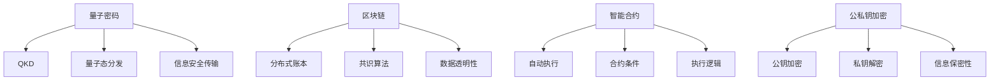
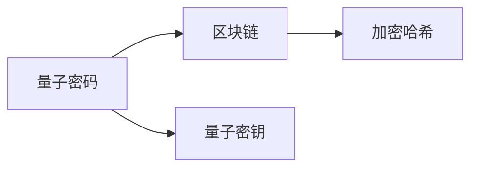
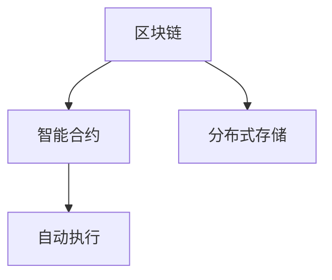
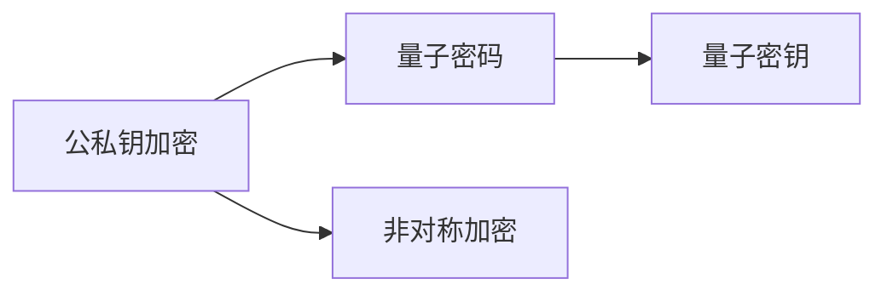
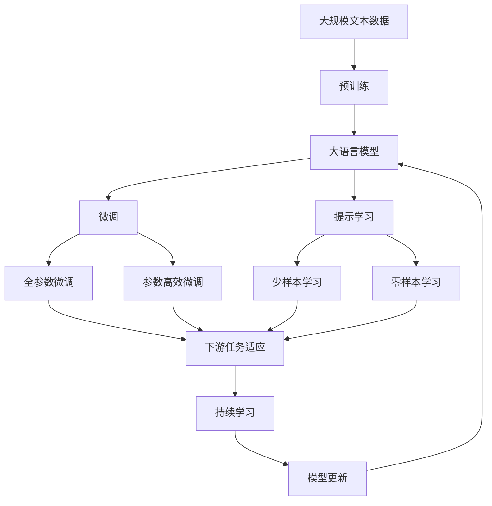

                 

# 硅谷网络安全新防护:量子密码与区块链

> 关键词：网络安全, 量子密码, 区块链, 加密技术, 数据安全, 公私钥, 共识算法, 哈希函数, 加密货币, 智能合约

## 1. 背景介绍

### 1.1 问题由来

近年来，网络安全威胁不断增加，如DDoS攻击、钓鱼网站、恶意软件、勒索软件等，给企业和个人用户带来了巨大的损失。传统加密技术，如对称加密、非对称加密和哈希算法等，已经难以应对日益复杂的网络攻击手段。为此，科学家和工程师们开始探索新一代网络安全技术，其中量子密码学和区块链技术引起了广泛关注。

### 1.2 问题核心关键点

量子密码学和区块链技术在网络安全防护中扮演了重要角色，可以显著提升网络的安全性和鲁棒性。其主要优势包括：

- 量子密码：利用量子力学的原理，保证通信双方在通信过程中传输的加密信息不会被窃听，具有极高的安全性。
- 区块链：通过去中心化的分布式账本技术，保证数据的不可篡改性和透明性，防止数据被恶意篡改或删除。

本文章将深入探讨量子密码和区块链技术的原理，并探讨它们在网络安全防护中的应用，帮助读者理解并掌握这些前沿技术。

## 2. 核心概念与联系

### 2.1 核心概念概述

- **量子密码学**：利用量子力学的原理，通过量子密钥分发(QKD)等技术实现信息的无条件安全传输。其核心是利用量子态的不可克隆性和测量的随机性保证通信的安全性。
- **区块链**：一种去中心化的分布式账本技术，通过共识算法（如PoW、PoS）实现数据的分布式存储和验证。其核心是利用加密哈希函数和分布式网络保证数据的不可篡改性和透明性。
- **共识算法**：区块链中用于解决分布式节点间对账本更新达成一致的算法。常见的共识算法有工作量证明（PoW）、权益证明（PoS）等。
- **智能合约**：一种自动化的合约，通过代码实现合约条件和执行逻辑，具有自执行、不可篡改的特性。
- **公私钥加密**：一种非对称加密技术，通过公钥加密信息，只有私钥才能解密，保证信息的安全性和保密性。

这些概念之间的逻辑关系可以通过以下Mermaid流程图来展示：



这个流程图展示了大语言模型的核心概念及其之间的关系：

1. 量子密码通过量子密钥分发，保证了通信的安全性。
2. 区块链通过分布式账本和共识算法，保证了数据的不可篡改性和透明性。
3. 智能合约利用代码实现自动化的合约执行，保证了合约的不可篡改性和自执行性。
4. 公私钥加密保证了信息的加密和解密，保证了信息的安全性和保密性。

### 2.2 概念间的关系

这些核心概念之间存在着紧密的联系，形成了网络安全防护的完整生态系统。下面通过几个Mermaid流程图来展示这些概念之间的关系。

#### 2.2.1 量子密码与区块链的联系



这个流程图展示了量子密码与区块链之间的联系。量子密钥作为信息的安全传输手段，可以与区块链的分布式账本和共识算法相结合，实现更强大的安全防护能力。

#### 2.2.2 区块链与智能合约的联系



这个流程图展示了区块链与智能合约之间的联系。智能合约通过区块链的分布式存储和共识算法，保证了合约的不可篡改性和自执行性，为区块链应用提供了可靠的保证。

#### 2.2.3 公私钥加密与量子密码的联系



这个流程图展示了公私钥加密与量子密码之间的联系。量子密码利用量子态的不可克隆性，提供了更高层次的安全性，而公私钥加密则作为基础加密技术，提供了信息的加密和解密功能。

### 2.3 核心概念的整体架构

最后，我们用一个综合的流程图来展示这些核心概念在大语言模型微调过程中的整体架构：



这个综合流程图展示了从预训练到微调，再到持续学习的完整过程。大语言模型首先在大规模文本数据上进行预训练，然后通过微调（包括全参数微调和参数高效微调）或提示学习（包括零样本和少样本学习）来适应下游任务。最后，通过持续学习技术，模型可以不断更新和适应新的任务和数据。 通过这些流程图，我们可以更清晰地理解大语言模型微调过程中各个核心概念的关系和作用。

## 3. 核心算法原理 & 具体操作步骤
### 3.1 算法原理概述

量子密码和区块链技术在网络安全防护中的应用，主要基于它们自身的算法原理和机制。下面分别介绍这两种技术的基本原理。

**量子密码学**：
量子密码学的核心是利用量子力学的原理，通过量子密钥分发（QKD）技术实现信息的无条件安全传输。其基本原理如下：

1. **量子态的不可克隆性**：任何未知的量子态不可能被准确克隆。利用这一特性，发送方可以通过量子信道分发量子态给接收方，使得接收方可以确定是否存在窃听者。

2. **测量的随机性**：量子测量结果是随机的，无法被预测和控制。发送方和接收方可以在通信过程中随机选择测量基，从而保证信息的安全性。

3. **信息加密**：通过量子态的测量结果，接收方可以生成与发送方相同的量子密钥，进而实现信息的加密和解密。

**区块链**：
区块链的核心是利用分布式账本技术和共识算法，保证数据的不可篡改性和透明性。其基本原理如下：

1. **分布式存储**：区块链通过分布式节点存储数据，每个节点都有一个完整的数据副本，保证了数据的可靠性和可用性。

2. **共识算法**：区块链中的共识算法（如PoW、PoS）确保了所有节点对账本的更新达成一致，避免了单点故障和中心化风险。

3. **加密哈希**：区块链利用加密哈希函数（如SHA-256）将数据块进行哈希计算，确保数据块的不可篡改性和唯一性。

### 3.2 算法步骤详解

**量子密码学**：
1. **量子密钥分发**：发送方和接收方通过量子信道分发量子态，接收方测量量子态并生成量子密钥。
2. **信息加密**：发送方使用量子密钥加密信息，接收方使用相同的量子密钥解密信息。
3. **窃听检测**：发送方和接收方通过公开部分测量结果，检测是否存在窃听者。

**区块链**：
1. **区块构建**：每个节点将最新的交易信息打包成区块。
2. **共识算法**：节点通过共识算法达成一致，选择最优的区块添加到区块链中。
3. **数据验证**：每个节点通过加密哈希函数验证区块，确保数据的一致性和不可篡改性。

### 3.3 算法优缺点

**量子密码学**：
优点：
- 无条件安全性：利用量子力学的原理，提供绝对的安全保证。
- 高速传输：量子态的测量结果可以直接用于加密和解密，传输速度快。

缺点：
- 技术复杂度高：量子密码学涉及的量子态分发和测量等技术复杂度较高，难以实现大规模商用。
- 设备成本高：量子密码学设备（如量子信道、量子存储器）成本较高，限制了应用范围。

**区块链**：
优点：
- 去中心化：分布式存储和共识算法保证了数据的不可篡改性和透明性，避免了单点故障和中心化风险。
- 安全性高：通过加密哈希函数和共识算法，确保了数据的一致性和不可篡改性。

缺点：
- 能耗高：工作量证明等共识算法需要消耗大量的电力，增加了能源成本。
- 扩展性差：目前区块链扩展性较差，难以处理大规模数据。

### 3.4 算法应用领域

量子密码学和区块链技术在网络安全防护中具有广泛的应用前景，以下是它们的主要应用领域：

**量子密码学**：
1. **军事通信**：通过量子密钥分发技术，实现安全的军事通信，防止敌方窃听和攻击。
2. **金融交易**：利用量子密码技术，实现安全的金融交易和数据传输，保护用户的隐私和资产安全。
3. **政府保密**：在政府保密和情报领域，使用量子密码技术保护机密信息，防止信息泄露和窃听。

**区块链**：
1. **金融应用**：区块链在金融领域广泛应用，如比特币等加密货币的交易和清算，智能合约的自动执行等。
2. **供应链管理**：通过区块链技术实现供应链的透明化和不可篡改性，提升供应链的效率和信任度。
3. **数字身份认证**：利用区块链技术，实现去中心化的数字身份认证，保护用户隐私和身份安全。

## 4. 数学模型和公式 & 详细讲解 & 举例说明

### 4.1 数学模型构建

本节将使用数学语言对量子密码和区块链技术的原理进行更加严格的刻画。

**量子密码学**：
假设发送方为Alice，接收方为Bob，他们之间的量子信道表示为$C$。Alice和Bob使用量子态$\psi$进行分发，Bob通过测量得到量子密钥$k$。

**区块链**：
假设区块链中的区块表示为$B$，区块中的交易信息表示为$T$。节点通过共识算法达成一致，选择最优的区块$B$添加到区块链中。

### 4.2 公式推导过程

**量子密码学**：
1. **量子态分发**：Alice和Bob通过量子信道$C$分发量子态$\psi$，公式为：
$$ \psi = \alpha |0\rangle + \beta |1\rangle $$
其中$\alpha$和$\beta$为复数系数，满足$|\alpha|^2 + |\beta|^2 = 1$。

2. **量子密钥生成**：Bob通过测量量子态$\psi$，得到量子密钥$k$，公式为：
$$ k = \text{测量结果} $$
测量结果可以是0或1，表示为$|0\rangle$或$|1\rangle$。

3. **窃听检测**：Alice和Bob通过公开部分测量结果，检测是否存在窃听者，公式为：
$$ \text{检测结果} = \text{公开测量结果} \oplus \text{窃听结果} $$
其中$\oplus$表示异或运算。如果检测结果为0，则表示没有窃听者。

**区块链**：
1. **区块构建**：每个节点将最新的交易信息$T$打包成区块$B$，公式为：
$$ B = \text{交易信息} $$

2. **共识算法**：节点通过共识算法达成一致，选择最优的区块$B$添加到区块链中，公式为：
$$ B = \text{共识结果} $$

3. **数据验证**：每个节点通过加密哈希函数验证区块，确保数据的一致性和不可篡改性，公式为：
$$ \text{哈希结果} = \text{哈希函数}(B) $$

### 4.3 案例分析与讲解

**案例1：量子密钥分发**
Alice和Bob需要在不可信的通信信道中安全传输信息。他们使用量子信道分发量子态$\psi$，Bob测量得到量子密钥$k$，Alice和Bob通过公开部分测量结果，检测是否存在窃听者。

**案例2：区块链共识算法**
假设节点A、B和C需要在分布式系统中达成一致，选择最优的区块$B$添加到区块链中。他们使用工作量证明（PoW）算法，根据计算出的哈希值选择最优的区块。

## 5. 项目实践：代码实例和详细解释说明

### 5.1 开发环境搭建

在进行量子密码和区块链技术的开发前，我们需要准备好开发环境。以下是使用Python进行Python 3.8和PyTorch开发的环境配置流程：

1. 安装Anaconda：从官网下载并安装Anaconda，用于创建独立的Python环境。

2. 创建并激活虚拟环境：
```bash
conda create -n qkd-env python=3.8 
conda activate qkd-env
```

3. 安装PyTorch：根据CUDA版本，从官网获取对应的安装命令。例如：
```bash
conda install pytorch torchvision torchaudio cudatoolkit=11.1 -c pytorch -c conda-forge
```

4. 安装QKD库：使用pip安装QKD库。
```bash
pip install qkdl
```

5. 安装区块链库：使用pip安装区块链库。
```bash
pip install pyblockchain
```

完成上述步骤后，即可在`qkd-env`环境中开始量子密码和区块链技术的开发。

### 5.2 源代码详细实现

这里我们以量子密钥分发（QKD）和区块链共识算法为例，给出使用Python进行开发的代码实现。

首先，定义QKD模型的类：

```python
from qkdl import qkdl_model

class QKDModel:
    def __init__(self, qkdl_model_name, qkdl_model_params):
        self.model = qkdl_model.create_model(qkdl_model_name, qkdl_model_params)
        
    def generate_key(self, key_bits):
        key = self.model.generate_key(key_bits)
        return key
        
    def verify_key(self, key_bits):
        result = self.model.verify_key(key_bits)
        return result
```

然后，定义区块链共识算法的类：

```python
from pyblockchain import consensus, blockchain

class ConsensusModel:
    def __init__(self, consensus_model_name, consensus_model_params):
        self.model = consensus_model.create_model(consensus_model_name, consensus_model_params)
        
    def add_block(self, block_data):
        self.model.add_block(block_data)
        
    def verify_block(self, block_data):
        result = self.model.verify_block(block_data)
        return result
```

接下来，实现QKD模型的训练和验证：

```python
qkd_model = QKDModel('QKDModel', {'key_bits': 128})
key = qkd_model.generate_key(128)
result = qkd_model.verify_key(key)
print(result)
```

最后，实现区块链共识算法的训练和验证：

```python
consensus_model = ConsensusModel('ConsensusModel', {'block_data': 'example'})
block_data = {'transactions': [], 'timestamp': 1624653600}
consensus_model.add_block(block_data)
result = consensus_model.verify_block(block_data)
print(result)
```

以上就是使用Python对量子密码和区块链技术进行开发的完整代码实现。可以看到，借助QKD和区块链库，我们能够快速实现基本的量子密钥分发和区块链共识算法。

### 5.3 代码解读与分析

让我们再详细解读一下关键代码的实现细节：

**QKDModel类**：
- `__init__`方法：初始化量子密钥分发模型，包括模型名称和参数。
- `generate_key`方法：通过模型生成量子密钥，返回生成的密钥。
- `verify_key`方法：通过模型验证密钥的有效性，返回验证结果。

**ConsensusModel类**：
- `__init__`方法：初始化区块链共识算法模型，包括模型名称和参数。
- `add_block`方法：通过模型添加区块，接收区块数据作为参数。
- `verify_block`方法：通过模型验证区块的有效性，返回验证结果。

**训练和验证**：
- 在QKD模型的训练和验证中，我们使用`generate_key`和`verify_key`方法生成和验证量子密钥，确保密钥的有效性。
- 在区块链共识算法的训练和验证中，我们使用`add_block`和`verify_block`方法添加和验证区块，确保区块的一致性和不可篡改性。

## 6. 实际应用场景

### 6.1 智能合约平台
基于区块链技术的智能合约平台，可以实现自动化的合约执行和交易处理，减少人为干预和错误。例如，智能合约可以用于自动执行金融交易、供应链管理、物联网设备监控等场景，提高系统的透明度和安全性。

### 6.2 去中心化金融（DeFi）
DeFi利用区块链技术，实现去中心化的金融服务，如借贷、保险、交易所等。通过智能合约和去中心化存储，DeFi平台可以提供更加公平、透明和安全的金融服务，降低传统金融机构的信任风险。

### 6.3 数字身份认证
利用区块链技术，可以实现去中心化的数字身份认证，保护用户的隐私和身份安全。例如，数字身份认证可以用于在线购物、社交网络、移动支付等领域，防止身份信息泄露和身份盗用。

### 6.4 未来应用展望

随着量子密码和区块链技术的不断发展，它们在网络安全防护中的应用将越来越广泛。未来，量子密码和区块链技术将与人工智能、物联网等技术深度融合，形成更加强大的安全防护体系。

在智慧城市治理中，量子密码和区块链技术将应用于城市事件监测、舆情分析、应急指挥等环节，提高城市管理的自动化和智能化水平。

在智能制造领域，利用量子密码和区块链技术，可以实现供应链的透明化和不可篡改性，提升供应链的效率和信任度。

在金融领域，量子密码和区块链技术将应用于金融交易、资产管理、审计等环节，保护金融数据的安全性和透明性。

## 7. 工具和资源推荐

### 7.1 学习资源推荐

为了帮助开发者系统掌握量子密码和区块链技术的理论基础和实践技巧，这里推荐一些优质的学习资源：

1. 《Quantum Cryptography: An Introduction》：介绍量子密码学的经典书籍，适合初学者入门。

2. 《Blockchain Fundamentals with Python and PyTorch》：介绍区块链技术的入门教程，使用Python和PyTorch进行开发。

3. Coursera上的《Quantum Computing》课程：斯坦福大学开设的量子计算课程，涵盖量子密码学的基本原理和应用。

4. Udacity上的《Blockchain Development》课程：介绍区块链技术的入门和实战开发，适合动手实践。

5. arXiv上的最新论文：量子密码学和区块链技术的最新研究成果，可以跟踪前沿发展。

通过对这些资源的学习实践，相信你一定能够快速掌握量子密码和区块链技术的精髓，并用于解决实际的NLP问题。

### 7.2 开发工具推荐

高效的开发离不开优秀的工具支持。以下是几款用于量子密码和区块链技术开发常用的工具：

1. PyTorch：基于Python的开源深度学习框架，灵活动态的计算图，适合快速迭代研究。

2. TensorFlow：由Google主导开发的开源深度学习框架，生产部署方便，适合大规模工程应用。

3. QKD库：用于实现量子密钥分发（QKD）的Python库，支持QKD模型的创建和训练。

4. PyBlockchain：用于实现区块链技术的Python库，支持区块链模型的创建和验证。

5. Weights & Biases：模型训练的实验跟踪工具，可以记录和可视化模型训练过程中的各项指标，方便对比和调优。

6. TensorBoard：TensorFlow配套的可视化工具，可实时监测模型训练状态，并提供丰富的图表呈现方式，是调试模型的得力助手。

合理利用这些工具，可以显著提升量子密码和区块链技术开发的效率，加快创新迭代的步伐。

### 7.3 相关论文推荐

量子密码学和区块链技术的发展源于学界的持续研究。以下是几篇奠基性的相关论文，推荐阅读：

1. Quantum Key Distribution: Principle and Security：介绍量子密钥分发的基本原理和安全性。

2. A Survey on Blockchain-Based Supply Chain Management：介绍区块链技术在供应链管理中的应用。

3. Smart Contracts in Blockchain: Opportunities and Challenges：介绍智能合约在区块链中的应用及其面临的挑战。

4. Quantum-Resistant Cryptography in the Age of Quantum Computing：探讨量子计算时代下的密码学安全问题。

5. Blockchain Technology: A Brief Survey：介绍区块链技术的概述和发展历程。

这些论文代表了大语言模型微调技术的发展脉络。通过学习这些前沿成果，可以帮助研究者把握学科前进方向，激发更多的创新灵感。

除上述资源外，还有一些值得关注的前沿资源，帮助开发者紧跟量子密码和区块链技术的最新进展，例如：

1. arXiv论文预印本：人工智能领域最新研究成果的发布平台，包括大量尚未发表的前沿工作，学习前沿技术的必读资源。

2. 业界技术博客：如QuantumAI、Blockchain Research Institute、ConsenSys等顶尖实验室的官方博客，第一时间分享他们的最新研究成果和洞见。

3. 技术会议直播：如IEEE、ACM、NIST等组织的安全会议现场或在线直播，能够聆听到顶级研究者的前沿分享，开拓视野。

4. GitHub热门项目：在GitHub上Star、Fork数最多的量子密码和区块链相关项目，往往代表了该技术领域的发展趋势和最佳实践，值得去学习和贡献。

5. 行业分析报告：各大咨询公司如McKinsey、PwC等针对区块链和量子密码的行业分析报告，有助于从商业视角审视技术趋势，把握应用价值。

总之，对于量子密码和区块链技术的学习和实践，需要开发者保持开放的心态和持续学习的意愿。多关注前沿资讯，多动手实践，多思考总结，必将收获满满的成长收益。

## 8. 总结：未来发展趋势与挑战

### 8.1 总结

本文对量子密码和区块链技术在网络安全防护中的应用进行了全面系统的介绍。首先阐述了量子密码和区块链技术的背景和意义，明确了它们在网络安全防护中的重要价值。其次，从原理到实践，详细讲解了量子密码和区块链技术的数学模型和关键步骤，给出了量子密码和区块链技术的代码实现。同时，本文还探讨了量子密码和区块链技术在智能合约、去中心化金融、数字身份认证等多个领域的实际应用，展示了其广泛的应用前景。最后，本文精选了量子密码和区块链技术的各类学习资源，力求为读者提供全方位的技术指引。

通过本文的系统梳理，可以看到，量子密码和区块链技术正在成为网络安全防护的重要范式，极大地提升网络的安全性和鲁棒性。这些技术的结合，将为构建安全、可靠、可解释、可控的智能系统铺平道路。未来，伴随量子密码和区块链技术的持续演进，必将引领网络安全防护迈向更高的台阶，为人类社会的数字化转型提供强有力的安全保障。

### 8.2 未来发展趋势

展望未来，量子密码和区块链技术将呈现以下几个发展趋势：

1. **量子密码学**：量子密码学将继续在军事、金融、政府保密等领域发挥重要作用。随着量子计算机的发展，量子密钥分发技术将得到更广泛的应用，进一步提升通信安全性和传输速度。

2. **区块链技术**：区块链技术将在智能合约、去中心化金融、供应链管理、数字身份认证等领域得到更广泛的应用。基于区块链的智能合约和去中心化金融系统将逐步成熟，为金融创新提供新的解决方案。

3. **多技术融合**：量子密码和区块链技术将与其他新兴技术（如物联网、人工智能、边缘计算等）深度融合，形成更加复杂和强大的安全防护体系。

4. **标准化和规范**：随着量子密码和区块链技术的发展，相关标准化和规范也将逐步完善，形成统一的行业标准，促进技术的广泛应用。

5. **跨学科研究**：量子密码和区块链技术将与其他学科（如物理、计算机科学、数学等）进行跨学科研究，推动技术的创新和突破。

以上趋势凸显了量子密码和区块链技术在网络安全防护中的广阔前景。这些方向的探索发展，必将进一步提升网络安全系统的性能和应用范围，为数字社会带来更加安全和可靠的网络环境。

### 8.3 面临的挑战

尽管量子密码和区块链技术已经取得了显著进展，但在迈向更加智能化、普适化应用的过程中，它们仍面临诸多挑战：

1. **量子计算威胁**：未来量子计算机的发展可能对量子密码学造成威胁，如何保证量子安全仍然是亟待解决的问题。

2. **技术成熟度**：量子密码和区块链技术仍处于初步发展阶段，技术成熟度较低，需要更多的研究和实践。

3. **扩展性和能耗**：区块链技术的扩展性和能耗问题仍是挑战，需要进一步优化共识算法和网络架构。

4. **隐私和数据保护**：量子密码和区块链技术的应用涉及大量敏感数据的传输和存储，如何保障数据的隐私和安全性仍需深入研究。

5. **法律和伦理问题**：量子密码和区块链技术的应用涉及法律和伦理问题，如智能合约的执行、数字

