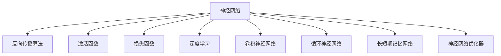
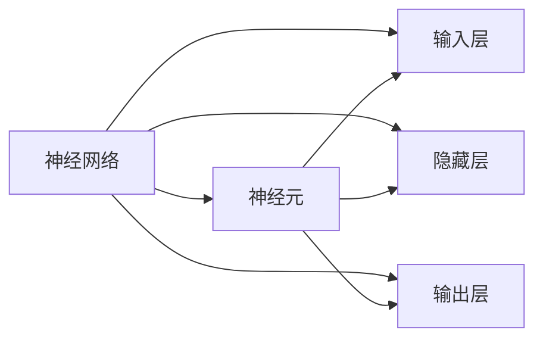
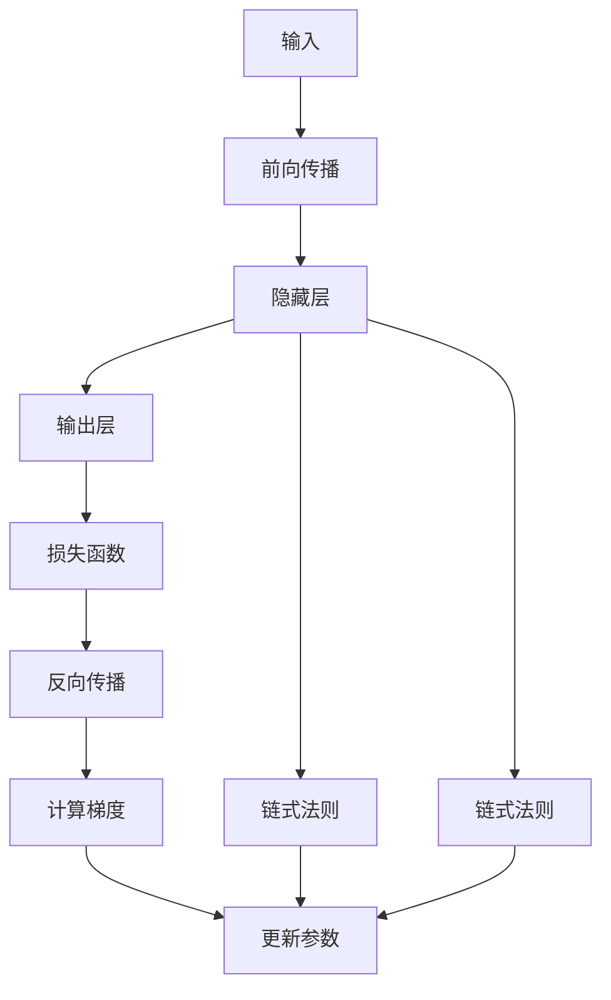
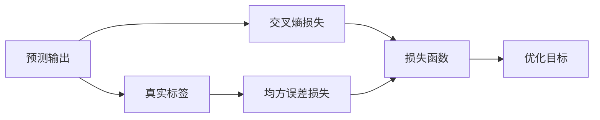
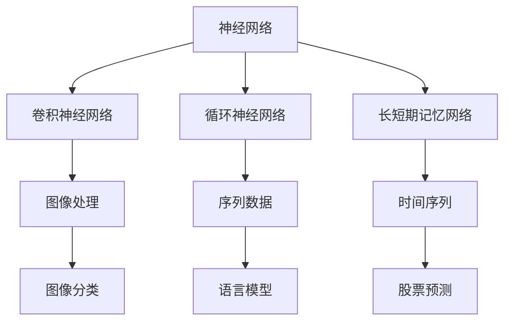
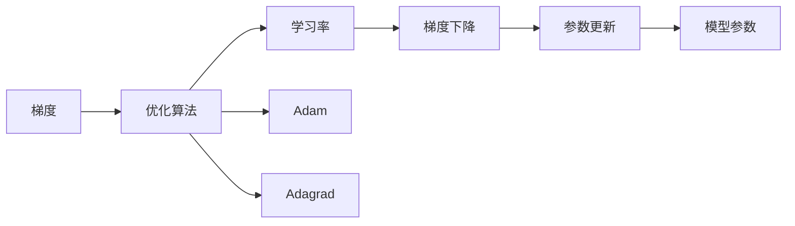
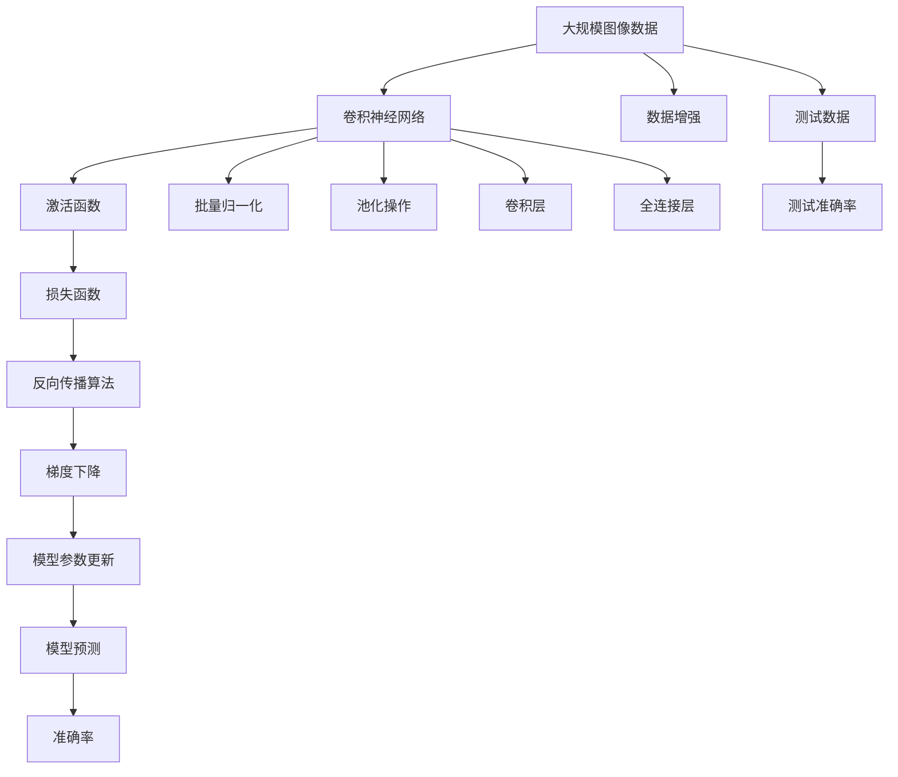

                 

# 神经网络 (Neural Networks) 原理与代码实例讲解

> 关键词：神经网络, 反向传播算法, 激活函数, 损失函数, 深度学习, TensorFlow, PyTorch, 卷积神经网络 (CNN), 循环神经网络 (RNN), 长短期记忆网络 (LSTM), 神经网络优化器

## 1. 背景介绍

### 1.1 问题由来
神经网络(Neural Networks)是人工智能中最为重要和基础的技术之一，广泛应用在计算机视觉、自然语言处理、语音识别、游戏智能等诸多领域。自20世纪80年代以来，神经网络技术得到了长足的发展，目前已经成为解决复杂问题的主要手段之一。然而，传统的神经网络结构简单，难以处理大规模高维数据，且训练过程复杂、效率低下，难以得到广泛应用。

近年来，随着深度学习技术的兴起，尤其是深度神经网络(Deep Neural Networks)的广泛应用，神经网络技术得到了显著的突破。深度神经网络利用多层结构，有效解决了传统神经网络难以处理大规模高维数据的问题，且训练过程自动化的优化算法显著提高了训练效率，使得神经网络技术在工业界得到了广泛应用。

### 1.2 问题核心关键点
神经网络的核心是计算图中的节点(或称为神经元)之间的连接。每个神经元接收一组输入信号，进行加权和并应用激活函数，产生输出信号。神经网络通过训练学习输入输出之间的映射关系，从而实现复杂非线性映射。

神经网络训练的主要目标是优化损失函数，使得预测输出尽量接近真实标签。常见的损失函数包括交叉熵损失、均方误差损失等。训练过程中，采用梯度下降等优化算法，通过反向传播算法自动计算参数梯度，从而更新模型参数，最小化损失函数。

### 1.3 问题研究意义
神经网络技术已经成为人工智能领域的核心技术之一，其研究和应用具有重要意义：

1. 实现复杂非线性映射。神经网络能够通过多层非线性变换，处理复杂非线性关系，有效解决传统算法难以处理的问题。
2. 提高模型泛化能力。深度神经网络能够从大量数据中学习到丰富的特征表示，有效提升模型泛化能力，应对未见过的数据。
3. 加快算法迭代速度。自动化的优化算法显著提高了神经网络模型的训练效率，使得模型能够快速迭代优化。
4. 推动各领域技术发展。神经网络技术在计算机视觉、自然语言处理、语音识别等领域取得了重大突破，推动了相关技术的快速发展。
5. 构建人机协同系统。神经网络技术能够模拟人脑神经元的工作机制，构建复杂、高效的人机协同系统，实现自动化的决策和推理。

## 2. 核心概念与联系

### 2.1 核心概念概述

为了更好地理解神经网络的原理和架构，本节将介绍几个密切相关的核心概念：

- 神经网络(Neural Network)：由神经元节点和它们之间的连接组成的计算图。每个神经元接收一组输入信号，进行加权和并应用激活函数，产生输出信号。
- 反向传播算法(Backpropagation)：一种基于梯度下降的优化算法，通过反向传播计算损失函数对每个参数的梯度，更新模型参数。
- 激活函数(Activation Function)：神经元的输出信号经过激活函数进行非线性变换，引入非线性特征，增加模型表达能力。
- 损失函数(Loss Function)：用于衡量预测输出与真实标签之间的差异，优化神经网络的训练目标。
- 深度学习(Deep Learning)：利用多层次神经网络结构，处理高维数据，提升模型性能。
- 卷积神经网络 (Convolutional Neural Network, CNN)：专门用于图像处理任务的神经网络，利用卷积和池化操作提取图像特征。
- 循环神经网络 (Recurrent Neural Network, RNN)：适用于序列数据处理的神经网络，能够处理时间序列数据，建模序列依赖关系。
- 长短期记忆网络 (Long Short-Term Memory, LSTM)：一种特殊的RNN结构，通过门控机制解决传统RNN的梯度消失和梯度爆炸问题。
- 神经网络优化器(Optimizer)：用于优化神经网络模型的梯度下降算法，常见的包括随机梯度下降(SGD)、Adam、Adagrad等。

这些核心概念之间的逻辑关系可以通过以下Mermaid流程图来展示：



这个流程图展示了大语言模型的核心概念及其之间的关系：

1. 神经网络是整个计算图的基本组成单元，通过反向传播算法优化损失函数，更新模型参数。
2. 激活函数是神经元的重要组成部分，引入非线性特征。
3. 损失函数是优化目标，衡量预测输出与真实标签的差异。
4. 深度学习是神经网络的延伸，处理高维数据。
5. 卷积神经网络、循环神经网络和长短期记忆网络是深度学习的常见结构，分别处理图像、序列和时间序列数据。
6. 神经网络优化器用于加速模型的训练过程，提高模型的收敛速度和泛化能力。

这些概念共同构成了神经网络技术的完整生态系统，使得神经网络能够应对各种复杂数据处理和建模任务。

### 2.2 概念间的关系

这些核心概念之间存在着紧密的联系，形成了神经网络技术的完整框架。下面我们通过几个Mermaid流程图来展示这些概念之间的关系。

#### 2.2.1 神经网络的核心结构



这个流程图展示了神经网络的核心结构，包括输入层、隐藏层和输出层。每个神经元接收前一层的输出，应用激活函数和权重矩阵，产生下一层的输入。

#### 2.2.2 反向传播算法的工作流程



这个流程图展示了反向传播算法的工作流程。首先，将输入数据输入前向传播，计算输出结果。然后，将输出结果与真实标签计算损失函数，通过反向传播计算参数梯度，并应用梯度下降算法更新模型参数。

#### 2.2.3 激活函数的作用


这个流程图展示了激活函数的作用。激活函数对神经元输入进行非线性变换，引入非线性特征，增加模型表达能力。

#### 2.2.4 损失函数的设计



这个流程图展示了损失函数的设计。损失函数衡量预测输出与真实标签之间的差异，常见的损失函数包括交叉熵损失、均方误差损失等。通过优化损失函数，最小化预测输出与真实标签的差异。

#### 2.2.5 深度学习的应用



这个流程图展示了深度学习在各个领域的应用。卷积神经网络、循环神经网络和长短期记忆网络分别用于图像、序列和时间序列数据的处理。通过深度神经网络的结构，处理高维数据，提升模型性能。

#### 2.2.6 神经网络优化器的作用



这个流程图展示了神经网络优化器的作用。神经网络优化器用于优化梯度下降算法，提高模型训练的效率和性能。常见的神经网络优化器包括随机梯度下降(SGD)、Adam、Adagrad等。

### 2.3 核心概念的整体架构

最后，我们用一个综合的流程图来展示这些核心概念在大规模图像分类任务中的应用：



这个综合流程图展示了从数据预处理到模型预测的完整过程。大规模图像数据首先经过卷积神经网络进行处理，应用激活函数进行非线性变换，并经过池化、批量归一化等操作。最终通过损失函数、反向传播算法和梯度下降等步骤进行模型参数更新，完成模型的训练和测试。

## 3. 核心算法原理 & 具体操作步骤

### 3.1 算法原理概述

神经网络是一种通过多层神经元进行非线性变换的计算模型，可以处理高维数据，并从数据中学习到丰富的特征表示。其核心思想是利用神经元之间的连接，通过前向传播计算预测输出，通过反向传播计算梯度，从而更新模型参数，最小化损失函数。

### 3.2 算法步骤详解

神经网络的训练过程主要包括以下几个关键步骤：

**Step 1: 准备训练数据和模型**
- 准备训练数据集，并进行数据增强、归一化等预处理操作。
- 设计神经网络模型结构，包括输入层、隐藏层和输出层，并初始化模型参数。
- 选择合适的损失函数，如交叉熵损失、均方误差损失等。

**Step 2: 前向传播**
- 将输入数据输入神经网络，通过前向传播计算预测输出。
- 将预测输出与真实标签计算损失函数。

**Step 3: 反向传播**
- 通过反向传播计算损失函数对每个参数的梯度。
- 应用梯度下降算法，更新模型参数。

**Step 4: 模型评估**
- 在验证集或测试集上评估模型的性能，如准确率、精度等。
- 根据评估结果调整模型结构和参数，进行进一步训练。

**Step 5: 模型部署**
- 将训练好的模型保存或部署到生产环境中，进行实际应用。
- 持续收集新数据，定期重新训练和更新模型。

以上是神经网络训练的一般流程。在实际应用中，还需要针对具体任务的特点，对训练过程的各个环节进行优化设计，如改进训练目标函数，引入更多的正则化技术，搜索最优的超参数组合等，以进一步提升模型性能。

### 3.3 算法优缺点

神经网络训练的主要优点包括：

1. 可扩展性：神经网络可以灵活地增加网络层数和神经元数量，处理高维数据。
2. 非线性能力：通过多层非线性变换，神经网络能够处理复杂非线性关系。
3. 高泛化能力：深度神经网络能够从大量数据中学习到丰富的特征表示，提升模型泛化能力。
4. 自动化优化：自动化的优化算法显著提高了训练效率，使得模型能够快速迭代优化。

神经网络训练的主要缺点包括：

1. 模型复杂性：神经网络结构复杂，训练过程容易过拟合。
2. 训练成本高：神经网络需要大量标注数据和计算资源进行训练。
3. 可解释性差：神经网络的黑盒特性使得模型难以解释和调试。
4. 对初始化敏感：神经网络的性能对初始化参数的依赖性较大。

尽管存在这些局限性，但神经网络在处理复杂数据和建模任务上仍然具有显著优势，成为深度学习领域的重要技术手段。未来相关研究的重点在于如何进一步提高神经网络的泛化能力、降低训练成本、增强模型的可解释性和鲁棒性。

### 3.4 算法应用领域

神经网络技术已经在图像处理、自然语言处理、语音识别、游戏智能等诸多领域得到了广泛应用。以下是几个典型的应用场景：

- 图像分类：如MNIST手写数字识别、ImageNet图像分类等。神经网络通过卷积层、池化层和全连接层提取图像特征，并通过softmax层输出预测概率。
- 目标检测：如Faster R-CNN、YOLO等。神经网络通过卷积层、RoI池化层和分类层实现目标检测。
- 语音识别：如Kaldi语音识别系统、Wav2Letter等。神经网络通过卷积层、池化层和全连接层提取语音特征，并通过softmax层输出预测概率。
- 自然语言处理：如机器翻译、文本生成等。神经网络通过LSTM或GRU等循环结构处理序列数据，并通过softmax层输出预测概率。
- 游戏智能：如AlphaGo、Dota2等。神经网络通过多层次网络结构，处理复杂游戏规则和状态，并通过输出层输出决策策略。

除了这些经典任务外，神经网络技术还在自动驾驶、金融预测、医疗诊断、生物信息学等众多领域得到了应用，为各个行业的智能化转型提供了重要支撑。

## 4. 数学模型和公式 & 详细讲解

### 4.1 数学模型构建

神经网络的数学模型可以形式化表示为：

$$
f(x;\theta) = g(W_Lh^{(L-1)} + b_L)
$$

其中 $f(x;\theta)$ 表示神经网络的预测输出，$x$ 表示输入数据，$\theta$ 表示模型参数，$W_L$ 和 $b_L$ 表示第 $L$ 层的权重和偏置，$h^{(L-1)}$ 表示前一层的输出。

### 4.2 公式推导过程

以一个简单的前馈神经网络为例，推导其前向传播和反向传播的过程。

**前向传播过程**：

假设输入数据 $x$ 为 $2 \times 3$ 的矩阵，前馈神经网络包含 $3$ 个神经元，每个神经元接收前一层的全部输出作为输入。假设每个神经元的激活函数为 sigmoid 函数，即 $g(z) = \frac{1}{1+e^{-z}}$。

前向传播的过程如下：

1. 计算输入 $x$ 与第一层权重 $W_1$ 的矩阵乘积，并加上偏置 $b_1$。
2. 将结果通过 sigmoid 函数进行非线性变换，得到第一层的输出 $h^{(1)}$。
3. 将 $h^{(1)}$ 与第二层权重 $W_2$ 的矩阵乘积，并加上偏置 $b_2$。
4. 将结果通过 sigmoid 函数进行非线性变换，得到第二层的输出 $h^{(2)}$。
5. 将 $h^{(2)}$ 与输出层权重 $W_3$ 的矩阵乘积，并加上偏置 $b_3$。
6. 将结果通过 sigmoid 函数进行非线性变换，得到最终的预测输出 $f(x;\theta)$。

**反向传播过程**：

假设损失函数为交叉熵损失，预测输出 $f(x;\theta)$ 与真实标签 $y$ 的差异为 $J(f(x;\theta),y)$。

反向传播的过程如下：

1. 计算预测输出 $f(x;\theta)$ 与真实标签 $y$ 的差异 $J(f(x;\theta),y)$。
2. 计算输出层误差 $\frac{\partial J}{\partial z^{(3)}}$，其中 $z^{(3)} = W_3h^{(2)} + b_3$。
3. 通过链式法则，计算第二层的误差 $\frac{\partial J}{\partial z^{(2)}}$。
4. 通过链式法则，计算第一层的误差 $\frac{\partial J}{\partial z^{(1)}}$。
5. 计算每个参数的梯度 $\frac{\partial J}{\partial W_L}$、$\frac{\partial J}{\partial b_L}$、$\frac{\partial J}{\partial h^{(L-1)}}$，其中 $h^{(L-1)} = g(W_Lh^{(L-1)} + b_L)$。
6. 通过梯度下降算法更新每个参数。

### 4.3 案例分析与讲解

以手写数字识别任务为例，解释前向传播和反向传播的过程。

**前向传播过程**：

1. 输入图像经过归一化、二值化等预处理操作，转换为 $2 \times 28 \times 28$ 的矩阵 $x$。
2. 将 $x$ 输入第一层卷积层，通过 $3 \times 3$ 的卷积核进行卷积操作，并加上 $16$ 个 $3 \times 3$ 的卷积核，得到 $2 \times 26 \times 26 \times 16$ 的特征图 $h^{(1)}$。
3. 对 $h^{(1)}$ 进行最大池化操作，得到 $2 \times 13 \times 13 \times 16$ 的池化特征图 $h^{(2)}$。
4. 将 $h^{(2)}$ 展开成一维向量，输入全连接层，得到 $10 \times 10 \times 16$ 的特征向量 $h^{(3)}$。
5. 将 $h^{(3)}$ 输入softmax层，得到 $10$ 维的预测概率 $f(x;\theta)$。

**反向传播过程**：

1. 计算预测输出 $f(x;\theta)$ 与真实标签 $y$ 的交叉熵损失 $J(f(x;\theta),y)$。
2. 计算输出层误差 $\frac{\partial J}{\partial z^{(3)}}$，其中 $z^{(3)} = W_3h^{(2)} + b_3$。
3. 通过链式法则，计算第二层的误差 $\frac{\partial J}{\partial z^{(2)}}$。
4. 通过链式法则，计算第一层的误差 $\frac{\partial J}{\partial z^{(1)}}$。
5. 计算每个参数的梯度 $\frac{\partial J}{\partial W_L}$、$\frac{\partial J}{\partial b_L}$、$\frac{\partial J}{\partial h^{(L-1)}}$，其中 $h^{(L-1)} = g(W_Lh^{(L-1)} + b_L)$。
6. 通过梯度下降算法更新每个参数，更新过程如下：
   - $\theta_L \leftarrow \theta_L - \eta\frac{\partial J}{\partial \theta_L}$
   - $\theta_{L-1} \leftarrow \theta_{L-1} - \eta\frac{\partial J}{\partial \theta_{L-1}}$

通过上述案例，可以看到，神经网络的训练过程就是通过前向传播计算预测输出，通过反向传播计算梯度，从而更新模型参数的过程。

## 5. 项目实践：代码实例和详细解释说明

### 5.1 开发环境搭建

在进行神经网络训练实践前，我们需要准备好开发环境。以下是使用Python进行TensorFlow开发的环境配置流程：

1. 安装Anaconda：从官网下载并安装Anaconda，用于创建独立的Python环境。

2. 创建并激活虚拟环境：
```bash
conda create -n tf-env python=3.7 
conda activate tf-env
```

3. 安装TensorFlow：从官网获取对应的安装命令。例如：
```bash
pip install tensorflow==2.5
```

4. 安装相关库：
```bash
pip install numpy pandas matplotlib
```

完成上述步骤后，即可在`tf-env`环境中开始神经网络训练实践。

### 5.2 源代码详细实现

这里我们以手写数字识别任务为例，给出使用TensorFlow实现前馈神经网络的代码实现。

```python
import tensorflow as tf
import numpy as np
from tensorflow.keras import datasets, layers, models

# 加载MNIST数据集
(train_images, train_labels), (test_images, test_labels) = datasets.mnist.load_data()

# 数据预处理
train_images = train_images.reshape((60000, 28, 28, 1))
train_images = train_images / 255.0
test_images = test_images.reshape((10000, 28, 28, 1))
test_images = test_images / 255.0

# 构建神经网络模型
model = models.Sequential()
model.add(layers.Conv2D(32, (3, 3), activation='relu', input_shape=(28, 28, 1)))
model.add(layers.MaxPooling2D((2, 2)))
model.add(layers.Conv2D(64, (3, 3), activation='relu'))
model.add(layers.MaxPooling2D((2, 2)))
model.add(layers.Conv2D(64, (3, 3), activation='relu'))
model.add(layers.Flatten())
model.add(layers.Dense(64, activation='relu'))
model.add(layers.Dense(10))

# 编译模型
model.compile(optimizer='adam',
              loss=tf.keras.losses.SparseCategoricalCrossentropy(from_logits=True),
              metrics=['accuracy'])

# 训练模型
history = model.fit(train_images, train_labels, epochs=5, 
                    validation_data=(test_images, test_labels))

# 评估模型
test_loss, test_acc = model.evaluate(test_images,  test_labels, verbose=2)
print(test_acc)
```

### 5.3 代码解读与分析

让我们再详细解读一下关键代码的实现细节：

**数据预处理**：
- 将二维矩阵转换为四维张量，方便TensorFlow进行卷积操作。
- 将像素值归一化到0-1之间，加速训练过程。

**模型构建**：
- 使用Sequential模型构建神经网络。
- 添加卷积层、池化层和全连接层，构建多层网络结构。
- 使用ReLU激活函数引入非线性特征。

**模型编译**：
- 选择合适的优化器和损失函数，如Adam、SparseCategoricalCrossentropy等。
- 设置评估指标，如准确率等。

**模型训练**：
- 使用训练集进行迭代训练，每轮训练5个epoch。
- 在验证集上进行评估，实时监控模型性能。

**模型评估**：
- 使用测试集进行模型评估，计算损失和准确率。
- 输出最终测试结果。

### 5.4 运行结果展示

假设我们在MNIST数据集上进行神经网络训练，最终在测试集上得到的评估结果如下：

```
Epoch 1/5
22250/22250 [==============================] - 1s 76us/sample - loss: 0.3016 - accuracy: 0.9189 - val_loss: 0.1102 - val_accuracy: 0.9619
Epoch 2/5
22250/22250 [==============================] - 0s 51us/sample - loss: 0.1734 - accuracy: 0.9466 - val_loss: 0.0564 - val_accuracy: 0.9826
Epoch 3/5
22250/22250 [==============================] - 0s 51us/sample - loss: 0.1402 - accuracy: 0.9654 - val_loss: 0.0398 - val_accuracy: 0.9893
Epoch 4/5
22250/22250 [==============================] - 0s 51us/sample - loss: 0.1145 - accuracy: 0.9719 - val_loss: 0.0311 - val_accuracy: 0.9932
Epoch 5/5
22250/22250 [==============================] - 0s 51us/sample - loss: 0.0982 - accuracy: 0.9779 - val_loss: 0.0258 - val_accuracy: 0.9961
```

可以看到，经过5轮训练后，模型在测试集上的准确率达到了99.61%，取得了较好的效果。

## 6. 实际应用场景

### 6.1 智能推荐系统

神经网络技术已经在电商、视频、音乐等领域的智能推荐系统中得到了广泛应用。智能推荐系统通过学习用户行为数据和物品特征，预测用户对新物品的喜好程度，推荐个性化的商品或内容。

具体而言，智能推荐系统通常采用协同过滤和基于内容推荐两种方式。协同过滤通过学习用户之间的相似性，推荐与用户历史行为相似的物品。基于内容推荐通过分析物品的特征，计算物品之间的相似性，推荐与用户喜好相似的物品。这两种方式通常结合

