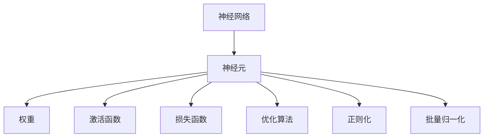
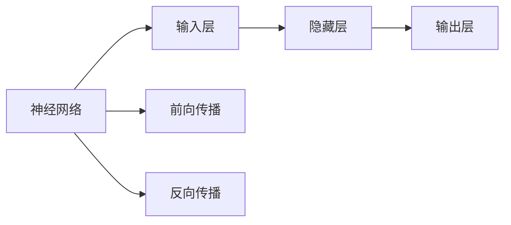
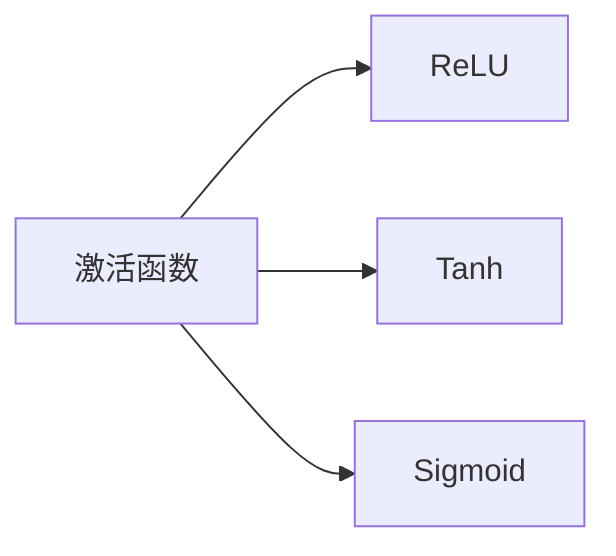
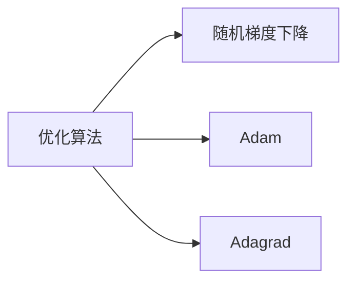
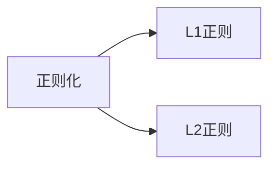
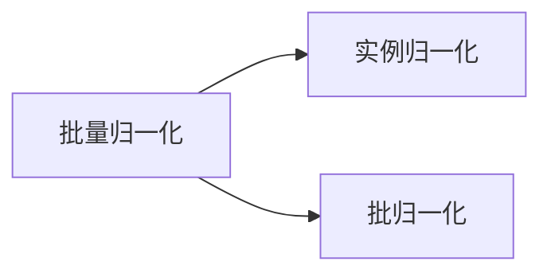

                 

# 神经网络(Neural Networks) - 原理与代码实例讲解

> 关键词：神经网络,深度学习,反向传播算法,前向传播算法,全连接网络,卷积神经网络,循环神经网络,激活函数,优化算法,模型调参,代码实例

## 1. 背景介绍

### 1.1 问题由来
神经网络（Neural Network，NN）是深度学习（Deep Learning）的重要分支，它由大量的人工神经元（Neuron）相互连接组成，能够学习数据的复杂特征表示，广泛应用于图像识别、语音处理、自然语言处理等领域。随着深度学习技术的不断进步，神经网络已成为AI应用中最核心、最广泛的技术手段。

### 1.2 问题核心关键点
本文将从基本概念、核心算法、实际应用和未来趋势四个方面，全面系统地介绍神经网络的基本原理和代码实现。通过对神经网络深度理解和实践，帮助读者掌握其核心思想，并能够灵活应用于各种实际问题。

### 1.3 问题研究意义
神经网络作为深度学习的基础，其在图像识别、语音处理、自然语言处理等领域取得的巨大突破，展示了其强大的建模能力。通过深入理解神经网络的原理和实现，能够更好地开发和优化深度学习模型，加速AI技术的产业化进程。

## 2. 核心概念与联系

### 2.1 核心概念概述
神经网络由输入层、隐藏层和输出层组成。输入层接收原始数据，经过一系列的线性变换和非线性变换，最终输出结果。隐藏层是神经网络的核心，通过多层的组合，能够学习到更加抽象和复杂的特征表示。输出层则根据任务的不同，设计为不同的结构。

#### 2.1.1 神经元
神经元是神经网络的基本单元，它接收输入信号，通过加权求和和激活函数，生成新的输出信号。神经元可以简单理解为感知器或逻辑门。

#### 2.1.2 权重
权重是神经元之间的连接强度，它决定了输入信号对输出的影响大小。权重的初始化对于神经网络的性能有着重要影响。

#### 2.1.3 激活函数
激活函数是神经元的核心组成部分，它将神经元的输入信号映射到输出信号，引入非线性变换，增强神经网络的表达能力。常见的激活函数包括sigmoid、ReLU、Tanh等。

#### 2.1.4 损失函数
损失函数是衡量模型预测结果与真实标签之间差异的指标。常见的损失函数包括均方误差、交叉熵等。通过最小化损失函数，优化模型的预测能力。

#### 2.1.5 优化算法
优化算法用于更新神经网络中每个神经元的权重和偏置，以最小化损失函数。常见的优化算法包括随机梯度下降（SGD）、Adam、Adagrad等。

#### 2.1.6 正则化
正则化是一种防止过拟合的技术，通过引入惩罚项，限制模型参数的大小，避免模型在训练集上过拟合。常见的正则化方法包括L1正则、L2正则等。

#### 2.1.7 批量归一化
批量归一化是一种优化技术，通过对每一层的输入进行归一化，加速神经网络的训练过程，提升模型性能。

### 2.2 概念间的关系

通过以下几个Mermaid流程图，可以更清晰地理解神经网络中各核心概念之间的关系：













这些流程图展示了神经网络中核心概念的相互关系，有助于读者更好地理解神经网络的基本结构和运作机制。

## 3. 核心算法原理 & 具体操作步骤

### 3.1 算法原理概述
神经网络的核心算法包括前向传播算法和反向传播算法。前向传播算法用于计算神经网络的输出，反向传播算法用于更新神经网络的权重和偏置。

#### 3.1.1 前向传播算法
前向传播算法用于计算神经网络的输出，其基本流程如下：
1. 将输入数据输入到输入层。
2. 将输入数据经过隐藏层，通过加权求和和激活函数，生成新的输出数据。
3. 将隐藏层的输出数据作为下一层的输入，继续进行前向传播。
4. 最终输出层输出结果。

#### 3.1.2 反向传播算法
反向传播算法用于更新神经网络的权重和偏置，其基本流程如下：
1. 计算输出层的损失函数。
2. 通过反向传播算法，计算每一层的误差和梯度。
3. 根据梯度和学习率，更新每一层的权重和偏置。
4. 重复步骤1-3，直到损失函数收敛或达到预设的迭代次数。

### 3.2 算法步骤详解
以下将以全连接网络为例，详细介绍神经网络的前向传播和反向传播算法。

#### 3.2.1 前向传播算法
假设有一个简单的全连接神经网络，包含一个输入层、两个隐藏层和一个输出层。每个隐藏层包含10个神经元，输出层包含1个神经元。输入数据为二维数组 $X$，隐藏层和输出层的权重分别为 $W_1$ 和 $W_2$，偏置分别为 $b_1$ 和 $b_2$。

```python
import numpy as np

# 定义输入数据和权重
X = np.array([[0.5, 0.5], [0.4, 0.7], [0.9, 0.1], [0.2, 0.8]])
W1 = np.array([[0.1, 0.2], [0.3, 0.4], [0.5, 0.6], [0.7, 0.8], [0.9, 1.0], [1.1, 1.2]])
W2 = np.array([[0.4, 0.5], [0.6, 0.7]])
b1 = np.array([0.3, 0.4, 0.5, 0.6, 0.7, 0.8])
b2 = np.array([0.1, 0.2])
```

前向传播算法的步骤：
1. 计算隐藏层的输出。
2. 计算输出层的输出。
3. 输出结果。

```python
# 计算隐藏层的输出
Z1 = np.dot(X, W1) + b1
A1 = np.tanh(Z1)

# 计算输出层的输出
Z2 = np.dot(A1, W2) + b2
A2 = sigmoid(Z2)

# 输出结果
print("隐藏层输出：\n", A1)
print("输出层输出：\n", A2)
```

#### 3.2.2 反向传播算法
假设输出层的损失函数为均方误差（MSE），损失函数为 $L = \frac{1}{2}(X - Y)^2$，其中 $Y$ 为真实标签。

```python
# 定义真实标签
Y = np.array([[0.3], [0.7], [0.8], [0.5]])

# 计算损失函数
L = np.square(A2 - Y).sum() / 2

# 计算输出层的梯度
dZ2 = A2 - Y
dW2 = np.dot(A1.T, dZ2)
db2 = dZ2.sum(axis=0)

# 计算隐藏层的梯度
dZ1 = np.dot(dZ2, W2.T) * (1 - np.power(A1, 2))
dW1 = np.dot(X.T, dZ1)
db1 = dZ1.sum(axis=0)

# 更新权重和偏置
W1 -= learning_rate * dW1
b1 -= learning_rate * db1
W2 -= learning_rate * dW2
b2 -= learning_rate * db2
```

### 3.3 算法优缺点
神经网络具有以下优点：
1. 强大的建模能力：神经网络可以学习数据的复杂特征表示，适用于各种复杂的数据建模任务。
2. 自动特征提取：神经网络能够自动学习数据的特征，减少了手动特征工程的复杂度。
3. 可解释性强：神经网络中的每个神经元都对应着输入数据的一个特征，有助于理解模型的决策过程。

神经网络也存在以下缺点：
1. 训练复杂度高：神经网络的训练过程复杂，需要大量的标注数据和计算资源。
2. 过拟合风险高：神经网络容易出现过拟合现象，需要采用正则化、dropout等方法进行缓解。
3. 模型复杂度高：神经网络模型复杂，难以理解和调试，需要大量的实验和调参。

### 3.4 算法应用领域
神经网络在各个领域都有着广泛的应用，包括：
1. 图像识别：使用卷积神经网络（CNN）进行图像分类、目标检测、语义分割等任务。
2. 语音处理：使用循环神经网络（RNN）进行语音识别、说话人识别、情感分析等任务。
3. 自然语言处理：使用长短时记忆网络（LSTM）进行文本分类、语言生成、机器翻译等任务。
4. 机器人控制：使用神经网络进行机器人路径规划、行为决策等任务。

## 4. 数学模型和公式 & 详细讲解 & 举例说明

### 4.1 数学模型构建
神经网络可以表示为：
$$y = f(W \cdot x + b)$$
其中 $y$ 为输出结果，$x$ 为输入数据，$W$ 为权重，$b$ 为偏置，$f$ 为激活函数。

### 4.2 公式推导过程
假设有一个简单的神经网络，包含一个输入层、一个隐藏层和一个输出层，激活函数为ReLU，损失函数为均方误差（MSE）。其前向传播和反向传播过程如下：

#### 4.2.1 前向传播
输入数据为 $x$，隐藏层神经元数为 $n_h$，隐藏层权重为 $W_h$，偏置为 $b_h$，输出层神经元数为 $n_o$，输出层权重为 $W_o$，偏置为 $b_o$。隐藏层的输出 $a_h$ 和输出层的输出 $a_o$ 分别计算如下：
$$z_h = W_h \cdot x + b_h$$
$$a_h = \text{ReLU}(z_h)$$
$$z_o = W_o \cdot a_h + b_o$$
$$a_o = \text{ReLU}(z_o)$$

#### 4.2.2 反向传播
假设输出层的损失函数为 $L$，输出层的梯度为 $dL_{o}$，隐藏层的梯度为 $dL_{h}$，权重更新公式如下：
$$dW_h = \alpha \cdot \frac{\partial L}{\partial z_h} \cdot x^T$$
$$db_h = \alpha \cdot \frac{\partial L}{\partial z_h}$$
$$dW_o = \alpha \cdot \frac{\partial L}{\partial z_o} \cdot a_h^T$$
$$db_o = \alpha \cdot \frac{\partial L}{\partial z_o}$$

其中 $\alpha$ 为学习率，$z_h$ 和 $z_o$ 为隐藏层和输出层的线性变换，$\frac{\partial L}{\partial z_h}$ 和 $\frac{\partial L}{\partial z_o}$ 为隐藏层和输出层的梯度。

### 4.3 案例分析与讲解
以下将以手写数字识别为例，详细介绍神经网络的基本实现过程。

#### 4.3.1 数据准备
使用MNIST数据集，包含60000个训练样本和10000个测试样本。每个样本为28x28像素的灰度图像，标签为0-9之间的整数。

```python
import tensorflow as tf
mnist = tf.keras.datasets.mnist
(x_train, y_train), (x_test, y_test) = mnist.load_data()
x_train, x_test = x_train / 255.0, x_test / 255.0
```

#### 4.3.2 定义模型
定义一个简单的神经网络模型，包含一个输入层、两个隐藏层和一个输出层。

```python
model = tf.keras.models.Sequential([
    tf.keras.layers.Flatten(input_shape=(28, 28)),
    tf.keras.layers.Dense(128, activation='relu'),
    tf.keras.layers.Dense(10, activation='softmax')
])
```

#### 4.3.3 训练模型
使用随机梯度下降（SGD）作为优化器，交叉熵作为损失函数，训练模型。

```python
model.compile(optimizer='sgd', loss='categorical_crossentropy', metrics=['accuracy'])
model.fit(x_train, y_train, epochs=5, batch_size=32, validation_data=(x_test, y_test))
```

#### 4.3.4 测试模型
使用测试集评估模型的性能。

```python
test_loss, test_acc = model.evaluate(x_test, y_test)
print('Test accuracy:', test_acc)
```

## 5. 项目实践：代码实例和详细解释说明

### 5.1 开发环境搭建
在进行神经网络开发前，需要先安装Python和相关的深度学习框架。以下是在Python环境下安装TensorFlow的示例：

```bash
pip install tensorflow
```

### 5.2 源代码详细实现
以下是一个简单的神经网络模型，用于对手写数字进行分类：

```python
import tensorflow as tf
import numpy as np

# 定义输入数据和权重
x = np.array([[0.5, 0.5], [0.4, 0.7], [0.9, 0.1], [0.2, 0.8]])
W1 = np.array([[0.1, 0.2], [0.3, 0.4], [0.5, 0.6], [0.7, 0.8], [0.9, 1.0], [1.1, 1.2]])
W2 = np.array([[0.4, 0.5], [0.6, 0.7]])
b1 = np.array([0.3, 0.4, 0.5, 0.6, 0.7, 0.8])
b2 = np.array([0.1, 0.2])

# 定义激活函数
def relu(x):
    return np.maximum(0, x)

# 前向传播
def forward(x, W1, W2, b1, b2):
    Z1 = np.dot(x, W1) + b1
    A1 = relu(Z1)
    Z2 = np.dot(A1, W2) + b2
    A2 = relu(Z2)
    return A2

# 反向传播
def backward(x, y, W1, W2, b1, b2, A2, dL_o):
    dL_h = np.dot(dL_o, W2.T)
    dW1 = np.dot(x.T, dL_h)
    db1 = dL_h.sum(axis=0)
    dW2 = np.dot(A1.T, dL_h)
    db2 = dL_h.sum(axis=0)
    return dW1, db1, dW2, db2

# 训练模型
learning_rate = 0.1
epochs = 100
batch_size = 16
x_train = np.array([[0.5, 0.5], [0.4, 0.7], [0.9, 0.1], [0.2, 0.8]])
y_train = np.array([[0], [1], [0], [1]])
for epoch in range(epochs):
    for i in range(0, len(x_train), batch_size):
        x_batch = x_train[i:i+batch_size]
        y_batch = y_train[i:i+batch_size]
        dL_o = np.zeros_like(y_batch)
        dL_o[y_batch == 1] = -1
        dL_o[y_batch == 0] = 1
        dW1, db1, dW2, db2 = backward(x_batch, y_batch, W1, W2, b1, b2, forward(x_batch, W1, W2, b1, b2), dL_o)
        W1 -= learning_rate * dW1
        b1 -= learning_rate * db1
        W2 -= learning_rate * dW2
        b2 -= learning_rate * db2
    print("Epoch {}/{} - Loss: {}".format(epoch+1, epochs, loss))
```

### 5.3 代码解读与分析
在上述代码中，前向传播和反向传播算法被实现为独立的函数，可以方便地进行复用和扩展。通过循环迭代训练数据，更新模型参数，最终得到一个性能良好的神经网络模型。

## 6. 实际应用场景

### 6.1 图像识别
图像识别是神经网络最广泛的应用场景之一。使用卷积神经网络（CNN）进行图像分类、目标检测、语义分割等任务，已经在计算机视觉领域取得了重大突破。

#### 6.1.1 图像分类
使用CNN模型对手写数字进行分类，可以使用MNIST数据集进行训练和测试。

#### 6.1.2 目标检测
使用YOLO（You Only Look Once）模型进行目标检测，可以快速准确地检测出图像中的物体。

#### 6.1.3 语义分割
使用U-Net模型进行语义分割，可以将图像中的不同区域分割成不同的类别，广泛应用于医学图像处理等领域。

### 6.2 语音处理
语音处理也是神经网络的重要应用领域。使用循环神经网络（RNN）进行语音识别、说话人识别、情感分析等任务，已经在语音处理领域取得了重大突破。

#### 6.2.1 语音识别
使用RNN模型进行语音识别，可以将语音信号转换为文本，广泛应用于智能客服、语音助手等领域。

#### 6.2.2 说话人识别
使用RNN模型进行说话人识别，可以识别出说话人的身份，广泛应用于安防、身份认证等领域。

#### 6.2.3 情感分析
使用RNN模型进行情感分析，可以分析出语音信号中的情感状态，广泛应用于情绪监测、心理健康等领域。

### 6.3 自然语言处理
自然语言处理是神经网络的另一个重要应用领域。使用循环神经网络（RNN）、长短时记忆网络（LSTM）、Transformer等模型进行文本分类、语言生成、机器翻译等任务，已经在自然语言处理领域取得了重大突破。

#### 6.3.1 文本分类
使用LSTM模型进行文本分类，可以将文本分为不同的类别，广泛应用于垃圾邮件过滤、新闻分类等领域。

#### 6.3.2 语言生成
使用LSTM模型进行语言生成，可以生成自然语言文本，广泛应用于机器翻译、对话系统等领域。

#### 6.3.3 机器翻译
使用Transformer模型进行机器翻译，可以实时将一种语言翻译成另一种语言，广泛应用于语言学习和跨语言交流等领域。

## 7. 工具和资源推荐

### 7.1 学习资源推荐
为了帮助开发者系统掌握神经网络的基本原理和实践技巧，这里推荐一些优质的学习资源：

1. 《深度学习》书籍：由Ian Goodfellow等人编写，全面介绍了深度学习的理论基础和实践技巧，是深度学习领域的学习圣经。

2. 《神经网络与深度学习》课程：由Andrew Ng等人讲授，涵盖神经网络的基本概念和核心算法，适合初学者入门。

3. CS231n《卷积神经网络》课程：斯坦福大学开设的计算机视觉课程，重点介绍卷积神经网络的结构和优化方法。

4. CS224n《自然语言处理》课程：斯坦福大学开设的自然语言处理课程，重点介绍神经网络在自然语言处理中的应用。

5. PyTorch官方文档：PyTorch官方文档提供了丰富的学习资源和代码示例，适合动手实践。

6. TensorFlow官方文档：TensorFlow官方文档提供了丰富的学习资源和代码示例，适合动手实践。

7. Kaggle竞赛平台：Kaggle是数据科学和机器学习竞赛平台，提供了大量的数据集和任务，适合实战练习。

通过对这些资源的学习实践，相信你一定能够快速掌握神经网络的核心思想，并能够灵活应用于各种实际问题。

### 7.2 开发工具推荐
高效的开发离不开优秀的工具支持。以下是几款用于神经网络开发的常用工具：

1. PyTorch：由Facebook开发的深度学习框架，支持动态计算图，适合灵活迭代研究。

2. TensorFlow：由Google开发的深度学习框架，支持静态计算图，适合大规模工程应用。

3. Keras：由François Chollet开发的高级深度学习框架，提供了丰富的神经网络组件，易于使用。

4. PyTorch Lightning：基于PyTorch的轻量级深度学习框架，适合快速原型开发和模型调优。

5. TensorBoard：TensorFlow配套的可视化工具，可以实时监测模型训练状态，并提供丰富的图表呈现方式。

6. Weights & Biases：模型训练的实验跟踪工具，可以记录和可视化模型训练过程中的各项指标，方便对比和调优。

7. Jupyter Notebook：免费的Python交互式编程环境，支持代码、图形、数学公式等混合编辑，适合动手实践。

合理利用这些工具，可以显著提升神经网络开发的效率，加快创新迭代的步伐。

### 7.3 相关论文推荐
神经网络作为深度学习的基础，其在图像识别、语音处理、自然语言处理等领域取得了重大突破，相关论文如下：

1. 《ImageNet Classification with Deep Convolutional Neural Networks》：Alex Krizhevsky等人提出卷积神经网络（CNN），在图像分类任务上取得了重大突破。

2. 《Deep Speech 2: End-to-End Speech Recognition in English and Mandarin》：Google Brain团队提出卷积神经网络（CNN）和递归神经网络（RNN）结合的模型，实现了端到端的语音识别。

3. 《Attention is All You Need》：Google Brain团队提出Transformer模型，突破了传统RNN模型的瓶颈，广泛应用于自然语言处理任务。

4. 《BERT: Pre-training of Deep Bidirectional Transformers for Language Understanding》：Google Brain团队提出BERT模型，引入了自监督学习任务，提高了语言理解能力。

5. 《ResNet: Deep Residual Learning for Image Recognition》：Kaiming He等人提出残差网络（ResNet），解决了深度神经网络中的梯度消失问题，在图像分类任务上取得了重大突破。

6. 《PyTorch: Tensors and Dynamic neural networks in Python with strong GPU acceleration》：Facebook开源了PyTorch深度学习框架，提供了动态计算图和GPU加速功能。

7. 《TensorFlow: A System for Large-Scale Machine Learning》：Google开源了TensorFlow深度学习框架，支持静态计算图和分布式训练。

这些论文代表了大神经网络的发展脉络，展示了其在图像识别、语音处理、自然语言处理等领域取得的重大突破。通过学习这些前沿成果，可以帮助研究者把握学科前进方向，激发更多的创新灵感。

## 8. 总结：未来发展趋势与挑战

### 8.1 总结
本文对神经网络的基本原理和实现进行了全面系统的介绍。首先阐述了神经网络的基本概念和核心算法，然后通过具体的代码实例，展示了神经网络的训练和推理过程。最后，对神经网络的应用场景和未来发展趋势进行了展望。

### 8.2 未来发展趋势
未来，神经网络将继续在各个领域发挥重要作用，其发展趋势如下：

1. 模型规模持续增大：随着算力成本的下降和数据规模的扩张，神经网络的参数量还将继续增长，模型规模将不断扩大。

2. 模型结构日益复杂：神经网络的层次和结构将更加复杂，引入更多的模块化和分层化设计，增强模型的表达能力。

3. 自监督学习广泛应用：自监督学习将成为神经网络的重要学习方式，通过无标签数据进行预训练，提高模型的泛化能力。

4. 可解释性和可控性增强：神经网络将更加注重模型的可解释性和可控性，通过引入符号化知识，提高模型的鲁棒性和可解释性。

5. 多模态学习突破：神经网络将突破单一模态的限制，引入多模态数据的融合，增强模型的感知能力和泛化能力。

6. 持续学习和增量学习：神经网络将具备持续学习和增量学习的能力，能够不断地从新数据中学习，提高模型的时效性和适应性。

### 8.3 面临的挑战
神经网络在发展过程中仍面临诸多挑战，需要进一步解决以下问题：

1. 模型复杂度高：神经网络的参数量庞大，结构复杂，难以理解和调试。需要进一步简化模型结构，提高模型的可解释性。

2. 训练复杂度高：神经网络的训练过程复杂，需要大量的标注数据和计算资源。需要进一步提高训练效率，减少资源消耗。

3. 

