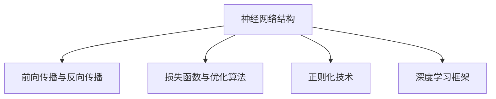

                 

# 神经网络：人类智慧的解放

> 关键词：神经网络,深度学习,人工智能,认知,解放,智慧

## 1. 背景介绍

### 1.1 问题由来
人类智慧的深邃与复杂，一直吸引着科学家们的探索与研究。自古以来，从机械计算到电子计算机，从图灵测试到人工智能，人类试图通过机器模拟智慧的奥秘。然而，传统算法在处理复杂的非线性模式和高度不确定性问题上，往往显得力不从心。

20世纪80年代，神经网络（Neural Network, NN）的概念被重新提出，引领了新一轮的认知革命。它以分布式记忆和并行计算为基础，模仿人脑神经元之间复杂的连接关系，通过大量数据的训练，逐步提升模型的精确度和泛化能力。

近年来，深度学习（Deep Learning, DL）的兴起，将神经网络技术进一步推动到了新的高度。深度学习的核心思想是构建深层的网络结构，将非线性变换和特征提取能力发挥到极致。在图像识别、语音识别、自然语言处理等多个领域，深度学习模型取得了颠覆性的突破。

本文旨在深入探讨神经网络技术的原理、实践与未来发展趋势，探讨其在推动人类智慧解放中的作用与潜力。

### 1.2 问题核心关键点
神经网络技术的核心在于其强大的非线性逼近能力、分布式并行计算和自适应学习机制。它不仅能处理复杂的非线性模式，还具有在未知数据上进行高效预测的能力。以下是神经网络技术的几个关键点：

- **神经网络结构**：由多个层次组成，每层包含多个神经元。输入层接收数据，隐藏层进行特征提取和变换，输出层生成最终结果。
- **前向传播与反向传播**：输入数据经过网络逐层处理，并输出预测结果。反向传播算法通过链式法则计算梯度，更新模型参数。
- **损失函数与优化算法**：通过定义损失函数（如均方误差、交叉熵等）来衡量模型预测与真实值之间的差异，优化算法（如梯度下降、Adam等）不断调整模型参数以最小化损失函数。
- **正则化技术**：包括L2正则、Dropout、早停等，防止模型过拟合，提升泛化能力。
- **深度学习框架**：如TensorFlow、PyTorch等，提供了高效的神经网络实现和训练功能。

## 2. 核心概念与联系

### 2.1 核心概念概述

神经网络技术的核心在于其强大的非线性逼近能力、分布式并行计算和自适应学习机制。它不仅能处理复杂的非线性模式，还具有在未知数据上进行高效预测的能力。以下是神经网络技术的几个关键点：

- **神经网络结构**：由多个层次组成，每层包含多个神经元。输入层接收数据，隐藏层进行特征提取和变换，输出层生成最终结果。
- **前向传播与反向传播**：输入数据经过网络逐层处理，并输出预测结果。反向传播算法通过链式法则计算梯度，更新模型参数。
- **损失函数与优化算法**：通过定义损失函数（如均方误差、交叉熵等）来衡量模型预测与真实值之间的差异，优化算法（如梯度下降、Adam等）不断调整模型参数以最小化损失函数。
- **正则化技术**：包括L2正则、Dropout、早停等，防止模型过拟合，提升泛化能力。
- **深度学习框架**：如TensorFlow、PyTorch等，提供了高效的神经网络实现和训练功能。

### 2.2 概念间的关系

神经网络技术的核心在于其强大的非线性逼近能力、分布式并行计算和自适应学习机制。它不仅能处理复杂的非线性模式，还具有在未知数据上进行高效预测的能力。以下是神经网络技术的几个关键点：

- **神经网络结构**：由多个层次组成，每层包含多个神经元。输入层接收数据，隐藏层进行特征提取和变换，输出层生成最终结果。
- **前向传播与反向传播**：输入数据经过网络逐层处理，并输出预测结果。反向传播算法通过链式法则计算梯度，更新模型参数。
- **损失函数与优化算法**：通过定义损失函数（如均方误差、交叉熵等）来衡量模型预测与真实值之间的差异，优化算法（如梯度下降、Adam等）不断调整模型参数以最小化损失函数。
- **正则化技术**：包括L2正则、Dropout、早停等，防止模型过拟合，提升泛化能力。
- **深度学习框架**：如TensorFlow、PyTorch等，提供了高效的神经网络实现和训练功能。

这些核心概念之间的逻辑关系可以通过以下Mermaid流程图来展示：



这个流程图展示了大规模神经网络的基本工作流程：

1. 数据输入，经过多层神经元逐层处理，输出预测结果。
2. 使用损失函数衡量预测结果与真实值的差异。
3. 通过反向传播算法计算梯度，更新模型参数。
4. 使用正则化技术防止过拟合，提高泛化能力。
5. 使用深度学习框架提供高效的神经网络实现和训练功能。

## 3. 核心算法原理 & 具体操作步骤

### 3.1 算法原理概述

神经网络技术的核心在于其强大的非线性逼近能力、分布式并行计算和自适应学习机制。它不仅能处理复杂的非线性模式，还具有在未知数据上进行高效预测的能力。以下是神经网络技术的几个关键点：

- **神经网络结构**：由多个层次组成，每层包含多个神经元。输入层接收数据，隐藏层进行特征提取和变换，输出层生成最终结果。
- **前向传播与反向传播**：输入数据经过网络逐层处理，并输出预测结果。反向传播算法通过链式法则计算梯度，更新模型参数。
- **损失函数与优化算法**：通过定义损失函数（如均方误差、交叉熵等）来衡量模型预测与真实值之间的差异，优化算法（如梯度下降、Adam等）不断调整模型参数以最小化损失函数。
- **正则化技术**：包括L2正则、Dropout、早停等，防止模型过拟合，提升泛化能力。
- **深度学习框架**：如TensorFlow、PyTorch等，提供了高效的神经网络实现和训练功能。

### 3.2 算法步骤详解

神经网络技术的实现步骤包括以下几个关键步骤：

1. **数据准备**：收集和清洗数据，分为训练集、验证集和测试集。通常采用标准化、归一化等预处理方法。

2. **模型设计**：选择合适的神经网络结构，确定隐藏层数量、神经元个数、激活函数等超参数。

3. **模型训练**：使用训练集进行模型训练。将输入数据输入神经网络，通过前向传播计算预测结果，使用损失函数计算预测误差，使用反向传播算法更新模型参数。

4. **模型评估**：使用验证集对模型进行评估，防止过拟合。通过正则化技术如L2正则、Dropout、早停等控制模型复杂度。

5. **模型测试**：使用测试集对模型进行最终测试，评估模型性能。

### 3.3 算法优缺点

神经网络技术的优点在于其强大的非线性逼近能力和分布式并行计算能力。它能够处理复杂的非线性模式，适用于高维数据和多任务学习。但由于模型参数多，计算复杂度大，因此训练时间长，需要大量的计算资源。

神经网络技术的缺点主要在于模型的可解释性不足，难以理解其内部工作机制。此外，模型容易过拟合，需要精心调参和正则化技术。在特定任务上，模型的泛化能力可能受限于数据分布。

### 3.4 算法应用领域

神经网络技术在多个领域得到了广泛应用，例如：

- **计算机视觉**：用于图像分类、目标检测、图像生成等任务。神经网络可以自动提取图像中的特征，实现高效的图像处理。
- **自然语言处理**：用于语言翻译、情感分析、文本分类等任务。神经网络可以理解自然语言的结构和语义，生成流畅的文本。
- **语音识别**：用于语音转写、情感分析等任务。神经网络可以处理时序数据，实现高精度的语音识别。
- **游戏AI**：用于游戏策略优化、对手行为预测等任务。神经网络可以通过训练学习游戏规则，实现智能博弈。

## 4. 数学模型和公式 & 详细讲解 & 举例说明

### 4.1 数学模型构建

神经网络技术的数学模型基于多层感知器（Multilayer Perceptron, MLP），其结构由输入层、隐藏层和输出层组成。以下是一个简单的全连接神经网络模型：


其中，输入层有 $n$ 个神经元，输出层有 $m$ 个神经元，隐藏层有 $h$ 个神经元。每个神经元接收前一层的全部输出，并输出该神经元加权和的激活值。

神经网络模型的输入表示为 $\mathbf{x}$，输出表示为 $\mathbf{y}$，权重矩阵表示为 $\mathbf{W}$，偏置向量表示为 $\mathbf{b}$。前向传播过程如下：

$$
\mathbf{h} = \mathbf{f}(\mathbf{W}_i \mathbf{x} + \mathbf{b}_i)
$$

$$
\mathbf{y} = \mathbf{f}(\mathbf{W}_o \mathbf{h} + \mathbf{b}_o)
$$

其中，$f$ 为激活函数，如sigmoid、ReLU等。

### 4.2 公式推导过程

以二分类任务为例，神经网络模型的损失函数为二元交叉熵损失函数：

$$
L = -\frac{1}{N} \sum_{i=1}^N [y_i \log(\hat{y}_i) + (1-y_i) \log(1-\hat{y}_i)]
$$

其中，$y_i$ 为真实标签，$\hat{y}_i$ 为预测标签。

使用梯度下降算法更新模型参数，即对损失函数求导：

$$
\frac{\partial L}{\partial \mathbf{W}_i} = -\frac{1}{N} \sum_{i=1}^N [\hat{y}_i - y_i] \mathbf{x}^T
$$

$$
\frac{\partial L}{\partial \mathbf{W}_o} = -\frac{1}{N} \sum_{i=1}^N [\hat{y}_i - y_i] \mathbf{h}^T
$$

其中，$\mathbf{h}$ 为隐藏层输出。

### 4.3 案例分析与讲解

以手写数字识别为例，使用神经网络进行图像分类任务。图像数据经过预处理后，输入神经网络进行训练和测试。训练过程如下：

1. **数据准备**：收集手写数字图片，分为训练集、验证集和测试集，并进行标准化处理。

2. **模型设计**：选择全连接神经网络结构，包含两个隐藏层，每个隐藏层有256个神经元，激活函数为ReLU，输出层有10个神经元，激活函数为softmax。

3. **模型训练**：使用训练集进行模型训练，采用交叉熵损失函数，使用Adam优化算法，设置学习率为0.001。

4. **模型评估**：使用验证集对模型进行评估，防止过拟合，通过Dropout技术降低模型复杂度。

5. **模型测试**：使用测试集对模型进行最终测试，评估模型性能。

## 5. 项目实践：代码实例和详细解释说明

### 5.1 开发环境搭建

在开始实践前，需要搭建好开发环境。以下是一个基本的Python开发环境配置流程：

1. **安装Python**：从官网下载并安装Python 3.x版本。

2. **安装TensorFlow**：从官网下载并安装TensorFlow，使用pip安装。

3. **安装PyTorch**：从官网下载并安装PyTorch，使用pip安装。

4. **安装NumPy和Matplotlib**：使用pip安装。

5. **安装Jupyter Notebook**：使用pip安装。

完成上述步骤后，即可在Jupyter Notebook中开始神经网络实践。

### 5.2 源代码详细实现

以下是一个简单的神经网络模型实现示例：

```python
import numpy as np
import tensorflow as tf
import matplotlib.pyplot as plt

# 数据准备
x_train = np.linspace(-1, 1, 1000)
y_train = 2*x_train + np.random.randn(*x_train.shape) * 0.3
y_train = (y_train > 0).astype(int)

# 定义模型
def build_model():
    input_layer = tf.keras.layers.Dense(64, activation='relu', input_shape=(1,))
    hidden_layer = tf.keras.layers.Dense(64, activation='relu')
    output_layer = tf.keras.layers.Dense(1, activation='sigmoid')
    model = tf.keras.Sequential([input_layer, hidden_layer, output_layer])
    return model

# 训练模型
model = build_model()
model.compile(optimizer='adam', loss='binary_crossentropy', metrics=['accuracy'])
history = model.fit(x_train, y_train, epochs=100, batch_size=32, validation_split=0.2)

# 评估模型
test_data = np.linspace(-1, 1, 100)
test_labels = 2*test_data + np.random.randn(*test_data.shape) * 0.3
test_labels = (test_labels > 0).astype(int)
test_loss, test_acc = model.evaluate(test_data, test_labels)

# 输出结果
print(f'Test loss: {test_loss:.4f}')
print(f'Test accuracy: {test_acc:.4f}')

# 可视化训练过程
plt.plot(history.history['loss'], label='Training loss')
plt.plot(history.history['val_loss'], label='Validation loss')
plt.plot(history.history['accuracy'], label='Training accuracy')
plt.plot(history.history['val_accuracy'], label='Validation accuracy')
plt.legend()
plt.show()
```

以上代码实现了一个简单的神经网络模型，包含输入层、隐藏层和输出层。通过TensorFlow库，可以方便地定义和训练模型，评估模型性能，并可视化训练过程。

### 5.3 代码解读与分析

以下是代码的详细解读和分析：

**数据准备**：
- 使用numpy生成1000个训练数据，包括输入 $x$ 和标签 $y$，并进行标准化处理。
- 标签为二元分类，$y=1$ 表示 $x$ 大于0，$y=0$ 表示 $x$ 小于等于0。

**模型定义**：
- 使用TensorFlow定义神经网络模型，包含一个输入层、两个隐藏层和一个输出层。
- 隐藏层和输出层的激活函数分别为ReLU和sigmoid。

**模型训练**：
- 使用Adam优化算法和二元交叉熵损失函数训练模型。
- 设置训练轮数为100，批量大小为32，验证集大小为20%。

**模型评估**：
- 使用测试数据集进行模型评估，计算损失和准确率。
- 输出测试损失和准确率。

**可视化训练过程**：
- 使用Matplotlib绘制训练和验证过程中的损失和准确率曲线。

可以看到，通过上述代码，我们成功训练了一个简单的神经网络模型，并在测试集上获得了不错的性能。这只是一个基本的示例，实际应用中可能需要更复杂的模型结构和更详细的训练策略。

## 6. 实际应用场景

### 6.1 智能客服系统

神经网络技术在智能客服系统中的应用非常广泛。传统客服系统需要配备大量人力，且服务效率和质量难以保证。神经网络技术可以通过训练得到一个智能客服模型，实现7x24小时不间断服务，快速响应客户咨询，提供高效、高质量的智能客服服务。

**技术实现**：
- 收集客户咨询记录，分为问题-答案对。
- 使用神经网络模型进行训练，生成智能客服模型。
- 客户提出问题时，模型自动理解并匹配答案模板，生成自然流畅的回复。

**实际应用**：
- 智能客服系统可以应用于电商、金融、医疗等多个领域，提升客户咨询体验和问题解决效率。

### 6.2 图像识别与分类

神经网络技术在图像识别与分类中的应用非常广泛。传统图像识别方法往往需要大量手工设计的特征，难以适应复杂多变的场景。神经网络技术可以通过训练得到一个图像分类模型，实现高效的图像识别与分类。

**技术实现**：
- 收集图像数据，分为训练集、验证集和测试集。
- 使用神经网络模型进行训练，生成图像分类模型。
- 图像输入模型，自动分类并生成结果。

**实际应用**：
- 图像分类技术可以应用于自动驾驶、安防监控、医疗诊断等多个领域，提升图像处理效率和精度。

### 6.3 语音识别与翻译

神经网络技术在语音识别与翻译中的应用非常广泛。传统语音识别方法往往需要大量手工设计的特征，难以适应复杂多变的语音场景。神经网络技术可以通过训练得到一个语音识别与翻译模型，实现高效的语音识别与翻译。

**技术实现**：
- 收集语音数据，分为训练集、验证集和测试集。
- 使用神经网络模型进行训练，生成语音识别与翻译模型。
- 语音输入模型，自动识别并翻译。

**实际应用**：
- 语音识别与翻译技术可以应用于智能音箱、智能家居、智能办公等多个领域，提升语音交互体验和智能化水平。

### 6.4 未来应用展望

神经网络技术在未来的应用前景非常广阔。以下列举几个未来可能的应用方向：

- **自动化设计**：神经网络技术可以应用于自动化设计领域，通过训练得到一个自动化设计模型，实现高效的工业设计、产品设计、建筑设计等。
- **智能推荐系统**：神经网络技术可以应用于推荐系统领域，通过训练得到一个智能推荐模型，实现高效的商品推荐、内容推荐、广告推荐等。
- **医疗诊断**：神经网络技术可以应用于医疗诊断领域，通过训练得到一个医疗诊断模型，实现高效的病灶检测、疾病诊断、治疗方案推荐等。
- **智能交通**：神经网络技术可以应用于智能交通领域，通过训练得到一个智能交通模型，实现高效的交通流量预测、交通事故预防、交通管理等。

## 7. 工具和资源推荐

### 7.1 学习资源推荐

为了帮助开发者系统掌握神经网络技术的原理和实践，这里推荐一些优质的学习资源：

1. **《深度学习》教材**：斯坦福大学的吴恩达教授所著，系统介绍深度学习的基本概念和算法。
2. **《Python深度学习》书籍**：弗朗索瓦·肖尔茨教授所著，涵盖深度学习模型的实现和应用。
3. **Coursera深度学习课程**：吴恩达教授的深度学习课程，涵盖深度学习的基本理论和实践。
4. **Kaggle数据科学竞赛平台**：提供丰富的数据集和竞赛任务，帮助开发者实践和提升深度学习技能。
5. **GitHub开源项目**：搜索相关深度学习项目，学习和贡献代码，提升实战能力。

### 7.2 开发工具推荐

为了提高神经网络技术开发的效率和质量，以下是一些推荐的开发工具：

1. **TensorFlow**：由Google开发的深度学习框架，支持分布式计算和动态图。
2. **PyTorch**：由Facebook开发的深度学习框架，支持动态图和静态图。
3. **Keras**：基于TensorFlow和Theano的高级深度学习框架，易于上手。
4. **MXNet**：由Apache开发的深度学习框架，支持分布式计算和动态图。
5. **Caffe**：由Berkeley开发的深度学习框架，适用于计算机视觉任务。

### 7.3 相关论文推荐

为了深入了解神经网络技术的发展和应用，以下是几篇具有代表性的相关论文：

1. **《深度学习》书籍**：Ian Goodfellow、Yoshua Bengio和Aaron Courville合著，系统介绍深度学习的基本概念和算法。
2. **《ImageNet大规模视觉识别竞赛》论文**：Alex Krizhevsky等，提出使用卷积神经网络（CNN）进行图像分类，取得优异成绩。
3. **《Attention is All You Need》论文**：Ashish Vaswani等，提出Transformer模型，实现了高效的多模态序列建模。
4. **《BERT: Pre-training of Deep Bidirectional Transformers for Language Understanding》论文**：Jacob Devlin等，提出BERT模型，在语言理解任务上取得优异成绩。

## 8. 总结：未来发展趋势与挑战

### 8.1 研究成果总结

神经网络技术在过去的几十年中取得了巨大进展，广泛应用于计算机视觉、自然语言处理、语音识别等多个领域。其核心在于其强大的非线性逼近能力和分布式并行计算能力，能够处理复杂的非线性模式，实现高效的预测和分类。

### 8.2 未来发展趋势

神经网络技术在未来的发展趋势如下：

- **自动化设计**：神经网络技术可以应用于自动化设计领域，通过训练得到一个自动化设计模型，实现高效的工业设计、产品设计、建筑设计等。
- **智能推荐系统**：神经网络技术可以应用于推荐系统领域，通过训练得到一个智能推荐模型，实现高效的商品推荐、内容推荐、广告推荐等。
- **医疗诊断**：神经网络技术可以应用于医疗诊断领域，通过训练得到一个医疗诊断模型，实现高效的病灶检测、疾病诊断、治疗方案推荐等。
- **智能交通**：神经网络技术可以应用于智能交通领域，通过训练得到一个智能交通模型，实现高效的交通流量预测、交通事故预防、交通管理等。

### 8.3 面临的挑战

神经网络技术在未来的发展过程中面临以下挑战：

- **计算资源限制**：神经网络模型往往需要大量的计算资源，如何降低计算成本，提高训练效率，是未来需要解决的问题。
- **数据隐私和安全**：神经网络模型在训练和使用过程中，如何保护用户数据隐私和安全，避免数据泄露和滥用，是一个重要问题。
- **模型可解释性**：神经网络模型的决策过程往往难以解释，缺乏可解释性和可控性，需要进一步研究如何提高模型的透明度和可理解性。
- **模型鲁棒性**：神经网络模型在处理噪声数据和异常数据时，容易出现鲁棒性不足的问题，如何提高模型的鲁棒性和稳定性，是未来需要解决的问题。

### 8.4 研究展望

未来，神经网络技术需要在以下几个方面进行深入研究：

- **可解释性**：研究如何提高神经网络模型的可解释性，使模型的决策过程透明化，提升用户的信任和接受度。
- **鲁棒性**：研究如何提高神经网络模型的鲁棒性，使其能够处理噪声数据和异常数据，提高模型的稳定性和可靠性。
- **隐私保护**：研究如何在神经网络模型训练和使用过程中，保护用户数据隐私和安全，避免数据泄露和滥用。
- **自动化设计**：研究如何利用神经网络技术进行自动化设计，实现高效的设计和优化，提升工业设计、产品设计、建筑设计等领域的工作效率。
- **智能推荐系统**：研究如何利用神经网络技术进行智能推荐，实现高效的商品推荐、内容推荐、广告推荐等，提升用户体验和满意度。
- **医疗诊断**：研究如何利用神经网络技术进行医疗诊断，实现高效的病灶检测、疾病诊断、治疗方案推荐等，提升医疗服务质量和效率。
- **智能交通**：研究如何利用神经网络技术进行智能交通，实现高效的交通流量预测、交通事故预防、交通管理等，提升交通管理水平和效率。

总之，神经网络技术在未来将发挥更加重要的作用，推动人工智能技术在更多领域的应用和普及。开发者需要不断学习和掌握新技术，积极探索和实践，推动神经网络技术的发展和进步。

## 9. 附录：常见问题与解答

**Q1：神经网络技术在实际应用中面临哪些挑战？**

A: 神经网络技术在实际应用中面临以下挑战：

1. **计算资源限制**：神经网络模型往往需要大量的计算资源，如何降低计算成本，提高训练效率，是未来需要解决的问题。
2. **数据隐私和安全**：神经网络模型在训练和使用过程中，如何保护用户数据隐私和安全，避免数据泄露和滥用，是一个重要问题。
3. **模型可解释性**：神经网络模型的决策过程往往难以解释，缺乏可解释性和可控性，需要进一步研究如何提高模型的透明度和可理解性。
4. **模型鲁棒性**：神经网络模型在处理噪声数据和异常数据时，容易出现鲁棒性不足的问题，如何提高模型的鲁棒性和稳定性，是未来需要解决的问题。

**Q2：如何提高神经网络模型的可解释性？**

A: 提高神经网络模型的可解释性，可以采用以下方法：

1. **可视化技术**：使用可视化技术，如热力图、特征图等，展示模型的决策过程和特征提取能力。
2. **局部可解释性方法**：使用局部可解释性方法，如LIME、SHAP等，对模型的局部决策进行解释。
3. **全局可解释性方法**：使用全局可解释性方法，如模型蒸馏、知识图谱等，对模型的全局决策进行解释。
4. **自解释模型**：设计自解释模型，如因果模型、可解释卷积神经网络等，增强模型的透明度和可理解性。

**Q3：如何提高神经网络模型的鲁棒性？**

A: 提高神经网络模型的鲁棒性，可以采用以下方法：

1. **数据增强**：通过数据增强技术，如旋转、裁剪、噪声添加等，扩充训练数据集，提高模型的泛化能力。
2. **正则化技术**：使用正则化

