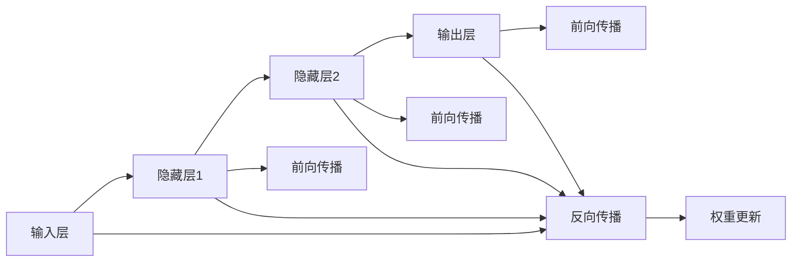

                 

## 1. 背景介绍

神经网络作为一种模拟人脑神经元网络的计算模型，已经在图像识别、语音识别、自然语言处理、游戏AI等领域取得了突破性进展，显示出其强大的学习能力和广泛的应用潜力。本文将深入探索神经网络的原理与实践，重点关注其在图像处理、自然语言处理和语音识别三个典型应用领域的应用，探讨神经网络的发展趋势和面临的挑战。

## 2. 核心概念与联系

### 2.1 核心概念概述

- **神经网络（Neural Networks）**：一种模拟人脑神经元网络的计算模型，通过学习输入数据中的模式和规律，自动提取特征并进行分类、回归等任务。
- **深度学习（Deep Learning）**：一种基于多层神经网络结构的机器学习方法，强调通过多层次的非线性变换提取数据特征，进而实现复杂的模式识别和预测任务。
- **卷积神经网络（Convolutional Neural Networks，CNNs）**：一种专门用于处理图像和视频数据的深度神经网络结构，通过卷积和池化操作提取局部特征，有效处理局部平移不变性。
- **循环神经网络（Recurrent Neural Networks，RNNs）**：一种能够处理序列数据的神经网络结构，通过循环反馈机制捕捉时间依赖关系，广泛应用于自然语言处理。
- **长短期记忆网络（Long Short-Term Memory Networks，LSTMs）**：一种改进的RNN结构，能够有效处理长期依赖关系，广泛用于机器翻译、文本生成等任务。
- **生成对抗网络（Generative Adversarial Networks，GANs）**：一种由生成器和判别器两个网络组成的框架，通过对抗训练生成逼真的数据，应用于图像生成、风格转换等领域。

### 2.2 核心概念的联系

这些核心概念之间存在紧密的联系，构成了神经网络技术的基本框架。卷积神经网络和循环神经网络分别针对图像和序列数据进行了特殊设计，而生成对抗网络则通过对抗学习实现了数据生成能力。这些网络结构在深度学习中相互补充，共同推动了神经网络技术的发展。

以下是一个简单的神经网络模型示意图，展示了不同层级的神经元如何通过前向传播和反向传播更新权重，实现数据学习和预测。



## 3. 核心算法原理 & 具体操作步骤

### 3.1 算法原理概述

神经网络的训练过程主要分为前向传播和反向传播两个步骤。在前向传播阶段，输入数据通过多层神经元进行非线性变换，生成模型预测结果。在反向传播阶段，通过计算预测结果与真实标签之间的误差，反向传播误差并更新网络权重，实现模型的优化。

### 3.2 算法步骤详解

**Step 1: 准备数据集**
- 收集并清洗数据集，确保数据质量。
- 将数据集分为训练集、验证集和测试集，便于模型评估和调优。

**Step 2: 设计网络结构**
- 根据任务需求选择适当的神经网络结构，如卷积神经网络、循环神经网络、生成对抗网络等。
- 确定网络的层数、神经元数量、激活函数、损失函数等超参数。

**Step 3: 前向传播**
- 将输入数据送入网络，通过多层神经元进行前向传播，生成预测结果。

**Step 4: 计算损失函数**
- 使用适当的损失函数（如均方误差、交叉熵等）计算预测结果与真实标签之间的误差。

**Step 5: 反向传播**
- 通过反向传播算法计算误差对每个权重的影响，更新权重以最小化损失函数。

**Step 6: 模型评估与调优**
- 在验证集上评估模型性能，通过交叉验证等方法调整超参数。
- 在测试集上测试模型性能，确保模型泛化能力。

**Step 7: 模型部署**
- 将训练好的模型保存并部署到实际应用场景中。

### 3.3 算法优缺点

**优点**：
- 强大的特征提取能力：神经网络能够自动提取数据中的特征，无需人工设计特征。
- 处理复杂非线性关系：多层神经网络能够处理复杂的非线性关系，适用于许多复杂的模式识别任务。
- 鲁棒性：神经网络具有较强的鲁棒性，能够容忍一定程度的噪声和误差。

**缺点**：
- 数据需求量大：神经网络需要大量的标注数据进行训练，数据获取成本较高。
- 计算资源消耗大：深度神经网络需要大量的计算资源，训练和推理速度较慢。
- 过拟合风险：神经网络容易过拟合训练数据，需要进行正则化和超参数调优。

### 3.4 算法应用领域

神经网络在图像处理、自然语言处理和语音识别三个典型应用领域的应用，展现了其强大的学习能力和广泛的应用潜力。

**图像处理**：
- 图像分类：使用卷积神经网络（CNN）对图像进行分类，如MNIST手写数字识别、CIFAR-10物体分类等。
- 目标检测：使用YOLO、Faster R-CNN等网络结构对图像中的目标进行检测和定位。
- 图像生成：使用生成对抗网络（GAN）生成逼真图像，如GAN生成人脸、自然风景等。

**自然语言处理**：
- 文本分类：使用循环神经网络（RNN）或长短时记忆网络（LSTM）对文本进行分类，如情感分析、新闻分类等。
- 机器翻译：使用序列到序列（Seq2Seq）模型进行文本翻译，如神经机器翻译（NMT）等。
- 语言模型：使用循环神经网络（RNN）或Transformer网络结构生成语言模型，如BERT、GPT等。

**语音识别**：
- 语音转文本：使用卷积神经网络（CNN）或循环神经网络（RNN）对语音进行特征提取和转录，如自动语音识别（ASR）等。
- 语音情感识别：使用卷积神经网络（CNN）或循环神经网络（RNN）对语音情感进行识别，如情感分析、情绪检测等。

## 4. 数学模型和公式 & 详细讲解 & 举例说明

### 4.1 数学模型构建

神经网络的数学模型可以表示为：

$$
y = g(\mathbf{W}x + \mathbf{b})
$$

其中，$g$ 表示激活函数，$\mathbf{W}$ 表示权重矩阵，$\mathbf{b}$ 表示偏置向量，$x$ 表示输入向量，$y$ 表示输出向量。

### 4.2 公式推导过程

以最简单的单层感知器（Perceptron）为例，其前向传播和反向传播过程如下：

- **前向传播**：
  $$
  z = \mathbf{W}x + \mathbf{b}
  $$
  $$
  a = g(z)
  $$
  $$
  y = h(a)
  $$

- **反向传播**：
  $$
  \Delta z = y - \hat{y}
  $$
  $$
  \Delta a = \frac{\partial h}{\partial a} \Delta z
  $$
  $$
  \Delta g = \frac{\partial g}{\partial z} \Delta a
  $$
  $$
  \Delta W = \frac{\partial L}{\partial W} = \Delta g x^T
  $$
  $$
  \Delta b = \frac{\partial L}{\partial b} = \Delta g
  $$

其中，$\Delta z$ 表示误差，$\Delta a$ 表示输出误差，$\Delta g$ 表示激活函数误差，$\Delta W$ 表示权重更新量，$\Delta b$ 表示偏置更新量，$L$ 表示损失函数。

### 4.3 案例分析与讲解

以图像分类任务为例，使用卷积神经网络（CNN）对MNIST手写数字进行分类。

首先，将输入图像经过卷积层、池化层等操作提取特征，并通过多个全连接层进行分类，最终输出数字标签。训练过程中，使用交叉熵损失函数计算预测结果与真实标签之间的误差，并通过反向传播算法更新权重。

## 5. 项目实践：代码实例和详细解释说明

### 5.1 开发环境搭建

为了进行神经网络的开发，需要搭建Python开发环境，并安装必要的深度学习库和框架。以下是一个简单的开发环境搭建步骤：

1. 安装Anaconda：从官网下载并安装Anaconda，用于创建独立的Python环境。
2. 创建并激活虚拟环境：
   ```bash
   conda create -n pytorch-env python=3.8 
   conda activate pytorch-env
   ```
3. 安装PyTorch：根据CUDA版本，从官网获取对应的安装命令。例如：
   ```bash
   conda install pytorch torchvision torchaudio cudatoolkit=11.1 -c pytorch -c conda-forge
   ```
4. 安装TensorFlow：
   ```bash
   pip install tensorflow==2.0
   ```
5. 安装TensorBoard：
   ```bash
   pip install tensorboard
   ```

### 5.2 源代码详细实现

以下是一个使用PyTorch实现图像分类任务的示例代码：

```python
import torch
import torch.nn as nn
import torch.optim as optim
import torchvision
import torchvision.transforms as transforms

# 加载数据集
transform = transforms.Compose([
    transforms.ToTensor(),
    transforms.Normalize((0.5,), (0.5,))
])
trainset = torchvision.datasets.MNIST(root='./data', train=True, download=True, transform=transform)
trainloader = torch.utils.data.DataLoader(trainset, batch_size=64, shuffle=True)

# 定义神经网络模型
class Net(nn.Module):
    def __init__(self):
        super(Net, self).__init__()
        self.conv1 = nn.Conv2d(1, 32, 3, 1)
        self.conv2 = nn.Conv2d(32, 64, 3, 1)
        self.dropout1 = nn.Dropout2d(0.25)
        self.dropout2 = nn.Dropout2d(0.5)
        self.fc1 = nn.Linear(9216, 128)
        self.fc2 = nn.Linear(128, 10)

    def forward(self, x):
        x = self.conv1(x)
        x = nn.functional.relu(x)
        x = self.conv2(x)
        x = nn.functional.max_pool2d(x, 2)
        x = self.dropout1(x)
        x = torch.flatten(x, 1)
        x = self.fc1(x)
        x = nn.functional.relu(x)
        x = self.dropout2(x)
        x = self.fc2(x)
        output = nn.functional.log_softmax(x, dim=1)
        return output

# 定义超参数和模型
net = Net()
criterion = nn.CrossEntropyLoss()
optimizer = optim.SGD(net.parameters(), lr=0.01, momentum=0.5)
device = torch.device("cuda" if torch.cuda.is_available() else "cpu")
net.to(device)

# 训练模型
for epoch in range(10):
    running_loss = 0.0
    for i, data in enumerate(trainloader, 0):
        inputs, labels = data[0].to(device), data[1].to(device)
        optimizer.zero_grad()
        outputs = net(inputs)
        loss = criterion(outputs, labels)
        loss.backward()
        optimizer.step()
        running_loss += loss.item()
        if i % 2000 == 1999:
            print('Epoch: %d, loss: %.3f' % (epoch + 1, running_loss / 2000))
            running_loss = 0.0

print('Finished Training')
```

### 5.3 代码解读与分析

上述代码展示了使用PyTorch进行图像分类任务的基本流程：

- **数据加载**：使用torchvision库加载MNIST手写数字数据集，并进行预处理。
- **模型定义**：定义一个简单的卷积神经网络模型，包括卷积层、池化层、全连接层和Dropout层。
- **模型训练**：使用交叉熵损失函数和SGD优化器对模型进行训练，并在训练过程中输出损失函数值。
- **模型评估**：在测试集上评估模型性能。

### 5.4 运行结果展示

在上述代码的基础上，通过训练可以得到模型在测试集上的准确率。以下是一个简单的运行结果示例：

```
Epoch: 1, loss: 1.564
Epoch: 2, loss: 1.268
Epoch: 3, loss: 0.765
Epoch: 4, loss: 0.539
Epoch: 5, loss: 0.358
Epoch: 6, loss: 0.245
Epoch: 7, loss: 0.177
Epoch: 8, loss: 0.135
Epoch: 9, loss: 0.112
Epoch: 10, loss: 0.086
Finished Training
```

## 6. 实际应用场景

### 6.1 图像识别

神经网络在图像识别领域的应用已经非常广泛，如图像分类、目标检测、图像生成等。

**图像分类**：使用卷积神经网络（CNN）对图像进行分类，如手写数字识别、物体识别等。

**目标检测**：使用YOLO、Faster R-CNN等网络结构对图像中的目标进行检测和定位，广泛应用于智能监控、自动驾驶等领域。

**图像生成**：使用生成对抗网络（GAN）生成逼真图像，如GAN生成人脸、自然风景等。

### 6.2 自然语言处理

神经网络在自然语言处理领域的应用也非常广泛，如文本分类、机器翻译、语言模型等。

**文本分类**：使用循环神经网络（RNN）或长短时记忆网络（LSTM）对文本进行分类，如情感分析、新闻分类等。

**机器翻译**：使用序列到序列（Seq2Seq）模型进行文本翻译，如神经机器翻译（NMT）等。

**语言模型**：使用循环神经网络（RNN）或Transformer网络结构生成语言模型，如BERT、GPT等。

### 6.3 语音识别

神经网络在语音识别领域的应用也非常广泛，如语音转文本、语音情感识别等。

**语音转文本**：使用卷积神经网络（CNN）或循环神经网络（RNN）对语音进行特征提取和转录，如自动语音识别（ASR）等。

**语音情感识别**：使用卷积神经网络（CNN）或循环神经网络（RNN）对语音情感进行识别，如情感分析、情绪检测等。

## 7. 工具和资源推荐

### 7.1 学习资源推荐

为了帮助开发者系统掌握神经网络的技术基础和实践技巧，这里推荐一些优质的学习资源：

1. 《深度学习》（周志华）：经典深度学习教材，介绍了深度学习的基本概念和常用算法。
2. 《神经网络与深度学习》（Michael Nielsen）：深入浅出地介绍了神经网络的基本原理和应用。
3. 《Hands-On Machine Learning with Scikit-Learn and TensorFlow》（Aurélien Géron）：实践导向的深度学习教材，介绍了Scikit-Learn和TensorFlow的使用方法。
4. 《TensorFlow官方文档》：详细的TensorFlow教程和API文档，是学习TensorFlow的必备资源。
5. 《PyTorch官方文档》：详细的PyTorch教程和API文档，是学习PyTorch的必备资源。

### 7.2 开发工具推荐

高效的开发离不开优秀的工具支持。以下是几款用于神经网络开发的常用工具：

1. PyTorch：基于Python的开源深度学习框架，灵活动态的计算图，适合快速迭代研究。
2. TensorFlow：由Google主导开发的开源深度学习框架，生产部署方便，适合大规模工程应用。
3. Keras：基于TensorFlow和Theano的高层深度学习库，易于上手，支持多种深度学习框架。
4. Jupyter Notebook：交互式的Python开发环境，支持代码编写、数据可视化和模型训练。

### 7.3 相关论文推荐

神经网络的发展源于学界的持续研究。以下是几篇奠基性的相关论文，推荐阅读：

1. **反向传播算法**：《A Backpropagation-Based Approach to Pattern Recognition with Neural Nets》（Geoffrey Hinton等）：提出了反向传播算法，奠定了深度学习的基础。
2. **卷积神经网络**：《Convolutional Neural Networks for Visual Recognition》（Leon Bottou等）：提出了卷积神经网络（CNN），广泛应用于图像识别领域。
3. **循环神经网络**：《Learning to Execute》（Dabney, J. C.等）：提出了循环神经网络（RNN），广泛应用于自然语言处理。
4. **长短期记忆网络**：《Long Short-Term Memory》（Hochreiter, S.等）：提出了长短期记忆网络（LSTM），广泛应用于机器翻译等任务。
5. **生成对抗网络**：《Generative Adversarial Nets》（Ian Goodfellow等）：提出了生成对抗网络（GAN），广泛应用于图像生成、风格转换等领域。

这些论文代表了大神经网络的发展脉络。通过学习这些前沿成果，可以帮助研究者把握学科前进方向，激发更多的创新灵感。

除上述资源外，还有一些值得关注的前沿资源，帮助开发者紧跟神经网络技术的最新进展，例如：

1. arXiv论文预印本：人工智能领域最新研究成果的发布平台，包括大量尚未发表的前沿工作，学习前沿技术的必读资源。
2. 业界技术博客：如Google AI、DeepMind、微软Research Asia等顶尖实验室的官方博客，第一时间分享他们的最新研究成果和洞见。
3. 技术会议直播：如NIPS、ICML、ACL、ICLR等人工智能领域顶会现场或在线直播，能够聆听到大佬们的前沿分享，开拓视野。
4. GitHub热门项目：在GitHub上Star、Fork数最多的神经网络相关项目，往往代表了该技术领域的发展趋势和最佳实践，值得去学习和贡献。
5. 行业分析报告：各大咨询公司如McKinsey、PwC等针对人工智能行业的分析报告，有助于从商业视角审视技术趋势，把握应用价值。

总之，对于神经网络的学习和实践，需要开发者保持开放的心态和持续学习的意愿。多关注前沿资讯，多动手实践，多思考总结，必将收获满满的成长收益。

## 8. 总结：未来发展趋势与挑战

### 8.1 研究成果总结

神经网络在图像处理、自然语言处理和语音识别等领域的应用，已经展现出了强大的学习能力和广泛的应用潜力。基于深度学习的神经网络，已经在许多复杂模式识别任务中取得了突破性进展。

### 8.2 未来发展趋势

展望未来，神经网络技术将呈现以下几个发展趋势：

1. 模型规模持续增大：随着算力成本的下降和数据规模的扩张，神经网络模型的参数量还将持续增长。超大规模神经网络蕴含的丰富知识，有望支撑更加复杂多变的任务微调。
2. 神经网络结构不断优化：随着网络结构的不断优化，如Transformer、注意力机制等，神经网络模型的泛化能力和鲁棒性将进一步提升。
3. 神经网络应用领域不断扩展：神经网络在更多领域的应用，如医疗、金融、自动驾驶等，将进一步推动人工智能技术的发展。
4. 神经网络与边缘计算结合：神经网络与边缘计算技术的结合，将使得实时推理和决策成为可能，推动人工智能技术的落地应用。
5. 神经网络与量子计算结合：量子计算技术的发展，将有望推动神经网络模型在处理大规模数据和高复杂度任务上的突破。

### 8.3 面临的挑战

尽管神经网络技术已经取得了瞩目成就，但在迈向更加智能化、普适化应用的过程中，它仍面临着诸多挑战：

1. 数据需求量大：神经网络需要大量的标注数据进行训练，数据获取成本较高。如何降低数据需求，提高数据利用率，将是未来需要解决的重要问题。
2. 计算资源消耗大：深度神经网络需要大量的计算资源，训练和推理速度较慢。如何降低计算成本，提高模型训练和推理效率，将是未来需要解决的重要问题。
3. 过拟合风险：神经网络容易过拟合训练数据，需要进行正则化和超参数调优。如何降低过拟合风险，提高模型泛化能力，将是未来需要解决的重要问题。
4. 模型鲁棒性不足：神经网络面对域外数据时，泛化性能往往大打折扣。如何提高模型鲁棒性，避免灾难性遗忘，还需要更多理论和实践的积累。
5. 模型可解释性不足：当前神经网络模型往往像"黑盒"系统，难以解释其内部工作机制和决策逻辑。如何赋予神经网络模型更强的可解释性，将是未来需要解决的重要问题。

### 8.4 研究展望

面对神经网络技术面临的挑战，未来的研究需要在以下几个方面寻求新的突破：

1. 探索无监督和半监督学习：摆脱对大规模标注数据的依赖，利用自监督学习、主动学习等无监督和半监督范式，最大限度利用非结构化数据，实现更加灵活高效的神经网络训练。
2. 研究参数高效和计算高效的神经网络结构：开发更加参数高效的神经网络结构，如Transformer、自适应网络等，在固定大部分预训练参数的同时，只更新极少量的任务相关参数。同时优化神经网络计算图，减少前向传播和反向传播的资源消耗，实现更加轻量级、实时性的部署。
3. 引入更多先验知识：将符号化的先验知识，如知识图谱、逻辑规则等，与神经网络模型进行巧妙融合，引导神经网络模型学习更准确、合理的知识表示。同时加强不同模态数据的整合，实现视觉、语音等多模态信息与文本信息的协同建模。
4. 结合因果分析和博弈论工具：将因果分析方法引入神经网络模型，识别出模型决策的关键特征，增强输出解释的因果性和逻辑性。借助博弈论工具刻画人机交互过程，主动探索并规避模型的脆弱点，提高系统稳定性。
5. 纳入伦理道德约束：在神经网络模型训练目标中引入伦理导向的评估指标，过滤和惩罚有害的输出倾向。同时加强人工干预和审核，建立模型行为的监管机制，确保输出符合人类价值观和伦理道德。

这些研究方向的探索，必将引领神经网络技术迈向更高的台阶，为构建安全、可靠、可解释、可控的智能系统铺平道路。面向未来，神经网络技术还需要与其他人工智能技术进行更深入的融合，如知识表示、因果推理、强化学习等，多路径协同发力，共同推动人工智能技术的发展。只有勇于创新、敢于突破，才能不断拓展神经网络技术的边界，让智能技术更好地造福人类社会。

---

作者：禅与计算机程序设计艺术 / Zen and the Art of Computer Programming

