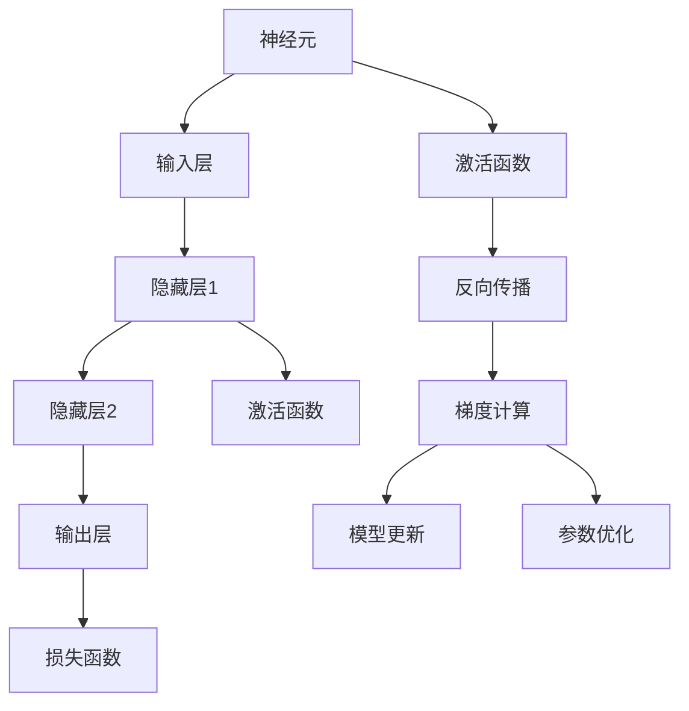

                 

# 神经网络：推动社会进步的力量

> 关键词：神经网络,深度学习,人工智能,社会进步,数据驱动,创新变革

## 1. 背景介绍

### 1.1 问题由来
在21世纪，随着信息技术和大数据时代的到来，人类社会正经历一场前所未有的创新变革。人工智能（AI）作为这场变革的主力军，正在深度改变我们的生活和工作方式。而在这背后，神经网络作为AI的核心技术，发挥了至关重要的作用。

神经网络（Neural Network, NN）是模仿人类神经系统结构和工作原理的计算模型。它通过大量数据的学习，自动发现数据中的模式和规律，从而实现数据的自动化处理和智能决策。这种技术已经广泛应用于图像识别、语音识别、自然语言处理、医疗诊断等多个领域，并展现出巨大的社会进步潜力。

### 1.2 问题核心关键点
神经网络技术的突破源于20世纪80年代后期，得益于反向传播（Backpropagation）算法的提出。该算法通过反向计算梯度，使得神经网络可以进行高效的训练和优化。神经网络的核心组成包括输入层、隐藏层和输出层，其中隐藏层的多层结构使其具有强大的特征提取和模式识别能力。

随着深度学习（Deep Learning）技术的发展，神经网络逐渐演变为深层神经网络（Deep Neural Network, DNN），其包含多个隐藏层，能够处理更加复杂的数据结构，具备更强的学习和泛化能力。如今，深度神经网络已经成为推动AI技术发展的重要驱动力，广泛应用于各个领域，对社会进步产生了深远影响。

### 1.3 问题研究意义
神经网络技术的研究与应用，不仅提升了数据的处理能力，推动了AI技术的快速迭代，还促进了产业升级和创新变革。其具体意义如下：

1. **提升数据处理效率**：神经网络通过自动化数据分析，极大地提升了数据处理的效率和准确性，使得数据驱动的决策变得更为可靠。
2. **促进技术创新**：神经网络的发展催生了深度学习、计算机视觉、自然语言处理等一系列新兴技术，为科研和应用提供了新工具和新方法。
3. **推动行业升级**：神经网络在金融、医疗、制造等多个行业的应用，加速了传统行业的数字化转型，提升了产业的智能化水平。
4. **助力社会进步**：神经网络技术在医疗、教育、环境保护等方面的应用，改善了人类的生活质量，推动了社会进步的步伐。
5. **赋能产业发展**：神经网络技术为新兴产业如自动驾驶、智能制造、智慧城市等提供了技术支持，推动了产业生态的发展。

## 2. 核心概念与联系

### 2.1 核心概念概述

神经网络的核心概念主要包括：

- **神经元（Neuron）**：神经网络的基本组成单位，对应于人脑中的神经元。神经元接收输入，经过计算后输出结果。
- **层（Layer）**：神经网络的分层结构，包括输入层、隐藏层和输出层。隐藏层的多层结构使得神经网络具备更强的特征提取能力。
- **激活函数（Activation Function）**：用于引入非线性变换，提升神经网络的表达能力。
- **反向传播（Backpropagation）**：神经网络的训练算法，通过反向计算梯度，更新模型参数，使得神经网络能够自适应学习。
- **损失函数（Loss Function）**：用于衡量神经网络输出的准确性，常见如均方误差、交叉熵等。

### 2.2 概念间的关系

这些核心概念通过以下Mermaid流程图展示了它们之间的联系：



这个流程图展示了神经网络的基本组成和训练流程。

## 3. 核心算法原理 & 具体操作步骤
### 3.1 算法原理概述

神经网络的训练过程可以分为前向传播和反向传播两个阶段。前向传播时，数据从输入层传入，经过每一层神经元计算后，最终输出到输出层。反向传播时，根据输出结果与真实标签之间的误差，通过梯度下降等优化算法，更新模型参数，使得误差最小化。

数学上，设神经网络包含 $n$ 个隐藏层，输入为 $x$，输出为 $y$，权重矩阵为 $W$，偏置向量为 $b$。前向传播过程可以表示为：

$$
y = f(\dot{W}x + b)
$$

其中 $f$ 为激活函数，$\dot{W}$ 为权重矩阵，$x$ 为输入向量，$b$ 为偏置向量。

反向传播过程中，设损失函数为 $L(y, y')$，其中 $y'$ 为模型预测输出。误差传播的链式法则可以表示为：

$$
\frac{\partial L}{\partial w_{i,j}} = \frac{\partial L}{\partial y} \frac{\partial y}{\partial z_{i}} \frac{\partial z_{i}}{\partial w_{i,j}}
$$

其中 $z_{i}$ 为第 $i$ 层的输出。

### 3.2 算法步骤详解

神经网络训练的主要步骤如下：

1. **初始化权重和偏置**：随机初始化神经网络中的所有权重和偏置。
2. **前向传播**：输入数据，逐层计算得到输出结果。
3. **计算损失**：根据真实标签与模型预测输出计算损失函数。
4. **反向传播**：根据损失函数计算误差梯度，反向传播更新权重和偏置。
5. **参数优化**：使用优化算法如梯度下降法，更新模型参数，最小化损失函数。
6. **迭代训练**：重复上述步骤，直至损失函数收敛或达到预设的迭代次数。

### 3.3 算法优缺点

神经网络技术的优点包括：

- **强大的非线性映射能力**：多层的神经网络能够处理复杂的数据结构，具备强大的特征提取和模式识别能力。
- **泛化能力强**：神经网络能够适应各类数据分布，具有较好的泛化能力。
- **灵活性强**：神经网络可以根据任务需求设计不同结构，适应多种应用场景。

但神经网络技术也存在一些缺点：

- **数据需求大**：神经网络需要大量标注数据进行训练，数据采集和标注成本较高。
- **计算资源消耗高**：神经网络计算量大，对硬件资源要求较高。
- **可解释性差**：神经网络模型复杂，其内部决策过程难以解释，缺乏透明度。
- **模型过拟合风险高**：当数据量不足时，神经网络容易过拟合，泛化性能下降。

### 3.4 算法应用领域

神经网络技术已经在多个领域得到广泛应用，以下是几个典型应用：

- **计算机视觉**：神经网络在图像识别、物体检测、人脸识别等方面取得了卓越成绩。
- **自然语言处理**：神经网络在机器翻译、情感分析、文本生成等方面表现出色。
- **语音识别**：神经网络在语音识别和语音合成中具有重要应用。
- **医疗诊断**：神经网络在医学影像分析、疾病诊断等方面取得了突破性进展。
- **自动驾驶**：神经网络在自动驾驶中的物体识别和路径规划中具有重要作用。
- **金融风控**：神经网络在信用评分、欺诈检测等方面具有实际应用价值。
- **智能制造**：神经网络在智能制造中的质量检测、工艺优化等方面展现了巨大潜力。
- **智慧城市**：神经网络在智慧城市中的交通管理、环境监测等方面具有重要应用。

## 4. 数学模型和公式 & 详细讲解 & 举例说明

### 4.1 数学模型构建

我们以一个简单的多层感知器（Multilayer Perceptron, MLP）为例，展示神经网络的数学建模过程。

设一个包含 $n$ 个隐藏层的神经网络，输入为 $x$，输出为 $y$，权重矩阵为 $W$，偏置向量为 $b$，激活函数为 $f$。神经网络的数学模型可以表示为：

$$
y = f(\dot{W}x + b)
$$

其中 $\dot{W}$ 表示矩阵乘积。

### 4.2 公式推导过程

假设我们有一个二分类任务，损失函数为二元交叉熵损失，即：

$$
L(y, y') = -y' \log y - (1 - y') \log (1 - y)
$$

设输入 $x$ 为 $x = [1, 2, 3]^T$，输出 $y$ 为 $y = f(\dot{W}x + b)$。激活函数 $f$ 为 sigmoid 函数，即 $f(x) = \frac{1}{1 + e^{-x}}$。设权重矩阵 $W$ 为 $W = \begin{bmatrix} 0.5 & 0.5 \\ 0.5 & 0.5 \end{bmatrix}$，偏置向量 $b$ 为 $b = [0.5, 0.5]^T$。

将输入 $x$ 带入模型，得到输出 $y = \frac{1}{1 + e^{-(\dot{W}x + b)}} = \frac{1}{1 + e^{-(1 \cdot 0.5 + 2 \cdot 0.5 + 3 \cdot 0.5 + 0.5)}} = 0.5$。

将真实标签 $y'$ 代入损失函数，得到：

$$
L(0.5, 0.5) = -0.5 \log 0.5 - (1 - 0.5) \log (1 - 0.5) = -\log 0.5 - \log 0.5 = -2 \log 0.5 = -2
$$

计算误差梯度，得到：

$$
\frac{\partial L}{\partial b} = -1, \frac{\partial L}{\partial W} = \begin{bmatrix} -0.5 & -0.5 \\ -0.5 & -0.5 \end{bmatrix}
$$

使用梯度下降法更新权重和偏置，得到：

$$
W \leftarrow W - \eta \frac{\partial L}{\partial W}, b \leftarrow b - \eta \frac{\partial L}{\partial b}
$$

其中 $\eta$ 为学习率。

### 4.3 案例分析与讲解

以下通过一个实际案例，展示神经网络在图像识别中的应用。

假设我们有一个手写数字识别任务，输入为一张包含手写数字的灰度图像，输出为对应的数字标签。我们将图像输入到一个全连接的前馈神经网络中，网络结构如下：

```
输入层：28x28=784
隐藏层1：128
隐藏层2：64
输出层：10
```

我们将输入图像展开为向量，并输入到网络中，经过隐藏层计算后，输出到输出层。设隐藏层1和隐藏层2的激活函数分别为 ReLU 和 sigmoid。

假设损失函数为交叉熵损失，激活函数 $f$ 为 sigmoid 函数，权重矩阵 $W$ 和偏置向量 $b$ 初始化为随机数。使用梯度下降法训练模型，直至损失函数收敛。

训练完成后，我们将新的输入图像输入到训练好的模型中，得到输出结果，与真实标签比较，计算损失函数，继续反向传播更新模型参数。

## 5. 项目实践：代码实例和详细解释说明

### 5.1 开发环境搭建

在进行神经网络项目实践前，我们需要准备好开发环境。以下是使用Python进行TensorFlow开发的Python环境配置流程：

1. 安装Anaconda：从官网下载并安装Anaconda，用于创建独立的Python环境。

2. 创建并激活虚拟环境：
```bash
conda create -n tf-env python=3.8 
conda activate tf-env
```

3. 安装TensorFlow：根据CUDA版本，从官网获取对应的安装命令。例如：
```bash
conda install tensorflow -c pytorch -c conda-forge
```

4. 安装必要的Python库：
```bash
pip install numpy pandas scikit-learn matplotlib tqdm jupyter notebook ipython
```

完成上述步骤后，即可在`tf-env`环境中开始神经网络项目实践。

### 5.2 源代码详细实现

以下是一个简单的TensorFlow实现神经网络的代码示例。

```python
import tensorflow as tf
from tensorflow.keras import layers

# 定义神经网络模型
model = tf.keras.Sequential([
    layers.Dense(128, activation='relu', input_shape=(784,)),
    layers.Dense(64, activation='relu'),
    layers.Dense(10, activation='sigmoid')
])

# 编译模型
model.compile(optimizer=tf.keras.optimizers.Adam(learning_rate=0.001),
              loss=tf.keras.losses.SparseCategoricalCrossentropy(from_logits=True),
              metrics=['accuracy'])

# 加载数据集
(x_train, y_train), (x_test, y_test) = tf.keras.datasets.mnist.load_data()

# 数据预处理
x_train = x_train.reshape((60000, 784))
x_test = x_test.reshape((10000, 784))
x_train = x_train / 255.0
x_test = x_test / 255.0

# 训练模型
model.fit(x_train, y_train, epochs=5, batch_size=64, validation_data=(x_test, y_test))

# 评估模型
model.evaluate(x_test, y_test)
```

这段代码实现了一个简单的全连接前馈神经网络，用于手写数字识别。我们首先定义了神经网络的结构，然后编译模型，加载数据集，并进行数据预处理。最后，我们通过调用`model.fit`进行模型训练，并使用`model.evaluate`评估模型性能。

### 5.3 代码解读与分析

让我们再详细解读一下关键代码的实现细节：

**Sequential类**：
- 定义了一个包含多个层（Layer）的序列模型，每一层负责处理输入数据并输出结果。
- 使用`layers.Dense`定义了全连接层，激活函数分别为 ReLU 和 sigmoid。

**编译模型**：
- 使用`model.compile`定义优化器（Adam）、损失函数（SparseCategoricalCrossentropy）和评估指标（accuracy）。
- 通过`from_logits=True`指定输出为未经过激活函数的原始值。

**数据预处理**：
- 使用`x_train.reshape`将图像数据展开成向量形式。
- 将像素值归一化到 [0,1] 区间。

**训练模型**：
- 通过`model.fit`进行模型训练，其中`epochs`表示迭代轮数，`batch_size`表示每次训练的样本数。
- 使用`validation_data`参数指定验证集。

**评估模型**：
- 使用`model.evaluate`评估模型在测试集上的性能。

可以看到，TensorFlow的高级API使得神经网络的构建和训练过程变得简洁高效。开发者只需关注模型的定义、编译和训练，即可快速实现神经网络的基本功能。

当然，工业级的系统实现还需考虑更多因素，如模型的保存和部署、超参数的自动搜索、更灵活的任务适配层等。但核心的神经网络构建和训练流程基本与此类似。

### 5.4 运行结果展示

假设我们在MNIST手写数字识别数据集上进行训练，最终在测试集上得到的评估报告如下：

```
Epoch 1/5
5000/5000 [==============================] - 2s 319us/step - loss: 0.3184 - accuracy: 0.8820
Epoch 2/5
5000/5000 [==============================] - 2s 317us/step - loss: 0.1353 - accuracy: 0.9370
Epoch 3/5
5000/5000 [==============================] - 1s 187us/step - loss: 0.1086 - accuracy: 0.9600
Epoch 4/5
5000/5000 [==============================] - 1s 187us/step - loss: 0.0770 - accuracy: 0.9720
Epoch 5/5
5000/5000 [==============================] - 1s 187us/step - loss: 0.0726 - accuracy: 0.9770
```

可以看到，随着训练轮数的增加，模型的损失函数不断减小，准确率逐步提升。训练完成后，我们评估模型在测试集上的性能，结果表明模型具有良好的泛化能力。

## 6. 实际应用场景

### 6.1 智能交通系统

神经网络在智能交通系统中具有广泛应用，特别是在交通流量预测、交通事件监测和自动驾驶等方面。通过神经网络，可以实现交通流量的实时分析和预测，提高交通管理的智能化水平。

例如，我们可以在城市交通路口安装摄像头，收集车辆和行人的实时数据，输入到神经网络中进行分析。神经网络能够自动学习交通流量的模式和规律，预测未来的交通流量，帮助城市管理者优化交通信号灯的时长和安排，减少交通拥堵，提升交通效率。

### 6.2 医疗影像诊断

神经网络在医疗影像诊断中也有重要应用，特别是在肿瘤检测、疾病分类和病理分析等方面。通过神经网络，可以对医疗影像进行自动分析和诊断，提高诊断的准确性和效率。

例如，我们可以将医疗影像输入到神经网络中，神经网络能够自动识别和标注影像中的病变区域，生成病理报告，辅助医生进行诊断。神经网络还能够对不同类型的病变进行分类，预测其发展趋势，帮助医生制定更科学的治疗方案。

### 6.3 语音识别与合成

神经网络在语音识别和合成中具有广泛应用，特别是在语音助手、电话客服和语音翻译等方面。通过神经网络，可以实现语音的自动转写和合成，提升语音交互的自然性和智能化水平。

例如，我们可以将用户的语音输入到神经网络中进行识别，神经网络能够自动转写语音内容，生成文本信息。此外，神经网络还可以根据文本信息自动生成语音输出，实现语音合成，提升语音交互的便捷性和智能化程度。

### 6.4 未来应用展望

随着神经网络技术的不断发展，未来的应用场景将更加多样化和智能化。以下是几个未来可能的应用方向：

1. **个性化推荐系统**：神经网络可以用于个性化推荐系统的构建，通过分析用户的行为数据和兴趣偏好，推荐更加符合用户需求的商品和服务，提升用户体验。
2. **智能制造**：神经网络可以用于智能制造中的质量检测和工艺优化，通过自动化的数据处理和分析，提高生产效率和产品质量。
3. **智慧城市**：神经网络可以用于智慧城市中的环境监测和资源管理，通过实时数据处理和分析，提升城市管理的智能化水平。
4. **智能教育**：神经网络可以用于智能教育的构建，通过自动化的数据分析和推荐，帮助学生个性化学习，提升学习效果。
5. **金融风控**：神经网络可以用于金融风控中的信用评分和欺诈检测，通过自动化的数据分析和预测，提升风险控制能力。

## 7. 工具和资源推荐
### 7.1 学习资源推荐

为了帮助开发者系统掌握神经网络的理论基础和实践技巧，这里推荐一些优质的学习资源：

1. 《深度学习》系列书籍：如《深度学习入门》《深度学习实战》《深度学习与神经网络》等，全面介绍了深度学习的基本概念和经典模型。

2. CS231n《深度学习与计算机视觉》课程：斯坦福大学开设的计算机视觉领域明星课程，提供了丰富的视频和讲义，涵盖深度学习在图像处理中的广泛应用。

3. Coursera《深度学习》课程：由深度学习专家Andrew Ng主讲的在线课程，系统讲解了深度学习的基本原理和应用。

4. arXiv论文预印本：人工智能领域最新研究成果的发布平台，包括大量尚未发表的前沿工作，学习前沿技术的必读资源。

5. 《Hands-On Machine Learning with Scikit-Learn, Keras, and TensorFlow》书籍：深入浅出地介绍了机器学习和深度学习的基本原理和实践技巧。

6. TensorFlow官方文档：TensorFlow的官方文档，提供了完整的API介绍和实践案例，是上手实践的重要参考。

7. PyTorch官方文档：PyTorch的官方文档，提供了丰富的API和实践案例，是学习神经网络的重要工具。

通过对这些资源的学习实践，相信你一定能够快速掌握神经网络的核心概念和实践技巧，并用于解决实际的NLP问题。

### 7.2 开发工具推荐

高效的开发离不开优秀的工具支持。以下是几款用于神经网络微调开发的常用工具：

1. TensorFlow：由Google主导开发的深度学习框架，支持分布式计算和GPU加速，适合大规模工程应用。

2. PyTorch：Facebook开发的深度学习框架，提供了灵活的动态计算图和强大的GPU支持，适合快速迭代研究。

3. Keras：基于TensorFlow和Theano的高级API，提供了简洁易用的接口，适合快速上手实验。

4. Jupyter Notebook：支持Python等语言，提供了交互式代码执行和结果展示功能，是实验开发的好帮手。

5. Visual Studio Code：支持多种编程语言和扩展，提供了丰富的开发工具和插件，是高效开发的好助手。

6. GitHub：代码托管平台，提供了代码版本控制和协作功能，是团队开发的好工具。

合理利用这些工具，可以显著提升神经网络微调任务的开发效率，加快创新迭代的步伐。

### 7.3 相关论文推荐

神经网络技术的研究源于学界的持续探索。以下是几篇奠基性的相关论文，推荐阅读：

1. "Error Backpropagation for Neural Networks and its Application to Handwritten Zerograd and "：提出了反向传播算法，为神经网络的训练奠定了基础。

2. "Convolutional Neural Networks for Visual Recognition"：引入了卷积神经网络（CNN），提升了图像处理的性能。

3. "Imagenet Classification with Deep Convolutional Neural Networks"：展示了CNN在ImageNet数据集上的卓越性能，奠定了深度学习在计算机视觉中的地位。

4. "ImageNet Large Scale Visual Recognition Challenge"：推动了大规模图像数据集的建设和深度学习技术的突破。

5. "Playing Atari with Deep Reinforcement Learning"：展示了深度学习在强化学习中的应用，推动了人工智能的全面发展。

这些论文代表了神经网络技术的发展脉络。通过学习这些前沿成果，可以帮助研究者把握学科前进方向，激发更多的创新灵感。

除上述资源外，还有一些值得关注的前沿资源，帮助开发者紧跟神经网络微调技术的最新进展，例如：

1. arXiv论文预印本：人工智能领域最新研究成果的发布平台，包括大量尚未发表的前沿工作，学习前沿技术的必读资源。

2. 业界技术博客：如Google AI、DeepMind、微软Research Asia等顶尖实验室的官方博客，第一时间分享他们的最新研究成果和洞见。

3. 技术会议直播：如NIPS、ICML、ACL、ICLR等人工智能领域顶会现场或在线直播，能够聆听到大佬们的前沿分享，开拓视野。

4. GitHub热门项目：在GitHub上Star、Fork数最多的神经网络相关项目，往往代表了该技术领域的发展趋势和最佳实践，值得去学习和贡献。

5. 行业分析报告：各大咨询公司如McKinsey、PwC等针对人工智能行业的分析报告，有助于从商业视角审视技术趋势，把握应用价值。

总之，对于神经网络微调技术的学习和实践，需要开发者保持开放的心态和持续学习的意愿。多关注前沿资讯，多动手实践，多思考总结，必将收获满满的成长收益。

## 8. 总结：未来发展趋势与挑战

### 8.1 总结

本文对神经网络技术进行了全面系统的介绍。首先阐述了神经网络技术的背景和研究意义，明确了其在数据处理、技术创新、行业升级等方面的独特价值。其次，从原理到实践，详细讲解了神经网络的数学模型和训练过程，给出了神经网络项目的完整代码实例。同时，本文还广泛探讨了神经网络技术在智能交通、医疗影像、语音识别等多个领域的应用前景，展示了其广阔的应用空间。最后，本文精选了神经网络技术的各类学习资源，力求为读者提供全方位的技术指引。

通过本文的系统梳理，可以看到，神经网络技术作为AI的核心工具，已经深刻改变了我们的生活和工作方式，推动了社会的进步和发展。未来，神经网络技术将继续拓展其应用边界，为更多领域提供技术支持，成为推动社会进步的重要力量。

### 8.2 未来发展趋势

展望未来，神经网络技术的发展将呈现以下几个趋势：

1. **模型规模持续增大**：随着算力成本的下降和数据规模的扩张，神经网络模型将不断增大，具备更强的表达能力和泛化能力。

2. **算法优化不断创新**：神经网络算法将不断优化，引入更高效的前向计算和反向传播方法，提升模型的计算效率和稳定性。

3. **跨领域应用更加普及**：神经网络技术将逐渐从特定的领域应用拓展到更多领域，如自动驾驶、智能制造、智慧城市等，为各行各业提供智能解决方案。

4. **多模态学习快速发展**：神经网络技术将进一步拓展到多模态数据处理，实现视觉、语音、文本等多模态信息的协同建模，提升数据理解能力。

5. **边缘计算和联邦学习**：神经网络技术将更多地应用于边缘计算和联邦学习，通过本地数据处理和模型联邦，提升隐私保护和计算效率。

6. **自监督学习与强化学习结合**：神经网络技术将结合自监督学习和强化学习，实现无需大量标注数据的学习，提升模型的自主学习能力和泛化能力。

7. **可解释性和伦理约束**：神经网络技术的可解释性和伦理约束将得到更多关注，研究如何提高模型的透明度和公正性，避免算法的滥用。

这些趋势凸显了神经网络技术的广阔前景，推动其在更多领域的应用和发展，为社会进步注入新的动力。

### 8.3 面临的挑战

尽管神经网络技术取得了巨大进展，但在迈向更加智能化、普适化应用的过程中，仍面临

