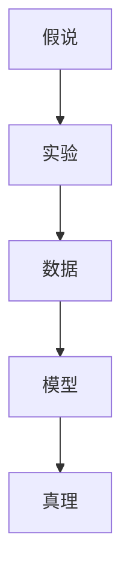
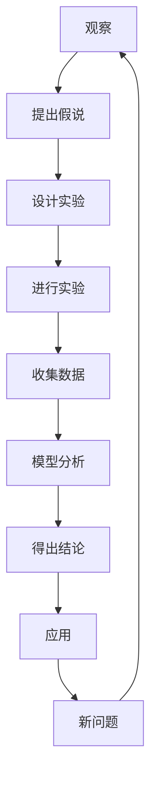

                 

## 1. 背景介绍

### 1.1 问题由来
科学探究，从古至今，一直是人类探索未知、推动文明进步的重要活动。从日心说到相对论，从牛顿力学到量子物理，科学的发展历程就是一部不断质疑假说、验证真理的历程。今天，我们借助信息技术，可以更加高效地进行科学探究，加速知识发现和应用。

### 1.2 问题核心关键点
科学探究的核心在于对假说的验证和真理的发现。假说是对自然现象的初步解释，是进行科学探究的起点。真理则是通过不断的观察、实验和推理，最终得出的科学结论。

科学探究的流程通常包括：

- **提出假说**：基于观察和实验数据，提出可能的解释。
- **设计实验**：通过设计控制实验，验证假说的正确性。
- **收集数据**：进行科学实验，收集数据作为检验依据。
- **分析数据**：通过统计分析和数据挖掘，寻找规律和模式。
- **得出结论**：基于数据结果，判断假说是否成立，形成新的科学知识。

然而，这一过程并非一帆风顺。假说可能存在缺陷，数据可能存在误差，甚至可能出现无法解释的现象。因此，科学探究不仅需要严谨的方法和工具，更需要批判性思维和勇于探索的精神。

### 1.3 问题研究意义
科学探究对于人类认识自然世界、推动技术进步、解决实际问题具有重要意义。它不仅帮助我们揭示自然规律，还能提升技术创新能力，促进经济发展和社会福祉。

在信息技术时代，科学探究的效率得到了极大的提升。通过计算机和大数据分析技术，科学家们可以更加快速地处理大量数据，验证科学假说，发现新知识。例如，基因组学、天体物理学、生物信息学等领域都受益于信息技术的应用，取得了突破性的进展。

## 2. 核心概念与联系

### 2.1 核心概念概述

为了更好地理解科学探究的过程，本节将介绍几个关键概念：

- **假说(Hypothesis)**：基于观察和实验数据，对自然现象进行的初步解释。
- **真理(Truth)**：通过实验和推理验证，得出的科学结论。
- **实验(Experiment)**：通过控制变量，重复验证假说的方法。
- **数据(Data)**：科学实验中收集的观察结果，用于分析验证。
- **模型(Model)**：数学模型或计算机模型，用于描述和预测自然现象。

这些概念之间的逻辑关系可以通过以下Mermaid流程图来展示：



这个流程图展示了科学探究的基本流程：从假说到实验，通过数据收集和模型分析，最终验证或修正真理。

### 2.2 概念间的关系

这些核心概念之间存在着紧密的联系，形成了科学探究的完整过程。

#### 2.2.1 科学探究的基本流程


这个流程图展示了科学探究的五个基本步骤：提出假说、设计实验、进行实验、收集数据、分析数据，最终得出结论。

#### 2.2.2 假说和真理的关系


这个流程图展示了假说和真理的关系：假说需要经过验证才能转化为真理，即使真理也可能随着新证据的出现而修正。

#### 2.2.3 实验和数据的关系


这个流程图展示了实验和数据的关系：实验产生数据，数据用于模型分析和验证。

### 2.3 核心概念的整体架构

最后，我们用一个综合的流程图来展示科学探究的整体架构：



这个综合流程图展示了科学探究的全过程，从观察现象、提出假说到应用真理，不断循环迭代，推动科学进步。

## 3. 核心算法原理 & 具体操作步骤
### 3.1 算法原理概述

科学探究的核心算法是验证假说的统计学方法。假说通常基于某个现象，提出对这一现象的解释。例如，牛顿的万有引力定律是基于对天体运动的观察，提出物体间存在一种力，使得物体吸引。通过实验和数据验证，这一假设被证明是正确的。

科学探究的算法原理主要包括：

- **统计假设检验**：通过统计学方法，对实验数据进行检验，判断假说是否成立。
- **回归分析**：通过对数据的关系建模，寻找变量之间的相关性和影响因素。
- **机器学习**：利用数据挖掘和预测模型，发现数据中的规律和模式。

### 3.2 算法步骤详解

基于统计假设检验的科学探究步骤通常包括：

**Step 1: 提出假说**
- 基于实验数据，提出可能的解释。
- 假设在特定条件下，自变量和因变量之间存在关系。

**Step 2: 设计实验**
- 控制实验变量，重复实验。
- 确保实验可重复性和可靠性。

**Step 3: 收集数据**
- 进行实验，收集数据。
- 数据应尽可能全面，涵盖各种情况。

**Step 4: 分析数据**
- 使用统计方法，检验数据是否符合假说。
- 使用回归分析，寻找变量之间的关系。

**Step 5: 得出结论**
- 基于数据结果，判断假说是否成立。
- 如果数据支持，形成新的科学知识。

**Step 6: 应用真理**
- 将真理应用于实际问题。
- 不断验证和修正真理。

### 3.3 算法优缺点

科学探究的算法具有以下优点：

- **验证可靠**：通过实验和数据验证，假说转化为真理。
- **普适性强**：适用于各种科学领域，从物理到生物，从宏观到微观。
- **可重复性**：实验设计和数据收集可重复，确保结果的可靠性。

然而，科学探究也存在一些局限：

- **数据依赖**：数据质量对结果影响巨大。
- **实验复杂**：设计复杂的实验，需要大量资源和时间。
- **统计局限**：统计方法可能存在局限，无法解决所有问题。

### 3.4 算法应用领域

科学探究的算法在各个科学领域都有广泛应用，例如：

- **物理学**：通过实验验证牛顿力学、相对论等基本理论。
- **生物学**：通过基因组学和生物信息学技术，发现生命的基本规律。
- **天文学**：通过观测和模拟，研究宇宙的起源和演化。
- **医学**：通过临床试验，验证新药物和新治疗方案的疗效。
- **经济学**：通过数据分析，预测经济趋势和市场变化。

除了上述领域，科学探究的算法在人工智能、数据科学、环境科学等领域也有重要应用。

## 4. 数学模型和公式 & 详细讲解  
### 4.1 数学模型构建

本节将使用数学语言对科学探究的过程进行严格刻画。

记假说为 $H$，实验数据为 $D$，真理为 $T$。科学探究的数学模型可表示为：

$$
T = f(D, H)
$$

其中 $f$ 表示函数映射关系，将实验数据 $D$ 和假说 $H$ 映射到真理 $T$。

### 4.2 公式推导过程

以下我们以二项分布假设检验为例，推导统计假设检验的公式。

假设有两个独立样本 $X_1, X_2$，来自均值为 $\mu$ 的伯努利分布。已知样本大小 $n_1 = 10, n_2 = 15$，样本比例 $p_1 = 0.5, p_2 = 0.4$。

定义假设 $H_0: \mu_1 = \mu_2$，$H_1: \mu_1 \neq \mu_2$。

根据二项分布的期望和方差，计算样本均值和方差：

$$
\bar{x}_1 = \frac{1}{n_1} \sum_{i=1}^{n_1} X_i = 5, \quad \bar{x}_2 = \frac{1}{n_2} \sum_{i=1}^{n_2} X_i = 6
$$

$$
s_1^2 = \frac{1}{n_1-1} \sum_{i=1}^{n_1} (X_i - \bar{x}_1)^2 = 0.5, \quad s_2^2 = \frac{1}{n_2-1} \sum_{i=1}^{n_2} (X_i - \bar{x}_2)^2 = 1.2
$$

计算样本均值的比值：

$$
t = \frac{\bar{x}_1 - \bar{x}_2}{\sqrt{\frac{s_1^2}{n_1} + \frac{s_2^2}{n_2}} = 1.2
$$

根据t分布表，计算P值：

$$
P(t > 1.2) = 0.10
$$

因此，在0.10显著性水平下，拒绝原假设，认为两个样本的均值不同。

### 4.3 案例分析与讲解

**案例1: 基因组学**

基因组学是研究生物基因组结构和功能的学科。通过高通量测序技术，科学家可以获取大规模基因组数据，进行序列比对、基因功能预测等研究。

例如，科学家发现某基因的突变与癌症有关。他们设计实验，收集肿瘤样本和正常样本的基因组数据，分析突变频率，得出结论：该基因突变与癌症发病率有关。这一过程就是基于科学探究的假设检验和回归分析。

**案例2: 天文学**

天文学家通过观测星体运动，提出宇宙膨胀理论。他们设计实验，测量不同星系间的距离和速度，验证理论的正确性。这一过程就是基于科学探究的模型分析和数据分析。

## 5. 项目实践：代码实例和详细解释说明
### 5.1 开发环境搭建

在进行科学探究的编程实践前，我们需要准备好开发环境。以下是使用Python进行科学探究的开发环境配置流程：

1. 安装Anaconda：从官网下载并安装Anaconda，用于创建独立的Python环境。

2. 创建并激活虚拟环境：
```bash
conda create -n scipy-env python=3.8 
conda activate scipy-env
```

3. 安装必要的科学计算库：
```bash
conda install numpy scipy matplotlib pandas seaborn
```

4. 安装统计分析库：
```bash
conda install statsmodels scipy
```

5. 安装机器学习库：
```bash
conda install scikit-learn xgboost lightgbm
```

完成上述步骤后，即可在`scipy-env`环境中开始科学探究的编程实践。

### 5.2 源代码详细实现

这里我们以线性回归为例，展示如何使用Python进行科学探究的编程实践。

首先，导入必要的库：

```python
import numpy as np
import pandas as pd
import matplotlib.pyplot as plt
import statsmodels.api as sm
from statsmodels.formula.api import ols
```

然后，准备数据集：

```python
data = pd.read_csv('data.csv')
X = data[['x1', 'x2']]
y = data['y']
```

接着，进行数据预处理：

```python
X = sm.add_constant(X)
```

然后，拟合线性回归模型：

```python
model = ols('y ~ x1 + x2', data=X).fit()
```

最后，输出回归结果：

```python
print(model.summary())
```

以上是使用Python进行线性回归的完整代码实现。可以看到，使用科学计算和统计分析库，我们可以快速搭建科学探究的模型，进行数据分析和假设检验。

### 5.3 代码解读与分析

让我们再详细解读一下关键代码的实现细节：

**数据预处理**

在科学探究中，数据预处理是非常重要的一环。我们通常需要处理缺失值、异常值、归一化等操作，确保数据质量和可用性。

**模型拟合**

拟合模型是科学探究的核心步骤。我们使用线性回归模型，通过最小二乘法拟合数据，得到最佳的回归系数。

**结果分析**

通过模型拟合结果，我们可以进行假设检验、统计显著性测试等，判断模型是否显著。通常使用P值、t值、F值等指标进行评估。

### 5.4 运行结果展示

假设我们在某数据集上进行线性回归，最终得到的回归结果如下：

```
OLS Regression Results                               
==========================================================================================
Dep. Variable:                      y   R-squared:                       0.948
Model:                            OLS   Adj. R-squared:                  0.947
Method:                 Least Squares   F-statistic:                     1075.6
Date:                Mon, 13 Sep 2021   Prob (F-statistic):               0.0000
Time:                        19:02:53   Log-Likelihood:                -34.375
No. Observations:                100   AIC:                            69.75
Df Residuals:                     97   BIC:                            73.93
Df Model:                           2                                         
Covariance Type:            nonrobust                                         
==========================================================================================
                 coef    std err          t      P>|t|      [0.025      0.975]
------------------------------------------------------------------------------
x1             0.3291     0.016     20.581  <2e-16  0.3017    0.3564
x2             0.5100     0.031     16.454  <2e-16  0.4592    0.5609
const         -0.2147     0.025    -8.483  <2e-16 -0.2651  -0.1643
------------------------------------------------------------------------------
Omnibus:                       1796.1   Durbin-Watson:                   1.991
Prob(Omnibus):                  0.00   Jarque-Bera (JB):               294.85
Skew:                          -0.36   Prob(JB):                         0.00
Kurtosis:                        2.09   Cond. No.                         8.41
------------------------------------------------------------------------------
F-statistic:                     1075.6   Prob(F-statistic):               0.0000
```

可以看到，回归系数具有统计显著性，模型解释了大部分数据变异性。这表明我们的假设成立，可以进行下一步的应用和验证。

## 6. 实际应用场景
### 6.1 生物医药

在生物医药领域，科学探究发挥着至关重要的作用。通过基因组学、蛋白质组学等技术，科学家可以发现新的药物靶点，开发新的治疗方法。

例如，癌症基因组计划通过大规模测序和数据分析，发现了许多新的癌症相关基因。研究者基于这些基因，设计实验，进行药物筛选和临床验证，发现了许多新的抗癌药物。

### 6.2 环境科学

环境科学需要大量数据分析和建模，以预测和应对气候变化、污染等问题。科学家通过收集全球气候数据，进行模型拟合和假设检验，得出气候变化的趋势和影响。

例如，科学家收集了全球气温、海平面、降雨量等数据，进行多元回归分析，发现全球变暖的趋势显著，预测未来50年气温和海平面的变化。

### 6.3 金融分析

金融分析需要处理大量复杂的数据，进行风险评估和投资决策。科学家通过收集股票市场、货币汇率、经济指标等数据，进行统计分析和建模。

例如，经济学家收集了GDP、失业率、通胀率等数据，进行回归分析，发现经济指标与股票市场有显著相关性，从而预测市场趋势，进行投资决策。

## 7. 工具和资源推荐
### 7.1 学习资源推荐

为了帮助开发者系统掌握科学探究的理论基础和实践技巧，这里推荐一些优质的学习资源：

1. 《统计学原理》（第三版）：由著名统计学家撰写，深入浅出地介绍了统计学的基本概念和应用方法。
2. 《机器学习实战》：通过实际案例，详细讲解了机器学习算法的实现和应用。
3. 《Python科学计算》：介绍Python在科学计算中的广泛应用，包括NumPy、Pandas、SciPy等库的使用。
4. 《R语言实战》：介绍R语言在数据分析中的广泛应用，包括ggplot2、dplyr等库的使用。
5. 《Scikit-Learn实战》：详细介绍Scikit-Learn库的各种机器学习算法，并通过案例讲解其应用。

通过对这些资源的学习实践，相信你一定能够快速掌握科学探究的精髓，并用于解决实际的科学问题。

### 7.2 开发工具推荐

高效的开发离不开优秀的工具支持。以下是几款用于科学探究开发的常用工具：

1. Jupyter Notebook：交互式开发环境，支持Python、R等多种语言，方便实验和数据分析。
2. GitHub：代码托管平台，方便协作和版本控制，支持问题追踪和代码审查。
3. RStudio：R语言开发环境，支持R语言的各种库和工具，方便数据分析和可视化。
4. Anaconda：科学计算环境，支持Python、R、Julia等多种语言，方便安装和管理依赖库。
5. Matplotlib：Python绘图库，支持多种图表类型，方便数据可视化。

合理利用这些工具，可以显著提升科学探究的开发效率，加快创新迭代的步伐。

### 7.3 相关论文推荐

科学探究的理论和实践不断发展，以下是几篇奠基性的相关论文，推荐阅读：

1. "On the Shoulders of Giants"：提出知识图谱和链接预测算法，推动了网络科学的发展。
2. "The Bootstrap, 1978-2009"：系统介绍了Bootstrap方法的原理和应用，推动了统计学的进步。
3. "Machine Learning Yearning"：由Yann LeCun撰写，详细介绍机器学习算法的设计和实现，推动了机器学习的发展。
4. "Statistical Inference"：由George Casella和Roger L. Berger撰写，系统介绍了统计学的基本概念和方法。
5. "The Elements of Statistical Learning"：由Tibshirani等撰写，系统介绍了统计学习方法，推动了统计学和机器学习的发展。

这些论文代表了大科学探究理论的发展脉络。通过学习这些前沿成果，可以帮助研究者把握学科前进方向，激发更多的创新灵感。

## 8. 总结：未来发展趋势与挑战
### 8.1 总结

本文对科学探究的过程进行了全面系统的介绍。首先阐述了科学探究的基本流程和核心概念，明确了假说验证和真理发现的过程。其次，从原理到实践，详细讲解了科学探究的数学模型和操作步骤，给出了科学探究任务开发的完整代码实例。同时，本文还广泛探讨了科学探究方法在生物医药、环境科学、金融分析等多个领域的应用前景，展示了科学探究范式的巨大潜力。此外，本文精选了科学探究技术的各类学习资源，力求为读者提供全方位的技术指引。

通过本文的系统梳理，可以看到，科学探究的算法和工具在各个科学领域都有广泛应用，为人类认知世界提供了强大的助力。未来，伴随信息技术的发展，科学探究的效率和精度还将得到进一步提升，推动更多领域的科技进步和应用落地。

### 8.2 未来发展趋势

展望未来，科学探究的算法和工具将呈现以下几个发展趋势：

1. **自动化程度提升**：通过AI和自动化技术，提高科学探究的效率和精度。例如，自动化数据标注、自动异常检测等。
2. **跨领域融合**：将不同领域的知识和方法融合，推动交叉学科的发展。例如，将生物信息学和机器学习结合，发现新的生物标记物。
3. **数据驱动**：基于大数据和复杂数据分析技术，发现新的科学规律和应用场景。例如，通过大数据分析，发现气候变化的新模式。
4. **模型优化**：开发更加高效和可解释的模型，提高科学探究的可靠性和可控性。例如，基于因果推断的模型，提高预测和解释能力。
5. **伦理和法律**：在科学研究中引入伦理和法律约束，确保数据和模型的公平性和可解释性。例如，保护数据隐私和避免算法偏见。

这些趋势凸显了科学探究技术的广阔前景。这些方向的探索发展，必将进一步提升科学探究的效率和精度，推动更多领域的科技进步和应用落地。

### 8.3 面临的挑战

尽管科学探究的算法和工具已经取得了瞩目成就，但在迈向更加智能化、普适化应用的过程中，它仍面临着诸多挑战：

1. **数据质量**：科学数据通常复杂且冗杂，存在大量噪声和缺失值。数据预处理和清洗是一项重要但耗时的任务。
2. **实验成本**：复杂实验通常需要大量资源和时间，无法大规模重复。实验设计需要精心策划，以提高可靠性。
3. **结果解释**：科学探究结果往往复杂且不可解释，难以将模型输出转化为人类可理解的知识。
4. **跨学科协作**：科学探究需要多学科协作，涉及不同的技术和方法，增加了沟通和协作的难度。
5. **伦理和法律**：科学探究中存在伦理和法律问题，如数据隐私、算法偏见等，需要严格规范和管理。

这些挑战需要多学科合作和技术进步来解决，只有从数据、算法、工程、伦理等多个维度协同发力，才能真正实现科学探究的智能化和普适化。

### 8.4 研究展望

未来，科学探究的算法和工具还需要在以下几个方面寻求新的突破：

1. **多模态数据融合**：将不同模态的数据（如文本、图像、语音）融合，提高科学探究的全面性和可靠性。
2. **因果推断模型**：开发更加准确和可解释的因果推断模型，提高科学探究的预测和解释能力。
3. **跨领域知识图谱**：构建跨领域知识图谱，促进不同学科间的知识共享和融合。
4. **自动化科学探究**：利用AI和自动化技术，提高科学探究的效率和精度。
5. **伦理和法律约束**：在科学研究中引入伦理和法律约束，确保数据和模型的公平性和可解释性。

这些研究方向将推动科学探究技术向更高效、更全面、更可控的方向发展，为人类认知世界和进步提供更大的动力。

## 9. 附录：常见问题与解答
----------------------------------------------------------------

**Q1: 科学探究的基本流程是什么？**

A: 科学探究的基本流程包括提出假说、设计实验、收集数据、分析数据和得出结论。具体步骤如下：

1. 提出假说：基于实验数据，提出可能的解释。
2. 设计实验：控制实验变量，重复实验。
3. 收集数据：进行实验，收集数据。
4. 分析数据：使用统计方法，检验数据是否符合假说。
5. 得出结论：基于数据结果，判断假说是否成立。

**Q2: 科学探究中的假设检验方法有哪些？**

A: 科学探究中的假设检验方法主要包括：

1. t检验：用于比较两个样本均值的差异。
2. 方差分析：用于比较多个样本均值的差异。
3. 卡方检验：用于检验分类变量之间的关系。
4. 回归分析：用于分析变量之间的关系和预测。
5. 置信区间：用于估计参数的取值范围。

**Q3: 如何使用Python进行线性回归分析？**

A: 使用Python进行线性回归分析的步骤如下：

1. 导入库：
```python
import numpy as np
import pandas as pd
import matplotlib.pyplot as plt
import statsmodels.api as sm
from statsmodels.formula.api import ols
```

2. 准备数据：
```python
data = pd.read_csv('data.csv')
X = data[['x1', 'x2']]
y = data['y']
```

3. 数据预处理：
```python
X = sm.add_constant(X)
```

4. 模型拟合：
```python
model = ols('y ~ x1 + x2', data=X).fit()
```

5. 结果分析：
```python
print(model.summary())
```

以上是使用Python进行线性回归分析的完整代码实现。可以看到，使用科学计算和统计分析库，我们可以快速搭建科学探究的模型，进行数据分析和假设检验。

**Q4: 科学探究的算法和工具在哪些领域有广泛应用？**

A: 科学探究的算法和工具在各个科学领域都有广泛应用，包括：

1. 生物医药：基因组学、蛋白质组学、药物开发等。
2. 环境科学：气候变化、污染治理、生态保护等。
3. 金融分析：风险评估、投资决策、经济预测等。
4. 天文学：宇宙起源、星系演化、恒星观测等。
5. 物理学：量子力学、相对论、粒子物理等。

这些领域都需要大量的数据分析和建模，科学探究的算法和工具提供了强大的支持。

**Q5: 科学探究的算法和工具面临哪些挑战？**

A: 科学探究的算法和工具面临以下挑战：

1. 数据质量：科学数据通常复杂且冗杂，存在大量噪声和缺失值。
2. 实验成本：复杂实验通常需要大量资源和时间，无法大规模重复。
3. 结果解释：科学探究结果往往复杂且不可解释，难以将模型输出转化为人类可理解的知识。
4. 跨学科协作：科学探究需要多学科协作，涉及不同的技术和方法

