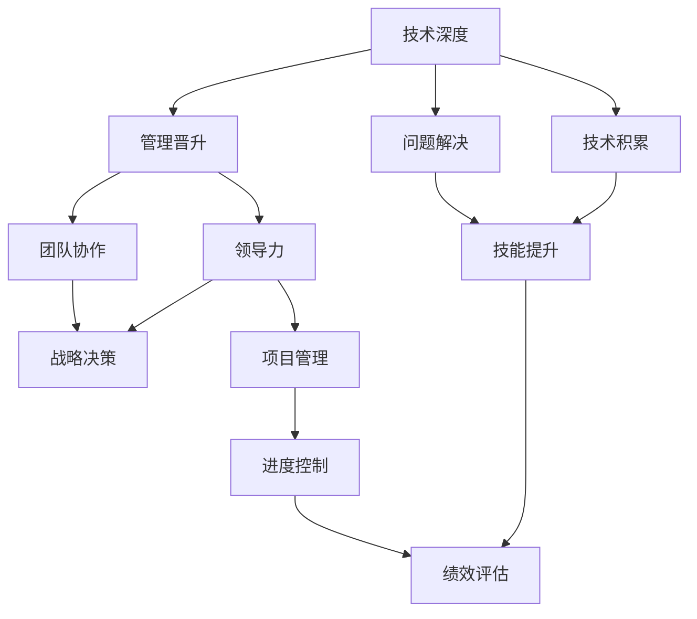

                 

# 程序员的职业规划：技术深耕vs管理晋升

## 1. 背景介绍

### 1.1 问题由来
在信息科技迅猛发展的时代，编程技能作为获取知识的重要工具，对于程序员的职业发展具有关键意义。程序员不仅要掌握编程语言和算法数据结构，还要不断学习新的技术框架和工具。随着技术的不断进步，程序员的职业路径也呈现出多样性，既有向技术深度的专业化发展，也有向管理晋升的跨职能发展。那么，是选择深耕技术，还是追求管理晋升，成为了程序员职业生涯中的重要抉择。本文将从多个维度探讨这一问题，并给出相应的建议。

### 1.2 问题核心关键点
在职业规划中，程序员面临的主要问题包括：
- **技术深度**：不断学习新技术，提升专业技能，但时间与精力有限。
- **管理晋升**：从技术岗位向管理岗位的转变，涉及领导力、沟通能力和团队协作能力等多方面。
- **职业发展**：技术人才与管理人才的职业路径选择，影响未来的职业成就与收入水平。

## 2. 核心概念与联系

### 2.1 核心概念概述
- **技术深度**：指专注于技术领域的深入研究与实践，掌握复杂技术，解决高难度问题。
- **管理晋升**：指从技术岗位向管理岗位的转变，包括团队管理、项目管理和高层管理等。

### 2.2 核心概念之间的关系



该图展示了技术深度与管理晋升的关系。技术深度通过不断积累和提升技能，能够更好地解决问题；同时，提升技术水平也能为管理晋升提供坚实的基础。而管理晋升不仅需要领导力和团队协作能力，还需要战略决策和项目管理等综合能力。技术深度与管理晋升相互促进，共同推动职业发展。

## 3. 核心算法原理 & 具体操作步骤
### 3.1 算法原理概述

在程序员的职业规划中，我们主要涉及两种核心算法：技术深度提升算法和管理晋升提升算法。

### 3.2 算法步骤详解

#### 3.2.1 技术深度提升算法

**算法步骤**：
1. **目标设定**：明确技术学习的目标，例如掌握新编程语言、深入理解复杂算法或实现特定技术项目。
2. **资源获取**：通过书籍、在线课程、技术论坛等多种渠道获取学习资源。
3. **实践实践**：通过实际项目或编程练习，应用所学知识，解决实际问题。
4. **评估反馈**：定期评估学习成果，获取反馈，调整学习策略。

**算法示例**：

- **目标**：掌握Python中的Django框架。
- **资源**：阅读Django官方文档，观看在线教程。
- **实践**：参与实际项目，构建一个小型Web应用。
- **评估**：通过编写代码质量和应用效果评估学习成果。

#### 3.2.2 管理晋升提升算法

**算法步骤**：
1. **岗位轮换**：争取参与团队管理和项目管理工作，积累实际经验。
2. **领导力提升**：参加领导力培训，提升沟通、决策和团队管理能力。
3. **项目经验**：负责小规模项目，积累项目管理经验。
4. **评估反馈**：定期向领导和同事寻求反馈，改进管理技能。

**算法示例**：

- **目标**：成为项目经理。
- **岗位轮换**：承担项目协调和团队沟通的工作。
- **领导力提升**：参加公司内部的领导力培训课程。
- **项目经验**：负责一个小型项目，从需求分析到项目交付全过程参与。
- **评估反馈**：在项目结束后，从团队成员和上级领导那里获取反馈，总结经验。

### 3.3 算法优缺点

**技术深度提升算法**：
- **优点**：专注于技术，有助于提升专业技能，解决高难度问题。
- **缺点**：容易陷入技术细节，忽视项目管理和大局战略。

**管理晋升提升算法**：
- **优点**：快速提升领导力和团队协作能力，有助于职业发展。
- **缺点**：需要时间和精力，短期内可能技能提升不明显。

### 3.4 算法应用领域

技术深度提升算法主要适用于技术型职位，如软件开发工程师、系统架构师等。管理晋升提升算法主要适用于需要团队管理和项目管理的职位，如项目经理、产品经理、技术总监等。

## 4. 数学模型和公式 & 详细讲解 & 举例说明

### 4.1 数学模型构建

我们假设程序员每天花费固定时间t在学习和工作中，其中技术深度提升占t1，管理晋升提升占t2。

**模型构建**：
1. **技术提升模型**：
   $$
   f_{技术} = f_{提升}(t_1) = k_1 \times t_1 + c_1
   $$
2. **管理晋升模型**：
   $$
   f_{管理} = f_{晋升}(t_2) = k_2 \times t_2 + c_2
   $$

### 4.2 公式推导过程

以技术提升模型为例，考虑技术提升率和初始技能水平c1，每天提升k1，则
$$
f_{技术} = k_1 \times t_1 + c_1
$$

### 4.3 案例分析与讲解

假设k1 = 0.1，c1 = 50，t1 = 2小时/天，则
$$
f_{技术} = 0.1 \times 2 + 50 = 52
$$

表示每天技术提升52点。同理，管理晋升模型也可以得到类似的计算过程。

## 5. 项目实践：代码实例和详细解释说明
### 5.1 开发环境搭建

假设我们使用Python和Django框架进行技术深度提升实践。开发环境搭建步骤如下：

1. **安装Python和Django**：
   ```bash
   conda install python=3.8
   pip install django
   ```

2. **创建Django项目**：
   ```bash
   django-admin startproject myproject
   cd myproject
   ```

3. **编写应用**：
   ```bash
   python manage.py startapp myapp
   ```

4. **运行测试**：
   ```bash
   python manage.py runserver
   ```

### 5.2 源代码详细实现

**创建Django应用**：
```python
from django.contrib import admin
from django.urls import path, include

urlpatterns = [
    path('admin/', admin.site.urls),
    path('myapp/', include('myapp.urls')),
]
```

**编写应用代码**：
```python
# myapp/urls.py
from django.urls import path
from . import views

urlpatterns = [
    path('', views.index, name='index'),
]
```

**编写视图函数**：
```python
# myapp/views.py
from django.http import HttpResponse

def index(request):
    return HttpResponse("Hello, Django!")
```

### 5.3 代码解读与分析

以上代码展示了如何使用Django框架创建一个简单的Web应用。通过实际编写代码和运行测试，可以深入理解Django框架的核心概念和应用。

### 5.4 运行结果展示

运行以上代码，浏览器访问`http://localhost:8000`，应该能够看到"Hello, Django!"的响应。

## 6. 实际应用场景

### 6.1 技术深度实践应用

**场景一**：开发高性能后端服务

某公司需要开发一个高性能的后端服务，程序员可以通过学习新的编程语言和框架，提升代码效率和系统性能。例如，学习Go语言和WebAssembly框架，实现一个高并发的微服务系统。

**场景二**：解决复杂系统问题

某系统存在大量并发访问，导致性能瓶颈。程序员可以深入研究分布式架构和数据库优化技术，提出并实现解决方案，例如使用Redis缓存、Kubernetes容器等技术，提升系统稳定性。

### 6.2 管理晋升实践应用

**场景一**：项目管理实践

某项目团队需要协调多个部门合作，实现一个跨部门的产品功能。项目经理可以通过有效的项目管理，确保各个部门按时完成任务，并定期向高层汇报项目进展。

**场景二**：领导力培训

某公司新入职的程序员需要快速适应团队环境，领导可以通过组织领导力培训，帮助程序员提升沟通和团队协作能力，提高工作效率。

## 7. 工具和资源推荐
### 7.1 学习资源推荐

1. **LeetCode**：提供大量算法和数据结构题目，有助于提升技术深度。
2. **Kaggle**：提供数据科学竞赛，可以帮助程序员在实践中学习新技能。
3. **Coursera和Udacity**：提供各种在线课程，涵盖从入门到高级的技术课程。
4. **GitHub**：提供丰富的开源项目和代码库，可以学习前沿技术和最佳实践。
5. **TED Talks**：观看领导力培训视频，提升管理能力。

### 7.2 开发工具推荐

1. **Visual Studio Code**：轻量级、高效的代码编辑器，支持多种编程语言。
2. **Jenkins**：开源自动化服务器，支持持续集成和持续部署。
3. **Docker**：容器化解决方案，便于跨环境部署和调试。
4. **Git**：版本控制系统，支持多人协作开发。
5. **Slack**：团队沟通工具，方便团队协作和管理。

### 7.3 相关论文推荐

1. **《程序员的自我修养》**：深入探讨编程技能提升和职业发展。
2. **《软件开发的未来》**：分析软件开发趋势和技术方向。
3. **《软件管理的艺术》**：探讨软件项目管理的关键技术和最佳实践。

## 8. 总结：未来发展趋势与挑战
### 8.1 研究成果总结

本文从技术深度和管理晋升两个维度，探讨了程序员职业规划的核心问题。通过技术深度提升算法和管理晋升提升算法，帮助程序员找到适合自己的职业路径。

### 8.2 未来发展趋势

1. **技术深度**：未来技术将更加注重人工智能、大数据和区块链等前沿领域，程序员需要不断学习新技术，保持技术领先。
2. **管理晋升**：随着数字化转型加速，项目管理和团队协作将成为企业成功的关键，管理晋升将更加重要。
3. **跨职能发展**：未来的职业发展将更加注重跨职能能力，如数据科学、产品管理和人工智能等，程序员需要具备综合素质。

### 8.3 面临的挑战

1. **技术更新快速**：新技术层出不穷，程序员需要不断学习，保持技术竞争力。
2. **管理要求高**：项目管理和领导力要求高，需要具备跨职能技能和团队协作能力。
3. **职业规划困难**：不同职业路径的收益和职业成就不同，需要慎重选择。

### 8.4 研究展望

未来研究可以探索以下方向：
1. **跨职能职业路径**：研究跨职能能力的培养，探索不同职业路径的收益与风险。
2. **职业发展模型**：建立程序员职业发展的数学模型，提供科学的数据支持和决策依据。
3. **技能评估工具**：开发技能评估工具，帮助程序员了解自己的技术和管理水平，制定个性化职业规划。

## 9. 附录：常见问题与解答

**Q1：技术深度与管理晋升哪个更重要？**

A: 技术深度与管理晋升同等重要。技术深度提升专业技能，解决高难度问题；管理晋升提升领导力和团队协作能力，有助于职业发展。选择适合自己的职业路径，两方面都需要兼顾。

**Q2：如何平衡技术学习和管理工作？**

A: 制定详细的职业规划，合理分配时间。例如，每天固定时间学习技术，同时参与项目管理，积累实际经验。

**Q3：技术人才与管理人才的职业路径选择有哪些？**

A: 技术人才可以选择软件开发工程师、系统架构师等技术职位，持续深耕技术；管理人才可以选择项目经理、产品经理、技术总监等管理职位，提升领导力和团队协作能力。

---

作者：禅与计算机程序设计艺术 / Zen and the Art of Computer Programming

