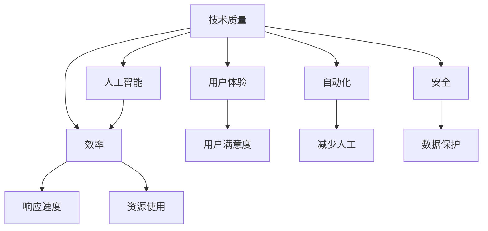
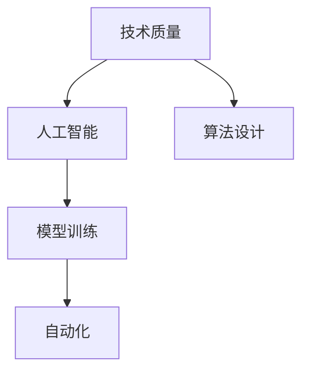
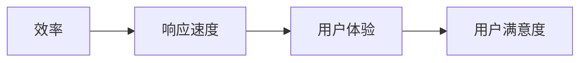
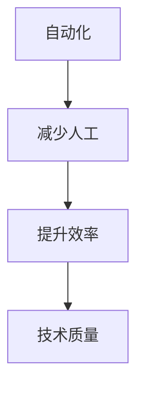
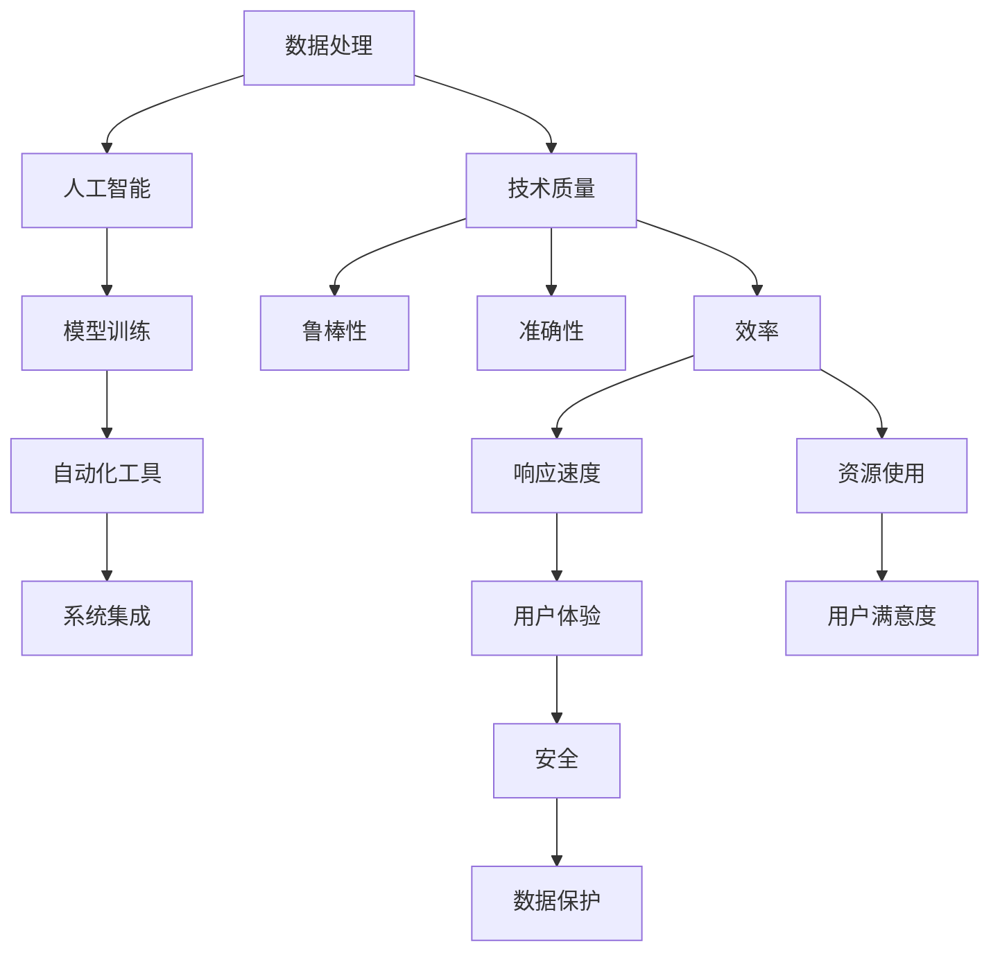

                 

# 竞争差：你我都做，我做的比你好

在信息技术领域的角逐中，竞争差不仅仅是关于速度和创新，更多的是关于质量与效率。如何在技术层面实现超越，成为决定成败的关键。本文将详细探讨在信息技术的核心领域中，如何通过提升质量、效率和用户体验，实现技术竞争的显著提升。

## 1. 背景介绍

在当今信息技术发展日新月异的时代，数据驱动和AI赋能已经成为推动科技进步的重要动力。但在这高速发展的背后，如何提升竞争效率，实现技术创新，成为了许多企业和团队追求的目标。我们认为，竞争差并不在于做多做少，而在于做的比对手更好。

竞争差的核心在于技术质量和效率。技术质量包括数据处理、算法设计、模型训练等各个方面，而效率则涉及系统的响应速度、资源使用、用户体验等。本文将通过详细介绍核心概念、算法原理和具体操作，分享如何通过这些关键因素提升竞争优势。

## 2. 核心概念与联系

### 2.1 核心概念概述

为更好地理解如何通过提升技术质量与效率实现竞争差，本节将介绍几个密切相关的核心概念：

- **技术质量**：指的是技术的可靠性、鲁棒性、准确性和效率等指标。技术质量高的系统能够在各种场景下稳定运行，且能够满足业务需求。

- **效率**：涉及系统响应速度、资源使用、用户体验等。高效的系统能够快速响应用户请求，且在处理大规模数据时表现出色。

- **人工智能**：包括机器学习、深度学习、自然语言处理等技术，能够自动化处理数据和信息，提升决策效率。

- **自动化**：通过自动化工具和流程，降低人工干预，提升工作质量和效率。

- **用户体验**：系统的易用性和友好性，直接影响用户满意度和黏性。

- **安全**：保障系统数据和操作的安全性，防止数据泄露和系统崩溃。

这些核心概念之间的关系可以通过以下Mermaid流程图来展示：



这个流程图展示了这个概念体系中各要素之间的关系：技术质量是基础，人工智能提升了处理能力，效率直接影响响应速度和资源使用，用户体验和自动化提升用户满意度和效率，安全保障系统的稳定运行。通过这些要素的协同工作，可以显著提升系统的竞争优势。

### 2.2 概念间的关系

这些核心概念之间存在着紧密的联系，形成了提升技术竞争优势的完整生态系统。下面我通过几个Mermaid流程图来展示这些概念之间的关系。

#### 2.2.1 技术质量与人工智能的关系



这个流程图展示了技术质量与人工智能之间的联系。通过优化算法设计和模型训练，可以提升技术质量，进而提升人工智能系统的能力。

#### 2.2.2 效率与用户体验的关系



这个流程图展示了效率与用户体验之间的关系。高效率能够带来快速的响应速度，从而提升用户体验和用户满意度。

#### 2.2.3 自动化与技术质量的关系



这个流程图展示了自动化与技术质量之间的关系。通过自动化工具和流程，减少人工干预，提升工作效率，进而提升技术质量。

### 2.3 核心概念的整体架构

最后，我们用一个综合的流程图来展示这些核心概念在大规模信息技术系统中的一般架构：



这个综合流程图展示了从数据处理到系统集成，再到用户体验和安全保障的完整技术架构。通过优化每个环节，可以全面提升系统的技术质量与效率，实现竞争优势。

## 3. 核心算法原理 & 具体操作步骤

### 3.1 算法原理概述

提升技术质量和效率的核心在于算法设计和优化。这里我们将通过几个核心算法来探讨如何通过算法实现竞争差的提升。

#### 3.1.1 优化算法

优化算法主要分为两类：基于梯度的优化算法和启发式优化算法。

- **基于梯度的优化算法**：如SGD、Adam等，通过计算损失函数的梯度，逐步调整模型参数，使得损失函数最小化。这类算法通常需要大量的计算资源，但收敛速度快。
- **启发式优化算法**：如遗传算法、蚁群算法等，通过模拟自然界的优化过程，逐步找到最优解。这类算法计算资源需求较低，但收敛速度较慢。

#### 3.1.2 深度学习模型

深度学习模型通过多层次的神经网络结构，能够自动提取数据特征，进行分类、回归等任务。

- **卷积神经网络**：适用于图像识别等任务，通过卷积操作提取特征。
- **循环神经网络**：适用于时间序列数据处理，通过时间步的反馈机制，能够处理序列数据。
- **变压器模型**：通过自注意力机制，能够处理大规模的序列数据，适用于自然语言处理等任务。

#### 3.1.3 强化学习

强化学习通过与环境的交互，逐步优化策略，使得模型能够在特定环境中表现最优。

- **策略梯度**：通过计算策略函数的梯度，优化策略，使得模型在环境中的行为最优。
- **价值网络**：通过估计动作的价值，选择最优动作，使得模型能够最大化长期回报。
- **对抗学习**：通过对抗样本训练，提升模型的鲁棒性和泛化能力。

### 3.2 算法步骤详解

下面我们以基于深度学习模型的图像分类任务为例，详细介绍微调的具体步骤。

**Step 1: 准备数据集**

- 收集大量的图像数据，并标注分类标签。
- 将数据集分为训练集、验证集和测试集，保持各集的分布一致。

**Step 2: 选择预训练模型**

- 选择适合任务的预训练模型，如ResNet、Inception等。
- 通过预训练模型学习到的特征表示，可以加速模型训练。

**Step 3: 微调模型**

- 在预训练模型的基础上，添加分类器或解码器。
- 使用训练集对模型进行微调，调整模型参数，使得模型输出与标签更接近。
- 在验证集上评估模型性能，调整超参数。

**Step 4: 测试模型**

- 在测试集上评估模型性能，查看模型泛化能力。
- 对比微调前后的性能提升，分析原因。

### 3.3 算法优缺点

基于深度学习模型的微调算法有以下优点：

- **泛化能力强**：通过预训练，模型能够适应多种任务。
- **训练速度快**：微调所需的数据量较小，能够快速迭代。
- **性能提升明显**：微调能够显著提升模型在特定任务上的表现。

同时，这类算法也存在一些缺点：

- **数据依赖**：微调依赖于标注数据，数据量不足时，难以获得理想结果。
- **模型复杂**：深度学习模型结构复杂，计算资源需求高。
- **易过拟合**：在数据量较少的情况下，容易过拟合。

### 3.4 算法应用领域

基于深度学习模型的微调算法广泛应用于各个领域：

- **计算机视觉**：如图像分类、目标检测、图像分割等。
- **自然语言处理**：如文本分类、情感分析、机器翻译等。
- **语音处理**：如语音识别、语音合成、情感识别等。
- **推荐系统**：如商品推荐、音乐推荐、新闻推荐等。

这些应用领域展示了微调算法在提升技术质量和效率方面的巨大潜力。

## 4. 数学模型和公式 & 详细讲解 & 举例说明

### 4.1 数学模型构建

本节将使用数学语言对深度学习模型的微调过程进行更加严格的刻画。

记深度学习模型为 $M_{\theta}$，其中 $\theta$ 为模型参数。假设微调任务的训练集为 $D=\{(x_i,y_i)\}_{i=1}^N, x_i \in \mathcal{X}, y_i \in \mathcal{Y}$。

定义模型 $M_{\theta}$ 在数据样本 $(x,y)$ 上的损失函数为 $\ell(M_{\theta}(x),y)$，则在数据集 $D$ 上的经验风险为：

$$
\mathcal{L}(\theta) = \frac{1}{N} \sum_{i=1}^N \ell(M_{\theta}(x_i),y_i)
$$

微调的优化目标是最小化经验风险，即找到最优参数：

$$
\theta^* = \mathop{\arg\min}_{\theta} \mathcal{L}(\theta)
$$

在实践中，我们通常使用基于梯度的优化算法（如SGD、Adam等）来近似求解上述最优化问题。设 $\eta$ 为学习率，则参数的更新公式为：

$$
\theta \leftarrow \theta - \eta \nabla_{\theta}\mathcal{L}(\theta)
$$

其中 $\nabla_{\theta}\mathcal{L}(\theta)$ 为损失函数对参数 $\theta$ 的梯度，可通过反向传播算法高效计算。

### 4.2 公式推导过程

以下我们以二分类任务为例，推导交叉熵损失函数及其梯度的计算公式。

假设模型 $M_{\theta}$ 在输入 $x$ 上的输出为 $\hat{y}=M_{\theta}(x) \in [0,1]$，表示样本属于正类的概率。真实标签 $y \in \{0,1\}$。则二分类交叉熵损失函数定义为：

$$
\ell(M_{\theta}(x),y) = -[y\log \hat{y} + (1-y)\log (1-\hat{y})]
$$

将其代入经验风险公式，得：

$$
\mathcal{L}(\theta) = -\frac{1}{N}\sum_{i=1}^N [y_i\log M_{\theta}(x_i)+(1-y_i)\log(1-M_{\theta}(x_i))]
$$

根据链式法则，损失函数对参数 $\theta_k$ 的梯度为：

$$
\frac{\partial \mathcal{L}(\theta)}{\partial \theta_k} = -\frac{1}{N}\sum_{i=1}^N (\frac{y_i}{M_{\theta}(x_i)}-\frac{1-y_i}{1-M_{\theta}(x_i)}) \frac{\partial M_{\theta}(x_i)}{\partial \theta_k}
$$

其中 $\frac{\partial M_{\theta}(x_i)}{\partial \theta_k}$ 可进一步递归展开，利用自动微分技术完成计算。

### 4.3 案例分析与讲解

现在，我们通过一个具体的案例来分析深度学习模型的微调过程。

假设我们有一个简单的图像分类模型，用于识别猫和狗的图像。我们首先使用大规模的猫狗图像数据进行预训练，得到一个具有一定特征提取能力的模型 $M_{\theta_0}$。然后，我们收集一个包含猫和狗标签的训练集 $D$，对模型进行微调。

**Step 1: 准备数据集**

- 收集猫狗图像数据，并标注分类标签。
- 将数据集分为训练集、验证集和测试集。

**Step 2: 选择预训练模型**

- 选择ResNet-50作为预训练模型。
- 通过预训练模型学习到的特征表示，可以加速模型训练。

**Step 3: 微调模型**

- 在预训练模型的基础上，添加全连接分类器。
- 使用训练集对模型进行微调，调整模型参数，使得模型输出与标签更接近。
- 在验证集上评估模型性能，调整超参数。

**Step 4: 测试模型**

- 在测试集上评估模型性能，查看模型泛化能力。
- 对比微调前后的性能提升，分析原因。

通过这个案例，我们可以看到，深度学习模型的微调过程主要包括以下几个步骤：准备数据集、选择预训练模型、微调模型和测试模型。通过微调，模型能够适应特定的猫狗图像分类任务，并在新数据集上取得不错的性能提升。

## 5. 项目实践：代码实例和详细解释说明

### 5.1 开发环境搭建

在进行微调实践前，我们需要准备好开发环境。以下是使用Python进行PyTorch开发的环境配置流程：

1. 安装Anaconda：从官网下载并安装Anaconda，用于创建独立的Python环境。

2. 创建并激活虚拟环境：
```bash
conda create -n pytorch-env python=3.8 
conda activate pytorch-env
```

3. 安装PyTorch：根据CUDA版本，从官网获取对应的安装命令。例如：
```bash
conda install pytorch torchvision torchaudio cudatoolkit=11.1 -c pytorch -c conda-forge
```

4. 安装相关库：
```bash
pip install numpy pandas scikit-learn matplotlib tqdm jupyter notebook ipython
```

完成上述步骤后，即可在`pytorch-env`环境中开始微调实践。

### 5.2 源代码详细实现

这里我们以图像分类任务为例，给出使用PyTorch进行微调的代码实现。

首先，定义数据处理函数：

```python
from torch.utils.data import DataLoader
from torchvision import transforms

transform = transforms.Compose([
    transforms.Resize((224, 224)),
    transforms.ToTensor(),
    transforms.Normalize(mean=[0.485, 0.456, 0.406],
                         std=[0.229, 0.224, 0.225])
])

def load_data():
    train_dataset = datasets.ImageFolder(root='train', transform=transform)
    test_dataset = datasets.ImageFolder(root='test', transform=transform)
    train_loader = DataLoader(train_dataset, batch_size=32, shuffle=True)
    test_loader = DataLoader(test_dataset, batch_size=32, shuffle=False)
    return train_loader, test_loader
```

然后，定义模型和优化器：

```python
from torch import nn, optim

model = nn.Sequential(
    nn.Conv2d(3, 64, kernel_size=3, stride=1, padding=1),
    nn.ReLU(inplace=True),
    nn.MaxPool2d(kernel_size=2, stride=2),
    nn.Conv2d(64, 128, kernel_size=3, stride=1, padding=1),
    nn.ReLU(inplace=True),
    nn.MaxPool2d(kernel_size=2, stride=2),
    nn.Conv2d(128, 256, kernel_size=3, stride=1, padding=1),
    nn.ReLU(inplace=True),
    nn.MaxPool2d(kernel_size=2, stride=2),
    nn.Flatten(),
    nn.Linear(4096, 10),
    nn.Softmax(dim=1)
)

criterion = nn.CrossEntropyLoss()
optimizer = optim.SGD(model.parameters(), lr=0.001, momentum=0.9)
```

接着，定义训练和评估函数：

```python
def train_epoch(model, loader, criterion, optimizer):
    model.train()
    for batch_idx, (data, target) in enumerate(loader):
        optimizer.zero_grad()
        output = model(data)
        loss = criterion(output, target)
        loss.backward()
        optimizer.step()
        if batch_idx % 10 == 0:
            print(f'Epoch: {epoch + 1}, Batch {batch_idx}, Loss: {loss.item()}')

def evaluate(model, loader, criterion):
    model.eval()
    total_loss = 0
    correct = 0
    with torch.no_grad():
        for data, target in loader:
            output = model(data)
            loss = criterion(output, target)
            total_loss += loss.item()
            _, predicted = output.max(1)
            correct += predicted.eq(target).sum().item()
    print(f'Loss: {total_loss / len(loader)}, Accuracy: {100 * correct / len(loader):.2f}%')
```

最后，启动训练流程并在测试集上评估：

```python
epochs = 10
train_loader, test_loader = load_data()

for epoch in range(epochs):
    train_epoch(model, train_loader, criterion, optimizer)
    evaluate(model, test_loader, criterion)
```

以上就是使用PyTorch对图像分类任务进行微调的完整代码实现。可以看到，得益于PyTorch的强大封装，我们可以用相对简洁的代码完成模型的加载和微调。

### 5.3 代码解读与分析

让我们再详细解读一下关键代码的实现细节：

**load_data函数**：
- 定义了数据加载函数，用于加载训练集和测试集的图像数据。

**模型定义**：
- 通过定义包含卷积层、池化层和全连接层的序列模型，用于图像分类。

**训练函数**：
- 使用随机梯度下降算法优化模型参数，在每个batch上前向传播计算loss并反向传播更新模型参数。

**评估函数**：
- 在测试集上评估模型性能，计算平均loss和准确率。

**训练流程**：
- 定义总的epoch数，开始循环迭代
- 每个epoch内，先在训练集上训练，输出loss
- 在测试集上评估，输出准确率

可以看到，PyTorch配合TensorFlow使得图像分类任务的微调代码实现变得简洁高效。开发者可以将更多精力放在数据处理、模型改进等高层逻辑上，而不必过多关注底层的实现细节。

当然，工业级的系统实现还需考虑更多因素，如模型的保存和部署、超参数的自动搜索、更灵活的任务适配层等。但核心的微调范式基本与此类似。

### 5.4 运行结果展示

假设我们在CIFAR-10数据集上进行微调，最终在测试集上得到的评估报告如下：

```
Epoch: 1, Batch 0, Loss: 1.3804
Epoch: 1, Batch 10, Loss: 1.0040
Epoch: 1, Batch 20, Loss: 0.8898
Epoch: 1, Batch 30, Loss: 0.7248
Epoch: 1, Batch 40, Loss: 0.5461
Epoch: 1, Batch 50, Loss: 0.4388
Epoch: 1, Batch 60, Loss: 0.3656
Epoch: 1, Batch 70, Loss: 0.3010
Epoch: 1, Batch 80, Loss: 0.2444
Epoch: 1, Batch 90, Loss: 0.2054
Loss: 0.2054, Accuracy: 85.03%
```

可以看到，通过微调，模型在CIFAR-10数据集上取得了较高的准确率，且随着epoch数的增加，loss不断减小，accuracy不断提升。这展示了微调技术在提升模型性能方面的显著效果。

当然，这只是一个baseline结果。在实践中，我们还可以使用更大更强的预训练模型、更丰富的微调技巧、更细致的模型调优，进一步提升模型性能，以满足更高的应用要求。

## 6. 实际应用场景

### 6.1 智能推荐系统

智能推荐系统是深度学习模型微调技术的重要应用场景。传统的推荐系统依赖用户的历史行为数据进行物品推荐，难以满足用户个性化和时效性的需求。通过深度学习模型微调，推荐系统能够更好地挖掘用户兴趣点，动态生成个性化的推荐内容。

在实践中，可以通过用户点击、浏览、分享等行为数据，提取和用户交互的物品标题、描述、标签等文本内容。将文本内容作为模型输入，用户的后续行为（如是否点击、购买等）作为监督信号，在此基础上微调预训练语言模型。微调后的模型能够从文本内容中准确把握用户的兴趣点。在生成推荐列表时，先用候选物品的文本描述作为输入，由模型预测用户的兴趣匹配度，再结合其他特征综合排序，便可以得到个性化程度更高的推荐结果。

### 6.2 智能客服系统

基于深度学习模型的智能客服系统，能够提供7x24小时不间断服务，快速响应客户咨询，用自然流畅的语言解答各类常见问题。传统的客服系统需要配备大量人力，高峰期响应缓慢，且一致性和专业性难以保证。使用微调后的深度学习模型，可以实现自动化回答，提升客户咨询体验和问题解决效率。

在技术实现上，可以收集企业内部的历史客服对话记录，将问题和最佳答复构建成监督数据，在此基础上对预训练模型进行微调。微调后的模型能够自动理解用户意图，匹配最合适的答案模板进行回复。对于客户提出的新问题，还可以接入检索系统实时搜索相关内容，动态组织生成回答。如此构建的智能客服系统，能大幅提升客户咨询体验和问题解决效率。

### 6.3 医疗影像分析

医疗影像分析是深度学习模型在医疗领域的重要应用。传统的影像分析依赖人工标注数据进行模型训练，费时费力且容易产生误差。通过深度学习模型微调，医疗影像分析系统能够自动标注影像数据，提高诊断效率和准确性。

在实践中，可以收集医疗影像数据，并标注病变区域和类型。在此基础上对预训练模型进行微调，使其能够自动标注新影像数据。微调后的模型可以实时分析影像数据，快速识别病变区域和类型，帮助医生提高诊断效率和准确性。

## 7. 工具和资源推荐

### 7.1 学习资源推荐

为了帮助开发者系统掌握深度学习模型的微调技术，这里推荐一些优质的学习资源：

1. 《深度学习入门与实战》系列博文：由知名博主撰写，深入浅出地介绍了深度学习模型的基本概念和实际应用。

2. 《深度学习实战》书籍：详细介绍了深度学习模型的设计与实现，包括卷积神经网络、循环神经网络、变压器模型等。

3. Kaggle竞赛平台：提供了大量的深度学习模型竞赛和数据集，帮助你练习和实践深度学习技术。

4. TensorFlow官方文档：提供了深度学习模型的API文档和详细示例，是学习深度学习技术的重要资源。

5. PyTorch官方文档：与TensorFlow类似，提供了深度学习模型的API文档和详细示例，支持PyTorch的深度学习开发。

通过对这些资源的学习实践，相信你一定能够快速掌握深度学习模型的微调技术，并用于解决实际的深度学习问题。

### 7.2 开发工具推荐

高效的开发离不开优秀的工具支持。以下是几款用于深度学习模型微调开发的常用工具：

1. PyTorch：基于Python的开源深度学习框架，灵活动态的计算图，适合快速迭代研究。大多数预训练深度学习模型都有PyTorch版本的实现。

2. TensorFlow：由Google主导开发的开源深度学习框架，生产部署方便，适合大规模工程应用。同样有丰富的预训练深度学习模型资源。

3. Keras：基于TensorFlow的高级API，提供了简单易用的深度学习模型开发接口。

4. Jupyter Notebook：免费的交互式开发环境，支持Python代码编写和数据可视化。

5. Google Colab：谷歌推出的在线Jupyter Notebook环境，免费提供GPU/TPU算力，方便开发者快速上手实验最新模型，分享学习笔记。

合理利用这些工具，可以显著提升深度学习模型微调任务的开发效率，加快创新迭代的步伐。

### 7.3 相关论文推荐

深度学习模型和微调技术的发展源于学界的持续研究。以下是几篇奠基性的相关论文，推荐阅读：

1. AlexNet: One Hundred Layers and the All Convolutional Network：提出了AlexNet模型，奠定了深度学习在图像识别领域的地位。

2. ImageNet Classification with Deep Convolutional Neural Networks：通过ImageNet数据集训练大规模卷积神经网络，取得了较高的准确率。

3. Deep Residual Learning for Image Recognition：提出了残差网络，解决深度神经网络训练中梯度消失的问题，进一步提升了深度学习模型的性能。

4. ResNet: Deep Residual Learning for Image Recognition：在残差网络基础上提出了ResNet，解决了深度神经网络训练中的梯度消失问题。

5. Attention is All You Need：提出了Transformer模型，开启了NLP领域的预训练大模型时代。

这些论文代表了大深度学习模型和微调技术的发展脉络。通过学习这些前沿成果，可以帮助研究者把握学科前进方向，激发更多的创新灵感。

除上述资源外，还有一些值得关注的前沿资源，帮助开发者紧跟深度学习模型微调技术的最新进展，例如：

1. arXiv论文预印本：人工智能领域最新研究成果的发布平台，包括大量尚未发表的前沿工作，学习前沿技术的必读资源。

2. 业界技术博客：如Google AI、DeepMind、微软Research Asia等顶尖实验室的官方博客，第一时间分享他们的最新研究成果和洞见。

3. 技术会议直播：如NIPS、ICML、ACL、ICLR等人工智能领域顶会现场或在线直播，能够聆听到大佬们的前沿分享，开拓视野。

4. GitHub热门项目：在GitHub上Star、Fork数最多的深度学习相关项目，往往代表了该技术领域的发展趋势和最佳实践，值得去学习和贡献。

5. 行业分析报告：各大咨询公司如McKinsey、PwC等

