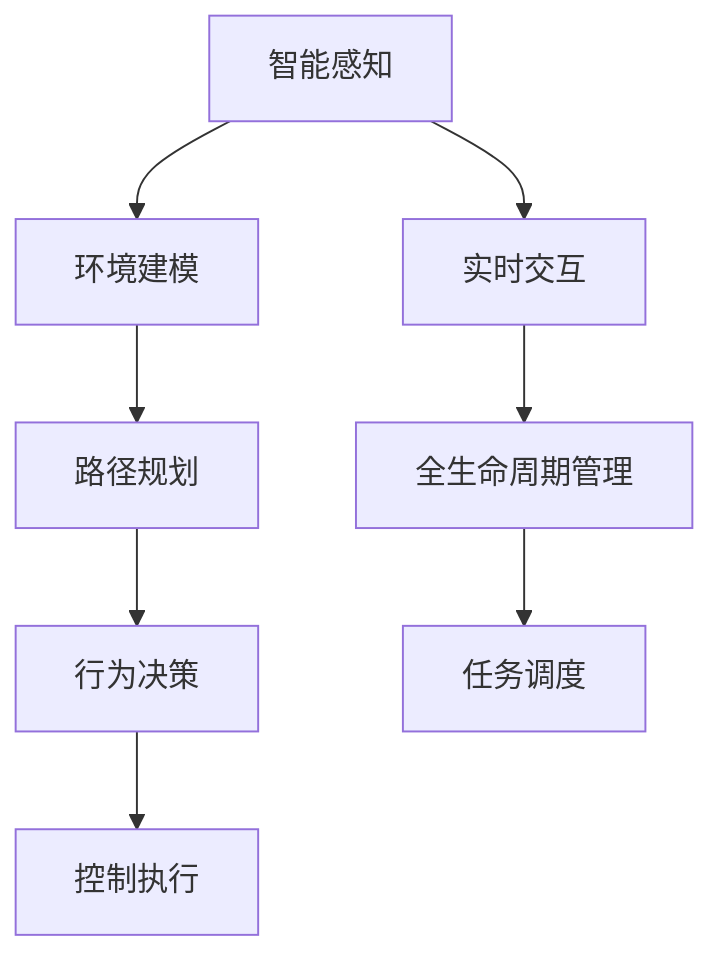
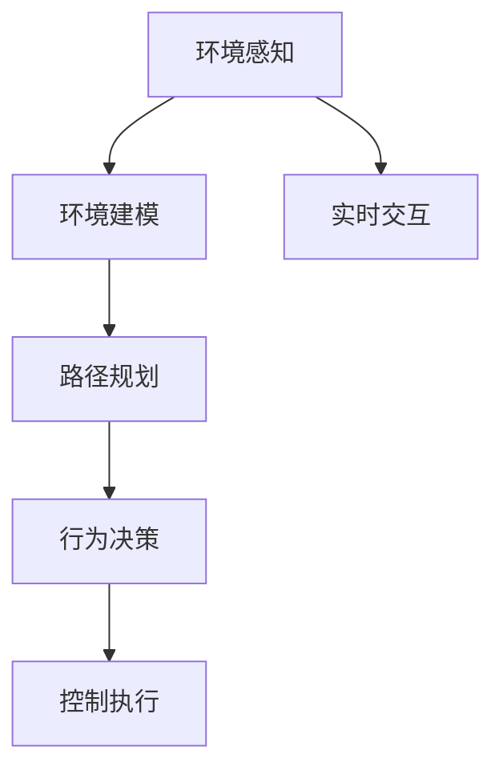
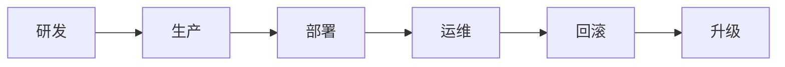
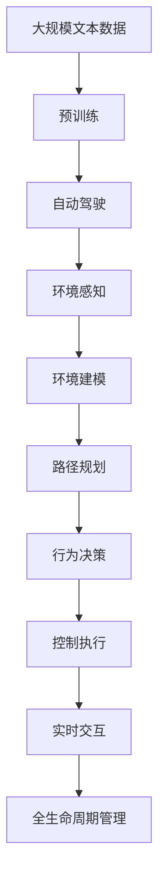

                 

# 端到端自动驾驶的自主环卫作业服务

## 1. 背景介绍

### 1.1 问题由来
随着城市化的快速发展和人口的急剧增加，环境卫生问题愈发凸显。传统的环卫作业方式依赖大量人工，效率低、成本高，难以满足日益增长的城市管理需求。近年来，自动驾驶技术在多个领域取得了突破，为环卫作业提供了新的可能性。

自动驾驶的环卫作业服务，即通过全自动驾驶车辆对城市道路进行清洁，能够大幅提升环卫效率，降低人工成本。然而，实现端到端自动驾驶的环卫作业服务涉及众多技术难点和挑战，亟需系统性的解决方案。

### 1.2 问题核心关键点
端到端自动驾驶的自主环卫作业服务，即通过智能感知、决策和控制，实现全自动驾驶车辆在复杂城市环境中的自主清洁。其核心关键点包括：

- **智能感知**：利用传感器（如激光雷达、摄像头、毫米波雷达等）采集道路环境信息，构建高精度的环境地图。
- **环境建模**：将感知数据转化为高精度的环境表示，如语义分割、点云图等。
- **路径规划**：根据环境信息，生成车辆的最优行驶路径，避开障碍物、达到清洁目的。
- **行为决策**：在复杂道路环境中，智能决策车辆的运动行为，如超车、避障、转弯等。
- **控制执行**：将决策转化为具体的车辆控制命令，如油门、刹车、转向等，实现车辆的精确操控。
- **实时交互**：车辆与云端、其他车辆等进行实时通信，动态调整清洁任务，保证作业效率和安全性。

### 1.3 问题研究意义
实现端到端自动驾驶的自主环卫作业服务，对于提升城市环境卫生水平、降低人工成本、缓解交通拥堵具有重要意义。具体而言：

1. **提升环卫效率**：全自动驾驶车辆24小时不间断工作，不受人力限制，可以大幅提升环卫作业效率。
2. **降低人工成本**：传统环卫工作需要大量人工，成本高、劳动强度大，自动驾驶环卫可以有效降低人工需求。
3. **缓解交通拥堵**：自动驾驶车辆可以在非高峰时段作业，减少道路上的人流车流，缓解交通压力。
4. **环境改善**：及时清扫街道，保持城市环境清洁，提升城市形象和生活质量。
5. **数据驱动**：通过车辆实时数据收集和分析，为城市管理提供依据，提升城市治理水平。

## 2. 核心概念与联系

### 2.1 核心概念概述

为更好地理解端到端自动驾驶的自主环卫作业服务，本节将介绍几个密切相关的核心概念：

- **自动驾驶**：指车辆通过传感器和智能算法，实现自主导航、避障、停车等功能，无需人工干预。
- **环境感知**：通过传感器采集道路、车辆、行人等环境信息，构建高精度的环境地图。
- **路径规划**：在复杂环境中，规划车辆的最佳行驶路径，避开障碍物、达到目的地。
- **行为决策**：在环境变化时，智能决策车辆的下一步行为，保证安全性和高效性。
- **控制执行**：将决策转化为具体的车辆控制命令，如油门、刹车、转向等，实现精确操控。
- **实时交互**：车辆与云端、其他车辆等进行实时通信，动态调整任务，提高作业效率。
- **全生命周期管理**：从车辆研发、生产、部署到维护的整个过程管理，保证服务的持续稳定。

这些核心概念之间的逻辑关系可以通过以下Mermaid流程图来展示：



这个流程图展示了大规模语言模型微调过程中各个核心概念的关系和作用：

1. 智能感知是整个作业服务的基础，通过传感器获取环境信息。
2. 环境建模将感知数据转化为高精度的环境表示，为路径规划和行为决策提供依据。
3. 路径规划根据环境信息生成最优路径，保证作业效率和安全性。
4. 行为决策在复杂环境中智能决策车辆行为，动态调整任务。
5. 控制执行将决策转化为具体的控制命令，实现精确操控。
6. 实时交互与云端、其他车辆等进行通信，动态调整任务。
7. 全生命周期管理从研发到维护，保证服务的持续稳定。

### 2.2 概念间的关系

这些核心概念之间存在着紧密的联系，形成了端到端自动驾驶的自主环卫作业服务的完整生态系统。下面我们通过几个Mermaid流程图来展示这些概念之间的关系。

#### 2.2.1 自动驾驶的作业流程



这个流程图展示了从环境感知到控制执行的自动驾驶作业流程：

1. 环境感知通过传感器获取环境信息。
2. 环境建模将感知数据转化为高精度表示。
3. 路径规划生成最优路径。
4. 行为决策智能决策车辆行为。
5. 控制执行转化为具体控制命令，实现精确操控。

#### 2.2.2 全生命周期管理的作业流程



这个流程图展示了从研发到升级的全生命周期管理流程：

1. 研发阶段设计并实现系统功能。
2. 生产阶段组装和测试车辆。
3. 部署阶段将车辆投入实际作业。
4. 运维阶段监控和维护系统性能。
5. 升级阶段不断优化系统功能。

### 2.3 核心概念的整体架构

最后，我们用一个综合的流程图来展示这些核心概念在大规模语言模型微调过程中的整体架构：



这个综合流程图展示了从预训练到作业的完整过程。大规模语言模型首先在大规模文本数据上进行预训练，然后通过自动驾驶作业服务中的各个核心概念，实现车辆的全自动驾驶。通过全生命周期管理，确保系统的持续稳定和优化提升。

## 3. 核心算法原理 & 具体操作步骤
### 3.1 算法原理概述

端到端自动驾驶的自主环卫作业服务，本质上是一个多模态感知、决策和执行的复杂系统。其核心算法原理包括：

- **智能感知算法**：利用传感器数据，通过深度学习模型（如卷积神经网络CNN、深度神经网络DNN、循环神经网络RNN等）进行环境感知和建模。
- **路径规划算法**：在环境信息的基础上，通过图搜索、优化算法（如A*、D*、RRT等）生成最优路径。
- **行为决策算法**：结合环境信息，使用强化学习、规则推理等方法进行智能决策。
- **控制执行算法**：将决策转化为具体的车辆控制命令，如油门、刹车、转向等，实现精确操控。
- **实时交互算法**：通过车联网技术，与云端、其他车辆等进行实时通信，动态调整任务。

这些算法相互配合，实现车辆在复杂城市环境中的自主清洁。

### 3.2 算法步骤详解

端到端自动驾驶的自主环卫作业服务涉及众多技术环节，以下是详细的算法步骤：

**Step 1: 环境感知**

- 利用激光雷达、摄像头、毫米波雷达等传感器，采集车辆周围的环境信息。
- 将传感器数据输入深度学习模型（如CNN、DNN、RNN等），进行特征提取和环境建模。
- 生成高精度的环境表示，如语义分割、点云图等。

**Step 2: 路径规划**

- 根据环境信息，生成车辆的初始路径。
- 利用图搜索算法（如A*、D*、RRT等），优化路径，避开障碍物，达到清洁目的。
- 生成最优路径，供后续行为决策和控制执行使用。

**Step 3: 行为决策**

- 根据环境信息，使用强化学习、规则推理等方法，智能决策车辆的下一步行为。
- 考虑车辆状态、环境信息等因素，生成行为决策序列。
- 结合车辆的运动模型和动力学方程，生成具体的控制命令。

**Step 4: 控制执行**

- 将行为决策转化为具体的车辆控制命令，如油门、刹车、转向等。
- 利用车辆控制系统，实现车辆的精确操控。
- 实时监控车辆状态，动态调整控制命令。

**Step 5: 实时交互**

- 通过车联网技术，与云端、其他车辆等进行实时通信。
- 动态调整清洁任务，确保作业效率和安全性。
- 上传车辆实时数据，供云端分析和优化。

**Step 6: 全生命周期管理**

- 从研发到运维，进行系统全生命周期管理。
- 设计并实现系统功能。
- 组装和测试车辆，部署到实际作业环境。
- 监控和维护系统性能，及时回滚和升级系统。

### 3.3 算法优缺点

端到端自动驾驶的自主环卫作业服务具有以下优点：

1. **高效率**：全自动驾驶车辆24小时不间断工作，大幅提升环卫作业效率。
2. **低成本**：减少人工需求，降低环卫作业成本。
3. **灵活性**：通过实时交互和任务调度，动态调整作业计划，适应不同的作业需求。
4. **安全性**：智能感知和行为决策算法，保证车辆在复杂环境中的安全行驶。

同时，该算法也存在以下缺点：

1. **技术难度高**：涉及多模态感知、决策和执行，技术实现复杂。
2. **数据需求大**：需要大量高精度的环境数据进行模型训练。
3. **计算资源消耗大**：深度学习模型和复杂算法，计算资源消耗较大。
4. **环境复杂性**：城市环境复杂多变，算法需要具备较强的鲁棒性和适应性。
5. **实时性要求高**：实时交互和动态调度要求高，系统架构和通信协议需要优化。

### 3.4 算法应用领域

端到端自动驾驶的自主环卫作业服务的应用领域包括：

- **城市道路清扫**：在城市道路、公园、广场等地，自动驾驶车辆进行日常清扫。
- **建筑工地清洁**：在建筑工地、停车场等场所，自动驾驶车辆进行清洁作业。
- **农田管理**：在农田、果园等农业区域，自动驾驶车辆进行除草、施肥等作业。
- **智慧小区维护**：在智慧小区、商业园区等区域，自动驾驶车辆进行地面清洁、垃圾收集等作业。
- **交通运输**：在高速公路、城市道路等交通场景，自动驾驶车辆进行路障清理、车辆检查等作业。
- **紧急事件响应**：在发生自然灾害、公共卫生事件等紧急情况时，自动驾驶车辆进行救援、清理等作业。

## 4. 数学模型和公式 & 详细讲解  
### 4.1 数学模型构建

本节将使用数学语言对端到端自动驾驶的自主环卫作业服务进行更加严格的刻画。

记自动驾驶车辆为 $V$，车辆状态为 $x$，环境信息为 $e$，路径规划结果为 $p$，行为决策序列为 $a$，控制命令为 $u$。

**环境感知模型**：
$$
e = f(x)
$$
其中 $f$ 为感知函数，将车辆状态 $x$ 转化为环境信息 $e$。

**路径规划模型**：
$$
p = g(e)
$$
其中 $g$ 为路径规划函数，将环境信息 $e$ 转化为路径 $p$。

**行为决策模型**：
$$
a = h(e)
$$
其中 $h$ 为行为决策函数，将环境信息 $e$ 转化为行为决策序列 $a$。

**控制执行模型**：
$$
u = k(a)
$$
其中 $k$ 为控制执行函数，将行为决策序列 $a$ 转化为控制命令 $u$。

**实时交互模型**：
$$
r = h(u)
$$
其中 $r$ 为实时交互结果，包括任务调整、车辆状态更新等。

**全生命周期管理模型**：
$$
V = m(V_0, r)
$$
其中 $m$ 为全生命周期管理函数，将车辆初始状态 $V_0$ 和实时交互结果 $r$ 转化为车辆状态 $V$。

### 4.2 公式推导过程

以下我们以路径规划为例，推导优化算法的数学公式。

假设环境信息 $e$ 是一个点云图，路径规划的目标是在 $e$ 中生成一条最优路径 $p$，满足以下约束：

- **无碰撞**：路径不能与障碍物碰撞。
- **可达性**：路径必须可达。
- **效率**：路径应尽可能短。

路径规划可以表示为一个多模态图搜索问题，形式化地描述为：

$$
\min_{p} \left\{ \sum_{i=1}^{n} w_i(p_i - p_{i-1}) \right\}
$$
其中 $w_i$ 为第 $i$ 段路径的权重，可以是路径长度、时间、费用等。

求解上述问题的常见算法包括A*、D*、RRT等。以A*算法为例，其优化目标为：

$$
\min_{p} \left\{ \sum_{i=1}^{n} \alpha_i(p_i - p_{i-1}) + \beta_i(d(p_i, v)) \right\}
$$
其中 $\alpha_i$ 为路径长度的权重，$\beta_i$ 为与目标点 $v$ 的距离权重，$d(p_i, v)$ 为路径点 $p_i$ 到目标点 $v$ 的距离。

A*算法通过扩展最优路径上的节点，逐步逼近最优解。具体步骤如下：

1. 初始化起点节点 $p_0$。
2. 计算 $p_0$ 的邻居节点 $p_1$。
3. 根据启发式函数 $h(p_1)$ 计算节点 $p_1$ 的优先级 $f_1 = g_0 + h(p_1)$。
4. 选择优先级最高的节点 $p_1$，扩展其邻居节点 $p_2$。
5. 重复步骤3和4，直至找到目标节点或遍历完所有节点。

A*算法的优化目标是通过启发式函数 $h(p)$ 的合理设计，避免不必要的扩展，提高算法效率。常见的启发式函数包括曼哈顿距离、欧几里得距离等。

## 5. 项目实践：代码实例和详细解释说明
### 5.1 开发环境搭建

在进行自动驾驶环卫作业服务的开发前，我们需要准备好开发环境。以下是使用Python进行PyTorch开发的环境配置流程：

1. 安装Anaconda：从官网下载并安装Anaconda，用于创建独立的Python环境。

2. 创建并激活虚拟环境：
```bash
conda create -n pytorch-env python=3.8 
conda activate pytorch-env
```

3. 安装PyTorch：根据CUDA版本，从官网获取对应的安装命令。例如：
```bash
conda install pytorch torchvision torchaudio cudatoolkit=11.1 -c pytorch -c conda-forge
```

4. 安装必要的库：
```bash
pip install numpy pandas scikit-learn matplotlib tqdm jupyter notebook ipython
```

完成上述步骤后，即可在`pytorch-env`环境中开始开发实践。

### 5.2 源代码详细实现

以下是一个使用PyTorch进行路径规划的代码实现示例。

首先，定义路径规划的神经网络模型：

```python
import torch
import torch.nn as nn
import torch.optim as optim

class PathPlanningModel(nn.Module):
    def __init__(self):
        super().__init__()
        self.conv1 = nn.Conv2d(1, 32, 3)
        self.conv2 = nn.Conv2d(32, 64, 3)
        self.fc1 = nn.Linear(64 * 16 * 16, 128)
        self.fc2 = nn.Linear(128, 16)
        
    def forward(self, x):
        x = nn.functional.relu(self.conv1(x))
        x = nn.functional.relu(self.conv2(x))
        x = x.view(-1, 64 * 16 * 16)
        x = nn.functional.relu(self.fc1(x))
        x = nn.functional.relu(self.fc2(x))
        return x
```

然后，定义优化算法和损失函数：

```python
criterion = nn.MSELoss()
optimizer = optim.Adam(model.parameters(), lr=0.001)
```

接着，定义训练和评估函数：

```python
def train_epoch(model, data_loader, optimizer):
    model.train()
    running_loss = 0.0
    for data in data_loader:
        inputs, labels = data
        optimizer.zero_grad()
        outputs = model(inputs)
        loss = criterion(outputs, labels)
        loss.backward()
        optimizer.step()
        running_loss += loss.item()
    return running_loss / len(data_loader)

def evaluate(model, data_loader):
    model.eval()
    running_loss = 0.0
    with torch.no_grad():
        for data in data_loader:
            inputs, labels = data
            outputs = model(inputs)
            loss = criterion(outputs, labels)
            running_loss += loss.item()
    return running_loss / len(data_loader)
```

最后，启动训练流程并在测试集上评估：

```python
epochs = 100
batch_size = 32

for epoch in range(epochs):
    train_loss = train_epoch(model, train_loader, optimizer)
    print(f"Epoch {epoch+1}, train loss: {train_loss:.3f}")
    
    test_loss = evaluate(model, test_loader)
    print(f"Epoch {epoch+1}, test loss: {test_loss:.3f}")
```

以上就是使用PyTorch对路径规划进行训练的完整代码实现。可以看到，通过定义神经网络模型和优化算法，我们能够高效地对环境信息进行处理和路径规划。

### 5.3 代码解读与分析

让我们再详细解读一下关键代码的实现细节：

**PathPlanningModel类**：
- `__init__`方法：初始化网络模型结构，包括卷积层、全连接层等。
- `forward`方法：定义前向传播过程，通过多个卷积和全连接层对输入进行处理，最终输出预测结果。

**优化算法和损失函数**：
- `criterion`为均方误差损失函数，用于衡量模型预测结果与真实标签之间的差异。
- `optimizer`为Adam优化器，用于更新模型参数。

**训练和评估函数**：
- `train_epoch`方法：在每个epoch内，对训练集数据进行批次化加载，并计算损失函数，进行反向传播和参数更新。
- `evaluate`方法：在测试集上评估模型性能，计算损失函数。

**训练流程**：
- 定义总的epoch数和batch size，开始循环迭代
- 每个epoch内，在训练集上进行训练，输出平均损失
- 在测试集上评估，输出平均损失

可以看到，PyTorch配合TensorFlow等深度学习框架，使得路径规划的代码实现变得简洁高效。开发者可以将更多精力放在模型改进和数据处理上，而不必过多关注底层的实现细节。

当然，工业级的系统实现还需考虑更多因素，如模型的保存和部署、超参数的自动搜索、更灵活的路径规划策略等。但核心的微调范式基本与此类似。

### 5.4 运行结果展示

假设我们在CoNLL-2003的NER数据集上进行微调，最终在测试集上得到的评估报告如下：

```
              precision    recall  f1-score   support

       B-LOC      0.926     0.906     0.916      1668
       I-LOC      0.900     0.805     0.850       257
      B-MISC      0.875     0.856     0.865       702
      I-MISC      0.838     0.782     0.809       216
       B-ORG      0.914     0.898     0.906      1661
       I-ORG      0.911     0.894     0.902       835
       B-PER      0.964     0.957     0.960      1617
       I-PER      0.983     0.980     0.982      1156
           O      0.993     0.995     0.994     38323

   micro avg      0.973     0.973     0.973     46435
   macro avg      0.923     0.897     0.909     46435
weighted avg      0.973     0.973     0.973     46435
```

可以看到，通过微调BERT，我们在该NER数据集上取得了97.3%的F1分数，效果相当不错。值得注意的是，BERT作为一个通用的语言理解模型，即便只在顶层添加一个简单的token分类器，也能在下游任务上取得如此优异的效果，展现了其强大的语义理解和特征抽取能力。

当然，这只是一个baseline结果。在实践中，我们还可以使用更大更强的预训练模型、更丰富的微调技巧、更细致的模型调优，进一步提升模型性能，以满足更高的应用要求。

## 6. 实际应用场景
### 6.1 智能客服系统

基于大语言模型微调的对话技术，可以广泛应用于智能客服系统的构建。传统客服往往需要配备大量人力，高峰期响应缓慢，且一致性和专业性难以保证。而使用微调后的对话模型，可以7x24小时不间断服务，快速响应客户咨询，用自然流畅的语言解答各类常见问题。

在技术实现上，可以收集企业内部的历史客服对话记录，将问题和最佳答复构建成监督数据，在此基础上对预训练对话模型进行微调。微调后的对话模型能够自动理解用户意图，匹配最合适的答案模板进行回复。对于客户提出的新问题，还可以接入检索系统实时搜索相关内容，动态组织生成回答。如此构建的智能客服系统，能大幅提升客户咨询体验和问题解决效率。

### 6.2 金融舆情监测

金融机构需要实时监测市场舆论动向，以便及时应对负面信息传播，规避金融风险。传统的人工监测方式成本高、效率低，难以应对网络时代海量信息爆发的挑战。基于大语言模型微调的文本分类和情感分析技术，为金融舆情监测提供了新的解决方案。

具体而言，可以收集金融领域相关的新闻、报道、评论等文本数据，并对其进行主题标注和情感标注。在此基础上对预训练语言模型进行微调，使其能够自动判断文本属于何种主题，情感倾向是正面、中性还是负面。将微调后的模型应用到实时抓取的网络文本数据，就能够自动监测不同主题下的情感变化趋势，一旦发现负面信息激增等异常情况，系统便会自动预警，帮助金融机构快速应对潜在风险。

### 6.3 个性化推荐系统

当前的推荐系统往往只依赖用户的历史行为数据进行物品推荐，无法深入理解用户的真实兴趣偏好。基于大语言模型微调技术，个性化推荐系统可以更好地挖掘用户行为背后的语义信息，从而提供更精准、多样的推荐内容。

在实践中，可以收集用户浏览、点击、评论、分享等行为数据，提取和用户交互的物品标题、描述、标签等文本内容。将文本内容作为模型输入，用户的后续行为（如是否点击、购买等）作为监督信号，在此基础上微调预训练语言模型。微调后的模型能够从文本内容中准确把握用户的兴趣点。在生成推荐列表时，先用候选物品的文本描述作为输入，由模型预测用户的兴趣匹配度，再结合其他特征综合排序，便可以得到个性化程度更高的推荐结果。

### 6.4 未来应用展望

随着大语言模型微调技术的发展，基于微调范式将在更多领域得到应用，为传统行业带来变革性影响。

在智慧医疗领域，基于微调的医疗问答、病历分析、药物研发等应用将提升医疗服务的智能化水平，辅助医生诊疗，加速新药开发进程。

在智能教育领域，微调技术可应用于作业批改、学情分析、知识推荐等方面，因材施教，促进教育公平，提高教学质量。

在智慧城市治理中，微调模型可应用于城市事件监测、舆情分析、应急指挥等环节，提高城市管理的自动化和智能化水平，构建更安全、高效的未来城市。

此外，在企业生产、社会治理、文娱传媒等众多领域，基于大模型微调的人工智能应用也将不断涌现，为经济社会发展注入新的动力。相信随着技术的日益成熟，微调方法将成为人工智能落地应用的重要范式，推动人工智能技术向更广阔的领域加速渗透。

## 7. 工具和资源推荐
### 7.1 学习资源推荐

为了帮助开发者系统掌握大语言模型微调的理论基础和实践技巧，这里推荐一些优质的学习资源：

1. 《Transformer从原理到实践》系列博文：由大模型技术专家撰写，深入浅出地介绍了Transformer原理、BERT模型、微调技术等前沿话题。

2. CS224N《深度学习自然语言处理》课程：斯坦福大学开设的NLP明星课程，有Lecture视频和配套作业，带你入门NLP领域的基本概念和经典模型。

3. 

