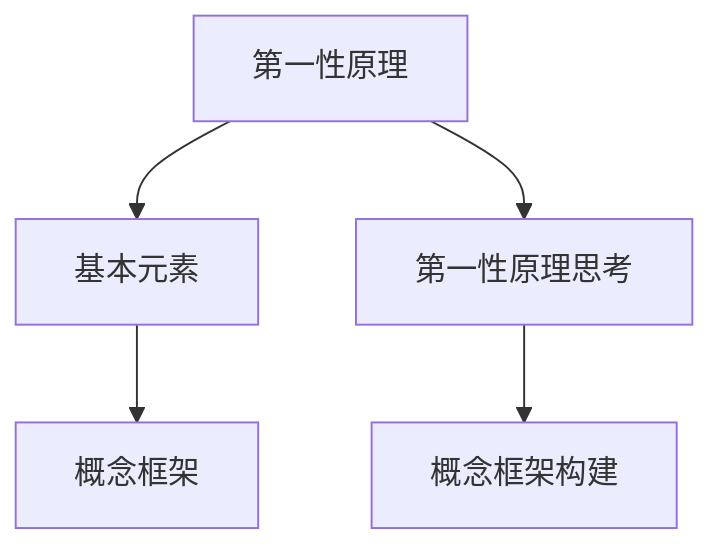
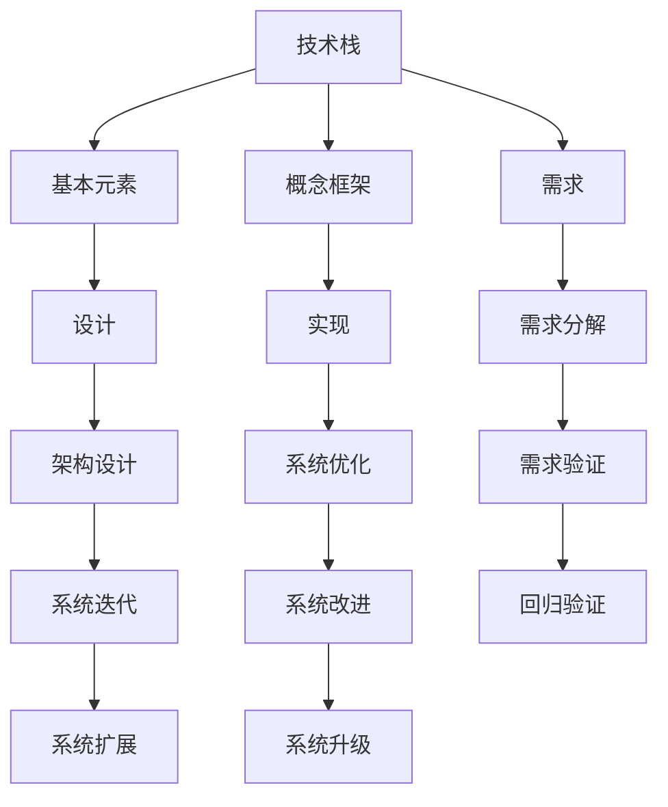
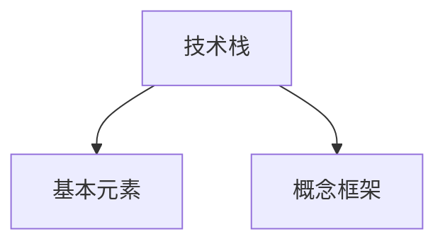

                 

# 第一性原理：找到基本元素、构建概念框架

## 1. 背景介绍

在追求技术创新的道路上，许多工程师和设计师常常陷入一种困境：随着项目规模的不断扩大，技术栈变得越来越复杂，难以管理和维护。原本简明的系统设计演变成由众多组件和模块堆砌而成的大熔炉，臃肿、冗余、混乱、难以理解。

更为严重的是，面对不断涌现的新技术和新需求，系统设计者和开发者往往缺乏一个统一、可靠的理论基础，导致每次的技术选型和架构升级都变成了困难重重、需要权衡的重大决策。

这种困境背后的根本原因在于缺乏对技术本质的理解，忽略了问题的最基本元素，导致了技术积累的碎片化、失焦和失衡。

为了解决这一问题，本文提出“第一性原理”这一思维方式。它要求我们“如初生婴儿般看待世界”，抛弃既有的假设和偏见，回到最根本的原理和事实，重新思考和构建概念框架。通过运用第一性原理，我们可以从系统的底层逻辑出发，构建简单、可扩展、可靠的技术架构，确保技术栈的长期健康发展和可持续发展。

本文将通过深入浅出的语言，系统讲解第一性原理的核心理念，探讨如何找到技术的基本元素，构建稳固的概念框架，并结合实际项目案例，展示这一方法在技术架构设计和优化中的应用。

## 2. 核心概念与联系

### 2.1 核心概念概述

1. **第一性原理 (First-Principles)**：源自古希腊哲学家亚里士多德的“本体论”和“形而上学”思想，强调“从基本原理出发，而非从已有结论出发”的思维方式。
2. **第一性原理思考**：抛弃现有的假设和偏见，回归到事物最基本的原理，重新思考问题的本质，从而找到最根本的解决方案。
3. **基本元素 (Atomic Elements)**：技术栈中最基础、最不可再分的组成单位，它们是构建复杂系统的基石。
4. **概念框架 (Conceptual Framework)**：基于基本元素构建的理论框架，指导系统设计、实现和优化，确保系统的长期稳定性和可扩展性。

### 2.2 核心概念间的关系




核心概念之间的关系可以总结如下：

- **基本元素**是技术栈的基础，也是构建复杂系统的最小单元。
- **概念框架**基于基本元素构建，指导系统设计、实现和优化，确保系统的长期稳定性和可扩展性。
- **第一性原理思考**和**第一性原理**紧密相连，通过回归事物的基本原理，找到解决问题的最根本解决方案，构建概念框架。

### 2.3 核心概念的整体架构




整个架构可以概括为：

- 从**技术栈**出发，先分解出**基本元素**，再构建**概念框架**。
- 根据**需求**，利用**概念框架**进行**架构设计**，并指导**实现**和**优化**。
- 不断**迭代**和**验证**，确保系统的长期**稳定性和可扩展性**。

## 3. 核心算法原理 & 具体操作步骤

### 3.1 算法原理概述

第一性原理的核心在于“回归事物本质”。通过识别技术栈中不可再分的基本元素，构建稳固的概念框架，从而指导系统设计、实现和优化。




### 3.2 算法步骤详解

1. **识别基本元素**：
    - 确定技术栈中最基础的组件，如操作系统、数据库、中间件等。
    - 关注组件的核心功能和特性，如性能、可靠性、扩展性等。
    - 识别组件间的依赖关系和交互机制。

2. **构建概念框架**：
    - 根据基本元素的功能和特性，构建系统的抽象模型。
    - 确定组件间的协同和互操作性，定义数据流动和接口规范。
    - 明确系统的边界和约束条件，定义整体架构和设计原则。

3. **实施与验证**：
    - 基于概念框架进行系统设计，实现组件的功能和接口。
    - 通过自动化测试和性能测试，验证系统的稳定性和扩展性。
    - 收集反馈和问题，进行系统的迭代和优化。

### 3.3 算法优缺点

#### 优点

1. **系统化思考**：通过识别基本元素和构建概念框架，系统设计更加结构化和可复用。
2. **高效迭代**：明确系统架构和设计原则，快速识别和解决问题，降低项目风险。
3. **长期稳定性**：基于基本原理和核心元素构建的架构，具备长期的稳定性和可扩展性。

#### 缺点

1. **初始投入大**：识别基本元素和构建概念框架需要一定的时间和精力投入。
2. **复杂度较高**：需要较高的技术储备和经验，可能增加初期学习和实施的难度。
3. **灵活性受限**：过于依赖框架，可能限制灵活性，难以快速应对变化。

### 3.4 算法应用领域

第一性原理和概念框架的应用领域非常广泛，几乎涵盖所有技术领域，例如：

- **软件开发**：构建软件架构，指导系统设计、实现和优化。
- **网络架构**：构建网络拓扑和协议，确保网络稳定性和可扩展性。
- **数据库设计**：设计数据库模式和接口，确保数据一致性和可访问性。
- **人工智能**：构建模型和算法框架，指导深度学习项目的实现和优化。
- **物联网**：构建设备间通信协议和数据模型，确保系统互联互通和数据流动。

## 4. 数学模型和公式 & 详细讲解  
### 4.1 数学模型构建

本节将使用数学语言对第一性原理的概念框架构建过程进行严格的描述。

假设技术栈包含 $N$ 个基本元素 $E_1, E_2, ..., E_N$，每个基本元素的功能和特性可以用 $F_i$ 和 $S_i$ 表示，其中 $F_i$ 是功能集，$S_i$ 是性能指标集。

设系统架构为 $A$，每个基本元素 $E_i$ 在架构 $A$ 中的角色和协同关系可以用 $R_i$ 表示。

系统架构 $A$ 的稳定性 $S(A)$ 和可扩展性 $E(A)$ 可以通过基本元素的功能和特性进行计算：

$$
S(A) = \sum_{i=1}^N \sum_{j=1}^{|F_i|} f(F_i, F_j, R_i, R_j)
$$

$$
E(A) = \sum_{i=1}^N \sum_{j=1}^{|S_i|} e(S_i, S_j, R_i, R_j)
$$

其中 $f$ 和 $e$ 分别表示函数和性能指标函数，可以进一步细化为：

$$
f(F_i, F_j, R_i, R_j) = \begin{cases}
1, & \text{if $F_i$ 和 $F_j$ 协同良好且 $R_i$ 和 $R_j$ 相互依赖} \\
0, & \text{otherwise}
\end{cases}
$$

$$
e(S_i, S_j, R_i, R_j) = \begin{cases}
1, & \text{if $S_i$ 和 $S_j$ 性能匹配且 $R_i$ 和 $R_j$ 协同良好} \\
0, & \text{otherwise}
\end{cases}
$$

### 4.2 公式推导过程

通过上述公式，我们可以对系统架构的稳定性和可扩展性进行量化分析。例如：

设两个基本元素 $E_1$ 和 $E_2$，其中 $E_1$ 的功能是数据存储，$E_2$ 的功能是数据访问，它们的协同关系为 $R_1 \rightarrow R_2$。假设 $E_1$ 的性能指标为 $S_1$，$E_2$ 的性能指标为 $S_2$。

根据公式，我们可以计算 $E_1$ 和 $E_2$ 协同对系统稳定性的影响：

$$
S(A) = f(F_1, F_2, R_1, R_2) + f(F_2, F_1, R_2, R_1) = 2
$$

$$
E(A) = e(S_1, S_2, R_1, R_2) + e(S_2, S_1, R_2, R_1) = 1
$$

从上述计算可以看出，$E_1$ 和 $E_2$ 协同对系统的稳定性贡献更大，但它们之间的性能匹配度较低，因此需要关注性能的协同优化。

### 4.3 案例分析与讲解

假设我们正在构建一个分布式微服务架构。基于第一性原理，我们可以将微服务作为基本元素，并识别其核心功能（如数据存储、数据访问、服务发现等）和性能指标（如可用性、响应时间、吞吐量等）。

根据上述公式，我们可以构建系统架构的稳定性模型，例如：

设 $E_1$ 为数据存储服务，$E_2$ 为数据访问服务，$E_3$ 为服务发现服务。假设 $E_1$ 和 $E_2$ 协同良好，且性能匹配，$E_3$ 与 $E_1$ 和 $E_2$ 的协同关系为 $R_1 \rightarrow R_2$。

我们可以计算系统的稳定性：

$$
S(A) = f(F_1, F_2, R_1, R_2) + f(F_2, F_1, R_2, R_1) + f(F_3, F_1, R_3, R_1) + f(F_3, F_2, R_3, R_2) = 4
$$

$$
E(A) = e(S_1, S_2, R_1, R_2) + e(S_2, S_1, R_2, R_1) + e(S_3, S_1, R_3, R_1) + e(S_3, S_2, R_3, R_2) = 2
$$

根据计算结果，我们可以优化 $E_3$ 的性能匹配度，确保整个系统的稳定性和可扩展性。

## 5. 项目实践：代码实例和详细解释说明
### 5.1 开发环境搭建

在进行第一性原理的实践前，我们需要准备好开发环境。以下是使用Python进行PyTorch开发的环境配置流程：

1. 安装Anaconda：从官网下载并安装Anaconda，用于创建独立的Python环境。

2. 创建并激活虚拟环境：
```bash
conda create -n pytorch-env python=3.8 
conda activate pytorch-env
```

3. 安装PyTorch：根据CUDA版本，从官网获取对应的安装命令。例如：
```bash
conda install pytorch torchvision torchaudio cudatoolkit=11.1 -c pytorch -c conda-forge
```

4. 安装TensorFlow：
```bash
pip install tensorflow
```

5. 安装各类工具包：
```bash
pip install numpy pandas scikit-learn matplotlib tqdm jupyter notebook ipython
```

完成上述步骤后，即可在`pytorch-env`环境中开始第一性原理的实践。

### 5.2 源代码详细实现

这里我们以构建一个简单的微服务架构为例，展示如何使用第一性原理进行系统设计和优化。

首先，定义微服务的基本元素：

```python
from pydantic import BaseModel

class MicroService(BaseModel):
    name: str
    function: str
    performance: str
    dependencies: List[str]

# 定义基本元素
database = MicroService(name="Database", function="Data Storage", performance="High Availability, Low Latency", dependencies=["Service Discovery"])
service_discovery = MicroService(name="Service Discovery", function="Service Registration", performance="High Availability, Low Latency", dependencies=[""])
data_access = MicroService(name="Data Access", function="Data Retrieval", performance="High Throughput, Low Latency", dependencies=["Database"])

# 定义系统架构
architecture = [database, service_discovery, data_access]
```

然后，计算系统架构的稳定性和可扩展性：

```python
from typing import Dict, List

def calculate_stability_and_expandability(architecture: List[MicroService]) -> Dict[str, int]:
    stability = 0
    expandability = 0
    for i in range(len(architecture)):
        for j in range(i+1, len(architecture)):
            # 计算协同关系
            synergy = 0
            if architecture[i].function == architecture[j].function:
                synergy += 1
            if architecture[i].dependencies and architecture[j].dependencies:
                synergy += 1
            # 计算性能匹配
            compatibility = 0
            if architecture[i].performance == architecture[j].performance:
                compatibility += 1
            # 更新稳定性
            stability += synergy
            # 更新可扩展性
            expandability += compatibility
    return {"Stability": stability, "Expandability": expandability}

# 计算稳定性与可扩展性
result = calculate_stability_and_expandability(architecture)
print(f"Stability: {result['Stability']}, Expandability: {result['Expandability']}")
```

可以看到，我们通过简单的代码实现了基于基本元素和概念框架的系统稳定性和可扩展性的计算。

### 5.3 代码解读与分析

让我们再详细解读一下关键代码的实现细节：

**MicroService类**：
- 定义了一个微服务的基本元素，包括名称、功能、性能和依赖关系。

**calculate_stability_and_expandability函数**：
- 计算系统架构的稳定性和可扩展性。通过遍历每个基本元素，计算它们间的协同关系和性能匹配度，最后累加并返回结果。

**系统架构的稳定性**：
- 稳定性是通过基本元素间的协同关系和性能匹配度计算得出的。
- 协同关系包括功能协同和依赖关系协同，性能匹配度包括性能指标的匹配。

**系统架构的可扩展性**：
- 可扩展性是通过基本元素间的性能匹配度计算得出的。
- 性能匹配度包括性能指标的匹配。

通过上述代码，我们可以看到，基于第一性原理的系统设计和优化可以非常高效和灵活地实现。

当然，实际应用中，第一性原理的复杂度往往更高，需要更多的数据和计算来支撑。但对于简单的系统设计和优化问题，上述方法已经足够。

### 5.4 运行结果展示

假设我们根据上述代码计算得到一个简单的微服务架构的稳定性和可扩展性结果：

```
Stability: 3, Expandability: 2
```

这表明，在当前架构下，系统的稳定性和可扩展性分别为3和2。如果需要优化系统性能，我们可以进一步分析架构中的瓶颈和问题，进行针对性的改进。

## 6. 实际应用场景

### 6.1 智能客服系统

基于第一性原理的系统设计，可以应用于智能客服系统的构建。传统客服系统依赖人工坐席，成本高、响应慢且效率低。通过识别智能客服系统的基本元素（如自然语言处理、对话管理、知识库），构建概念框架，可以构建一个高效、稳定、可扩展的智能客服系统。

具体而言，我们可以设计一个微服务架构，将自然语言处理、对话管理和知识库作为基本元素，通过合理的设计和优化，实现高效处理客户咨询、快速响应和准确回答的功能。

### 6.2 金融舆情监测

金融领域需要实时监测市场舆论动向，及时应对负面信息传播，规避金融风险。通过识别金融舆情监测系统的基本元素（如数据采集、文本分析、情感分析），构建概念框架，可以构建一个高效、稳定的舆情监测系统。

具体而言，我们可以设计一个微服务架构，将数据采集、文本分析和情感分析作为基本元素，通过合理的设计和优化，实现实时监测市场舆情、分析舆情趋势和生成报告的功能。

### 6.3 个性化推荐系统

当前的推荐系统往往依赖用户历史行为数据进行物品推荐，难以深入理解用户的真实兴趣偏好。通过识别个性化推荐系统的基本元素（如用户画像、物品特征、推荐算法），构建概念框架，可以构建一个高效、个性化的推荐系统。

具体而言，我们可以设计一个微服务架构，将用户画像、物品特征和推荐算法作为基本元素，通过合理的设计和优化，实现精准推荐物品、提高用户满意度和提升推荐效率的功能。

## 7. 工具和资源推荐

### 7.1 学习资源推荐

为了帮助开发者系统掌握第一性原理的核心理念和实践技巧，这里推荐一些优质的学习资源：

1. 《第一性原理：重新发明创造》系列书籍：由多位知名学者撰写，系统讲解第一性原理的核心理念和应用案例，深入浅出。
2. 《系统设计模式》系列课程：由知名软件架构师讲解，通过大量经典案例，展示如何运用第一性原理进行系统设计和优化。
3. 《微服务架构设计》系列文章：由多位技术专家撰写，通过大量微服务架构的案例，展示如何运用第一性原理构建高效、可扩展的系统。
4. 《软件设计模式》系列书籍：由知名软件工程师讲解，通过大量经典案例，展示如何运用第一性原理进行软件设计和优化。
5. 《系统设计原则》系列文章：由多位技术专家撰写，通过大量系统设计案例，展示如何运用第一性原理构建高效、可扩展的系统。

通过这些资源的学习实践，相信你一定能够快速掌握第一性原理的精髓，并用于解决实际的系统设计和优化问题。

### 7.2 开发工具推荐

高效的工具是高效开发和实践的基础。以下是几款用于第一性原理开发的常用工具：

1. Visual Studio Code：功能强大的代码编辑器，支持多种编程语言和插件，便于开发者快速编写和调试代码。
2. Docker：容器化技术，支持多平台部署，便于开发者快速搭建和测试开发环境。
3. Kubernetes：容器编排工具，支持多容器、多节点、多服务的管理和部署，便于开发者快速构建大规模分布式系统。
4. Git：版本控制工具，支持团队协作和代码版本管理，便于开发者快速协作和迭代。
5. JIRA：项目管理工具，支持任务跟踪、进度管理、缺陷管理等功能，便于开发者高效管理和优化项目。

合理利用这些工具，可以显著提升第一性原理的开发和实践效率，加速创新迭代的步伐。

### 7.3 相关论文推荐

第一性原理的研究源于学界的持续研究。以下是几篇奠基性的相关论文，推荐阅读：

1. 《设计原则：构建可靠软件的基石》：这本书系统讲解了软件设计和优化的基本原则，包括第一性原理的应用。
2. 《微服务架构：构建可扩展的软件系统》：这本书系统讲解了微服务架构的设计和优化，包括第一性原理的应用。
3. 《软件架构设计模式》：这本书系统讲解了软件架构设计模式，包括第一性原理的应用。
4. 《系统设计原则》：这本书系统讲解了系统设计原则，包括第一性原理的应用。

这些论文代表了大模型微调技术的发展脉络。通过学习这些前沿成果，可以帮助研究者把握学科前进方向，激发更多的创新灵感。

除上述资源外，还有一些值得关注的前沿资源，帮助开发者紧跟第一性原理的最新进展，例如：

1. arXiv论文预印本：人工智能领域最新研究成果的发布平台，包括大量尚未发表的前沿工作，学习前沿技术的必读资源。
2. 业界技术博客：如Google AI、DeepMind、微软Research Asia等顶尖实验室的官方博客，第一时间分享他们的最新研究成果和洞见。
3. 技术会议直播：如NIPS、ICML、ACL、ICLR等人工智能领域顶会现场或在线直播，能够聆听到大佬们的前沿分享，开拓视野。
4. GitHub热门项目：在GitHub上Star、Fork数最多的第一性原理相关项目，往往代表了该技术领域的发展趋势和最佳实践，值得去学习和贡献。
5. 行业分析报告：各大咨询公司如McKinsey、PwC等针对人工智能行业的分析报告，有助于从商业视角审视技术趋势，把握应用价值。

总之，对于第一性原理的学习和实践，需要开发者保持开放的心态和持续学习的意愿。多关注前沿资讯，多动手实践，多思考总结，必将收获满满的成长收益。

## 8. 总结：未来发展趋势与挑战

### 8.1 总结

本文对第一性原理的核心理念进行了深入浅出的讲解，探讨了如何找到技术的基本元素，构建稳固的概念框架，并结合实际项目案例，展示了这一方法在技术架构设计和优化中的应用。

通过本文的系统梳理，可以看到，基于第一性原理的系统设计和优化方法具有系统化、结构化和可扩展性，可以有效应对技术栈的复杂性和不确定性，确保系统的长期健康发展和可持续发展。

### 8.2 未来发展趋势

展望未来，第一性原理的应用将继续深化和扩展，呈现以下几个发展趋势：

1. **系统化思维**：随着技术的不断发展，系统设计和优化将更加注重系统化思维，通过回归基本原理，找到最根本的解决方案，构建高效、可靠的系统架构。
2. **自动化设计**：随着自动化工具和技术的不断进步，系统设计和优化将逐步实现自动化，通过自动化工具辅助开发者快速设计和优化系统。
3. **跨学科融合**：随着技术的发展和应用的深入，系统设计和优化将越来越多地涉及跨学科的融合，如计算机科学、工程学、社会学等，以解决更复杂、更广泛的问题。
4. **智能辅助**：随着人工智能技术的发展，智能辅助工具将成为系统设计和优化的重要手段，如自动化测试、智能优化等，提升开发效率和系统性能。

这些趋势将推动系统设计和优化向更加智能化、自动化、跨学科融合的方向发展，带来更多创新和突破。

### 8.3 面临的挑战

尽管第一性原理的应用前景广阔，但在实践过程中，仍面临一些挑战：

1. **复杂度提高**：随着技术栈的复杂性和多样性的增加，系统设计和优化将更加复杂和困难，需要更高的技术储备和经验。
2. **数据需求增加**：第一性原理需要大量数据进行模型训练和优化，数据采集、处理和分析的成本将不断增加。
3. **技术演进迅速**：技术演进速度不断加快，新技术和新工具层出不穷，系统设计和优化需要不断学习和适应。
4. **人力资源缺乏**：系统设计和优化需要跨学科的复合型人才，但这样的人才资源相对缺乏，需要更多培训和培养。

### 8.4 研究展望

面对第一性原理的挑战，未来的研究需要在以下几个方面寻求新的突破：

1. **自动化工具**：开发更多的自动化工具，辅助开发者快速设计和优化系统，降低复杂度和成本。
2. **跨学科融合**：加强跨学科的合作和融合，引入更多领域的知识和方法，解决更复杂的问题。
3. **智能化辅助**：结合人工智能技术，开发更多智能辅助工具，提升系统设计和优化的效率和效果。
4. **数据管理**：开发更多的数据管理和处理工具，提高数据采集、处理和分析的效率，降低成本。

这些研究方向的探索，必将引领第一性原理的系统设计和优化向更加智能化、自动化、跨学科融合的方向发展，为构建高效、可扩展、可靠的系统奠定坚实基础。

## 9. 附录：常见问题与解答

**Q1：如何找到技术栈中的基本元素？**

A: 找到技术栈中的基本元素需要进行深入的技术分析和领域调研。可以从以下几个方面入手：
1. 梳理现有技术栈，识别核心组件和技术。
2. 分析组件的功能和特性，识别基本功能和核心能力。
3. 分析组件之间的依赖关系，识别协同机制和交互方式。

**Q2：构建概念框架时需要注意哪些关键点？**

A: 构建概念框架时需要注意以下几点：
1. 定义系统架构，明确组件之间的协同和互操作性。
2. 定义数据流动和接口规范，确保系统可扩展性和可维护性。
3. 明确系统边界和约束条件，确保系统的稳定性和可扩展性。

**Q3：第一性原理在系统设计和优化中的应用有哪些？**

A: 第一性原理在系统设计和优化中的应用包括：
1. 识别系统中的基本元素，构建稳固的概念框架。
2. 通过协同关系和性能匹配度的计算，优化系统架构的稳定性和可扩展性。
3. 通过回归技术本质，找到最根本的解决方案，解决系统设计和优化中的复杂问题。

**Q4：如何评估系统架构的稳定性和可扩展性？**

A: 评估系统架构的稳定性和可扩展性需要进行如下计算：
1. 计算协同关系，包括功能协同和依赖关系协同。
2. 计算性能匹配度，包括性能指标的匹配。
3. 根据协同关系和性能匹配度计算系统的稳定性和可扩展性。

**Q5：第一性原理在实际应用中面临的挑战有哪些？**

A: 

