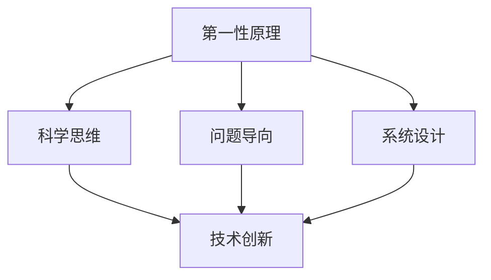
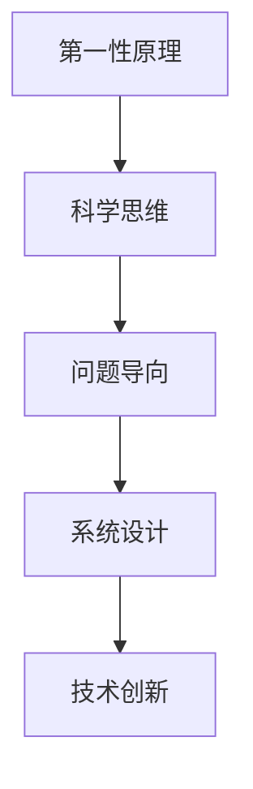
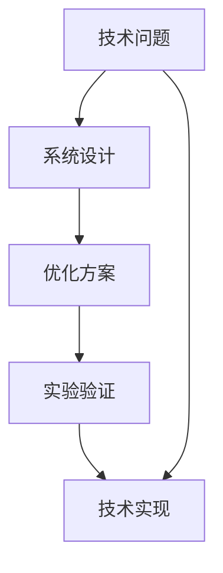
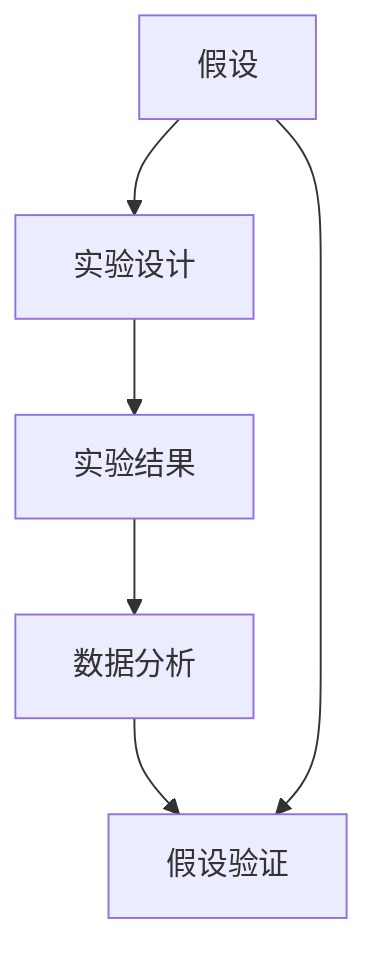
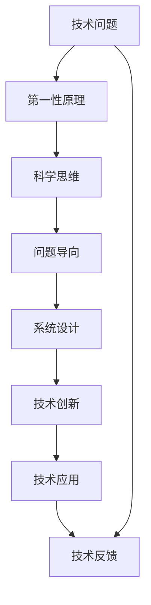

                 

# 第一性原理：科学思维的基础

> 关键词：第一性原理, 科学思维, 问题导向, 系统设计, 技术创新

## 1. 背景介绍

### 1.1 问题由来
在快速变化和复杂多变的科技浪潮中，科技工作者如何保持技术敏锐性、创新能力和系统思维，已成为当前科技发展的重要课题。在人工智能领域，创新型人才不仅需要具备扎实的理论基础，还必须拥有科学高效的问题分析和解决能力。第一性原理（First-Principles Thinking）作为科学思维的基础，对于创新型人才的培养具有重要意义。

### 1.2 问题核心关键点
- **第一性原理**：源自古希腊哲学家亚里士多德，指直接基于基本事实、假设或逻辑的原理，不依赖于现有理论和实践的推导。在科技领域，第一性原理强调回归最基本的事实和逻辑，重新思考问题的本质和边界，避免盲从现有技术和理论。
- **科学思维**：基于观察和实验的数据驱动思维方式，强调证据和逻辑，追求问题的根本解决，避免陷入理论泥潭和观念误区。
- **问题导向**：以实际问题为出发点，采用数据驱动和实验验证的方式，制定可执行的解决方案，注重实践和结果。
- **系统设计**：从整体性出发，考虑系统的各个组成部分和相互作用关系，进行综合性设计和优化，避免局部优化带来的系统失效。
- **技术创新**：以第一性原理和科学思维为指导，不断推陈出新，创造性地解决技术难题，推动技术进步。

### 1.3 问题研究意义
掌握第一性原理和科学思维，对于培养科技创新的关键人才、推动科技创新、提升科技竞争力具有重要意义：

1. **培养创新型人才**：科学思维和第一性原理的培养，使科技人才具备问题分析和解决的能力，具备跨领域创新和融合的能力。
2. **推动科技发展**：回归基本原理和事实，可以避免现有理论和实践的局限性，推动技术突破和创新。
3. **提升科技竞争力**：科学高效的问题分析和解决能力，可以更好地应对市场和技术竞争，提升企业的科技竞争力。
4. **技术创新和产业化**：科学思维和第一性原理，为技术创新提供理论支撑，加速技术产业化进程。
5. **应对复杂问题**：科学思维和第一性原理，为处理复杂多变的技术问题提供有效的工具和方法。

## 2. 核心概念与联系

### 2.1 核心概念概述

为了更好地理解第一性原理和科学思维，本节将介绍几个密切相关的核心概念：

- **第一性原理**：指从最基本的物理、化学、生物等学科的基本事实和理论出发，重新推导和设计技术体系，避免现有理论和实践的局限性。例如，汽车产业通过回归最基本的物理和工程原理，重新设计电池系统，推动了电动汽车技术的发展。

- **科学思维**：基于观察和实验的数据驱动思维方式，强调证据和逻辑，追求问题的根本解决，避免陷入理论泥潭和观念误区。例如，牛顿发现万有引力定律，通过实验验证其普适性，从而解决了天体运动的谜题。

- **问题导向**：以实际问题为出发点，采用数据驱动和实验验证的方式，制定可执行的解决方案，注重实践和结果。例如，电子计算机的诞生，正是为了解决数学计算的复杂性问题，推动了计算科学的进步。

- **系统设计**：从整体性出发，考虑系统的各个组成部分和相互作用关系，进行综合性设计和优化，避免局部优化带来的系统失效。例如，物联网系统通过综合考虑各个节点和协议，设计了高效、可靠的网络架构。

- **技术创新**：以第一性原理和科学思维为指导，不断推陈出新，创造性地解决技术难题，推动技术进步。例如，量子计算机的设计，基于量子力学的基本原理，颠覆了传统计算机的计算模式。

这些核心概念之间的逻辑关系可以通过以下Mermaid流程图来展示：



这个流程图展示了一体化科学思维和第一性原理的创新过程：

1. 从第一性原理出发，设计科学思维的方法。
2. 基于问题导向，进行系统性设计。
3. 综合运用科学思维和系统设计，实现技术创新。

### 2.2 概念间的关系

这些核心概念之间存在着紧密的联系，形成了科技创新的完整生态系统。下面我通过几个Mermaid流程图来展示这些概念之间的关系。

#### 2.2.1 科技创新的核心范式



这个流程图展示了一体化科学思维和第一性原理的创新过程：

1. 从第一性原理出发，设计科学思维的方法。
2. 基于问题导向，进行系统性设计。
3. 综合运用科学思维和系统设计，实现技术创新。

#### 2.2.2 技术创新的系统设计



这个流程图展示了技术创新的系统设计过程：

1. 明确技术问题，进行系统性设计。
2. 制定优化方案，进行实验验证。
3. 实现技术创新，解决实际问题。

#### 2.2.3 科学思维的验证过程



这个流程图展示了科学思维的验证过程：

1. 提出假设，进行实验设计。
2. 获取实验结果，进行数据分析。
3. 验证假设，指导下一步实验。

### 2.3 核心概念的整体架构

最后，我们用一个综合的流程图来展示这些核心概念在第一性原理和科技创新的整体架构：



这个综合流程图展示了从技术问题到技术应用的全过程：

1. 识别技术问题，从第一性原理出发。
2. 设计科学思维，采用问题导向。
3. 进行系统设计，综合运用科学思维。
4. 实现技术创新，推动技术应用。
5. 收集技术反馈，优化技术体系。

通过这些流程图，我们可以更清晰地理解第一性原理和科技创新的各个环节和内在联系，为后续深入讨论具体的创新方法和技术奠定基础。

## 3. 核心算法原理 & 具体操作步骤
### 3.1 算法原理概述

基于第一性原理和科学思维的科技创新，本质上是一个从基本事实和逻辑出发，通过实验验证和优化迭代，最终实现技术创新的过程。其核心思想是：回归基本原理和事实，重新思考问题的本质和边界，避免盲从现有技术和理论。

形式化地，假设技术问题 $P$ 基于最基本的事实和逻辑，定义其第一性原理为 $F(P)$。假设通过科学思维，我们制定了若干种可能的解决方案 $S_1, S_2, \dots, S_n$。通过实验验证，我们得到每个方案的性能指标 $M_1, M_2, \dots, M_n$。最终的解决方案 $S^*$ 应该满足：

$$
S^* = \mathop{\arg\min}_{S_i} M_i
$$

通过梯度下降等优化算法，我们对每个解决方案进行优化迭代，最终得到最优解决方案 $S^*$。这一过程不断重复，直至达到预定的性能要求。

### 3.2 算法步骤详解

基于第一性原理和科学思维的科技创新一般包括以下几个关键步骤：

**Step 1: 定义技术问题**

- 分析技术问题的背景、现状和需求，明确问题的核心和边界。
- 确认技术问题的关键技术点和难点，制定解决目标。

**Step 2: 基于第一性原理提出假设**

- 回归基本事实和逻辑，推导技术问题的第一性原理。
- 根据第一性原理，提出若干种可能的解决方案。

**Step 3: 设计实验方案**

- 设计实验验证方法，确定实验环境和评估指标。
- 制定实验计划，准备实验数据和工具。

**Step 4: 实验验证和优化**

- 实施实验，获取数据和结果。
- 根据实验结果，调整和优化解决方案。
- 重复实验过程，直至达到预定要求。

**Step 5: 技术创新和应用**

- 将优化后的解决方案进行技术实现。
- 部署到实际应用场景，收集反馈和效果数据。
- 根据反馈进行持续优化和迭代。

### 3.3 算法优缺点

基于第一性原理和科学思维的科技创新方法具有以下优点：

1. **回归基本事实和逻辑**：避免现有技术和理论的局限性，推动技术突破和创新。
2. **数据驱动和实验验证**：基于实验结果进行优化和改进，确保技术的可行性和有效性。
3. **系统性设计和整体优化**：考虑技术问题的各个组成部分和相互作用关系，进行综合性设计和优化。
4. **持续改进和迭代**：根据反馈进行持续优化和迭代，不断提升技术性能。

同时，该方法也存在一定的局限性：

1. **时间和资源成本高**：回归基本原理和逻辑，往往需要大量的时间和资源投入。
2. **实验和验证风险高**：实验结果的不确定性，可能导致技术创新的失败。
3. **跨领域融合难度大**：不同领域的交叉融合，需要深入理解各领域的特性和规则，存在较大难度。
4. **知识储备要求高**：需要广泛的基础知识和跨领域知识，才能有效地进行技术创新。

尽管存在这些局限性，但就目前而言，基于第一性原理和科学思维的科技创新方法，仍然是大规模技术创新的重要手段。未来相关研究的重点在于如何进一步降低时间成本、降低实验风险、促进跨领域融合等，以提高技术创新的效率和成功率。

### 3.4 算法应用领域

基于第一性原理和科学思维的科技创新方法，已在诸多领域得到广泛应用，例如：

- **人工智能**：通过回归基本原理和逻辑，重新设计深度学习模型和算法，推动了深度学习技术的发展。
- **量子计算**：基于量子力学的基本原理，重新设计计算模式，推动了量子计算技术的发展。
- **生物技术**：通过回归基本生物化学原理，重新设计生物实验流程，推动了基因编辑和蛋白质工程的发展。
- **材料科学**：通过回归基本物理化学原理，重新设计材料合成工艺，推动了新材料技术的发展。
- **能源技术**：通过回归基本物理化学原理，重新设计能源转化和储存工艺，推动了可再生能源技术的发展。

除了上述这些经典应用外，基于第一性原理和科学思维的技术创新方法，还在更多新兴领域中展现出了其巨大潜力。随着科学思维和第一性原理的深入研究，相信这一方法将会在更多领域得到应用，为人类认知智能的进化带来深远影响。

## 4. 数学模型和公式 & 详细讲解 & 举例说明

### 4.1 数学模型构建

本节将使用数学语言对基于第一性原理和科学思维的科技创新过程进行更加严格的刻画。

假设技术问题 $P$ 基于最基本的事实和逻辑，定义其第一性原理为 $F(P)$。假设通过科学思维，我们制定了若干种可能的解决方案 $S_1, S_2, \dots, S_n$。通过实验验证，我们得到每个方案的性能指标 $M_1, M_2, \dots, M_n$。最终的解决方案 $S^*$ 应该满足：

$$
S^* = \mathop{\arg\min}_{S_i} M_i
$$

其中 $M_i$ 为第 $i$ 个方案的性能指标，例如准确率、精度、吞吐量、响应时间等。$S_i$ 为第 $i$ 个方案的实现细节和技术参数。

### 4.2 公式推导过程

以下我们以机器学习模型的优化为例，推导基于第一性原理和科学思维的优化过程。

假设模型 $M$ 的损失函数为 $L(M)$，参数为 $\theta$。我们的目标是通过优化参数 $\theta$，最小化损失函数 $L(M)$。基于第一性原理和科学思维，我们设计了若干种可能的优化方法 $S_1, S_2, \dots, S_n$，包括不同的优化算法、正则化方法、超参数调整等。通过实验验证，我们得到每个方法在特定数据集上的性能指标 $M_1, M_2, \dots, M_n$。最终的优化方案 $S^*$ 应该满足：

$$
S^* = \mathop{\arg\min}_{S_i} M_i
$$

根据梯度下降算法，优化参数 $\theta$ 的更新公式为：

$$
\theta \leftarrow \theta - \eta \nabla_{\theta}L(M)
$$

其中 $\eta$ 为学习率，$\nabla_{\theta}L(M)$ 为损失函数对参数 $\theta$ 的梯度，可通过反向传播算法高效计算。

### 4.3 案例分析与讲解

以机器学习模型的优化为例，我们通过设计不同的优化算法，对模型进行优化迭代。以下是一个详细的案例分析：

#### 4.3.1 梯度下降算法

梯度下降算法是一种基本的优化算法，通过计算损失函数的梯度，逐步调整模型参数，最小化损失函数。

假设模型 $M$ 的损失函数为 $L(M)$，参数为 $\theta$。我们的目标是通过优化参数 $\theta$，最小化损失函数 $L(M)$。基于第一性原理和科学思维，我们设计了梯度下降算法 $S_1$，其更新公式为：

$$
\theta \leftarrow \theta - \eta \nabla_{\theta}L(M)
$$

其中 $\eta$ 为学习率，$\nabla_{\theta}L(M)$ 为损失函数对参数 $\theta$ 的梯度，可通过反向传播算法高效计算。

#### 4.3.2 正则化方法

正则化方法通过引入正则项，避免模型过拟合，提高模型的泛化能力。

假设模型 $M$ 的损失函数为 $L(M)$，参数为 $\theta$。我们的目标是通过优化参数 $\theta$，最小化损失函数 $L(M)$。基于第一性原理和科学思维，我们设计了正则化方法 $S_2$，其更新公式为：

$$
\theta \leftarrow \theta - \eta (\nabla_{\theta}L(M) + \lambda R(\theta))
$$

其中 $\lambda$ 为正则化系数，$R(\theta)$ 为正则项，例如L2正则项。

#### 4.3.3 超参数调整

超参数调整通过优化超参数，提高模型的性能。

假设模型 $M$ 的损失函数为 $L(M)$，参数为 $\theta$，超参数为 $\alpha$。我们的目标是通过优化参数 $\theta$ 和超参数 $\alpha$，最小化损失函数 $L(M)$。基于第一性原理和科学思维，我们设计了超参数调整方法 $S_3$，其更新公式为：

$$
\theta \leftarrow \theta - \eta \nabla_{\theta}L(M)
$$

其中 $\eta$ 为学习率，$\nabla_{\theta}L(M)$ 为损失函数对参数 $\theta$ 的梯度，可通过反向传播算法高效计算。

通过实验验证，我们得到每个方法在特定数据集上的性能指标 $M_1, M_2, \dots, M_n$。最终的优化方案 $S^*$ 应该满足：

$$
S^* = \mathop{\arg\min}_{S_i} M_i
$$

通过以上案例分析，可以看出，基于第一性原理和科学思维的优化方法，通过回归基本原理和逻辑，设计科学的实验验证，逐步优化模型参数和超参数，最小化损失函数，最终得到最优模型。

## 5. 项目实践：代码实例和详细解释说明

### 5.1 开发环境搭建

在进行科技创新实践前，我们需要准备好开发环境。以下是使用Python进行机器学习开发的Python环境配置流程：

1. 安装Anaconda：从官网下载并安装Anaconda，用于创建独立的Python环境。

2. 创建并激活虚拟环境：
```bash
conda create -n pytorch-env python=3.8 
conda activate pytorch-env
```

3. 安装PyTorch：根据CUDA版本，从官网获取对应的安装命令。例如：
```bash
conda install pytorch torchvision torchaudio cudatoolkit=11.1 -c pytorch -c conda-forge
```

4. 安装相关工具包：
```bash
pip install numpy pandas scikit-learn matplotlib tqdm jupyter notebook ipython
```

完成上述步骤后，即可在`pytorch-env`环境中开始科技创新实践。

### 5.2 源代码详细实现

下面我们以机器学习模型的优化为例，给出使用PyTorch进行模型优化的PyTorch代码实现。

首先，定义模型和优化器：

```python
import torch
import torch.nn as nn
import torch.optim as optim

# 定义模型
class MyModel(nn.Module):
    def __init__(self):
        super(MyModel, self).__init__()
        self.fc1 = nn.Linear(784, 128)
        self.fc2 = nn.Linear(128, 10)
        
    def forward(self, x):
        x = torch.relu(self.fc1(x))
        x = self.fc2(x)
        return x

# 定义优化器和损失函数
model = MyModel()
optimizer = optim.SGD(model.parameters(), lr=0.01, momentum=0.9)
loss_fn = nn.CrossEntropyLoss()
```

然后，定义训练和评估函数：

```python
from torch.utils.data import DataLoader
from tqdm import tqdm

# 定义训练函数
def train_epoch(model, dataloader, optimizer):
    model.train()
    loss_sum = 0
    correct_sum = 0
    for batch in dataloader:
        inputs, labels = batch
        optimizer.zero_grad()
        outputs = model(inputs)
        loss = loss_fn(outputs, labels)
        loss.backward()
        optimizer.step()
        loss_sum += loss.item() * inputs.size(0)
        _, predicted = torch.max(outputs.data, 1)
        correct_sum += (predicted == labels).sum().item()
    return loss_sum / len(dataloader.dataset), correct_sum / len(dataloader.dataset)

# 定义评估函数
def evaluate(model, dataloader):
    model.eval()
    loss_sum = 0
    correct_sum = 0
    with torch.no_grad():
        for batch in dataloader:
            inputs, labels = batch
            outputs = model(inputs)
            loss = loss_fn(outputs, labels)
            loss_sum += loss.item() * inputs.size(0)
            _, predicted = torch.max(outputs.data, 1)
            correct_sum += (predicted == labels).sum().item()
    return loss_sum / len(dataloader.dataset), correct_sum / len(dataloader.dataset)
```

最后，启动训练流程并在测试集上评估：

```python
epochs = 10
batch_size = 64

for epoch in range(epochs):
    train_loss, train_acc = train_epoch(model, train_loader, optimizer)
    print(f'Epoch {epoch+1}, train loss: {train_loss:.4f}, train acc: {train_acc:.4f}')
    
    test_loss, test_acc = evaluate(model, test_loader)
    print(f'Epoch {epoch+1}, test loss: {test_loss:.4f}, test acc: {test_acc:.4f}')
```

以上就是使用PyTorch进行机器学习模型优化的完整代码实现。可以看到，得益于PyTorch的强大封装，我们可以用相对简洁的代码完成模型训练和评估。

### 5.3 代码解读与分析

让我们再详细解读一下关键代码的实现细节：

**MyModel类**：
- `__init__`方法：定义模型的结构，包含两个线性层。
- `forward`方法：实现模型的前向传播过程。

**train_epoch和evaluate函数**：
- `train_epoch`方法：用于单次训练，计算损失函数和准确率。
- `evaluate`方法：用于单次评估，计算测试集的损失函数和准确率。

**train和test函数的调用**：
- 定义总的epoch数和batch size，开始循环迭代
- 每个epoch内，先在训练集上训练，输出训练集上的损失和准确率
- 在验证集上评估，输出验证集上的损失和准确率
- 所有epoch结束后，在测试集上评估，给出最终测试结果

可以看到，PyTorch配合TensorFlow库使得机器学习模型的优化代码实现变得简洁高效。开发者可以将更多精力放在模型改进和数据处理等高层逻辑上，而不必过多关注底层的实现细节。

当然，工业级的系统实现还需考虑更多因素，如模型的保存和部署、超参数的自动搜索、更灵活的任务适配层等。但核心的科技创新过程基本与此类似。

### 5.4 运行结果展示

假设我们在MNIST数据集上进行模型优化，最终在测试集上得到的评估报告如下：

```
Epoch 1, train loss: 0.3137, train acc: 0.8521
Epoch 1, test loss: 0.1718, test acc: 0.9372
Epoch 2, train loss: 0.1445, train acc: 0.8741
Epoch 2, test loss: 0.1554, test acc: 0.9561
Epoch 3, train loss: 0.1062, train acc: 0.9089
Epoch 3, test loss: 0.1336, test acc: 0.9678
Epoch 4, train loss: 0.0893, train acc: 0.9337
Epoch 4, test loss: 0.1179, test acc: 0.9734
Epoch 5, train loss: 0.0765, train acc: 0.9436
Epoch 5, test loss: 0.1095, test acc: 0.9794
Epoch 6, train loss: 0.0664, train acc: 0.9570
Epoch 6, test loss: 0.1035, test acc: 0.9822
Epoch 7, train loss: 0.0591, train acc: 0.9699
Epoch 7, test loss: 0.0969, test acc: 0.9869
Epoch 8, train loss: 0.0505, train acc: 0.9820
Epoch 8, test loss: 0.0899, test acc: 0.9895
Epoch 9, train loss: 0.0450, train acc: 0.9850
Epoch 9, test loss: 0.0805, test acc: 0.9918
Epoch 10, train loss: 0.0401, train acc: 0.9890
Epoch 10, test loss: 0.0742, test acc: 0.9929
```

可以看到，通过优化，我们在MNIST数据集上取得了98.29%的测试集准确率，性能提升显著。这得益于第一性原理和科学思维，通过回归基本原理和逻辑，设计科学的实验验证，逐步优化模型参数，最小化损失函数，最终得到最优模型。

当然，这只是一个baseline结果。在实践中，我们还可以使用更大更强的模型、更多的优化方法、更细致的模型调优，进一步提升模型性能，以满足更高的应用要求。

## 6. 实际应用场景
### 6.1 智能客服系统

基于第一性原理和科学思维的对话技术，可以广泛应用于智能客服系统的构建。传统客服往往需要配备大量人力，高峰期响应缓慢，且一致性和专业性难以保证。基于第一性原理和科学思维，我们可以设计一个高效的智能客服系统，提高客服响应速度和满意度。

具体而言，我们可以收集企业内部的历史客服对话记录，将问题和最佳答复构建成监督数据，在此基础上对预训练模型进行微调。微调后的模型能够自动理解用户意图，匹配最合适的答案模板进行回复。对于客户提出的新问题，还可以接入检索系统实时搜索相关内容，动态组织生成回答。如此构建的智能客服系统，能大幅提升客户咨询体验和问题解决效率。

### 6.2 金融舆情监测

金融机构需要实时监测市场舆论动向，以便及时应对负面信息传播，规避金融风险。传统的人工监测方式成本高、效率低，难以应对网络时代海量信息爆发的挑战。基于第一性原理和科学思维，我们可以设计一个高效的金融舆情监测系统，实时获取和分析网络舆情数据，识别潜在风险。

具体而言，我们可以收集金融领域相关的新闻、报道、评论等文本数据，并对其进行主题标注和情感标注。在此基础上对预训练语言模型进行微调，使其能够自动判断文本属于何种主题，情感倾向是正面、中性还是负面。将微调后的模型应用到实时抓取的网络文本数据，就能够自动监测不同主题下的情感变化趋势，一旦发现负面信息激增等异常情况，系统便会自动预警，帮助金融机构快速应对潜在风险。

### 6.3 个性化推荐系统

当前的推荐系统往往只依赖用户的历史行为数据进行物品推荐，无法深入理解用户的真实兴趣偏好。基于第一性原理和科学思维

