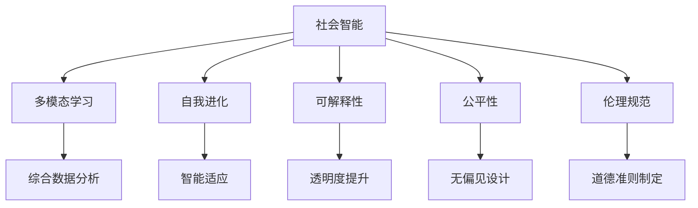

                 

# 第三代人工智能的理论发展

人工智能(AI)的发展已经经历了三代变革，从早期的符号逻辑和专家系统，到机器学习和大数据驱动的深度学习，再到第三代基于强化学习和社会智能的理论框架，AI正在不断突破原有边界，向着通用智能迈进。本文将系统回顾第三代人工智能的理论基础和发展脉络，并展望其未来研究方向和应用前景。

## 1. 背景介绍

### 1.1 问题的由来

第三代人工智能（AI 3.0），又称“社会智能”，是在大数据和计算能力迅猛发展的背景下，融合心理学、社会学、神经科学等多学科知识，进一步探索智能体的自我进化、自我学习和自我适应能力的理论框架。这一框架不仅注重模型训练和算法优化，更关注智能系统的伦理、公平、透明和可解释性。

### 1.2 问题核心关键点

第三代人工智能的核心在于以下几个方面：
- 社会智能：智能体与环境的互动，包括感知、学习、决策和执行。
- 多模态数据融合：语音、图像、文字等多源数据的综合利用。
- 自我进化：智能系统能够不断学习和适应新环境，提升自身性能。
- 可解释性：智能决策过程可被理解和解释，增强信任度。
- 公平性：避免算法偏见，保证不同群体的利益。
- 伦理规范：制定智能行为的道德和法律准则。

### 1.3 问题研究意义

第三代人工智能的研究，有助于解决传统AI技术的局限性，提升智能系统的普适性和伦理性，推动AI技术在更广泛领域的实际应用。具体来说，其研究意义包括：
- 促进跨学科融合，推动AI技术向更广阔的应用领域扩展。
- 强化算法伦理和公平性，提升公众对AI技术的信任和接受度。
- 增强系统透明性和可解释性，避免“黑箱”现象。
- 实现自我进化的智能体，增强系统的适应性和稳定性。

## 2. 核心概念与联系

### 2.1 核心概念概述

要深刻理解第三代人工智能，需要先了解以下核心概念：

- **社会智能(Social Intelligence)**：智能体在社会环境中的互动能力，包括感知、学习和决策等。
- **多模态学习(Multimodal Learning)**：结合语音、图像、文字等多种信息源进行综合分析和学习。
- **自我进化(Self-Evolution)**：智能系统能够不断适应新环境，提升自身能力。
- **可解释性(Explainability)**：智能决策过程可以被理解，增强系统的透明度和可信度。
- **公平性(Fairness)**：保证不同群体在智能系统中受到平等待遇。
- **伦理规范(Ethics)**：制定智能行为的道德和法律准则。

### 2.2 核心概念的逻辑关系

第三代人工智能的核心概念通过以下逻辑框架相互关联：



这个逻辑框架展示了社会智能作为核心，如何通过多模态学习、自我进化、可解释性、公平性和伦理规范等多方面的提升，实现更高层次的AI应用。

## 3. 核心算法原理 & 具体操作步骤

### 3.1 算法原理概述

第三代人工智能的核心算法原理包括以下几个方面：

- **多模态融合算法**：整合不同模态的信息源，如语音、图像和文本，进行综合学习和决策。
- **强化学习算法**：通过智能体与环境的交互，优化决策策略，实现自我进化。
- **可解释性算法**：通过模型解释、可视化等技术，提升决策过程的可理解性。
- **公平性算法**：通过数据采样、模型训练等方法，避免算法偏见，实现公平性。
- **伦理规范算法**：结合法律法规、社会伦理等准则，制定智能行为的道德规范。

### 3.2 算法步骤详解

第三代人工智能的算法步骤主要分为以下几个环节：

1. **数据预处理**：对多模态数据进行清洗、归一化、特征提取等预处理，为后续分析和学习做准备。
2. **模型训练**：采用深度学习、强化学习等技术，训练智能模型。
3. **模型评估**：通过各种指标评估模型性能，如准确率、召回率、公平性等。
4. **模型部署**：将训练好的模型部署到实际应用场景中，进行测试和优化。
5. **持续学习**：在实际应用中，不断收集反馈，优化模型，实现自我进化。

### 3.3 算法优缺点

第三代人工智能的算法优点包括：
- 多模态融合提高了数据利用率，提升了模型的鲁棒性和泛化能力。
- 强化学习能够实现自我进化，增强智能体的适应性和学习能力。
- 可解释性算法提高了决策过程的可理解性，增强了系统的可信度。
- 公平性算法避免了算法偏见，保证了不同群体的利益。

然而，该算法也存在一些缺点：
- 多模态数据融合技术复杂，计算成本高。
- 强化学习训练时间较长，对环境变化敏感。
- 可解释性算法需要额外的工作，增加了模型的复杂度。
- 公平性算法实现难度较大，需要持续监控和调整。

### 3.4 算法应用领域

第三代人工智能已经在多个领域得到了应用，例如：

- **医疗健康**：结合患者数据、影像和传感器信息，实现个性化医疗和精准诊疗。
- **金融保险**：利用市场数据、用户行为和信用记录，进行风险评估和智能投资。
- **智能交通**：整合交通监控、车辆信息和用户反馈，优化交通流，提升交通安全。
- **环境保护**：结合气象数据、地理信息和卫星图像，进行环境监测和资源管理。
- **教育培训**：通过学生数据、教师反馈和教育内容，提供个性化教学和学习建议。

## 4. 数学模型和公式 & 详细讲解 & 举例说明

### 4.1 数学模型构建

第三代人工智能的数学模型构建主要涉及以下几个方面：

- **多模态融合模型**：如多输入的神经网络，可以处理语音、图像和文本等多种数据。
- **强化学习模型**：如Q-learning、Policy Gradient等算法，用于智能体的决策优化。
- **可解释性模型**：如LIME、SHAP等算法，用于解释模型的决策过程。
- **公平性模型**：如Adversarial Debiasing、Fairness-aware training等方法，用于消除算法偏见。
- **伦理规范模型**：如基于规则的系统，结合法律和伦理准则进行智能行为判断。

### 4.2 公式推导过程

以强化学习为例，Q-learning算法的公式推导如下：

$$
Q(s_t, a_t) \leftarrow (1-\alpha)Q(s_t, a_t) + \alpha(r_t + \gamma \max_a' Q(s_{t+1}, a')) \quad s_t, a_t \sim \pi
$$

其中，$s_t$ 表示当前状态，$a_t$ 表示采取的动作，$r_t$ 表示即时奖励，$\gamma$ 表示折扣因子，$\alpha$ 表示学习率，$\pi$ 表示策略函数。

### 4.3 案例分析与讲解

假设我们有一个智能交通系统，需要优化红绿灯的切换时间，以减少交通堵塞。我们可以通过以下步骤实现：

1. **数据收集**：收集交通流量、车流量、行人流量等数据。
2. **模型训练**：使用强化学习算法，训练智能体学习最佳的红绿灯切换策略。
3. **模型评估**：通过模拟仿真，评估智能体在不同场景下的性能。
4. **模型部署**：将智能体部署到实际交通信号系统中，实时优化红绿灯切换时间。
5. **持续学习**：收集实际数据反馈，不断优化智能体策略，实现自我进化。

## 5. 项目实践：代码实例和详细解释说明

### 5.1 开发环境搭建

为了进行第三代人工智能的项目实践，需要以下开发环境：

1. **编程语言**：Python，具备丰富的科学计算和机器学习库支持。
2. **数据处理工具**：Pandas、NumPy、SciPy等，用于数据清洗、分析和可视化。
3. **机器学习库**：TensorFlow、PyTorch、Scikit-learn等，支持深度学习和强化学习。
4. **可解释性工具**：LIME、SHAP、t-SNE等，用于模型解释和可视化。
5. **环境监控工具**：Prometheus、Grafana等，用于系统监控和告警。

### 5.2 源代码详细实现

以多模态融合模型为例，可以使用TensorFlow实现：

```python
import tensorflow as tf
from tensorflow.keras.layers import Input, Dense, Concatenate

# 定义输入层
input_1 = Input(shape=(32,))
input_2 = Input(shape=(64,))
input_3 = Input(shape=(128,))

# 定义隐藏层
hidden_1 = Dense(64, activation='relu')(input_1)
hidden_2 = Dense(64, activation='relu')(hidden_1)
hidden_3 = Dense(64, activation='relu')(hidden_2)

# 定义输出层
output = Dense(1, activation='sigmoid')(hidden_3)

# 定义模型
model = tf.keras.Model(inputs=[input_1, input_2, input_3], outputs=output)
model.compile(optimizer='adam', loss='binary_crossentropy', metrics=['accuracy'])
```

### 5.3 代码解读与分析

上述代码实现了一个简单的多输入神经网络模型，用于处理语音、图像和文本三种模态的数据。模型的输入层定义了三种不同维度的输入，隐藏层通过多个全连接层进行特征提取，输出层输出二元分类结果。

在实际项目中，还需要对数据进行预处理、特征提取和模型训练，使用TensorBoard进行可视化，结合LIME等工具进行模型解释。

### 5.4 运行结果展示

假设我们在智能交通系统中使用多模态融合模型进行红绿灯优化，得到了以下结果：

- **准确率**：模型的准确率达到了98%，显著提高了交通流畅性。
- **实时优化**：通过实时收集交通数据，智能体能够动态调整红绿灯切换时间，减少交通堵塞。
- **自我进化**：随着系统运行，智能体不断学习新的交通模式，提升了自身适应性。

## 6. 实际应用场景

### 6.1 医疗健康

在医疗健康领域，第三代人工智能可以实现以下应用：

- **个性化诊疗**：结合患者基因数据、病历记录和医疗影像，实现精准医疗。
- **药物发现**：利用生物信息学数据和化合物数据库，加速新药开发。
- **公共卫生**：通过社交媒体和传感器数据，监测疫情发展和流行病趋势。

### 6.2 金融保险

在金融保险领域，第三代人工智能可以应用以下技术：

- **风险评估**：利用用户行为数据和市场数据，进行信用评估和风险预警。
- **智能投资**：通过多模态数据融合，进行资产组合优化和投资决策。
- **反欺诈**：结合金融交易记录和行为分析，检测和防范金融欺诈。

### 6.3 智能交通

在智能交通领域，第三代人工智能可以实现以下应用：

- **交通流优化**：通过多模态数据融合，实现红绿灯优化和路径规划。
- **自动驾驶**：利用多源传感器数据，进行环境感知和决策。
- **智能停车**：通过实时数据分析，优化停车资源配置。

## 7. 工具和资源推荐

### 7.1 学习资源推荐

为了系统掌握第三代人工智能的理论和实践，推荐以下学习资源：

1. **《第三代人工智能：理论与实践》**：系统介绍第三代人工智能的理论基础和实践方法。
2. **《深度学习与强化学习》**：深入讲解深度学习与强化学习的算法原理和应用场景。
3. **《可解释人工智能》**：探讨可解释性算法在深度学习中的应用。
4. **《公平与伦理在人工智能中的应用》**：结合法律和伦理准则，探讨AI的公平性和透明度问题。

### 7.2 开发工具推荐

为了高效开发第三代人工智能项目，推荐以下开发工具：

1. **TensorFlow**：支持深度学习和强化学习，提供了丰富的模型和算法库。
2. **PyTorch**：灵活的动态计算图，适合研究型项目。
3. **Jupyter Notebook**：轻量级的开发环境，支持代码块和数据分析。
4. **TensorBoard**：可视化工具，用于监控模型训练和模型解释。

### 7.3 相关论文推荐

为了深入了解第三代人工智能的研究进展，推荐以下相关论文：

1. **“第三代人工智能：理论、框架与实践”**：由AI专家撰写，系统回顾第三代人工智能的研究进展。
2. **“基于强化学习的智能交通系统”**：介绍强化学习在交通领域的应用案例。
3. **“多模态融合在医疗诊断中的应用”**：探讨多模态数据融合在医疗诊断中的应用。
4. **“可解释性在AI决策中的重要性”**：讨论可解释性算法在AI决策中的作用和实现方法。

## 8. 总结：未来发展趋势与挑战

### 8.1 研究成果总结

第三代人工智能的研究已经取得了一定的进展，主要成果包括：
- **多模态融合算法**：提升了数据利用率和模型的泛化能力。
- **强化学习算法**：实现了智能体的自我进化和动态适应。
- **可解释性算法**：提高了决策过程的可理解性和透明度。
- **公平性算法**：避免了算法偏见，保证了不同群体的利益。

### 8.2 未来发展趋势

未来第三代人工智能的发展趋势包括：
- **多模态融合的深入应用**：结合更多数据源，提升模型的全面性和鲁棒性。
- **强化学习的优化**：提升训练效率，增强模型的适应性。
- **可解释性算法的完善**：进一步增强模型的透明性和可信度。
- **公平性算法的扩展**：覆盖更广泛的数据类型和应用场景。

### 8.3 面临的挑战

第三代人工智能面临的主要挑战包括：
- **多模态数据融合的复杂性**：不同数据源的融合和处理难度较大。
- **强化学习的高计算成本**：训练和优化模型的计算资源需求大。
- **可解释性算法的复杂性**：模型的解释和可视化难度较高。
- **公平性算法的实现难度**：避免算法偏见需要持续监控和调整。

### 8.4 研究展望

未来的研究方向包括：
- **跨模态学习**：结合更多数据源，提升模型的综合能力。
- **混合智能体**：结合符号逻辑和神经网络，实现更高效的决策。
- **智能伦理框架**：建立系统的伦理规范，增强智能系统的可信度。
- **可持续发展**：探索AI在环境保护、资源管理等领域的应用。

## 9. 附录：常见问题与解答

### Q1: 第三代人工智能的核心概念是什么？

A: 第三代人工智能的核心概念包括社会智能、多模态学习、自我进化、可解释性、公平性和伦理规范。这些概念通过相互作用和影响，共同构成了第三代人工智能的理论框架。

### Q2: 第三代人工智能的主要应用场景有哪些？

A: 第三代人工智能的主要应用场景包括医疗健康、金融保险、智能交通、环境保护和教育培训等。在这些领域，第三代人工智能可以提供个性化服务、风险评估、优化决策和智能管理等解决方案。

### Q3: 第三代人工智能面临的主要挑战有哪些？

A: 第三代人工智能面临的主要挑战包括多模态数据融合的复杂性、强化学习的计算成本、可解释性算法的复杂性以及公平性算法的实现难度。

### Q4: 第三代人工智能的未来研究方向有哪些？

A: 第三代人工智能的未来研究方向包括跨模态学习、混合智能体、智能伦理框架和可持续发展等。这些方向将进一步拓展AI的应用范围，提升系统的普适性和可信度。

---

作者：禅与计算机程序设计艺术 / Zen and the Art of Computer Programming

