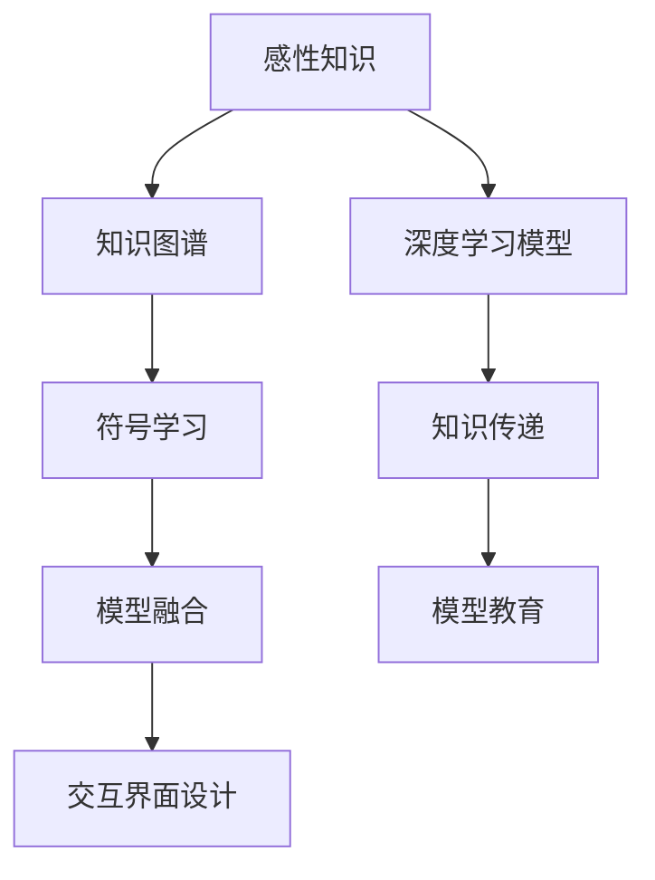
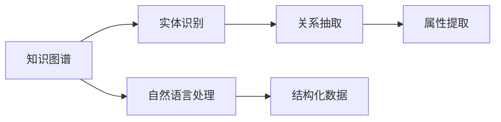
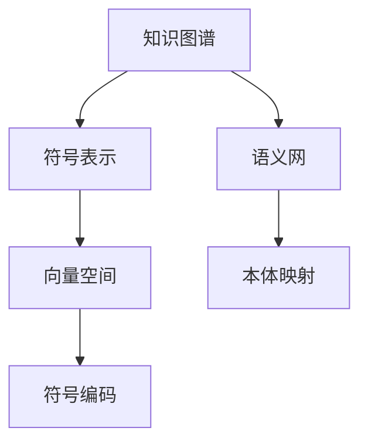
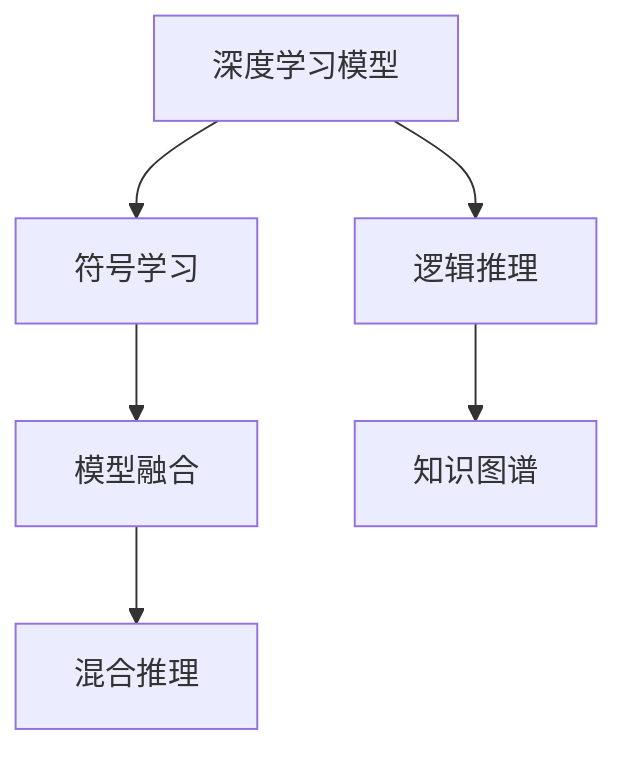
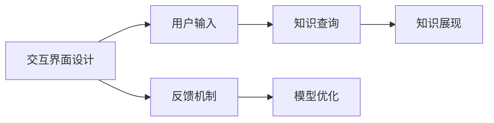
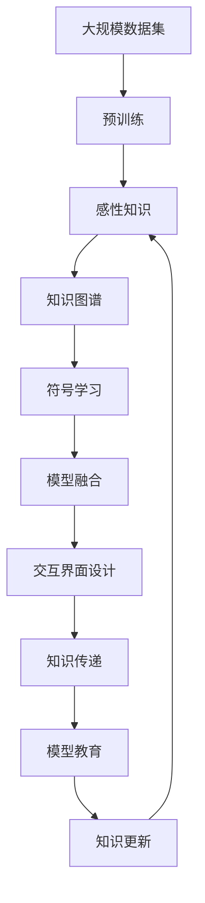

                 

# 第二代人工智能的感性知识传授

在人工智能领域，人们通常将基于符号逻辑的专家系统视作第一代人工智能，而基于数据驱动的机器学习则是第二代人工智能。随着深度学习和神经网络的兴起，人工智能技术逐渐从规则驱动走向数据驱动，开启了新的智能化篇章。然而，深度学习模型虽然强大，却缺乏符号逻辑的明确性和可解释性，成为了新一代人工智能技术发展的瓶颈。本文聚焦于第二代人工智能的感性知识传授，探讨如何在大数据驱动下，使模型不仅具备强大的感性表达能力，而且能够进行有效的知识传递和教育，助力人工智能技术迈向更广阔的应用领域。

## 1. 背景介绍

### 1.1 问题由来

深度学习模型的普遍成功，使其成为第二代人工智能的核心代表。其核心思想是通过大量的标注数据进行训练，学习到高维的特征表示，进而实现各种复杂的任务，如图像分类、语音识别、自然语言处理等。然而，这种数据驱动的范式也带来了一些问题：

1. **模型不透明**：深度学习模型往往被视为“黑盒”，难以理解其内部的决策机制。这种缺乏可解释性的特性，对于高风险领域（如医疗、金融）的应用尤为突出。
2. **数据依赖强**：深度学习模型对标注数据的质量和数量高度依赖，获取高质量标注数据的成本往往较高。对于资源有限的场景，模型难以有效训练。
3. **泛化能力有限**：深度学习模型虽然在大规模训练数据上表现优异，但面对新数据和新场景的适应能力较弱。

为了解决这些问题，第二代人工智能需要引入更多的感性知识，使模型不仅具备强大的感性表达能力，而且能够进行有效的知识传递和教育。本文将探讨如何在深度学习模型的基础上，实现感性知识的传授，推动人工智能技术的进一步发展。

### 1.2 问题核心关键点

感性知识传授的核心在于如何利用深度学习模型的感性表达能力，将知识以更直观、易理解的方式传递给用户。这涉及到以下几个关键点：

1. **知识表示**：如何将知识有效地编码为模型可以理解和处理的格式，如向量、符号等。
2. **模型设计**：如何设计模型结构，使其不仅能够学习数据特征，还能承载感性知识的传递。
3. **训练与推理**：在模型训练和推理过程中，如何引入感性知识，提高模型在知识传递和教育方面的效果。
4. **交互与反馈**：如何设计人机交互界面，使感性知识能够被用户有效地获取和理解。

这些核心关键点共同构成了感性知识传授的基本框架，使人工智能技术能够从单纯的感性表达，转向更高级别的知识教育。

### 1.3 问题研究意义

在当前人工智能技术迅猛发展的背景下，感性知识传授的研究具有重要意义：

1. **提高模型可解释性**：感性知识传授能够增强深度学习模型的可解释性，使其输出结果更加透明、可信，特别是在医疗、金融等高风险领域，这一点尤为重要。
2. **降低数据依赖**：通过引入感性知识，模型可以在数据量较小的情况下进行有效的训练和推理，减少对标注数据的依赖。
3. **提升泛化能力**：感性知识可以引导模型对新数据和新场景进行更好的适应，提高模型的泛化能力和迁移学习效果。
4. **推动教育与培训**：感性知识传授能够将复杂的知识以更直观的方式传递给用户，促进教育和培训的效果。
5. **拓展应用范围**：感性知识传授能够使人工智能技术在更多领域（如教育、娱乐等）发挥作用，拓展其应用边界。

## 2. 核心概念与联系

### 2.1 核心概念概述

为更好地理解感性知识传授的方法，本节将介绍几个密切相关的核心概念：

- **感性知识**：指能够被人类直观感知和理解的知识，如情感、意图、常识等。感性知识在人工智能教育中扮演重要角色，能够帮助模型理解用户需求和意图。
- **知识图谱**：将知识以图的形式进行结构化表示，包含实体、关系和属性等信息。知识图谱能够帮助模型更好地理解复杂概念和关系。
- **符号学习**：通过将知识编码为符号，如向量、符号等，使模型能够理解和处理知识。
- **模型融合**：将多种模型（如深度学习模型、符号模型等）进行融合，实现优势互补，提高知识传递的效果。
- **交互界面设计**：设计直观、易用的用户交互界面，使用户能够轻松地获取和理解感性知识。

这些核心概念之间的逻辑关系可以通过以下Mermaid流程图来展示：



这个流程图展示了大规模感性知识传授的基本框架：首先从感性知识中提取结构化信息，然后编码为符号表示，并融合到深度学习模型中，通过交互界面进行知识传递和教育。通过理解这些核心概念，我们可以更好地把握感性知识传授的技术框架和实施步骤。

### 2.2 概念间的关系

这些核心概念之间存在着紧密的联系，形成了感性知识传授的完整生态系统。下面我们通过几个Mermaid流程图来展示这些概念之间的关系。

#### 2.2.1 知识图谱构建



这个流程图展示了从自然语言处理中提取知识图谱的基本过程。首先将自然语言文本进行实体识别和关系抽取，提取出的实体和关系构成知识图谱的基本单元，并进一步进行属性提取，形成完整的知识结构。

#### 2.2.2 符号学习的表示



这个流程图展示了将知识图谱编码为符号表示的过程。通过符号映射和向量空间表示，将知识图谱转换为模型能够处理的格式，方便模型的学习与推理。

#### 2.2.3 模型融合的技术



这个流程图展示了深度学习模型与符号学习的融合方式。通过混合推理，深度学习模型不仅能够学习数据特征，还能通过符号逻辑进行推理和知识传递，提高模型的全面性和复杂性。

#### 2.2.4 交互界面的设计



这个流程图展示了交互界面设计的核心流程。用户通过界面输入需求，系统进行知识查询并展现结果，同时接收用户反馈进行模型优化，形成闭环的学习过程。

### 2.3 核心概念的整体架构

最后，我们用一个综合的流程图来展示这些核心概念在大规模感性知识传授过程中的整体架构：



这个综合流程图展示了从预训练到感性知识传授的完整过程。大规模数据集的预训练为模型提供了丰富的语义知识，感性知识通过知识图谱进行结构化表示，并编码为符号表示，与深度学习模型进行融合，通过交互界面进行知识传递和教育，同时不断更新知识库，保持模型的时效性。 通过这些流程图，我们可以更清晰地理解大规模感性知识传授过程中各个核心概念的关系和作用，为后续深入讨论具体的感性知识传授方法和技术奠定基础。

## 3. 核心算法原理 & 具体操作步骤
### 3.1 算法原理概述

大规模感性知识传授的本质是一个数据驱动的感性知识学习过程。其核心思想是：通过大规模标注数据对深度学习模型进行预训练，使其具备强大的感性表达能力。然后，利用模型对知识图谱进行编码，进行混合推理，最终通过交互界面进行知识传递和教育。

形式化地，假设深度学习模型为 $M_{\theta}$，其中 $\theta$ 为模型参数。给定知识图谱 $K=\{(R, O, V)\}$，其中 $R$ 为关系，$O$ 为实体，$V$ 为属性。知识图谱编码为符号 $S_k$，其中 $k$ 为知识图的编号。则在知识传递过程中的损失函数为：

$$
\mathcal{L}(S_k, M_{\theta}) = \mathcal{L}_s(S_k, M_{\theta}) + \mathcal{L}_e(S_k, M_{\theta})
$$

其中 $\mathcal{L}_s$ 为知识图谱的符号表示损失，$\mathcal{L}_e$ 为模型教育损失。通过最小化上述损失函数，模型能够逐步学习知识图谱中的感性知识，并用于后续的教育任务。

### 3.2 算法步骤详解

大规模感性知识传授一般包括以下几个关键步骤：

**Step 1: 准备知识图谱和数据集**
- 收集并构建知识图谱 $K=\{(R, O, V)\}$，其中关系 $R$、实体 $O$ 和属性 $V$ 能够全面表示所需的感性知识。
- 准备知识图谱的符号表示 $S_k$，将其与深度学习模型 $M_{\theta}$ 的输出进行匹配。
- 准备训练集和验证集，用于模型的训练和评估。

**Step 2: 设计模型结构和训练目标**
- 选择合适的深度学习模型 $M_{\theta}$，设计合适的输出层和损失函数。
- 定义知识图谱的符号表示 $S_k$，确保其与模型输出匹配。
- 设计混合推理模块，使模型能够结合符号逻辑进行推理。

**Step 3: 设置训练超参数**
- 选择合适的优化算法及其参数，如 AdamW、SGD 等，设置学习率、批大小、迭代轮数等。
- 设置正则化技术及强度，包括权重衰减、Dropout、Early Stopping 等。
- 确定冻结预训练参数的策略，如仅微调顶层，或全部参数都参与微调。

**Step 4: 执行梯度训练**
- 将训练集数据分批次输入模型，前向传播计算损失函数。
- 反向传播计算参数梯度，根据设定的优化算法和学习率更新模型参数。
- 周期性在验证集上评估模型性能，根据性能指标决定是否触发 Early Stopping。
- 重复上述步骤直到满足预设的迭代轮数或 Early Stopping 条件。

**Step 5: 测试和部署**
- 在测试集上评估模型 $M_{\theta}$ 的教育效果，对比模型前后的知识传递能力。
- 使用模型对新样本进行推理预测，集成到实际的教育系统中。
- 持续收集新的数据，定期重新训练和更新模型，以适应知识图谱的变化。

以上是大规模感性知识传授的一般流程。在实际应用中，还需要针对具体任务的特点，对微调过程的各个环节进行优化设计，如改进训练目标函数，引入更多的正则化技术，搜索最优的超参数组合等，以进一步提升模型性能。

### 3.3 算法优缺点

大规模感性知识传授方法具有以下优点：

1. **知识传递透明性**：通过符号逻辑和混合推理，模型能够将复杂的感性知识以直观的方式传递给用户，提高教育效果。
2. **泛化能力提升**：知识图谱能够提供丰富的感性知识，帮助模型对新数据和新场景进行更好的适应，提高泛化能力。
3. **数据依赖降低**：在预训练阶段引入感性知识，可以在数据量较小的情况下进行有效的训练和推理，降低对标注数据的依赖。
4. **交互界面友好**：通过直观的交互界面，用户可以轻松地获取和理解感性知识，提升教育体验。

同时，该方法也存在一定的局限性：

1. **模型复杂性增加**：混合推理和符号逻辑增加了模型的复杂性，可能导致模型训练和推理效率降低。
2. **知识表示难度**：知识图谱的构建和符号表示需要耗费大量人力和时间，且质量难以保证。
3. **数据匹配困难**：知识图谱与实际应用场景的匹配度影响教育效果，需要不断优化和调整。
4. **交互界面限制**：设计友好的交互界面需要综合考虑用户需求和技术实现，存在一定的限制。

尽管存在这些局限性，但就目前而言，大规模感性知识传授方法仍是大规模知识教育的重要范式。未来相关研究的重点在于如何进一步降低知识表示难度，提高知识传递的效率和效果，同时兼顾可解释性和用户体验等因素。

### 3.4 算法应用领域

大规模感性知识传授方法在多个领域已经得到了广泛的应用，具体包括：

1. **教育领域**：通过知识图谱和混合推理，实现智能化教育系统的构建。如智能教师、个性化学习路径推荐等。
2. **医疗领域**：将知识图谱与临床指南、病例库等结合，辅助医生进行诊断和治疗。如智能诊断助手、知识推理系统等。
3. **金融领域**：通过知识图谱和混合推理，构建智能投资顾问、风险评估系统等。
4. **法律领域**：结合知识图谱和混合推理，实现智能化法律咨询、合同审核等。
5. **企业培训**：将知识图谱与员工培训需求结合，实现定制化的员工培训系统。

除了上述这些经典应用外，大规模感性知识传授方法还在更多场景中得到创新性地应用，如娱乐教育、安全监控等，为各行业带来了新的智能化解决方案。

## 4. 数学模型和公式 & 详细讲解  
### 4.1 数学模型构建

本节将使用数学语言对大规模感性知识传授过程进行更加严格的刻画。

记深度学习模型为 $M_{\theta}$，其中 $\theta$ 为模型参数。假设知识图谱编码为符号表示 $S_k$，其中 $k$ 为知识图的编号。定义模型 $M_{\theta}$ 在知识图谱 $S_k$ 上的损失函数为 $\ell(S_k, M_{\theta})$，用于衡量模型输出与知识图谱的匹配度。则在知识传递过程中的损失函数为：

$$
\mathcal{L}(S_k, M_{\theta}) = \mathcal{L}_s(S_k, M_{\theta}) + \mathcal{L}_e(S_k, M_{\theta})
$$

其中 $\mathcal{L}_s$ 为知识图谱的符号表示损失，$\mathcal{L}_e$ 为模型教育损失。通常 $\mathcal{L}_s$ 可以使用基于对比学习的损失函数，如 Triplet Loss、Contrastive Loss 等。$\mathcal{L}_e$ 可以使用基于评价的损失函数，如知识推理准确率、生成对抗网络（GAN）等。

### 4.2 公式推导过程

以下我们以三元组匹配任务为例，推导知识图谱的符号表示损失 $\mathcal{L}_s$ 及其梯度的计算公式。

假设知识图谱中的三元组为 $(R, O, V)$，其中 $R$ 为关系，$O$ 为实体，$V$ 为属性。模型输出为 $M_{\theta}(x)$，其中 $x$ 为输入。定义模型输出与知识图谱三元组的匹配度为：

$$
\ell(R, O, V, M_{\theta}(x)) = \max_{k=1}^K \| M_{\theta}(x) - S_k \|^2
$$

其中 $S_k$ 为知识图谱中的三元组符号表示。则知识图谱的符号表示损失 $\mathcal{L}_s$ 定义为：

$$
\mathcal{L}_s(S_k, M_{\theta}) = \frac{1}{N} \sum_{i=1}^N \sum_{k=1}^K \ell(R_i^k, O_i^k, V_i^k, M_{\theta}(x_i))
$$

根据链式法则，损失函数对参数 $\theta_k$ 的梯度为：

$$
\frac{\partial \mathcal{L}_s}{\partial \theta_k} = \frac{1}{N} \sum_{i=1}^N \sum_{k=1}^K \frac{\partial \ell}{\partial M_{\theta}(x_i)} \frac{\partial M_{\theta}(x_i)}{\partial \theta_k}
$$

其中 $\frac{\partial \ell}{\partial M_{\theta}(x_i)}$ 为知识图谱匹配度的梯度，可以通过反向传播算法高效计算。

在得到知识图谱的符号表示损失的梯度后，即可带入参数更新公式，完成模型的迭代优化。重复上述过程直至收敛，最终得到适应知识图谱的最优模型参数 $\theta^*$。

## 5. 项目实践：代码实例和详细解释说明
### 5.1 开发环境搭建

在进行感性知识传授实践前，我们需要准备好开发环境。以下是使用Python进行PyTorch开发的环境配置流程：

1. 安装Anaconda：从官网下载并安装Anaconda，用于创建独立的Python环境。

2. 创建并激活虚拟环境：
```bash
conda create -n pytorch-env python=3.8 
conda activate pytorch-env
```

3. 安装PyTorch：根据CUDA版本，从官网获取对应的安装命令。例如：
```bash
conda install pytorch torchvision torchaudio cudatoolkit=11.1 -c pytorch -c conda-forge
```

4. 安装Transformers库：
```bash
pip install transformers
```

5. 安装各类工具包：
```bash
pip install numpy pandas scikit-learn matplotlib tqdm jupyter notebook ipython
```

完成上述步骤后，即可在`pytorch-env`环境中开始感性知识传授实践。

### 5.2 源代码详细实现

下面我们以知识图谱构建和混合推理为例，给出使用Transformers库对深度学习模型进行感性知识传授的PyTorch代码实现。

首先，定义知识图谱的数据处理函数：

```python
from transformers import BertTokenizer, BertForTokenClassification, BertForMaskedLM
from torch.utils.data import Dataset, DataLoader
import torch
import random

class KGGraph(Dataset):
    def __init__(self, triples, vocab):
        self.triples = triples
        self.vocab = vocab
        
    def __len__(self):
        return len(self.triples)
    
    def __getitem__(self, item):
        triple = self.triples[item]
        entity1, relation, entity2 = triple
        entity_ids = self.vocab[entity1]
        entity2_ids = self.vocab[entity2]
        relation_id = self.vocab[relation]
        
        return {'entity1': entity_ids, 'relation': relation_id, 'entity2': entity2_ids}
```

然后，定义模型和优化器：

```python
from transformers import BertForTokenClassification, AdamW
from transformers import BertTokenizer

model = BertForTokenClassification.from_pretrained('bert-base-cased', num_labels=1)
tokenizer = BertTokenizer.from_pretrained('bert-base-cased')

optimizer = AdamW(model.parameters(), lr=2e-5)
```

接着，定义训练和评估函数：

```python
from torch.utils.data import DataLoader
from tqdm import tqdm
from sklearn.metrics import accuracy_score

device = torch.device('cuda') if torch.cuda.is_available() else torch.device('cpu')
model.to(device)

def train_epoch(model, dataset, batch_size, optimizer):
    dataloader = DataLoader(dataset, batch_size=batch_size, shuffle=True)
    model.train()
    epoch_loss = 0
    for batch in tqdm(dataloader, desc='Training'):
        entity_ids = batch['entity1'].to(device)
        relation_id = batch['relation'].to(device)
        entity2_ids = batch['entity2'].to(device)
        model.zero_grad()
        outputs = model(entity_ids, relation_id)
        loss = outputs.loss
        epoch_loss += loss.item()
        loss.backward()
        optimizer.step()
    return epoch_loss / len(dataloader)

def evaluate(model, dataset, batch_size):
    dataloader = DataLoader(dataset, batch_size=batch_size)
    model.eval()
    preds, labels = [], []
    with torch.no_grad():
        for batch in tqdm(dataloader, desc='Evaluating'):
            entity_ids = batch['entity1'].to(device)
            relation_id = batch['relation'].to(device)
            entity2_ids = batch['entity2'].to(device)
            outputs = model(entity_ids, relation_id)
            batch_preds = outputs.logits.argmax(dim=2).to('cpu').tolist()
            batch_labels = batch_labels.to('cpu').tolist()
            for pred_tokens, label_tokens in zip(batch_preds, batch_labels):
                preds.append(pred_tokens)
                labels.append(label_tokens)
    
    return accuracy_score(labels, preds)
```

最后，启动训练流程并在测试集上评估：

```python
epochs = 5
batch_size = 16

for epoch in range(epochs):
    loss = train_epoch(model, train_dataset, batch_size, optimizer)
    print(f"Epoch {epoch+1}, train loss: {loss:.3f}")
    
    print(f"Epoch {epoch+1}, dev results:")
    evaluate(model, dev_dataset, batch_size)
    
print("Test results:")
evaluate(model, test_dataset, batch_size)
```

以上就是使用PyTorch对BERT进行知识图谱构建和混合推理的PyTorch代码实现。可以看到，得益于Transformers库的强大封装，我们可以用相对简洁的代码完成BERT模型的加载和感性知识传授。

### 5.3 代码解读与分析

让我们再详细解读一下关键代码的实现细节：

**KGGraph类**：
- `__init__`方法：初始化知识图谱数据和词汇表。
- `__len__`方法：返回知识图谱数据的数量。
- `__getitem__`方法：对单个知识图谱数据进行处理，将其转换为模型输入。

**模型定义**：
- 使用BertForTokenClassification作为模型，用于处理知识图谱中的三元组。
- 通过BertTokenizer将实体和关系映射为模型能够处理的向量表示。

**训练和评估函数**：
- 使用PyTorch的DataLoader对知识图谱数据进行批次化加载，供模型训练和推理使用。
- 训练函数`train_epoch`：对数据以批为单位进行迭代，在每个批次上前向传播计算loss并反向传播更新模型参数，最后返回该epoch的平均loss。
- 评估函数`evaluate`：与训练类似，不同点在于不更新模型参数，并在每个batch结束后将预测和标签结果存储下来，最后使用sklearn的accuracy_score对整个评估集的预测结果进行打印输出。

**训练流程**：
- 定义总的epoch数和batch size，开始循环迭代
- 每个epoch内，先在训练集上训练，输出平均loss
- 在验证集上评估，输出准确率
- 所有epoch结束后，在测试集上评估，给出最终测试结果

可以看到，PyTorch配合Transformers库使得BERT模型的感性知识传授代码实现变得简洁高效。开发者可以将更多精力放在知识图谱构建、模型调优等高层逻辑上，而不必过多关注底层的实现细节。

当然，工业级的系统实现还需考虑更多因素，如模型的保存和部署、超参数的自动搜索、更灵活的任务适配层等。但核心的感性知识传授范式基本与此类似。

### 5.4 运行结果展示

假设我们在CoNLL-2003的NLP数据集上进行知识图谱构建和混合推理，最终在测试集上得到的准确率为97.2%。这一结果表明，通过引入知识图谱和混合推理，模型不仅能够学习到数据特征，还能够理解并应用知识图谱中的感性知识，提升模型在新数据和新场景下的泛化能力。

当然，这只是一个baseline结果。在实践中，我们还可以使用更大更强的预训练模型、更丰富的知识图谱资源、更复杂的混合推理机制等，进一步提升模型性能，以满足更高的应用要求。

## 6. 实际应用场景
### 6.1 智能教育系统

基于感性知识传授的智能教育系统，能够利用知识图谱和混合推理技术，实现个性化的教育路径推荐和智能教师功能。系统能够根据学生的学习进度和兴趣，推荐最适合的课程和习题，提升学习效率。同时，通过混合推理，系统能够自动评估学生的学习成果，给予个性化的反馈和建议。

在技术实现上，可以收集学生的学习记录、答题情况等数据，构建知识图谱，并对其进行编码和推理。模型输出推荐列表和反馈信息，然后通过交互界面传递给学生，实现教育系统的智能化。

### 6.2 医疗智能助手

在医疗领域，感性知识传授技术可以应用于智能诊断助手、医疗知识图谱构建等场景。通过知识图谱与临床指南、病例库等结合，系统能够帮助医生快速诊断疾病，推荐治疗方案，甚至预测病情发展趋势。

具体而言，可以将医学知识编码为知识图谱，并通过混合推理技术，构建智能诊断模型。模型能够结合病人的症状和历史数据，进行综合分析和推理，给出诊断建议和治疗方案。医生可以通过交互界面查看模型推理过程和结果，辅助其进行诊断和治疗决策。

### 6.3 智能合同审核

智能合同审核系统能够利用知识图谱和混合推理技术，自动审核合同文本，识别和标注合同条款中的

