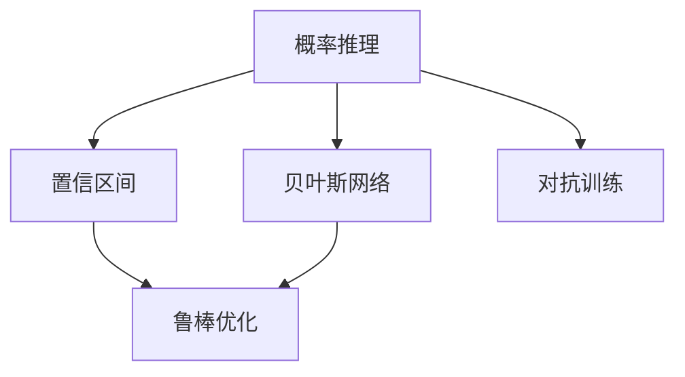
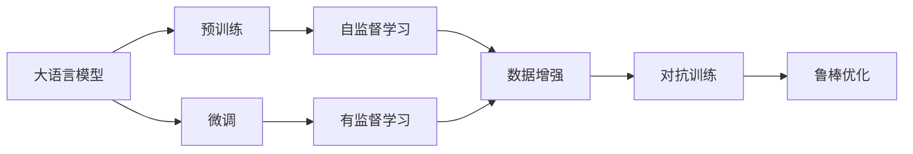
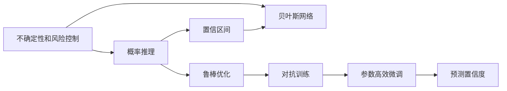
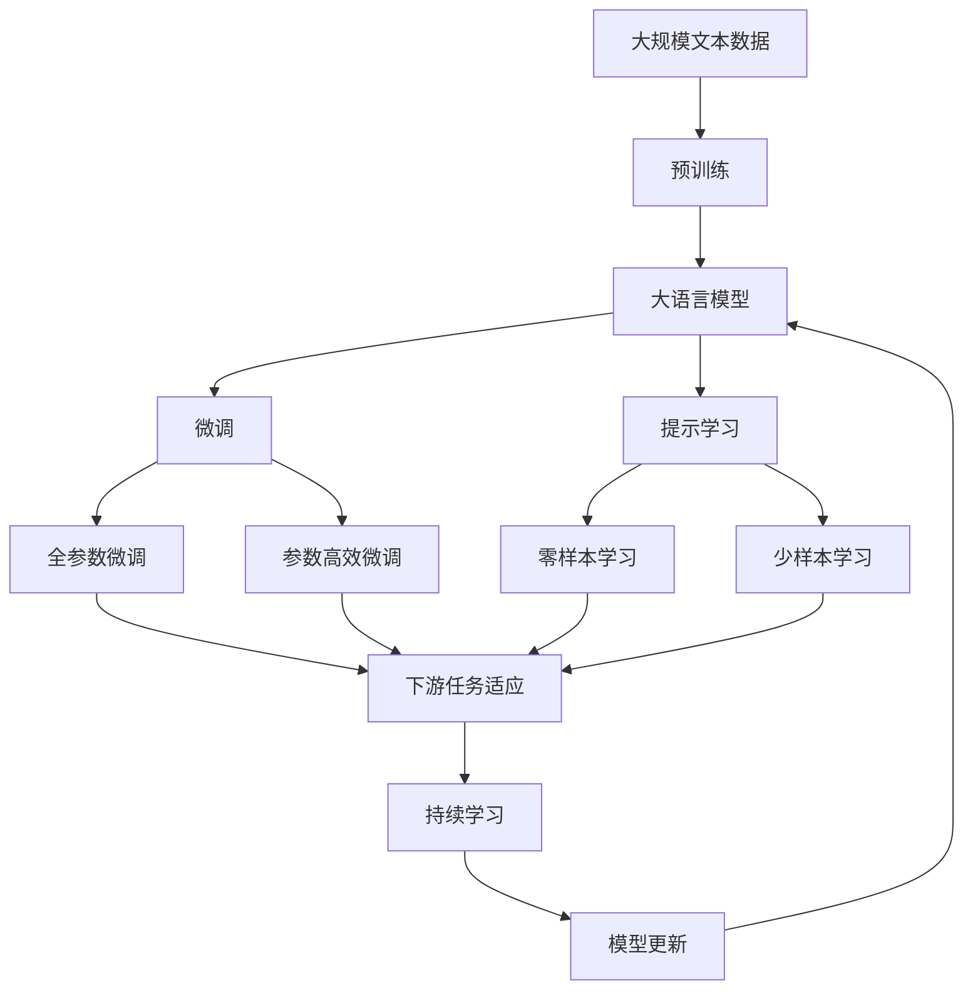

                 

# 管理AI不确定性：LLM应用中的风险控制

> 关键词：
> - 大语言模型 (Large Language Models, LLMs)
> - 不确定性管理
> - 风险控制
> - 概率推理
> - 置信区间
> - 贝叶斯网络
> - 鲁棒优化
> - 对抗训练

## 1. 背景介绍

### 1.1 问题由来

在人工智能(AI)领域，特别是大语言模型(Large Language Models, LLMs)的发展中，不确定性管理(管理AI不确定性)和风险控制(风险控制)已成为至关重要的议题。随着预训练模型和微调技术的进步，LLMs在自然语言处理(NLP)、对话系统、推荐系统、自动问答等众多领域展现出卓越的性能。然而，尽管模型性能在不断提升，其输出的不确定性和潜在风险同样不容忽视。

这些问题主要体现在：
1. **不确定性管理**：模型输出的置信度、可靠性和一致性；
2. **风险控制**：模型在特定情况下的鲁棒性和鲁棒性；
3. **概率推理**：模型在处理未知或模糊信息时的能力；
4. **置信区间**：模型输出结果的预测范围；
5. **贝叶斯网络**：利用先验知识进行决策和推理。

这些问题的出现，不仅限制了LLMs在实际应用中的潜力和效果，也增加了其部署和运维的复杂性。因此，本文将深入探讨大语言模型应用中的不确定性和风险控制问题，提出一系列解决方案，旨在提升模型的稳定性和可靠性。

### 1.2 问题核心关键点

为更好地理解LLM应用中的不确定性管理与风险控制，本节将介绍几个密切相关的核心关键点：

1. **不确定性管理**：通过概率推理、置信区间和贝叶斯网络等方法，对模型输出进行不确定性评估和控制。
2. **风险控制**：使用鲁棒优化和对抗训练等技术，增强模型对异常情况和干扰的抵抗能力。
3. **概率推理**：模型利用概率理论进行不确定性量化和处理。
4. **置信区间**：模型输出结果的可信度范围。
5. **贝叶斯网络**：利用先验知识和统计数据进行推理和决策。

这些关键点之间存在着紧密的联系，形成了大语言模型应用中的不确定性和风险控制框架。通过理解这些核心概念，我们可以更好地把握LLM应用的全面性和系统性。

## 2. 核心概念与联系

### 2.1 核心概念概述

本节将介绍几个与大语言模型应用中的不确定性和风险控制密切相关的核心概念，并详细说明它们之间的联系。

- **概率推理**：利用概率模型进行不确定性量化和处理，通过贝叶斯网络和隐马尔可夫模型等方法进行概率推理。
- **置信区间**：模型输出结果的可信度范围，通常通过置信区间和贝叶斯置信区间等概念进行定义和计算。
- **贝叶斯网络**：一种基于概率的图形模型，用于表示变量之间的依赖关系，并在已有先验知识的基础上进行推理。
- **鲁棒优化**：通过优化算法对模型参数进行调整，以提高模型对噪声和异常值的抵抗能力。
- **对抗训练**：通过在模型训练过程中加入对抗样本，提高模型对攻击和干扰的鲁棒性。

这些概念之间的逻辑关系可以通过以下Mermaid流程图来展示：



这个流程图展示了大语言模型应用中的不确定性和风险控制概念及其之间的关系：

1. 概率推理通过贝叶斯网络进行不确定性评估，并计算置信区间。
2. 鲁棒优化和对抗训练增强模型对异常和噪声的抵抗能力。
3. 对抗训练可以在概率推理的基础上，进一步提高模型对攻击的鲁棒性。

这些概念共同构成了大语言模型应用中的不确定性和风险控制框架，使其能够在各种场景下发挥强大的不确定性和风险管理能力。通过理解这些核心概念，我们可以更好地把握LLM应用的全面性和系统性。

### 2.2 概念间的关系

这些核心概念之间存在着紧密的联系，形成了大语言模型应用中的不确定性和风险控制生态系统。下面我们通过几个Mermaid流程图来展示这些概念之间的关系。

#### 2.2.1 大语言模型的学习范式



这个流程图展示了大语言模型的学习范式及其与不确定性和风险控制的关系：

1. 大语言模型通过自监督预训练学习语言知识，然后通过微调学习下游任务知识。
2. 数据增强和对抗训练增强模型的鲁棒性和鲁棒性。
3. 鲁棒优化进一步提升模型对异常和噪声的抵抗能力。

#### 2.2.2 不确定性和风险控制范式



这个流程图展示了大语言模型应用中的不确定性和风险控制范式：

1. 概率推理和贝叶斯网络用于不确定性评估和置信区间计算。
2. 鲁棒优化和对抗训练增强模型鲁棒性。
3. 参数高效微调在固定大部分预训练参数的情况下，仍可更新少量参数，提高微调效率。
4. 预测置信度用于评估模型输出的不确定性范围。

### 2.3 核心概念的整体架构

最后，我们用一个综合的流程图来展示这些核心概念在大语言模型应用中的整体架构：



这个综合流程图展示了从预训练到微调，再到不确定性和风险控制的完整过程。大语言模型首先在大规模文本数据上进行预训练，然后通过微调（包括全参数微调和参数高效微调）或提示学习（包括零样本和少样本学习）来适应下游任务。最后，通过持续学习技术，模型可以不断更新和适应新的任务和数据。同时，通过概率推理、置信区间、贝叶斯网络、鲁棒优化和对抗训练等方法，可以对模型的输出进行不确定性和风险控制，确保模型在复杂环境下依然具有较高的稳定性和可靠性。

## 3. 核心算法原理 & 具体操作步骤
### 3.1 算法原理概述

大语言模型应用中的不确定性和风险控制，本质上是通过对模型输出进行概率推理和鲁棒性增强，确保模型在面对未知和异常情况时的稳定性和可靠性。

形式化地，假设大语言模型为 $M_{\theta}$，其中 $\theta$ 为模型参数。给定下游任务 $T$ 的标注数据集 $D=\{(x_i,y_i)\}_{i=1}^N$，其中 $x_i$ 为输入，$y_i$ 为输出，即模型预测结果。

定义模型 $M_{\theta}$ 在数据样本 $(x,y)$ 上的置信度为 $P(Y=y|X=x)$，在数据集 $D$ 上的置信区间为 $\mathcal{C}=[\underline{c}, \overline{c}]$。其中，$P$ 为条件概率，$X$ 为输入数据，$Y$ 为输出，$\overline{c}$ 和 $\underline{c}$ 分别为置信区间的上界和下界。

微调的目标是找到新的模型参数 $\hat{\theta}$，使得在保证模型在训练集上性能的同时，通过概率推理和置信区间计算，得到在测试集上的不确定性和鲁棒性。

### 3.2 算法步骤详解

基于大语言模型应用中的不确定性和风险控制，一般包括以下几个关键步骤：

**Step 1: 准备预训练模型和数据集**
- 选择合适的预训练语言模型 $M_{\theta}$ 作为初始化参数，如 BERT、GPT 等。
- 准备下游任务 $T$ 的标注数据集 $D$，划分为训练集、验证集和测试集。一般要求标注数据与预训练数据的分布不要差异过大。

**Step 2: 设计概率推理模型**
- 选择适当的概率模型（如朴素贝叶斯、高斯混合模型、神经网络等），对模型输出进行概率推理。
- 训练模型，并计算模型输出结果的置信度 $P(Y=y|X=x)$。

**Step 3: 计算置信区间**
- 根据置信度 $P(Y=y|X=x)$，计算模型输出结果的置信区间 $\mathcal{C}=[\underline{c}, \overline{c}]$。
- 常用的置信区间计算方法包括 Z-test、t-test、置信区间方法等。

**Step 4: 设计鲁棒优化算法**
- 选择合适的优化算法（如Adam、SGD等），设置学习率、批大小、迭代轮数等。
- 应用鲁棒优化技术，如L2正则、Dropout、Early Stopping等，防止模型过度适应小规模训练集。
- 确定冻结预训练参数的策略，如仅微调顶层，或全部参数都参与微调。

**Step 5: 执行梯度训练**
- 将训练集数据分批次输入模型，前向传播计算损失函数。
- 反向传播计算参数梯度，根据设定的优化算法和学习率更新模型参数。
- 周期性在验证集上评估模型性能，根据性能指标决定是否触发 Early Stopping。
- 重复上述步骤直到满足预设的迭代轮数或 Early Stopping 条件。

**Step 6: 测试和部署**
- 在测试集上评估微调后模型 $M_{\hat{\theta}}$ 的性能，对比微调前后的精度提升。
- 使用微调后的模型对新样本进行推理预测，集成到实际的应用系统中。
- 持续收集新的数据，定期重新微调模型，以适应数据分布的变化。

以上是基于大语言模型应用中的不确定性和风险控制的一般流程。在实际应用中，还需要针对具体任务的特点，对不确定性和风险控制过程的各个环节进行优化设计，如改进训练目标函数，引入更多的鲁棒化技术，搜索最优的超参数组合等，以进一步提升模型性能。

### 3.3 算法优缺点

大语言模型应用中的不确定性和风险控制方法具有以下优点：
1. 有效管理不确定性：通过概率推理和置信区间计算，可以有效评估和控制模型输出结果的不确定性。
2. 增强模型鲁棒性：鲁棒优化和对抗训练技术可以提高模型对异常和噪声的抵抗能力，提升模型鲁棒性。
3. 多维度风险控制：考虑模型输出结果的置信度和置信区间，多维度地进行风险控制，确保模型稳定性和可靠性。

同时，该方法也存在一定的局限性：
1. 计算成本较高：概率推理和鲁棒优化增加了额外的计算成本。
2. 数据需求较大：置信区间和鲁棒优化需要大量标注数据，获取高质量标注数据的成本较高。
3. 模型复杂性增加：通过概率推理和置信区间计算，模型复杂性有所增加，可能导致训练时间延长。

尽管存在这些局限性，但就目前而言，基于大语言模型应用中的不确定性和风险控制方法仍是大规模语言模型应用的主流范式。未来相关研究的重点在于如何进一步降低计算成本，提高鲁棒性，同时兼顾可解释性和伦理安全性等因素。

### 3.4 算法应用领域

大语言模型应用中的不确定性和风险控制方法已经广泛应用于各种NLP任务，例如：

- 文本分类：如情感分析、主题分类、意图识别等。通过概率推理和置信区间计算，评估模型输出的可信度。
- 命名实体识别：识别文本中的人名、地名、机构名等特定实体。利用置信区间和鲁棒优化，提高模型对未知实体的识别能力。
- 关系抽取：从文本中抽取实体之间的语义关系。通过概率推理和鲁棒优化，增强模型对复杂关系的处理能力。
- 问答系统：对自然语言问题给出答案。通过置信区间计算，评估模型输出的置信度，以指导后续处理。
- 机器翻译：将源语言文本翻译成目标语言。通过鲁棒优化和对抗训练，提高翻译结果的鲁棒性。
- 文本摘要：将长文本压缩成简短摘要。通过概率推理和置信区间计算，控制摘要生成的稳定性和可靠性。
- 对话系统：使机器能够与人自然对话。通过置信区间和鲁棒优化，提高对话系统的稳定性和可靠性。

除了上述这些经典任务外，大语言模型应用中的不确定性和风险控制方法也被创新性地应用到更多场景中，如可控文本生成、常识推理、代码生成、数据增强等，为NLP技术带来了全新的突破。随着大语言模型和风险控制方法的不断进步，相信NLP技术将在更广阔的应用领域大放异彩。

## 4. 数学模型和公式 & 详细讲解 & 举例说明

### 4.1 数学模型构建

本节将使用数学语言对大语言模型应用中的不确定性和风险控制过程进行更加严格的刻画。

记大语言模型为 $M_{\theta}$，其中 $\theta$ 为模型参数。假设微调任务的训练集为 $D=\{(x_i,y_i)\}_{i=1}^N$，其中 $x_i$ 为输入，$y_i$ 为输出，即模型预测结果。

定义模型 $M_{\theta}$ 在数据样本 $(x,y)$ 上的置信度为 $P(Y=y|X=x)$，在数据集 $D$ 上的置信区间为 $\mathcal{C}=[\underline{c}, \overline{c}]$。其中，$P$ 为条件概率，$X$ 为输入数据，$Y$ 为输出，$\overline{c}$ 和 $\underline{c}$ 分别为置信区间的上界和下界。

微调的目标是找到新的模型参数 $\hat{\theta}$，使得在保证模型在训练集上性能的同时，通过概率推理和置信区间计算，得到在测试集上的不确定性和鲁棒性。

### 4.2 公式推导过程

以下我们以二分类任务为例，推导模型输出结果的置信区间及其概率推理过程。

假设模型 $M_{\theta}$ 在输入 $x$ 上的输出为 $\hat{y}=M_{\theta}(x) \in [0,1]$，表示样本属于正类的概率。真实标签 $y \in \{0,1\}$。则二分类交叉熵损失函数定义为：

$$
\ell(M_{\theta}(x),y) = -[y\log \hat{y} + (1-y)\log (1-\hat{y})]
$$

将其代入经验风险公式，得：

$$
\mathcal{L}(\theta) = -\frac{1}{N}\sum_{i=1}^N [y_i\log M_{\theta}(x_i)+(1-y_i)\log(1-M_{\theta}(x_i))]
$$

根据链式法则，损失函数对参数 $\theta_k$ 的梯度为：

$$
\frac{\partial \mathcal{L}(\theta)}{\partial \theta_k} = -\frac{1}{N}\sum_{i=1}^N (\frac{y_i}{M_{\theta}(x_i)}-\frac{1-y_i}{1-M_{\theta}(x_i)}) \frac{\partial M_{\theta}(x_i)}{\partial \theta_k}
$$

其中 $\frac{\partial M_{\theta}(x_i)}{\partial \theta_k}$ 可进一步递归展开，利用自动微分技术完成计算。

为了计算模型输出结果的置信区间，需要引入概率推理。以朴素贝叶斯模型为例，计算模型输出结果的置信度 $P(Y=y|X=x)$，即可得到模型输出结果的置信区间。

假设模型 $M_{\theta}$ 为朴素贝叶斯模型，输入数据 $x$ 的特征向量为 $x=(x_1, x_2, ..., x_n)$，特征 $x_i$ 的概率分布为 $P(x_i)$，模型输出结果为 $y$。则模型输出结果的置信度为：

$$
P(Y=y|X=x) = \prod_{i=1}^n P(x_i|y) \times P(y)
$$

其中 $P(y)$ 为先验概率，$P(x_i|y)$ 为条件概率，可以通过训练数据集学习得到。

### 4.3 案例分析与讲解

在实际应用中，我们可以使用朴素贝叶斯模型作为概率推理的基础，来计算模型输出结果的置信区间。下面以二分类任务为例，展示其计算过程。

假设模型 $M_{\theta}$ 为朴素贝叶斯模型，输入数据 $x=(x_1, x_2, ..., x_n)$ 的特征概率分布为 $P(x_i)$，模型输出结果为 $y$。则模型输出结果的置信度为：

$$
P(Y=y|X=x) = \prod_{i=1}^n P(x_i|y) \times P(y)
$$

其中 $P(y)$ 为先验概率，$P(x_i|y)$ 为条件概率，可以通过训练数据集学习得到。

假设在测试集上，输入数据 $x_t$ 的特征向量为 $x_t=(x_{t1}, x_{t2}, ..., x_{tn})$，特征 $x_{ti}$ 的概率分布为 $P(x_{ti})$，模型输出结果为 $y_t$。则模型输出结果的置信度为：

$$
P(Y=y_t|X=x_t) = \prod_{i=1}^n P(x_{ti}|y_t) \times P(y_t)
$$

其中 $P(y_t)$ 为先验概率，$P(x_{ti}|y_t)$ 为条件概率，可以通过训练数据集学习得到。

假设模型的先验概率 $P(y)$ 为0.5，即模型对正类和负类的预测概率相等。在测试集上，对于输入数据 $x_t$，模型输出结果为 $y_t=1$。则模型输出结果的置信度为：

$$
P(Y=1|X=x_t) = \prod_{i=1}^n P(x_{ti}|1) \times 0.5
$$

假设模型在训练集上对特征 $x_{ti}$ 的预测概率分布为 $P(x_{ti}|1)$，则模型输出结果的置信度为：

$$
P(Y=1|X=x_t) = \prod_{i=1}^n P(x_{ti}|1) \times 0.5
$$

假设模型在测试集上对特征 $x_{ti}$ 的预测概率分布为 $P(x_{ti}|1)$，则模型输出结果的置信度为：

$$
P(Y=1|X=x_t) = \prod_{i=1}^n P(x_{ti}|1) \times 0.5
$$

通过计算模型输出结果的置信度，可以进一步计算模型输出结果的置信区间。假设模型输出结果的置信区间为 $\mathcal{C}=[\underline{c}, \overline{c}]$，则有：

$$
P(\underline{c} \leq P(Y=1|X=x_t) \leq \overline{c})
$$

假设模型输出结果的置信区间为 95%，则有：

$$
P(0.95 \leq P(Y=1|X=x_t) \leq 0.05)
$$

假设模型在测试集上对特征 $x_{ti}$ 的预测概率分布为 $P(x_{ti}|1)$，则模型输出结果的置信区间为：

$$
P(0.95 \leq P(x_{ti}|1) \times 0.5 \leq 0.05)
$$

通过计算模型输出结果的置信区间，可以评估模型输出结果的不确定性，指导模型应用。

## 5. 项目实践：代码实例和详细解释说明

### 5.1 开发环境搭建

在进行不确定性和风险控制实践前，我们需要准备好开发环境。以下是使用Python进行PyTorch开发的环境配置流程：

1. 安装Anaconda：从官网下载并安装Anaconda，用于创建独立的Python环境。

2. 创建并激活虚拟环境：
```bash
conda create -n pytorch-env python=3.8 
conda activate pytorch-env
```

3. 安装PyTorch：根据CUDA版本，从官网获取对应的安装命令。例如：
```bash
conda install pytorch torchvision torchaudio cudatoolkit=11.1 -c pytorch -c conda-forge
```

4. 安装Transformers库：
```bash
pip install transformers
```

5. 安装各类工具包：
```bash
pip install numpy pandas scikit-learn matplotlib tqdm jupyter notebook ipython
```

完成上述步骤后，即可在`pytorch-env`环境中开始不确定性和风险控制实践。

### 5.2 源代码详细实现

下面我们以命名实体识别(NER)任务为例，给出使用Transformers库对BERT模型进行不确定性和风险控制的概率推理和鲁棒优化的PyTorch代码实现。

首先，定义NER任务的数据处理函数：

```python
from transformers import BertTokenizer
from torch.utils.data import Dataset
import torch

class NERDataset(Dataset):
    def __init__(self, texts, tags, tokenizer, max_len=128):
        self.texts = texts
        self.tags = tags
        self.tokenizer = tokenizer
        self.max_len = max_len
        
    def __len__(self):
        return len(self.texts)
    
    def __getitem__(self, item):
        text = self.texts[item]
        tags = self.tags[item]
        
        encoding = self.tokenizer(text, return_tensors='pt', max_length=self.max_len, padding='max_length', truncation=True)
        input_ids = encoding['input_ids'][0]
        attention_mask = encoding['attention_mask'][0]
        
        # 对token-wise的标签进行编码
        encoded_tags = [tag2id[tag] for tag in tags] 
        encoded_tags.extend([tag2id['O']] * (self.max_len - len(encoded_tags)))
        labels = torch.tensor(encoded_tags, dtype=torch.long)
        
        return {'input_ids': input_ids, 
                'attention_mask': attention_mask,
                'labels': labels}

# 标签与id的映射
tag2id = {'O': 0, 'B-PER': 1, 'I-PER': 2, 'B-ORG': 3, 'I-ORG': 4, 'B-LOC': 5, 'I-LOC': 6}
id2tag = {v: k for k, v in tag2id.items()}

# 创建dataset
tokenizer = BertTokenizer.from_pretrained('bert-base-cased')

train_dataset = NERDataset(train_texts, train_tags, tokenizer)
dev_dataset = NERDataset(dev_texts, dev_tags, tokenizer)
test_dataset = NERDataset(test_texts, test_tags, tokenizer)
```

然后，定义模型和优化器：

```python
from transformers import BertForTokenClassification, AdamW

model = BertForTokenClassification.from_pretrained('bert-base-cased', num_labels=len(tag2id))

optimizer = AdamW(model.parameters(), lr=2e-5)
```

接着，定义训练和评估函数：

```python
from torch.utils.data import DataLoader
from tqdm import tqdm
from sklearn.metrics import classification_report

device = torch.device('cuda') if torch.cuda.is_available() else torch.device('cpu')
model.to(device)

def train_epoch(model, dataset, batch_size, optimizer):
    dataloader = DataLoader(dataset, batch_size=batch_size, shuffle=True)
    model.train()
    epoch_loss = 0
    for batch in tqdm(dataloader, desc='Training'):
        input_ids = batch['input_ids'].to(device)
        attention_mask = batch['attention_mask'].to(device)
        labels = batch['labels'].to(device)
        model.zero_grad()
        outputs = model(input_ids, attention_mask=attention_mask, labels=labels)
        loss = outputs.loss
        epoch_loss += loss.item()
        loss.backward()
        optimizer.step()
    return epoch_loss / len(dataloader)

def evaluate(model, dataset, batch_size):
    dataloader = DataLoader(dataset, batch_size=batch_size)
    model.eval()
    preds, labels = [], []
    with torch.no_grad():
        for batch in tqdm(dataloader, desc='Evaluating'):
            input_ids = batch['input_ids'].to(device)
            attention_mask = batch['attention_mask'].to(device)
            batch_labels = batch['labels']
            outputs = model

