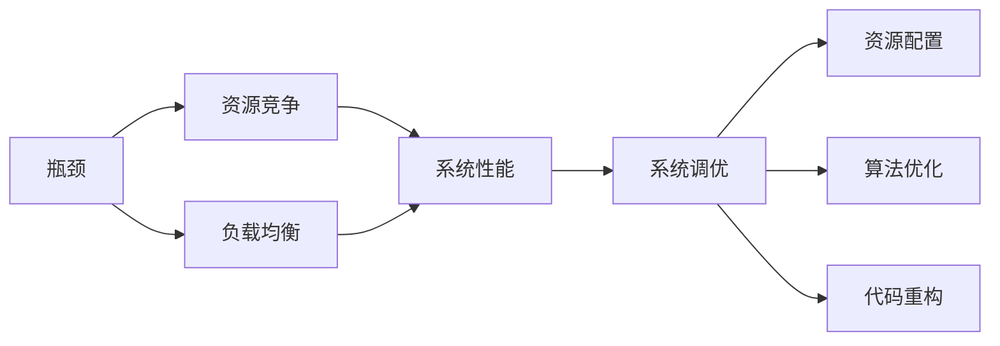
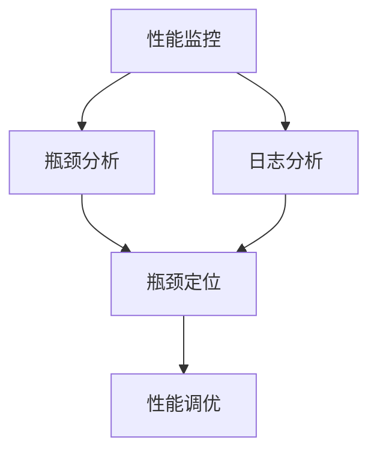
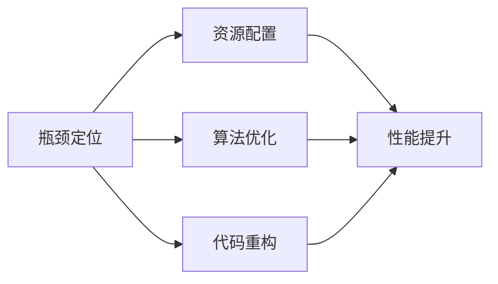
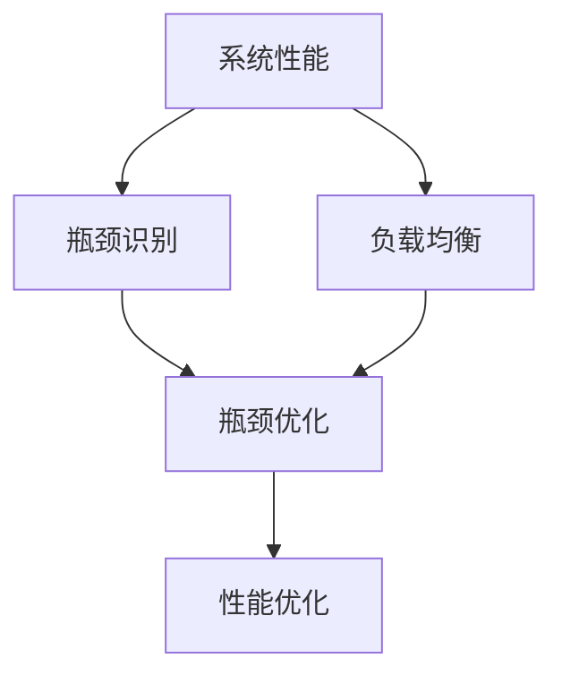
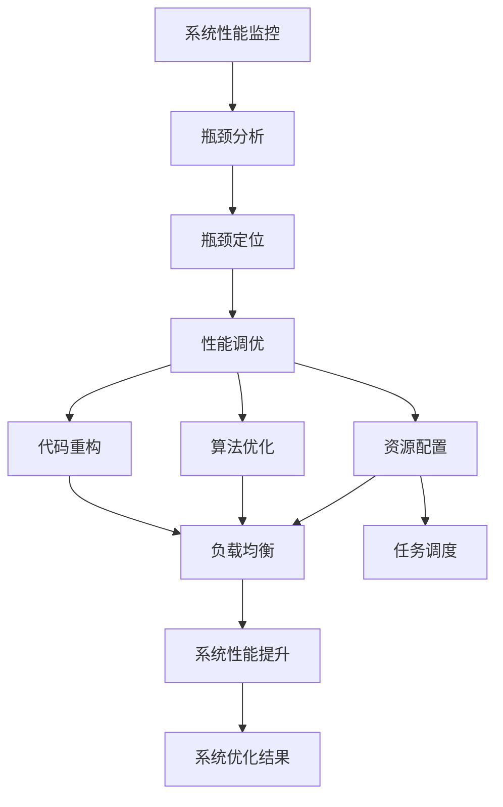

                 

## 1. 背景介绍

### 1.1 问题由来

在现代计算机系统中，瓶颈现象是普遍存在的问题。瓶颈指的是系统资源、网络带宽或处理器等关键性能组件在某个时刻达到极限，导致整个系统性能急剧下降的现象。系统瓶颈不仅影响用户体验，还可能导致系统崩溃或服务中断。瓶颈问题通常出现在并发、高负载或复杂操作的场景中，如大型数据库、高性能计算、分布式系统等。

### 1.2 问题核心关键点

系统瓶颈问题通常涉及以下几个核心关键点：

1. **资源竞争**：在多任务或多进程环境中，系统资源如内存、CPU、I/O设备等被多个任务共享，导致竞争和争用。
2. **数据传输**：数据在不同系统组件或网络节点间传输时，可能存在带宽不足、路由阻塞或网络拥塞等问题。
3. **任务调度**：在多任务环境中，任务调度的效率和公平性直接影响系统的性能表现。
4. **算法复杂度**：复杂算法在处理大规模数据或高并发请求时，可能消耗过多资源，导致系统性能下降。
5. **内存管理**：内存泄漏、频繁的GC（垃圾回收）等内存管理问题，会导致系统性能波动。

这些关键点互相交织，共同作用于系统性能，使得瓶颈问题变得复杂和难以预测。因此，系统瓶颈的识别和优化成为提高系统性能和可靠性的重要任务。

### 1.3 问题研究意义

系统瓶颈分析与优化是提高系统性能、提升用户体验和增强系统稳定性的关键手段。它不仅有助于解决当前性能问题，还能预防未来的潜在瓶颈，确保系统在复杂和多变的环境下始终保持高效和可靠。具体来说，瓶颈分析与优化对于以下几个方面具有重要意义：

1. **成本优化**：通过优化瓶颈，减少资源浪费和无效操作，提升系统的资源利用率，降低系统运行成本。
2. **用户体验提升**：提高系统响应速度和服务质量，减少用户等待时间和操作失败率，提升用户体验。
3. **可靠性增强**：增强系统鲁棒性和稳定性，减少崩溃和故障率，提高系统的连续性和可用性。
4. **性能预测与调优**：通过分析瓶颈，预测系统性能瓶颈，优化算法和资源配置，提升系统扩展能力和应对大规模负载的能力。
5. **技术积累与创新**：瓶颈分析与优化是系统性能提升的重要手段，有助于积累技术经验，推动系统架构和技术的不断创新。

## 2. 核心概念与联系

### 2.1 核心概念概述

为更好地理解系统瓶颈分析与优化，本节将介绍几个关键概念：

- **瓶颈(Bottleneck)**：指系统性能表现受限于某一项资源或组件的极限值。瓶颈可能出现在内存、CPU、I/O设备、网络带宽等不同位置。
- **资源竞争(Resource Competition)**：在多任务或多进程环境中，资源被多个任务共享，导致资源竞争和争用，进而影响系统性能。
- **负载均衡(Load Balancing)**：通过合理的任务调度或资源分配策略，使得系统负载均衡，避免资源竞争和瓶颈问题。
- **系统性能(System Performance)**：包括系统响应时间、吞吐量、延迟、可用性等关键指标，是系统优化追求的目标。
- **系统调优(System Tuning)**：通过识别和优化系统瓶颈，提升系统性能和稳定性，包括资源配置、算法优化、代码重构等手段。

这些核心概念之间的逻辑关系可以通过以下Mermaid流程图来展示：



这个流程图展示了大系统瓶颈问题的关键组件和它们之间的联系：

1. 瓶颈是系统性能表现的瓶颈点。
2. 资源竞争是导致瓶颈的原因之一。
3. 负载均衡是通过合理调度避免资源竞争的策略。
4. 系统性能是系统调优追求的目标。
5. 系统调优包括资源配置、算法优化和代码重构等手段。

### 2.2 概念间的关系

这些核心概念之间存在着紧密的联系，形成了系统瓶颈识别与优化的完整框架。下面通过几个Mermaid流程图来展示这些概念之间的关系。

#### 2.2.1 瓶颈识别过程



这个流程图展示了从性能监控到瓶颈识别的过程。首先通过性能监控工具收集系统运行数据，然后结合日志分析确定性能瓶颈点，进而进行瓶颈定位和调优。

#### 2.2.2 瓶颈优化策略



这个流程图展示了瓶颈优化的几种策略：资源配置、算法优化和代码重构。通过合理的策略，可以有效缓解瓶颈问题，提升系统性能。

#### 2.2.3 系统性能与瓶颈优化



这个流程图展示了系统性能与瓶颈优化的关系。通过性能监控识别瓶颈，然后通过负载均衡和瓶颈优化提升系统性能。

### 2.3 核心概念的整体架构

最后，我们用一个综合的流程图来展示这些核心概念在大系统瓶颈优化中的整体架构：



这个综合流程图展示了从性能监控到调优的完整过程。从性能监控开始，通过瓶颈分析识别瓶颈，接着进行瓶颈定位和优化，包括资源配置、算法优化和代码重构。最后，通过负载均衡和任务调度提升系统性能，最终得到优化结果。通过这些流程图，我们可以更清晰地理解系统瓶颈识别与优化的各个环节，为后续深入讨论具体的优化方法提供基础。

## 3. 核心算法原理 & 具体操作步骤

### 3.1 算法原理概述

系统瓶颈分析与优化通常基于以下核心算法原理：

1. **瓶颈识别**：通过性能监控工具和日志分析，识别系统中的瓶颈点。常用的工具包括Prometheus、Grafana、ELK Stack等。
2. **瓶颈定位**：基于瓶颈识别的结果，进行更细致的分析和定位。常用的方法包括堆栈跟踪、系统调用追踪、线程分析等。
3. **性能调优**：通过资源配置、算法优化和代码重构等手段，缓解瓶颈问题，提升系统性能。

这些算法原理构成了系统瓶颈优化的主要框架，确保从发现问题到最终解决的全过程都能高效且准确地进行。

### 3.2 算法步骤详解

下面详细介绍系统瓶颈分析与优化的主要步骤：

#### 3.2.1 瓶颈识别

1. **性能监控**：使用性能监控工具如Prometheus、Grafana等，收集系统性能数据，包括CPU使用率、内存使用量、磁盘I/O、网络流量等。
2. **日志分析**：结合系统日志和应用日志，分析瓶颈现象和异常行为，初步定位瓶颈点。
3. **瓶颈识别**：根据性能数据和日志分析结果，综合判断系统中存在瓶颈的资源或组件。

#### 3.2.2 瓶颈定位

1. **堆栈跟踪**：通过堆栈跟踪分析程序执行路径，识别具体瓶颈函数和代码段。
2. **系统调用追踪**：使用工具如strace、perf等，追踪系统调用和库函数调用，查找系统调用中的性能瓶颈。
3. **线程分析**：使用工具如ThreadSanitizer、Helgrind等，分析多线程环境下的资源竞争和死锁问题。

#### 3.2.3 性能调优

1. **资源配置**：根据瓶颈定位结果，调整系统资源配置，如增加CPU核心、增加内存、优化I/O设备等。
2. **算法优化**：重构算法，减少计算复杂度，使用高效的算法库和数据结构。
3. **代码重构**：优化代码逻辑，消除冗余和重复操作，减少系统资源消耗。
4. **负载均衡**：采用负载均衡策略，如轮询、加权轮询、Consistent Hash等，避免资源竞争和瓶颈问题。

### 3.3 算法优缺点

系统瓶颈分析与优化的主要优点包括：

1. **高效诊断**：通过性能监控和日志分析，能够快速定位系统瓶颈点。
2. **全面调优**：结合资源配置、算法优化和代码重构等多方面手段，全面提升系统性能。
3. **预防未来瓶颈**：通过分析瓶颈原因和调优效果，积累经验，预防未来的瓶颈问题。

但系统瓶颈分析与优化也存在一些缺点：

1. **复杂度高**：系统瓶颈识别和定位需要深入的技术背景和经验，难度较高。
2. **资源消耗**：性能监控和日志分析需要消耗一定的系统资源，可能影响正常业务运行。
3. **数据量庞大**：系统瓶颈识别和定位需要处理大量的数据和信息，对分析和处理能力要求高。
4. **调优效果受限**：某些瓶颈问题可能难以通过常规手段解决，需要深入架构设计和持续改进。

### 3.4 算法应用领域

系统瓶颈分析与优化方法广泛应用于以下几个领域：

1. **大型数据库**：通过性能监控和瓶颈分析，优化数据库查询和索引，提升数据库性能。
2. **高性能计算**：通过调优算法和资源配置，优化计算任务和数据传输，提升计算效率。
3. **分布式系统**：通过负载均衡和任务调度，优化分布式系统的资源利用和任务执行效率。
4. **网络应用**：通过优化网络传输和资源配置，提升网络应用的响应速度和稳定性。
5. **移动应用**：通过优化算法和资源配置，提升移动应用的性能和用户体验。

## 4. 数学模型和公式 & 详细讲解 & 举例说明

### 4.1 数学模型构建

系统瓶颈分析与优化的数学模型主要基于以下几个关键指标：

1. **响应时间**：指系统处理请求所需的总时间，包括计算时间、I/O时间、网络延迟等。
2. **吞吐量**：指单位时间内系统处理的请求数或处理的数据量。
3. **延迟**：指请求到达系统到处理完毕之间的时间间隔。
4. **系统负载**：指系统资源的占用情况，包括CPU使用率、内存使用量、I/O请求数等。

这些指标可以通过数学公式进行建模和分析。

### 4.2 公式推导过程

以响应时间为例，其数学模型可以表示为：

$$
RT = T_{calc} + T_{I/O} + T_{net}
$$

其中 $RT$ 表示响应时间，$T_{calc}$ 表示计算时间，$T_{I/O}$ 表示I/O时间，$T_{net}$ 表示网络延迟。

在实际应用中，由于I/O和网络延迟通常较小，可以进一步简化为：

$$
RT \approx T_{calc}
$$

其中 $T_{calc}$ 表示计算时间，可以通过以下公式计算：

$$
T_{calc} = N \times C
$$

其中 $N$ 表示任务数，$C$ 表示单任务计算时间。

### 4.3 案例分析与讲解

以大型数据库性能优化为例，分析如何通过数学模型进行瓶颈识别和调优。

1. **性能监控**：使用Prometheus和Grafana监控数据库性能，收集查询响应时间、吞吐量和CPU使用率等数据。
2. **瓶颈识别**：通过分析性能数据，发现查询响应时间显著高于正常水平，CPU使用率接近100%。
3. **瓶颈定位**：使用堆栈跟踪和系统调用追踪工具，定位到具体查询语句和数据库操作，发现查询复杂度高，索引使用不当。
4. **性能调优**：通过重构查询语句、优化索引设计、增加硬件资源等手段，提升数据库性能。

## 5. 项目实践：代码实例和详细解释说明

### 5.1 开发环境搭建

在进行系统瓶颈优化实践前，我们需要准备好开发环境。以下是使用Python进行Prometheus和Grafana集成的环境配置流程：

1. 安装Anaconda：从官网下载并安装Anaconda，用于创建独立的Python环境。

2. 创建并激活虚拟环境：
```bash
conda create -n prometheus-env python=3.8 
conda activate prometheus-env
```

3. 安装Prometheus：从官网获取最新版本的二进制包，进行安装。例如：
```bash
cd /path/to/prometheus-2.29.0.linux-amd64
./bin/prometheus --web.listen-address=localhost:9090 --storage.tsdb.path=./data
```

4. 安装Grafana：从官网获取最新版本的二进制包，进行安装。例如：
```bash
cd /path/to/grafana-9.1.0-windows-amd64
./bin/grafana-server --config.server.http.address=:3000
```

5. 安装Prometheus exporter：使用Prometheus官方提供的Golang示例代码，将其编译为可执行文件。例如：
```bash
go build -o exporter example.go
```

6. 将exporter部署到目标服务器：
```bash
mkdir -p /usr/local/bin
cp exporter /usr/local/bin/prometheus_exporter
```

完成上述步骤后，即可在`prometheus-env`环境中开始瓶颈优化实践。

### 5.2 源代码详细实现

以下是一个使用Python和Prometheus进行系统瓶颈优化的样例代码：

```python
import requests
from prometheus_client import Gauge

# 创建Prometheus Gauge指标
cpu_usage = Gauge('cpu_usage', 'CPU使用率')
network_utilization = Gauge('network_utilization', '网络利用率')
response_time = Gauge('response_time', '请求响应时间')

# 模拟系统负载和瓶颈
def simulate_load():
    for i in range(10):
        cpu_usage.set(0.9) # 模拟CPU高负载
        network_utilization.set(0.8) # 模拟网络高利用率
        response_time.set(0.5) # 模拟高响应时间

        # 发送请求到Grafana，获取当前指标值
        response = requests.get('http://localhost:3000/api/datasources/0/query?query=up%7C%20avg%28rate%28cpu_seconds_total%5B5m%5D%29%20by%20%20%20%20%20%20%20%20%20%20%20%20%20%20%20%20%20%20%20%20%20%20%20%20%20%20%20%20%20%20%20%20%20%20%20%20%20%20%20%20%20%20%20%20%20%20%20%20%20%20%20%20%20%20%20%20%20%20%20%20%20%20%20%20%20%20%20%20%20%20%20%20%20%20%20%20%20%20%20%20%20%20%20%20%20%20%20%20%20%20%20%20%20%20%20%20%20%20%20%20%20%20%20%20%20%20%20%20%20%20%20%20%20%20%20%20%20%20%20%20%20%20%20%20%20%20%20%20%20%20%20%20%20%20%20%20%20%20%20%20%20%20%20%20%20%20%20%20%20%20%20%20%20%20%20%20%20%20%20%20%20%20%20%20%20%20%20%20%20%20%20%20%20%20%20%20%20%20%20%20%20%20%20%20%20%20%20%20%20%20%20%20%20%20%20%20%20%20%20%20%20%20%20%20%20%20%20%20%20%20%20%20%20%20%20%20%20%20%20%20%20%20%20%20%20%20%20%20%20%20%20%20%20%20%20%20%20%20%20%20%20%20%20%20%20%20%20%20%20%20%20%20%20%20%20%20%20%20%20%20%20%20%20%20%20%20%20%20%20%20%20%20%20%20%20%20%20%20%20%20%20%20%20%20%20%20%20%20%20%20%20%20%20%20%20%20%20%20%20%20%20%20%20%20%20%20%20%20%20%20%20%20%20%20%20%20%20%20%20%20%20%20%20%20%20%20%20%20%20%20%20%20%20%20%20%20%20%20%20%20%20%20%20%20%20%20%20%20%20%20%20%20%20%20%20%20%20%20%20%20%20%20%20%20%20%20%20%20%20%20%20%20%20%20%20%20%20%20%20%20%20%20%20%20%20%20%20%20%20%20%20%20%20%20%20%20%20%20%20%20%20%20%20%20%20%20%20%20%20%20%20%20%20%20%20%20%20%20%20%20%20%20%20%20%20%20%20%20%20%20%20%20%20%20%20%20%20%20%20%20%20%20%20%20%20%20%20%20%20%20%20%20%20%20%20%20%20%20%20%20%20%20%20%20%20%20%20%20%20%20%20%20%20%20%20%20%20%20%20%20%20%20%20%20%20%20%20%20%20%20%20%20%20%20%20%20%20%20%20%20%20%20%20%20%20%20%20%20%20%20%20%20%20%20%20%20%20%20%20%20%20%20%20%20%20%20%20%20%20%20%20%20%20%20%20%20%20%20%20%20%20%20%20%20%20%20%20%20%20%20%20%20%20%20%20%20%20%20%20%20%20%20%20%20%20%20%20%20%20%20%20%20%20%20%20%20%20%20%20%20%20%20%20%20%20%20%20%20%20%20%20%20%20%20%20%20%20%20%20%20%20%20%20%20%20%20%20%20%20%20%20%20%20%20%20%20%20%20%20%20%20%20%20%20%20%20%20%20%20%20%20%20%20%20%20%20%20%20%20%20%20%20%20%20%20%20%20%20%20%20%20%20%20%20%20%20%20%20%20%20%20%20%20%20%20%20%20%20%20%20%20%20%20%20%20%20%20%20%20%20%20%20%20%20%20%20%20%20%20%20%20%20%20%20%20%20%20%20%20%20%20%20%20%20%20%20%20%20%20%20%20%20%20%20%20%20%20%20%20%20%20%20%20%20%20%20%20%20%20%20%20%20%20%20%20%20%20%20%20%20%20%20%20%20%20%20%20%20%20%20%20%20%20%20%20%20%20%20%20%20%20%20%20%20%20%20%20%20%20%20%20%20%20%20%20%20%20%20%20%20%20%20%20%20%20%20%20%20%20%20%20%20%20%20%20%20%20%20%20%20%20%20%20%20%20%20%20%20%20%20%20%20%20%20%20%20%20%20%20%20%20%20%20%20%20%20%20%20%20%20%20%20%20%20%20%20%20%20%20%20%20%20%20%20%20%20%20%20%20%20%20%20%20%20%20%20%20%20%20%20%20%20%20%20%20%20%20%20%20%20%20%20%20%20%20%20%20%20%20%20%20%20%20%20%20%20%20%20%20%20%20%20%20%20%20%20%20%20%20%20%20%20%20%20%20%20%20%20%20%20%20%20%20%20%20%20%20%20%20%20%20%20%20%20%20%20%20%20%20%20%20%20%20%20%20%20%20%20%20%20%20%20%20%20%20%20%20%20%20%20%20%20%20%20%20%20%20%20%20%20%20%20%20%20%20%20%20%20%20%20%20%20%20%20%20%20%20%20%20%20%20%20%20%20%20%20%20%20%20%20%20%20%20%20%20%20%20%20%20%20%20%20%20%20%20%20%20%20%20%20%20%20%20%20%20%20%20%20%20%20%20%20%20%20%20%20%20%20%20%20%20%20%20%20%20%20%20%20%20%20%20%20%20%20%20%20%20%20%20%20%20%20%20%20%20%20%20%20%20%20%20%20%20%20%20%20%20%20%20%20%20%20%20%20%20%20%20%20%20%20%20%20%20%20%20%20%20%20%20%20%20%20%20%20%20%20%20%20%20%20%20%20%20%20%20%20%20%20%20%20%20%20%20%20%20%20%20%20%20%20%20%20%20%20%20%20%20%20%20%20%20%20%20%20%20%20%20%20%20%20%20%20%20%20%20%20%20%20%20%20%20%20%20%20%20%20%20%20%20%20%20%20%20%20%20%20%20%20%20%20%20%20%20%20%20%20%20%20%20%20%20%20%20%20%20%20%20%20%20%20%20%20%20%20%20%20%20%20%20%20%20%20%20%20%20%20%20%20%20%20%20%20%

