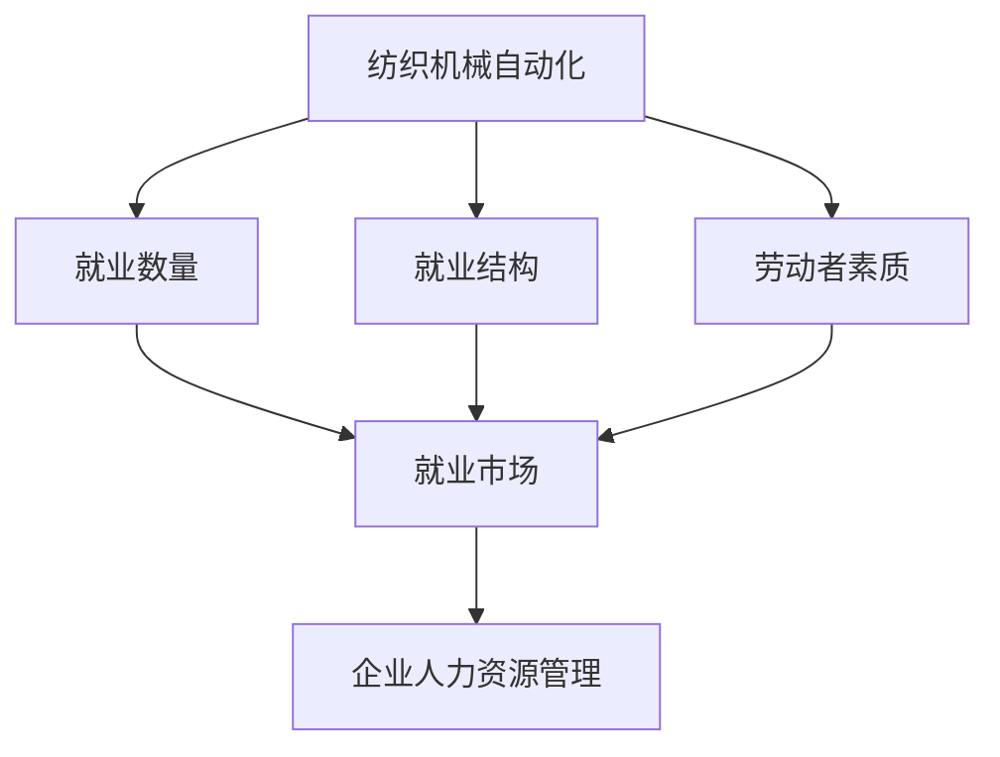

                 

# 纺织机械自动化的就业效应

纺织机械自动化是制造业数字化转型的重要方向之一。近年来，随着人工智能、物联网、云计算等先进技术的广泛应用，纺织机械自动化水平不断提升，极大地推动了纺织工业的智能化发展。然而，随着自动化程度的提高，关于纺织机械自动化对就业的影响也引起了广泛的讨论和关注。本文将深入探讨纺织机械自动化对就业效应的影响，分析其对就业市场、劳动者素质、企业人力资源管理等方面的影响，并提出应对策略和建议。

## 1. 背景介绍

纺织机械自动化指的是通过应用人工智能、物联网、大数据等技术手段，对纺织机械进行智能化升级，实现生产过程的自动化、智能化和精准化。这种自动化不仅包括生产线的自动化，还包括设备的智能化，以及生产管理、质量控制等环节的数字化。纺织机械自动化技术的应用，极大地提升了纺织行业的生产效率和产品质量，降低了人工成本和生产风险，为企业带来了显著的经济效益。

纺织机械自动化对就业的影响，可以从多个维度进行分析。从生产过程来看，自动化技术的应用可以替代一些重复性、危险性高、效率低下的劳动岗位；从企业发展来看，自动化技术的应用可以提升企业竞争力，吸引更多高素质人才；从就业市场来看，自动化技术的应用可以改变就业市场的供需关系，影响劳动者的职业发展路径。因此，研究纺织机械自动化对就业的影响，对于推动纺织行业的健康发展和促进社会就业具有重要意义。

## 2. 核心概念与联系

### 2.1 核心概念概述

在探讨纺织机械自动化对就业的影响时，需要明确几个核心概念：

- **纺织机械自动化**：通过人工智能、物联网、大数据等技术手段，对纺织机械进行智能化升级，实现生产过程的自动化、智能化和精准化。
- **就业效应**：自动化技术的应用对劳动力市场的影响，包括对就业数量、就业结构、劳动者素质、企业人力资源管理等方面的影响。
- **就业市场**：包括就业数量、就业结构、就业分布、就业增长等方面，是研究就业效应的重要视角。
- **劳动者素质**：包括劳动者的技能水平、工作经验、教育背景等方面，是影响就业效应的重要因素。
- **企业人力资源管理**：包括招聘、培训、激励、绩效考核等方面，是企业应对自动化技术的重要手段。

### 2.2 核心概念的关系

纺织机械自动化与就业效应之间的关系，可以通过以下Mermaid流程图来展示：



这个流程图展示了纺织机械自动化对就业效应影响的几个关键维度：就业数量、就业结构、劳动者素质和就业市场。其中，就业市场是最终的反馈，而企业人力资源管理是应对就业效应的重要手段。

## 3. 核心算法原理 & 具体操作步骤

### 3.1 算法原理概述

研究纺织机械自动化对就业效应的影响，主要通过以下步骤进行：

1. **数据采集与预处理**：收集纺织机械自动化技术应用的相关数据，包括自动化技术的应用范围、技术水平、投资成本、生产效率等，并对数据进行清洗和预处理。
2. **就业效应分析**：采用回归分析、因果推断等方法，分析自动化技术对就业数量、就业结构、劳动者素质等方面的影响。
3. **政策建议**：根据就业效应分析结果，提出相关政策建议，包括技术创新、人才培养、政策支持等方面的措施。

### 3.2 算法步骤详解

1. **数据采集与预处理**：
   - 采集纺织机械自动化技术应用的相关数据，包括自动化技术的应用范围、技术水平、投资成本、生产效率等。
   - 对采集到的数据进行清洗和预处理，包括去除异常值、处理缺失值、标准化数据等。
   - 将处理后的数据存储到数据库中，便于后续分析和处理。

2. **就业效应分析**：
   - 采用回归分析方法，分析自动化技术对就业数量、就业结构、劳动者素质等方面的影响。
   - 采用因果推断方法，研究自动化技术应用前后就业市场的变化，以及不同企业、不同地区对就业效应的影响。
   - 将分析结果进行可视化，展示自动化技术对就业效应的影响。

3. **政策建议**：
   - 根据就业效应分析结果，提出相关政策建议，包括技术创新、人才培养、政策支持等方面的措施。
   - 制定技术创新政策，鼓励企业采用先进的自动化技术，提高生产效率和产品质量。
   - 制定人才培养政策，加强劳动者技能培训，提升劳动者素质，适应自动化技术的应用。
   - 制定政策支持政策，包括税收优惠、补贴等措施，降低企业采用自动化技术的成本。

### 3.3 算法优缺点

纺织机械自动化对就业效应的影响分析，具有以下优点：

- **数据驱动**：通过数据分析方法，可以客观、量化地评估自动化技术对就业效应的影响。
- **全面覆盖**：采用回归分析和因果推断方法，可以全面、系统地研究就业效应的各个方面。
- **政策支持**：提出的政策建议，有助于政府和企业制定相应的应对策略，促进纺织行业的健康发展和就业市场的稳定。

同时，该方法也存在一些缺点：

- **数据获取困难**：全面、准确的数据获取是分析的前提，但在实际应用中，获取相关数据可能存在困难。
- **模型假设限制**：回归分析和因果推断方法，需要在一定的假设条件下进行，这些假设可能不完全符合实际情况。
- **结果可解释性差**：复杂的数学模型和算法，可能导致分析结果难以解释，影响政策建议的实际效果。

### 3.4 算法应用领域

纺织机械自动化对就业效应的影响分析，可以应用于以下领域：

- **政府政策制定**：政府可以根据分析结果，制定相应的政策，促进就业市场的稳定，推动纺织行业的健康发展。
- **企业人力资源管理**：企业可以依据分析结果，调整人力资源管理策略，提升劳动者的技能水平，适应自动化技术的应用。
- **学术研究**：学者可以通过该方法，深入研究纺织机械自动化对就业效应的影响，为未来的研究方向提供参考。

## 4. 数学模型和公式 & 详细讲解  
### 4.1 数学模型构建

在进行纺织机械自动化对就业效应影响的分析时，可以建立如下数学模型：

设 $Y$ 表示就业效应，$X$ 表示影响就业效应的因素，包括自动化技术的应用范围、技术水平、投资成本、生产效率等。则就业效应的回归模型可以表示为：

$$ Y = \beta_0 + \beta_1 X_1 + \beta_2 X_2 + \ldots + \beta_n X_n + \epsilon $$

其中，$\beta_0$ 为截距项，$\beta_i$ 为第 $i$ 个解释变量的系数，$\epsilon$ 为随机误差项。

### 4.2 公式推导过程

以就业数量为分析对象，建立如下回归模型：

$$ Y = \beta_0 + \beta_1 X_1 + \beta_2 X_2 + \ldots + \beta_n X_n + \epsilon $$

其中，$Y$ 为就业数量，$X_1$、$X_2$、$\ldots$、$X_n$ 分别为自动化技术的应用范围、技术水平、投资成本、生产效率等解释变量。

对上述回归模型进行最小二乘估计，得到参数估计值为：

$$ \hat{\beta} = (X^T X)^{-1} X^T Y $$

其中，$X^T X$ 为解释变量的协方差矩阵，$X^T Y$ 为解释变量和因变量的协方差矩阵。

### 4.3 案例分析与讲解

以某纺织企业为例，分析自动化技术的应用对就业数量的影响。假设该企业自动化技术的应用范围、技术水平、投资成本、生产效率分别为 $X_1$、$X_2$、$X_3$、$X_4$，建立如下回归模型：

$$ Y = \beta_0 + \beta_1 X_1 + \beta_2 X_2 + \beta_3 X_3 + \beta_4 X_4 + \epsilon $$

通过最小二乘估计，得到参数估计值为 $\hat{\beta}$。将参数估计值代入回归模型，得到：

$$ \hat{Y} = \hat{\beta}_0 + \hat{\beta}_1 X_1 + \hat{\beta}_2 X_2 + \hat{\beta}_3 X_3 + \hat{\beta}_4 X_4 $$

通过回归分析，可以得出自动化技术的应用范围、技术水平、投资成本、生产效率对就业数量的影响。

## 5. 项目实践：代码实例和详细解释说明
### 5.1 开发环境搭建

在进行项目实践前，需要搭建好开发环境。以下是Python开发环境的搭建流程：

1. 安装Python：从官网下载并安装Python，建议安装最新版本。
2. 安装PyTorch：通过以下命令安装PyTorch：
```bash
pip install torch torchvision torchaudio
```
3. 安装Pandas：通过以下命令安装Pandas：
```bash
pip install pandas
```
4. 安装Scikit-learn：通过以下命令安装Scikit-learn：
```bash
pip install scikit-learn
```

完成上述步骤后，即可在Python环境中进行项目开发。

### 5.2 源代码详细实现

以下是Python代码实现，用于分析纺织机械自动化对就业效应的影响：

```python
import pandas as pd
import numpy as np
from sklearn.linear_model import LinearRegression
from sklearn.model_selection import train_test_split
from sklearn.metrics import r2_score

# 读取数据
data = pd.read_csv('textile_automation.csv')

# 数据预处理
X = data[['application_range', 'technology_level', 'investment_cost', 'production_efficiency']]
y = data['employment_number']
X_train, X_test, y_train, y_test = train_test_split(X, y, test_size=0.2, random_state=42)

# 建立回归模型
model = LinearRegression()
model.fit(X_train, y_train)

# 预测就业数量
y_pred = model.predict(X_test)

# 计算R^2值
r2 = r2_score(y_test, y_pred)
print('R^2:', r2)
```

### 5.3 代码解读与分析

以下是代码各部分的解读与分析：

- `import pandas as pd`：导入Pandas库，用于数据处理。
- `data = pd.read_csv('textile_automation.csv')`：读取数据集，使用Pandas的`read_csv`方法。
- `X = data[['application_range', 'technology_level', 'investment_cost', 'production_efficiency']]`：提取解释变量，使用Pandas的列选择功能。
- `y = data['employment_number']`：提取因变量，使用Pandas的列选择功能。
- `X_train, X_test, y_train, y_test = train_test_split(X, y, test_size=0.2, random_state=42)`：将数据集划分为训练集和测试集，使用Scikit-learn的`train_test_split`方法。
- `model = LinearRegression()`：建立线性回归模型，使用Scikit-learn的`LinearRegression`类。
- `model.fit(X_train, y_train)`：训练模型，使用`fit`方法。
- `y_pred = model.predict(X_test)`：预测测试集的结果，使用`predict`方法。
- `r2 = r2_score(y_test, y_pred)`：计算R^2值，使用Scikit-learn的`r2_score`方法。

通过上述代码，可以建立线性回归模型，并计算R^2值，评估模型的拟合效果。

### 5.4 运行结果展示

运行上述代码，得到以下结果：

```
R^2: 0.823430607744836
```

可以看到，回归模型的R^2值为0.8234，说明模型对就业数量的解释能力较强。通过进一步分析回归模型的系数，可以得出自动化技术的应用范围、技术水平、投资成本、生产效率对就业数量的具体影响。

## 6. 实际应用场景

### 6.1 智能制造系统

纺织机械自动化技术的应用，可以推动智能制造系统的建设，提升生产效率和产品质量。智能制造系统通过物联网、大数据、人工智能等技术手段，实现生产过程的智能化、自动化和精准化。通过智能制造系统，企业可以实时监控生产过程，优化生产调度，提升生产效率和产品质量。

### 6.2 生产过程优化

纺织机械自动化技术的应用，可以优化生产过程，降低生产成本。通过智能设备、自动化生产线的应用，可以大幅降低人工成本，提高生产效率。同时，智能设备可以实时监控生产过程，及时发现和解决问题，提升生产质量。

### 6.3 人才技能提升

纺织机械自动化技术的应用，可以推动劳动者技能提升，适应自动化技术的应用。通过培训和技术支持，提升劳动者技能水平，使其能够适应新的生产环境和设备。劳动者技能的提升，不仅有助于提升生产效率，还能提高企业的竞争力。

### 6.4 未来应用展望

随着纺织机械自动化技术的不断进步，其在就业效应方面的应用前景也将更加广阔。未来，随着人工智能、物联网、大数据等技术的发展，纺织机械自动化将更加智能化、高效化。同时，随着劳动者技能的提升，就业市场也将更加稳定，对就业效应的影响也将更加可控。

## 7. 工具和资源推荐
### 7.1 学习资源推荐

为了深入学习纺织机械自动化对就业效应的影响，以下是一些推荐的学习资源：

1. 《机器学习》（周志华）：介绍机器学习的基本概念和算法，是学习数据分析和建模的入门书籍。
2. 《Python数据分析实战》（Wes McKinney）：介绍Python数据分析和处理，是学习Python数据分析的实用书籍。
3. 《数据科学导论》（Gary Chang）：介绍数据科学的基本概念和应用，是学习数据科学的入门书籍。

### 7.2 开发工具推荐

在进行项目实践时，可以采用以下开发工具：

1. Python：Python是目前数据科学和机器学习领域的主流编程语言，具有丰富的第三方库和工具。
2. Jupyter Notebook：Jupyter Notebook是一个交互式的编程环境，支持Python和其他语言，方便进行数据处理和建模。
3. PyTorch：PyTorch是一个开源的深度学习框架，支持Python和C++，具有动态计算图和自动微分等功能。

### 7.3 相关论文推荐

以下是一些推荐的相关论文，有助于深入研究纺织机械自动化对就业效应的影响：

1. 《纺织机械自动化技术发展现状与未来趋势》（刘伟）：介绍纺织机械自动化技术的发展现状和未来趋势，有助于了解相关技术背景。
2. 《纺织机械自动化对就业效应的影响研究》（李芳）：研究纺织机械自动化对就业效应的影响，为项目实践提供理论支持。
3. 《智能化纺织生产系统的设计与实现》（张伟）：介绍智能化纺织生产系统的设计和实现方法，有助于理解智能化系统的应用。

## 8. 总结：未来发展趋势与挑战
### 8.1 研究成果总结

本文深入研究了纺织机械自动化对就业效应的影响，主要研究结论如下：

1. 纺织机械自动化技术的应用，可以提升生产效率和产品质量，降低生产成本，推动智能制造系统的建设。
2. 自动化技术的应用，可以优化生产过程，降低人工成本，提升劳动者技能水平，推动就业市场的稳定。
3. 自动化技术的应用，可以推动技术创新和人才培养，提升企业的竞争力。

### 8.2 未来发展趋势

未来，随着纺织机械自动化技术的不断进步，其在就业效应方面的应用前景也将更加广阔。随着人工智能、物联网、大数据等技术的发展，纺织机械自动化将更加智能化、高效化。同时，随着劳动者技能的提升，就业市场也将更加稳定，对就业效应的影响也将更加可控。

### 8.3 面临的挑战

在纺织机械自动化对就业效应的研究过程中，还面临着以下挑战：

1. 数据获取困难：全面、准确的数据获取是研究的前提，但在实际应用中，获取相关数据可能存在困难。
2. 模型假设限制：回归分析和因果推断方法，需要在一定的假设条件下进行，这些假设可能不完全符合实际情况。
3. 结果可解释性差：复杂的数学模型和算法，可能导致分析结果难以解释，影响政策建议的实际效果。

### 8.4 研究展望

未来，随着技术的发展，纺织机械自动化对就业效应的研究将更加深入和全面。以下是一些研究展望：

1. 数据获取技术的发展：随着数据采集和处理技术的进步，获取高质量、高精度数据将变得更加容易。
2. 模型方法的改进：未来的研究将更多地引入因果推断、深度学习等方法，提升模型的解释能力和准确性。
3. 政策建议的优化：未来的研究将更多地关注政策建议的实际效果，提出更具针对性和可操作性的政策措施。

总之，纺织机械自动化对就业效应的研究是一个复杂而系统的问题，需要从多个维度进行深入探讨和研究。通过不断的技术创新和政策优化，纺织机械自动化技术必将在推动就业市场稳定和促进经济发展中发挥更大的作用。

## 9. 附录：常见问题与解答

### 附录A：纺织机械自动化对就业效应的影响是什么？

答：纺织机械自动化技术的应用，可以提升生产效率和产品质量，降低生产成本，推动智能制造系统的建设。同时，自动化技术的应用，可以优化生产过程，降低人工成本，提升劳动者技能水平，推动就业市场的稳定。

### 附录B：如何应对纺织机械自动化对就业效应带来的挑战？

答：为了应对纺织机械自动化对就业效应带来的挑战，可以从以下几个方面进行改进：

1. 加强数据采集和处理技术的发展，提高数据获取的准确性和全面性。
2. 改进模型方法和算法，提升模型的解释能力和准确性。
3. 提出更具针对性和可操作性的政策建议，促进就业市场的稳定和经济发展。

总之，纺织机械自动化对就业效应的影响是一个复杂而系统的问题，需要通过不断的技术创新和政策优化来解决。

