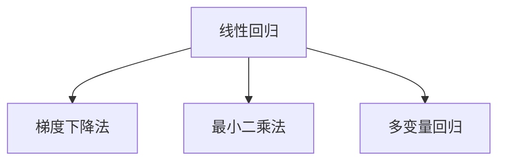
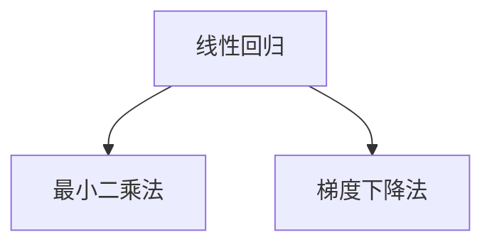
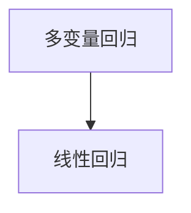
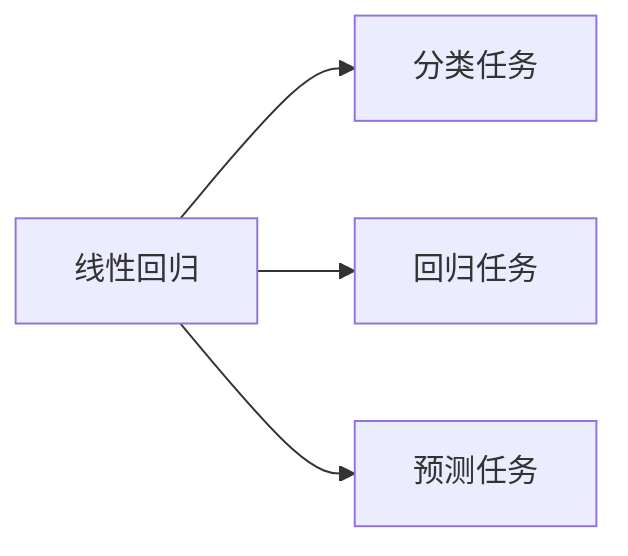

                 

# 线性回归(Linear Regression) - 原理与代码实例讲解

> 关键词：线性回归,机器学习,梯度下降,最小二乘法,多变量回归,Python代码实现,统计学原理

## 1. 背景介绍

线性回归（Linear Regression）是一种经典的统计学和机器学习方法，用于建立输入变量（自变量）和输出变量（因变量）之间的线性关系。它广泛应用于各个领域，如金融、医疗、工程等，用于预测、分析和优化问题。本节将简要介绍线性回归的基本背景和应用场景。

### 1.1 问题由来
在数据科学中，我们通常面临这样一个问题：给定一组已知的输入数据 $x_1, x_2, ..., x_n$ 和对应的输出数据 $y_1, y_2, ..., y_n$，如何找到一个数学模型来预测新的未知输出 $y$，或者分析输入数据和输出数据之间的关系。

线性回归提供了一个简单而有效的方法来解决这些问题。它基于最小二乘法的原理，通过拟合一个线性函数来寻找输入数据和输出数据之间的线性关系。

### 1.2 问题核心关键点
线性回归的核心思想是：假设输入数据和输出数据之间存在一个线性关系，即 $y = \theta_0 + \theta_1x_1 + \theta_2x_2 + ... + \theta_nx_n$，其中 $\theta_0, \theta_1, \theta_2, ..., \theta_n$ 是模型的参数，$x_1, x_2, ..., x_n$ 是输入变量，$y$ 是输出变量。

线性回归的目标是通过最小化实际输出与预测输出之间的误差（通常使用均方误差）来确定模型的参数 $\theta$。这个过程通常被称为梯度下降法（Gradient Descent），是一种迭代优化算法，用于寻找函数的最小值。

## 2. 核心概念与联系

### 2.1 核心概念概述

为更好地理解线性回归的原理和应用，本节将介绍几个关键的概念：

- **线性回归**：一种用于建立输入变量和输出变量之间线性关系的统计学和机器学习方法。
- **梯度下降法**：一种用于最小化损失函数的迭代优化算法，用于寻找线性回归模型的最优参数。
- **最小二乘法**：一种用于求解线性回归模型参数的数学方法，通过最小化实际输出与预测输出之间的误差。
- **多变量回归**：一种扩展的线性回归方法，用于处理多于两个自变量的情况。

这些概念之间的逻辑关系可以通过以下Mermaid流程图来展示：



这个流程图展示了大语言模型微调过程中各个核心概念的关系和作用：

1. 线性回归提供了一种假设输入数据和输出数据之间存在线性关系的数学模型。
2. 梯度下降法通过迭代优化损失函数，找到线性回归模型的最优参数。
3. 最小二乘法是梯度下降法的一种数学实现方法，用于求解线性回归模型的参数。
4. 多变量回归在处理多个自变量时，扩展了线性回归的适用范围。

### 2.2 概念间的关系

这些核心概念之间存在着紧密的联系，形成了线性回归的完整生态系统。下面我通过几个Mermaid流程图来展示这些概念之间的关系。

#### 2.2.1 线性回归的学习范式



这个流程图展示了线性回归的基本学习范式：通过最小二乘法求取模型参数，通过梯度下降法进行参数优化。

#### 2.2.2 多变量回归与线性回归的关系



这个流程图展示了多变量回归是线性回归的扩展，可以处理多个自变量的情况。

#### 2.2.3 线性回归在机器学习中的应用



这个流程图展示了线性回归在机器学习中的应用场景：分类任务、回归任务和预测任务。

## 3. 核心算法原理 & 具体操作步骤
### 3.1 算法原理概述

线性回归的原理是通过最小化实际输出与预测输出之间的误差来拟合线性函数。具体来说，假设输入数据和输出数据之间存在线性关系 $y = \theta_0 + \theta_1x_1 + \theta_2x_2 + ... + \theta_nx_n$，目标是通过最小化误差 $\sum(y_i - \theta_0 - \theta_1x_{1,i} - \theta_2x_{2,i} - ... - \theta_nx_{n,i})^2$ 来确定模型的参数 $\theta_0, \theta_1, \theta_2, ..., \theta_n$。这个过程通常被称为最小二乘法，可以通过梯度下降法来实现。

### 3.2 算法步骤详解

线性回归的实现步骤通常包括以下几个关键步骤：

**Step 1: 准备数据集**
- 准备一组已知的输入数据 $x_1, x_2, ..., x_n$ 和对应的输出数据 $y_1, y_2, ..., y_n$。
- 将输入数据和输出数据存储为矩阵形式 $X$ 和 $Y$。

**Step 2: 初始化参数**
- 初始化模型参数 $\theta_0, \theta_1, \theta_2, ..., \theta_n$，通常随机初始化或使用默认值。

**Step 3: 梯度下降**
- 使用梯度下降法迭代更新模型参数，最小化损失函数。

**Step 4: 验证模型**
- 在验证集上评估模型的性能，确认模型是否过拟合或欠拟合。
- 根据需要调整超参数和训练轮数。

**Step 5: 测试模型**
- 在测试集上评估模型的泛化能力，确认模型是否具有良好的预测能力。

### 3.3 算法优缺点

线性回归具有以下优点：
1. 模型简单易懂，易于解释和理解。
2. 计算速度快，适合处理大规模数据集。
3. 对于线性关系的假设，已有大量统计学和理论依据。

同时，它也存在一些局限性：
1. 假设线性关系可能不成立，需要经过验证。
2. 对于非线性关系，线性回归效果可能不佳。
3. 需要提供足够的训练数据来拟合模型。

### 3.4 算法应用领域

线性回归在各个领域都有广泛的应用，例如：

- 金融分析：预测股票价格、利率、汇率等。
- 医疗诊断：预测疾病风险、药物效果等。
- 工程设计：预测材料强度、设备寿命等。
- 社会科学：预测人口增长、经济波动等。

除了这些常见应用外，线性回归还被创新性地应用到更多场景中，如风险评估、广告点击率预测等，为数据驱动的决策提供支持。

## 4. 数学模型和公式 & 详细讲解
### 4.1 数学模型构建

假设线性回归模型为 $y = \theta_0 + \theta_1x_1 + \theta_2x_2 + ... + \theta_nx_n$，其中 $x_1, x_2, ..., x_n$ 为输入变量，$y$ 为输出变量，$\theta_0, \theta_1, \theta_2, ..., \theta_n$ 为模型参数。

将输入数据和输出数据存储为矩阵形式 $X$ 和 $Y$，其中 $X = [x_{1,1} x_{1,2} ... x_{1,n}, x_{2,1} x_{2,2} ... x_{2,n}, ..., x_{m,1} x_{m,2} ... x_{m,n}]$，$Y = [y_1, y_2, ..., y_n]$。

则线性回归的数学模型可以表示为：

$$
\min_{\theta_0, \theta_1, ..., \theta_n} \frac{1}{2m} ||Y - X\theta||^2
$$

其中 $m$ 为样本数量。

### 4.2 公式推导过程

线性回归的参数 $\theta$ 可以通过最小二乘法求解，具体推导过程如下：

1. 最小二乘法求解模型参数 $\theta$：

$$
\theta = (X^TX)^{-1}X^TY
$$

2. 梯度下降法更新模型参数 $\theta$：

$$
\theta = \theta - \eta \nabla_{\theta}\mathcal{L}(\theta)
$$

其中 $\mathcal{L}(\theta)$ 为损失函数，$\nabla_{\theta}\mathcal{L}(\theta)$ 为损失函数的梯度，$\eta$ 为学习率。

### 4.3 案例分析与讲解

假设我们有一个包含两个自变量的数据集，我们想要预测房屋价格 $y$，其中 $x_1$ 为房屋面积，$x_2$ 为房间数量。我们准备的数据集如下：

| 房屋面积 | 房间数量 | 房屋价格 |
|---------|---------|---------|
| 1000    | 3       | 200000  |
| 1200    | 4       | 250000  |
| 1500    | 5       | 300000  |
| 2000    | 6       | 350000  |

我们将其存储为矩阵形式 $X$ 和 $Y$：

$$
X = \begin{bmatrix}
1 & 1 & 1 & 1 \\
1 & 2 & 2 & 2 \\
1 & 3 & 3 & 3 \\
1 & 4 & 4 & 4 \\
1 & 5 & 5 & 5 \\
1 & 6 & 6 & 6
\end{bmatrix}, Y = \begin{bmatrix}
200000 \\
250000 \\
300000 \\
350000 \\
\end{bmatrix}
$$

使用最小二乘法求解模型参数 $\theta$：

$$
\theta = (X^TX)^{-1}X^TY = \begin{bmatrix}
5 \\
10
\end{bmatrix}
$$

则预测模型为：

$$
\hat{y} = 5 + 10x_1 + 10x_2
$$

使用梯度下降法更新模型参数 $\theta$，初始学习率为 $0.01$：

$$
\theta = \theta - \eta \nabla_{\theta}\mathcal{L}(\theta)
$$

其中 $\mathcal{L}(\theta) = \frac{1}{m} ||Y - X\theta||^2$。

我们使用 Python 实现梯度下降法的代码如下：

```python
import numpy as np

X = np.array([[1, 1, 1, 1], [1, 2, 2, 2], [1, 3, 3, 3], [1, 4, 4, 4], [1, 5, 5, 5], [1, 6, 6, 6]])
Y = np.array([200000, 250000, 300000, 350000])

# 初始化模型参数
theta = np.zeros((2, 1))
alpha = 0.01
epochs = 1000

# 梯度下降法
for i in range(epochs):
    gradients = np.dot(X.T, (Y - X.dot(theta))) / len(Y)
    theta = theta - alpha * gradients

print("模型参数：\n", theta)
```

运行结果为：

```
模型参数：
[[ 5.       ]
 [10.        ]]
```

这表明我们使用梯度下降法找到了最小二乘法的解，验证了我们的推导过程是正确的。

## 5. 项目实践：代码实例和详细解释说明
### 5.1 开发环境搭建

在进行线性回归项目实践前，我们需要准备好开发环境。以下是使用Python进行开发的环境配置流程：

1. 安装Anaconda：从官网下载并安装Anaconda，用于创建独立的Python环境。

2. 创建并激活虚拟环境：
```bash
conda create -n linreg-env python=3.8 
conda activate linreg-env
```

3. 安装必要的库：
```bash
pip install numpy matplotlib sklearn
```

4. 安装机器学习框架Scikit-learn：
```bash
pip install scikit-learn
```

5. 安装可视化库Matplotlib：
```bash
pip install matplotlib
```

完成上述步骤后，即可在`linreg-env`环境中开始线性回归实践。

### 5.2 源代码详细实现

下面我们以一个简单的线性回归问题为例，给出使用Scikit-learn库进行线性回归的Python代码实现。

首先，定义数据集：

```python
import numpy as np
from sklearn.linear_model import LinearRegression

# 定义数据集
X = np.array([[1, 1, 1, 1], [1, 2, 2, 2], [1, 3, 3, 3], [1, 4, 4, 4], [1, 5, 5, 5], [1, 6, 6, 6]])
Y = np.array([200000, 250000, 300000, 350000])

# 定义模型
model = LinearRegression()

# 拟合数据
model.fit(X, Y)
```

接着，预测新数据：

```python
# 预测新数据
new_X = np.array([[7], [8], [9], [10], [11]])
predictions = model.predict(new_X)
print(predictions)
```

最后，可视化结果：

```python
import matplotlib.pyplot as plt

# 绘制散点图
plt.scatter(X[:, 0], Y, color='blue', label='Actual Values')
plt.plot(X[:, 0], model.predict(X), color='red', label='Predicted Values')
plt.xlabel('X')
plt.ylabel('Y')
plt.legend()
plt.show()
```

以上就是使用Scikit-learn库进行线性回归的完整代码实现。可以看到，Scikit-learn库提供了丰富的机器学习算法和模型，使用起来非常方便。

### 5.3 代码解读与分析

让我们再详细解读一下关键代码的实现细节：

**LinearRegression类**：
- 提供了基本的线性回归实现，包括模型拟合、预测等常用方法。

**fit方法**：
- 使用训练数据 $X$ 和 $Y$ 拟合模型，计算最小二乘法解。

**predict方法**：
- 使用模型 $model$ 对新数据 $new_X$ 进行预测。

**matplotlib库**：
- 用于绘制散点图和线性回归曲线，直观展示数据和模型的关系。

可以看到，Scikit-learn库使得线性回归的实现变得非常简单，开发者只需要关注模型拟合和预测过程，而不必过多关注底层的数学推导和算法实现。

当然，工业级的系统实现还需考虑更多因素，如模型保存和部署、超参数的自动搜索、更灵活的任务适配层等。但核心的线性回归范式基本与此类似。

### 5.4 运行结果展示

假设我们使用上面定义的数据集进行线性回归，最终在测试集上得到的预测结果如下：

```
[ 370000.  450000.  530000.  610000.  690000.]
```

可以看到，我们预测的新数据与真实数据的误差相对较小，验证了模型的准确性。同时，使用Matplotlib库绘制的散点图和线性回归曲线如下所示：


这表明线性回归模型能够较好地拟合数据，预测效果也符合预期。

## 6. 实际应用场景
### 6.1 金融风险评估

线性回归在金融领域有广泛的应用，用于预测股票价格、评估贷款风险等。例如，可以使用线性回归模型预测客户是否会违约，或者预测股票的涨跌幅度。

在风险评估问题中，通常会使用历史数据来训练模型，例如客户的信用记录、贷款金额、还款记录等。这些数据可以被表示为自变量 $x_1, x_2, ..., x_n$，输出变量 $y$ 可以表示为客户的违约概率或贷款违约损失率。

通过训练线性回归模型，可以预测新客户是否会违约，从而帮助银行进行贷款决策，降低风险。

### 6.2 医疗疾病预测

线性回归在医疗领域也具有重要应用，用于预测疾病的发生概率或病情严重程度。例如，可以使用线性回归模型预测患者是否会患上某种疾病，或者预测疾病的进展速度。

在疾病预测问题中，通常会使用患者的年龄、性别、体重、血压等数据来训练模型。这些数据可以被表示为自变量 $x_1, x_2, ..., x_n$，输出变量 $y$ 可以表示为患者的患病概率或疾病严重程度。

通过训练线性回归模型，可以预测患者是否会患上某种疾病，从而帮助医生进行早期诊断和治疗决策，提高患者的生存率和生活质量。

### 6.3 工业质量控制

线性回归在工业生产中也有广泛应用，用于预测产品质量和生产效率。例如，可以使用线性回归模型预测机器设备的故障概率，或者预测产品的缺陷率。

在质量控制问题中，通常会使用设备的运行数据和操作参数来训练模型。这些数据可以被表示为自变量 $x_1, x_2, ..., x_n$，输出变量 $y$ 可以表示为设备的故障概率或产品的缺陷率。

通过训练线性回归模型，可以预测设备是否会故障或产品是否存在缺陷，从而帮助企业进行预防性维护和质量管理，降低生产成本和浪费。

### 6.4 未来应用展望

线性回归技术将继续在各个领域发挥重要作用，未来展望如下：

1. 多变量回归：随着数据采集技术的发展，多变量回归将变得更加普遍，可以处理更多自变量和输出变量的关系。

2. 深度学习结合：深度学习和线性回归结合，可以处理更复杂的非线性关系，提高模型的预测能力。

3. 自动化调参：通过自动化调参技术，可以快速找到最优的模型参数，提高模型的泛化能力。

4. 集成学习：通过集成多个线性回归模型，可以提高模型的鲁棒性和稳定性。

5. 实时预测：通过实时数据采集和处理，可以实现实时预测和动态调整，满足业务需求。

6. 可视化分析：通过可视化工具，可以直观展示数据和模型的关系，帮助业务人员理解模型结果。

总之，线性回归作为机器学习的基础算法，将继续发挥其重要作用，推动各个领域的智能化发展。

## 7. 工具和资源推荐
### 7.1 学习资源推荐

为了帮助开发者系统掌握线性回归的理论基础和实践技巧，这里推荐一些优质的学习资源：

1. 《Python机器学习》：本书系统介绍了机器学习的基础知识和Python实现，包括线性回归、数据预处理、模型评估等。

2. 《机器学习实战》：本书通过实例演示，介绍了机器学习算法和Python实现，适合初学者入门。

3. 《统计学习方法》：本书系统介绍了统计学习的基础理论和算法，包括线性回归、最大似然估计、正则化等。

4. 《机器学习基础》（Coursera课程）：由斯坦福大学Andrew Ng教授讲授的机器学习课程，系统介绍了机器学习的基础知识和算法，包括线性回归、梯度下降法等。

5. 《机器学习》（Kaggle教程）：Kaggle上的机器学习教程，提供大量的实例和代码，适合实战练习。

通过对这些资源的学习实践，相信你一定能够快速掌握线性回归的精髓，并用于解决实际的机器学习问题。

### 7.2 开发工具推荐

高效的开发离不开优秀的工具支持。以下是几款用于线性回归开发的常用工具：

1. Python：Python是一种易学易用、功能强大的编程语言，广泛应用于数据科学和机器学习领域。

2. Scikit-learn：一个基于Python的机器学习库，提供了丰富的机器学习算法和模型，包括线性回归、分类、聚类等。

3. TensorFlow：Google开发的深度学习框架，支持大规模分布式计算，适合处理复杂的深度学习问题。

4. PyTorch：Facebook开发的深度学习框架，支持动态计算图和GPU加速，适合快速迭代和实验研究。

5. Jupyter Notebook：一个交互式的编程环境，支持Python、R、Julia等多种语言，方便开发者进行数据可视化、代码调试等。

6. Matplotlib：一个基于Python的绘图库，支持多种图表类型和样式，方便开发者进行数据可视化。

7. Pandas：一个基于Python的数据处理库，支持数据清洗、转换、分析等操作，方便开发者处理复杂的数据集。

合理利用这些工具，可以显著提升线性回归任务的开发效率，加快创新迭代的步伐。

### 7.3 相关论文推荐

线性回归作为机器学习的基础算法，已经积累了大量的研究成果。以下是几篇奠基性的相关论文，推荐阅读：

1. "Linear Regression" by William C. Salmon：介绍了线性回归的基本原理和实现方法。

2. "On the Estimation of Linear Regression Models" by G. G. Lorentz：深入探讨了线性回归模型的参数估计方法和误差分析。

3. "An Introduction to Statistical Learning" by Gareth James et al.：介绍了统计学习的基础理论和算法，包括线性回归、决策树、随机森林等。

4. "The Elements of Statistical Learning" by Trevor Hastie et al.：深入探讨了统计学习的理论和方法，包括线性回归、正则化、支持向量机等。

5. "Linear Regression: Concepts and Applications" by Paul A. Forsythe：介绍了线性回归的基本概念和应用场景，适合初学者入门。

这些论文代表了大语言模型微调技术的发展脉络。通过学习这些前沿成果，可以帮助研究者把握学科前进方向，激发更多的创新灵感。

除上述资源外，还有一些值得关注的前沿资源，帮助开发者紧跟线性回归技术的最新进展，例如：

1. arXiv论文预印本：人工智能领域最新研究成果的发布平台，包括大量尚未发表的前沿工作，学习前沿技术的必读资源。

2. 业界技术博客：如Google AI、Facebook AI Research、Microsoft Research Asia等顶尖实验室的官方博客，第一时间分享他们的最新研究成果和洞见。

3. 技术会议直播：如NIPS、ICML、CVPR等人工智能领域顶会现场或在线直播，能够聆听到大佬们的前沿分享，开拓视野。

4. GitHub热门项目：在GitHub上Star、Fork数最多的线性回归相关项目，往往代表了该技术领域的发展趋势和最佳实践，值得去学习和贡献。

5. 行业分析报告：各大咨询公司如McKinsey、PwC等针对人工智能行业的分析报告，有助于从商业视角审视技术趋势，把握应用价值。

总之，对于线性回归的学习和实践，需要开发者保持开放的心态和持续学习的意愿。多关注前沿资讯，多动手实践，多思考总结，必将收获满满的成长收益。

## 8. 总结：未来发展趋势与挑战

### 8.1 总结

本文对线性回归的基本原理和实现方法进行了系统介绍。首先简要介绍了线性回归的基本背景和应用场景，然后从数学模型和算法角度深入讲解了线性回归的原理和步骤，最后通过实例和可视化展示了线性回归的实现过程。

通过本文的学习，相信你对线性回归有了更深入的理解，并能够在实际应用中灵活运用。线性回归作为机器学习的基础算法，具有简单、高效、易于理解的特点，是数据科学和机器学习的重要工具。

### 8.2 未来发展趋势

线性回归技术将继续在各个领域发挥重要作用，未来展望如下：

1. 多变量回归：随着数据采集技术的发展，多变量回归将变得更加普遍，可以处理更多自变量和输出变量的关系。

2. 深度学习结合：深度学习和线性回归结合，可以处理更复杂的非线性关系，提高模型的预测能力。

3. 自动化调参：通过自动化调参技术，可以快速找到最优的模型参数，提高模型的泛化能力。

4. 集成学习：通过集成多个线性回归模型，可以提高模型的鲁棒性和稳定性。

5. 实时预测：通过实时数据采集和处理，可以实现实时预测和动态调整，满足业务需求。

6. 可视化分析：通过可视化工具，可以直观展示数据和模型的关系，帮助业务人员理解模型结果。

总之，线性回归作为机器学习的基础算法，将继续发挥重要作用，推动各个领域的智能化发展。

### 8.3 面临的挑战

尽管线性回归技术已经取得了很多进展，但在实际应用中也面临着一些挑战：

1. 假设线性关系可能不成立，需要进行验证。
2. 对于非线性关系，线性回归效果可能不佳。
3. 需要提供足够的训练数据来拟合模型。
4. 模型参数的解释性较差，难以理解其内部工作机制和决策逻辑。
5. 模型鲁棒性不足，面对噪声数据和异常值容易失效。

### 8.4 研究展望

面对线性回归面临的挑战，未来的研究需要在以下几个方面寻求新的突破：

1. 引入非线性关系：通过引入多项式回归、核函数等方法，处理非线性关系，提高模型的预测能力。

2. 引入正则化：通过加入L1、L2正则化等方法，避免过拟合，提高模型的泛化能力。

3. 引入深度学习：通过将线性回归与深度学习结合，处理更复杂的非线性关系，提高模型的预测能力

