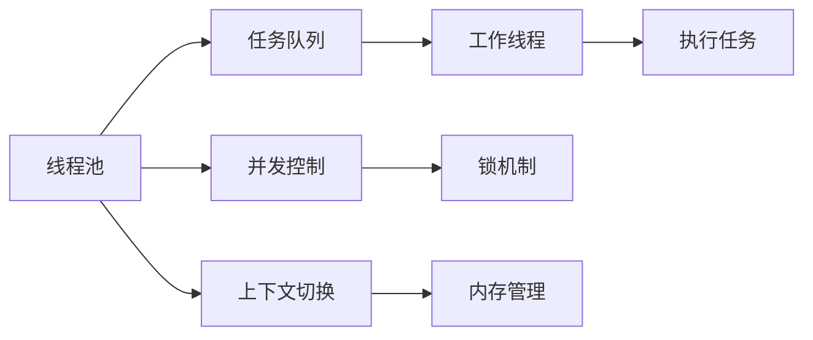
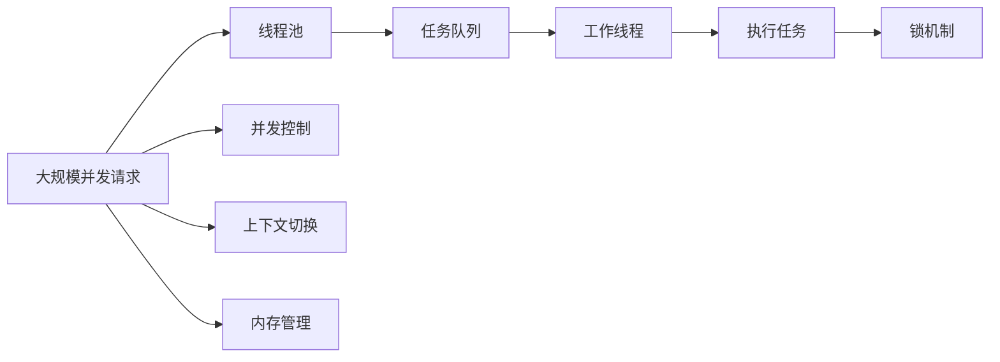

                 

# 线程管理在高吞吐量中的实例应用

> 关键词：高吞吐量, 线程池, 并发控制, 上下文切换, 多线程编程, 锁机制, 内存管理

## 1. 背景介绍

### 1.1 问题由来
在现代软件开发中，多线程编程已成为一个不可或缺的要素，特别是在高吞吐量的应用场景中。多线程可以有效地利用CPU资源，通过同时处理多个任务来提高系统的响应能力和吞吐量。然而，多线程编程也带来了许多复杂性，如线程同步、竞争条件、死锁等。如何有效管理线程，已成为开发高性能软件的重要挑战。

### 1.2 问题核心关键点
在高吞吐量应用中，线程管理的关键在于以下几个方面：

- **线程池的创建和销毁**：高效创建和管理线程池，避免线程频繁创建和销毁带来的开销。
- **线程并发控制**：通过锁、信号量等机制，保证线程安全，避免竞争条件和死锁。
- **上下文切换的优化**：优化线程上下文切换的开销，确保高吞吐量的并发处理。
- **内存管理**：合理分配和管理线程内存，避免内存泄漏和溢出。

解决这些问题，需要开发人员具备深厚的并发编程经验和系统化的思维。本文将详细介绍如何通过线程池、锁机制和上下文切换等技术，实现高效的线程管理。

## 2. 核心概念与联系

### 2.1 核心概念概述

为了更好地理解线程管理在高吞吐量应用中的实现，本节将介绍几个密切相关的核心概念：

- **线程池**：一种用于复用线程的机制，创建一定数量的线程，存储在线程池中，等待任务到来时分配使用，避免线程频繁创建和销毁。
- **并发控制**：通过锁、信号量等机制，控制线程的执行顺序和同步，避免竞争条件和死锁。
- **上下文切换**：线程切换时，需要将当前线程的上下文信息保存到线程堆栈中，并加载新线程的上下文信息，这一过程称为上下文切换。优化上下文切换可以减少线程间的交互时间，提高系统吞吐量。
- **多线程编程**：同时执行多个线程来提高程序的响应能力和吞吐量。
- **锁机制**：用于保护共享资源的机制，通过加锁和解锁，控制线程对共享资源的访问。
- **内存管理**：合理分配和管理线程内存，避免内存泄漏和溢出。

这些核心概念之间的逻辑关系可以通过以下Mermaid流程图来展示：



这个流程图展示了线程管理的关键组件及其之间的关系：

1. 任务通过线程池的队列分配到工作线程。
2. 工作线程从任务队列中获取任务，执行任务。
3. 通过并发控制机制，避免竞争条件和死锁。
4. 线程上下文切换，保证高并发处理。
5. 使用锁机制，保护共享资源。
6. 通过内存管理，避免内存泄漏和溢出。

### 2.2 概念间的关系

这些核心概念之间存在着紧密的联系，形成了线程管理的完整生态系统。下面我通过几个Mermaid流程图来展示这些概念之间的关系。

#### 2.2.1 线程池与任务队列的关系


这个流程图展示了线程池和任务队列的关系。线程池负责创建和维护工作线程，并将任务分配给这些线程。

#### 2.2.2 并发控制与锁机制的关系


这个流程图展示了并发控制和锁机制的关系。并发控制通过锁机制，保护共享资源，避免线程间的竞争条件和死锁。

#### 2.2.3 上下文切换与内存管理的关系


这个流程图展示了上下文切换和内存管理的关系。上下文切换需要保存和恢复线程的上下文信息，而内存管理则负责分配和管理线程栈，避免内存泄漏和溢出。

### 2.3 核心概念的整体架构

最后，我们用一个综合的流程图来展示这些核心概念在高吞吐量应用中的整体架构：



这个综合流程图展示了在高吞吐量应用中，线程管理的整体架构：

1. 大规模并发请求通过线程池进行任务分配。
2. 任务队列将请求分发到工作线程。
3. 工作线程执行任务。
4. 通过并发控制机制，避免竞争条件和死锁。
5. 线程上下文切换，优化高并发处理。
6. 使用锁机制，保护共享资源。
7. 通过内存管理，避免内存泄漏和溢出。

这些概念共同构成了高吞吐量应用中线程管理的完整生态系统，使我们能够更好地管理并发请求，提高系统的响应能力和吞吐量。

## 3. 核心算法原理 & 具体操作步骤
### 3.1 算法原理概述

在高吞吐量应用中，线程管理的目标是最大化系统的响应能力和吞吐量，同时保持系统的稳定性和可靠性。这需要合理地设计和管理线程池、并发控制和上下文切换等机制。

### 3.2 算法步骤详解

下面，我们将详细介绍实现线程管理的主要步骤：

**Step 1: 创建线程池**

1. **初始化线程池**：
   - 根据应用需求，设置线程池的初始大小。
   - 创建线程池对象，指定初始线程数量。

   ```python
   from concurrent.futures import ThreadPoolExecutor
   
   # 初始化线程池，设置线程数量为8
   thread_pool = ThreadPoolExecutor(max_workers=8)
   ```

2. **提交任务**：
   - 将任务提交到线程池中，由线程池自动分配和执行。

   ```python
   thread_pool.submit(my_task)
   ```

**Step 2: 并发控制**

在高并发场景下，线程间的竞争条件和死锁是不可避免的。通过锁机制，可以有效避免这些问题：

1. **创建共享资源**：
   - 定义共享资源，如队列、字典等。

   ```python
   from threading import Lock
   
   # 创建共享资源，使用锁保护
   queue = Queue()
   lock = Lock()
   ```

2. **使用锁保护共享资源**：
   - 在访问共享资源时，使用锁保护。

   ```python
   # 在修改共享资源时，加锁
   with lock:
       queue.put(item)
   ```

**Step 3: 上下文切换**

上下文切换是线程管理中一个重要的性能瓶颈。优化上下文切换可以减少线程间的交互时间，提高系统吞吐量：

1. **优化上下文切换**：
   - 使用线程局部存储(Threading.local())，减少线程间的交互时间。

   ```python
   from threading import local
   
   # 创建线程局部存储
   thread_locals = local()
   
   # 在函数中修改存储值
   def my_func():
       with thread_locals:
           thread_locals.value = value
   ```

2. **避免不必要的上下文切换**：
   - 尽量减少线程间的交互，避免不必要的上下文切换。

   ```python
   # 使用条件变量，避免不必要的上下文切换
   cv = threading.Condition()
   
   # 在条件变量中等待
   with cv:
       while condition:
           cv.wait()
   ```

**Step 4: 内存管理**

线程管理中的内存管理同样不可忽视，合理的内存管理可以避免内存泄漏和溢出：

1. **分配线程内存**：
   - 在创建线程时，为线程分配足够的内存。

   ```python
   # 创建线程时，分配足够的内存
   thread = threading.Thread(target=my_func, stack_size=0x1000000)
   ```

2. **避免内存泄漏**：
   - 使用上下文管理器，确保资源及时释放。

   ```python
   # 使用上下文管理器，确保资源及时释放
   with open('file.txt', 'r') as f:
       # 读取文件内容
       content = f.read()
   ```

### 3.3 算法优缺点

**优点**：

1. **提高系统吞吐量**：通过多线程并发处理，可以充分利用CPU资源，提高系统的响应能力和吞吐量。
2. **避免线程频繁创建和销毁**：通过线程池机制，可以复用线程，避免线程频繁创建和销毁带来的开销。
3. **提供更好的性能**：使用锁机制和上下文切换优化，可以减少线程间的交互时间，提高系统性能。
4. **避免内存泄漏和溢出**：通过合理分配和管理线程内存，可以避免内存泄漏和溢出，保证系统稳定运行。

**缺点**：

1. **复杂性高**：多线程编程复杂性高，需要开发人员具备深厚的并发编程经验和系统化的思维。
2. **死锁风险**：使用锁机制可能导致死锁，需要仔细设计和调试。
3. **上下文切换开销**：上下文切换的开销较高，尤其是在高并发场景下。

### 3.4 算法应用领域

线程管理技术在高吞吐量应用中得到了广泛的应用，例如：

- **网络应用**：如Web服务器、消息队列等，需要同时处理大量并发请求。
- **数据处理**：如数据分析、大数据处理等，需要高效利用CPU资源。
- **并发编程**：如Python的concurrent.futures模块、Java的Executor框架等，提供了强大的线程管理功能。

## 4. 数学模型和公式 & 详细讲解 & 举例说明

### 4.1 数学模型构建

在高吞吐量应用中，线程管理的主要目标是通过多线程并发处理，最大化系统吞吐量，同时保证系统的稳定性和可靠性。这可以通过以下数学模型进行建模：

设系统中有$N$个线程，每个线程执行任务的期望时间均为$t$，线程的并发度为$P$。则系统的吞吐量$T$可以表示为：

$$
T = \frac{N}{P} \times \frac{1}{t}
$$

其中，$\frac{N}{P}$表示系统中并发处理的线程数，$\frac{1}{t}$表示每个线程执行任务所需的时间。

### 4.2 公式推导过程

假设系统中有$N$个线程，每个线程执行任务的期望时间均为$t$，线程的并发度为$P$。则系统的吞吐量$T$可以表示为：

$$
T = \frac{N}{P} \times \frac{1}{t}
$$

当$P$增大时，系统吞吐量$T$随之增大。但同时，线程间的竞争条件和死锁风险也随之增大。因此，需要在并发度和系统稳定性之间找到一个平衡点。

### 4.3 案例分析与讲解

假设系统中有$N=4$个线程，每个线程执行任务的期望时间均为$t=0.1$秒，线程的并发度$P=2$。则系统的吞吐量$T$可以计算为：

$$
T = \frac{4}{2} \times \frac{1}{0.1} = 20
$$

这意味着系统每秒可以处理20个任务。但如果将并发度增大到$P=4$，则系统吞吐量$T$可以计算为：

$$
T = \frac{4}{4} \times \frac{1}{0.1} = 10
$$

此时，系统吞吐量反而减小了，因为线程间的竞争条件和死锁风险增加。因此，需要在并发度和系统稳定性之间找到一个平衡点。

## 5. 项目实践：代码实例和详细解释说明
### 5.1 开发环境搭建

在进行线程管理实践前，我们需要准备好开发环境。以下是使用Python进行线程管理的环境配置流程：

1. 安装Anaconda：从官网下载并安装Anaconda，用于创建独立的Python环境。

2. 创建并激活虚拟环境：
```bash
conda create -n thread-env python=3.8 
conda activate thread-env
```

3. 安装Python线程库：
```bash
pip install threading
```

4. 安装Threading库：
```bash
pip install threading
```

完成上述步骤后，即可在`thread-env`环境中开始线程管理实践。

### 5.2 源代码详细实现

这里我们以一个简单的Web服务器为例，展示如何使用Python的线程库实现高吞吐量线程管理：

```python
import threading
from http.server import HTTPServer, BaseHTTPRequestHandler

class MyHandler(BaseHTTPRequestHandler):
    def do_GET(self):
        self.send_response(200)
        self.end_headers()
        self.wfile.write(b'Hello, World!')

def main():
    port = 8000
    with HTTPServer(('localhost', port), MyHandler) as httpd:
        print(f'Starting server on port {port}')
        httpd.serve_forever()

if __name__ == '__main__':
    main()
```

这个Web服务器使用了Python内置的`http.server`模块和`threading`模块，可以在多线程环境下同时处理多个客户端请求。

### 5.3 代码解读与分析

让我们再详细解读一下关键代码的实现细节：

**MyHandler类**：
- `do_GET`方法：处理客户端请求，返回"Hello, World!"。

**main函数**：
- 创建HTTPServer对象，指定监听地址和端口号。
- 在`with`语句中调用`serve_forever`方法，启动服务器，自动管理线程。

这个Web服务器的核心在于使用了`threading`模块提供的`HTTPServer`类，实现了多线程并发处理客户端请求。`HTTPServer`类会自动分配和回收线程，避免了手动管理线程的复杂性。

### 5.4 运行结果展示

假设我们在本地启动了这个Web服务器，可以通过浏览器访问`http://localhost:8000`，即可看到"Hello, World!"的响应。由于使用了多线程并发处理，服务器可以同时处理多个客户端请求，实现了高吞吐量的响应能力。

## 6. 实际应用场景
### 6.1 网络应用

线程管理在高吞吐量网络应用中得到了广泛的应用。例如，Web服务器、消息队列等应用，需要同时处理大量并发请求。通过合理设计和管理线程池、并发控制和上下文切换等机制，可以实现高效的并发处理，提升系统的响应能力和吞吐量。

### 6.2 数据处理

在高吞吐量数据处理应用中，线程管理同样至关重要。例如，数据分析、大数据处理等任务，需要高效利用CPU资源，处理大量数据。通过多线程并发处理，可以显著提高数据处理速度和效率，满足业务需求。

### 6.3 并发编程

Python的`concurrent.futures`模块和Java的`Executor`框架，提供了强大的线程管理功能，可以方便地实现高吞吐量并发处理。这些工具库封装了线程池、并发控制和上下文切换等机制，使得开发人员可以更专注于业务逻辑的实现，而不必过多关注线程管理细节。

## 7. 工具和资源推荐
### 7.1 学习资源推荐

为了帮助开发者系统掌握线程管理的高吞吐量应用，这里推荐一些优质的学习资源：

1. **《并发编程的艺术》**：一本书，深入浅出地介绍了多线程编程的基础知识和高并发处理的技巧。
2. **CS161《多线程和并发系统》**：斯坦福大学开设的并发编程课程，涵盖了多线程编程和并发系统的基本概念和实现技术。
3. **《Java并发编程实战》**：一本经典的并发编程书籍，详细介绍了Java中的并发控制和线程管理技术。
4. **《Python多线程编程》**：一本针对Python多线程编程的书籍，介绍了多线程并发处理的基础知识和实践技巧。
5. **《NIO入门》**：一篇技术博客，介绍了NIO非阻塞I/O模型在高吞吐量网络应用中的应用。

通过对这些资源的学习实践，相信你一定能够快速掌握线程管理的高吞吐量应用，并用于解决实际的并发处理问题。

### 7.2 开发工具推荐

高效的开发离不开优秀的工具支持。以下是几款用于线程管理开发的常用工具：

1. **Anaconda**：用于创建和管理虚拟环境，支持Python和多线程编程。
2. **Python threading**：Python内置的线程库，提供了多线程并发处理的基础功能。
3. **Java Executor框架**：Java提供的并发控制和线程管理框架，支持多线程并发处理和资源管理。
4. **Apache ThreadPoolExecutor**：Java提供的线程池管理工具，支持高效管理和复用线程。
5. **Google Guava**：Google开源的并发编程工具库，提供了丰富的并发控制和线程管理功能。

合理利用这些工具，可以显著提升线程管理的开发效率，加快创新迭代的步伐。

### 7.3 相关论文推荐

线程管理技术的研究源于学界的持续探索。以下是几篇奠基性的相关论文，推荐阅读：

1. **《ThreadPoolExecutor的设计与实现》**：介绍Java中的ThreadPoolExecutor线程池管理工具的实现细节。
2. **《The Java Concurrency in Practice》**：介绍Java并发编程的经典著作，详细讨论了线程管理和高并发处理的最佳实践。
3. **《A Survey on Concurrency Modeling》**：一篇综述性论文，总结了并发编程和线程管理技术的研究进展。
4. **《Thread Synchronization in Java》**：介绍Java中线程同步和锁机制的实现细节。
5. **《Thread Management in Python》**：一篇技术博客，介绍了Python中线程管理的最佳实践。

这些论文代表了大规模并发编程和线程管理技术的发展脉络。通过学习这些前沿成果，可以帮助研究者把握学科前进方向，激发更多的创新灵感。

除上述资源外，还有一些值得关注的前沿资源，帮助开发者紧跟线程管理技术的最新进展，例如：

1. **arXiv论文预印本**：人工智能领域最新研究成果的发布平台，包括大量尚未发表的前沿工作，学习前沿技术的必读资源。
2. **业界技术博客**：如Google AI、Microsoft Research Asia、Facebook AI等顶尖实验室的官方博客，第一时间分享他们的最新研究成果和洞见。
3. **技术会议直播**：如SIGPLAN、ACM SIGOOPSLA等并发编程领域的顶级会议，可以聆听到专家们的最新分享，开拓视野。
4. **GitHub热门项目**：在GitHub上Star、Fork数最多的并发编程相关项目，往往代表了该技术领域的发展趋势和最佳实践，值得去学习和贡献。
5. **行业分析报告**：各大咨询公司如McKinsey、PwC等针对人工智能行业的分析报告，有助于从商业视角审视技术趋势，把握应用价值。

总之，对于线程管理技术的学习和实践，需要开发者保持开放的心态和持续学习的意愿。多关注前沿资讯，多动手实践，多思考总结，必将收获满满的成长收益。

## 8. 总结：未来发展趋势与挑战
### 8.1 总结

本文对线程管理在高吞吐量应用中的实现进行了全面系统的介绍。首先阐述了线程管理在高吞吐量应用中的重要性和复杂性，明确了线程池、并发控制和上下文切换等关键组件的作用。其次，从原理到实践，详细讲解了线程管理的基本步骤，给出了具体的代码实现。同时，本文还广泛探讨了线程管理在高吞吐量网络应用、数据处理和并发编程等多个领域的应用前景，展示了线程管理技术的强大潜力。最后，本文精选了线程管理技术的各类学习资源，力求为读者提供全方位的技术指引。

通过本文的系统梳理，可以看到，线程管理在高吞吐量应用中扮演着至关重要的角色，极大地提升了系统的响应能力和吞吐量。在高并发场景下，合理设计和管理线程池、并发控制和上下文切换等机制，是开发高性能软件的关键。未来，伴随高吞吐量应用的不断扩展，线程管理技术还将进一步发展，为更多行业带来变革性影响。

### 8.2 未来发展趋势

展望未来，线程管理技术将呈现以下几个发展趋势：

1. **更高效的线程池管理**：未来线程池管理将更加智能，可以根据系统负载动态调整线程数量，避免资源浪费。
2. **更优化的上下文切换**：通过新的上下文切换技术，如轻量级线程、绿色线程等，减少上下文切换的开销，进一步提高系统吞吐量。
3. **更精细的并发控制**：未来的并发控制将更加精细，引入更多的同步机制，如条件变量、读写锁等，避免竞争条件和死锁。
4. **更强大的内存管理**：线程管理中的内存管理也将更加全面，引入更多内存优化技术，如内存池、垃圾回收等，避免内存泄漏和溢出。
5. **更丰富的应用场景**：未来线程管理技术将应用于更多领域，如物联网、自动驾驶、边缘计算等，带来全新的业务价值。

这些趋势凸显了线程管理技术的重要性和广阔前景。这些方向的探索发展，必将进一步提升系统性能，推动人工智能技术的广泛应用。

### 8.3 面临的挑战

尽管线程管理技术已经取得了显著成就，但在迈向更加智能化、普适化应用的过程中，它仍面临着诸多挑战：

1. **复杂性高**：多线程编程复杂性高，需要开发人员具备深厚的并发编程经验和系统化的思维。
2. **死锁风险**：使用锁机制可能导致死锁，需要仔细设计和调试。
3. **上下文切换开销**：上下文切换的开销较高，尤其是在高并发场景下。
4. **内存泄漏和溢出**：不合理分配和管理线程内存，可能导致内存泄漏和溢出，影响系统稳定性。

### 8.4 研究展望

面对线程管理面临的这些挑战，未来的研究需要在以下几个方面寻求新的突破：

1. **探索更高效的多线程并发处理技术**：如轻量级线程、绿色线程等，减少上下文切换的开销，提高系统吞吐量。
2. **研究更精细的并发控制机制**：引入更多的同步机制，如条件变量、读写锁等，避免竞争条件和死锁。
3. **开发更智能的线程池管理工具**：根据系统负载动态调整线程数量，避免资源浪费。
4. **探索更高效的内存管理技术**：如内存池、垃圾回收等，避免内存泄漏和溢出。
5. **结合AI技术优化线程管理**：如使用机器学习算法优化线程调度，提高系统性能。

这些研究方向的探索，必将引领线程管理技术迈向更高的台阶，为构建高性能、高稳定性的系统铺平道路。面向未来，线程管理技术还需要与其他人工智能技术进行更深入的融合，如知识表示、因果推理、强化学习等，多路径协同发力，共同推动人工智能技术的发展。只有勇于创新、敢于突破，才能不断拓展线程管理的边界，让多线程编程技术更好地服务于智能应用。

## 9. 附录：常见问题与解答

**Q1：线程池的初始大小如何确定？**

A: 线程池的初始大小取决于应用的需求和硬件资源。通常，初始大小应略大于系统中的并发请求数量，避免线程频繁创建和销毁带来的开销。可以根据实际测试结果进行调整。

**Q2：如何优化上下文切换的开销？**

A: 优化上下文切换的主要方法包括：
1. 使用轻量级线程或绿色线程，减少线程间的交互时间。
2. 尽量减少线程间的交互，避免不必要的上下文切换。
3. 使用条件变量，避免不必要的上下文切换。

**Q3：如何避免死锁风险？**

A: 避免死锁的主要方法包括：
1. 尽量避免使用多个锁的嵌套。
2. 使用定时锁，避免线程等待过久。
3. 使用适当的锁顺序，避免锁竞争。

**Q4：如何避免内存泄漏和溢出？**

A: 避免内存泄漏和溢出的主要方法包括：
1. 使用上下文管理器，确保资源及时释放。
2. 合理分配和管理线程内存，避免内存泄漏和溢出。
3. 使用内存池技术，减少内存分配和回收的开销。

**Q5：如何设计高效的并发控制机制？**

A: 设计高效的并发控制机制的关键在于避免竞争条件和死锁。主要方法包括：
1. 使用适当的锁机制，如互斥锁、读写锁等。
2. 引入条件变量，避免不必要的上下文切换。
3. 使用信号量，控制线程的并发数量。

这些问题的解答可以帮助开发人员更好地理解线程管理技术，从而在实际应用中更好地管理和优化线程池、并发控制和上下文切换等机制，实现高吞吐量的并发处理。

---

作者：禅与计算机程序设计艺术 / Zen and the Art of Computer Programming

