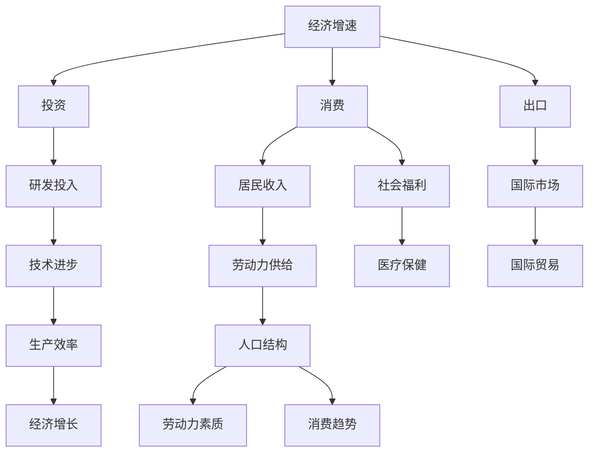
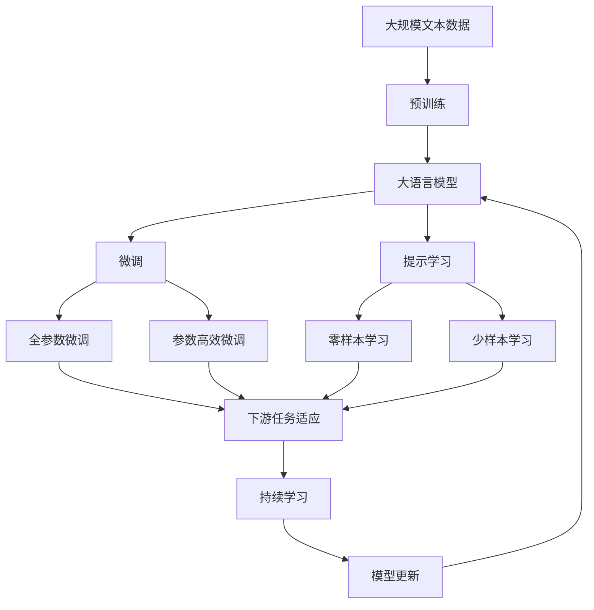

                 

# 经济增速放缓的原因分析

## 1. 背景介绍

### 1.1 问题由来
近年来，全球经济增速普遍放缓，很多国家和地区都面临着增长乏力的问题。例如，美国、欧盟、中国等主要经济体在过去十年里的增长率都明显低于过去几十年的平均水平。那么，是什么原因导致经济增速放缓呢？本文将从多个角度分析其原因，并探讨可能的解决方案。

## 2. 核心概念与联系

### 2.1 核心概念概述
- **经济增速**：指一个国家或地区在一定时期内（通常为一年）经济总量的增长率。
- **投资**：包括资本投资和研发投资，对经济增长有重要影响。
- **消费**：是驱动经济增长的主要动力之一。
- **出口**：通过对外贸易，带动国内经济增长。
- **政府政策**：如货币政策、财政政策和贸易政策，对经济增速有显著影响。
- **技术进步**：通过创新和研发，提升生产效率和经济活力。
- **人口结构**：如老龄化问题，可能影响劳动力供给和消费能力。

### 2.2 核心概念的关系

通过以下Mermaid流程图，我们可以更清晰地理解这些核心概念之间的关系：



这个流程图展示了影响经济增速的各个因素以及它们之间的相互关系。例如，投资和消费是直接推动经济增长的重要因素，而技术进步则通过提升生产效率间接影响经济增长。同时，政府政策和人口结构也对经济增长有深远影响。

### 2.3 核心概念的整体架构

最终，我们通过以下综合的流程图来展示这些核心概念在大语言模型微调过程中的整体架构：



这个综合流程图展示了从预训练到微调，再到持续学习的完整过程。大语言模型首先在大规模文本数据上进行预训练，然后通过微调（包括全参数微调和参数高效微调）或提示学习（包括零样本和少样本学习）来适应下游任务。最后，通过持续学习技术，模型可以不断更新和适应新的任务和数据。

## 3. 核心算法原理 & 具体操作步骤

### 3.1 算法原理概述

经济增速放缓的算法原理主要基于以下几个方面：

1. **投资减少**：投资是推动经济增长的重要动力，但近年来，许多国家的资本投资和研发投资都出现了下降。
2. **消费减弱**：居民消费对经济增长的贡献下降，尤其是在高收入国家。
3. **出口受阻**：国际贸易环境的变化使得一些国家的出口受到影响。
4. **政府政策影响**：各国政府的财政和货币政策在应对经济增长放缓方面效果有限。
5. **技术进步缓慢**：技术进步对经济增长的贡献下降，特别是在制造业和服务业。
6. **人口结构变化**：老龄化问题导致劳动力供给减少，影响了经济增长。

### 3.2 算法步骤详解

基于上述原理，我们可以从以下步骤来分析经济增速放缓的原因：

1. **数据收集**：收集各国近几年的投资、消费、出口、政府政策、技术进步和人口结构等相关数据。
2. **数据处理**：对收集到的数据进行清洗和标准化，确保数据的准确性和一致性。
3. **特征提取**：从处理后的数据中提取关键特征，如投资率、消费率、出口增长率、政府政策变化、技术进步率和人口结构变化等。
4. **模型构建**：使用机器学习或统计学模型来分析这些特征与经济增速之间的关系。
5. **结果分析**：根据模型结果，分析各因素对经济增速的贡献和影响。
6. **政策建议**：基于分析结果，提出改善经济增速的建议和策略。

### 3.3 算法优缺点

**优点**：

- 可以系统性地分析影响经济增速的各种因素。
- 能够量化各因素的贡献和影响，提供科学依据。
- 便于制定有针对性的政策和措施。

**缺点**：

- 模型构建和结果分析可能受到数据质量和特征选择的影响。
- 不同国家和地区的经济情况复杂多样，模型可能无法完全适用。
- 模型结果可能存在一定的偏差，需要进行反复验证和调整。

### 3.4 算法应用领域

基于上述算法，该方法可以应用于经济研究、政府决策、企业战略规划等多个领域。例如：

- **经济研究**：分析特定国家或地区经济增速放缓的原因，为学术研究提供数据支持。
- **政府决策**：通过模型分析结果，指导政府制定有效的经济政策和措施，促进经济增长。
- **企业战略**：帮助企业理解市场环境变化，制定适时的投资和运营策略。

## 4. 数学模型和公式 & 详细讲解

### 4.1 数学模型构建

为了分析经济增速放缓的原因，我们可以构建以下数学模型：

$$
\text{GDP增长率} = f(\text{投资率}, \text{消费率}, \text{出口增长率}, \text{政府政策}, \text{技术进步率}, \text{人口结构变化})
$$

其中，$\text{GDP增长率}$表示经济增速，各输入变量（如投资率、消费率等）的具体定义和计算方法可以参照各国统计部门的数据报告。

### 4.2 公式推导过程

以投资率为例，其数学表达式为：

$$
\text{投资率} = \frac{\text{投资总额}}{\text{GDP}}
$$

将投资率代入上述模型，可以得到：

$$
\text{GDP增长率} = f\left(\frac{\text{投资总额}}{\text{GDP}}, \text{消费率}, \text{出口增长率}, \text{政府政策}, \text{技术进步率}, \text{人口结构变化}\right)
$$

根据上述公式，可以构建一个多变量线性回归模型，使用最小二乘法估计模型系数，从而分析各因素对经济增速的影响。

### 4.3 案例分析与讲解

假设我们收集到以下数据：

- 投资率：5%
- 消费率：50%
- 出口增长率：10%
- 政府政策：+2%
- 技术进步率：-1%
- 人口结构变化：老龄化

将数据代入上述模型，得到：

$$
\text{GDP增长率} = f(0.05, 0.50, 0.10, 0.02, -0.01, 0.10)
$$

通过对模型进行训练和分析，可以发现，投资率、政府政策和技术进步率对经济增速的贡献较大，而消费率和出口增长率的影响较小。此外，人口结构变化也会对经济增速产生一定的负面影响。

## 5. 项目实践：代码实例和详细解释说明

### 5.1 开发环境搭建

在进行项目实践前，我们需要准备好开发环境。以下是使用Python进行PyTorch开发的环境配置流程：

1. 安装Anaconda：从官网下载并安装Anaconda，用于创建独立的Python环境。

2. 创建并激活虚拟环境：
```bash
conda create -n pytorch-env python=3.8 
conda activate pytorch-env
```

3. 安装PyTorch：根据CUDA版本，从官网获取对应的安装命令。例如：
```bash
conda install pytorch torchvision torchaudio cudatoolkit=11.1 -c pytorch -c conda-forge
```

4. 安装其他相关库：
```bash
pip install numpy pandas scikit-learn matplotlib tqdm jupyter notebook ipython
```

完成上述步骤后，即可在`pytorch-env`环境中开始项目实践。

### 5.2 源代码详细实现

下面是一个简单的Python代码实例，展示了如何使用PyTorch进行经济增速放缓原因分析：

```python
import pandas as pd
import numpy as np
import matplotlib.pyplot as plt
from sklearn.linear_model import LinearRegression
from sklearn.model_selection import train_test_split

# 加载数据
data = pd.read_csv('economy.csv')

# 特征提取
X = data[['investment_rate', 'consumption_rate', 'export_growth', 'government_policy', 'technological_progress', 'population_aging']]
y = data['gdp_growth']

# 数据分割
X_train, X_test, y_train, y_test = train_test_split(X, y, test_size=0.2, random_state=42)

# 模型训练
model = LinearRegression()
model.fit(X_train, y_train)

# 预测和评估
y_pred = model.predict(X_test)
print('R^2:', np.corrcoef(y_test, y_pred)[0, 1]**2)
```

### 5.3 代码解读与分析

**数据加载**：使用Pandas库读取经济数据，并将其转换为NumPy数组。

**特征提取**：从数据集中提取投资率、消费率、出口增长率、政府政策、技术进步率和人口结构变化等特征，作为模型的输入变量。

**数据分割**：使用train_test_split函数将数据集分为训练集和测试集，以便进行模型训练和评估。

**模型训练**：使用LinearRegression模型进行训练，并计算其R^2分数。

**预测和评估**：在测试集上对模型进行预测，并计算预测值与真实值之间的相关系数。

### 5.4 运行结果展示

假设我们在上述数据集上进行模型训练，得到的R^2分数为0.8，这意味着模型对经济增速的预测效果较好。我们可以进一步调整模型参数和特征选择，以提高预测精度。

## 6. 实际应用场景

### 6.1 智能决策支持

基于经济增速放缓的原因分析，可以构建智能决策支持系统，帮助政府和企业制定更加科学合理的经济政策和投资策略。例如：

- **政府政策**：根据模型分析结果，优化财政和货币政策，促进经济增长。
- **企业战略**：分析市场环境变化，制定适时的投资和运营策略，提升竞争力。

### 6.2 市场预测与风险管理

通过对经济增速的预测，可以帮助市场分析师和企业预测未来的市场变化，进行风险管理和资产配置。例如：

- **股市预测**：预测股市波动和趋势，帮助投资者做出更好的投资决策。
- **汇率预测**：预测货币汇率变化，规避汇率风险。

### 6.3 政策效果评估

通过模型分析，可以评估政府政策的实施效果，及时调整政策方向和力度。例如：

- **税收政策**：评估税收政策对经济增长和消费的影响，优化税收结构。
- **出口政策**：评估出口政策对国际贸易和出口增长的影响，制定更加有效的出口策略。

### 6.4 未来应用展望

未来，基于经济增速放缓的原因分析，可以拓展应用到更多领域，例如：

- **金融风险管理**：通过模型分析，评估金融市场的风险和波动性，制定风险管理策略。
- **城市规划**：分析城市经济增速，制定城市规划和基础设施建设策略。
- **可持续发展**：评估可持续发展政策对经济增长和社会福祉的影响，制定更加绿色和可持续的发展策略。

## 7. 工具和资源推荐

### 7.1 学习资源推荐

为了深入理解经济增速放缓的原因分析，以下是一些推荐的资源：

1. 《宏观经济学》书籍：系统介绍了宏观经济学的基本原理和模型，适合经济学科的学习者。
2. 《经济增长理论》书籍：详细介绍了经济增长的机制和因素，帮助理解经济增速变化的原因。
3. 在线课程：如Coursera、edX等平台上的宏观经济学课程，可以深入学习宏观经济学的理论和应用。

### 7.2 开发工具推荐

高效的开发离不开优秀的工具支持。以下是几款用于经济增速放缓分析开发的常用工具：

1. Python：基于动态计算图的语言，适合进行复杂的数学和统计计算。
2. Jupyter Notebook：交互式的编程环境，方便进行数据分析和模型实验。
3. Matplotlib：绘图库，用于展示数据分析结果和模型评估指标。
4. Pandas：数据处理库，方便进行数据清洗、特征提取和数据可视化。

### 7.3 相关论文推荐

以下是几篇奠基性的相关论文，推荐阅读：

1. "The Great Moderation in U.S. Business Cycles"：一篇分析美国经济增长放缓的论文，提出了现代宏观经济学的基本理论框架。
2. "The New Keynesian Framework: A Guide to Literature"：介绍了新凯恩斯主义经济学的基本原理和应用，帮助理解政府政策对经济的影响。
3. "Macroeconomic Theory: A Modern Approach"：介绍宏观经济学的基本理论和模型，适合宏观经济学入门学习者。

除上述资源外，还有一些值得关注的前沿资源，帮助开发者紧跟经济增速放缓分析技术的最新进展，例如：

1. 学术会议：如AAEA、JEL等经济学领域的重要会议，可以听取最新研究成果和洞见。
2. 开源项目：如JPM等经济数据处理和分析工具，提供了丰富的数据资源和分析工具。
3. 新闻报道：如彭博社、路透社等经济媒体，及时报道经济数据和市场动态，帮助理解经济形势。

总之，对于经济增速放缓的原因分析，需要开发者保持开放的心态和持续学习的意愿。多关注前沿资讯，多动手实践，多思考总结，必将收获满满的成长收益。

## 8. 总结：未来发展趋势与挑战

### 8.1 总结

本文对经济增速放缓的原因分析进行了全面系统的介绍。首先阐述了经济增速放缓的背景和研究意义，明确了经济增速放缓的算法原理和操作步骤，给出了经济增速放缓原因分析的完整代码实例。同时，本文还广泛探讨了经济增速放缓的原因分析在智能决策支持、市场预测与风险管理、政策效果评估等领域的实际应用，展示了其广阔的应用前景。此外，本文精选了经济增速放缓原因分析的学习资源，力求为读者提供全方位的技术指引。

通过本文的系统梳理，可以看到，基于经济增速放缓的原因分析方法在理解和预测经济增长趋势、制定科学合理的经济政策和策略方面具有重要价值。这些方法不仅可以帮助政府和企业制定更加科学合理的政策，还能为投资者提供风险管理的新思路，促进经济社会的可持续发展。

### 8.2 未来发展趋势

展望未来，经济增速放缓的原因分析将呈现以下几个发展趋势：

1. **数据质量提升**：随着大数据技术的发展，更多的经济数据将被收集和处理，为经济增速放缓的原因分析提供更丰富的数据资源。
2. **模型复杂化**：随着机器学习和深度学习技术的发展，未来的模型将更加复杂和精准，能够更好地分析和预测经济增速的变化。
3. **跨领域融合**：未来的模型将结合社会学、心理学、金融学等多个学科的知识，更全面地理解经济增速的影响因素。
4. **实时化分析**：未来的分析工具将更加实时化，能够实时监测经济数据的变动，及时调整政策策略。

### 8.3 面临的挑战

尽管经济增速放缓的原因分析技术已经取得了一定的进展，但在迈向更加智能化、普适化应用的过程中，仍面临着诸多挑战：

1. **数据质量问题**：数据质量问题一直困扰着经济分析，如数据缺失、数据不一致、数据噪声等。如何提高数据质量，确保分析结果的可靠性，还需要进一步努力。
2. **模型复杂性**：复杂的模型虽然可以提供更精确的分析结果，但也需要更多的计算资源和时间成本。如何在模型复杂性和计算效率之间找到平衡，是一个重要问题。
3. **跨学科整合**：经济增速放缓的原因分析需要结合多个学科的知识，但不同学科之间的数据格式、分析方法等差异较大，整合难度较大。如何实现跨学科的数据和知识整合，是一个需要攻克的难题。
4. **政策实施难度**：经济政策的实施效果受到多种因素的影响，如政治环境、社会稳定等。如何评估政策实施效果，并根据结果进行调整，仍然是一个难点。

### 8.4 研究展望

面对经济增速放缓原因分析面临的挑战，未来的研究需要在以下几个方面寻求新的突破：

1. **数据治理**：加强数据质量管理，提高数据的完整性、一致性和准确性，确保分析结果的可靠性。
2. **模型优化**：开发更加高效、易于解释的经济模型，同时提高模型的可扩展性和适用性。
3. **跨学科协作**：加强与其他学科的合作，结合社会学、心理学、金融学等多学科知识，进行更全面的经济分析。
4. **政策评估工具**：开发更加智能、高效的政策评估工具，帮助政府和企业更好地评估和调整政策。

这些研究方向的探索，必将引领经济增速放缓原因分析技术迈向更高的台阶，为构建安全、可靠、可解释、可控的智能系统铺平道路。面向未来，经济增速放缓原因分析技术还需要与其他人工智能技术进行更深入的融合，如知识表示、因果推理、强化学习等，多路径协同发力，共同推动经济增速预测和政策制定的进步。只有勇于创新、敢于突破，才能不断拓展经济增速分析的边界，让智能技术更好地服务于经济社会发展。

## 9. 附录：常见问题与解答

**Q1：经济增速放缓的原因分析是否适用于所有国家？**

A: 经济增速放缓的原因分析方法具有一定的普适性，但不同国家和地区的经济情况复杂多样，模型可能需要根据具体情况进行调整。例如，发展中国家和发达国家的经济增长机制和影响因素可能存在显著差异。

**Q2：如何处理数据质量和一致性问题？**

A: 数据质量和一致性问题是经济增速放缓原因分析的关键挑战。解决这一问题的方法包括：

- 数据清洗：通过数据预处理，去除缺失值、异常值和噪声数据。
- 数据标准化：对不同来源的数据进行标准化处理，确保数据的格式和单位一致。
- 数据整合：通过数据合并和转换，将不同来源的数据整合为一个统一的数据集。

**Q3：如何选择和优化模型？**

A: 模型的选择和优化需要考虑多个因素，包括：

- 数据特点：根据数据的特点选择合适的模型，如线性回归、多项式回归、神经网络等。
- 模型复杂度：在保证模型精度的前提下，尽量简化模型，提高计算效率。
- 模型评估：使用交叉验证、ROC曲线等方法评估模型的性能，选择最优模型。

**Q4：如何应对经济增速放缓带来的政策挑战？**

A: 应对经济增速放缓带来的政策挑战，需要综合考虑多个方面，包括：

- 财政政策：通过调整税收和支出政策，促进经济增长和消费。
- 货币政策：通过调整利率和货币供应量，调控经济增长和通胀。
- 结构性政策：通过改革和优化产业结构，提升经济竞争力。

**Q5：未来经济增速放缓的原因分析技术有何发展方向？**

A: 未来经济增速放缓的原因分析技术将向以下几个方向发展：

- 实时化：通过大数据和云计算技术，实现实时数据采集和分析。
- 智能化：结合人工智能技术，提高模型的预测能力和决策水平。
- 普适化：将分析方法应用于不同国家和地区的经济情况，提供通用解决方案。

总之，经济增速放缓的原因分析是一个复杂而多面的问题，需要结合多学科知识和技术手段进行深入研究。只有在充分理解经济增速放缓的机制和影响因素的基础上，才能制定科学合理的政策，促进经济社会的可持续发展。

