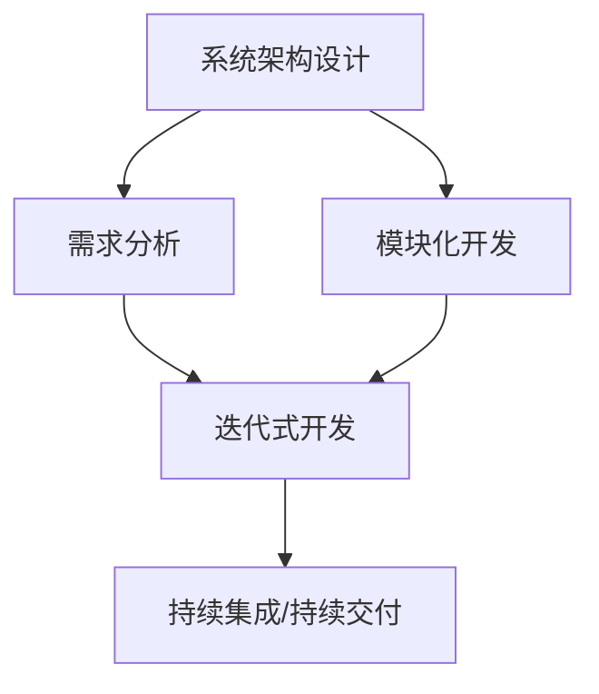

                 

# 结构化思维的力量：从思维到行动

结构化思维的力量在于它帮助我们在面对复杂问题时，能够条理清晰、逻辑严密地进行分析和解决。在IT领域，这种思维方式不仅在软件开发、系统设计等技术方面发挥着重要作用，也在项目管理、需求分析、用户体验设计等非技术领域有着广泛应用。本文旨在深入探讨结构化思维的本质，并结合具体案例，阐述其在技术开发和项目管理中的实践应用。

## 1. 背景介绍

### 1.1 问题由来
在现代软件开发中，系统变得越来越复杂，功能需求不断增长，这使得传统的“线性”工作方式（即从头到尾按顺序完成任务）已经无法满足需求。结构化思维的出现，是为了应对这种变化，提供一种更加灵活、系统的开发方式。

结构化思维的核心在于将复杂问题拆解为多个可管理的子问题，通过系统化的分析、设计、测试和迭代，最终得出整体解决方案。这种思维方式不仅有助于提高项目的成功率，还能提升开发效率和质量。

### 1.2 问题核心关键点
结构化思维的关键点在于其系统化的工作方式，主要包括以下几个方面：

- **问题分解**：将大问题拆解为若干小问题，逐一解决。
- **任务管理**：通过明确的任务列表和优先级，确保每个任务都有负责人和时间节点。
- **文档化**：所有决策和变化都需记录在案，确保可追溯性和可复现性。
- **反馈机制**：建立高效的反馈循环，快速发现并解决问题。
- **迭代开发**：采用敏捷开发方法，不断迭代优化，逐步完善系统。

这些关键点共同构成了结构化思维的工作模式，使其成为项目管理、软件开发等领域的通用工具。

### 1.3 问题研究意义
研究结构化思维的实践意义在于：

- **提升项目成功率**：系统化的管理方式可以减少误解和错误，提高项目交付质量。
- **提高开发效率**：通过模块化和迭代式开发，加快开发速度，缩短产品上市时间。
- **增强团队协作**：明确的任务分工和反馈机制，促进团队协作和沟通。
- **优化用户体验**：系统化的需求分析和设计，提升用户体验和满意度。
- **应对变化**：灵活的任务管理方式，使项目能够快速适应市场和技术变化。

## 2. 核心概念与联系

### 2.1 核心概念概述
结构化思维涉及多个核心概念，以下是对它们的详细解释：

- **系统架构设计**：定义系统的整体框架和组件，确保系统结构清晰、模块化。
- **需求分析**：通过调研和用户反馈，明确系统功能和需求。
- **模块化开发**：将系统功能分解为多个可管理的模块，并行开发和测试。
- **迭代式开发**：采用敏捷开发方法，不断迭代完善系统，提高开发效率和质量。
- **持续集成/持续交付**（CI/CD）：通过自动化测试和部署流程，确保代码的快速发布和更新。

这些概念共同构成了结构化思维的核心框架，适用于各种IT项目的开发和管理。

### 2.2 概念间的关系

结构化思维涉及的概念之间存在密切联系，以下通过几个Mermaid流程图展示它们的关系：



这个流程图展示了结构化思维从系统设计到需求分析、模块化开发、迭代式开发和持续交付的全过程。这些概念相互依赖、相互促进，共同保障项目的成功实施。

## 3. 核心算法原理 & 具体操作步骤

### 3.1 算法原理概述
结构化思维的核心算法原理主要包括：

- **问题分解**：通过模块化和分层设计，将复杂问题拆解为若干小问题，并逐一解决。
- **任务管理**：通过任务列表和优先级管理，确保每个任务都有明确的时间节点和负责人。
- **迭代开发**：采用敏捷开发方法，通过多次迭代，逐步完善系统功能和性能。
- **持续集成/持续交付**：通过自动化测试和部署流程，确保代码的快速发布和更新。

这些原理构成了结构化思维的底层逻辑，使其能够在各种项目中灵活应用。

### 3.2 算法步骤详解

结构化思维的具体操作步骤如下：

1. **系统架构设计**：定义系统的整体框架和组件，确保系统结构清晰、模块化。
2. **需求分析**：通过调研和用户反馈，明确系统功能和需求。
3. **模块化开发**：将系统功能分解为多个可管理的模块，并行开发和测试。
4. **迭代式开发**：采用敏捷开发方法，不断迭代完善系统，提高开发效率和质量。
5. **持续集成/持续交付**：通过自动化测试和部署流程，确保代码的快速发布和更新。

### 3.3 算法优缺点

结构化思维的主要优点包括：

- **系统性**：通过模块化和分层设计，提高系统的可扩展性和可维护性。
- **高效性**：通过并行开发和迭代优化，加快项目交付速度和质量。
- **灵活性**：能够快速适应市场和技术变化，提升项目的灵活性和适应性。

同时，结构化思维也存在一些缺点：

- **复杂性**：系统架构设计和需求分析需要较高的专业知识和经验。
- **沟通成本**：需要团队成员之间频繁沟通和协作，可能会增加沟通成本。
- **变更风险**：频繁的变更和迭代可能增加项目的不确定性和风险。

### 3.4 算法应用领域

结构化思维广泛应用于软件开发、系统设计、项目管理等IT领域，具体包括：

- **软件开发**：通过模块化设计和迭代开发，提高软件系统的开发效率和质量。
- **系统设计**：通过系统架构设计和需求分析，构建可靠、可扩展的系统。
- **项目管理**：通过任务管理和持续集成，确保项目按时交付和质量。

## 4. 数学模型和公式 & 详细讲解  
### 4.1 数学模型构建

结构化思维的数学模型主要涉及系统架构设计、需求分析和迭代开发等方面。以下是一个简单的数学模型示例：

假设系统由三个模块构成，每个模块的开发时间分别为 $t_1, t_2, t_3$，需求优先级分别为 $p_1, p_2, p_3$，则总开发时间 $T$ 和总需求优先级 $P$ 的计算公式分别为：

$$
T = t_1 + t_2 + t_3
$$

$$
P = \frac{p_1 + p_2 + p_3}{3}
$$

### 4.2 公式推导过程

以上公式的推导基于加权平均的概念，将每个模块的开发时间和需求优先级加权平均，得到系统的总开发时间和总需求优先级。

### 4.3 案例分析与讲解

以一个电商网站为例，系统由用户管理、商品管理和订单管理三个模块构成，每个模块的开发时间分别为 $t_1=20$ 天、$t_2=30$ 天、$t_3=15$ 天，需求优先级分别为 $p_1=3$、$p_2=2$、$p_3=4$。则总开发时间 $T=65$ 天，总需求优先级 $P=3.0$。

这个案例展示了结构化思维在项目管理中的应用，通过明确模块开发时间和需求优先级，能够合理分配资源，优化项目进度。

## 5. 项目实践：代码实例和详细解释说明

### 5.1 开发环境搭建

在进行结构化思维的项目实践前，需要准备好开发环境。以下是使用Python进行软件开发的环境配置流程：

1. 安装Anaconda：从官网下载并安装Anaconda，用于创建独立的Python环境。

2. 创建并激活虚拟环境：
```bash
conda create -n py36 python=3.6 
conda activate py36
```

3. 安装必要的工具包：
```bash
pip install numpy pandas scikit-learn
```

4. 搭建开发工具：如IDE、Git等，便于代码管理和版本控制。

### 5.2 源代码详细实现

以下是一个简单的电商网站模块化开发的代码实现：

```python
import pandas as pd

# 定义模块开发时间和需求优先级
modules = [
    {'name': '用户管理', 'time': 20, 'priority': 3},
    {'name': '商品管理', 'time': 30, 'priority': 2},
    {'name': '订单管理', 'time': 15, 'priority': 4}
]

# 计算总开发时间和总需求优先级
total_time = sum([module['time'] for module in modules])
total_priority = sum([module['priority'] for module in modules]) / len(modules)

# 输出结果
print(f"总开发时间: {total_time} 天")
print(f"总需求优先级: {total_priority}")
```

### 5.3 代码解读与分析

这个代码实现展示了如何使用Python和Pandas库进行模块化开发。通过定义模块的开发时间和需求优先级，并计算总开发时间和总需求优先级，我们可以合理分配资源，优化项目进度。

## 6. 实际应用场景

### 6.1 软件项目开发

在软件项目开发中，结构化思维可以通过模块化设计和迭代开发，提高开发效率和系统质量。例如，开发一个电商平台时，可以将其拆分为用户管理、商品管理和订单管理等多个模块，并行开发和测试。通过多次迭代，逐步完善系统功能和性能，最终构建一个稳定、高效的平台。

### 6.2 系统架构设计

在系统架构设计中，结构化思维可以帮助构建清晰、可扩展的系统框架。例如，设计一个分布式计算系统时，可以通过分层设计，将系统分为数据层、计算层和应用层，每一层独立开发和测试，确保系统的可靠性和可扩展性。

### 6.3 项目管理

在项目管理中，结构化思维通过任务管理和持续集成，确保项目按时交付和质量。例如，开发一个企业级管理系统时，可以将其拆分为多个子项目，每个子项目由专门的团队负责，通过任务列表和优先级管理，确保每个任务都有明确的时间节点和负责人。通过持续集成和持续交付，确保代码的快速发布和更新。

### 6.4 未来应用展望

未来，结构化思维将在更多领域得到应用，为系统设计和项目管理提供更加系统、高效的方法。

- **云计算平台**：通过模块化和分层设计，构建可扩展、高可靠的云平台。
- **物联网系统**：通过系统架构设计和需求分析，构建智能化的物联网应用。
- **人工智能系统**：通过模块化设计和迭代开发，构建高性能、智能化的AI系统。

## 7. 工具和资源推荐

### 7.1 学习资源推荐

为了帮助开发者系统掌握结构化思维的理论基础和实践技巧，这里推荐一些优质的学习资源：

1. 《深入理解软件架构设计》书籍：介绍软件架构设计的核心原则和方法，涵盖系统架构、模块化开发等方面。
2. 《敏捷项目管理》课程：介绍敏捷项目管理的基本概念和实践方法，涵盖任务管理、持续集成等关键点。
3. GitHub项目：如TensorFlow、Kubernetes等开源项目的代码和文档，学习其结构化设计和开发流程。
4. Coursera和edX平台：提供系统架构设计、敏捷开发、项目管理等课程，涵盖从理论到实践的全面内容。

通过对这些资源的学习实践，相信你一定能够快速掌握结构化思维的精髓，并用于解决实际的IT问题。

### 7.2 开发工具推荐

高效的开发离不开优秀的工具支持。以下是几款用于结构化思维开发的工具：

1. PyCharm：一款功能强大的IDE，支持Python、Java等多语言开发，提供丰富的开发工具和调试功能。
2. Git：一个分布式版本控制系统，支持代码管理和协作，便于团队协同开发。
3. JIRA：一个项目管理工具，支持任务管理、进度跟踪、缺陷报告等功能，便于项目管理的系统化。
4. Jenkins：一个持续集成工具，支持自动化测试和部署流程，提高项目的交付速度和质量。
5. Docker：一个容器化平台，支持快速构建、部署和管理应用，提高系统的稳定性和可移植性。

合理利用这些工具，可以显著提升结构化思维的开发效率，加快创新迭代的步伐。

### 7.3 相关论文推荐

结构化思维的研究源于学界的持续研究。以下是几篇奠基性的相关论文，推荐阅读：

1. "A Survey of Software Architecture" by Zhou et al.：介绍软件架构设计的核心概念和方法。
2. "Agile Development: Principles and Practices" by Highsmith et al.：介绍敏捷开发的基本原则和实践方法。
3. "Iterative Software Development" by Tornow et al.：介绍迭代开发的核心思想和方法。
4. "Design Patterns: Elements of Reusable Object-Oriented Software" by Gamma et al.：介绍软件设计模式的核心思想和方法。

这些论文代表的结构化思维的研究脉络。通过学习这些前沿成果，可以帮助研究者把握学科前进方向，激发更多的创新灵感。

除上述资源外，还有一些值得关注的前沿资源，帮助开发者紧跟结构化思维技术的最新进展，例如：

1. arXiv论文预印本：人工智能领域最新研究成果的发布平台，包括大量尚未发表的前沿工作，学习前沿技术的必读资源。
2. 业界技术博客：如Google、Facebook、Microsoft等顶尖实验室的官方博客，第一时间分享他们的最新研究成果和洞见。
3. 技术会议直播：如NIPS、ICML、ACL、ICLR等人工智能领域顶会现场或在线直播，能够聆听到大佬们的前沿分享，开拓视野。
4. GitHub热门项目：在GitHub上Star、Fork数最多的IT相关项目，往往代表了该技术领域的发展趋势和最佳实践，值得去学习和贡献。
5. 行业分析报告：各大咨询公司如McKinsey、PwC等针对IT行业的分析报告，有助于从商业视角审视技术趋势，把握应用价值。

总之，对于结构化思维的学习和实践，需要开发者保持开放的心态和持续学习的意愿。多关注前沿资讯，多动手实践，多思考总结，必将收获满满的成长收益。

## 8. 总结：未来发展趋势与挑战

### 8.1 总结

本文对结构化思维的本质和应用进行了全面系统的介绍。通过系统化的分解、管理和迭代，结构化思维在IT项目的开发和管理中发挥了重要作用。结构化思维帮助项目团队理清思路，优化资源配置，提升开发效率和质量。

结构化思维的应用领域广泛，包括软件开发、系统设计、项目管理等。通过合理应用结构化思维，能够提高项目成功率，缩短开发周期，提升用户体验，增强团队协作。

### 8.2 未来发展趋势

展望未来，结构化思维将在更多领域得到应用，为系统设计和项目管理提供更加系统、高效的方法。

1. **云计算平台**：通过模块化和分层设计，构建可扩展、高可靠的云平台。
2. **物联网系统**：通过系统架构设计和需求分析，构建智能化的物联网应用。
3. **人工智能系统**：通过模块化设计和迭代开发，构建高性能、智能化的AI系统。

### 8.3 面临的挑战

尽管结构化思维已经取得了显著成果，但在向更广领域拓展的过程中，仍面临一些挑战：

1. **复杂性增加**：随着系统规模的扩大，结构化思维的复杂性也会增加，需要更多的专业知识和工具支持。
2. **沟通成本上升**：项目规模的扩大和分工的细化，会增加团队成员之间的沟通成本，需要更多的协作工具和流程支持。
3. **需求变化频繁**：项目需求的快速变化，可能会打破原有的系统架构和设计，需要更加灵活和适应性强的解决方案。

### 8.4 研究展望

为了应对这些挑战，未来的研究需要在以下几个方面寻求新的突破：

1. **自动化工具开发**：开发更加智能化的项目管理工具，通过自动化和智能化降低人工干预，提高效率和准确性。
2. **多学科融合**：将结构化思维与其他学科（如心理学、社会学等）相结合，提升系统的可理解性和可接受性。
3. **模型优化算法**：研究更加高效的结构化思维优化算法，提高系统的开发速度和质量。
4. **知识图谱应用**：将知识图谱引入结构化思维，提高系统的知识整合能力和决策能力。
5. **安全性保障**：研究结构化思维在安全性方面的保障措施，确保系统运行的安全性和可靠性。

这些研究方向的探索，必将引领结构化思维技术迈向更高的台阶，为构建更加系统化、智能化的IT系统提供坚实的理论和技术基础。

## 9. 附录：常见问题与解答

**Q1：结构化思维与敏捷开发的区别是什么？**

A: 结构化思维和敏捷开发都是现代IT项目管理中的重要方法，但它们的应用场景和方法有所不同。结构化思维主要侧重于系统架构设计和需求分析，强调系统的模块化、可扩展性和可维护性；而敏捷开发则侧重于快速迭代和用户反馈，强调团队协作和灵活应变。

**Q2：如何选择合适的结构化思维工具？**

A: 选择合适的结构化思维工具需要根据项目的具体情况，包括规模、复杂度、团队规模等。一般而言，对于中小型项目，使用JIRA、Git等基本工具即可；对于大型项目，则需要引入如Confluence、Jenkins等更加专业的工具。

**Q3：结构化思维在跨团队协作中的优势是什么？**

A: 结构化思维通过明确的任务管理、文档化和反馈机制，可以显著提升跨团队协作的效率和质量。它能够确保每个团队成员清楚自己的任务和目标，提高沟通效率和协作效果。

**Q4：如何处理结构化思维中的变更请求？**

A: 在结构化思维中，变更请求需要经过严格的评审和批准流程，确保变更对项目的影响最小。一般来说，变更请求需要经过项目经理、技术负责人等关键角色的评审，并在变更实施前进行风险评估和影响分析。

**Q5：结构化思维在项目管理中如何应对需求变化？**

A: 结构化思维通过灵活的任务管理方式，能够快速响应项目需求的变化。在项目启动阶段，需要明确项目需求和目标，并建立相应的变更管理流程。在项目执行阶段，需要及时收集和反馈用户需求，并进行动态调整和优化。

总之，结构化思维在IT项目的开发和管理中具有重要的应用价值，通过系统化的分解、管理和迭代，可以提高项目的成功率，提升开发效率和质量。未来，随着结构化思维技术的不断发展和完善，将为IT系统设计和项目管理提供更加高效、可靠的方法。

