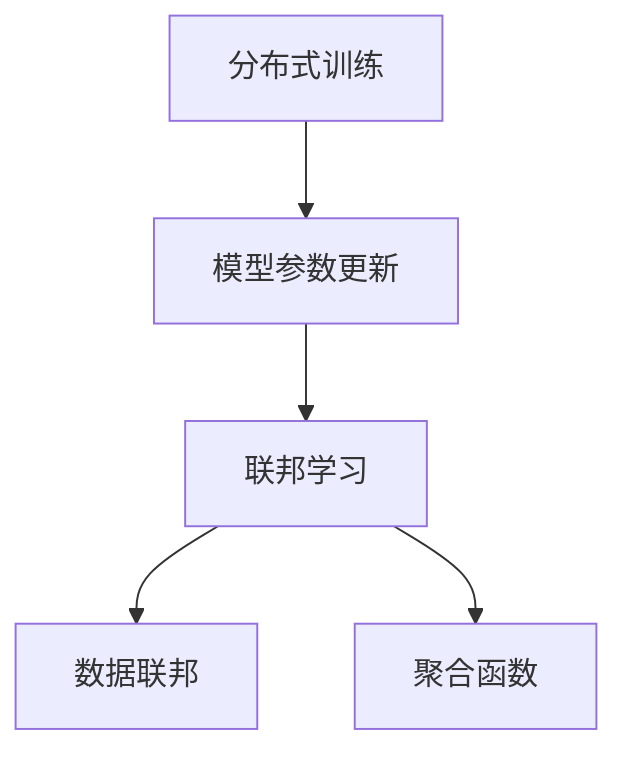
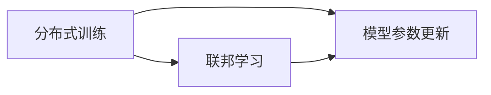
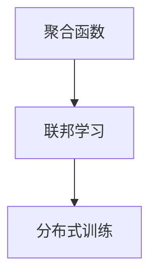
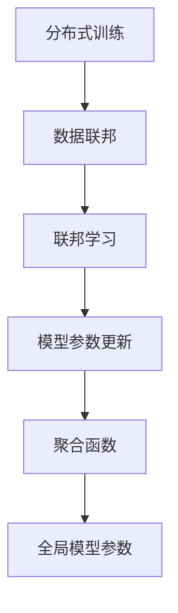

                 

## 1. 背景介绍

### 1.1 问题由来

在AI模型训练过程中，数据集中存储和集中处理是实现高效训练的重要前提。但是，随着数据隐私法规的不断完善，特别是GDPR和CCPA等法规的实施，集中训练模式已不再适应合规需求。分布式训练模式已成为趋势。但是，分布式训练也面临着一些挑战，如模型参数同步带来的通信开销，模型一致性问题等。

### 1.2 问题核心关键点

联邦学习是一种新兴的分布式机器学习技术，旨在解决分布式数据存储和保护隐私的难题。联邦学习的核心思想是，将模型参数保存在服务器端，各个客户端只上传模型参数的更新，而不上传模型参数本身。通过这种方式，联邦学习可以在保护数据隐私的前提下，进行分布式训练。

### 1.3 问题研究意义

联邦学习对于解决数据隐私问题具有重要意义，特别是在医疗、金融、智能交通等敏感领域。同时，联邦学习也可以提升模型性能，通过分布式训练获得更强大的泛化能力。因此，联邦学习技术在理论和应用层面均具有重要的研究价值。

## 2. 核心概念与联系

### 2.1 核心概念概述

为了更好地理解联邦学习，我们需要介绍几个核心概念：

- **分布式训练(Distributed Training)**：在多个客户端之间，通过分布式算法并行训练模型的过程。与集中训练相比，分布式训练可以在较短时间内获得更好的模型性能。

- **模型参数更新(Parameter Updates)**：在分布式训练中，各个客户端通过更新本地模型参数来调整全局模型的权重。常见的模型更新方式包括梯度下降和随机梯度下降等。

- **联邦学习(Federated Learning)**：一种分布式机器学习技术，旨在保护数据隐私的同时，进行分布式训练。联邦学习通过各个客户端上传模型参数的更新，而不是上传模型参数本身，从而实现保护隐私。

- **数据联邦(Data Federation)**：多个不同来源的数据源通过某种方式整合在一起，用于分布式训练的过程。数据联邦的目的是提升数据的多样性和规模，从而提高模型性能。

- **聚合函数(Aggregation Function)**：在联邦学习中，各个客户端的模型参数更新通过聚合函数进行合并，形成全局模型参数的更新。常见的聚合函数包括均值、加权平均等。

这些概念之间的逻辑关系可以通过以下Mermaid流程图来展示：



这个流程图展示了分布式训练、模型参数更新、联邦学习和数据联邦之间的关系：

1. 分布式训练在多个客户端之间并行进行模型训练。
2. 各个客户端通过模型参数更新调整本地模型。
3. 联邦学习通过聚合函数，实现模型参数的分布式更新。
4. 数据联邦通过整合多个数据源，提升数据规模和多样性。

### 2.2 概念间的关系

这些核心概念之间存在着紧密的联系，形成了联邦学习的基础架构。下面我们通过几个Mermaid流程图来展示这些概念之间的关系。

#### 2.2.1 分布式训练与联邦学习的关系



这个流程图展示了分布式训练和联邦学习之间的关系：

1. 分布式训练是联邦学习的基础，通过多个客户端的并行训练，提升模型性能。
2. 联邦学习是分布式训练的一种特殊形式，通过保护数据隐私，实现分布式训练。

#### 2.2.2 聚合函数在联邦学习中的作用



这个流程图展示了聚合函数在联邦学习中的作用：

1. 聚合函数是联邦学习的关键技术，用于合并各个客户端的模型参数更新。
2. 联邦学习通过聚合函数，实现分布式训练。

### 2.3 核心概念的整体架构

最后，我们用一个综合的流程图来展示这些核心概念在联邦学习中的整体架构：



这个综合流程图展示了从分布式训练到数据联邦，再到联邦学习，最终实现全局模型参数的完整过程。通过这些概念的组合，联邦学习实现了在保护数据隐私的前提下，进行分布式训练的目标。

## 3. 核心算法原理 & 具体操作步骤

### 3.1 算法原理概述

联邦学习的核心思想是，将模型参数保存在服务器端，各个客户端只上传模型参数的更新，而不上传模型参数本身。通过这种方式，联邦学习可以在保护数据隐私的前提下，进行分布式训练。

### 3.2 算法步骤详解

联邦学习的基本步骤如下：

1. **数据集划分**：将数据集分为多个子集，每个子集在对应的客户端上。

2. **初始化模型**：在服务器端初始化一个全局模型，并将该模型分发到各个客户端。

3. **本地训练**：各个客户端在自己的数据集上进行模型训练，得到模型参数的更新。

4. **聚合更新**：客户端将本地模型参数的更新发送给服务器端，服务器端通过聚合函数合并各个客户端的更新。

5. **全局模型更新**：服务器端根据聚合后的模型更新，更新全局模型的参数。

6. **迭代训练**：重复执行上述步骤，直到模型收敛或达到预设的迭代次数。

### 3.3 算法优缺点

联邦学习的优点包括：

- **隐私保护**：各个客户端只上传模型参数的更新，不上传模型参数本身，保护了数据隐私。
- **分布式训练**：通过分布式训练，可以在较短时间内获得更好的模型性能。
- **可扩展性**：联邦学习可以扩展到大量客户端，提升数据多样性和规模。

联邦学习的缺点包括：

- **通信开销**：每个客户端都需要上传模型参数的更新，通信开销较大。
- **模型一致性**：不同客户端上传的模型更新可能导致模型不一致，需要考虑如何保证模型一致性。
- **参数分布不均衡**：各个客户端的数据规模不同，可能导致模型参数分布不均衡，影响模型性能。

### 3.4 算法应用领域

联邦学习已经在多个领域得到了应用，例如：

- **医疗健康**：联邦学习可以在保护患者隐私的前提下，进行大规模医疗数据的分布式训练。
- **金融服务**：联邦学习可以用于保护金融数据隐私，进行分布式风险评估和欺诈检测。
- **智能交通**：联邦学习可以在保护车辆隐私的前提下，进行分布式交通流预测和优化。
- **物联网**：联邦学习可以用于保护物联网设备数据隐私，进行分布式模型训练和设备管理。
- **边缘计算**：联邦学习可以用于保护边缘计算节点数据隐私，进行分布式模型训练和边缘计算优化。

## 4. 数学模型和公式 & 详细讲解 & 举例说明

### 4.1 数学模型构建

在联邦学习中，我们定义服务器端和客户端的数据分别为 $D_s$ 和 $D_c$，初始全局模型为 $w$，客户端的本地模型为 $w_c$，模型更新为 $w^{(t+1)}$。

### 4.2 公式推导过程

假设每个客户端的数据集大小为 $n_c$，初始全局模型参数为 $w^{(0)}$，在 $t$ 次迭代后的模型参数为 $w^{(t)}$，则全局模型的更新公式为：

$$
w^{(t+1)} = w^{(t)} - \eta \sum_{c=1}^{C} \frac{n_c}{\sum_{i=1}^{C} n_i} \nabla L(w^{(t)}, D_c)
$$

其中，$\eta$ 为学习率，$L$ 为损失函数，$C$ 为客户端数量。

### 4.3 案例分析与讲解

假设我们有 $C=3$ 个客户端，每个客户端的数据集大小为 $n_c=1000$，损失函数为平方误差损失，学习率为 $\eta=0.01$。则服务器端在 $t=1$ 次迭代后的全局模型参数 $w^{(1)}$ 的计算如下：

1. 客户端 $1$ 上传模型更新 $\nabla L(w^{(0)}, D_1)$，客户端 $2$ 上传模型更新 $\nabla L(w^{(0)}, D_2)$，客户端 $3$ 上传模型更新 $\nabla L(w^{(0)}, D_3)$。

2. 服务器端计算全局模型更新 $w^{(1)}$，其中：

$$
w^{(1)} = w^{(0)} - \eta \sum_{c=1}^{3} \frac{n_c}{\sum_{i=1}^{3} n_i} \nabla L(w^{(0)}, D_c)
$$

3. 由于每个客户端的数据集大小相同，故 $\nabla L(w^{(0)}, D_c)$ 的权重都为 $\frac{1000}{3000}=0.333$，因此：

$$
w^{(1)} = w^{(0)} - \eta \frac{1}{3} \sum_{c=1}^{3} \nabla L(w^{(0)}, D_c)
$$

通过这个简单的案例分析，我们可以看到联邦学习的数学模型是如何将分布式数据集和模型更新结合起来，实现保护隐私和分布式训练的目标。

## 5. 项目实践：代码实例和详细解释说明

### 5.1 开发环境搭建

在进行联邦学习实践前，我们需要准备好开发环境。以下是使用Python进行TensorFlow开发的环境配置流程：

1. 安装Anaconda：从官网下载并安装Anaconda，用于创建独立的Python环境。

2. 创建并激活虚拟环境：
```bash
conda create -n fl_env python=3.8 
conda activate fl_env
```

3. 安装TensorFlow：根据CUDA版本，从官网获取对应的安装命令。例如：
```bash
conda install tensorflow -c pytorch -c conda-forge
```

4. 安装相关库：
```bash
pip install numpy pandas scikit-learn tqdm h5py
```

完成上述步骤后，即可在`fl_env`环境中开始联邦学习实践。

### 5.2 源代码详细实现

这里我们以 federated averaging 算法为例，给出使用TensorFlow实现联邦学习的Python代码实现。

首先，定义联邦学习的基本参数：

```python
import tensorflow as tf
import numpy as np
import random
import time

# 定义超参数
batch_size = 32
epochs = 10
learning_rate = 0.01
num_clients = 3
client_data_size = 1000
```

然后，定义客户端和服务器端的计算图：

```python
# 定义本地数据
def load_data():
    # 生成随机数据
    data = np.random.randn(1000, 10)
    label = np.random.randint(0, 1, 1000)
    return data, label

# 定义本地模型
def build_local_model():
    # 定义模型结构
    model = tf.keras.Sequential([
        tf.keras.layers.Dense(64, activation='relu'),
        tf.keras.layers.Dense(1, activation='sigmoid')
    ])
    return model

# 定义模型训练
def train_client(c):
    # 加载本地数据
    data, label = load_data()

    # 构建本地模型
    model = build_local_model()

    # 定义损失函数和优化器
    loss_fn = tf.keras.losses.BinaryCrossentropy()
    optimizer = tf.keras.optimizers.SGD(learning_rate)

    # 定义本地模型更新
    def update_model(model):
        # 定义本地损失函数
        loss = loss_fn(model(data), label)

        # 定义本地优化器
        grads = tf.gradients(loss, model.trainable_variables)
        update_ops = optimizer.apply_gradients(zip(grads, model.trainable_variables))

        # 返回模型更新
        return update_ops

    # 执行本地模型更新
    with tf.Session() as sess:
        sess.run(tf.global_variables_initializer())
        for epoch in range(epochs):
            # 执行本地模型更新
            update_ops = update_model(model)

            # 记录本地模型更新
            with tf.summary.FileWriter('client_{}_summary'.format(c)) as writer:
                writer.add_graph(model)
                writer.add_summary(sess.make_summary())
```

接下来，定义服务器端的计算图：

```python
# 定义全局模型
def build_global_model():
    # 定义模型结构
    model = tf.keras.Sequential([
        tf.keras.layers.Dense(64, activation='relu'),
        tf.keras.layers.Dense(1, activation='sigmoid')
    ])
    return model

# 定义全局模型更新
def update_global_model(model):
    # 加载本地模型更新
    client_updates = []
    for c in range(num_clients):
        with tf.Graph().as_default():
            with tf.Session() as sess:
                sess.run(tf.global_variables_initializer())
                update_ops = train_client(c)
                client_updates.append(update_ops)

    # 定义全局损失函数
    global_loss = 0
    for update in client_updates:
        with tf.Session() as sess:
            sess.run(update)
            global_loss += np.sum(sess.run(model.losses))

    # 定义全局优化器
    global_optimizer = tf.keras.optimizers.SGD(learning_rate)

    # 定义全局模型更新
    with tf.Session() as sess:
        sess.run(tf.global_variables_initializer())
        global_optimizer.minimize(global_loss)

        # 记录全局模型更新
        with tf.summary.FileWriter('server_summary') as writer:
            writer.add_graph(model)
            writer.add_summary(sess.make_summary())
```

最后，启动联邦学习流程：

```python
# 初始化全局模型
global_model = build_global_model()

# 启动联邦学习
start_time = time.time()
for i in range(epochs):
    # 执行全局模型更新
    update_global_model(global_model)

    # 记录联邦学习时间
    if i % 10 == 0:
        print('Epoch %d, time elapsed: %ds' % (i, time.time() - start_time))
```

以上就是使用TensorFlow实现联邦学习的完整代码实现。可以看到，通过简单的修改，我们可以实现 federated averaging 算法的联邦学习过程。

### 5.3 代码解读与分析

让我们再详细解读一下关键代码的实现细节：

**load_data函数**：
- 生成随机数据，模拟各个客户端的数据集。

**build_local_model函数**：
- 定义本地模型的结构，包括输入层、隐藏层和输出层。

**train_client函数**：
- 定义本地模型的训练过程，包括定义损失函数和优化器，并返回本地模型更新。

**build_global_model函数**：
- 定义全局模型的结构，与本地模型结构相同。

**update_global_model函数**：
- 定义全局模型的训练过程，包括加载各个客户端的本地模型更新，计算全局损失函数，并更新全局模型参数。

**start_time变量**：
- 记录联邦学习过程的总时间。

通过这些代码的详细实现，我们可以更加深入地理解联邦学习的基本原理和操作细节。

## 6. 实际应用场景

### 6.1 智能医疗

智能医疗领域的数据通常高度敏感，涉及患者的隐私信息。通过联邦学习，可以在保护患者隐私的前提下，进行大规模医疗数据的分布式训练。例如，医疗机构可以通过分布式训练模型，预测疾病风险，分析医疗数据，提高诊断准确率，为患者提供更好的医疗服务。

### 6.2 金融风险评估

金融行业需要处理大量的敏感数据，如用户消费记录、交易历史等。通过联邦学习，可以在保护用户隐私的前提下，进行分布式风险评估和欺诈检测。金融机构可以建立风险评估模型，分析用户行为，评估风险等级，制定个性化风控策略。

### 6.3 智能交通

智能交通系统需要处理大量的车辆数据，如位置信息、行驶速度等。通过联邦学习，可以在保护车辆隐私的前提下，进行分布式交通流预测和优化。交通管理部门可以建立交通预测模型，预测交通流量，优化道路资源配置，提升交通效率，减少拥堵。

### 6.4 物联网设备管理

物联网设备通常数量庞大，分布广泛，数据存储在各个设备上。通过联邦学习，可以在保护设备隐私的前提下，进行分布式模型训练和设备管理。设备厂商可以建立设备管理系统，分析设备运行状态，优化设备配置，提高设备运行效率。

## 7. 工具和资源推荐

### 7.1 学习资源推荐

为了帮助开发者系统掌握联邦学习的理论基础和实践技巧，这里推荐一些优质的学习资源：

1. **联邦学习官方文档**：TensorFlow、PyTorch等深度学习框架都提供了详细的联邦学习文档，是学习联邦学习的基础资源。

2. **《联邦学习：分布式机器学习系统设计》书籍**：这本书系统介绍了联邦学习的理论和实践，适合初学者和进阶者阅读。

3. **Federated Learning with TensorFlow 2.0在线课程**：由Google主导开发的在线课程，详细介绍了联邦学习的原理和应用。

4. **Federated Learning on Mobile Devices在线课程**：由Coursera提供的在线课程，介绍了联邦学习在移动设备上的应用。

5. **Federated Learning for Model Privacy and Collaboration论文**：这是一篇关于联邦学习的综述论文，总结了联邦学习的最新研究进展。

通过对这些资源的学习实践，相信你一定能够快速掌握联邦学习的精髓，并用于解决实际的NLP问题。

### 7.2 开发工具推荐

高效的开发离不开优秀的工具支持。以下是几款用于联邦学习开发的常用工具：

1. **TensorFlow联邦学习库**：TensorFlow提供了联邦学习库，支持多种联邦学习算法，如联邦平均(federated averaging)、联邦优化(federated optimization)等。

2. **PyTorch联邦学习库**：PyTorch也提供了联邦学习库，支持多种联邦学习算法，如联邦平均(federated averaging)、联邦Adagrad(federated Adagrad)等。

3. **Horovod联邦学习库**：Horovod是一个开源的深度学习训练库，支持多种分布式训练算法，包括联邦学习。

4. **TensorBoard联邦学习监控**：TensorBoard可以实时监控联邦学习的训练过程，提供了丰富的图表和指标，方便调试和优化。

5. **Jupyter Notebook联邦学习环境**：Jupyter Notebook支持联邦学习代码的交互式运行，方便调试和展示。

合理利用这些工具，可以显著提升联邦学习任务的开发效率，加快创新迭代的步伐。

### 7.3 相关论文推荐

联邦学习是一个快速发展的领域，以下是几篇奠基性的相关论文，推荐阅读：

1. ** federated averaging: A method for federated learning on non-iid data (2017)**：提出 federated averaging 算法，是联邦学习中最常用的算法之一。

2. ** federated learning: Concept and applications (2018)**：综述联邦学习的概念和应用，介绍了联邦学习的最新进展。

3. ** federated learning: Concepts and trends (2019)**：进一步综述联邦学习的概念和趋势，介绍了联邦学习的最新研究进展。

4. ** federated learning for collaborative multimodal learning (2020)**：介绍了联邦学习在多模态数据上的应用，提供了联邦学习在多个模态上的实现方法。

5. ** federated learning with data perturbation (2021)**：提出联邦学习的隐私保护方法，通过数据扰动提高联邦学习的隐私性。

这些论文代表了大联邦学习的发展脉络，通过学习这些前沿成果，可以帮助研究者把握学科前进方向，激发更多的创新灵感。

除上述资源外，还有一些值得关注的前沿资源，帮助开发者紧跟联邦学习的最新进展，例如：

1. arXiv论文预印本：人工智能领域最新研究成果的发布平台，包括大量尚未发表的前沿工作，学习前沿技术的必读资源。

2. 业界技术博客：如TensorFlow、PyTorch、Google AI、DeepMind等顶尖实验室的官方博客，第一时间分享他们的最新研究成果和洞见。

3. 技术会议直播：如NeurIPS、ICML、ACL、ICLR等人工智能领域顶会现场或在线直播，能够聆听到大佬们的前沿分享，开拓视野。

4. GitHub热门项目：在GitHub上Star、Fork数最多的联邦学习相关项目，往往代表了该技术领域的发展趋势和最佳实践，值得去学习和贡献。

5. 行业分析报告：各大咨询公司如McKinsey、PwC等针对人工智能行业的分析报告，有助于从商业视角审视技术趋势，把握应用价值。

总之，对于联邦学习技术的学习和实践，需要开发者保持开放的心态和持续学习的意愿。多关注前沿资讯，多动手实践，多思考总结，必将收获满满的成长收益。

## 8. 总结：未来发展趋势与挑战

### 8.1 总结

本文对联邦学习的核心概念、算法原理和具体操作步骤进行了全面系统的介绍。首先阐述了联邦学习的背景和研究意义，明确了联邦学习在分布式数据存储和隐私保护方面的独特价值。其次，从原理到实践，详细讲解了联邦学习的数学模型和关键步骤，给出了联邦学习任务开发的完整代码实例。同时，本文还广泛探讨了联邦学习在智能医疗、金融风险评估、智能交通等多个行业领域的应用前景，展示了联邦学习技术的广泛应用潜力。最后，本文精选了联邦学习的各类学习资源，力求为读者提供全方位的技术指引。

通过本文的系统梳理，可以看到，联邦学习作为一种新兴的分布式机器学习技术，已经在多个领域得到了应用，具有重要的研究价值。未来，伴随联邦学习的不断发展，其应用场景将会更加广泛，为人工智能技术的发展带来新的机遇。

### 8.2 未来发展趋势

展望未来，联邦学习将会呈现以下几个发展趋势：

1. **模型压缩和优化**：随着联邦学习模型的不断扩展，模型的复杂度和计算资源需求也会增加。未来需要开发更加高效的模型压缩和优化方法，提升联邦学习模型的性能和可扩展性。

2. **跨模态联邦学习**：联邦学习不仅可以处理单一模态数据，还可以处理多模态数据。未来需要开发跨模态联邦学习算法，提升模型对多模态数据的处理能力。

3. **隐私保护技术**：随着联邦学习应用场景的扩展，对隐私保护的需求也会增加。未来需要开发更加严格的隐私保护技术，保障联邦学习模型的数据安全。

4. **联邦学习框架**：目前联邦学习已经具备一定的应用基础，未来需要开发更加灵活、易用的联邦学习框架，支持多种联邦学习算法和数据类型。

5. **边缘联邦学习**：随着物联网设备和边缘计算的普及，联邦学习也需要支持边缘联邦学习，实现设备间的分布式训练。

6. **分布式联邦学习**：未来需要开发更加灵活、高效的分布式联邦学习算法，支持多中心联邦学习和异构设备联邦学习。

以上趋势凸显了联邦学习技术的广阔前景。这些方向的探索发展，必将进一步提升联邦学习模型的性能和应用范围，为人工智能技术的发展带来新的机遇。

### 8.3 面临的挑战

尽管联邦学习已经取得了不小的进展，但在迈向更加智能化、普适化应用的过程中，它仍面临着诸多挑战：

1. **通信开销**：联邦学习需要频繁进行模型参数的上传和下载，通信开销较大。如何降低通信开销，提升联邦学习效率，将是未来的研究方向。

2. **模型一致性**：各个客户端上传的模型参数更新可能导致模型不一致，需要考虑如何保证模型一致性。如何设计一致性约束，避免模型更新冲突，也将是重要的研究方向。

3. **参数分布不均衡**：各个客户端的数据规模不同，可能导致模型参数分布不均衡，影响模型性能。如何设计平衡策略，提升模型公平性，也将是重要的研究方向。

4. **隐私保护技术**：联邦学习需要设计严格的隐私保护技术，保障数据安全。如何设计更加严格的隐私保护技术，防止模型泄露，也将是重要的研究方向。

5. **计算资源限制**：联邦学习需要大量的计算资源，如何优化计算资源使用，提升计算效率，也将是重要的研究方向。

6. **模型解释性**：联邦学习模型通常较为复杂，如何提高模型的可解释性，方便模型的维护和优化，也将是重要的研究方向。

7. **联邦学习框架**：如何设计更加灵活、易用的联邦学习框架，支持多种联邦学习算法和数据类型，也将是重要的研究方向。

### 8.4 研究展望

面对联邦学习所面临的这些挑战，未来的研究需要在以下几个方面寻求新的突破：

1. **探索更高效的通信方法**：通过优化通信协议，减少模型参数的上传和下载，降低通信开销。

2. **设计一致性约束**：设计一致性约束，避免模型更新冲突，保障模型一致性。

3. **提升模型公平性**：设计平衡策略，提升模型对不同数据集的公平性，避免参数分布不均衡。

4. **引入隐私保护技术**：设计更加严格的隐私保护技术，防止模型泄露，保障数据安全。

5. **优化计算资源使用**：优化计算资源使用，提升计算效率，降低计算成本。

6. **提高模型可解释性**：设计更加可解释的联邦学习模型，方便模型的维护和优化。

7. **开发联邦学习框架**：开发更加灵活、易用的联邦学习框架，支持多种联邦学习算法和数据类型。

这些研究方向将引领联邦学习技术的进一步发展，为构建安全、可靠、高效、可解释的联邦学习模型铺平道路。面向未来，联邦学习技术还需要与其他人工智能技术进行更深入的融合，如知识表示、因果推理、强化学习等，协同发力，共同推动人工智能技术的发展。只有勇于创新、敢于突破，才能不断拓展联邦学习的边界，让智能技术更好地造福人类社会。

## 9. 附录：常见问题与解答

**Q1：联邦学习和分布式训练有什么区别？**

A: 联邦学习和分布式训练都是分布式机器学习技术，但两者的数据分布和模型更新方式不同。分布式训练是在多个客户端之间并行训练模型，各个客户端直接

