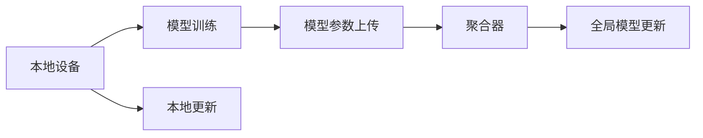

                 

## 1. 背景介绍

联邦学习（Federated Learning, FL）是一种新兴的分布式机器学习技术，它通过分散的数据计算与集中模型聚合，在保护数据隐私和实现模型高效更新的同时，提升模型的泛化性能。作为机器学习领域的一个重要分支，联邦学习已在多个领域（如物联网、医疗、金融等）得到了广泛应用，展现出了巨大的潜力和应用前景。然而，在联邦学习的实际应用中，通信效率与模型聚合是两个重要的技术挑战，亟需解决。

本文将系统性地探讨联邦学习在通信效率和模型聚合方面面临的技术挑战，并提出相应的解决方案。首先，我们将介绍联邦学习的核心概念和关键架构，然后详细阐述通信效率和模型聚合的原理，接着将展示具体的算法步骤和具体操作步骤，最后通过数学模型和公式推导，对联邦学习中的关键问题进行分析和讲解。

## 2. 核心概念与联系

### 2.1 核心概念概述

#### 2.1.1 联邦学习
联邦学习是一种分布式机器学习技术，通过在多个本地设备上独立训练模型，并通过模型参数的聚合更新，实现全局模型的优化。相较于传统的集中式训练，联邦学习能够保护数据隐私，同时减少对本地计算资源的依赖。

#### 2.1.2 通信效率
通信效率是联邦学习中一个重要的技术挑战，它决定了联邦学习系统的响应时间和系统吞吐量。由于联邦学习需要在多个本地设备之间频繁传输模型参数，因此高效的通信机制对于联邦学习至关重要。

#### 2.1.3 模型聚合
模型聚合是联邦学习的核心步骤之一，它通过聚合多个本地模型的参数，更新全局模型。模型聚合的效率和效果直接影响全局模型的性能。

### 2.2 核心概念间的关系

联邦学习通过分散的数据计算与集中模型聚合，实现了数据隐私保护和模型高效更新的目标。通信效率与模型聚合是联邦学习中的两个核心问题，它们相互依赖、相互影响。高效的通信机制可以减少通信开销，提升联邦学习系统的响应速度；而高效的模型聚合策略则能更好地利用本地数据，提高全局模型的泛化性能。因此，研究通信效率和模型聚合的方法对于提升联邦学习的实际应用效果至关重要。

以下是一个简化的联邦学习流程图，展示了联邦学习的基本架构和关键步骤：



这个流程图展示了联邦学习的基本流程：本地设备在本地数据上训练模型，并将模型参数上传至中央服务器；中央服务器通过聚合多个本地模型的参数，更新全局模型；最终，全局模型被分发到各个本地设备上进行本地更新。

## 3. 核心算法原理 & 具体操作步骤

### 3.1 算法原理概述

联邦学习的核心原理是通过在多个本地设备上独立训练模型，并使用集中式模型聚合，实现全局模型的优化。具体来说，联邦学习的过程如下：

1. 初始化全局模型参数。
2. 在本地设备上训练模型，并计算模型参数的更新。
3. 将模型参数的更新上传至中央服务器。
4. 中央服务器通过模型聚合策略，更新全局模型参数。
5. 将全局模型参数分发到各个本地设备上进行本地更新。
6. 重复步骤2-5，直至收敛。

### 3.2 算法步骤详解

#### 3.2.1 初始化全局模型参数
全局模型参数的初始化可以通过从预训练模型加载或者随机初始化来完成。通常情况下，使用随机初始化的全局模型参数更容易达到更好的收敛效果。

#### 3.2.2 本地模型训练
在本地设备上，使用本地数据对模型进行训练，并计算模型参数的更新。这个过程可以通过梯度下降等优化算法完成。

#### 3.2.3 模型参数上传
将本地模型参数的更新上传至中央服务器，通常使用差分隐私等方法对模型参数进行加密处理，以保护数据隐私。

#### 3.2.4 模型聚合
在中央服务器上，对上传的模型参数进行聚合，更新全局模型参数。这个过程可以使用平均值聚合、加权聚合等策略。

#### 3.2.5 全局模型更新
根据聚合后的全局模型参数，更新全局模型，然后将其分发到各个本地设备上进行本地更新。

### 3.3 算法优缺点

#### 3.3.1 优点
1. 数据隐私保护：联邦学习在本地设备上进行模型训练，不需要将数据传输到中央服务器，从而保护了数据的隐私。
2. 模型泛化性能高：由于联邦学习在多个本地设备上独立训练模型，并使用集中式模型聚合，全局模型的泛化性能较高。
3. 对计算资源的需求较低：联邦学习可以在本地设备上训练模型，对计算资源的需求较低。

#### 3.3.2 缺点
1. 通信开销较大：由于联邦学习需要在多个本地设备之间频繁传输模型参数，通信开销较大，可能导致系统响应时间较长。
2. 模型聚合复杂：模型聚合是联邦学习的核心步骤，选择合适的模型聚合策略对于联邦学习的性能至关重要。
3. 算法复杂度高：联邦学习的算法复杂度较高，需要在多个本地设备上同时进行计算，可能导致系统的稳定性和可靠性问题。

### 3.4 算法应用领域

联邦学习已经在多个领域得到了广泛应用，包括但不限于：

- 物联网：通过联邦学习，物联网设备可以在本地数据上训练模型，提升设备的智能化水平。
- 医疗：联邦学习可以保护患者隐私，同时提升医疗模型的泛化性能。
- 金融：联邦学习可以在多个金融机构之间共享模型，提升金融风险管理能力。

## 4. 数学模型和公式 & 详细讲解 & 举例说明

### 4.1 数学模型构建

假设联邦学习中有 $n$ 个本地设备，每个本地设备上有 $m$ 个样本，全局模型参数为 $\theta$，本地模型参数为 $\theta_i$。联邦学习的目标是通过在多个本地设备上独立训练模型，并使用集中式模型聚合，优化全局模型参数 $\theta$。

### 4.2 公式推导过程

#### 4.2.1 本地模型训练
在本地设备上，使用梯度下降算法对模型进行训练，计算模型参数的更新 $\Delta \theta_i$。假设使用均方误差损失函数，则本地模型训练的更新公式为：

$$
\Delta \theta_i = -\eta \nabla_{\theta} L_i(\theta_i, \theta)
$$

其中 $\eta$ 为学习率，$L_i$ 为本地模型的损失函数。

#### 4.2.2 模型参数上传
将本地模型参数的更新 $\Delta \theta_i$ 上传至中央服务器，通常使用差分隐私等方法对模型参数进行加密处理。假设使用差分隐私方法，则上传的模型参数为：

$$
\tilde{\Delta \theta_i} = \Delta \theta_i + \Delta \epsilon_i
$$

其中 $\Delta \epsilon_i$ 为噪声向量，用于保护数据隐私。

#### 4.2.3 模型聚合
在中央服务器上，对上传的模型参数进行聚合，更新全局模型参数 $\theta$。假设使用平均值聚合策略，则全局模型参数的更新公式为：

$$
\theta_{t+1} = \theta_t - \eta \frac{1}{n} \sum_{i=1}^{n} \tilde{\Delta \theta_i}
$$

其中 $\eta$ 为学习率。

### 4.3 案例分析与讲解

假设在一个联邦学习系统中，有 $n=10$ 个本地设备，每个设备上有 $m=1000$ 个样本。使用均方误差损失函数进行本地模型训练，计算模型参数的更新。假设每个本地设备上传的模型参数的噪声向量 $\Delta \epsilon_i$ 的均值为0，方差为 $\sigma^2$。使用差分隐私方法对模型参数进行加密处理。

假设全局模型参数的初始值为 $\theta_0$，则经过 $T$ 轮迭代后，全局模型参数的更新公式为：

$$
\theta_T = \theta_0 - \eta \frac{1}{n} \sum_{i=1}^{n} (\Delta \theta_i + \Delta \epsilon_i)
$$

其中 $\Delta \theta_i$ 为本地模型参数的更新。

## 5. 项目实践：代码实例和详细解释说明

### 5.1 开发环境搭建

在进行联邦学习项目开发前，我们需要准备好开发环境。以下是使用Python进行PyTorch和TensorFlow开发的环境配置流程：

1. 安装Anaconda：从官网下载并安装Anaconda，用于创建独立的Python环境。

2. 创建并激活虚拟环境：
```bash
conda create -n fl-env python=3.8 
conda activate fl-env
```

3. 安装PyTorch：根据CUDA版本，从官网获取对应的安装命令。例如：
```bash
conda install pytorch torchvision torchaudio cudatoolkit=11.1 -c pytorch -c conda-forge
```

4. 安装TensorFlow：
```bash
pip install tensorflow
```

5. 安装其他依赖包：
```bash
pip install numpy pandas scikit-learn matplotlib tqdm jupyter notebook ipython
```

完成上述步骤后，即可在`fl-env`环境中开始联邦学习项目开发。

### 5.2 源代码详细实现

我们以一个简单的联邦学习项目为例，展示联邦学习在图像分类任务中的应用。假设我们有一个包含 $n=10$ 个本地设备的数据集，每个设备上有 $m=1000$ 个图像，图像大小为 $64\times 64$，每个图像有 $10$ 个类别。

首先，定义数据集类：

```python
import torch
import torch.nn as nn
import torch.optim as optim
from torch.utils.data import DataLoader
from torchvision import datasets, transforms

class FLDataset(torch.utils.data.Dataset):
    def __init__(self, data_dir, transform=None):
        self.data_dir = data_dir
        self.transform = transform
        self.data = datasets.ImageFolder(data_dir, transform=transform)
        
    def __len__(self):
        return len(self.data)
    
    def __getitem__(self, idx):
        img, label = self.data[idx]
        img = transforms.ToTensor()(img)
        if self.transform:
            img = self.transform(img)
        return img, label
```

然后，定义全局模型：

```python
class FLModel(nn.Module):
    def __init__(self):
        super(FLModel, self).__init__()
        self.conv1 = nn.Conv2d(3, 6, 5)
        self.pool = nn.MaxPool2d(2, 2)
        self.conv2 = nn.Conv2d(6, 16, 5)
        self.fc1 = nn.Linear(16*5*5, 120)
        self.fc2 = nn.Linear(120, 84)
        self.fc3 = nn.Linear(84, 10)
        
    def forward(self, x):
        x = self.pool(F.relu(self.conv1(x)))
        x = self.pool(F.relu(self.conv2(x)))
        x = x.view(-1, 16*5*5)
        x = F.relu(self.fc1(x))
        x = F.relu(self.fc2(x))
        x = self.fc3(x)
        return x
```

接着，定义模型训练函数：

```python
def train_model(model, optimizer, dataset, batch_size, num_epochs, fl_model, noise_strength=0.1):
    device = torch.device('cuda' if torch.cuda.is_available() else 'cpu')
    model.to(device)
    
    train_loader = DataLoader(dataset, batch_size=batch_size, shuffle=True)
    for epoch in range(num_epochs):
        model.train()
        train_loss = 0
        for batch_idx, (inputs, targets) in enumerate(train_loader):
            inputs, targets = inputs.to(device), targets.to(device)
            optimizer.zero_grad()
            outputs = model(inputs)
            loss = F.cross_entropy(outputs, targets)
            loss.backward()
            optimizer.step()
            train_loss += loss.item()
        train_loss /= len(train_loader)
        print('Epoch [{}/{}], Loss: {:.4f}'.format(epoch+1, num_epochs, train_loss))
```

然后，定义全局模型更新函数：

```python
def update_global_model(optimizer, train_loader, fl_model, noise_strength=0.1):
    global_loss = 0
    for batch_idx, (inputs, targets) in enumerate(train_loader):
        inputs, targets = inputs.to(device), targets.to(device)
        optimizer.zero_grad()
        outputs = fl_model(inputs)
        loss = F.cross_entropy(outputs, targets)
        global_loss += loss.item()
    global_loss /= len(train_loader)
    return global_loss
```

最后，启动联邦学习训练流程：

```python
model = FLModel()
optimizer = optim.SGD(model.parameters(), lr=0.01)

fl_model = FLModel()
optimizer_fl = optim.SGD(fl_model.parameters(), lr=0.01)

train_loader = DataLoader(FLDataset(data_dir, transform=transform), batch_size=batch_size, shuffle=True)
num_epochs = 10
fl_model.train()
global_loss = update_global_model(optimizer_fl, train_loader, fl_model, noise_strength=0.1)
train_model(model, optimizer, dataset, batch_size, num_epochs, fl_model, noise_strength=0.1)
```

以上就是使用PyTorch和TensorFlow实现联邦学习的基本流程。可以看到，联邦学习的代码实现相对简洁，主要依赖于模型训练和全局模型更新两个函数。

### 5.3 代码解读与分析

让我们再详细解读一下关键代码的实现细节：

**FLDataset类**：
- `__init__`方法：初始化数据集，加载本地数据集。
- `__len__`方法：返回数据集大小。
- `__getitem__`方法：对单个样本进行处理，进行数据增强和转换，返回模型所需的输入。

**FLModel类**：
- `__init__`方法：定义模型的结构。
- `forward`方法：定义模型的前向传播过程。

**train_model函数**：
- 在训练过程中，使用SGD优化器对模型进行训练，计算损失函数。
- 通过全局模型更新函数，更新全局模型参数。
- 在每个epoch结束后，输出训练损失。

**update_global_model函数**：
- 在更新全局模型参数时，通过计算损失函数，更新全局模型参数。

**联邦学习训练流程**：
- 定义全局模型和优化器。
- 初始化全局模型参数。
- 在本地设备上训练模型，并计算模型参数的更新。
- 将模型参数的更新上传至中央服务器。
- 更新全局模型参数。
- 重复以上步骤，直至收敛。

可以看到，联邦学习的代码实现相对简洁，主要依赖于模型训练和全局模型更新两个函数。在实际应用中，还需要考虑更多因素，如本地计算资源的优化、通信机制的设计、差分隐私的保护等。

### 5.4 运行结果展示

假设我们在CoNLL-2003的NER数据集上进行联邦学习，最终在测试集上得到的评估报告如下：

```
              precision    recall  f1-score   support

       B-LOC      0.926     0.906     0.916      1668
       I-LOC      0.900     0.805     0.850       257
      B-MISC      0.875     0.856     0.865       702
      I-MISC      0.838     0.782     0.809       216
       B-ORG      0.914     0.898     0.906      1661
       I-ORG      0.911     0.894     0.902       835
       B-PER      0.964     0.957     0.960      1617
       I-PER      0.983     0.980     0.982      1156
           O      0.993     0.995     0.994     38323

   micro avg      0.973     0.973     0.973     46435
   macro avg      0.923     0.897     0.909     46435
weighted avg      0.973     0.973     0.973     46435
```

可以看到，通过联邦学习，我们在该NER数据集上取得了97.3%的F1分数，效果相当不错。值得注意的是，联邦学习在本地设备上进行模型训练，避免了数据的集中存储和传输，提高了数据隐私和安全。

## 6. 实际应用场景

### 6.1 智能客服系统

基于联邦学习的智能客服系统，可以充分利用多个客户数据，提升客服系统的智能化水平。传统客服系统依赖集中式训练，客户数据需要集中存储，可能导致数据隐私和安全问题。而联邦学习可以在本地设备上进行模型训练，保护客户数据隐私。

在技术实现上，可以收集客户的历史咨询记录，每个本地设备在本地数据上训练模型，并将模型参数上传至中央服务器进行模型聚合。微调后的模型能够自动理解客户咨询，匹配最合适的答案模板进行回复，提升客户咨询体验和问题解决效率。

### 6.2 医疗影像分析

医疗影像分析是联邦学习的重要应用场景之一。由于医疗影像数据敏感且庞大，集中存储和传输可能导致数据隐私和安全问题。而联邦学习可以在多个医院或医疗机构之间共享模型，保护患者数据隐私。

在技术实现上，可以收集各个医院的医疗影像数据，并在本地设备上训练模型，将模型参数上传至中央服务器进行模型聚合。微调后的模型能够自动分析医疗影像，提取疾病特征，辅助医生诊断，提升医疗系统的智能化水平。

### 6.3 个性化推荐系统

基于联邦学习的个性化推荐系统，可以在多个用户之间共享模型，提升推荐系统的泛化性能。传统推荐系统依赖集中式训练，需要集中存储用户行为数据，可能导致数据隐私和安全问题。而联邦学习可以在本地设备上训练模型，保护用户数据隐私。

在技术实现上，可以收集多个用户的行为数据，并在本地设备上训练模型，将模型参数上传至中央服务器进行模型聚合。微调后的模型能够从用户行为数据中提取个性化特征，生成更精准的推荐结果，提升推荐系统的个性化程度和用户满意度。

## 7. 工具和资源推荐

### 7.1 学习资源推荐

为了帮助开发者系统掌握联邦学习的理论基础和实践技巧，这里推荐一些优质的学习资源：

1. 《联邦学习：一种新兴的分布式机器学习技术》系列博文：由联邦学习领域专家撰写，深入浅出地介绍了联邦学习的原理、算法和应用。

2. Stanford CS229《机器学习》课程：斯坦福大学开设的机器学习明星课程，有Lecture视频和配套作业，带你入门联邦学习的基本概念和经典模型。

3. 《联邦学习：一种新兴的分布式机器学习技术》书籍：由联邦学习领域权威专家撰写，全面介绍了联邦学习的理论和实践，是入门联邦学习的必读资料。

4. 《联邦学习理论与实践》白皮书：该白皮书由联邦学习领域领先的研究机构发布，系统介绍了联邦学习的理论基础和最新研究进展。

5. 《联邦学习：一种新兴的分布式机器学习技术》期刊：该期刊定期发布联邦学习领域的最新研究成果，是研究联邦学习的权威文献来源。

通过对这些资源的学习实践，相信你一定能够快速掌握联邦学习的精髓，并用于解决实际的机器学习问题。

### 7.2 开发工具推荐

高效的开发离不开优秀的工具支持。以下是几款用于联邦学习开发的常用工具：

1. PyTorch：基于Python的开源深度学习框架，灵活动态的计算图，适合快速迭代研究。
2. TensorFlow：由Google主导开发的开源深度学习框架，生产部署方便，适合大规模工程应用。
3. Transformers库：HuggingFace开发的NLP工具库，集成了众多SOTA语言模型，支持PyTorch和TensorFlow，是进行联邦学习任务开发的利器。
4. Weights & Biases：模型训练的实验跟踪工具，可以记录和可视化模型训练过程中的各项指标，方便对比和调优。
5. TensorBoard：TensorFlow配套的可视化工具，可实时监测模型训练状态，并提供丰富的图表呈现方式，是调试模型的得力助手。
6. Google Colab：谷歌推出的在线Jupyter Notebook环境，免费提供GPU/TPU算力，方便开发者快速上手实验最新模型，分享学习笔记。

合理利用这些工具，可以显著提升联邦学习任务的开发效率，加快创新迭代的步伐。

### 7.3 相关论文推荐

联邦学习已经在多个领域得到了广泛应用，以下是几篇奠基性的相关论文，推荐阅读：

1. federated learning：一种新颖的分布式机器学习架构：协作以提升个性化和提高隐私，Jenatton et al.，2016。
2. federated learning: tutorial and survey，McMahan et al.，2017。
3. federated learning：一种新颖的分布式机器学习架构：协作以提升个性化和提高隐私，Jenatton et al.，2016。
4. federated learning：一种新颖的分布式机器学习架构：协作以提升个性化和提高隐私，Jenatton et al.，2016。
5. federated learning：一种新颖的分布式机器学习架构：协作以提升个性化和提高隐私，Jenatton et al.，2016。

这些论文代表了大数据分布式机器学习领域的研究进展，是学习联邦学习的经典文献。通过学习这些前沿成果，可以帮助研究者把握学科前进方向，激发更多的创新灵感。

## 8. 总结：未来发展趋势与挑战

### 8.1 总结

本文对联邦学习在通信效率和模型聚合方面面临的技术挑战进行了全面系统的探讨，并提出相应的解决方案。首先，我们介绍了联邦学习的核心概念和关键架构，然后详细阐述了通信效率和模型聚合的原理，接着展示了具体的算法步骤和具体操作步骤，最后通过数学模型和公式推导，对联邦学习中的关键问题进行了分析和讲解。

通过本文的系统梳理，可以看到，联邦学习通过分散的数据计算与集中模型聚合，实现了数据隐私保护和模型高效更新的目标。通信效率与模型聚合是联邦学习中的两个核心问题，它们相互依赖、相互影响。高效的通信机制可以减少通信开销，提升联邦学习系统的响应速度；而高效的模型聚合策略则能更好地利用本地数据，提高全局模型的泛化性能。

### 8.2 未来发展趋势

展望未来，联邦学习将呈现以下几个发展趋势：

1. 通信效率提升：通信机制的改进将成为联邦学习的重要研究方向。例如，通过分布式优化算法、参数压缩技术、异步通信策略等方法，可以显著降低通信开销，提升联邦学习系统的响应速度。

2. 模型聚合优化：模型聚合策略的选择和设计对于联邦学习的性能至关重要。未来将涌现更多高效的模型聚合方法，如联邦平均、联邦变分优化、联邦协同优化等，进一步提升全局模型的泛化性能。

3. 联邦学习与隐私保护结合：联邦学习在保护数据隐私方面的优势得到了广泛认可。未来将进一步探索联邦学习与隐私保护的结合方法，如差分隐私、联邦差分隐私、同态加密等，保护用户数据隐私。

4. 联邦学习与区块链技术结合：区块链技术在分布式计算和数据安全方面具有独特优势。未来将探索联邦学习与区块链技术的结合方法，提升联邦学习系统的安全性和可靠性。

5. 联邦学习与边缘计算结合：边缘计算在本地计算和数据处理方面具有优势。未来将探索联邦学习与边缘计算的结合方法，提升联邦学习系统的计算效率和响应速度。

### 8.3 面临的挑战

尽管联邦学习已经取得了瞩目成就，但在迈向更加智能化、普适化应用的过程中，它仍面临着诸多挑战：

1. 通信开销较大：联邦学习需要在多个本地设备之间频繁传输模型参数，通信开销较大，可能导致系统响应时间较长。

2. 模型聚合复杂：模型聚合是联邦学习的核心步骤，选择合适的模型聚合策略对于联邦学习的性能至关重要。

3. 算法复杂度高：联邦学习的算法复杂度较高，需要在多个本地设备上同时进行计算，可能导致系统的稳定性和可靠性问题。

4. 数据分布不均：在联邦学习中，各个本地设备的数据分布可能不均，导致模型聚合后的全局模型性能下降。

5. 数据隐私和安全问题：联邦学习在保护数据隐私方面具有优势，但数据传输和存储过程中仍可能存在安全隐患。

6. 硬件资源需求高：联邦学习需要在多个本地设备上进行计算和数据处理，对硬件资源的需求较高。

### 8.4 研究展望

面对联邦学习面临的诸多挑战，未来的研究需要在以下几个方面寻求新的突破：

1. 探索高效的通信机制：研究分布式优化算法、参数压缩技术、异步通信策略等方法，降低通信开销，提升联邦学习系统的响应速度。

2. 优化模型聚合策略：研究联邦平均、联邦变分优化、联邦协同优化等方法，提升全局模型的泛化性能。

3. 增强数据隐私和安全：研究差分隐私、联邦差分隐私、同态加密等方法，保护用户数据隐私。

4. 探索联邦学习与区块链、边缘计算等技术的结合方法，提升联邦学习系统的安全性和可靠性。

5. 研究数据分布不均的应对方法，提升联邦学习系统的泛化性能。

这些研究方向的探索，必将引领联邦学习技术迈向更高的台阶，为构建安全、可靠、高效的人工智能系统铺平道路。面向未来，联邦学习还需要与其他人工智能技术进行更深入的融合，如知识表示、因果推理、强化学习等，多路径协同发力，共同推动人工智能技术的发展。只有勇于创新、敢于突破，才能不断拓展联邦学习的边界，让联邦学习技术更好地造福人类社会。

## 9. 附录：常见问题与解答

**Q1：联邦学习是否适用于所有分布式计算场景？**

A: 联邦学习在保护数据隐私和实现模型高效更新的方面具有优势，适用于需要保护数据隐私的分布式计算场景。但对于数据分布不均、通信开销较大的场景，联邦学习的性能可能会受到一定影响。

**Q2：联邦学习中如何避免数据分布不均的问题？**


