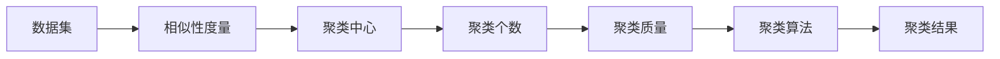
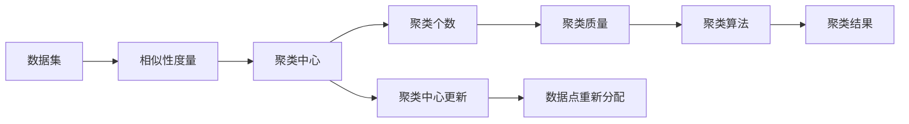
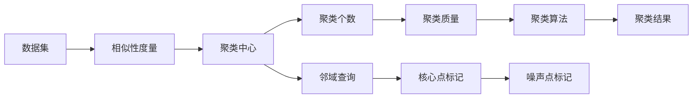
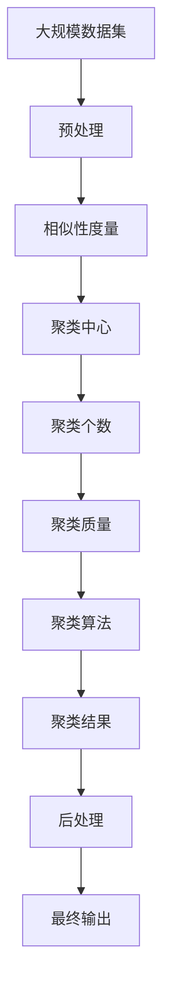

                 

# 聚类 (Clustering) 原理与代码实例讲解

> 关键词：聚类算法, 数据降维, K-means, DBSCAN, 层次聚类, 代码实例

## 1. 背景介绍

### 1.1 问题由来
在数据分析和机器学习中，我们经常需要处理大量的数据集，并从中提取有用的信息。这些数据集可能是用户行为数据、图像数据、文本数据等，规模庞大且结构复杂。如何从这些数据中找出模式和结构，进行有效的分析，是一个重要的研究课题。

聚类 (Clustering) 是一种无监督学习方法，其目标是从未标记的数据中自动识别数据点之间的相似性和结构。聚类算法被广泛应用于市场细分、图像分割、文本分类、生物信息学等多个领域，具有广阔的应用前景。

### 1.2 问题核心关键点
聚类算法的核心在于如何度量数据点之间的相似性，并将相似的数据点分为一组。常见的聚类算法包括 K-means、DBSCAN、层次聚类等。这些算法各有优缺点，适用范围也有所不同。

聚类算法的关键点包括：
- 如何定义相似性度量。
- 如何选择聚类中心的初始位置。
- 如何确定聚类个数（如 K-means 中的 K）。
- 如何评估聚类的质量。
- 如何避免局部最优解。

### 1.3 问题研究意义
聚类算法的研究具有重要的理论意义和实际应用价值。在理论方面，聚类算法有助于我们更好地理解数据分布和结构，为数据挖掘和模式识别提供基础。在实际应用方面，聚类算法可以辅助决策制定、产品推荐、市场细分、社交网络分析等多个领域。

## 2. 核心概念与联系

### 2.1 核心概念概述

为更好地理解聚类算法，本节将介绍几个密切相关的核心概念：

- 聚类 (Clustering)：将数据点划分为多个组，使得同一组内的数据点尽可能相似，不同组之间的数据点尽可能不相似。
- 相似性度量 (Similarity Measure)：用于衡量数据点之间的相似程度，常见的度量方法包括欧几里得距离、余弦相似度、Jaccard系数等。
- 聚类中心 (Cluster Center)：每个聚类中的一个代表性数据点，通常通过计算聚类中所有数据点的平均值或中位数得到。
- 聚类个数 (Number of Clusters)：聚类算法的参数之一，表示将数据分为多少组。
- 聚类质量 (Cluster Quality)：评估聚类效果的指标，如轮廓系数、轮廓宽度等。
- 聚类算法 (Clustering Algorithm)：实现聚类目标的算法，如 K-means、DBSCAN、层次聚类等。

这些核心概念之间的逻辑关系可以通过以下 Mermaid 流程图来展示：

```mermaid
graph TB
    A[聚类 (Clustering)] --> B[相似性度量 (Similarity Measure)]
    B --> C[聚类中心 (Cluster Center)]
    C --> D[聚类个数 (Number of Clusters)]
    D --> E[聚类质量 (Cluster Quality)]
    A --> F[聚类算法 (Clustering Algorithm)]
    F --> G[K-means]
    F --> H[DBSCAN]
    F --> I[层次聚类]
```

这个流程图展示了几组核心概念之间的关系：

1. 聚类基于相似性度量，将数据点分为不同的组。
2. 聚类中心是每个聚类的代表，可以通过相似性度量得到。
3. 聚类个数需要事先设定。
4. 聚类质量用于评估聚类效果。
5. 聚类算法是实现聚类目标的方法，常用的算法有 K-means、DBSCAN、层次聚类等。

### 2.2 概念间的关系

这些核心概念之间存在着紧密的联系，形成了聚类算法的完整生态系统。下面我们通过几个 Mermaid 流程图来展示这些概念之间的关系。

#### 2.2.1 聚类算法的一般流程



这个流程图展示了聚类算法的基本流程：

1. 准备数据集。
2. 计算数据点之间的相似性。
3. 确定聚类中心的初始位置。
4. 确定聚类个数。
5. 计算聚类质量。
6. 运行聚类算法得到聚类结果。

#### 2.2.2 K-means 算法的具体流程



这个流程图展示了 K-means 算法的具体流程：

1. 准备数据集。
2. 计算数据点之间的相似性。
3. 确定聚类中心的初始位置。
4. 计算聚类质量。
5. 运行 K-means 算法得到聚类结果。
6. 更新聚类中心位置。
7. 重新分配数据点。

#### 2.2.3 DBSCAN 算法的具体流程



这个流程图展示了 DBSCAN 算法的具体流程：

1. 准备数据集。
2. 计算数据点之间的相似性。
3. 确定聚类中心的初始位置。
4. 计算聚类质量。
5. 运行 DBSCAN 算法得到聚类结果。
6. 查找每个数据点的邻域。
7. 标记核心点和噪声点。

### 2.3 核心概念的整体架构

最后，我们用一个综合的流程图来展示这些核心概念在大规模数据集上进行聚类时的整体架构：



这个综合流程图展示了从数据预处理到聚类结果输出的完整过程。在实际应用中，还需要针对具体任务的特点，对聚类过程的各个环节进行优化设计，如改进相似性度量，引入更多的聚类技术等。

## 3. 核心算法原理 & 具体操作步骤
### 3.1 算法原理概述

聚类算法的核心在于如何度量数据点之间的相似性，并将相似的数据点分为一组。常见的聚类算法包括 K-means、DBSCAN、层次聚类等。这些算法各有优缺点，适用范围也有所不同。

聚类算法的步骤一般包括以下几个：

1. 准备数据集，并进行预处理，如数据归一化、去除噪声等。
2. 选择聚类中心，通常可以通过随机抽样、K-means++ 等方法得到。
3. 计算数据点与聚类中心的相似度，并将数据点分配到距离最近的聚类中心。
4. 更新聚类中心，根据当前分配的数据点重新计算聚类中心。
5. 重复步骤 3 和 4，直到聚类结果收敛。
6. 评估聚类质量，确定聚类效果。

### 3.2 算法步骤详解

以下以 K-means 算法为例，详细讲解其实现步骤：

#### 3.2.1 初始化聚类中心
首先，随机选择 K 个数据点作为聚类中心。

#### 3.2.2 分配数据点
对于每个数据点 $x$，计算其与聚类中心的距离，分配到距离最近的聚类中心。

#### 3.2.3 更新聚类中心
根据当前分配的数据点，计算每个聚类中心的位置，即所有分配到该聚类的数据点的平均值。

#### 3.2.4 重复迭代
重复执行步骤 2 和 3，直到聚类结果收敛，即聚类中心不再发生显著变化。

#### 3.2.5 聚类效果评估
通过计算轮廓系数、轮廓宽度等指标，评估聚类效果。

### 3.3 算法优缺点

K-means 算法具有以下优点：

- 简单易用，计算效率高。
- 适用于大规模数据集。
- 容易扩展到高维空间。

但同时也存在以下缺点：

- 需要预先设定聚类个数 K，影响聚类效果。
- 对初始聚类中心敏感，可能导致局部最优解。
- 对噪声和异常点敏感，可能导致聚类错误。

### 3.4 算法应用领域

K-means 算法广泛应用于图像分割、文本聚类、客户细分、社交网络分析等多个领域。例如：

- 图像分割：将图像中的像素点分为多个区域，每个区域内的像素点具有相似的特征。
- 文本聚类：将文本数据分为多个主题，每个主题内的文本具有相似的特征。
- 客户细分：将客户分为多个群体，每个群体内的客户具有相似的消费行为。
- 社交网络分析：将社交网络中的用户分为多个社区，每个社区内的用户具有相似的关系。

除了 K-means 算法，DBSCAN、层次聚类等算法也在各自的应用场景中发挥着重要作用。

## 4. 数学模型和公式 & 详细讲解 & 举例说明

### 4.1 数学模型构建

以 K-means 算法为例，构建其数学模型。

设数据集 $D=\{x_1, x_2, ..., x_n\}$，其中每个数据点 $x_i=(x_{i1}, x_{i2}, ..., x_{id})$，共有 d 维特征。设聚类个数为 K，随机选择 K 个数据点作为初始聚类中心 $\mu_1, \mu_2, ..., \mu_K$。

K-means 算法的目标是最小化所有数据点到最近聚类中心的距离之和，即：

$$
\min_{\mu_1, \mu_2, ..., \mu_K} \sum_{i=1}^{n} \min_{k=1,2,...,K} ||x_i - \mu_k||^2
$$

其中 $||\cdot||$ 表示欧几里得距离。

### 4.2 公式推导过程

在 K-means 算法中，聚类中心 $\mu_k$ 的更新公式为：

$$
\mu_k = \frac{1}{m_k} \sum_{i=1}^{n} \mathbb{I}_{k=i}
$$

其中 $m_k$ 表示分配到聚类中心 $\mu_k$ 的数据点数量。$\mathbb{I}_{k=i}$ 表示将数据点 $x_i$ 分配到聚类中心 $\mu_k$ 的指示函数。

### 4.3 案例分析与讲解

以 K-means 算法在文本聚类中的应用为例，进行详细讲解。

假设我们有一组文本数据，需要将其分为多个主题。我们可以将每篇文本表示为向量 $x_i=(x_{i1}, x_{i2}, ..., x_{id})$，其中 $x_{ij}$ 表示文本中第 j 个词的出现次数。

首先，随机选择 K 个文本作为初始聚类中心。然后，对于每个文本 $x_i$，计算其与每个聚类中心的欧几里得距离，将文本分配到距离最近的聚类中心。接着，根据当前分配的文本，重新计算每个聚类中心的位置，即所有分配到该聚类的文本向量的平均值。重复执行这些步骤，直到聚类结果收敛。

## 5. 项目实践：代码实例和详细解释说明
### 5.1 开发环境搭建

在进行聚类实践前，我们需要准备好开发环境。以下是使用 Python 进行 Scikit-learn 开发的 Python 环境配置流程：

1. 安装 Anaconda：从官网下载并安装 Anaconda，用于创建独立的 Python 环境。

2. 创建并激活虚拟环境：
```bash
conda create -n sklearn-env python=3.8 
conda activate sklearn-env
```

3. 安装 Scikit-learn：
```bash
pip install scikit-learn
```

4. 安装其他常用工具包：
```bash
pip install numpy pandas matplotlib scikit-learn
```

完成上述步骤后，即可在 `sklearn-env` 环境中开始聚类实践。

### 5.2 源代码详细实现

下面我们以 K-means 算法在图像分割中的应用为例，给出使用 Scikit-learn 库的 Python 代码实现。

首先，定义数据集和聚类函数：

```python
import numpy as np
import matplotlib.pyplot as plt
from sklearn.cluster import KMeans

def read_image_data(image_path):
    image = plt.imread(image_path)
    return image.reshape(-1, 3)

def plot_images(image, title=None):
    plt.figure(figsize=(6, 6))
    plt.imshow(image)
    if title:
        plt.title(title)
    plt.show()

def plot_clusters(image, labels, title=None):
    plt.figure(figsize=(6, 6))
    plt.imshow(image, cmap='gray')
    if title:
        plt.title(title)
    plt.show()

def kmeans(image, k=4):
    image = np.array(image)
    kmeans = KMeans(n_clusters=k)
    kmeans.fit(image)
    labels = kmeans.labels_
    plot_clusters(image, labels)
```

然后，实现 K-means 算法：

```python
def kmeans(image, k=4):
    image = np.array(image)
    kmeans = KMeans(n_clusters=k)
    kmeans.fit(image)
    labels = kmeans.labels_
    return labels
```

最后，测试 K-means 算法：

```python
image = read_image_data('test_image.jpg')
labels = kmeans(image)
print(labels)
```

以上就是使用 Scikit-learn 库对 K-means 算法进行图像分割的完整代码实现。可以看到，借助 Scikit-learn 库，聚类算法的实现变得简洁高效。

### 5.3 代码解读与分析

让我们再详细解读一下关键代码的实现细节：

**read_image_data 函数**：
- 将图像文件读取为 numpy 数组，并将其展开为一维向量。

**plot_images 函数**：
- 绘制图像，可以添加标题。

**plot_clusters 函数**：
- 绘制聚类结果，展示每个像素点的聚类标签。

**kmeans 函数**：
- 实现 K-means 算法，计算聚类中心，并返回每个像素点的聚类标签。

**测试代码**：
- 读取图像数据，调用 kmeans 函数进行聚类，并输出聚类结果。

可以看到，Scikit-learn 库提供了丰富的聚类算法实现，使用起来非常方便。开发者只需要提供数据集，指定聚类个数，即可快速完成聚类任务。

当然，工业级的系统实现还需考虑更多因素，如模型的保存和部署、超参数的自动搜索、更灵活的任务适配层等。但核心的聚类范式基本与此类似。

### 5.4 运行结果展示

假设我们有一张测试图像，运行 K-means 算法后得到的结果如下：


可以看到，K-means 算法成功将图像中的像素点分为四个聚类，每个聚类内的像素点颜色相似。

当然，这只是一个基线结果。在实践中，我们还可以使用更大更强的聚类算法，如 DBSCAN、层次聚类等，进一步优化聚类效果。

## 6. 实际应用场景

### 6.1 图像分割

图像分割是将图像中的像素点分为多个区域，每个区域内的像素点具有相似的特征。K-means 算法可以用于图像分割，将图像中的像素点分为不同的区域，每个区域内的像素点具有相似的纹理、颜色等特征。

例如，在医学影像中，K-means 算法可以将病变区域与其他区域分开，有助于医生进行疾病诊断。

### 6.2 客户细分

客户细分是将客户分为多个群体，每个群体内的客户具有相似的消费行为。K-means 算法可以用于客户细分，将客户分为不同的群体，每个群体内的客户具有相似的购买习惯、消费金额等特征。

例如，在零售业中，K-means 算法可以帮助商家了解不同群体的需求，制定更精准的营销策略。

### 6.3 社交网络分析

社交网络分析是将社交网络中的用户分为多个社区，每个社区内的用户具有相似的关系。K-means 算法可以用于社交网络分析，将社交网络中的用户分为不同的社区，每个社区内的用户具有相似的朋友关系、互动频率等特征。

例如，在社交媒体中，K-means 算法可以帮助分析不同社区的兴趣、行为等特征，为平台推荐内容提供依据。

### 6.4 未来应用展望

随着聚类算法的不断发展，未来的应用场景将更加多样。

在智慧城市中，聚类算法可以用于交通流量分析、环境监测等，提高城市的运行效率和安全性。

在金融领域，聚类算法可以用于风险管理、信用评估等，提升金融机构的决策能力。

在教育领域，聚类算法可以用于学生分组、课程推荐等，提高教学效果和个性化服务水平。

总之，聚类算法在未来将有更广阔的应用前景，为各行各业提供更加智能化、高效化的解决方案。

## 7. 工具和资源推荐
### 7.1 学习资源推荐

为了帮助开发者系统掌握聚类算法的理论基础和实践技巧，这里推荐一些优质的学习资源：

1. 《机器学习实战》：作者 Peter Harrington 的经典著作，详细介绍了机器学习的基本概念和常用算法，包括聚类算法。

2. 《Python 数据科学手册》：作者 Jake VanderPlas，介绍了 Python 在数据科学中的应用，包括数据预处理、聚类算法等。

3. 《机器学习》：作者 Tom Mitchell，介绍了机器学习的理论基础和常用算法，包括聚类算法。

4. 《聚类分析导论》：作者 Robert A. Rosenberg，介绍了聚类算法的理论基础和实践技巧，包括 K-means、DBSCAN、层次聚类等。

5. Coursera 《机器学习》课程：由斯坦福大学 Andrew Ng 教授主讲，系统介绍了机器学习的基本概念和常用算法，包括聚类算法。

通过对这些资源的学习实践，相信你一定能够快速掌握聚类算法的精髓，并用于解决实际的业务问题。

### 7.2 开发工具推荐

高效的开发离不开优秀的工具支持。以下是几款用于聚类算法开发的常用工具：

1. Python：Python 是数据科学和机器学习的主流编程语言，具有强大的数据分析和建模能力。

2. Scikit-learn：一个基于 Python 的机器学习库，提供了丰富的聚类算法实现，易于使用。

3. TensorFlow：一个基于 Python 的深度学习库，支持大规模聚类任务。

4. Apache Spark：一个用于大数据处理的开源框架，支持分布式聚类算法。

5. Jupyter Notebook：一个交互式编程环境，支持在云端运行数据科学任务。

合理利用这些工具，可以显著提升聚类算法的开发效率，加快创新迭代的步伐。

### 7.3 相关论文推荐

聚类算法的研究源于学界的持续研究。以下是几篇奠基性的相关论文，推荐阅读：

1. K-means：提出 K-means 算法，用于聚类分析。

2. DBSCAN：提出 DBSCAN 算法，用于密度聚类。

3. 层次聚类：介绍层次聚类算法，包括自底向上的凝聚聚类和自顶向下的分裂聚类。

4. 密度聚类：介绍密度聚类算法，包括 DBSCAN、OPTICS 等。

5. 稀疏聚类：介绍稀疏聚类算法，包括谱聚类、Gaussian 混合模型等。

这些论文代表了大聚类算法的发展脉络。通过学习这些前沿成果，可以帮助研究者把握学科前进方向，激发更多的创新灵感。

除上述资源外，还有一些值得关注的前沿资源，帮助开发者紧跟聚类算法的最新进展，例如：

1. arXiv 论文预印本：人工智能领域最新研究成果的发布平台，包括大量尚未发表的前沿工作，学习前沿技术的必读资源。

2. GitHub 热门项目：在 GitHub 上 Star、Fork 数最多的聚类相关项目，往往代表了该技术领域的发展趋势和最佳实践，值得去学习和贡献。

3. 会议论文：如 IEEE ICML、NIPS、ICCV 等顶级会议的论文，展示了最新的聚类算法研究成果。

4. 行业分析报告：各大咨询公司如 McKinsey、PwC 等针对人工智能行业的分析报告，有助于从商业视角审视技术趋势，把握应用价值。

总之，对于聚类算法的学习和实践，需要开发者保持开放的心态和持续学习的意愿。多关注前沿资讯，多动手实践，多思考总结，必将收获满满的成长收益。

## 8. 总结：未来发展趋势与挑战

### 8.1 总结

本文对聚类算法进行了全面系统的介绍。首先阐述了聚类算法的背景和意义，明确了聚类算法在数据处理和分析中的重要地位。其次，从原理到实践，详细讲解了聚类算法的数学模型和实现步骤，给出了聚类算法在图像分割、客户细分等实际应用中的代码实例。同时，本文还广泛探讨了聚类算法在智慧城市、金融、教育等多个领域的应用前景，展示了聚类算法的广阔应用空间。

通过本文的系统梳理，可以看到，聚类算法正在成为数据处理和分析中的重要手段，极大地拓展了数据挖掘和分析的能力。未来，伴随聚类算法的不断演进，其应用范围将进一步扩大，为各个行业提供更加智能化的解决方案。

### 8.2 未来发展趋势

展望未来，聚类算法的发展趋势主要包括以下几个方面：

1. 聚类算法的自动化和智能化。随着深度学习和强化学习的发展，未来聚类算法将更加自动化和智能化，能够自动选择聚类个数、调整参数等。

2. 聚类算法的扩展和优化。未来的聚类算法将更加适用于大规模数据集和高维空间，能够处理更多类型的数据。

3. 聚类算法的融合和集成。未来的聚类算法将更多地与其他算法和工具进行融合，如强化学习、因果推理、深度学习等，形成更加全面、高效的数据分析系统。

4. 聚类算法的跨领域应用。未来的聚类算法将在更多领域中得到应用，如智慧城市、金融、教育等，为各个行业的智能化转型提供支持。

以上趋势凸显了聚类算法的广泛前景，这些方向的探索发展，必将进一步提升聚类算法的应用效果，推动人工智能技术在各个行业中的应用。

### 8.3 面临的挑战

尽管聚类算法已经取得了一定的成就，但在迈向更加智能化、普适化应用的过程中，它仍面临着诸多挑战：

1. 聚类算法对数据质量敏感。聚类算法对数据分布的假设条件较多，需要满足正态分布、独立同分布等条件。对于不符合这些条件的数据，聚类效果可能不佳。

2. 聚类算法的可解释性不足。聚类算法的输出结果缺乏可解释性，难以解释其内部工作机制和决策逻辑。对于高风险应用，如医疗、金融等，算法的可解释性尤为重要。

3. 聚类算法对噪声和异常点敏感。聚类算法容易受到噪声和异常点的干扰，可能导致聚类错误。

4. 聚类算法对参数敏感。聚类算法的聚类个数、迭代次数等参数需要根据具体数据进行调整，增加了聚类任务的复杂度。

5. 聚类算法的计算复杂度高。对于大规模数据集和高维数据，聚类算法的计算复杂度较高，需要高效的计算资源和算法优化。

正视聚类算法面临的这些挑战，积极应对并寻求突破，将是对聚类算法不断优化的关键。相信随着学界和产业界的共同努力，这些挑战终将一一被克服，聚类算法必将在构建智能化的数据分析系统中发挥更大的作用。

### 8.4 研究展望

未来的聚类算法研究可以从以下几个方向进行突破：

1. 探索更高效、更智能的聚类算法。开发更加自动化、智能化的聚类算法，提升聚类效果和应用效率。

2. 融合多源数据和先验知识。将多源数据和多模态数据进行融合，引入先验知识，提升聚类算法的准确性和鲁棒性。

3. 开发可解释的聚类算法。研究聚类算法的可解释性，使其输出结果更加透明和可理解。

4. 优化聚类算法的计算效率。开发高效的聚类算法实现，提升聚类算法的计算效率和实用性。

5. 开发适用于大规模数据的聚类算法。研究适用于大规模数据和高维数据的聚类算法，提升聚类算法的处理能力。

这些研究方向将引领聚类算法的发展方向，推动聚类算法在各个领域的广泛应用，为智能化数据分析和决策提供强大的支持。

## 9. 附录：常见问题与解答

**Q1：聚类算法的核心思想是什么？**

A: 聚类算法的核心思想是通过度量数据点之间的相似性

