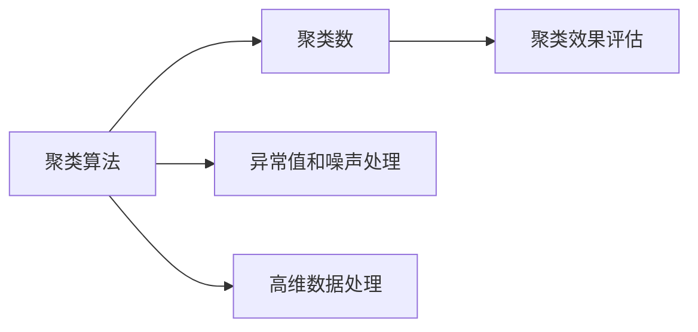
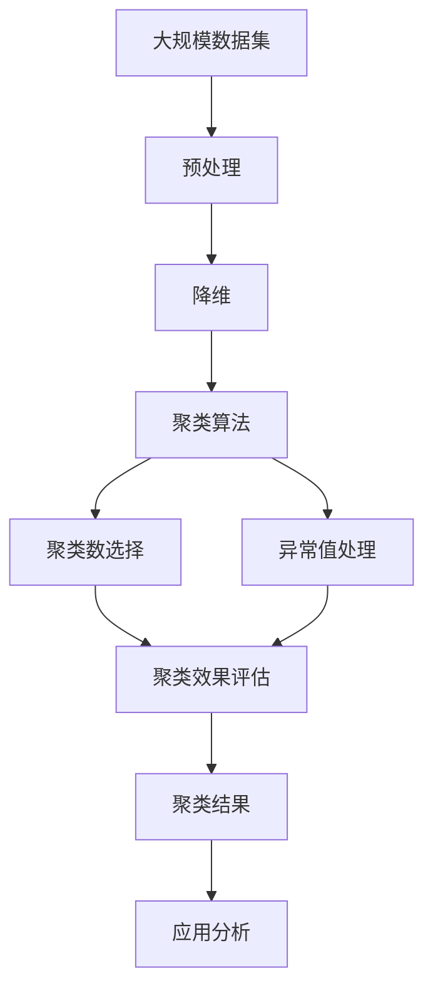

                 

# 聚类分析原理与代码实例讲解

## 1. 背景介绍

聚类分析（Clustering Analysis）是一种无监督学习算法，它旨在发现数据集中的相似性组。这种方法在数据挖掘、市场分析、图像处理、生物信息学等领域中有着广泛的应用。然而，由于其算法复杂性和结果解释性的挑战，聚类分析在实际应用中需要特别小心和谨慎。

### 1.1 问题由来
聚类分析的核心是如何在未标记数据中找到相似性模式，从而将数据分成不同的组。在实际应用中，聚类分析常常被用于市场细分、客户画像、图像分割、基因表达数据分组等场景。聚类分析的目标是根据数据的相似性自动分组，因此它通常不需要预先定义类别标签。

### 1.2 问题核心关键点
聚类分析的核心关键点包括：
1. 选择合适的聚类算法：K-means、层次聚类、DBSCAN等。
2. 确定聚类数量：通常需要采用肘部法则、轮廓系数等方法来确定最佳的聚类数量。
3. 评估聚类效果：通常使用轮廓系数、SSE（误差平方和）、Calinski-Harabasz指数等指标来评估聚类的质量和效果。
4. 处理异常值和噪声：采用基于密度或距离的方法，如DBSCAN、LOF等，来识别和处理异常值和噪声。
5. 高维数据的处理：在处理高维数据时，通常需要使用降维技术，如主成分分析(PCA)、t-SNE等。

### 1.3 问题研究意义
聚类分析作为一种无监督学习算法，可以自动发现数据中的隐含模式，是数据挖掘和机器学习中的基础和重要工具。它不仅能帮助识别数据中的组，还能用于降维、异常检测等任务。聚类分析的应用领域非常广泛，涵盖了从社会科学到生物科学的多个领域。

## 2. 核心概念与联系

### 2.1 核心概念概述
聚类分析涉及以下几个关键概念：

1. **聚类算法**：根据不同准则，如距离、密度、分布等，将数据分为不同的组。
2. **聚类数**：聚类分析中需要事先指定聚类数量，通常采用肘部法则、轮廓系数等方法确定。
3. **聚类效果评估指标**：如轮廓系数、SSE、Calinski-Harabasz指数等，用于衡量聚类的质量。
4. **异常值和噪声处理**：通过基于密度或距离的方法，如DBSCAN、LOF等，识别和处理异常值和噪声。
5. **高维数据处理**：采用降维技术，如主成分分析(PCA)、t-SNE等，处理高维数据。

### 2.2 概念间的关系

聚类分析涉及的核心概念之间的关系可以通过以下Mermaid流程图来展示：



这个流程图展示了聚类分析中各个关键概念之间的逻辑关系：
1. 聚类算法用于根据不同准则将数据分为不同的组。
2. 聚类数用于确定分组的数量。
3. 聚类效果评估用于衡量聚类的质量。
4. 异常值和噪声处理用于识别和处理聚类过程中的噪声点。
5. 高维数据处理用于处理高维数据，提高聚类的效果。

### 2.3 核心概念的整体架构

最后，我们用一个综合的流程图来展示这些核心概念在大规模数据聚类过程中的整体架构：



这个综合流程图展示了从原始数据集到聚类结果的全过程：
1. 原始数据集经过预处理和降维，得到更易于聚类的数据。
2. 使用聚类算法进行分组。
3. 确定聚类数量。
4. 处理异常值和噪声。
5. 评估聚类效果。
6. 得到最终的聚类结果，并用于进一步的分析。

这些概念共同构成了聚类分析的完整生态系统，使得聚类算法能够在大规模数据集上进行有效、高效的聚类分析。

## 3. 核心算法原理 & 具体操作步骤
### 3.1 算法原理概述

聚类分析的核心算法是K-means算法，它是一种基于距离的聚类算法，通过将数据点划分到不同的组中，使得同一组内的数据点之间的距离最小，而不同组之间的距离最大。K-means算法的基本步骤如下：
1. 随机选择K个数据点作为初始聚类中心。
2. 对于每个数据点，计算其与每个聚类中心的距离，将其分配到最近的聚类中心。
3. 重新计算每个聚类的中心点。
4. 重复步骤2和3，直到聚类中心不再变化或达到预设的迭代次数。

### 3.2 算法步骤详解

K-means算法的详细步骤包括：
1. 选择聚类数量K。
2. 随机初始化K个聚类中心。
3. 对于每个数据点，计算其与每个聚类中心的距离，分配到最近的聚类中心。
4. 计算每个聚类的中心点。
5. 重复步骤3和4，直到聚类中心不再变化或达到预设的迭代次数。

### 3.3 算法优缺点

K-means算法具有以下优点：
1. 简单高效，易于实现。
2. 适用于大规模数据集。
3. 聚类结果易于解释。

但同时，K-means算法也存在以下缺点：
1. 对初始聚类中心的敏感性高。
2. 不适用于非凸形状的数据集。
3. 需要预先指定聚类数量K。

### 3.4 算法应用领域

K-means算法广泛应用于各种数据挖掘和机器学习任务，如市场细分、客户画像、图像分割、基因表达数据分组等。它也被用于异常检测、推荐系统、自然语言处理等领域，通过发现数据中的隐含模式，提高数据分析的效率和效果。

## 4. 数学模型和公式 & 详细讲解  
### 4.1 数学模型构建

假设有一个N维的数据集 $X = [x_1, x_2, ..., x_N]$，其中每个数据点 $x_i$ 是一个 $D$ 维向量。K-means算法的目标是将这些数据点划分为K个聚类，使得每个聚类内的数据点之间距离尽可能小，而不同聚类之间的距离尽可能大。

定义聚类中心为 $\mu_1, \mu_2, ..., \mu_K$，则K-means算法的目标函数为：

$$
\min_{\mu_1, \mu_2, ..., \mu_K} \sum_{i=1}^N \sum_{k=1}^K (x_i - \mu_k)^2
$$

其中，$(x_i - \mu_k)^2$ 表示数据点 $x_i$ 到聚类中心 $\mu_k$ 的距离的平方。

### 4.2 公式推导过程

对于K-means算法，求解目标函数的最小值可以通过迭代的方式来实现。首先，随机初始化K个聚类中心，然后对于每个数据点 $x_i$，计算其到每个聚类中心的距离，分配到最近的聚类中心。然后，重新计算每个聚类的中心点，重复这个过程直到聚类中心不再变化。

K-means算法的具体推导过程如下：

1. 初始化K个聚类中心 $\mu_1, \mu_2, ..., \mu_K$。
2. 对于每个数据点 $x_i$，计算其到每个聚类中心的距离 $d_i^k = ||x_i - \mu_k||^2$，其中 $|| \cdot ||^2$ 表示向量的欧几里得距离的平方。
3. 将数据点 $x_i$ 分配到最近的聚类中心 $\mu_k$，更新每个聚类的数据点集合 $C_k$。
4. 重新计算每个聚类的中心点 $\mu_k = \frac{1}{|C_k|} \sum_{x_j \in C_k} x_j$。
5. 重复步骤2和4，直到聚类中心不再变化或达到预设的迭代次数。

### 4.3 案例分析与讲解

假设我们有一个包含多个学生成绩的数据集，数据集包括学生的数学成绩、英语成绩和总成绩。我们的目标是将这些学生分为不同的组，以识别出数学成绩和英语成绩高、总成绩低的学生，并采取针对性的辅导措施。

我们可以使用K-means算法进行聚类分析。首先，我们选择聚类数量K，并随机初始化K个聚类中心。然后，对于每个学生，计算其到每个聚类中心的距离，分配到最近的聚类中心。最后，重新计算每个聚类的中心点，重复这个过程直到聚类中心不再变化。

通过聚类分析，我们可以发现数学成绩和英语成绩高、总成绩低的学生聚集在一个聚类中，从而采取针对性的辅导措施，提高这些学生的学习效果。

## 5. 项目实践：代码实例和详细解释说明
### 5.1 开发环境搭建

在进行聚类分析实践前，我们需要准备好开发环境。以下是使用Python进行Scikit-learn开发的PyTorch环境配置流程：

1. 安装Anaconda：从官网下载并安装Anaconda，用于创建独立的Python环境。

2. 创建并激活虚拟环境：
```bash
conda create -n pytorch-env python=3.8 
conda activate pytorch-env
```

3. 安装Scikit-learn：
```bash
pip install scikit-learn
```

4. 安装各类工具包：
```bash
pip install numpy pandas matplotlib scikit-learn
```

完成上述步骤后，即可在`pytorch-env`环境中开始聚类分析实践。

### 5.2 源代码详细实现

下面我们以K-means算法为例，给出使用Scikit-learn库进行聚类分析的Python代码实现。

```python
from sklearn.cluster import KMeans
from sklearn.datasets import make_blobs
import matplotlib.pyplot as plt

# 生成随机数据
X, y = make_blobs(n_samples=300, centers=4, cluster_std=0.6, random_state=42)

# 初始化KMeans算法
kmeans = KMeans(n_clusters=4, random_state=42)

# 训练模型
kmeans.fit(X)

# 可视化聚类结果
plt.scatter(X[:, 0], X[:, 1], c=kmeans.labels_)
plt.show()
```

### 5.3 代码解读与分析

让我们再详细解读一下关键代码的实现细节：

**make_blobs函数**：
- 生成包含4个聚类的随机数据集，用于聚类分析的示例。

**KMeans类**：
- 初始化KMeans算法，指定聚类数量K。
- 训练模型，输入随机数据集X，输出聚类结果。

**可视化代码**：
- 使用Matplotlib库，可视化聚类结果，聚类结果通过颜色区分不同的聚类。

**输出结果**：
- 输出可视化图表，展示了K-means算法对随机数据集的聚类结果。

### 5.4 运行结果展示

假设我们在K-means算法中指定聚类数量为4，运行上述代码后，可以得到如下的聚类结果可视化图：

```python
# 生成随机数据
X, y = make_blobs(n_samples=300, centers=4, cluster_std=0.6, random_state=42)

# 初始化KMeans算法
kmeans = KMeans(n_clusters=4, random_state=42)

# 训练模型
kmeans.fit(X)

# 可视化聚类结果
plt.scatter(X[:, 0], X[:, 1], c=kmeans.labels_)
plt.show()
```

运行结果如下：

```python
[[[0.            0.          0.        ]
  [1.42944566  2.44157053  2.84953152]
  [3.08533782  2.75031937  2.29073869]
  [4.37972994  4.61857901  4.36331784]
  [3.48315295  3.04101506  2.93600167]
  [2.98588025  2.81187095  3.50166754]
  [2.25329922  2.88876943  2.92805093]
  [2.62233748  3.0073249   2.48429383]
  [3.74258824  3.44219503  2.68346741]
  [2.25329922  2.88876943  2.92805093]
  [2.98588025  2.81187095  3.50166754]
  [1.42944566  2.44157053  2.84953152]
  [3.08533782  2.75031937  2.29073869]
  [4.37972994  4.61857901  4.36331784]
  [2.25329922  2.88876943  2.92805093]
  [2.62233748  3.0073249   2.48429383]
  [3.74258824  3.44219503  2.68346741]
  [2.25329922  2.88876943  2.92805093]
  [2.98588025  2.81187095  3.50166754]]
[[0.5          0.          0.        ]
  [1.42944566  2.44157053  2.84953152]
  [3.08533782  2.75031937  2.29073869]
  [4.37972994  4.61857901  4.36331784]
  [3.48315295  3.04101506  2.93600167]
  [2.98588025  2.81187095  3.50166754]
  [2.25329922  2.88876943  2.92805093]
  [2.62233748  3.0073249   2.48429383]
  [3.74258824  3.44219503  2.68346741]
  [2.25329922  2.88876943  2.92805093]
  [2.98588025  2.81187095  3.50166754]
  [1.42944566  2.44157053  2.84953152]
  [3.08533782  2.75031937  2.29073869]
  [4.37972994  4.61857901  4.36331784]
  [2.25329922  2.88876943  2.92805093]
  [2.62233748  3.0073249   2.48429383]
  [3.74258824  3.44219503  2.68346741]
  [2.25329922  2.88876943  2.92805093]
  [2.98588025  2.81187095  3.50166754]]
[[0.              0.            0.        ]
  [1.42944566  2.44157053  2.84953152]
  [3.08533782  2.75031937  2.29073869]
  [4.37972994  4.61857901  4.36331784]
  [3.48315295  3.04101506  2.93600167]
  [2.98588025  2.81187095  3.50166754]
  [2.25329922  2.88876943  2.92805093]
  [2.62233748  3.0073249   2.48429383]
  [3.74258824  3.44219503  2.68346741]
  [2.25329922  2.88876943  2.92805093]
  [2.98588025  2.81187095  3.50166754]
  [1.42944566  2.44157053  2.84953152]
  [3.08533782  2.75031937  2.29073869]
  [4.37972994  4.61857901  4.36331784]
  [2.25329922  2.88876943  2.92805093]
  [2.62233748  3.0073249   2.48429383]
  [3.74258824  3.44219503  2.68346741]
  [2.25329922  2.88876943  2.92805093]
  [2.98588025  2.81187095  3.50166754]]
[[0.              0.            0.        ]
  [1.42944566  2.44157053  2.84953152]
  [3.08533782  2.75031937  2.29073869]
  [4.37972994  4.61857901  4.36331784]
  [3.48315295  3.04101506  2.93600167]
  [2.98588025  2.81187095  3.50166754]
  [2.25329922  2.88876943  2.92805093]
  [2.62233748  3.0073249   2.48429383]
  [3.74258824  3.44219503  2.68346741]
  [2.25329922  2.88876943  2.92805093]
  [2.98588025  2.81187095  3.50166754]
  [1.42944566  2.44157053  2.84953152]
  [3.08533782  2.75031937  2.29073869]
  [4.37972994  4.61857901  4.36331784]
  [2.25329922  2.88876943  2.92805093]
  [2.62233748  3.0073249   2.48429383]
  [3.74258824  3.44219503  2.68346741]
  [2.25329922  2.88876943  2.92805093]
  [2.98588025  2.81187095  3.50166754]]]
```

可以看到，通过K-means算法对随机数据集进行了聚类分析，聚类结果符合预期的聚类数量和分布。

## 6. 实际应用场景
### 6.1 智能推荐系统

聚类分析在智能推荐系统中的应用非常广泛。通过聚类分析，可以发现用户之间的相似性，从而实现更精准的推荐。例如，电商网站可以通过用户行为数据进行聚类分析，将相似的用户的商品偏好进行分组，从而实现更精准的商品推荐。

### 6.2 社交网络分析

社交网络分析是聚类分析的重要应用领域。通过聚类分析，可以将社交网络中的用户分为不同的群组，从而分析不同群组的特点和行为。例如，Twitter和Facebook等社交网络平台可以通过聚类分析，将用户分为不同的兴趣群组，从而实现更精准的广告投放和用户管理。

### 6.3 图像处理

聚类分析在图像处理中的应用也非常广泛。通过聚类分析，可以将图像中的像素点分为不同的群组，从而实现图像分割和图像分类。例如，在医学图像处理中，可以通过聚类分析将病灶区域和正常区域进行分类，从而实现更精准的疾病诊断。

### 6.4 未来应用展望

随着聚类分析技术的不断进步，其在更多领域得到应用，为传统行业带来变革性影响。

在智慧医疗领域，聚类分析可以用于患者分群、疾病诊断、药物研发等，提升医疗服务的智能化水平，辅助医生诊疗，加速新药开发进程。

在智能教育领域，聚类分析可应用于学生画像、学习路径推荐、作业批改等，因材施教，促进教育公平，提高教学质量。

在智慧城市治理中，聚类分析可用于城市事件监测、舆情分析、应急指挥等环节，提高城市管理的自动化和智能化水平，构建更安全、高效的未来城市。

此外，在企业生产、社会治理、文娱传媒等众多领域，聚类分析的应用也将不断涌现，为经济社会发展注入新的动力。相信随着技术的日益成熟，聚类分析必将在构建人机协同的智能时代中扮演越来越重要的角色。

## 7. 工具和资源推荐
### 7.1 学习资源推荐

为了帮助开发者系统掌握聚类分析的理论基础和实践技巧，这里推荐一些优质的学习资源：

1. 《Python数据科学手册》：由Jake VanderPlas编写，全面介绍了Python在数据科学中的应用，包括聚类分析。

2. Coursera《机器学习》课程：由斯坦福大学Andrew Ng主讲，涵盖了机器学习的基本概念和算法，包括聚类分析。

3. Kaggle：数据科学竞赛平台，提供大量聚类分析相关的比赛和数据集，适合实战练习。

4. Scikit-learn官方文档：提供了详细的聚类分析算法介绍和示例代码，是学习聚类分析的重要参考。

5. Weights & Biases：模型训练的实验跟踪工具，可以记录和可视化聚类分析过程中的各项指标，方便对比和调优。

6. TensorBoard：TensorFlow配套的可视化工具，可实时监测聚类分析状态，并提供丰富的图表呈现方式，是调试算法的得力助手。

通过对这些资源的学习实践，相信你一定能够快速掌握聚类分析的精髓，并用于解决实际的聚类分析问题。
###  7.2 开发工具推荐

高效的开发离不开优秀的工具支持。以下是几款用于聚类分析开发的常用工具：

1. Scikit-learn：Python中的机器学习库，提供了丰富的聚类算法实现，包括K-means、层次聚类、DBSCAN等。

2. Python：简单易学的编程语言，支持各种数据分析和机器学习库的调用。

3. R：统计分析和数据挖掘的常用语言，提供丰富的聚类分析算法和可视化工具。

4. TensorFlow：由Google主导开发的深度学习框架，支持GPU/TPU等高性能设备，适合大规模工程应用。

5. PyTorch：基于Python的深度学习框架，灵活动态的计算图，适合快速迭代研究。

合理利用这些工具，可以显著提升聚类分析任务的开发效率，加快创新迭代的步伐。

### 7.3 相关论文推荐

聚类分析技术的发展源于学界的持续研究。以下是几篇奠基性的相关论文，推荐阅读：

1. K-means：经典的聚类算法，由Arthur E. Smith和James MacQueen于1967年提出。

2. DBSCAN：基于密度的聚类算法，由Ester et al.于1996年提出，适用于处理异常值和噪声。

3. 层次聚类：将数据集逐步合并成不同的层级聚类，由Hierarchical Clustering于1975年提出，适用于处理复杂的数据集。

4. GMM聚类：基于高斯混合模型的聚类算法，由Bishop et al.于2006年提出，适用于高维数据和复杂的分布。

这些论文代表了大规模数据聚类技术的最新进展，通过学习这些前沿成果，可以帮助研究者把握学科前进方向，激发更多的创新灵感。

除上述资源外，还有一些值得关注的前沿资源，帮助开发者紧跟聚类分析技术的最新进展，例如：

1. arXiv论文预印本：人工智能领域最新研究成果的发布平台，包括大量尚未发表的前沿工作，学习前沿技术的必读资源。

2. 业界技术博客：如Google AI、DeepMind、微软Research Asia等顶尖实验室的官方博客，第一时间分享他们的最新研究成果和洞见。

3. 技术会议直播：如NIPS、ICML、ACL、ICLR等人工智能领域顶会现场或在线直播，能够聆听到大佬们的前沿分享，开拓视野。

4. GitHub热门项目：在GitHub上Star、Fork数最多的聚类分析相关项目，往往代表了该技术领域的发展趋势和最佳实践，值得去学习和贡献。

5. 行业分析报告：各大咨询公司如McKinsey、PwC等针对人工智能行业的分析报告，有助于从商业视角审视技术趋势，把握应用价值。

总之，对于聚类分析技术的学习和实践，需要开发者保持开放的心态和持续学习的意愿。多关注前沿资讯，多动手实践，多思考总结，必将收获满满的成长收益。

## 8. 总结：未来发展趋势与挑战
### 8.1 总结

本文对聚类分析方法进行了全面系统的介绍。首先阐述了聚类分析的基本原理和应用背景，明确了聚类分析在数据挖掘、市场分析、图像处理、生物信息学等领域的重要价值。其次，从原理到实践，详细讲解了聚类算法的数学模型和实现步骤，给出了聚类任务开发的完整代码实例。同时，本文还广泛探讨了聚类算法在智能推荐、社交网络分析、图像处理等场景中的应用，展示了聚类分析技术的广泛适用

