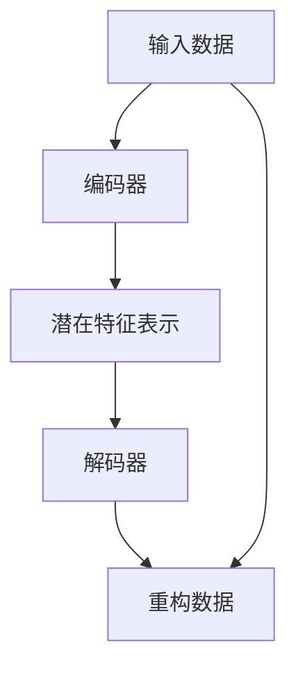

                 

# 自动编码器 (Autoencoder) 原理与代码实例讲解

> 关键词：自动编码器,压缩感知,无监督学习,信号恢复,深度学习,神经网络,TensorFlow

## 1. 背景介绍

### 1.1 问题由来
随着深度学习技术的快速发展，神经网络在计算机视觉、语音识别、自然语言处理等领域取得了显著的成果。然而，对于大规模的数据集，传统的神经网络模型往往需要大量的标注数据进行训练，这不仅成本高昂，而且在大规模无标签数据集上的表现通常不理想。自动编码器（Autoencoder）是一种无监督学习算法，它能够通过从输入数据中学习到数据的潜在特征表示，从而进行数据的重建与恢复。这种方法在信号处理、数据压缩、特征学习等领域有广泛应用，也是深度学习中的经典模型之一。

### 1.2 问题核心关键点
自动编码器是一种基于神经网络的模型，它由一个编码器和一个解码器组成。编码器将输入数据压缩成潜在特征表示，解码器则将特征表示恢复为原始数据。通过训练自动编码器，可以从高维输入数据中学习到低维的潜在表示，从而实现数据的降维、去噪、特征提取等任务。自动编码器的核心在于如何在编码与解码过程中最小化重构误差，恢复数据的原始特征。

### 1.3 问题研究意义
自动编码器作为一种无监督学习方法，在数据压缩、信号恢复、特征学习等方面有广泛应用。它能够从大规模无标签数据中学习到数据的潜在特征表示，降低数据维度，提高数据处理效率。自动编码器的应用不仅能够显著降低数据处理的成本，还能提高数据的准确性和可靠性，从而为各种计算机视觉、语音识别、自然语言处理等任务提供有力支持。

## 2. 核心概念与联系

### 2.1 核心概念概述

为了更好地理解自动编码器的原理，我们先介绍几个关键概念：

- **自动编码器**：一种无监督学习算法，由编码器和解码器组成。编码器将输入数据压缩成低维潜在特征表示，解码器则将这些特征表示恢复为原始数据。
- **重构误差**：自动编码器通过最小化重构误差来训练模型，重构误差表示解码器输出的数据与原始数据之间的差异。
- **潜在特征表示**：自动编码器学习的潜在特征表示，可以用于数据的降维、去噪、特征提取等任务。
- **深度学习**：自动编码器是深度学习中的一种模型，通过多层神经网络实现数据的压缩和恢复。

### 2.2 核心概念间的关系

自动编码器的核心概念关系可以通过以下Mermaid流程图来展示：



这个流程图展示自动编码器的工作原理：输入数据首先经过编码器压缩成低维的潜在特征表示，然后通过解码器将特征表示恢复为原始数据。自动编码器通过最小化重构误差来训练模型，以逼近数据的真实表示。

## 3. 核心算法原理 & 具体操作步骤
### 3.1 算法原理概述

自动编码器基于深度学习，由编码器和解码器组成。编码器将输入数据压缩成潜在特征表示，解码器则将这些特征表示恢复为原始数据。自动编码器的训练目标是尽量减少重构误差，即解码器输出的数据与原始数据之间的差异。

数学上，自动编码器可以表示为：

$$
\begin{aligned}
z &= h(x; \theta_e) \\
\hat{x} &= g(z; \theta_d) \\
\mathcal{L} &= \frac{1}{N}\sum_{i=1}^N \|x_i - \hat{x}_i\|^2
\end{aligned}
$$

其中，$x$ 表示输入数据，$z$ 表示潜在特征表示，$h$ 表示编码器，$g$ 表示解码器，$\theta_e$ 和 $\theta_d$ 分别表示编码器和解码器的参数，$\mathcal{L}$ 表示重构误差，$N$ 表示样本数。

### 3.2 算法步骤详解

自动编码器的训练步骤一般包括以下几个关键步骤：

1. 初始化编码器和解码器的权重。
2. 通过随机梯度下降等优化算法，最小化重构误差 $\mathcal{L}$。
3. 迭代更新编码器和解码器的权重，直到收敛。

下面给出一个详细的训练流程：

1. 初始化编码器和解码器的权重。
2. 对于每个样本 $x_i$，通过编码器 $h$ 将其压缩成潜在特征表示 $z_i$。
3. 通过解码器 $g$ 将潜在特征表示 $z_i$ 恢复为原始数据 $\hat{x}_i$。
4. 计算重构误差 $\mathcal{L} = \frac{1}{N}\sum_{i=1}^N \|x_i - \hat{x}_i\|^2$。
5. 使用梯度下降等优化算法，更新编码器和解码器的权重，最小化重构误差。
6. 重复上述步骤，直到收敛。

### 3.3 算法优缺点

自动编码器具有以下优点：

- **无监督学习**：自动编码器无需标注数据，可以从大规模无标签数据中学习数据的潜在特征表示。
- **降维与去噪**：自动编码器能够将高维数据压缩成低维表示，从而实现数据的降维与去噪。
- **特征提取**：自动编码器学习到的潜在特征表示可以用于数据的特征提取和分类。

然而，自动编码器也存在一些缺点：

- **模型复杂度**：自动编码器通常需要多层神经网络来实现，模型复杂度较高。
- **训练时间长**：自动编码器的训练通常需要较长时间，特别是对于高维数据。
- **过拟合问题**：自动编码器在训练过程中容易过拟合，尤其是在训练数据不足的情况下。

### 3.4 算法应用领域

自动编码器在多个领域中都有广泛的应用，主要包括：

- **信号处理**：自动编码器可以用于图像、音频、视频等信号的压缩与恢复。
- **数据降维**：自动编码器可以将高维数据降维，减少数据处理的复杂度。
- **特征学习**：自动编码器可以学习数据的潜在特征表示，用于数据的分类和聚类。
- **图像去噪**：自动编码器可以用于图像的去噪和增强。

## 4. 数学模型和公式 & 详细讲解

### 4.1 数学模型构建

自动编码器的数学模型可以表示为：

$$
\begin{aligned}
z &= h(x; \theta_e) \\
\hat{x} &= g(z; \theta_d) \\
\mathcal{L} &= \frac{1}{N}\sum_{i=1}^N \|x_i - \hat{x}_i\|^2
\end{aligned}
$$

其中，$x$ 表示输入数据，$z$ 表示潜在特征表示，$h$ 表示编码器，$g$ 表示解码器，$\theta_e$ 和 $\theta_d$ 分别表示编码器和解码器的参数，$\mathcal{L}$ 表示重构误差，$N$ 表示样本数。

### 4.2 公式推导过程

以一个简单的单层自动编码器为例，假设输入数据 $x$ 是一个 $d$ 维向量，编码器的输出 $z$ 是一个 $d'$ 维向量，解码器的输出 $\hat{x}$ 也是一个 $d$ 维向量。自动编码器的训练目标可以表示为：

$$
\begin{aligned}
z &= W_1x + b_1 \\
\hat{x} &= W_2z + b_2 \\
\mathcal{L} &= \frac{1}{N}\sum_{i=1}^N \|x_i - \hat{x}_i\|^2
\end{aligned}
$$

其中，$W_1$ 和 $W_2$ 分别表示编码器和解码器的权重矩阵，$b_1$ 和 $b_2$ 分别表示编码器和解码器的偏置向量。

自动编码器的训练过程可以通过梯度下降等优化算法实现，例如：

$$
\begin{aligned}
W_1 &= W_1 - \eta \nabla_{W_1} \mathcal{L} \\
W_2 &= W_2 - \eta \nabla_{W_2} \mathcal{L} \\
b_1 &= b_1 - \eta \nabla_{b_1} \mathcal{L} \\
b_2 &= b_2 - \eta \nabla_{b_2} \mathcal{L}
\end{aligned}
$$

其中，$\eta$ 表示学习率，$\nabla_{W_1} \mathcal{L}$ 表示重构误差对 $W_1$ 的梯度，其他变量类似。

### 4.3 案例分析与讲解

下面以一个简单的图像压缩为例，说明自动编码器的工作原理。

假设输入图像 $x$ 是一个 $m \times n$ 的二维矩阵，编码器的输出 $z$ 是一个 $d'$ 维向量，解码器的输出 $\hat{x}$ 也是 $m \times n$ 的二维矩阵。自动编码器的训练过程可以表示为：

$$
\begin{aligned}
z &= W_1x + b_1 \\
\hat{x} &= W_2z + b_2
\end{aligned}
$$

其中，$W_1$ 和 $W_2$ 分别表示编码器和解码器的权重矩阵，$b_1$ 和 $b_2$ 分别表示编码器和解码器的偏置向量。

假设输入图像 $x$ 是一个 $64 \times 64$ 的灰度图像，编码器的输出 $z$ 是一个 $32$ 维向量，解码器的输出 $\hat{x}$ 也是 $64 \times 64$ 的灰度图像。自动编码器的训练过程可以通过梯度下降等优化算法实现，例如：

$$
\begin{aligned}
W_1 &= W_1 - \eta \nabla_{W_1} \mathcal{L} \\
W_2 &= W_2 - \eta \nabla_{W_2} \mathcal{L} \\
b_1 &= b_1 - \eta \nabla_{b_1} \mathcal{L} \\
b_2 &= b_2 - \eta \nabla_{b_2} \mathcal{L}
\end{aligned}
$$

其中，$\eta$ 表示学习率，$\nabla_{W_1} \mathcal{L}$ 表示重构误差对 $W_1$ 的梯度，其他变量类似。

## 5. 项目实践：代码实例和详细解释说明
### 5.1 开发环境搭建

在进行自动编码器实践前，我们需要准备好开发环境。以下是使用Python进行TensorFlow开发的环境配置流程：

1. 安装Anaconda：从官网下载并安装Anaconda，用于创建独立的Python环境。

2. 创建并激活虚拟环境：
```bash
conda create -n tf-env python=3.8 
conda activate tf-env
```

3. 安装TensorFlow：根据CUDA版本，从官网获取对应的安装命令。例如：
```bash
conda install tensorflow -c conda-forge -c pytorch
```

4. 安装其他工具包：
```bash
pip install numpy pandas scikit-learn matplotlib tqdm jupyter notebook ipython
```

完成上述步骤后，即可在`tf-env`环境中开始自动编码器的开发。

### 5.2 源代码详细实现

下面我们以一个简单的单层自动编码器为例，使用TensorFlow实现其训练和推理过程。

首先，定义编码器和解码器的权重和偏置变量：

```python
import tensorflow as tf

# 定义编码器的权重和偏置
W1 = tf.Variable(tf.random.normal([784, 32]))
b1 = tf.Variable(tf.zeros([32]))

# 定义解码器的权重和偏置
W2 = tf.Variable(tf.random.normal([32, 784]))
b2 = tf.Variable(tf.zeros([784]))
```

然后，定义自动编码器的训练过程：

```python
# 定义输入数据
x = tf.placeholder(tf.float32, [None, 784])

# 定义编码器的输出
z = tf.matmul(x, W1) + b1

# 定义解码器的输出
y = tf.matmul(z, W2) + b2

# 定义重构误差
loss = tf.reduce_mean(tf.square(x - y))

# 定义优化器
optimizer = tf.train.AdamOptimizer(learning_rate=0.01)
train_op = optimizer.minimize(loss)

# 定义训练过程
with tf.Session() as sess:
    sess.run(tf.global_variables_initializer())
    for i in range(10000):
        sess.run(train_op, feed_dict={x: train_data})

    # 进行推理
    z_value, y_value = sess.run([z, y], feed_dict={x: test_data})
```

在上述代码中，首先定义了输入数据的占位符 `x`，然后通过矩阵乘法和偏置变量实现了编码器和解码器的输出。通过计算重构误差和优化器，实现了自动编码器的训练过程。最后，通过推理过程得到了编码器和解码器的输出结果。

### 5.3 代码解读与分析

让我们再详细解读一下关键代码的实现细节：

**定义变量**：
- `W1` 和 `b1` 表示编码器的权重和偏置变量。
- `W2` 和 `b2` 表示解码器的权重和偏置变量。

**训练过程**：
- 通过占位符 `x` 获取输入数据。
- 通过矩阵乘法和偏置变量实现编码器和解码器的输出。
- 计算重构误差，并使用优化器最小化损失。
- 在训练过程中，通过循环迭代，不断更新权重和偏置变量，直至收敛。

**推理过程**：
- 通过占位符 `x` 获取测试数据。
- 通过推理过程，计算编码器和解码器的输出结果。

## 6. 实际应用场景
### 6.1 图像压缩与去噪

自动编码器可以用于图像压缩与去噪。在图像压缩方面，通过训练自动编码器，可以将高分辨率图像压缩成低分辨率图像，减小图像的存储和传输成本。在图像去噪方面，自动编码器可以用于去除图像中的噪声，恢复图像的清晰度和细节。

例如，假设有一张噪声图像，我们可以通过训练一个自动编码器，将其去噪并恢复成清晰图像。具体步骤如下：

1. 收集噪声图像数据集，并标注真实图像。
2. 训练自动编码器，最小化重构误差。
3. 使用训练好的自动编码器，对噪声图像进行去噪处理。

### 6.2 信号恢复

自动编码器可以用于信号恢复。在信号恢复方面，通过训练自动编码器，可以从失真的信号中恢复出原始信号，减小信号的损失和干扰。

例如，假设有一段音频信号，由于传输干扰等原因，信号失真。我们可以通过训练一个自动编码器，从失真的音频信号中恢复出原始音频信号。具体步骤如下：

1. 收集失真音频数据集，并标注真实音频。
2. 训练自动编码器，最小化重构误差。
3. 使用训练好的自动编码器，对失真音频进行恢复处理。

### 6.3 特征学习

自动编码器可以用于特征学习。在特征学习方面，通过训练自动编码器，可以学习数据的潜在特征表示，用于数据的分类和聚类。

例如，假设有一组手写数字图片，我们可以通过训练一个自动编码器，学习到数字图片的潜在特征表示，用于手写数字的识别。具体步骤如下：

1. 收集手写数字图片数据集，并标注数字。
2. 训练自动编码器，最小化重构误差。
3. 使用训练好的自动编码器，提取手写数字图片的潜在特征表示，用于手写数字的识别。

## 7. 工具和资源推荐
### 7.1 学习资源推荐

为了帮助开发者系统掌握自动编码器的理论基础和实践技巧，这里推荐一些优质的学习资源：

1. 《深度学习》书籍：Ian Goodfellow、Yoshua Bengio、Aaron Courville等学者所著，全面介绍了深度学习的基本概念和算法。
2. CS231n《深度卷积神经网络》课程：斯坦福大学开设的计算机视觉课程，有Lecture视频和配套作业，适合入门深度学习算法。
3. CS224d《神经网络与深度学习》课程：斯坦福大学开设的自然语言处理课程，有Lecture视频和配套作业，适合深入理解深度学习在NLP中的应用。
4. 《TensorFlow官方文档》：TensorFlow官方文档，提供了丰富的教程和样例代码，是TensorFlow开发的必备资料。
5. 《PyTorch官方文档》：PyTorch官方文档，提供了丰富的教程和样例代码，是PyTorch开发的必备资料。

通过对这些资源的学习实践，相信你一定能够快速掌握自动编码器的精髓，并用于解决实际的信号处理、数据压缩、特征学习等问题。

### 7.2 开发工具推荐

高效的开发离不开优秀的工具支持。以下是几款用于自动编码器开发的常用工具：

1. TensorFlow：由Google主导开发的开源深度学习框架，生产部署方便，适合大规模工程应用。
2. PyTorch：由Facebook主导开发的开源深度学习框架，灵活动态的计算图，适合快速迭代研究。
3. Keras：高层次的深度学习框架，适合快速原型设计和实验。
4. Theano：由蒙特利尔大学开发的深度学习框架，支持GPU加速计算。
5. MXNet：由亚马逊主导开发的深度学习框架，支持分布式计算和异构设备。

合理利用这些工具，可以显著提升自动编码器开发的效率，加快创新迭代的步伐。

### 7.3 相关论文推荐

自动编码器的发展源于学界的持续研究。以下是几篇奠基性的相关论文，推荐阅读：

1. Deep Belief Networks and Their Training as Restricted Boltzmann Machines（Hinton等，2006年）：提出了深度信念网络（DBN），并利用限制玻尔兹曼机（RBM）对其进行训练，为自动编码器的发展奠定了基础。
2. A Tutorial on Autoencoders（Bengio等，2013年）：全面介绍了自动编码器的基本原理和应用场景，是自动编码器领域的经典综述论文。
3. Variational Autoencoders（Kingma等，2014年）：提出了变分自编码器（VAE），利用变分推断对自动编码器进行了优化，提高了自动编码器的性能。
4. Improved Techniques for Training GANs（Gulrajani等，2017年）：提出了改进的GAN训练方法，利用Wasserstein距离和梯度惩罚等技术，提高了GAN的稳定性和性能。
5. Adversarial Autoencoders（Makhzani等，2015年）：提出了对抗性自编码器（AAE），利用生成器和判别器之间的对抗训练，提高了自动编码器的鲁棒性和性能。

这些论文代表自动编码器的发展脉络。通过学习这些前沿成果，可以帮助研究者把握学科前进方向，激发更多的创新灵感。

## 8. 总结：未来发展趋势与挑战
### 8.1 总结

本文对自动编码器的原理与代码实例进行了全面系统的介绍。首先阐述了自动编码器的基本原理和核心概念，明确了自动编码器在信号处理、数据压缩、特征学习等方面的应用前景。其次，从原理到实践，详细讲解了自动编码器的数学模型和训练过程，给出了自动编码器训练的完整代码实例。同时，本文还广泛探讨了自动编码器在图像压缩、信号恢复、特征学习等领域的实际应用，展示了自动编码器的巨大潜力。最后，本文精选了自动编码器的各类学习资源，力求为读者提供全方位的技术指引。

通过本文的系统梳理，可以看到，自动编码器作为无监督学习算法，在信号处理、数据压缩、特征学习等方面有广泛应用。它能够从大规模无标签数据中学习数据的潜在特征表示，降低数据维度，提高数据处理效率。自动编码器的应用不仅能够显著降低数据处理的成本，还能提高数据的准确性和可靠性，从而为各种计算机视觉、语音识别、自然语言处理等任务提供有力支持。

### 8.2 未来发展趋势

展望未来，自动编码器将呈现以下几个发展趋势：

1. **深度学习与无监督学习的结合**：未来的自动编码器将更多地结合深度学习与无监督学习的思想，探索新的网络结构和优化算法，提高自动编码器的性能和鲁棒性。
2. **多模态自动编码器**：自动编码器将更多地应用于多模态数据处理，融合视觉、语音、文本等多种模态信息，提高数据的表示能力。
3. **自适应自动编码器**：未来的自动编码器将更加适应不同领域、不同场景的数据处理需求，自动调整网络结构、超参数等，提高自动编码器的灵活性和应用范围。
4. **高维数据的自动编码器**：自动编码器将更多地应用于高维数据的处理，如高维信号、高维图像等，提高数据的压缩和恢复能力。
5. **稀疏自动编码器**：未来的自动编码器将更多地应用于稀疏数据的处理，如文本、语音等，提高数据的稀疏表示能力。

以上趋势凸显了自动编码器未来的发展前景。这些方向的探索发展，必将进一步提升自动编码器的性能和应用范围，为计算机视觉、语音识别、自然语言处理等领域的创新提供有力支持。

### 8.3 面临的挑战

尽管自动编码器已经取得了显著成果，但在迈向更加智能化、普适化应用的过程中，它仍面临诸多挑战：

1. **模型复杂度**：自动编码器通常需要多层神经网络来实现，模型复杂度较高，训练时间长。
2. **过拟合问题**：自动编码器在训练过程中容易过拟合，特别是在训练数据不足的情况下。
3. **数据依赖性**：自动编码器的性能很大程度上依赖于训练数据的质量和数量，数据不足会严重影响自动编码器的性能。
4. **鲁棒性不足**：自动编码器在处理噪声数据、失真数据时，鲁棒性不足，需要进一步优化。
5. **应用场景限制**：自动编码器在特定领域的应用效果有时不如期望，需要进一步探索适用于特定领域的数据处理方法。

### 8.4 研究展望

面对自动编码器面临的这些挑战，未来的研究需要在以下几个方面寻求新的突破：

1. **新的网络结构**：探索新的网络结构，如卷积神经网络、残差网络等，提高自动编码器的性能和鲁棒性。
2. **优化算法**：研究新的优化算法，如Adam、RMSprop等，提高自动编码器的训练速度和收敛性能。
3. **稀疏表示**：研究稀疏表示技术，如稀疏自编码器（SAE），提高自动编码器处理稀疏数据的性能。
4. **多模态融合**：研究多模态融合技术，将自动编码器与其他模态信息进行协同建模，提高数据的表示能力。
5. **数据增强**：研究数据增强技术，如数据合成、对抗样本等，提高自动编码器的鲁棒性和泛化能力。

这些研究方向将进一步推动自动编码器技术的发展，为计算机视觉、语音识别、自然语言处理等领域提供有力支持。总之，自动编码器作为深度学习中的经典模型，将在未来的数据处理和特征学习中发挥重要作用，推动人工智能技术的不断进步。

## 9. 附录：常见问题与解答
----------------------------------------------------------------

**Q1：自动编码器的训练过程中如何避免过拟合？**

A: 自动编码器的训练过程中，为了避免过拟合，可以采取以下措施：

1. 使用dropout技术：在训练过程中，随机丢弃一部分神经元，减少神经元之间的依赖，提高自动编码器的鲁棒性。
2. 使用正则化技术：通过L1、L2正则化等方法，对模型参数进行约束，防止模型过拟合。
3. 使用早停法：当模型在验证集上的性能不再提升时，停止训练，避免过拟合。
4. 使用数据增强：通过扩充训练集，提高模型的泛化能力，防止过拟合。

**Q2：自动编码器是否可以用于图像分类？**

A: 自动编码器可以用于图像分类，但需要结合其他分类器一起使用。自动编码器通常用于提取图像的特征表示，用于分类任务时，需要额外的分类器对其进行分类。例如，可以使用自动编码器提取图像的特征表示，然后通过支持向量机、神经网络等分类器进行分类。

**Q3：自动编码器与变分自编码器（VAE）有何区别？**

A: 自动编码器与变分自编码器（VAE）的主要区别在于损失函数的定义不同。自动编码器的损失函数为重构误差，即解码器输出的数据与原始数据之间的差异。而VAE的损失函数不仅包含重构误差，还包含对潜在特征表示的概率分布的约束。VAE通过优化潜在特征表示的概率分布，使得模型能够生成新的数据，具有较强的生成能力。

**Q4：自动编码器在图像去噪中的应用有什么优点？**

A: 自动编码器在图像去噪中的应用有以下优点：

1. 能够有效地去除图像中的噪声，恢复图像的清晰度和细节。
2. 自动编码器的训练过程具有自适应能力，能够根据图像的特点进行参数调整，提高去噪效果。
3. 自动编码器可以与其他技术结合使用，如深度学习、图像处理等，提高去噪效果。

**Q5：自动编码器是否可以用于信号处理？**

A: 自动编码器可以用于

