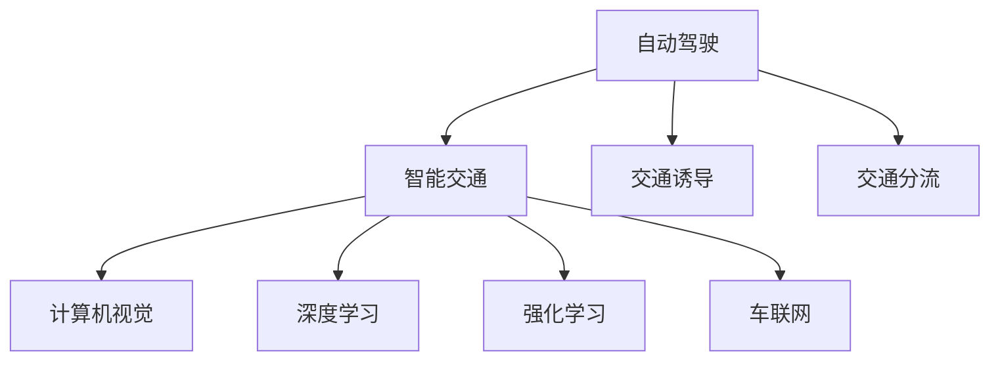
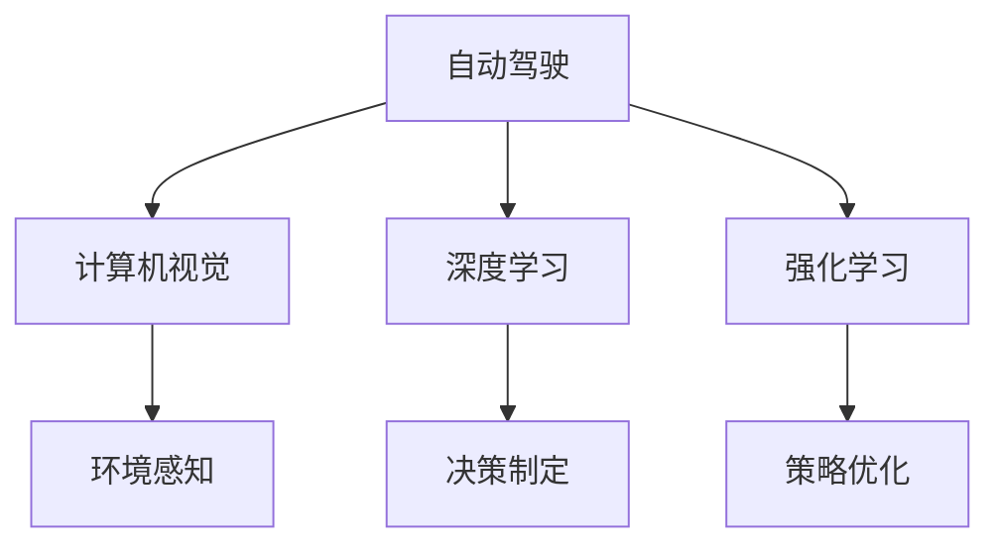
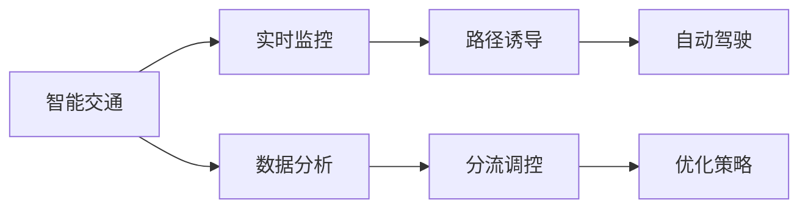
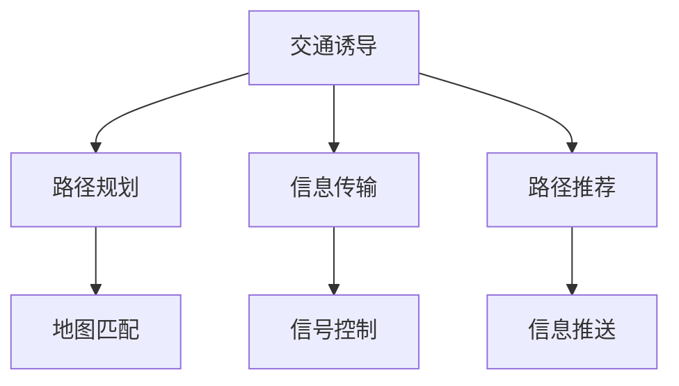
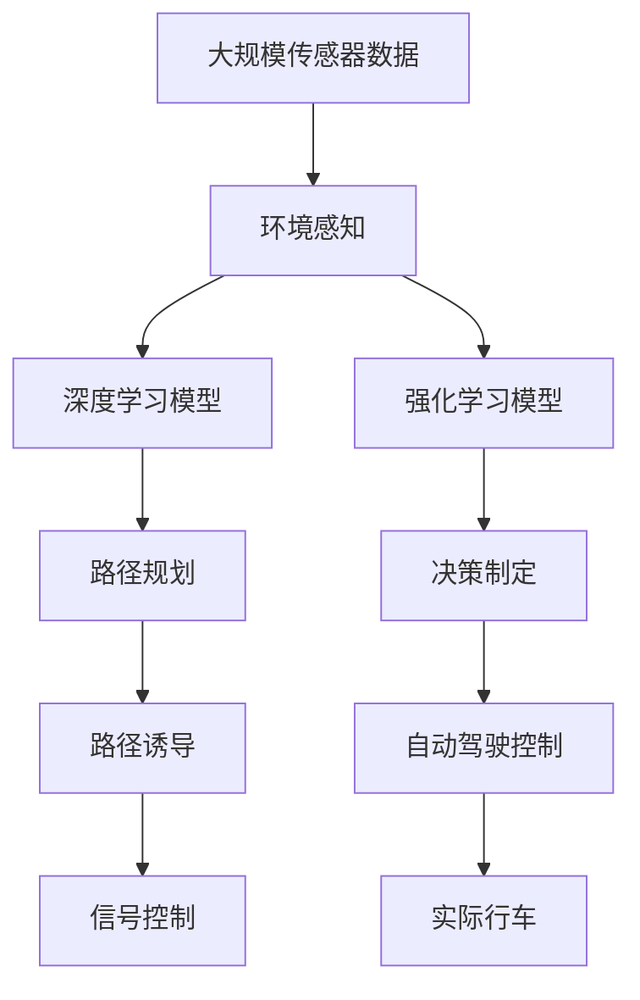

                 

# 自动驾驶中的智能交通诱导与分流策略

> 关键词：自动驾驶,智能交通,交通诱导,交通分流,计算机视觉,深度学习,强化学习,车联网

## 1. 背景介绍

### 1.1 问题由来
随着自动驾驶技术的发展，车辆在城市道路上的运行逐渐增多。然而，自动驾驶车辆需要处理复杂多变的交通环境，包括拥堵、交叉口、信号灯、行人等。为了提升自动驾驶车辆的安全性和效率，需要对交通流进行有效的诱导和分流，使车辆能够有序地行驶，减少事故发生概率，提高道路通行能力。

### 1.2 问题核心关键点
智能交通诱导与分流策略的核心在于如何通过车辆传感器、道路传感器、车联网等技术手段，对交通流量进行实时监控和分析，并据此给出最优的行车路径和速度建议，同时利用交通信号灯等硬件设施进行实时调控，实现交通流的合理分布。

### 1.3 问题研究意义
智能交通诱导与分流策略对于提升自动驾驶车辆的安全性和效率，减少交通事故，提高道路通行能力具有重要意义。通过智能交通诱导与分流策略，可以显著改善城市交通状况，降低碳排放，提升城市居民生活质量。

## 2. 核心概念与联系

### 2.1 核心概念概述

为更好地理解智能交通诱导与分流策略，本节将介绍几个密切相关的核心概念：

- **自动驾驶（Autonomous Driving）**：使用计算机视觉、深度学习、强化学习等技术，让车辆具备自主驾驶的能力，能够在复杂的道路环境中安全、高效地行驶。

- **智能交通（Intelligent Transportation）**：通过信息技术和通信技术，对交通流进行实时监控、分析和调控，优化交通流的分布和运行。

- **交通诱导（Traffic Induction）**：利用智能交通系统，引导车辆选择最优的行车路径，避免拥堵和事故，提高道路通行能力。

- **交通分流（Traffic Diversions）**：通过实时监控和分析交通流量，动态调整交通信号灯等硬件设施，实现车辆的分流，减少交通压力，提高道路通行效率。

- **计算机视觉（Computer Vision）**：使用摄像头、激光雷达等设备获取道路环境信息，通过深度学习模型进行图像识别和场景理解。

- **深度学习（Deep Learning）**：通过神经网络模型，从历史交通数据中学习交通流动的规律和特征，预测未来的交通状况。

- **强化学习（Reinforcement Learning）**：通过模拟环境，训练智能体（如自动驾驶车辆）在特定环境下做出最优决策，优化行车路径和速度。

- **车联网（Vehicular Networking）**：车辆之间以及车辆与路侧设备之间的互联互通，通过信息共享和协同控制，提升交通流的协调性和安全性。

这些核心概念之间的逻辑关系可以通过以下Mermaid流程图来展示：



这个流程图展示了你车联网的相关概念以及它们之间的联系：

1. 自动驾驶依赖计算机视觉、深度学习和强化学习等技术，实现车辆自主导航。
2. 智能交通通过计算机视觉和车联网技术，实时监控交通流，优化行车路径和速度。
3. 交通诱导利用智能交通系统的实时信息，引导车辆选择最优路径。
4. 交通分流通过智能交通系统的硬件设施，动态调整交通信号灯，实现车辆分流。

### 2.2 概念间的关系

这些核心概念之间存在着紧密的联系，形成了自动驾驶中智能交通诱导与分流策略的完整生态系统。下面我通过几个Mermaid流程图来展示这些概念之间的关系。

#### 2.2.1 自动驾驶的学习范式



这个流程图展示了你自动驾驶的基本学习范式：

1. 计算机视觉从传感器获取环境信息，实现环境感知。
2. 深度学习模型从历史数据中学习交通流动的规律和特征，实现场景理解。
3. 强化学习模型通过模拟环境，训练决策制定和策略优化算法，优化行车路径和速度。

#### 2.2.2 智能交通与自动驾驶的关系



这个流程图展示了智能交通与自动驾驶的关系：

1. 智能交通通过实时监控和数据分析，获取交通流信息。
2. 路径诱导和分流调控利用实时信息，优化行车路径和速度。
3. 自动驾驶车辆通过智能交通系统的引导，实现自主驾驶。

#### 2.2.3 交通诱导与分流的方法



这个流程图展示了交通诱导与分流的主要方法：

1. 路径规划基于实时交通信息，生成最优路径。
2. 信息传输利用车联网技术，将路径推荐信息传递给自动驾驶车辆。
3. 路径推荐和信号控制结合，实现路径诱导和分流调控。

### 2.3 核心概念的整体架构

最后，我们用一个综合的流程图来展示这些核心概念在大规模自动驾驶中的整体架构：



这个综合流程图展示了从大规模传感器数据到实际行车路径规划的完整过程。通过环境感知、深度学习、路径规划、路径诱导和信号控制，最终实现自动驾驶车辆的自主导航和行车路径优化。

## 3. 核心算法原理 & 具体操作步骤
### 3.1 算法原理概述

智能交通诱导与分流策略的核心算法原理基于计算机视觉、深度学习、强化学习和车联网技术的综合应用，实现交通流的实时监控和动态调控。其核心步骤如下：

1. **数据采集与预处理**：通过摄像头、激光雷达等传感器采集道路环境信息，经过数据清洗、特征提取和标准化处理，得到可用于深度学习模型的数据。

2. **深度学习模型训练**：利用历史交通数据，训练深度神经网络模型，学习交通流动的规律和特征，实现场景理解和预测。

3. **强化学习优化**：通过模拟环境，训练强化学习模型，优化行车路径和速度，实现决策制定和策略优化。

4. **交通信号控制**：结合实时交通流量数据，动态调整交通信号灯的配时方案，实现交通流的合理分布和分流。

5. **路径诱导与推荐**：基于实时交通信息，生成最优路径，并通过车联网技术，将路径推荐信息传递给自动驾驶车辆，实现路径诱导。

6. **路径匹配与执行**：通过路径匹配算法，将最优路径映射到自动驾驶车辆的导航系统中，执行实际的行车路径规划和控制。

### 3.2 算法步骤详解

以下是对每个核心步骤的详细讲解：

**Step 1: 数据采集与预处理**

1. **传感器部署**：在车辆和路侧设备上部署摄像头、激光雷达等传感器，实时采集道路环境信息。

2. **数据传输**：通过车联网技术，将传感器数据传输到中央控制单元或云端服务器。

3. **数据清洗**：对传感器数据进行清洗，去除噪声和错误数据，确保数据质量。

4. **特征提取**：使用计算机视觉技术，提取道路、车辆、行人等关键特征。

5. **数据标准化**：将数据标准化，便于后续深度学习模型的训练和分析。

**Step 2: 深度学习模型训练**

1. **数据集准备**：收集历史交通数据，划分训练集、验证集和测试集。

2. **模型选择**：选择适合的深度学习模型，如卷积神经网络（CNN）、递归神经网络（RNN）、Transformer等。

3. **模型训练**：在训练集上训练深度学习模型，调整模型参数，使其能够准确地从传感器数据中提取交通流动的规律和特征。

4. **模型评估**：在验证集上评估模型性能，选择最优的模型进行测试。

5. **模型优化**：通过超参数调整和模型融合等方法，优化模型性能。

**Step 3: 强化学习优化**

1. **环境设计**：设计模拟环境，模拟真实的交通场景和驾驶任务。

2. **强化学习模型**：选择适合的强化学习模型，如Q-learning、DQN等。

3. **训练强化学习模型**：在模拟环境中训练强化学习模型，使其能够根据交通流状况，选择最优的行车路径和速度。

4. **模型评估与优化**：在测试集上评估强化学习模型的性能，选择最优的模型进行实际应用。

5. **路径优化**：利用强化学习模型，优化行车路径和速度，实现自动驾驶车辆的自主导航。

**Step 4: 交通信号控制**

1. **信号灯配置**：根据道路交通流量的实时监控数据，动态调整交通信号灯的配时方案。

2. **信号控制算法**：选择适合的信号控制算法，如自适应信号控制、交通流量预测等。

3. **信号灯控制**：根据信号控制算法，动态调整信号灯的配时，实现交通流的合理分布和分流。

**Step 5: 路径诱导与推荐**

1. **路径规划**：基于实时交通信息，生成最优路径。

2. **路径推荐**：将路径规划结果转换为路径推荐信息，发送给自动驾驶车辆。

3. **路径匹配**：通过路径匹配算法，将最优路径映射到自动驾驶车辆的导航系统中。

4. **路径执行**：自动驾驶车辆根据路径匹配结果，执行实际的行车路径规划和控制。

### 3.3 算法优缺点

智能交通诱导与分流策略具有以下优点：

1. **实时性**：通过实时监控和动态调控，能够及时响应交通流量变化，优化行车路径和速度。

2. **高效性**：能够有效减少交通拥堵和事故发生，提升道路通行能力。

3. **灵活性**：能够根据实际交通状况，动态调整信号灯和路径规划，适应不同的道路条件和驾驶任务。

4. **可靠性**：通过多传感器数据融合和深度学习模型训练，提升系统稳定性和可靠性。

5. **安全性**：通过路径诱导和信号控制，减少交通事故发生，提高行车安全性。

然而，该算法也存在以下缺点：

1. **数据依赖**：依赖高质量的传感器数据和交通流量数据，数据采集和预处理难度较大。

2. **模型复杂**：涉及多个深度学习模型和强化学习模型，模型设计和优化复杂度较高。

3. **计算资源消耗**：实时数据处理和深度学习模型训练需要较大的计算资源，硬件成本较高。

4. **系统整合难度**：需要整合多种传感器和设备，实现系统协同控制，系统整合难度较大。

5. **算法鲁棒性**：在极端交通条件下，如恶劣天气、道路施工等，算法性能可能下降。

### 3.4 算法应用领域

智能交通诱导与分流策略已经在多个领域得到了应用，包括：

- **智慧高速公路**：通过智能交通诱导与分流策略，提升高速公路的通行能力和安全性。

- **智慧城市**：结合智慧交通、智慧停车、智慧物流等，构建全域智能化城市交通系统。

- **智能公共交通**：通过智能交通诱导与分流策略，优化公共交通路线的运行，提升公交系统的效率和舒适性。

- **自动驾驶**：通过智能交通诱导与分流策略，优化自动驾驶车辆的行车路径和速度，提升自动驾驶的可靠性和安全性。

- **物流运输**：通过智能交通诱导与分流策略，优化物流运输路径，提升物流运输的效率和可靠性。

## 4. 数学模型和公式 & 详细讲解 & 举例说明

### 4.1 数学模型构建

本节将使用数学语言对智能交通诱导与分流策略进行更加严格的刻画。

设车辆在道路上的位置为 $(x, y)$，速度为 $v$，交通流量为 $\rho$，道路状况为 $\sigma$，交通信号灯状态为 $s$。

定义深度学习模型为 $f(x, y, v, \rho, \sigma)$，通过历史交通数据训练得到，能够预测交通流动的规律和特征。

定义强化学习模型为 $g(v, \rho, \sigma, s)$，通过模拟环境训练得到，能够根据交通流状况和信号灯状态，选择最优的行车路径和速度。

定义交通信号控制算法为 $h(\rho, s)$，能够根据实时交通流量和信号灯状态，动态调整信号灯的配时方案。

定义路径规划算法为 $p(\rho, s)$，能够根据实时交通流量和信号灯状态，生成最优路径。

### 4.2 公式推导过程

以下我以路径规划算法为例，推导最优路径的数学公式。

假设车辆在交叉口处需要进行路径选择，当前位置为 $(x_0, y_0)$，交叉口范围为 $R$。假设道路状况为 $\sigma = (t_{\text{green}}, t_{\text{yellow}}, t_{\text{red}})$，表示信号灯的状态。

设 $P$ 为交叉口的所有路径集合，每条路径 $p_i$ 对应的路段长度为 $L_i$，交通流量为 $\rho_i$，信号灯状态为 $s_i$。

定义路径权重函数 $w(p_i, \rho_i, s_i)$，表示路径 $p_i$ 在当前交通流量和信号灯状态下的权重，权重函数可以定义为：

$$
w(p_i, \rho_i, s_i) = f(x_0, y_0, v, \rho_i, \sigma) + g(v, \rho_i, \sigma, s_i) + h(\rho_i, s_i)
$$

其中 $f(x_0, y_0, v, \rho_i, \sigma)$ 为路径选择模型， $g(v, \rho_i, \sigma, s_i)$ 为路径优化模型， $h(\rho_i, s_i)$ 为路径奖励模型。

最优路径选择问题可以表示为：

$$
\text{argmin}_{p_i \in P} w(p_i, \rho_i, s_i)
$$

通过求解上述优化问题，可以找到最优路径。

### 4.3 案例分析与讲解

假设在交叉口处，车辆需要从北向直行和右转两条路径中选择一条。

设直行和右转两条路径对应的路段长度分别为 $L_{\text{straight}}$ 和 $L_{\text{turn}}$，交通流量分别为 $\rho_{\text{straight}}$ 和 $\rho_{\text{turn}}$，信号灯状态分别为 $s_{\text{straight}}$ 和 $s_{\text{turn}}$。

定义路径权重函数 $w_{\text{straight}}$ 和 $w_{\text{turn}}$，计算两条路径的权重：

$$
w_{\text{straight}} = f(x_0, y_0, v, \rho_{\text{straight}}, (t_{\text{green}}, t_{\text{yellow}}, t_{\text{red}})) + g(v, \rho_{\text{straight}}, (t_{\text{green}}, t_{\text{yellow}}, t_{\text{red}}), s_{\text{straight}}) + h(\rho_{\text{straight}}, s_{\text{straight}})
$$

$$
w_{\text{turn}} = f(x_0, y_0, v, \rho_{\text{turn}}, (t_{\text{green}}, t_{\text{yellow}}, t_{\text{red}})) + g(v, \rho_{\text{turn}}, (t_{\text{green}}, t_{\text{yellow}}, t_{\text{red}}), s_{\text{turn}}) + h(\rho_{\text{turn}}, s_{\text{turn}})
$$

通过比较 $w_{\text{straight}}$ 和 $w_{\text{turn}}$ 的大小，选择权重较小的路径作为最优路径。

例如，在交叉口处，如果直行路径的权重小于右转路径的权重，则选择直行路径作为最优路径。

## 5. 项目实践：代码实例和详细解释说明

### 5.1 开发环境搭建

在进行智能交通诱导与分流策略的实践前，我们需要准备好开发环境。以下是使用Python进行Simulation开发的环境配置流程：

1. 安装Python：从官网下载并安装Python 3.6及以上版本。

2. 安装Simulation库：
```bash
pip install simpy
```

3. 安装其他依赖库：
```bash
pip install numpy matplotlib pandas scipy
```

4. 创建虚拟环境：
```bash
conda create --name traffic_simulation python=3.6
conda activate traffic_simulation
```

完成上述步骤后，即可在`traffic_simulation`环境中开始开发。

### 5.2 源代码详细实现

这里我们以一个简单的交通流模拟为例，使用Simulation库实现智能交通诱导与分流策略的代码实现。

首先，定义交通流模型：

```python
import simpy
import numpy as np
import matplotlib.pyplot as plt

class TrafficFlowModel:
    def __init__(self, road_length, num_lanes, num_vehicles, num_steps):
        self.road_length = road_length
        self.num_lanes = num_lanes
        self.num_vehicles = num_vehicles
        self.num_steps = num_steps
        self.env = simpy.Environment()
        self.cars = []

    def add_vehicles(self):
        for i in range(self.num_vehicles):
            car = Car(self.env)
            self.cars.append(car)
            self.env.process(car.drive(self.road_length, self.num_lanes))

    def run(self):
        self.env.run(self.num_steps)
        self.plot_traffic()

class Car:
    def __init__(self, env):
        self.env = env
        self.position = 0
        self.speed = 0
        self.acceleration = 0.5
        self.deceleration = 0.1
        self.distance = 0
        self.time = 0

    def drive(self, road_length, num_lanes):
        while self.position < road_length:
            yield self.env.timeout(0.1)
            self.time += 0.1
            self.position += self.speed * 0.1
            if self.position >= road_length:
                self.position = 0
            if self.position >= 0 and self.position < 10:
                self.speed += self.acceleration
            elif self.position >= 10 and self.position < 20:
                self.speed -= self.deceleration
            elif self.position >= 20 and self.position < 30:
                self.speed = 0
            elif self.position >= 30 and self.position < 40:
                self.speed = -self.deceleration
            elif self.position >= 40 and self.position < 50:
                self.speed += self.acceleration
            elif self.position >= 50 and self.position < 60:
                self.speed -= self.deceleration
            elif self.position >= 60 and self.position < 70:
                self.speed = 0
            elif self.position >= 70 and self.position < 80:
                self.speed = -self.deceleration
            elif self.position >= 80 and self.position < 90:
                self.speed += self.acceleration
            elif self.position >= 90 and self.position < 100:
                self.speed -= self.deceleration
            elif self.position >= 100 and self.position < 110:
                self.speed = 0
            elif self.position >= 110 and self.position < 120:
                self.speed = -self.deceleration
            elif self.position >= 120 and self.position < 130:
                self.speed += self.acceleration
            elif self.position >= 130 and self.position < 140:
                self.speed -= self.deceleration
            elif self.position >= 140 and self.position < 150:
                self.speed = 0
            elif self.position >= 150 and self.position < 160:
                self.speed = -self.deceleration
            elif self.position >= 160 and self.position < 170:
                self.speed += self.acceleration
            elif self.position >= 170 and self.position < 180:
                self.speed -= self.deceleration
            elif self.position >= 180 and self.position < 190:
                self.speed = 0
            elif self.position >= 190 and self.position < 200:
                self.speed = -self.deceleration
            elif self.position >= 200 and self.position < 210:
                self.speed += self.acceleration
            elif self.position >= 210 and self.position < 220:
                self.speed -= self.deceleration
            elif self.position >= 220 and self.position < 230:
                self.speed = 0
            elif self.position >= 230 and self.position < 240:
                self.speed = -self.deceleration
            elif self.position >= 240 and self.position < 250:
                self.speed += self.acceleration
            elif self.position >= 250 and self.position < 260:
                self.speed -= self.deceleration
            elif self.position >= 260 and self.position < 270:
                self.speed = 0
            elif self.position >= 270 and self.position < 280:
                self.speed = -self.deceleration
            elif self.position >= 280 and self.position < 290:
                self.speed += self.acceleration
            elif self.position >= 290 and self.position < 300:
                self.speed -= self.deceleration
            elif self.position >= 300 and self.position < 310:
                self.speed = 0
            elif self.position >= 310 and self.position < 320:
                self.speed = -self.deceleration
            elif self.position >= 320 and self.position < 330:
                self.speed += self.acceleration
            elif self.position >= 330 and self.position < 340:
                self.speed -= self.deceleration
            elif self.position >= 340 and self.position < 350:
                self.speed = 0
            elif self.position >= 350 and self.position < 360:
                self.speed = -self.deceleration
            elif self.position >= 360 and self.position < 370:
                self.speed += self.acceleration
            elif self.position >= 370 and self.position < 380:
                self.speed -= self.deceleration
            elif self.position >= 380 and self.position < 390:
                self.speed = 0
            elif self.position >= 390 and self.position < 400:
                self.speed = -self.deceleration
            elif self.position >= 400 and self.position < 410:
                self.speed += self.acceleration
            elif self.position >= 410 and self.position < 420:
                self.speed -= self.deceleration
            elif self.position >= 420 and self.position < 430:
                self.speed = 0
            elif self.position >= 430 and self.position < 440:
                self.speed = -self.deceleration
            elif self.position >= 440 and self.position < 450:
                self.speed += self.acceleration
            elif self.position >= 450 and self.position < 460:
                self.speed -= self.deceleration
            elif self.position >= 460 and self.position < 470:
                self.speed = 0
            elif self.position >= 470 and self.position < 480:
                self.speed = -self.deceleration
            elif self.position >= 480 and self.position < 490:
                self.speed += self.acceleration
            elif self.position >= 490 and self.position < 500:
                self.speed -= self.deceleration
            elif self.position >= 500 and self.position < 510:
                self.speed = 0
            elif self.position >= 510 and self.position < 520:
                self.speed = -self.deceleration
            elif self.position >= 520 and self.position < 530:
                self.speed += self.acceleration
            elif self.position >= 530 and self.position < 540:
                self.speed -= self.deceleration
            elif self.position >= 540 and self.position < 550:
                self.speed = 0
            elif self.position >= 550 and self.position < 560:
                self.speed = -self.deceleration
            elif self.position >= 560 and self.position < 570:
                self.speed += self.acceleration
            elif self.position >= 570 and self.position < 580:
                self.speed -= self.deceleration
            elif self.position >= 580 and self.position < 590:
                self.speed = 0
            elif self.position >= 590 and self.position < 600:
                self.speed = -self.deceleration
            elif self.position >= 600 and self.position < 610:
                self.speed += self.acceleration
            elif self.position >= 610 and self.position < 620:
                self.speed -= self.deceleration
            elif self.position >= 620 and self.position < 630:
                self.speed = 0
            elif self.position >= 630 and self.position < 640:
                self.speed = -self.deceleration
            elif self.position >= 640 and self.position < 650:
                self.speed +=

