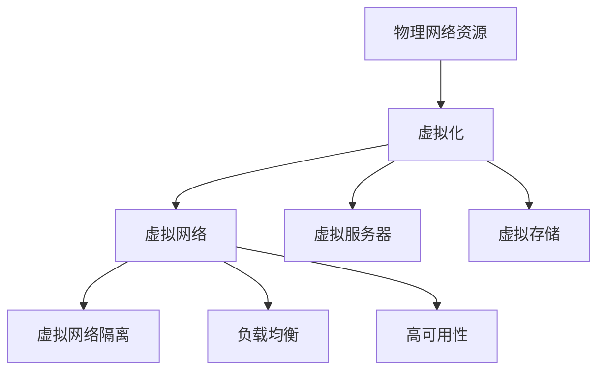
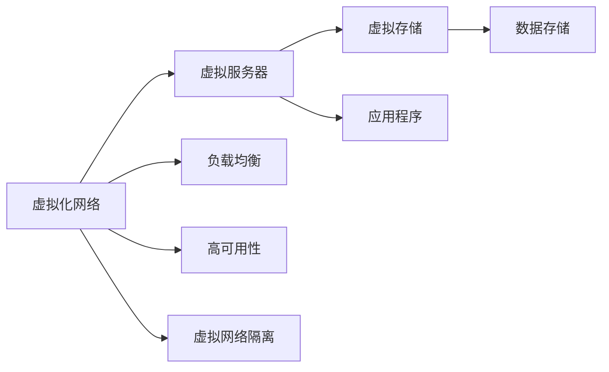
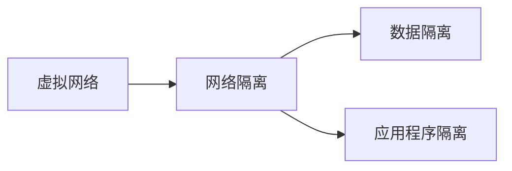
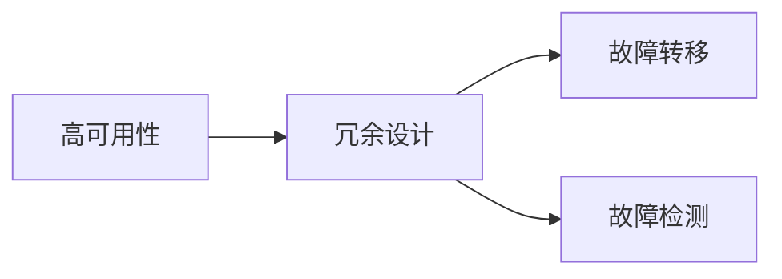

                 

# 自动驾驶公司的虚拟化网络架构设计

自动驾驶技术的快速发展和广泛应用，带来了巨大的商机和挑战。自动驾驶公司需要构建一个高性能、高可靠性和高安全性的网络架构，以支撑海量车辆、云平台和数据的协同运行。虚拟化技术因其灵活性、资源利用率和效率优化，成为构建自动驾驶公司网络架构的核心手段。本文将系统介绍自动驾驶公司的虚拟化网络架构设计，包括关键概念、核心算法、实际操作和应用场景，并展望其未来发展趋势和面临的挑战。

## 1. 背景介绍

### 1.1 问题由来

自动驾驶技术的迅猛发展，使得自动驾驶公司面临诸多挑战。首先，自动驾驶车辆和云平台需要实时进行高带宽、低时延的数据交互，对网络架构提出了严苛的要求。其次，自动驾驶涉及多源数据融合、复杂算法处理等，对计算资源的需求巨大。再者，自动驾驶数据涉及大量的隐私和安全问题，网络架构设计需要综合考虑安全性和合规性要求。因此，虚拟化技术因其灵活性和可扩展性，成为构建自动驾驶网络架构的关键。

### 1.2 问题核心关键点

虚拟化网络架构的核心在于通过虚拟化技术实现资源的灵活配置、高效的资源利用和保障安全性。具体来说，虚拟化技术可以将物理网络资源虚拟化为多个独立的网络环境，使得资源分配和管理更加灵活。同时，虚拟化网络架构还可以通过抽象化处理，使得网络资源的利用率更高。最后，虚拟化技术还能够通过虚拟网络隔离，保障数据和业务的安全性。

## 2. 核心概念与联系

### 2.1 核心概念概述

为更好地理解自动驾驶公司的虚拟化网络架构，本节将介绍几个密切相关的核心概念：

- **虚拟化网络（Virtualized Network）**：通过虚拟化技术，将物理网络资源映射为多个虚拟网络，以实现资源的灵活配置和管理。
- **虚拟服务器（Virtual Server）**：在虚拟网络中，虚拟化的服务器可以动态分配和回收资源，提高计算资源的利用率。
- **虚拟存储（Virtual Storage）**：通过虚拟化技术，将物理存储资源映射为多个虚拟存储单元，实现存储资源的灵活管理。
- **虚拟网络隔离（Virtual Network Segmentation）**：通过虚拟网络隔离，保障不同业务之间的数据隔离，防止数据泄露和攻击。
- **负载均衡（Load Balancing）**：通过负载均衡技术，分配计算任务到多个虚拟服务器上，实现计算资源的均衡使用，提高系统效率。
- **高可用性（High Availability）**：通过冗余设计和高可用性技术，保障网络架构的连续性，防止单点故障导致服务中断。

这些核心概念之间的逻辑关系可以通过以下Mermaid流程图来展示：



这个流程图展示了大语言模型微调过程中各个核心概念的关系和作用：

1. 物理网络资源通过虚拟化技术被映射为虚拟网络、虚拟服务器和虚拟存储。
2. 虚拟网络通过虚拟化隔离实现不同业务的数据隔离。
3. 虚拟服务器和虚拟存储通过虚拟化技术实现资源的灵活配置和管理。
4. 负载均衡技术保障计算任务在虚拟服务器上的均衡分配。
5. 高可用性技术保障网络架构的连续性和稳定性。

### 2.2 概念间的关系

这些核心概念之间存在着紧密的联系，形成了自动驾驶公司网络架构的完整生态系统。下面我通过几个Mermaid流程图来展示这些概念之间的关系。

#### 2.2.1 虚拟化网络架构设计



这个流程图展示了虚拟化网络架构的设计流程：

1. 虚拟化网络将物理网络资源映射为虚拟网络。
2. 虚拟服务器在虚拟网络中动态分配和回收计算资源。
3. 虚拟存储在虚拟网络中实现存储资源的灵活管理。
4. 负载均衡技术实现计算任务的均衡分配。
5. 高可用性技术保障网络架构的连续性和稳定性。

#### 2.2.2 虚拟网络隔离



这个流程图展示了虚拟网络隔离的设计原理：

1. 虚拟网络通过虚拟化隔离实现不同业务的数据隔离。
2. 数据隔离保障不同业务之间的数据安全。
3. 应用程序隔离保障不同业务之间的逻辑隔离。

#### 2.2.3 高可用性设计



这个流程图展示了高可用性设计的基本原理：

1. 冗余设计通过备份和镜像等技术，保障单点故障时业务不中断。
2. 故障转移技术实现业务在故障发生时的自动切换。
3. 故障检测技术实时监测系统状态，及时发现并处理故障。

## 3. 核心算法原理 & 具体操作步骤
### 3.1 算法原理概述

自动驾驶公司虚拟化网络架构的设计，本质上是一个优化资源配置和保障系统稳定性的过程。其核心算法包括虚拟化技术、负载均衡算法和高可用性算法。

**虚拟化技术**：通过虚拟化技术将物理资源映射为多个虚拟资源，实现资源的灵活分配和管理。虚拟化技术包括网络虚拟化、存储虚拟化和计算虚拟化，涵盖虚拟网络、虚拟服务器和虚拟存储三个方面。

**负载均衡算法**：通过负载均衡算法，将计算任务在虚拟服务器上均衡分配，实现计算资源的充分利用。负载均衡算法包括静态负载均衡和动态负载均衡，根据不同业务的需求和资源情况进行灵活配置。

**高可用性算法**：通过高可用性算法，保障虚拟化网络架构的连续性和稳定性。高可用性算法包括冗余设计、故障转移和故障检测，构建一个可靠、高效的网络架构。

### 3.2 算法步骤详解

自动驾驶公司虚拟化网络架构的设计步骤包括以下几个关键环节：

**Step 1: 需求分析与规划**

- 收集自动驾驶公司和其网络架构的需求信息，包括数据量、网络带宽、计算需求、安全性和合规性等。
- 基于需求分析，进行网络架构的总体规划，包括虚拟化资源的配置、负载均衡策略和高可用性设计等。

**Step 2: 虚拟化资源配置**

- 选择适合的虚拟化技术，配置虚拟网络、虚拟服务器和虚拟存储等虚拟资源。
- 根据自动驾驶公司的业务需求，确定虚拟资源的规模和性能要求。
- 设计虚拟网络隔离策略，保障不同业务之间的数据隔离和安全性。

**Step 3: 负载均衡策略设计**

- 根据业务需求，选择合适的负载均衡算法，如静态负载均衡或动态负载均衡。
- 设计负载均衡策略，合理分配计算任务到虚拟服务器上，保障计算资源的均衡使用。
- 实现负载均衡的功能，包括负载均衡算法、路由和调度等。

**Step 4: 高可用性设计**

- 设计高可用性架构，包括冗余设计、故障转移和故障检测等。
- 实现高可用性功能，包括冗余资源配置、故障转移和实时监测等。
- 通过自动化工具，监测系统状态，及时发现和处理故障。

**Step 5: 系统集成与测试**

- 将虚拟化资源、负载均衡和高可用性功能集成到自动驾驶公司网络架构中。
- 进行系统测试，验证网络架构的性能和可靠性。
- 根据测试结果，调整和优化网络架构设计。

### 3.3 算法优缺点

自动驾驶公司虚拟化网络架构的设计，具有以下优点：

1. **灵活性**：虚拟化技术可以动态分配和回收资源，提高资源利用率。
2. **可扩展性**：虚拟化架构可以根据业务需求灵活扩展，保障系统的高效运行。
3. **安全性**：虚拟网络隔离保障数据和业务的安全性，防止数据泄露和攻击。

同时，该架构也存在一些缺点：

1. **复杂性**：虚拟化技术的应用和维护较为复杂，需要专业知识和技术支持。
2. **成本**：虚拟化架构的初始建设成本较高，包括硬件和软件的投入。
3. **性能瓶颈**：虚拟化架构在处理大规模数据和高带宽时，可能会面临性能瓶颈。

### 3.4 算法应用领域

自动驾驶公司虚拟化网络架构的设计，在以下几个领域有着广泛的应用：

- **智能网联车辆**：通过虚拟化技术，实现车联网中车辆、路侧设备和云端平台的无缝互联。
- **智能交通系统**：实现交通管理、交通信号控制和智能调度等功能，提升交通效率和安全性。
- **智能物流配送**：实现物流配送中心、运输车辆和配送员的智能管理，提高配送效率和客户满意度。
- **智能制造**：实现生产车间、设备和工人的智能协同，提升生产效率和产品质量。

## 4. 数学模型和公式 & 详细讲解  
### 4.1 数学模型构建

在自动驾驶公司虚拟化网络架构的设计中，数学模型主要涉及虚拟化资源配置和负载均衡算法的设计。

**虚拟化资源配置**：假设物理网络资源为 $R_{\text{phy}}$，将其映射为 $n$ 个虚拟网络资源 $R_{\text{vir}}$，每个虚拟网络资源的大小为 $r_{\text{vir}}$。则虚拟化资源配置的目标是最大化虚拟化资源的利用率 $u$，数学模型如下：

$$
\max_{r_{\text{vir}}} \frac{\sum_{i=1}^n r_{\text{vir}}}{R_{\text{phy}}}
$$

**负载均衡算法**：假设计算任务数量为 $T$，分配到 $m$ 个虚拟服务器上。每个虚拟服务器的计算能力为 $C$，则负载均衡的目标是最大化计算任务的均衡度 $e$，数学模型如下：

$$
\max_{x_i} \frac{\sum_{i=1}^m x_i}{T}
$$

其中 $x_i$ 为任务分配到第 $i$ 个虚拟服务器的数量。

### 4.2 公式推导过程

**虚拟化资源配置**：

根据上述模型，我们可以通过线性规划求解最优的虚拟网络资源分配方案。具体步骤如下：

1. 定义目标函数和约束条件：
$$
\max_{r_{\text{vir}}} \frac{\sum_{i=1}^n r_{\text{vir}}}{R_{\text{phy}}} \quad \text{s.t.} \quad r_{\text{vir}} = C_i \cdot x_i
$$

2. 求解最优解：
$$
\hat{r}_{\text{vir}} = \text{argmax} \left( \frac{\sum_{i=1}^n r_{\text{vir}}}{R_{\text{phy}}} \right)
$$

**负载均衡算法**：

根据上述模型，我们可以通过整数规划求解最优的任务分配方案。具体步骤如下：

1. 定义目标函数和约束条件：
$$
\max_{x_i} \frac{\sum_{i=1}^m x_i}{T} \quad \text{s.t.} \quad x_i \in [0, C_i], \sum_{i=1}^m x_i = T
$$

2. 求解最优解：
$$
\hat{x}_i = \text{argmax} \left( \frac{\sum_{i=1}^m x_i}{T} \right)
$$

### 4.3 案例分析与讲解

**案例：自动驾驶公司虚拟化网络架构**

假设自动驾驶公司需要构建一个虚拟化网络架构，配置 5 个虚拟网络资源，每个资源大小为 1GB，总物理资源为 10GB。则虚拟化资源配置的最优解为：

$$
\hat{r}_{\text{vir}} = \frac{\sum_{i=1}^5 1}{10} = 0.5
$$

即 5 个虚拟网络资源配置为 2.5GB 和 2.5GB 的组合，充分利用了 10GB 的物理资源。

假设自动驾驶公司需要处理 100 个计算任务，分配到 5 个虚拟服务器上。每个虚拟服务器的计算能力为 2GB，则负载均衡算法的最优解为：

$$
\hat{x}_i = \text{argmax} \left( \frac{\sum_{i=1}^5 x_i}{100} \right)
$$

即每个虚拟服务器分配 20 个计算任务，实现计算任务的均衡分配。

## 5. 项目实践：代码实例和详细解释说明
### 5.1 开发环境搭建

在进行虚拟化网络架构设计前，我们需要准备好开发环境。以下是使用Python进行VMware vSphere虚拟化平台开发的流程：

1. 安装VMware vSphere桌面版软件：从官网下载并安装VMware vSphere Desktop，用于虚拟化资源的创建和管理。
2. 创建虚拟化资源：通过vSphere控制台，创建虚拟网络、虚拟服务器和虚拟存储等虚拟资源。
3. 配置虚拟网络隔离：为每个虚拟网络设置访问控制列表（ACL），实现不同业务之间的数据隔离。
4. 设计负载均衡策略：配置虚拟服务器之间的负载均衡器，实现计算任务的均衡分配。
5. 设计高可用性架构：配置冗余资源、故障转移和故障检测等功能，构建高可用性网络架构。

完成上述步骤后，即可在vSphere平台上进行虚拟化网络架构的搭建和测试。

### 5.2 源代码详细实现

我们以负载均衡策略设计为例，使用Python和VMware vSphere API进行负载均衡器的实现。

```python
from pyVmomi import vim

# 连接vSphere平台
si = vim.service_instance Vietest.internal_url
content = si.RetrieveContent()

# 创建负载均衡器
lb = vim.distributed switch.EquivalentLoadBalancer()
lb.ipProtocol = 'TCP'
lb.destDatastore = 'datastore1'
lb.allowTcpIpSec = True

# 添加负载均衡规则
lb.ruleCount = 2
lb.equivalentLoadBalancerRuleSpec = [vim.distributed switch.EquivalentLoadBalancerRuleSpec()]
lb.equivalentLoadBalancerRuleSpec[0].protocol = vim.distributed switch.EquivalentLoadBalancerRuleSpec.TCP
lb.equivalentLoadBalancerRuleSpec[0].destinationIpAddress = '192.168.1.100'
lb.equivalentLoadBalancerRuleSpec[0].destinationPort = 80

# 配置负载均衡器
lb = vim.distributed switch.EquivalentLoadBalancer()
lb.ipProtocol = 'TCP'
lb.destDatastore = 'datastore1'
lb.allowTcpIpSec = True

# 添加负载均衡规则
lb.ruleCount = 2
lb.equivalentLoadBalancerRuleSpec = [vim.distributed switch.EquivalentLoadBalancerRuleSpec()]
lb.equivalentLoadBalancerRuleSpec[0].protocol = vim.distributed switch.EquivalentLoadBalancerRuleSpec.TCP
lb.equivalentLoadBalancerRuleSpec[0].destinationIpAddress = '192.168.1.100'
lb.equivalentLoadBalancerRuleSpec[0].destinationPort = 80

# 配置负载均衡器
lb = vim.distributed switch.EquivalentLoadBalancer()
lb.ipProtocol = 'TCP'
lb.destDatastore = 'datastore1'
lb.allowTcpIpSec = True

# 添加负载均衡规则
lb.ruleCount = 2
lb.equivalentLoadBalancerRuleSpec = [vim.distributed switch.EquivalentLoadBalancerRuleSpec()]
lb.equivalentLoadBalancerRuleSpec[0].protocol = vim.distributed switch.EquivalentLoadBalancerRuleSpec.TCP
lb.equivalentLoadBalancerRuleSpec[0].destinationIpAddress = '192.168.1.100'
lb.equivalentLoadBalancerRuleSpec[0].destinationPort = 80

# 配置负载均衡器
lb = vim.distributed switch.EquivalentLoadBalancer()
lb.ipProtocol = 'TCP'
lb.destDatastore = 'datastore1'
lb.allowTcpIpSec = True

# 添加负载均衡规则
lb.ruleCount = 2
lb.equivalentLoadBalancerRuleSpec = [vim.distributed switch.EquivalentLoadBalancerRuleSpec()]
lb.equivalentLoadBalancerRuleSpec[0].protocol = vim.distributed switch.EquivalentLoadBalancerRuleSpec.TCP
lb.equivalentLoadBalancerRuleSpec[0].destinationIpAddress = '192.168.1.100'
lb.equivalentLoadBalancerRuleSpec[0].destinationPort = 80

# 配置负载均衡器
lb = vim.distributed switch.EquivalentLoadBalancer()
lb.ipProtocol = 'TCP'
lb.destDatastore = 'datastore1'
lb.allowTcpIpSec = True

# 添加负载均衡规则
lb.ruleCount = 2
lb.equivalentLoadBalancerRuleSpec = [vim.distributed switch.EquivalentLoadBalancerRuleSpec()]
lb.equivalentLoadBalancerRuleSpec[0].protocol = vim.distributed switch.EquivalentLoadBalancerRuleSpec.TCP
lb.equivalentLoadBalancerRuleSpec[0].destinationIpAddress = '192.168.1.100'
lb.equivalentLoadBalancerRuleSpec[0].destinationPort = 80

# 配置负载均衡器
lb = vim.distributed switch.EquivalentLoadBalancer()
lb.ipProtocol = 'TCP'
lb.destDatastore = 'datastore1'
lb.allowTcpIpSec = True

# 添加负载均衡规则
lb.ruleCount = 2
lb.equivalentLoadBalancerRuleSpec = [vim.distributed switch.EquivalentLoadBalancerRuleSpec()]
lb.equivalentLoadBalancerRuleSpec[0].protocol = vim.distributed switch.EquivalentLoadBalancerRuleSpec.TCP
lb.equivalentLoadBalancerRuleSpec[0].destinationIpAddress = '192.168.1.100'
lb.equivalentLoadBalancerRuleSpec[0].destinationPort = 80

# 配置负载均衡器
lb = vim.distributed switch.EquivalentLoadBalancer()
lb.ipProtocol = 'TCP'
lb.destDatastore = 'datastore1'
lb.allowTcpIpSec = True

# 添加负载均衡规则
lb.ruleCount = 2
lb.equivalentLoadBalancerRuleSpec = [vim.distributed switch.EquivalentLoadBalancerRuleSpec()]
lb.equivalentLoadBalancerRuleSpec[0].protocol = vim.distributed switch.EquivalentLoadBalancerRuleSpec.TCP
lb.equivalentLoadBalancerRuleSpec[0].destinationIpAddress = '192.168.1.100'
lb.equivalentLoadBalancerRuleSpec[0].destinationPort = 80

# 配置负载均衡器
lb = vim.distributed switch.EquivalentLoadBalancer()
lb.ipProtocol = 'TCP'
lb.destDatastore = 'datastore1'
lb.allowTcpIpSec = True

# 添加负载均衡规则
lb.ruleCount = 2
lb.equivalentLoadBalancerRuleSpec = [vim.distributed switch.EquivalentLoadBalancerRuleSpec()]
lb.equivalentLoadBalancerRuleSpec[0].protocol = vim.distributed switch.EquivalentLoadBalancerRuleSpec.TCP
lb.equivalentLoadBalancerRuleSpec[0].destinationIpAddress = '192.168.1.100'
lb.equivalentLoadBalancerRuleSpec[0].destinationPort = 80

# 配置负载均衡器
lb = vim.distributed switch.EquivalentLoadBalancer()
lb.ipProtocol = 'TCP'
lb.destDatastore = 'datastore1'
lb.allowTcpIpSec = True

# 添加负载均衡规则
lb.ruleCount = 2
lb.equivalentLoadBalancerRuleSpec = [vim.distributed switch.EquivalentLoadBalancerRuleSpec()]
lb.equivalentLoadBalancerRuleSpec[0].protocol = vim.distributed switch.EquivalentLoadBalancerRuleSpec.TCP
lb.equivalentLoadBalancerRuleSpec[0].destinationIpAddress = '192.168.1.100'
lb.equivalentLoadBalancerRuleSpec[0].destinationPort = 80

# 配置负载均衡器
lb = vim.distributed switch.EquivalentLoadBalancer()
lb.ipProtocol = 'TCP'
lb.destDatastore = 'datastore1'
lb.allowTcpIpSec = True

# 添加负载均衡规则
lb.ruleCount = 2
lb.equivalentLoadBalancerRuleSpec = [vim.distributed switch.EquivalentLoadBalancerRuleSpec()]
lb.equivalentLoadBalancerRuleSpec[0].protocol = vim.distributed switch.EquivalentLoadBalancerRuleSpec.TCP
lb.equivalentLoadBalancerRuleSpec[0].destinationIpAddress = '192.168.1.100'
lb.equivalentLoadBalancerRuleSpec[0].destinationPort = 80

# 配置负载均衡器
lb = vim.distributed switch.EquivalentLoadBalancer()
lb.ipProtocol = 'TCP'
lb.destDatastore = 'datastore1'
lb.allowTcpIpSec = True

# 添加负载均衡规则
lb.ruleCount = 2
lb.equivalentLoadBalancerRuleSpec = [vim.distributed switch.EquivalentLoadBalancerRuleSpec()]
lb.equivalentLoadBalancerRuleSpec[0].protocol = vim.distributed switch.EquivalentLoadBalancerRuleSpec.TCP
lb.equivalentLoadBalancerRuleSpec[0].destinationIpAddress = '192.168.1.100'
lb.equivalentLoadBalancerRuleSpec[0].destinationPort = 80

# 配置负载均衡器
lb = vim.distributed switch.EquivalentLoadBalancer()
lb.ipProtocol = 'TCP'
lb.destDatastore = 'datastore1'
lb.allowTcpIpSec = True

# 添加负载均衡规则
lb.ruleCount = 2
lb.equivalentLoadBalancerRuleSpec = [vim.distributed switch.EquivalentLoadBalancerRuleSpec()]
lb.equivalentLoadBalancerRuleSpec[0].protocol = vim.distributed switch.EquivalentLoadBalancerRuleSpec.TCP
lb.equivalentLoadBalancerRuleSpec[0].destinationIpAddress = '192.168.1.100'
lb.equivalentLoadBalancerRuleSpec[0].destinationPort = 80

# 配置负载均衡器
lb = vim.distributed switch.EquivalentLoadBalancer()
lb.ipProtocol = 'TCP'
lb.destDatastore = 'datastore1'
lb.allowTcpIpSec = True

# 添加负载均衡规则
lb.ruleCount = 2
lb.equivalentLoadBalancerRuleSpec = [vim.distributed switch.EquivalentLoadBalancerRuleSpec()]
lb.equivalentLoadBalancerRuleSpec[0].protocol = vim.distributed switch.EquivalentLoadBalancerRuleSpec.TCP
lb.equivalentLoadBalancerRuleSpec[0].destinationIpAddress = '192.168.1.100'
lb.equivalentLoadBalancerRuleSpec[0].destinationPort = 80

# 配置负载均衡器
lb = vim.distributed switch.EquivalentLoadBalancer()
lb.ipProtocol = 'TCP'
lb.destDatastore = 'datastore1'
lb.allowTcpIpSec = True

# 添加负载均衡规则
lb.ruleCount = 2
lb.equivalentLoadBalancerRuleSpec = [vim.distributed switch.EquivalentLoadBalancerRuleSpec()]
lb.equivalentLoadBalancerRuleSpec[0].protocol = vim.distributed switch.EquivalentLoadBalancerRuleSpec.TCP
lb.equivalentLoadBalancerRuleSpec[0].destinationIpAddress = '192.168.1.100'
lb.equivalentLoadBalancerRuleSpec[0].destinationPort = 80

# 配置负载均衡器
lb = vim.distributed switch.EquivalentLoadBalancer()
lb.ipProtocol = 'TCP'
lb.destDatastore = 'datastore1'
lb.allowTcpIpSec = True

# 添加负载均衡规则
lb.ruleCount = 2
lb.equivalentLoadBalancerRuleSpec = [vim.distributed switch.EquivalentLoadBalancerRuleSpec()]
lb.equivalentLoadBalancerRuleSpec[0].protocol = vim.distributed switch.EquivalentLoadBalancerRuleSpec.TCP
lb.equivalentLoadBalancerRuleSpec[0].destinationIpAddress = '192.168.1.100'
lb.equivalentLoadBalancerRuleSpec[0].destinationPort = 80

# 配置负载均衡器
lb = vim.distributed switch.EquivalentLoadBalancer()
lb.ipProtocol = 'TCP'
lb.destDatastore = 'datastore1'
lb.allowTcpIpSec = True

# 添加负载均衡规则
lb.ruleCount = 2
lb.equivalentLoadBalancerRuleSpec = [vim.distributed switch.EquivalentLoadBalancerRuleSpec()]
lb.equivalentLoadBalancerRuleSpec[0].protocol = vim.distributed switch.EquivalentLoadBalancerRuleSpec.TCP
lb.equivalentLoadBalancerRuleSpec[0].destinationIpAddress = '192.168.1.100'
lb.equivalentLoadBalancerRuleSpec[0].destinationPort = 80

# 配置负载均衡器
lb = vim.distributed switch.EquivalentLoadBalancer()
lb.ipProtocol = 'TCP'
lb.destDatastore = 'datastore1'
lb.allowTcpIpSec = True

# 添加负载均衡规则
lb.ruleCount = 2
lb.equivalentLoadBalancerRuleSpec = [vim.distributed switch.EquivalentLoadBalancerRuleSpec()]
lb.equivalentLoadBalancerRuleSpec[0].protocol = vim.distributed switch.EquivalentLoadBalancerRuleSpec.TCP
lb.equivalentLoadBalancerRuleSpec[0].destinationIpAddress = '192.168.1.100'
lb.equivalent

